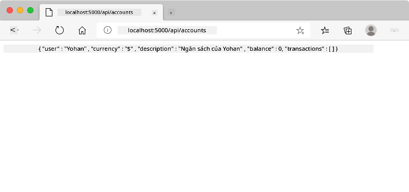
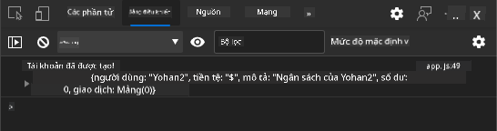
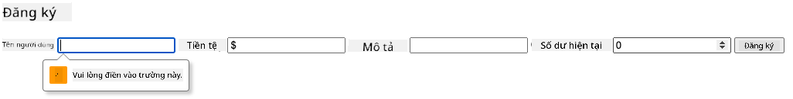
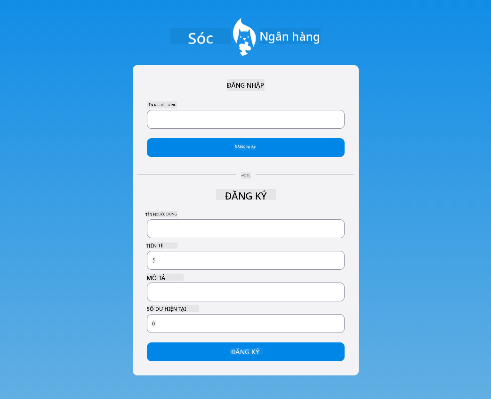

<!--
CO_OP_TRANSLATOR_METADATA:
{
  "original_hash": "b667b7d601e2ee19acb5aa9d102dc9f3",
  "translation_date": "2025-08-27T22:05:50+00:00",
  "source_file": "7-bank-project/2-forms/README.md",
  "language_code": "vi"
}
-->
# Xây dựng ứng dụng ngân hàng Phần 2: Tạo biểu mẫu đăng nhập và đăng ký

## Câu hỏi trước bài học

[Câu hỏi trước bài học](https://ff-quizzes.netlify.app/web/quiz/43)

### Giới thiệu

Trong hầu hết các ứng dụng web hiện đại, bạn có thể tạo tài khoản để có không gian riêng tư của mình. Vì nhiều người dùng có thể truy cập ứng dụng web cùng lúc, bạn cần một cơ chế để lưu trữ dữ liệu cá nhân của từng người dùng riêng biệt và chọn thông tin nào sẽ hiển thị. Chúng ta sẽ không đề cập đến cách quản lý [danh tính người dùng một cách an toàn](https://en.wikipedia.org/wiki/Authentication) vì đây là một chủ đề rộng lớn, nhưng chúng ta sẽ đảm bảo rằng mỗi người dùng có thể tạo một (hoặc nhiều) tài khoản ngân hàng trên ứng dụng của chúng ta.

Trong phần này, chúng ta sẽ sử dụng biểu mẫu HTML để thêm chức năng đăng nhập và đăng ký vào ứng dụng web. Chúng ta sẽ tìm hiểu cách gửi dữ liệu đến API máy chủ một cách lập trình và cuối cùng là cách xác định các quy tắc kiểm tra cơ bản cho dữ liệu đầu vào của người dùng.

### Điều kiện tiên quyết

Bạn cần hoàn thành phần [mẫu HTML và định tuyến](../1-template-route/README.md) của ứng dụng web cho bài học này. Bạn cũng cần cài đặt [Node.js](https://nodejs.org) và [chạy API máy chủ](../api/README.md) cục bộ để có thể gửi dữ liệu tạo tài khoản.

**Lưu ý**
Bạn sẽ cần chạy hai terminal cùng lúc như liệt kê dưới đây:
1. Cho ứng dụng ngân hàng chính mà chúng ta đã xây dựng trong bài học [mẫu HTML và định tuyến](../1-template-route/README.md)
2. Cho [API máy chủ ứng dụng ngân hàng](../api/README.md) mà chúng ta vừa thiết lập ở trên.

Bạn cần cả hai máy chủ hoạt động để tiếp tục theo dõi bài học. Chúng sẽ lắng nghe trên các cổng khác nhau (cổng `3000` và cổng `5000`) nên mọi thứ sẽ hoạt động ổn.

Bạn có thể kiểm tra xem máy chủ có chạy đúng không bằng cách thực hiện lệnh này trong terminal:

```sh
curl http://localhost:5000/api
# -> should return "Bank API v1.0.0" as a result
```

---

## Biểu mẫu và các điều khiển

Thẻ `<form>` bao gồm một phần của tài liệu HTML nơi người dùng có thể nhập và gửi dữ liệu thông qua các điều khiển tương tác. Có rất nhiều loại điều khiển giao diện người dùng (UI) có thể được sử dụng trong biểu mẫu, phổ biến nhất là thẻ `<input>` và `<button>`.

Có rất nhiều [loại](https://developer.mozilla.org/docs/Web/HTML/Element/input) của `<input>`, ví dụ để tạo một trường nơi người dùng có thể nhập tên đăng nhập, bạn có thể sử dụng:

```html
<input id="username" name="username" type="text">
```

Thuộc tính `name` sẽ được sử dụng làm tên thuộc tính khi dữ liệu biểu mẫu được gửi đi. Thuộc tính `id` được sử dụng để liên kết một thẻ `<label>` với điều khiển biểu mẫu.

> Hãy xem toàn bộ danh sách các [loại `<input>`](https://developer.mozilla.org/docs/Web/HTML/Element/input) và [các điều khiển biểu mẫu khác](https://developer.mozilla.org/docs/Learn/Forms/Other_form_controls) để có ý tưởng về tất cả các phần tử UI gốc mà bạn có thể sử dụng khi xây dựng giao diện của mình.

✅ Lưu ý rằng `<input>` là một [phần tử rỗng](https://developer.mozilla.org/docs/Glossary/Empty_element) mà bạn *không* nên thêm thẻ đóng tương ứng. Tuy nhiên, bạn có thể sử dụng cú pháp tự đóng `<input/>`, nhưng điều này không bắt buộc.

Thẻ `<button>` trong biểu mẫu có một chút đặc biệt. Nếu bạn không chỉ định thuộc tính `type`, nó sẽ tự động gửi dữ liệu biểu mẫu đến máy chủ khi được nhấn. Dưới đây là các giá trị `type` có thể:

- `submit`: Mặc định trong một `<form>`, nút kích hoạt hành động gửi biểu mẫu.
- `reset`: Nút đặt lại tất cả các điều khiển biểu mẫu về giá trị ban đầu.
- `button`: Không gán hành vi mặc định khi nút được nhấn. Bạn có thể gán các hành động tùy chỉnh cho nó bằng JavaScript.

### Nhiệm vụ

Hãy bắt đầu bằng cách thêm một biểu mẫu vào mẫu `login`. Chúng ta sẽ cần một trường *username* và một nút *Login*.

```html
<template id="login">
  <h1>Bank App</h1>
  <section>
    <h2>Login</h2>
    <form id="loginForm">
      <label for="username">Username</label>
      <input id="username" name="user" type="text">
      <button>Login</button>
    </form>
  </section>
</template>
```

Nếu bạn nhìn kỹ hơn, bạn sẽ nhận thấy rằng chúng ta cũng đã thêm một thẻ `<label>` ở đây. Thẻ `<label>` được sử dụng để thêm tên cho các điều khiển UI, chẳng hạn như trường tên đăng nhập của chúng ta. Nhãn rất quan trọng để tăng khả năng đọc của biểu mẫu, nhưng cũng mang lại các lợi ích bổ sung:

- Bằng cách liên kết nhãn với điều khiển biểu mẫu, nó giúp người dùng sử dụng công nghệ hỗ trợ (như trình đọc màn hình) hiểu dữ liệu mà họ cần cung cấp.
- Bạn có thể nhấp vào nhãn để trực tiếp đặt tiêu điểm vào điều khiển liên kết, giúp dễ dàng truy cập trên các thiết bị màn hình cảm ứng.

> [Khả năng truy cập](https://developer.mozilla.org/docs/Learn/Accessibility/What_is_accessibility) trên web là một chủ đề rất quan trọng thường bị bỏ qua. Nhờ các [phần tử HTML ngữ nghĩa](https://developer.mozilla.org/docs/Learn/Accessibility/HTML), không khó để tạo nội dung dễ truy cập nếu bạn sử dụng chúng đúng cách. Bạn có thể [đọc thêm về khả năng truy cập](https://developer.mozilla.org/docs/Web/Accessibility) để tránh các lỗi phổ biến và trở thành một nhà phát triển có trách nhiệm.

Bây giờ chúng ta sẽ thêm một biểu mẫu thứ hai cho việc đăng ký, ngay bên dưới biểu mẫu trước:

```html
<hr/>
<h2>Register</h2>
<form id="registerForm">
  <label for="user">Username</label>
  <input id="user" name="user" type="text">
  <label for="currency">Currency</label>
  <input id="currency" name="currency" type="text" value="$">
  <label for="description">Description</label>
  <input id="description" name="description" type="text">
  <label for="balance">Current balance</label>
  <input id="balance" name="balance" type="number" value="0">
  <button>Register</button>
</form>
```

Sử dụng thuộc tính `value`, chúng ta có thể xác định giá trị mặc định cho một trường nhập liệu. Lưu ý rằng trường nhập liệu cho `balance` có kiểu `number`. Nó có khác biệt so với các trường nhập liệu khác không? Hãy thử tương tác với nó.

✅ Bạn có thể điều hướng và tương tác với các biểu mẫu chỉ bằng bàn phím không? Làm thế nào để bạn thực hiện điều đó?

## Gửi dữ liệu đến máy chủ

Bây giờ chúng ta đã có giao diện UI hoạt động, bước tiếp theo là gửi dữ liệu đến máy chủ. Hãy thử nghiệm nhanh với mã hiện tại: điều gì xảy ra nếu bạn nhấp vào nút *Login* hoặc *Register*?

Bạn có nhận thấy sự thay đổi trong phần URL của trình duyệt không?


Hành động mặc định của một `<form>` là gửi biểu mẫu đến URL máy chủ hiện tại bằng [phương thức GET](https://www.w3.org/Protocols/rfc2616/rfc2616-sec9.html#sec9.3), thêm dữ liệu biểu mẫu trực tiếp vào URL. Tuy nhiên, phương pháp này có một số hạn chế:

- Dữ liệu gửi đi bị giới hạn về kích thước (khoảng 2000 ký tự)
- Dữ liệu hiển thị trực tiếp trong URL (không tốt cho mật khẩu)
- Không hoạt động với việc tải lên tệp

Đó là lý do bạn có thể thay đổi để sử dụng [phương thức POST](https://www.w3.org/Protocols/rfc2616/rfc2616-sec9.html#sec9.5), gửi dữ liệu biểu mẫu đến máy chủ trong phần thân của yêu cầu HTTP, không gặp phải các hạn chế trước đó.

> Mặc dù POST là phương thức thường được sử dụng nhất để gửi dữ liệu, [trong một số trường hợp cụ thể](https://www.w3.org/2001/tag/doc/whenToUseGet.html), việc sử dụng phương thức GET lại phù hợp hơn, chẳng hạn khi triển khai trường tìm kiếm.

### Nhiệm vụ

Thêm thuộc tính `action` và `method` vào biểu mẫu đăng ký:

```html
<form id="registerForm" action="//localhost:5000/api/accounts" method="POST">
```

Bây giờ hãy thử đăng ký một tài khoản mới với tên của bạn. Sau khi nhấp vào nút *Register*, bạn sẽ thấy một thứ gì đó như thế này:



Nếu mọi thứ hoạt động tốt, máy chủ sẽ trả lời yêu cầu của bạn bằng một phản hồi [JSON](https://www.json.org/json-en.html) chứa dữ liệu tài khoản vừa được tạo.

✅ Hãy thử đăng ký lại với cùng một tên. Điều gì xảy ra?

## Gửi dữ liệu mà không tải lại trang

Như bạn có thể nhận thấy, có một vấn đề nhỏ với cách tiếp cận chúng ta vừa sử dụng: khi gửi biểu mẫu, chúng ta thoát khỏi ứng dụng và trình duyệt chuyển hướng đến URL máy chủ. Chúng ta đang cố gắng tránh tất cả các lần tải lại trang với ứng dụng web của mình, vì chúng ta đang xây dựng một [ứng dụng một trang (SPA)](https://en.wikipedia.org/wiki/Single-page_application).

Để gửi dữ liệu biểu mẫu đến máy chủ mà không buộc tải lại trang, chúng ta phải sử dụng mã JavaScript. Thay vì đặt một URL trong thuộc tính `action` của thẻ `<form>`, bạn có thể sử dụng bất kỳ mã JavaScript nào được thêm vào với chuỗi `javascript:` để thực hiện hành động tùy chỉnh. Sử dụng cách này cũng có nghĩa là bạn sẽ phải thực hiện một số nhiệm vụ mà trước đây trình duyệt tự động thực hiện:

- Lấy dữ liệu biểu mẫu
- Chuyển đổi và mã hóa dữ liệu biểu mẫu sang định dạng phù hợp
- Tạo yêu cầu HTTP và gửi nó đến máy chủ

### Nhiệm vụ

Thay thế thuộc tính `action` của biểu mẫu đăng ký bằng:

```html
<form id="registerForm" action="javascript:register()">
```

Mở `app.js` và thêm một hàm mới tên là `register`:

```js
function register() {
  const registerForm = document.getElementById('registerForm');
  const formData = new FormData(registerForm);
  const data = Object.fromEntries(formData);
  const jsonData = JSON.stringify(data);
}
```

Ở đây chúng ta lấy phần tử biểu mẫu bằng `getElementById()` và sử dụng công cụ [`FormData`](https://developer.mozilla.org/docs/Web/API/FormData) để trích xuất các giá trị từ các điều khiển biểu mẫu dưới dạng cặp key/value. Sau đó, chúng ta chuyển đổi dữ liệu thành một đối tượng thông thường bằng [`Object.fromEntries()`](https://developer.mozilla.org/docs/Web/JavaScript/Reference/Global_Objects/Object/fromEntries) và cuối cùng tuần tự hóa dữ liệu thành [JSON](https://www.json.org/json-en.html), một định dạng thường được sử dụng để trao đổi dữ liệu trên web.

Dữ liệu hiện đã sẵn sàng để gửi đến máy chủ. Tạo một hàm mới tên là `createAccount`:

```js
async function createAccount(account) {
  try {
    const response = await fetch('//localhost:5000/api/accounts', {
      method: 'POST',
      headers: { 'Content-Type': 'application/json' },
      body: account
    });
    return await response.json();
  } catch (error) {
    return { error: error.message || 'Unknown error' };
  }
}
```

Hàm này làm gì? Đầu tiên, hãy chú ý từ khóa `async` ở đây. Điều này có nghĩa là hàm chứa mã sẽ thực thi [**bất đồng bộ**](https://developer.mozilla.org/docs/Web/JavaScript/Reference/Statements/async_function). Khi được sử dụng cùng từ khóa `await`, nó cho phép chờ mã bất đồng bộ thực thi - như chờ phản hồi từ máy chủ ở đây - trước khi tiếp tục.

Dưới đây là một video nhanh về cách sử dụng `async/await`:

[](https://youtube.com/watch?v=YwmlRkrxvkk "Async và Await để quản lý promises")

> 🎥 Nhấp vào hình ảnh trên để xem video về async/await.

Chúng ta sử dụng API `fetch()` để gửi dữ liệu JSON đến máy chủ. Phương thức này nhận 2 tham số:

- URL của máy chủ, vì vậy chúng ta đặt lại `//localhost:5000/api/accounts` ở đây.
- Cài đặt của yêu cầu. Đây là nơi chúng ta đặt phương thức thành `POST` và cung cấp `body` cho yêu cầu. Vì chúng ta đang gửi dữ liệu JSON đến máy chủ, chúng ta cũng cần đặt header `Content-Type` thành `application/json` để máy chủ biết cách diễn giải nội dung.

Vì máy chủ sẽ phản hồi yêu cầu bằng JSON, chúng ta có thể sử dụng `await response.json()` để phân tích nội dung JSON và trả về đối tượng kết quả. Lưu ý rằng phương thức này là bất đồng bộ, vì vậy chúng ta sử dụng từ khóa `await` ở đây trước khi trả về để đảm bảo bất kỳ lỗi nào trong quá trình phân tích cũng được xử lý.

Bây giờ hãy thêm một số mã vào hàm `register` để gọi `createAccount()`:

```js
const result = await createAccount(jsonData);
```

Vì chúng ta sử dụng từ khóa `await` ở đây, chúng ta cần thêm từ khóa `async` trước hàm register:

```js
async function register() {
```

Cuối cùng, hãy thêm một số log để kiểm tra kết quả. Hàm cuối cùng sẽ trông như thế này:

```js
async function register() {
  const registerForm = document.getElementById('registerForm');
  const formData = new FormData(registerForm);
  const jsonData = JSON.stringify(Object.fromEntries(formData));
  const result = await createAccount(jsonData);

  if (result.error) {
    return console.log('An error occurred:', result.error);
  }

  console.log('Account created!', result);
}
```

Đó là một đoạn dài nhưng chúng ta đã hoàn thành! Nếu bạn mở [công cụ dành cho nhà phát triển của trình duyệt](https://developer.mozilla.org/docs/Learn/Common_questions/What_are_browser_developer_tools) và thử đăng ký một tài khoản mới, bạn sẽ không thấy bất kỳ thay đổi nào trên trang web nhưng một thông báo sẽ xuất hiện trong console xác nhận rằng mọi thứ hoạt động.



✅ Bạn có nghĩ rằng dữ liệu được gửi đến máy chủ một cách an toàn không? Điều gì sẽ xảy ra nếu ai đó có thể chặn yêu cầu? Bạn có thể đọc về [HTTPS](https://en.wikipedia.org/wiki/HTTPS) để tìm hiểu thêm về giao tiếp dữ liệu an toàn.

## Kiểm tra dữ liệu

Nếu bạn thử đăng ký một tài khoản mới mà không đặt tên đăng nhập trước, bạn có thể thấy rằng máy chủ trả về lỗi với mã trạng thái [400 (Bad Request)](https://developer.mozilla.org/docs/Web/HTTP/Status/400#:~:text=The%20HyperText%20Transfer%20Protocol%20(HTTP,%2C%20or%20deceptive%20request%20routing).).

Trước khi gửi dữ liệu đến máy chủ, việc [kiểm tra dữ liệu biểu mẫu](https://developer.mozilla.org/docs/Learn/Forms/Form_validation) trước là một thực hành tốt khi có thể, để đảm bảo bạn gửi một yêu cầu hợp lệ. Các điều khiển biểu mẫu HTML5 cung cấp kiểm tra tích hợp bằng cách sử dụng các thuộc tính khác nhau:

- `required`: trường cần được điền nếu không biểu mẫu không thể gửi.
- `minlength` và `maxlength`: xác định số ký tự tối thiểu và tối đa trong các trường văn bản.
- `min` và `max`: xác định giá trị tối thiểu và tối đa của trường số.
- `type`: xác định loại dữ liệu mong đợi, như `number`, `email`, `file` hoặc [các loại tích hợp khác](https://developer.mozilla.org/docs/Web/HTML/Element/input). Thuộc tính này cũng có thể thay đổi cách hiển thị của điều khiển biểu mẫu.
- `pattern`: cho phép xác định một [biểu thức chính quy](https://developer.mozilla.org/docs/Web/JavaScript/Guide/Regular_Expressions) để kiểm tra xem dữ liệu nhập vào có hợp lệ hay không.
Mẹo: bạn có thể tùy chỉnh giao diện của các điều khiển biểu mẫu tùy thuộc vào việc chúng có hợp lệ hay không bằng cách sử dụng các pseudo-class CSS `:valid` và `:invalid`.
### Nhiệm vụ

Có 2 trường bắt buộc để tạo một tài khoản mới hợp lệ: tên người dùng và loại tiền tệ, các trường khác là tùy chọn. Cập nhật HTML của biểu mẫu, sử dụng cả thuộc tính `required` và văn bản trong nhãn của trường để:

```html
<label for="user">Username (required)</label>
<input id="user" name="user" type="text" required>
...
<label for="currency">Currency (required)</label>
<input id="currency" name="currency" type="text" value="$" required>
```

Mặc dù triển khai máy chủ cụ thể này không áp đặt giới hạn cụ thể nào về độ dài tối đa của các trường, nhưng việc đặt ra các giới hạn hợp lý cho bất kỳ mục nhập văn bản nào của người dùng luôn là một thực hành tốt.

Thêm thuộc tính `maxlength` vào các trường văn bản:

```html
<input id="user" name="user" type="text" maxlength="20" required>
...
<input id="currency" name="currency" type="text" value="$" maxlength="5" required>
...
<input id="description" name="description" type="text" maxlength="100">
```

Bây giờ, nếu bạn nhấn nút *Đăng ký* và một trường không tuân thủ quy tắc xác thực mà chúng ta đã định nghĩa, bạn sẽ thấy điều gì đó như sau:



Xác thực như thế này được thực hiện *trước khi* gửi bất kỳ dữ liệu nào đến máy chủ được gọi là **xác thực phía khách hàng**. Nhưng lưu ý rằng không phải lúc nào cũng có thể thực hiện tất cả các kiểm tra mà không gửi dữ liệu. Ví dụ, chúng ta không thể kiểm tra ở đây xem một tài khoản đã tồn tại với cùng tên người dùng hay chưa mà không gửi yêu cầu đến máy chủ. Xác thực bổ sung được thực hiện trên máy chủ được gọi là **xác thực phía máy chủ**.

Thông thường, cả hai loại xác thực đều cần được triển khai, và trong khi sử dụng xác thực phía khách hàng cải thiện trải nghiệm người dùng bằng cách cung cấp phản hồi tức thì, xác thực phía máy chủ rất quan trọng để đảm bảo rằng dữ liệu người dùng mà bạn xử lý là hợp lệ và an toàn.

---

## 🚀 Thử thách

Hiển thị thông báo lỗi trong HTML nếu người dùng đã tồn tại.

Dưới đây là một ví dụ về giao diện trang đăng nhập cuối cùng sau khi thêm một chút kiểu dáng:



## Câu hỏi sau bài giảng

[Câu hỏi sau bài giảng](https://ff-quizzes.netlify.app/web/quiz/44)

## Ôn tập & Tự học

Các nhà phát triển đã rất sáng tạo trong việc xây dựng biểu mẫu, đặc biệt là về các chiến lược xác thực. Tìm hiểu về các luồng biểu mẫu khác nhau bằng cách xem qua [CodePen](https://codepen.com); bạn có thể tìm thấy một số biểu mẫu thú vị và truyền cảm hứng không?

## Bài tập

[Thêm kiểu dáng cho ứng dụng ngân hàng của bạn](assignment.md)

---

**Tuyên bố miễn trừ trách nhiệm**:  
Tài liệu này đã được dịch bằng dịch vụ dịch thuật AI [Co-op Translator](https://github.com/Azure/co-op-translator). Mặc dù chúng tôi cố gắng đảm bảo độ chính xác, xin lưu ý rằng các bản dịch tự động có thể chứa lỗi hoặc không chính xác. Tài liệu gốc bằng ngôn ngữ bản địa nên được coi là nguồn thông tin chính thức. Đối với các thông tin quan trọng, nên sử dụng dịch vụ dịch thuật chuyên nghiệp từ con người. Chúng tôi không chịu trách nhiệm về bất kỳ sự hiểu lầm hoặc diễn giải sai nào phát sinh từ việc sử dụng bản dịch này.