<!--
CO_OP_TRANSLATOR_METADATA:
{
  "original_hash": "7cbdbd132d39a2bb493e85bc2a9387cc",
  "translation_date": "2025-11-06T11:28:51+00:00",
  "source_file": "7-bank-project/2-forms/README.md",
  "language_code": "vi"
}
-->
# Xây dựng ứng dụng ngân hàng Phần 2: Tạo biểu mẫu đăng nhập và đăng ký

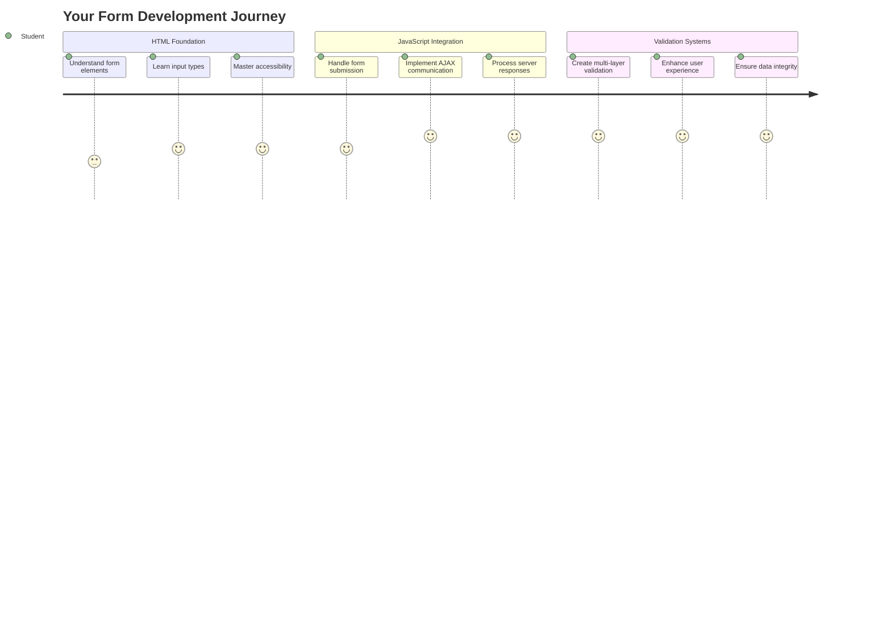

## Quiz trước bài học

[Quiz trước bài học](https://ff-quizzes.netlify.app/web/quiz/43)

Bạn đã từng điền vào một biểu mẫu trực tuyến và bị từ chối vì định dạng email không đúng? Hoặc mất hết thông tin khi nhấn nút gửi? Chúng ta đều đã gặp phải những trải nghiệm khó chịu này.

Biểu mẫu là cầu nối giữa người dùng và chức năng của ứng dụng. Giống như các quy trình cẩn thận mà nhân viên kiểm soát không lưu sử dụng để hướng dẫn máy bay đến đích an toàn, biểu mẫu được thiết kế tốt cung cấp phản hồi rõ ràng và ngăn chặn các lỗi tốn kém. Ngược lại, biểu mẫu kém chất lượng có thể khiến người dùng rời đi nhanh hơn một sự cố giao tiếp tại sân bay đông đúc.

Trong bài học này, chúng ta sẽ biến ứng dụng ngân hàng tĩnh của bạn thành một ứng dụng tương tác. Bạn sẽ học cách tạo biểu mẫu để xác thực đầu vào của người dùng, giao tiếp với máy chủ và cung cấp phản hồi hữu ích. Hãy nghĩ về nó như việc xây dựng giao diện điều khiển cho phép người dùng điều hướng các tính năng của ứng dụng.

Kết thúc bài học, bạn sẽ có một hệ thống đăng nhập và đăng ký hoàn chỉnh với xác thực, giúp người dùng đạt được thành công thay vì gặp phải sự thất vọng.

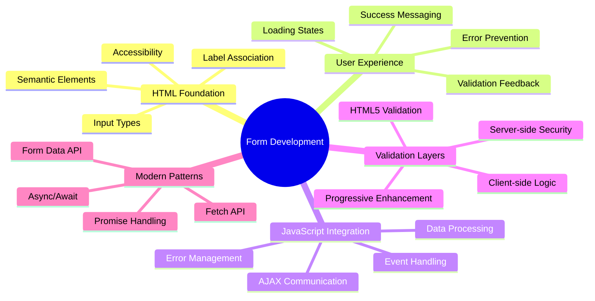

## Yêu cầu trước

Trước khi bắt đầu tạo biểu mẫu, hãy đảm bảo rằng bạn đã thiết lập mọi thứ đúng cách. Bài học này tiếp nối ngay sau bài học trước, vì vậy nếu bạn đã bỏ qua, bạn có thể muốn quay lại và làm việc với các phần cơ bản trước.

### Thiết lập cần thiết

| Thành phần | Trạng thái | Mô tả |
|------------|-----------|-------|
| [Mẫu HTML](../1-template-route/README.md) | ✅ Bắt buộc | Cấu trúc cơ bản của ứng dụng ngân hàng |
| [Node.js](https://nodejs.org) | ✅ Bắt buộc | Môi trường chạy JavaScript cho máy chủ |
| [Máy chủ API ngân hàng](../api/README.md) | ✅ Bắt buộc | Dịch vụ backend để lưu trữ dữ liệu |

> 💡 **Mẹo phát triển**: Bạn sẽ chạy hai máy chủ riêng biệt đồng thời – một cho ứng dụng ngân hàng front-end và một cho API backend. Cách thiết lập này phản ánh thực tế phát triển nơi các dịch vụ front-end và backend hoạt động độc lập.

### Cấu hình máy chủ

**Môi trường phát triển của bạn sẽ bao gồm:**
- **Máy chủ front-end**: Cung cấp ứng dụng ngân hàng của bạn (thường là cổng `3000`)
- **Máy chủ API backend**: Xử lý lưu trữ và truy xuất dữ liệu (cổng `5000`)
- **Cả hai máy chủ** có thể chạy đồng thời mà không xung đột

**Kiểm tra kết nối API của bạn:**
```bash
curl http://localhost:5000/api
# Expected response: "Bank API v1.0.0"
```

**Nếu bạn thấy phản hồi phiên bản API, bạn đã sẵn sàng tiếp tục!**

---

## Hiểu về biểu mẫu HTML và các điều khiển

Biểu mẫu HTML là cách người dùng giao tiếp với ứng dụng web của bạn. Hãy nghĩ về chúng như hệ thống điện báo kết nối các nơi xa xôi vào thế kỷ 19 – chúng là giao thức giao tiếp giữa ý định của người dùng và phản hồi của ứng dụng. Khi được thiết kế cẩn thận, chúng bắt lỗi, hướng dẫn định dạng đầu vào và cung cấp các gợi ý hữu ích.

Biểu mẫu hiện đại phức tạp hơn nhiều so với các đầu vào văn bản cơ bản. HTML5 đã giới thiệu các loại đầu vào chuyên biệt tự động xử lý xác thực email, định dạng số và chọn ngày. Những cải tiến này mang lại lợi ích cho cả khả năng truy cập và trải nghiệm người dùng di động.

### Các yếu tố cơ bản của biểu mẫu

**Các khối xây dựng mà mọi biểu mẫu cần có:**

```html
<!-- Basic form structure -->
<form id="userForm" method="POST">
  <label for="username">Username</label>
  <input id="username" name="username" type="text" required>
  
  <button type="submit">Submit</button>
</form>
```

**Mã này làm gì:**
- **Tạo** một container biểu mẫu với một định danh duy nhất
- **Xác định** phương thức HTTP để gửi dữ liệu
- **Liên kết** nhãn với đầu vào để tăng khả năng truy cập
- **Định nghĩa** nút gửi để xử lý biểu mẫu

### Các loại đầu vào và thuộc tính hiện đại

| Loại đầu vào | Mục đích | Ví dụ sử dụng |
|--------------|----------|---------------|
| `text` | Nhập văn bản chung | `<input type="text" name="username">` |
| `email` | Xác thực email | `<input type="email" name="email">` |
| `password` | Nhập văn bản ẩn | `<input type="password" name="password">` |
| `number` | Nhập số | `<input type="number" name="balance" min="0">` |
| `tel` | Số điện thoại | `<input type="tel" name="phone">` |

> 💡 **Lợi ích của HTML5 hiện đại**: Sử dụng các loại đầu vào cụ thể cung cấp xác thực tự động, bàn phím di động phù hợp và hỗ trợ khả năng truy cập tốt hơn mà không cần thêm JavaScript!

### Các loại nút và hành vi

```html
<!-- Different button behaviors -->
<button type="submit">Save Data</button>     <!-- Submits the form -->
<button type="reset">Clear Form</button>    <!-- Resets all fields -->
<button type="button">Custom Action</button> <!-- No default behavior -->
```

**Mỗi loại nút làm gì:**
- **Nút gửi**: Kích hoạt gửi biểu mẫu và gửi dữ liệu đến điểm cuối được chỉ định
- **Nút đặt lại**: Khôi phục tất cả các trường biểu mẫu về trạng thái ban đầu
- **Nút thông thường**: Không cung cấp hành vi mặc định, yêu cầu JavaScript tùy chỉnh để hoạt động

> ⚠️ **Lưu ý quan trọng**: Phần tử `<input>` tự đóng và không yêu cầu thẻ đóng. Thực hành tốt nhất hiện nay là viết `<input>` mà không có dấu gạch chéo.

### Tạo biểu mẫu đăng nhập của bạn

Bây giờ hãy tạo một biểu mẫu đăng nhập thực tế để minh họa các thực hành biểu mẫu HTML hiện đại. Chúng ta sẽ bắt đầu với cấu trúc cơ bản và dần dần cải thiện nó với các tính năng truy cập và xác thực.

```html
<template id="login">
  <h1>Bank App</h1>
  <section>
    <h2>Login</h2>
    <form id="loginForm" novalidate>
      <div class="form-group">
        <label for="username">Username</label>
        <input id="username" name="user" type="text" required 
               autocomplete="username" placeholder="Enter your username">
      </div>
      <button type="submit">Login</button>
    </form>
  </section>
</template>
```

**Phân tích những gì xảy ra ở đây:**
- **Cấu trúc** biểu mẫu với các phần tử HTML5 có ý nghĩa
- **Nhóm** các phần tử liên quan bằng các container `div` với các lớp có ý nghĩa
- **Liên kết** nhãn với đầu vào bằng các thuộc tính `for` và `id`
- **Bao gồm** các thuộc tính hiện đại như `autocomplete` và `placeholder` để cải thiện UX
- **Thêm** `novalidate` để xử lý xác thực bằng JavaScript thay vì mặc định của trình duyệt

### Sức mạnh của nhãn đúng cách

**Tại sao nhãn quan trọng đối với phát triển web hiện đại:**

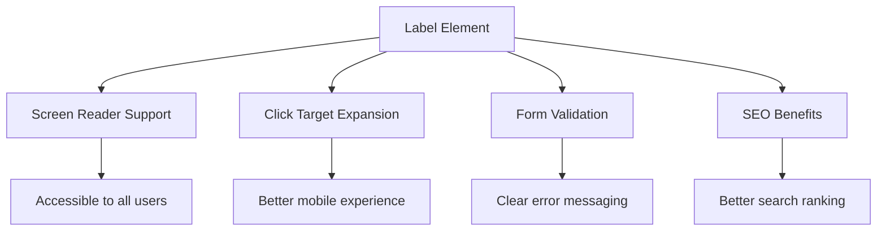

**Những gì nhãn đúng cách đạt được:**
- **Cho phép** trình đọc màn hình thông báo rõ ràng các trường biểu mẫu
- **Mở rộng** khu vực có thể nhấp (nhấp vào nhãn sẽ tập trung vào đầu vào)
- **Cải thiện** khả năng sử dụng trên di động với các mục tiêu chạm lớn hơn
- **Hỗ trợ** xác thực biểu mẫu với các thông báo lỗi có ý nghĩa
- **Tăng cường** SEO bằng cách cung cấp ý nghĩa ngữ nghĩa cho các phần tử biểu mẫu

> 🎯 **Mục tiêu truy cập**: Mỗi đầu vào biểu mẫu nên có một nhãn liên kết. Thực hành đơn giản này làm cho biểu mẫu của bạn có thể sử dụng bởi mọi người, bao gồm cả người dùng khuyết tật, và cải thiện trải nghiệm cho tất cả người dùng.

### Tạo biểu mẫu đăng ký

Biểu mẫu đăng ký yêu cầu thông tin chi tiết hơn để tạo tài khoản người dùng hoàn chỉnh. Hãy xây dựng nó với các tính năng HTML5 hiện đại và khả năng truy cập nâng cao.

```html
<hr/>
<h2>Register</h2>
<form id="registerForm" novalidate>
  <div class="form-group">
    <label for="user">Username</label>
    <input id="user" name="user" type="text" required 
           autocomplete="username" placeholder="Choose a username">
  </div>
  
  <div class="form-group">
    <label for="currency">Currency</label>
    <input id="currency" name="currency" type="text" value="$" 
           required maxlength="3" placeholder="USD, EUR, etc.">
  </div>
  
  <div class="form-group">
    <label for="description">Account Description</label>
    <input id="description" name="description" type="text" 
           maxlength="100" placeholder="Personal savings, checking, etc.">
  </div>
  
  <div class="form-group">
    <label for="balance">Starting Balance</label>
    <input id="balance" name="balance" type="number" value="0" 
           min="0" step="0.01" placeholder="0.00">
  </div>
  
  <button type="submit">Create Account</button>
</form>
```

**Trong đoạn trên, chúng ta đã:**
- **Tổ chức** mỗi trường trong các container div để cải thiện kiểu dáng và bố cục
- **Thêm** các thuộc tính `autocomplete` phù hợp để hỗ trợ tự động điền của trình duyệt
- **Bao gồm** văn bản gợi ý hữu ích để hướng dẫn đầu vào của người dùng
- **Đặt** các giá trị mặc định hợp lý bằng thuộc tính `value`
- **Áp dụng** các thuộc tính xác thực như `required`, `maxlength`, và `min`
- **Sử dụng** `type="number"` cho trường số dư với hỗ trợ số thập phân

### Khám phá các loại đầu vào và hành vi

**Các loại đầu vào hiện đại cung cấp chức năng nâng cao:**

| Tính năng | Lợi ích | Ví dụ |
|-----------|---------|-------|
| `type="number"` | Bàn phím số trên di động | Nhập số dư dễ dàng hơn |
| `step="0.01"` | Kiểm soát độ chính xác số thập phân | Cho phép nhập số tiền lẻ |
| `autocomplete` | Tự động điền của trình duyệt | Hoàn thành biểu mẫu nhanh hơn |
| `placeholder` | Gợi ý ngữ cảnh | Hướng dẫn kỳ vọng của người dùng |

> 🎯 **Thử thách truy cập**: Hãy thử điều hướng biểu mẫu chỉ bằng bàn phím của bạn! Sử dụng `Tab` để di chuyển giữa các trường, `Space` để chọn hộp kiểm, và `Enter` để gửi. Trải nghiệm này giúp bạn hiểu cách người dùng trình đọc màn hình tương tác với biểu mẫu của bạn.

### 🔄 **Kiểm tra sư phạm**
**Hiểu nền tảng biểu mẫu**: Trước khi triển khai JavaScript, hãy đảm bảo bạn hiểu:
- ✅ Cách HTML ngữ nghĩa tạo cấu trúc biểu mẫu có thể truy cập
- ✅ Tại sao các loại đầu vào quan trọng đối với bàn phím di động và xác thực
- ✅ Mối quan hệ giữa nhãn và điều khiển biểu mẫu
- ✅ Cách các thuộc tính biểu mẫu ảnh hưởng đến hành vi mặc định của trình duyệt

**Kiểm tra nhanh bản thân**: Điều gì xảy ra nếu bạn gửi biểu mẫu mà không có JavaScript xử lý?
*Trả lời: Trình duyệt thực hiện gửi mặc định, thường chuyển hướng đến URL hành động*

**Lợi ích của biểu mẫu HTML5**: Biểu mẫu hiện đại cung cấp:
- **Xác thực tích hợp**: Kiểm tra định dạng email và số tự động
- **Tối ưu hóa di động**: Bàn phím phù hợp cho các loại đầu vào khác nhau
- **Khả năng truy cập**: Hỗ trợ trình đọc màn hình và điều hướng bằng bàn phím
- **Tăng cường tiến bộ**: Hoạt động ngay cả khi JavaScript bị vô hiệu hóa

## Hiểu về phương thức gửi biểu mẫu

Khi ai đó điền vào biểu mẫu của bạn và nhấn gửi, dữ liệu đó cần được gửi đến đâu đó – thường là đến một máy chủ có thể lưu trữ nó. Có một vài cách khác nhau để điều này xảy ra, và biết cách sử dụng cái nào có thể giúp bạn tránh được một số rắc rối sau này.

Hãy cùng xem điều gì thực sự xảy ra khi ai đó nhấn nút gửi.

### Hành vi mặc định của biểu mẫu

Đầu tiên, hãy quan sát điều gì xảy ra với việc gửi biểu mẫu cơ bản:

**Kiểm tra biểu mẫu hiện tại của bạn:**
1. Nhấn nút *Đăng ký* trong biểu mẫu của bạn
2. Quan sát các thay đổi trong thanh địa chỉ của trình duyệt
3. Lưu ý cách trang tải lại và dữ liệu xuất hiện trong URL


### So sánh phương thức HTTP

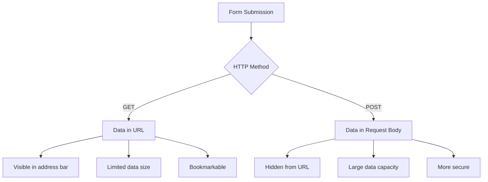

**Hiểu sự khác biệt:**

| Phương thức | Trường hợp sử dụng | Vị trí dữ liệu | Mức độ bảo mật | Giới hạn kích thước |
|-------------|--------------------|----------------|----------------|---------------------|
| `GET` | Truy vấn tìm kiếm, bộ lọc | Tham số URL | Thấp (hiển thị) | ~2000 ký tự |
| `POST` | Tài khoản người dùng, dữ liệu nhạy cảm | Nội dung yêu cầu | Cao hơn (ẩn) | Không giới hạn thực tế |

**Hiểu sự khác biệt cơ bản:**
- **GET**: Thêm dữ liệu biểu mẫu vào URL dưới dạng tham số truy vấn (phù hợp cho các thao tác tìm kiếm)
- **POST**: Bao gồm dữ liệu trong nội dung yêu cầu (cần thiết cho thông tin nhạy cảm)
- **Giới hạn của GET**: Giới hạn kích thước, dữ liệu hiển thị, lịch sử trình duyệt tồn tại
- **Ưu điểm của POST**: Dung lượng dữ liệu lớn, bảo vệ quyền riêng tư, hỗ trợ tải tệp

> 💡 **Thực hành tốt nhất**: Sử dụng `GET` cho biểu mẫu tìm kiếm và bộ lọc (truy xuất dữ liệu), sử dụng `POST` cho đăng ký người dùng, đăng nhập và tạo dữ liệu.

### Cấu hình gửi biểu mẫu

Hãy cấu hình biểu mẫu đăng ký của bạn để giao tiếp đúng cách với API backend bằng phương thức POST:

```html
<form id="registerForm" action="//localhost:5000/api/accounts" 
      method="POST" novalidate>
```

**Cấu hình này làm gì:**
- **Hướng dẫn** gửi biểu mẫu đến điểm cuối API của bạn
- **Sử dụng** phương thức POST để truyền dữ liệu an toàn
- **Bao gồm** `novalidate` để xử lý xác thực bằng JavaScript

### Kiểm tra gửi biểu mẫu

**Thực hiện các bước sau để kiểm tra biểu mẫu của bạn:**
1. **Điền** vào biểu mẫu đăng ký với thông tin của bạn
2. **Nhấn** nút "Tạo tài khoản"
3. **Quan sát** phản hồi của máy chủ trong trình duyệt của bạn

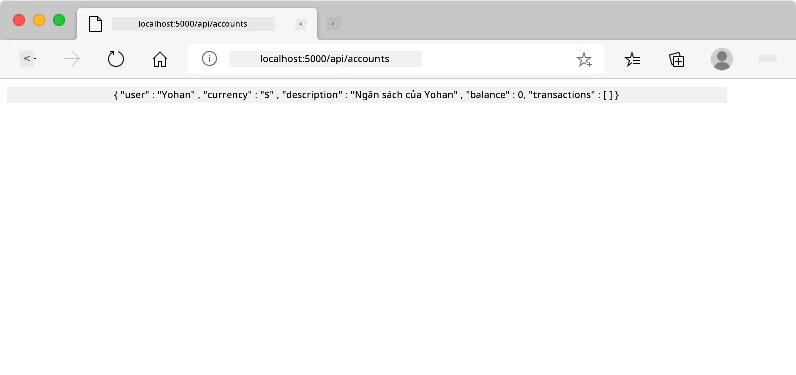

**Những gì bạn nên thấy:**
- **Trình duyệt chuyển hướng** đến URL điểm cuối API
- **Phản hồi JSON** chứa dữ liệu tài khoản mới tạo của bạn
- **Xác nhận của máy chủ** rằng tài khoản đã được tạo thành công

> 🧪 **Thời gian thử nghiệm**: Hãy thử đăng ký lại với cùng tên người dùng. Bạn nhận được phản hồi gì? Điều này giúp bạn hiểu cách máy chủ xử lý dữ liệu trùng lặp và các điều kiện lỗi.

### Hiểu về phản hồi JSON

**Khi máy chủ xử lý biểu mẫu của bạn thành công:**
```json
{
  "user": "john_doe",
  "currency": "$",
  "description": "Personal savings",
  "balance": 100,
  "id": "unique_account_id"
}
```

**Phản hồi này xác nhận:**
- **Tạo** một tài khoản mới với dữ liệu bạn chỉ định
- **Gán** một định danh duy nhất để tham chiếu trong tương lai
- **Trả về** tất cả thông tin tài khoản để xác minh
- **Chỉ ra** lưu trữ cơ sở dữ liệu thành công

## Xử lý biểu mẫu hiện đại với JavaScript

Việc gửi biểu mẫu truyền thống gây ra tải lại toàn bộ trang, giống như cách các nhiệm vụ không gian ban đầu yêu cầu đặt lại toàn bộ hệ thống để điều chỉnh hướng đi. Cách tiếp cận này làm gián đoạn trải nghiệm người dùng và mất trạng thái ứng dụng.

Xử lý biểu mẫu bằng JavaScript hoạt động như hệ thống hướng dẫn liên tục được sử dụng bởi tàu vũ trụ hiện đại – thực hiện các điều chỉnh theo thời gian thực mà không mất ngữ cảnh điều hướng. Chúng ta có thể chặn việc gửi biểu mẫu, cung cấp phản hồi ngay lập tức, xử lý lỗi một cách duyên dáng, và cập nhật giao diện dựa trên phản hồi của máy chủ trong khi duy trì vị trí của người dùng trong ứng dụng.

### Tại sao tránh tải lại trang?

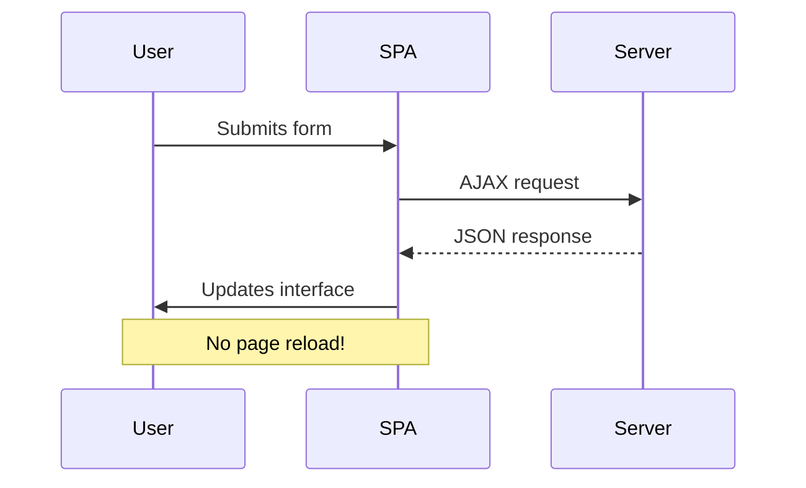

**Lợi ích của xử lý biểu mẫu bằng JavaScript:**
- **Duy trì** trạng thái ứng dụng và ngữ cảnh người dùng
- **Cung cấp** phản hồi ngay lập tức và chỉ báo tải
- **Cho phép** xử lý lỗi và xác thực động
- **Tạo** trải nghiệm người dùng mượt mà, giống như ứng dụng
- **Cho phép** logic điều kiện dựa trên phản hồi của máy chủ

### Chuyển từ biểu mẫu truyền thống sang hiện đại

**Thách thức của cách tiếp cận truyền thống:**
- **Chuyển hướng** người dùng ra khỏi ứng dụng của bạn
- **Mất** trạng thái và ngữ cảnh ứng dụng hiện tại
- **Yêu cầu** tải lại toàn bộ trang cho các thao tác đơn giản
- **Cung cấp** kiểm soát hạn chế đối với phản hồi của người dùng

**Ưu điểm của cách tiếp cận JavaScript hiện đại:**
- **Giữ** người dùng trong ứng dụng của bạn
- **Duy trì** tất cả trạng thái và dữ liệu ứng dụng
- **Cho phép** xác thực và phản hồi theo thời gian thực
- **Hỗ trợ** tăng cường tiến bộ và khả năng truy cập

### Triển khai xử lý biểu mẫu bằng JavaScript

Hãy thay thế việc gửi biểu mẫu truyền thống bằng xử lý sự kiện JavaScript hiện đại:

```html
<!-- Remove the action attribute and add event handling -->
<form id="registerForm" method="POST" novalidate>
```

**Thêm logic đăng ký vào tệp `app.js` của bạn:**

```javascript
// Modern event-driven form handling
function register() {
  const registerForm = document.getElementById('registerForm');
  const formData = new FormData(registerForm);
  const data = Object.fromEntries(formData);
  const jsonData = JSON.stringify(data);
  
  console.log('Form data prepared:', data);
}

// Attach event listener when the page loads
document.addEventListener('DOMContentLoaded', () => {
  const registerForm = document.getElementById('registerForm');
  registerForm.addEventListener('submit', (event) => {
    event.preventDefault(); // Prevent default form submission
    register();
  });
});
```

**Phân tích những gì xảy ra ở đây:**
- **Ngăn chặn** việc gửi biểu mẫu mặc định bằng `event.preventDefault()`
- **Truy xuất** phần tử biểu mẫu bằng cách chọn DOM hiện đại
- **Trích xuất** dữ liệu biểu mẫu bằng API mạnh mẽ `FormData`
- **Chuyển đổi** FormData thành một đối tượng đơn giản với `Object.fromEntries()`
- **Tuần tự hóa** dữ liệu sang định dạng JSON để giao tiếp với máy chủ
- **Ghi nhật ký** dữ liệu đã xử lý để gỡ lỗi và xác minh

### Hiểu về API FormData

**API FormData cung cấp xử lý biểu mẫu mạnh mẽ:**
```javascript
// Example of what FormData captures
const formData = new FormData(registerForm);

// FormData automatically captures:
// {
//   "user": "john_doe",
//   "currency": "$", 
//   "description": "Personal account",
//   "balance": "100"
// }
```

**Ưu điểm của API FormData:**
- **Thu thập toàn diện**: Thu thập tất cả các phần tử của biểu mẫu bao gồm văn bản, tệp và các đầu vào phức tạp
- **Nhận biết loại dữ liệu**: Tự động xử lý các loại đầu vào khác nhau mà không cần mã tùy chỉnh
- **Hiệu quả**: Loại bỏ việc thu thập trường thủ công chỉ với một lần gọi API
- **Thích ứng**: Duy trì chức năng khi cấu trúc biểu mẫu thay đổi

### Tạo hàm giao tiếp với máy chủ

Bây giờ chúng ta sẽ xây dựng một hàm mạnh mẽ để giao tiếp với máy chủ API của bạn bằng các mẫu JavaScript hiện đại:

```javascript
async function createAccount(account) {
  try {
    const response = await fetch('//localhost:5000/api/accounts', {
      method: 'POST',
      headers: { 
        'Content-Type': 'application/json',
        'Accept': 'application/json'
      },
      body: account
    });
    
    // Check if the response was successful
    if (!response.ok) {
      throw new Error(`HTTP error! status: ${response.status}`);
    }
    
    return await response.json();
  } catch (error) {
    console.error('Account creation failed:', error);
    return { error: error.message || 'Network error occurred' };
  }
}
```

**Hiểu về JavaScript bất đồng bộ:**

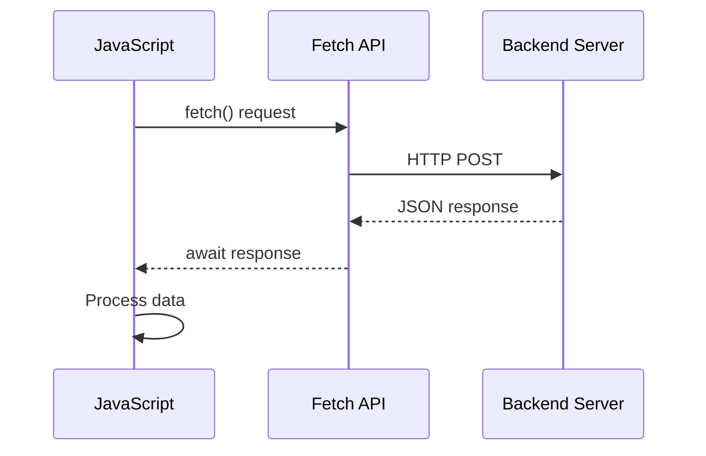

**Những gì cách triển khai hiện đại này đạt được:**
- **Sử dụng** `async/await` để mã bất đồng bộ dễ đọc hơn
- **Bao gồm** xử lý lỗi đúng cách với các khối try/catch
- **Kiểm tra** trạng thái phản hồi trước khi xử lý dữ liệu
- **Đặt** các tiêu đề phù hợp cho giao tiếp JSON
- **Cung cấp** thông báo lỗi chi tiết để gỡ lỗi
- **Trả về** cấu trúc dữ liệu nhất quán cho các trường hợp thành công và lỗi

### Sức mạnh của Fetch API hiện đại

**Ưu điểm của Fetch API so với các phương pháp cũ:**

| Tính năng | Lợi ích | Triển khai |
|-----------|---------|------------|
| Dựa trên Promise | Mã bất đồng bộ sạch | `await fetch()` |
| Tùy chỉnh yêu cầu | Kiểm soát HTTP đầy đủ | Headers, methods, body |
| Xử lý phản hồi | Phân tích dữ liệu linh hoạt | `.json()`, `.text()`, `.blob()` |
| Xử lý lỗi | Bắt lỗi toàn diện | Try/catch blocks |

> 🎥 **Tìm hiểu thêm**: [Hướng dẫn Async/Await](https://youtube.com/watch?v=YwmlRkrxvkk) - Hiểu các mẫu JavaScript bất đồng bộ cho phát triển web hiện đại.

**Các khái niệm chính cho giao tiếp với máy chủ:**
- **Hàm bất đồng bộ** cho phép tạm dừng thực thi để chờ phản hồi từ máy chủ
- **Từ khóa Await** giúp mã bất đồng bộ trông giống mã đồng bộ
- **Fetch API** cung cấp các yêu cầu HTTP hiện đại dựa trên Promise
- **Xử lý lỗi** đảm bảo ứng dụng của bạn phản hồi tốt với các vấn đề mạng

### Hoàn thiện hàm đăng ký

Hãy kết hợp mọi thứ lại với một hàm đăng ký hoàn chỉnh, sẵn sàng cho sản xuất:

```javascript
async function register() {
  const registerForm = document.getElementById('registerForm');
  const submitButton = registerForm.querySelector('button[type="submit"]');
  
  try {
    // Show loading state
    submitButton.disabled = true;
    submitButton.textContent = 'Creating Account...';
    
    // Process form data
    const formData = new FormData(registerForm);
    const jsonData = JSON.stringify(Object.fromEntries(formData));
    
    // Send to server
    const result = await createAccount(jsonData);
    
    if (result.error) {
      console.error('Registration failed:', result.error);
      alert(`Registration failed: ${result.error}`);
      return;
    }
    
    console.log('Account created successfully!', result);
    alert(`Welcome, ${result.user}! Your account has been created.`);
    
    // Reset form after successful registration
    registerForm.reset();
    
  } catch (error) {
    console.error('Unexpected error:', error);
    alert('An unexpected error occurred. Please try again.');
  } finally {
    // Restore button state
    submitButton.disabled = false;
    submitButton.textContent = 'Create Account';
  }
}
```

**Cách triển khai nâng cao này bao gồm:**
- **Cung cấp** phản hồi trực quan trong quá trình gửi biểu mẫu
- **Vô hiệu hóa** nút gửi để ngăn chặn việc gửi trùng lặp
- **Xử lý** cả lỗi dự kiến và không dự kiến một cách tốt đẹp
- **Hiển thị** thông báo thành công và lỗi thân thiện với người dùng
- **Đặt lại** biểu mẫu sau khi đăng ký thành công
- **Khôi phục** trạng thái giao diện người dùng bất kể kết quả ra sao

### Kiểm tra triển khai của bạn

**Mở công cụ dành cho nhà phát triển của trình duyệt và kiểm tra đăng ký:**

1. **Mở** bảng điều khiển trình duyệt (F12 → tab Console)
2. **Điền** vào biểu mẫu đăng ký
3. **Nhấp** vào "Tạo tài khoản"
4. **Quan sát** các thông báo trên bảng điều khiển và phản hồi của người dùng

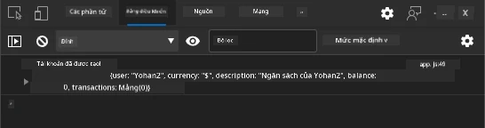

**Những gì bạn sẽ thấy:**
- **Trạng thái tải** xuất hiện trên nút gửi
- **Nhật ký bảng điều khiển** hiển thị thông tin chi tiết về quá trình
- **Thông báo thành công** xuất hiện khi tạo tài khoản thành công
- **Biểu mẫu tự động đặt lại** sau khi gửi thành công

> 🔒 **Lưu ý về bảo mật**: Hiện tại, dữ liệu được truyền qua HTTP, không an toàn cho sản xuất. Trong các ứng dụng thực tế, luôn sử dụng HTTPS để mã hóa truyền dữ liệu. Tìm hiểu thêm về [bảo mật HTTPS](https://en.wikipedia.org/wiki/HTTPS) và lý do tại sao nó cần thiết để bảo vệ dữ liệu người dùng.

### 🔄 **Kiểm tra sư phạm**
**Tích hợp JavaScript hiện đại**: Xác minh sự hiểu biết của bạn về xử lý biểu mẫu bất đồng bộ:
- ✅ `event.preventDefault()` thay đổi hành vi mặc định của biểu mẫu như thế nào?
- ✅ Tại sao API FormData hiệu quả hơn việc thu thập trường thủ công?
- ✅ Các mẫu async/await cải thiện khả năng đọc mã như thế nào?
- ✅ Vai trò của xử lý lỗi trong trải nghiệm người dùng là gì?

**Kiến trúc hệ thống**: Việc xử lý biểu mẫu của bạn thể hiện:
- **Lập trình hướng sự kiện**: Biểu mẫu phản hồi hành động của người dùng mà không cần tải lại trang
- **Giao tiếp bất đồng bộ**: Các yêu cầu máy chủ không làm gián đoạn giao diện người dùng
- **Xử lý lỗi**: Suy giảm tốt khi các yêu cầu mạng thất bại
- **Quản lý trạng thái**: Cập nhật giao diện người dùng phản ánh phản hồi từ máy chủ
- **Cải tiến tiến bộ**: Chức năng cơ bản hoạt động, JavaScript nâng cao nó

**Mẫu chuyên nghiệp**: Bạn đã triển khai:
- **Trách nhiệm đơn lẻ**: Các hàm có mục đích rõ ràng, tập trung
- **Ranh giới lỗi**: Các khối try/catch ngăn chặn sự cố ứng dụng
- **Phản hồi người dùng**: Trạng thái tải và thông báo thành công/lỗi
- **Chuyển đổi dữ liệu**: FormData sang JSON để giao tiếp với máy chủ

## Xác thực biểu mẫu toàn diện

Xác thực biểu mẫu ngăn chặn trải nghiệm khó chịu khi phát hiện lỗi chỉ sau khi gửi. Giống như các hệ thống dự phòng trên Trạm Vũ trụ Quốc tế, xác thực hiệu quả sử dụng nhiều lớp kiểm tra an toàn.

Cách tiếp cận tối ưu kết hợp xác thực ở cấp trình duyệt để phản hồi ngay lập tức, xác thực JavaScript để cải thiện trải nghiệm người dùng và xác thực phía máy chủ để đảm bảo an toàn và tính toàn vẹn dữ liệu. Sự dư thừa này đảm bảo cả sự hài lòng của người dùng và bảo vệ hệ thống.

### Hiểu về các lớp xác thực

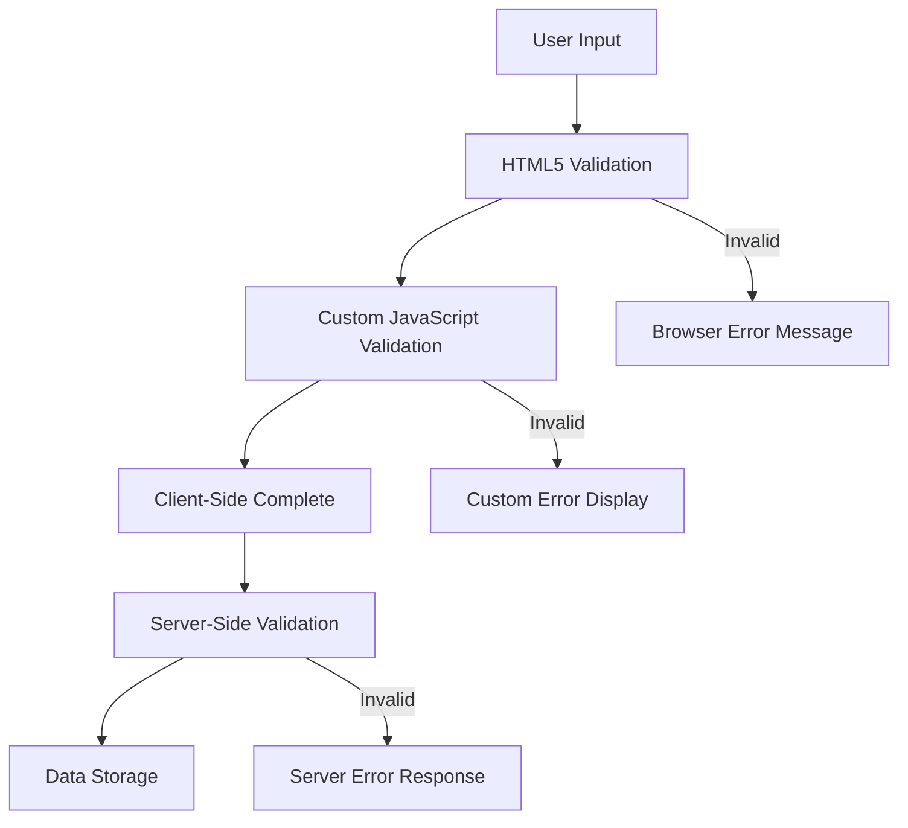

**Chiến lược xác thực nhiều lớp:**
- **Xác thực HTML5**: Kiểm tra ngay lập tức dựa trên trình duyệt
- **Xác thực JavaScript**: Logic tùy chỉnh và trải nghiệm người dùng
- **Xác thực máy chủ**: Kiểm tra cuối cùng về an toàn và tính toàn vẹn dữ liệu
- **Cải tiến tiến bộ**: Hoạt động ngay cả khi JavaScript bị vô hiệu hóa

### Thuộc tính xác thực HTML5

**Công cụ xác thực hiện đại bạn có thể sử dụng:**

| Thuộc tính | Mục đích | Ví dụ sử dụng | Hành vi trình duyệt |
|------------|----------|---------------|---------------------|
| `required` | Trường bắt buộc | `<input required>` | Ngăn chặn gửi trống |
| `minlength`/`maxlength` | Giới hạn độ dài văn bản | `<input maxlength="20">` | Áp dụng giới hạn ký tự |
| `min`/`max` | Phạm vi số | `<input min="0" max="1000">` | Xác thực giới hạn số |
| `pattern` | Quy tắc regex tùy chỉnh | `<input pattern="[A-Za-z]+">` | Khớp với định dạng cụ thể |
| `type` | Xác thực loại dữ liệu | `<input type="email">` | Xác thực theo định dạng cụ thể |

### Kiểu dáng xác thực CSS

**Tạo phản hồi trực quan cho trạng thái xác thực:**

```css
/* Valid input styling */
input:valid {
  border-color: #28a745;
  background-color: #f8fff9;
}

/* Invalid input styling */
input:invalid {
  border-color: #dc3545;
  background-color: #fff5f5;
}

/* Focus states for better accessibility */
input:focus:valid {
  box-shadow: 0 0 0 0.2rem rgba(40, 167, 69, 0.25);
}

input:focus:invalid {
  box-shadow: 0 0 0 0.2rem rgba(220, 53, 69, 0.25);
}
```

**Những gì các gợi ý trực quan này đạt được:**
- **Viền màu xanh lá cây**: Chỉ ra xác thực thành công, giống như đèn xanh trong trung tâm điều khiển
- **Viền màu đỏ**: Báo hiệu lỗi xác thực cần chú ý
- **Điểm nổi bật khi tập trung**: Cung cấp ngữ cảnh trực quan rõ ràng cho vị trí đầu vào hiện tại
- **Kiểu dáng nhất quán**: Thiết lập các mẫu giao diện có thể học được cho người dùng

> 💡 **Mẹo chuyên nghiệp**: Sử dụng các pseudo-class CSS `:valid` và `:invalid` để cung cấp phản hồi trực quan ngay lập tức khi người dùng nhập, tạo giao diện đáp ứng và hữu ích.

### Triển khai xác thực toàn diện

Hãy nâng cao biểu mẫu đăng ký của bạn với xác thực mạnh mẽ mang lại trải nghiệm người dùng tuyệt vời và chất lượng dữ liệu:

```html
<form id="registerForm" method="POST" novalidate>
  <div class="form-group">
    <label for="user">Username <span class="required">*</span></label>
    <input id="user" name="user" type="text" required 
           minlength="3" maxlength="20" 
           pattern="[a-zA-Z0-9_]+" 
           autocomplete="username"
           title="Username must be 3-20 characters, letters, numbers, and underscores only">
    <small class="form-text">Choose a unique username (3-20 characters)</small>
  </div>
  
  <div class="form-group">
    <label for="currency">Currency <span class="required">*</span></label>
    <input id="currency" name="currency" type="text" required 
           value="$" maxlength="3" 
           pattern="[A-Z$€£¥₹]+" 
           title="Enter a valid currency symbol or code">
    <small class="form-text">Currency symbol (e.g., $, €, £)</small>
  </div>
  
  <div class="form-group">
    <label for="description">Account Description</label>
    <input id="description" name="description" type="text" 
           maxlength="100" 
           placeholder="Personal savings, checking, etc.">
    <small class="form-text">Optional description (up to 100 characters)</small>
  </div>
  
  <div class="form-group">
    <label for="balance">Starting Balance</label>
    <input id="balance" name="balance" type="number" 
           value="0" min="0" step="0.01" 
           title="Enter a positive number for your starting balance">
    <small class="form-text">Initial account balance (minimum $0.00)</small>
  </div>
  
  <button type="submit">Create Account</button>
</form>
```

**Hiểu về xác thực nâng cao:**
- **Kết hợp** các chỉ báo trường bắt buộc với mô tả hữu ích
- **Bao gồm** các thuộc tính `pattern` để xác thực định dạng
- **Cung cấp** các thuộc tính `title` để tăng khả năng tiếp cận và hiển thị gợi ý
- **Thêm** văn bản trợ giúp để hướng dẫn đầu vào của người dùng
- **Sử dụng** cấu trúc HTML ngữ nghĩa để tăng khả năng tiếp cận

### Quy tắc xác thực nâng cao

**Những gì mỗi quy tắc xác thực đạt được:**

| Trường | Quy tắc xác thực | Lợi ích cho người dùng |
|-------|------------------|------------------------|
| Tên người dùng | `required`, `minlength="3"`, `maxlength="20"`, `pattern="[a-zA-Z0-9_]+"` | Đảm bảo định danh hợp lệ, duy nhất |
| Tiền tệ | `required`, `maxlength="3"`, `pattern="[A-Z$€£¥₹]+"` | Chấp nhận các ký hiệu tiền tệ phổ biến |
| Số dư | `min="0"`, `step="0.01"`, `type="number"` | Ngăn chặn số dư âm |
| Mô tả | `maxlength="100"` | Giới hạn độ dài hợp lý |

### Kiểm tra hành vi xác thực

**Thử các kịch bản xác thực sau:**
1. **Gửi** biểu mẫu với các trường bắt buộc để trống
2. **Nhập** tên người dùng ngắn hơn 3 ký tự
3. **Thử** các ký tự đặc biệt trong trường tên người dùng
4. **Nhập** số dư âm

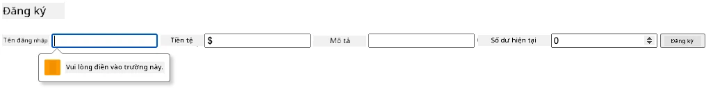

**Những gì bạn sẽ quan sát:**
- **Trình duyệt hiển thị** các thông báo xác thực gốc
- **Thay đổi kiểu dáng** dựa trên trạng thái `:valid` và `:invalid`
- **Gửi biểu mẫu** bị ngăn chặn cho đến khi tất cả các xác thực được thông qua
- **Tự động tập trung** vào trường không hợp lệ đầu tiên

### Xác thực phía máy khách và phía máy chủ

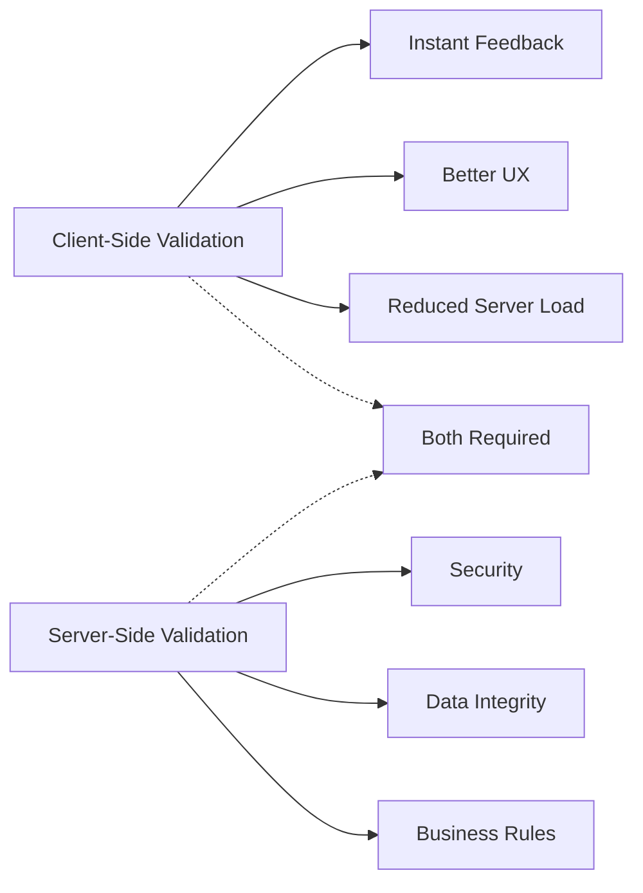

**Tại sao bạn cần cả hai lớp:**
- **Xác thực phía máy khách**: Cung cấp phản hồi ngay lập tức và cải thiện trải nghiệm người dùng
- **Xác thực phía máy chủ**: Đảm bảo an toàn và xử lý các quy tắc kinh doanh phức tạp
- **Cách tiếp cận kết hợp**: Tạo ứng dụng mạnh mẽ, thân thiện với người dùng và an toàn
- **Cải tiến tiến bộ**: Hoạt động ngay cả khi JavaScript bị vô hiệu hóa

> 🛡️ **Nhắc nhở về bảo mật**: Không bao giờ chỉ tin tưởng vào xác thực phía máy khách! Người dùng độc hại có thể bỏ qua các kiểm tra phía máy khách, vì vậy xác thực phía máy chủ là cần thiết để đảm bảo an toàn và tính toàn vẹn dữ liệu.

### ⚡ **Những gì bạn có thể làm trong 5 phút tới**
- [ ] Kiểm tra biểu mẫu của bạn với dữ liệu không hợp lệ để xem các thông báo xác thực
- [ ] Thử gửi biểu mẫu khi JavaScript bị vô hiệu hóa để xem xác thực HTML5
- [ ] Mở DevTools của trình duyệt và kiểm tra dữ liệu biểu mẫu được gửi đến máy chủ
- [ ] Thử nghiệm với các loại đầu vào khác nhau để xem thay đổi bàn phím trên thiết bị di động

### 🎯 **Những gì bạn có thể hoàn thành trong giờ tới**
- [ ] Hoàn thành bài kiểm tra sau bài học và hiểu các khái niệm xử lý biểu mẫu
- [ ] Triển khai thử thách xác thực toàn diện với phản hồi thời gian thực
- [ ] Thêm kiểu dáng CSS để tạo biểu mẫu chuyên nghiệp
- [ ] Tạo xử lý lỗi cho tên người dùng trùng lặp và lỗi máy chủ
- [ ] Thêm các trường xác nhận mật khẩu với xác thực khớp

### 📅 **Hành trình làm chủ biểu mẫu trong tuần**
- [ ] Hoàn thành ứng dụng ngân hàng đầy đủ với các tính năng biểu mẫu nâng cao
- [ ] Triển khai khả năng tải lên tệp cho ảnh hồ sơ hoặc tài liệu
- [ ] Thêm biểu mẫu nhiều bước với chỉ báo tiến độ và quản lý trạng thái
- [ ] Tạo biểu mẫu động thích ứng dựa trên lựa chọn của người dùng
- [ ] Triển khai tự động lưu biểu mẫu và khôi phục để cải thiện trải nghiệm người dùng
- [ ] Thêm xác thực nâng cao như xác minh email và định dạng số điện thoại

### 🌟 **Làm chủ phát triển giao diện người dùng trong tháng**
- [ ] Xây dựng các ứng dụng biểu mẫu phức tạp với logic điều kiện và quy trình làm việc
- [ ] Tìm hiểu các thư viện và framework biểu mẫu để phát triển nhanh chóng
- [ ] Làm chủ các hướng dẫn về khả năng tiếp cận và nguyên tắc thiết kế toàn diện
- [ ] Triển khai quốc tế hóa và bản địa hóa cho các biểu mẫu toàn cầu
- [ ] Tạo thư viện thành phần biểu mẫu tái sử dụng và hệ thống thiết kế
- [ ] Đóng góp cho các dự án biểu mẫu mã nguồn mở và chia sẻ các thực hành tốt nhất

## 🎯 Lộ trình làm chủ phát triển biểu mẫu của bạn

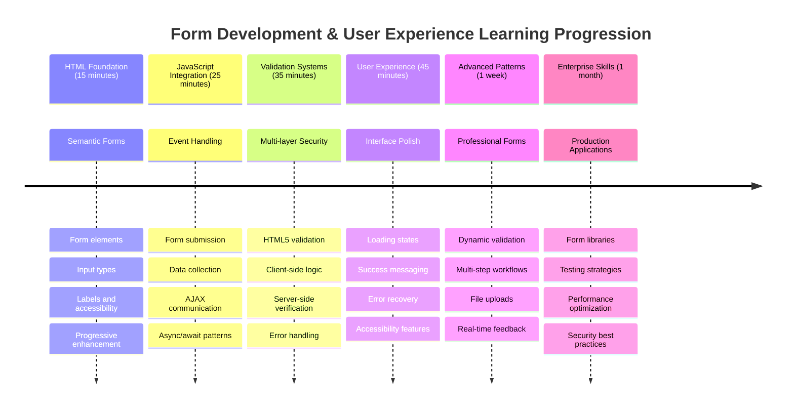

### 🛠️ Tóm tắt bộ công cụ phát triển biểu mẫu của bạn

Sau khi hoàn thành bài học này, bạn đã làm chủ:
- **Biểu mẫu HTML5**: Cấu trúc ngữ nghĩa, loại đầu vào và các tính năng khả năng tiếp cận
- **Xử lý biểu mẫu JavaScript**: Quản lý sự kiện, thu thập dữ liệu và giao tiếp AJAX
- **Kiến trúc xác thực**: Xác thực nhiều lớp để đảm bảo an toàn và trải nghiệm người dùng
- **Lập trình bất đồng bộ**: Fetch API hiện đại và các mẫu async/await
- **Quản lý lỗi**: Xử lý lỗi toàn diện và hệ thống phản hồi người dùng
- **Thiết kế trải nghiệm người dùng**: Trạng thái tải, thông báo thành công và khôi phục lỗi
- **Cải tiến tiến bộ**: Biểu mẫu hoạt động trên tất cả các trình duyệt và khả năng

**Ứng dụng thực tế**: Kỹ năng phát triển biểu mẫu của bạn áp dụng trực tiếp vào:
- **Ứng dụng thương mại điện tử**: Quy trình thanh toán, đăng ký tài khoản và biểu mẫu thanh toán
- **Phần mềm doanh nghiệp**: Hệ thống nhập dữ liệu, giao diện báo cáo và quy trình làm việc
- **Quản lý nội dung**: Nền tảng xuất bản, nội dung do người dùng tạo và giao diện quản trị
- **Ứng dụng tài chính**: Giao diện ngân hàng, nền tảng đầu tư và hệ thống giao dịch
- **Hệ thống chăm sóc sức khỏe**: Cổng thông tin bệnh nhân, đặt lịch hẹn và biểu mẫu hồ sơ y tế
- **Nền tảng giáo dục**: Đăng ký khóa học, công cụ đánh giá và hệ thống quản lý học tập

**Kỹ năng chuyên nghiệp đạt được**: Bây giờ bạn có thể:
- **Thiết kế** các biểu mẫu có khả năng tiếp cận hoạt động cho tất cả người dùng, bao gồm cả người khuyết tật
- **Triển khai** xác thực biểu mẫu an toàn ngăn chặn hỏng dữ liệu và lỗ hổng bảo mật
- **Tạo** giao diện người dùng đáp ứng cung cấp phản hồi và hướng dẫn rõ ràng
- **Gỡ lỗi** các tương tác biểu mẫu phức tạp bằng công cụ dành cho nhà phát triển trình duyệt và phân tích mạng
- **Tối ưu hóa** hiệu suất biểu mẫu thông qua xử lý dữ liệu và chiến lược xác thực hiệu quả

**Các khái niệm phát triển giao diện người dùng đã làm chủ**:
- **Kiến trúc hướng sự kiện**: Xử lý tương tác người dùng và hệ thống phản hồi
- **Lập trình bất đồng bộ**: Giao tiếp máy chủ không chặn và xử lý lỗi
- **Xác thực dữ liệu**: Kiểm tra an toàn và tính toàn vẹn phía máy khách và máy chủ
- **Thiết kế trải nghiệm người dùng**: Giao diện trực quan hướng dẫn người dùng đến thành công
- **Kỹ thuật khả năng tiếp cận**: Thiết kế toàn diện hoạt động cho nhu cầu đa dạng của người dùng

**Cấp độ tiếp theo**: Bạn đã sẵn sàng khám phá các thư viện biểu mẫu nâng cao, triển khai các quy tắc xác thực phức tạp hoặc xây dựng hệ thống thu thập dữ liệu cấp doanh nghiệp!

🌟 **
**Đề bài:** Tạo một hệ thống kiểm tra biểu mẫu hoàn chỉnh cho biểu mẫu đăng ký bao gồm: 1) Phản hồi kiểm tra theo thời gian thực cho từng trường khi người dùng nhập, 2) Thông báo kiểm tra tùy chỉnh xuất hiện bên dưới mỗi trường nhập liệu, 3) Trường xác nhận mật khẩu với kiểm tra khớp, 4) Các chỉ báo trực quan (như dấu kiểm màu xanh cho các trường hợp hợp lệ và cảnh báo màu đỏ cho các trường hợp không hợp lệ), 5) Nút gửi chỉ được kích hoạt khi tất cả các kiểm tra đều đạt. Sử dụng các thuộc tính kiểm tra của HTML5, CSS để tạo kiểu cho trạng thái kiểm tra, và JavaScript để tạo hành vi tương tác.

Tìm hiểu thêm về [chế độ agent](https://code.visualstudio.com/blogs/2025/02/24/introducing-copilot-agent-mode) tại đây.

## 🚀 Thử thách

Hiển thị thông báo lỗi trong HTML nếu người dùng đã tồn tại.

Dưới đây là một ví dụ về giao diện trang đăng nhập cuối cùng sau khi thêm một chút kiểu dáng:

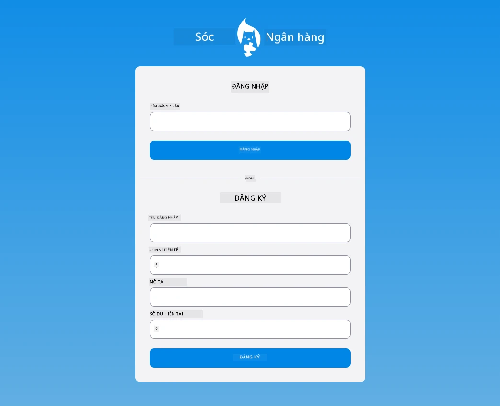

## Câu hỏi sau bài giảng

[Câu hỏi sau bài giảng](https://ff-quizzes.netlify.app/web/quiz/44)

## Ôn tập & Tự học

Các nhà phát triển đã rất sáng tạo trong việc xây dựng biểu mẫu, đặc biệt là về chiến lược kiểm tra. Tìm hiểu về các luồng biểu mẫu khác nhau bằng cách xem qua [CodePen](https://codepen.com); bạn có thể tìm thấy một số biểu mẫu thú vị và truyền cảm hứng không?

## Bài tập

[Thiết kế ứng dụng ngân hàng của bạn](assignment.md)

---

**Tuyên bố miễn trừ trách nhiệm**:  
Tài liệu này đã được dịch bằng dịch vụ dịch thuật AI [Co-op Translator](https://github.com/Azure/co-op-translator). Mặc dù chúng tôi cố gắng đảm bảo độ chính xác, xin lưu ý rằng các bản dịch tự động có thể chứa lỗi hoặc không chính xác. Tài liệu gốc bằng ngôn ngữ bản địa nên được coi là nguồn thông tin chính thức. Đối với thông tin quan trọng, nên sử dụng dịch vụ dịch thuật chuyên nghiệp bởi con người. Chúng tôi không chịu trách nhiệm cho bất kỳ sự hiểu lầm hoặc diễn giải sai nào phát sinh từ việc sử dụng bản dịch này.