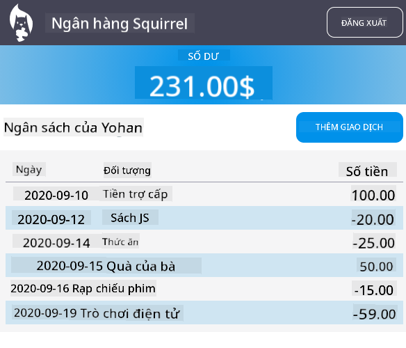

<!--
CO_OP_TRANSLATOR_METADATA:
{
  "original_hash": "f587e913e3f7c0b1c549a05dd74ee8e5",
  "translation_date": "2025-08-27T22:01:01+00:00",
  "source_file": "7-bank-project/3-data/README.md",
  "language_code": "vi"
}
-->
# Xây dựng ứng dụng ngân hàng Phần 3: Các phương pháp lấy và sử dụng dữ liệu

## Câu hỏi trước bài giảng

[Câu hỏi trước bài giảng](https://ashy-river-0debb7803.1.azurestaticapps.net/quiz/45)

### Giới thiệu

Cốt lõi của mọi ứng dụng web là *dữ liệu*. Dữ liệu có thể có nhiều dạng, nhưng mục đích chính của nó luôn là hiển thị thông tin cho người dùng. Với các ứng dụng web ngày càng trở nên tương tác và phức tạp, cách người dùng truy cập và tương tác với thông tin giờ đây là một phần quan trọng của phát triển web.

Trong bài học này, chúng ta sẽ tìm hiểu cách lấy dữ liệu từ máy chủ một cách bất đồng bộ và sử dụng dữ liệu này để hiển thị thông tin trên trang web mà không cần tải lại HTML.

### Điều kiện tiên quyết

Bạn cần đã xây dựng [Biểu mẫu Đăng nhập và Đăng ký](../2-forms/README.md) của ứng dụng web cho bài học này. Bạn cũng cần cài đặt [Node.js](https://nodejs.org) và [chạy API máy chủ](../api/README.md) cục bộ để lấy dữ liệu tài khoản.

Bạn có thể kiểm tra xem máy chủ có hoạt động đúng không bằng cách thực hiện lệnh này trong terminal:

```sh
curl http://localhost:5000/api
# -> should return "Bank API v1.0.0" as a result
```

---

## AJAX và lấy dữ liệu

Các trang web truyền thống cập nhật nội dung hiển thị khi người dùng chọn một liên kết hoặc gửi dữ liệu qua biểu mẫu bằng cách tải lại toàn bộ trang HTML. Mỗi lần cần tải dữ liệu mới, máy chủ web trả về một trang HTML hoàn toàn mới cần được trình duyệt xử lý, làm gián đoạn hành động hiện tại của người dùng và hạn chế tương tác trong quá trình tải lại. Quy trình này còn được gọi là *Ứng dụng Nhiều Trang* hoặc *MPA*.


Khi các ứng dụng web bắt đầu trở nên phức tạp và tương tác hơn, một kỹ thuật mới gọi là [AJAX (Asynchronous JavaScript and XML)](https://en.wikipedia.org/wiki/Ajax_(programming)) đã xuất hiện. Kỹ thuật này cho phép các ứng dụng web gửi và nhận dữ liệu từ máy chủ một cách bất đồng bộ bằng JavaScript mà không cần tải lại trang HTML, dẫn đến các cập nhật nhanh hơn và tương tác mượt mà hơn. Khi dữ liệu mới được nhận từ máy chủ, trang HTML hiện tại cũng có thể được cập nhật bằng JavaScript sử dụng API [DOM](https://developer.mozilla.org/docs/Web/API/Document_Object_Model). Theo thời gian, cách tiếp cận này đã phát triển thành cái mà ngày nay được gọi là [*Ứng dụng Một Trang* hoặc *SPA*](https://en.wikipedia.org/wiki/Single-page_application).


Khi AJAX lần đầu tiên được giới thiệu, API duy nhất có sẵn để lấy dữ liệu một cách bất đồng bộ là [`XMLHttpRequest`](https://developer.mozilla.org/docs/Web/API/XMLHttpRequest/Using_XMLHttpRequest). Nhưng các trình duyệt hiện đại hiện nay cũng đã triển khai API [`Fetch`](https://developer.mozilla.org/docs/Web/API/Fetch_API) tiện lợi và mạnh mẽ hơn, sử dụng promises và phù hợp hơn để xử lý dữ liệu JSON.

> Mặc dù tất cả các trình duyệt hiện đại đều hỗ trợ `Fetch API`, nếu bạn muốn ứng dụng web của mình hoạt động trên các trình duyệt cũ hoặc lỗi thời, luôn là một ý tưởng tốt để kiểm tra [bảng tương thích trên caniuse.com](https://caniuse.com/fetch) trước.

### Nhiệm vụ

Trong [bài học trước](../2-forms/README.md), chúng ta đã triển khai biểu mẫu đăng ký để tạo tài khoản. Bây giờ chúng ta sẽ thêm mã để đăng nhập bằng tài khoản hiện có và lấy dữ liệu của nó. Mở tệp `app.js` và thêm một hàm `login` mới:

```js
async function login() {
  const loginForm = document.getElementById('loginForm')
  const user = loginForm.user.value;
}
```

Ở đây chúng ta bắt đầu bằng cách lấy phần tử biểu mẫu với `getElementById()`, sau đó lấy tên người dùng từ đầu vào với `loginForm.user.value`. Mỗi điều khiển biểu mẫu có thể được truy cập bằng tên của nó (được đặt trong HTML bằng thuộc tính `name`) như một thuộc tính của biểu mẫu.

Tương tự như những gì chúng ta đã làm cho đăng ký, chúng ta sẽ tạo một hàm khác để thực hiện yêu cầu máy chủ, nhưng lần này là để lấy dữ liệu tài khoản:

```js
async function getAccount(user) {
  try {
    const response = await fetch('//localhost:5000/api/accounts/' + encodeURIComponent(user));
    return await response.json();
  } catch (error) {
    return { error: error.message || 'Unknown error' };
  }
}
```

Chúng ta sử dụng API `fetch` để yêu cầu dữ liệu một cách bất đồng bộ từ máy chủ, nhưng lần này chúng ta không cần bất kỳ tham số bổ sung nào ngoài URL để gọi, vì chúng ta chỉ đang truy vấn dữ liệu. Theo mặc định, `fetch` tạo một yêu cầu HTTP [`GET`](https://developer.mozilla.org/docs/Web/HTTP/Methods/GET), đây là điều chúng ta đang tìm kiếm.

✅ `encodeURIComponent()` là một hàm thoát các ký tự đặc biệt cho URL. Những vấn đề nào chúng ta có thể gặp phải nếu không gọi hàm này và sử dụng trực tiếp giá trị `user` trong URL?

Bây giờ hãy cập nhật hàm `login` của chúng ta để sử dụng `getAccount`:

```js
async function login() {
  const loginForm = document.getElementById('loginForm')
  const user = loginForm.user.value;
  const data = await getAccount(user);

  if (data.error) {
    return console.log('loginError', data.error);
  }

  account = data;
  navigate('/dashboard');
}
```

Đầu tiên, vì `getAccount` là một hàm bất đồng bộ, chúng ta cần kết hợp nó với từ khóa `await` để chờ kết quả từ máy chủ. Như với bất kỳ yêu cầu máy chủ nào, chúng ta cũng phải xử lý các trường hợp lỗi. Hiện tại, chúng ta chỉ thêm một thông báo nhật ký để hiển thị lỗi và sẽ quay lại sau.

Sau đó, chúng ta phải lưu dữ liệu vào đâu đó để sau này có thể sử dụng nó để hiển thị thông tin bảng điều khiển. Vì biến `account` chưa tồn tại, chúng ta sẽ tạo một biến toàn cục cho nó ở đầu tệp của chúng ta:

```js
let account = null;
```

Sau khi dữ liệu người dùng được lưu vào một biến, chúng ta có thể điều hướng từ trang *login* đến *dashboard* bằng cách sử dụng hàm `navigate()` mà chúng ta đã có.

Cuối cùng, chúng ta cần gọi hàm `login` của mình khi biểu mẫu đăng nhập được gửi, bằng cách sửa đổi HTML:

```html
<form id="loginForm" action="javascript:login()">
```

Kiểm tra xem mọi thứ có hoạt động đúng không bằng cách đăng ký một tài khoản mới và thử đăng nhập bằng tài khoản đó.

Trước khi chuyển sang phần tiếp theo, chúng ta cũng có thể hoàn thành hàm `register` bằng cách thêm đoạn này vào cuối hàm:

```js
account = result;
navigate('/dashboard');
```

✅ Bạn có biết rằng theo mặc định, bạn chỉ có thể gọi API máy chủ từ *cùng miền và cổng* với trang web bạn đang xem? Đây là cơ chế bảo mật được trình duyệt thực thi. Nhưng khoan đã, ứng dụng web của chúng ta đang chạy trên `localhost:3000` trong khi API máy chủ đang chạy trên `localhost:5000`, tại sao nó hoạt động? Bằng cách sử dụng một kỹ thuật gọi là [Chia sẻ Tài nguyên Chéo (CORS)](https://developer.mozilla.org/docs/Web/HTTP/CORS), có thể thực hiện các yêu cầu HTTP chéo miền nếu máy chủ thêm các tiêu đề đặc biệt vào phản hồi, cho phép ngoại lệ cho các miền cụ thể.

> Tìm hiểu thêm về API bằng cách tham gia [bài học này](https://docs.microsoft.com/learn/modules/use-apis-discover-museum-art/?WT.mc_id=academic-77807-sagibbon)

## Cập nhật HTML để hiển thị dữ liệu

Bây giờ chúng ta đã có dữ liệu người dùng, chúng ta phải cập nhật HTML hiện có để hiển thị nó. Chúng ta đã biết cách lấy một phần tử từ DOM bằng cách sử dụng ví dụ `document.getElementById()`. Sau khi có một phần tử cơ sở, đây là một số API bạn có thể sử dụng để sửa đổi nó hoặc thêm các phần tử con vào:

- Sử dụng thuộc tính [`textContent`](https://developer.mozilla.org/docs/Web/API/Node/textContent), bạn có thể thay đổi văn bản của một phần tử. Lưu ý rằng việc thay đổi giá trị này sẽ xóa tất cả các phần tử con của phần tử (nếu có) và thay thế bằng văn bản được cung cấp. Vì vậy, đây cũng là một phương pháp hiệu quả để xóa tất cả các phần tử con của một phần tử bằng cách gán một chuỗi rỗng `''` cho nó.

- Sử dụng [`document.createElement()`](https://developer.mozilla.org/docs/Web/API/Document/createElement) cùng với phương thức [`append()`](https://developer.mozilla.org/docs/Web/API/ParentNode/append), bạn có thể tạo và gắn một hoặc nhiều phần tử con mới.

✅ Sử dụng thuộc tính [`innerHTML`](https://developer.mozilla.org/docs/Web/API/Element/innerHTML) của một phần tử cũng có thể thay đổi nội dung HTML của nó, nhưng thuộc tính này nên tránh vì nó dễ bị tấn công [XSS (Cross-site scripting)](https://developer.mozilla.org/docs/Glossary/Cross-site_scripting).

### Nhiệm vụ

Trước khi chuyển sang màn hình bảng điều khiển, có một điều nữa chúng ta nên làm trên trang *login*. Hiện tại, nếu bạn cố gắng đăng nhập bằng tên người dùng không tồn tại, một thông báo được hiển thị trong console nhưng đối với người dùng bình thường, không có gì thay đổi và bạn không biết điều gì đang xảy ra.

Hãy thêm một phần tử giữ chỗ trong biểu mẫu đăng nhập nơi chúng ta có thể hiển thị thông báo lỗi nếu cần. Một vị trí tốt sẽ là ngay trước nút `<button>` đăng nhập:

```html
...
<div id="loginError"></div>
<button>Login</button>
...
```

Phần tử `<div>` này trống, nghĩa là không có gì sẽ được hiển thị trên màn hình cho đến khi chúng ta thêm nội dung vào nó. Chúng ta cũng đặt `id` cho nó để có thể dễ dàng lấy nó bằng JavaScript.

Quay lại tệp `app.js` và tạo một hàm trợ giúp mới `updateElement`:

```js
function updateElement(id, text) {
  const element = document.getElementById(id);
  element.textContent = text;
}
```

Hàm này khá đơn giản: với một *id* phần tử và *text*, nó sẽ cập nhật nội dung văn bản của phần tử DOM có `id` tương ứng. Hãy sử dụng phương pháp này thay cho thông báo lỗi trước đó trong hàm `login`:

```js
if (data.error) {
  return updateElement('loginError', data.error);
}
```

Bây giờ nếu bạn cố gắng đăng nhập bằng tài khoản không hợp lệ, bạn sẽ thấy điều gì đó như thế này:


Bây giờ chúng ta có văn bản lỗi hiển thị trực quan, nhưng nếu bạn thử với trình đọc màn hình, bạn sẽ nhận thấy rằng không có gì được thông báo. Để văn bản được thêm động vào trang được thông báo bởi trình đọc màn hình, nó sẽ cần sử dụng một thứ gọi là [Vùng Trực tiếp (Live Region)](https://developer.mozilla.org/docs/Web/Accessibility/ARIA/ARIA_Live_Regions). Ở đây chúng ta sẽ sử dụng một loại vùng trực tiếp cụ thể gọi là cảnh báo:

```html
<div id="loginError" role="alert"></div>
```

Thực hiện hành vi tương tự cho các lỗi trong hàm `register` (đừng quên cập nhật HTML).

## Hiển thị thông tin trên bảng điều khiển

Sử dụng các kỹ thuật chúng ta vừa thấy, chúng ta cũng sẽ xử lý việc hiển thị thông tin tài khoản trên trang bảng điều khiển.

Đây là cách một đối tượng tài khoản nhận được từ máy chủ trông như thế nào:

```json
{
  "user": "test",
  "currency": "$",
  "description": "Test account",
  "balance": 75,
  "transactions": [
    { "id": "1", "date": "2020-10-01", "object": "Pocket money", "amount": 50 },
    { "id": "2", "date": "2020-10-03", "object": "Book", "amount": -10 },
    { "id": "3", "date": "2020-10-04", "object": "Sandwich", "amount": -5 }
  ],
}
```

> Lưu ý: để làm cho công việc của bạn dễ dàng hơn, bạn có thể sử dụng tài khoản `test` đã được điền sẵn dữ liệu.

### Nhiệm vụ

Hãy bắt đầu bằng cách thay thế phần "Balance" trong HTML để thêm các phần tử giữ chỗ:

```html
<section>
  Balance: <span id="balance"></span><span id="currency"></span>
</section>
```

Chúng ta cũng sẽ thêm một phần mới ngay bên dưới để hiển thị mô tả tài khoản:

```html
<h2 id="description"></h2>
```

✅ Vì mô tả tài khoản hoạt động như một tiêu đề cho nội dung bên dưới nó, nó được đánh dấu ngữ nghĩa như một tiêu đề. Tìm hiểu thêm về cách [cấu trúc tiêu đề](https://www.nomensa.com/blog/2017/how-structure-headings-web-accessibility) quan trọng đối với khả năng truy cập và xem xét kỹ lưỡng trang để xác định những gì khác có thể là tiêu đề.

Tiếp theo, chúng ta sẽ tạo một hàm mới trong `app.js` để điền vào phần giữ chỗ:

```js
function updateDashboard() {
  if (!account) {
    return navigate('/login');
  }

  updateElement('description', account.description);
  updateElement('balance', account.balance.toFixed(2));
  updateElement('currency', account.currency);
}
```

Đầu tiên, chúng ta kiểm tra rằng chúng ta có dữ liệu tài khoản cần thiết trước khi tiếp tục. Sau đó, chúng ta sử dụng hàm `updateElement()` mà chúng ta đã tạo trước đó để cập nhật HTML.

> Để làm cho hiển thị số dư đẹp hơn, chúng ta sử dụng phương thức [`toFixed(2)`](https://developer.mozilla.org/docs/Web/JavaScript/Reference/Global_Objects/Number/toFixed) để buộc hiển thị giá trị với 2 chữ số sau dấu thập phân.

Bây giờ chúng ta cần gọi hàm `updateDashboard()` của mình mỗi khi bảng điều khiển được tải. Nếu bạn đã hoàn thành [bài tập bài học 1](../1-template-route/assignment.md), điều này sẽ khá đơn giản, nếu không bạn có thể sử dụng triển khai sau.

Thêm đoạn mã này vào cuối hàm `updateRoute()`:

```js
if (typeof route.init === 'function') {
  route.init();
}
```

Và cập nhật định nghĩa các tuyến với:

```js
const routes = {
  '/login': { templateId: 'login' },
  '/dashboard': { templateId: 'dashboard', init: updateDashboard }
};
```

Với thay đổi này, mỗi khi trang bảng điều khiển được hiển thị, hàm `updateDashboard()` sẽ được gọi. Sau khi đăng nhập, bạn sẽ có thể thấy số dư tài khoản, loại tiền và mô tả.

## Tạo các hàng bảng động với mẫu HTML

Trong [bài học đầu tiên](../1-template-route/README.md), chúng ta đã sử dụng các mẫu HTML cùng với phương thức [`appendChild()`](https://developer.mozilla.org/docs/Web/API/Node/appendChild) để triển khai điều hướng trong ứng dụng của chúng ta. Các mẫu cũng có thể nhỏ hơn và được sử dụng để điền động các phần lặp lại của trang.

Chúng ta sẽ sử dụng cách tiếp cận tương tự để hiển thị danh sách các giao dịch trong bảng HTML.

### Nhiệm vụ

Thêm một mẫu mới trong `<body>` của HTML:

```html
<template id="transaction">
  <tr>
    <td></td>
    <td></td>
    <td></td>
  </tr>
</template>
```

Mẫu này đại diện cho một hàng bảng duy nhất, với 3 cột mà chúng ta muốn điền: *ngày*, *đối tượng* và *số tiền* của một giao dịch.

Sau đó, thêm thuộc tính `id` này vào phần tử `<tbody>` của bảng trong mẫu bảng điều khiển để dễ dàng tìm thấy bằng JavaScript:

```html
<tbody id="transactions"></tbody>
```

HTML của chúng ta đã sẵn sàng, hãy chuyển sang mã JavaScript và tạo một hàm mới `createTransactionRow`:

```js
function createTransactionRow(transaction) {
  const template = document.getElementById('transaction');
  const transactionRow = template.content.cloneNode(true);
  const tr = transactionRow.querySelector('tr');
  tr.children[0].textContent = transaction.date;
  tr.children[1].textContent = transaction.object;
  tr.children[2].textContent = transaction.amount.toFixed(2);
  return transactionRow;
}
```

Hàm này làm đúng như tên gọi của nó: sử dụng mẫu chúng ta đã tạo trước đó, nó tạo một hàng bảng mới và điền nội dung của nó bằng dữ liệu giao dịch. Chúng ta sẽ sử dụng điều này trong hàm `updateDashboard()` để điền vào bảng:

```js
const transactionsRows = document.createDocumentFragment();
for (const transaction of account.transactions) {
  const transactionRow = createTransactionRow(transaction);
  transactionsRows.appendChild(transactionRow);
}
updateElement('transactions', transactionsRows);
```

Ở đây chúng ta sử dụng phương thức [`document.createDocumentFragment()`](https://developer.mozilla.org/docs/Web/API/Document/createDocumentFragment) tạo một đoạn DOM mới mà chúng ta có thể làm việc, trước khi cuối cùng gắn nó vào bảng HTML của chúng ta.

Vẫn còn một điều nữa chúng ta phải làm trước khi đoạn mã này có thể hoạt động, vì hàm `updateElement()` của chúng ta hiện chỉ hỗ trợ nội dung văn bản. Hãy thay đổi mã của nó một chút:

```js
function updateElement(id, textOrNode) {
  const element = document.getElementById(id);
  element.textContent = ''; // Removes all children
  element.append(textOrNode);
}
```

Chúng ta sử dụng phương thức [`append()`](https://developer.mozilla.org/docs/Web/API/ParentNode/append) vì nó cho phép gắn cả văn bản hoặc [DOM Nodes](https://developer.mozilla.org/docs/Web/API/Node) vào một phần tử cha, điều này hoàn hảo cho tất cả các trường hợp sử dụng của chúng ta.
Nếu bạn thử sử dụng tài khoản `test` để đăng nhập, bạn sẽ thấy danh sách giao dịch trên bảng điều khiển 🎉.

---

## 🚀 Thử thách

Hãy cùng nhau làm cho trang bảng điều khiển trông giống như một ứng dụng ngân hàng thực sự. Nếu bạn đã định dạng ứng dụng của mình, hãy thử sử dụng [media queries](https://developer.mozilla.org/docs/Web/CSS/Media_Queries) để tạo [thiết kế đáp ứng](https://developer.mozilla.org/docs/Web/Progressive_web_apps/Responsive/responsive_design_building_blocks) hoạt động tốt trên cả thiết bị máy tính và di động.

Dưới đây là một ví dụ về trang bảng điều khiển đã được định dạng:



## Câu hỏi sau bài giảng

[Câu hỏi sau bài giảng](https://ashy-river-0debb7803.1.azurestaticapps.net/quiz/46)

## Bài tập

[Refactor và thêm bình luận vào mã của bạn](assignment.md)

---

**Tuyên bố miễn trừ trách nhiệm**:  
Tài liệu này đã được dịch bằng dịch vụ dịch thuật AI [Co-op Translator](https://github.com/Azure/co-op-translator). Mặc dù chúng tôi cố gắng đảm bảo độ chính xác, xin lưu ý rằng các bản dịch tự động có thể chứa lỗi hoặc không chính xác. Tài liệu gốc bằng ngôn ngữ bản địa nên được coi là nguồn thông tin chính thức. Đối với các thông tin quan trọng, nên sử dụng dịch vụ dịch thuật chuyên nghiệp bởi con người. Chúng tôi không chịu trách nhiệm cho bất kỳ sự hiểu lầm hoặc diễn giải sai nào phát sinh từ việc sử dụng bản dịch này.