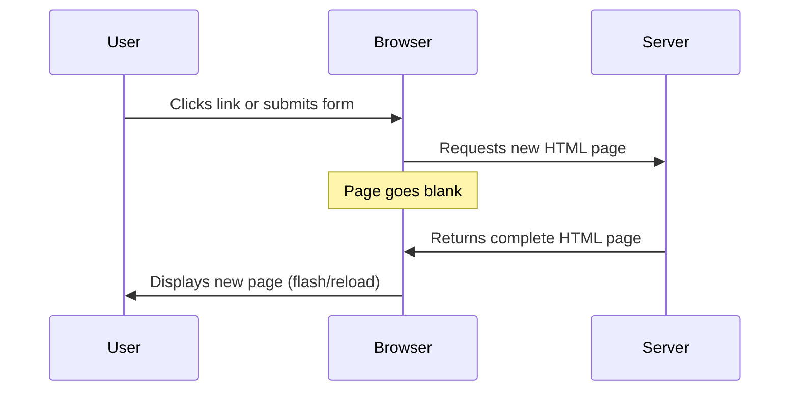
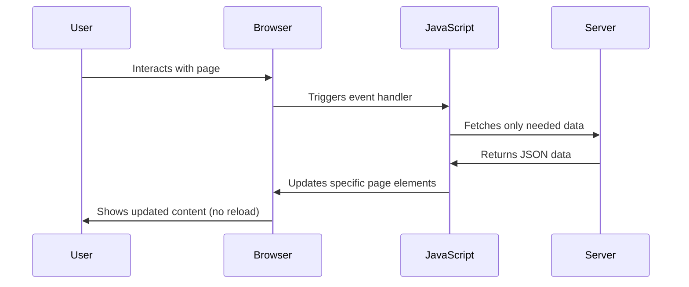
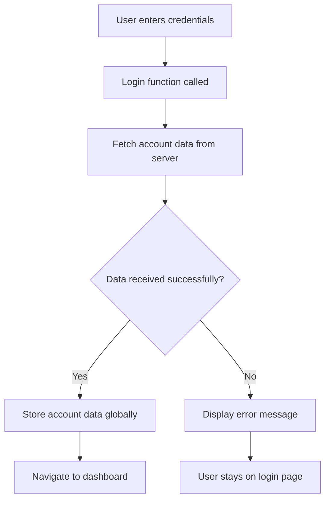
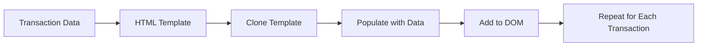

<!--
CO_OP_TRANSLATOR_METADATA:
{
  "original_hash": "2c1164912414820c8efd699b43f64954",
  "translation_date": "2025-10-24T13:44:21+00:00",
  "source_file": "7-bank-project/3-data/README.md",
  "language_code": "vi"
}
-->
# Xây dựng ứng dụng ngân hàng Phần 3: Phương pháp lấy và sử dụng dữ liệu

Hãy nghĩ về máy tính của Enterprise trong Star Trek - khi Captain Picard yêu cầu trạng thái của tàu, thông tin xuất hiện ngay lập tức mà không làm giao diện bị gián đoạn hay phải xây dựng lại toàn bộ. Dòng chảy thông tin mượt mà đó chính là điều chúng ta đang xây dựng ở đây với việc lấy dữ liệu động.

Hiện tại, ứng dụng ngân hàng của bạn giống như một tờ báo in - cung cấp thông tin nhưng tĩnh. Chúng ta sẽ biến nó thành một thứ giống như trung tâm điều khiển tại NASA, nơi dữ liệu liên tục chảy và cập nhật theo thời gian thực mà không làm gián đoạn quy trình làm việc của người dùng.

Bạn sẽ học cách giao tiếp với máy chủ một cách không đồng bộ, xử lý dữ liệu đến vào các thời điểm khác nhau, và biến thông tin thô thành thứ có ý nghĩa đối với người dùng. Đây là sự khác biệt giữa một bản demo và phần mềm sẵn sàng cho sản xuất.

## Câu hỏi trước bài giảng

[Câu hỏi trước bài giảng](https://ff-quizzes.netlify.app/web/quiz/45)

### Điều kiện tiên quyết

Trước khi đi sâu vào việc lấy dữ liệu, hãy đảm bảo bạn đã chuẩn bị các thành phần sau:

- **Bài học trước**: Hoàn thành [Biểu mẫu đăng nhập và đăng ký](../2-forms/README.md) - chúng ta sẽ xây dựng dựa trên nền tảng này
- **Máy chủ cục bộ**: Cài đặt [Node.js](https://nodejs.org) và [chạy API máy chủ](../api/README.md) để cung cấp dữ liệu tài khoản
- **Kết nối API**: Kiểm tra kết nối máy chủ của bạn với lệnh này:

```bash
curl http://localhost:5000/api
# Expected response: "Bank API v1.0.0"
```

Bài kiểm tra nhanh này đảm bảo tất cả các thành phần đang giao tiếp đúng cách:
- Xác minh rằng Node.js đang chạy đúng trên hệ thống của bạn
- Xác nhận máy chủ API của bạn đang hoạt động và phản hồi
- Kiểm tra rằng ứng dụng của bạn có thể kết nối với máy chủ (giống như kiểm tra liên lạc radio trước một nhiệm vụ)

---

## Hiểu về việc lấy dữ liệu trong ứng dụng web hiện đại

Cách các ứng dụng web xử lý dữ liệu đã thay đổi đáng kể trong hai thập kỷ qua. Hiểu được sự tiến hóa này sẽ giúp bạn đánh giá tại sao các kỹ thuật hiện đại như AJAX và Fetch API lại mạnh mẽ và tại sao chúng trở thành công cụ thiết yếu cho các nhà phát triển web.

Hãy khám phá cách các trang web truyền thống hoạt động so với các ứng dụng động, phản hồi mà chúng ta xây dựng ngày nay.

### Ứng dụng nhiều trang truyền thống (MPA)

Trong những ngày đầu của web, mỗi lần nhấp chuột giống như thay đổi kênh trên một chiếc tivi cũ - màn hình sẽ trống rỗng, sau đó từ từ hiển thị nội dung mới. Đây là thực tế của các ứng dụng web ban đầu, nơi mỗi tương tác đều yêu cầu xây dựng lại toàn bộ trang từ đầu.




**Tại sao cách tiếp cận này cảm thấy cồng kềnh:**
- Mỗi lần nhấp chuột đều yêu cầu xây dựng lại toàn bộ trang từ đầu
- Người dùng bị gián đoạn giữa chừng bởi những lần nhấp nháy trang khó chịu
- Kết nối internet của bạn phải làm việc quá sức để tải xuống cùng một tiêu đề và chân trang lặp đi lặp lại
- Ứng dụng giống như việc lục lọi trong một tủ hồ sơ hơn là sử dụng phần mềm

### Ứng dụng một trang hiện đại (SPA)

AJAX (Asynchronous JavaScript and XML) đã thay đổi hoàn toàn mô hình này. Giống như thiết kế mô-đun của Trạm Vũ trụ Quốc tế, nơi các phi hành gia có thể thay thế các thành phần riêng lẻ mà không cần xây dựng lại toàn bộ cấu trúc, AJAX cho phép chúng ta cập nhật các phần cụ thể của một trang web mà không cần tải lại toàn bộ. Mặc dù tên gọi có nhắc đến XML, chúng ta chủ yếu sử dụng JSON ngày nay, nhưng nguyên tắc cốt lõi vẫn giữ nguyên: chỉ cập nhật những gì cần thay đổi.




**Tại sao SPA cảm thấy tốt hơn:**
- Chỉ những phần thực sự thay đổi mới được cập nhật (thông minh, đúng không?)
- Không còn những gián đoạn khó chịu - người dùng của bạn vẫn giữ được dòng chảy công việc
- Ít dữ liệu di chuyển qua mạng hơn, nghĩa là tải nhanh hơn
- Mọi thứ cảm thấy nhanh nhạy và phản hồi, giống như các ứng dụng trên điện thoại của bạn

### Sự tiến hóa đến Fetch API hiện đại

Các trình duyệt hiện đại cung cấp [`Fetch` API](https://developer.mozilla.org/docs/Web/API/Fetch_API), thay thế cho [`XMLHttpRequest`](https://developer.mozilla.org/docs/Web/API/XMLHttpRequest/Using_XMLHttpRequest) cũ. Giống như sự khác biệt giữa việc vận hành một máy điện báo và sử dụng email, Fetch API sử dụng promises để viết mã không đồng bộ sạch hơn và xử lý JSON một cách tự nhiên.

| Tính năng | XMLHttpRequest | Fetch API |
|-----------|----------------|-----------|
| **Cú pháp** | Dựa trên callback phức tạp | Dựa trên promise sạch sẽ |
| **Xử lý JSON** | Yêu cầu phân tích thủ công | Phương pháp `.json()` tích hợp |
| **Xử lý lỗi** | Thông tin lỗi hạn chế | Chi tiết lỗi toàn diện |
| **Hỗ trợ hiện đại** | Tương thích với legacy | Promises và async/await của ES6+ |

> 💡 **Khả năng tương thích trình duyệt**: Tin tốt - Fetch API hoạt động trên tất cả các trình duyệt hiện đại! Nếu bạn tò mò về các phiên bản cụ thể, [caniuse.com](https://caniuse.com/fetch) có câu chuyện đầy đủ về khả năng tương thích.
> 
**Điểm mấu chốt:**
- Hoạt động tốt trên Chrome, Firefox, Safari, và Edge (về cơ bản là mọi nơi người dùng của bạn đang sử dụng)
- Chỉ Internet Explorer cần hỗ trợ thêm (và thực sự, đã đến lúc để IE nghỉ ngơi)
- Chuẩn bị hoàn hảo cho các mẫu async/await thanh lịch mà chúng ta sẽ sử dụng sau này

### Triển khai đăng nhập người dùng và lấy dữ liệu

Bây giờ hãy triển khai hệ thống đăng nhập biến ứng dụng ngân hàng của bạn từ một màn hình tĩnh thành một ứng dụng chức năng. Giống như các giao thức xác thực được sử dụng trong các cơ sở quân sự an toàn, chúng ta sẽ xác minh thông tin đăng nhập của người dùng và sau đó cung cấp quyền truy cập vào dữ liệu cụ thể của họ.

Chúng ta sẽ xây dựng điều này từng bước, bắt đầu với xác thực cơ bản và sau đó thêm khả năng lấy dữ liệu.

#### Bước 1: Tạo nền tảng cho hàm đăng nhập

Mở tệp `app.js` của bạn và thêm một hàm `login` mới. Hàm này sẽ xử lý quá trình xác thực người dùng:

```javascript
async function login() {
  const loginForm = document.getElementById('loginForm');
  const user = loginForm.user.value;
}
```

**Hãy phân tích điều này:**
- Từ khóa `async`? Nó đang nói với JavaScript "này, hàm này có thể cần chờ đợi một số thứ"
- Chúng ta đang lấy biểu mẫu từ trang (không có gì phức tạp, chỉ cần tìm nó bằng ID của nó)
- Sau đó, chúng ta lấy những gì người dùng đã nhập làm tên người dùng
- Đây là một mẹo hay: bạn có thể truy cập bất kỳ đầu vào biểu mẫu nào bằng thuộc tính `name` của nó - không cần thêm các lệnh gọi getElementById!

> 💡 **Mẫu truy cập biểu mẫu**: Mỗi điều khiển biểu mẫu có thể được truy cập bằng tên của nó (được đặt trong HTML bằng thuộc tính `name`) như một thuộc tính của phần tử biểu mẫu. Điều này cung cấp một cách sạch sẽ, dễ đọc để lấy dữ liệu biểu mẫu.

#### Bước 2: Tạo hàm lấy dữ liệu tài khoản

Tiếp theo, chúng ta sẽ tạo một hàm chuyên dụng để lấy dữ liệu tài khoản từ máy chủ. Điều này tuân theo cùng một mẫu như hàm đăng ký của bạn nhưng tập trung vào việc lấy dữ liệu:

```javascript
async function getAccount(user) {
  try {
    const response = await fetch('//localhost:5000/api/accounts/' + encodeURIComponent(user));
    return await response.json();
  } catch (error) {
    return { error: error.message || 'Unknown error' };
  }
}
```

**Đây là những gì mã này thực hiện:**
- **Sử dụng** Fetch API hiện đại để yêu cầu dữ liệu không đồng bộ
- **Xây dựng** URL yêu cầu GET với tham số tên người dùng
- **Áp dụng** `encodeURIComponent()` để xử lý an toàn các ký tự đặc biệt trong URL
- **Chuyển đổi** phản hồi sang định dạng JSON để dễ dàng thao tác dữ liệu
- **Xử lý** lỗi một cách khéo léo bằng cách trả về một đối tượng lỗi thay vì làm ứng dụng bị crash

> ⚠️ **Lưu ý về bảo mật**: Hàm `encodeURIComponent()` xử lý các ký tự đặc biệt trong URL. Giống như các hệ thống mã hóa được sử dụng trong liên lạc hải quân, nó đảm bảo thông điệp của bạn đến đúng như dự định, ngăn các ký tự như "#" hoặc "&" bị hiểu sai.
> 
**Tại sao điều này quan trọng:**
- Ngăn các ký tự đặc biệt làm hỏng URL
- Bảo vệ chống lại các cuộc tấn công thao túng URL
- Đảm bảo máy chủ của bạn nhận được dữ liệu như dự định
- Tuân theo các thực hành mã hóa an toàn

#### Hiểu về yêu cầu HTTP GET

Có một điều có thể làm bạn ngạc nhiên: khi bạn sử dụng `fetch` mà không có bất kỳ tùy chọn nào thêm, nó tự động tạo một yêu cầu [`GET`](https://developer.mozilla.org/docs/Web/HTTP/Methods/GET). Điều này hoàn hảo cho những gì chúng ta đang làm - yêu cầu máy chủ "này, tôi có thể xem dữ liệu tài khoản của người dùng này không?"

Hãy nghĩ về yêu cầu GET như việc lịch sự yêu cầu mượn một cuốn sách từ thư viện - bạn đang yêu cầu xem một thứ đã tồn tại. Yêu cầu POST (mà chúng ta đã sử dụng để đăng ký) giống như việc gửi một cuốn sách mới để thêm vào bộ sưu tập.

| Yêu cầu GET | Yêu cầu POST |
|-------------|-------------|
| **Mục đích** | Lấy dữ liệu hiện có | Gửi dữ liệu mới đến máy chủ |
| **Tham số** | Trong đường dẫn/query string của URL | Trong phần thân yêu cầu |
| **Bộ nhớ đệm** | Có thể được trình duyệt lưu trữ | Thường không được lưu trữ |
| **Bảo mật** | Hiển thị trong URL/nhật ký | Ẩn trong phần thân yêu cầu |

#### Bước 3: Kết nối tất cả lại với nhau

Bây giờ đến phần thú vị - hãy kết nối hàm lấy dữ liệu tài khoản của bạn với quy trình đăng nhập. Đây là nơi mọi thứ hòa hợp:

```javascript
async function login() {
  const loginForm = document.getElementById('loginForm');
  const user = loginForm.user.value;
  const data = await getAccount(user);

  if (data.error) {
    return console.log('loginError', data.error);
  }

  account = data;
  navigate('/dashboard');
}
```

Hàm này tuân theo một trình tự rõ ràng:
- Lấy tên người dùng từ đầu vào biểu mẫu
- Yêu cầu dữ liệu tài khoản của người dùng từ máy chủ
- Xử lý bất kỳ lỗi nào xảy ra trong quá trình
- Lưu trữ dữ liệu tài khoản và chuyển đến bảng điều khiển khi thành công

> 🎯 **Mẫu Async/Await**: Vì `getAccount` là một hàm không đồng bộ, chúng ta sử dụng từ khóa `await` để tạm dừng thực thi cho đến khi máy chủ phản hồi. Điều này ngăn mã tiếp tục với dữ liệu chưa được xác định.

#### Bước 4: Tạo nơi lưu trữ dữ liệu của bạn

Ứng dụng của bạn cần một nơi để nhớ thông tin tài khoản sau khi nó được tải. Hãy nghĩ về điều này như bộ nhớ ngắn hạn của ứng dụng - một nơi để giữ dữ liệu của người dùng hiện tại. Thêm dòng này ở đầu tệp `app.js` của bạn:

```javascript
// This holds the current user's account data
let account = null;
```

**Tại sao chúng ta cần điều này:**
- Giữ dữ liệu tài khoản có thể truy cập từ bất kỳ đâu trong ứng dụng của bạn
- Bắt đầu với `null` nghĩa là "chưa ai đăng nhập"
- Được cập nhật khi ai đó đăng nhập hoặc đăng ký thành công
- Hoạt động như một nguồn sự thật duy nhất - không có sự nhầm lẫn về việc ai đang đăng nhập

#### Bước 5: Kết nối biểu mẫu của bạn

Bây giờ hãy kết nối hàm đăng nhập mới của bạn với biểu mẫu HTML. Cập nhật thẻ biểu mẫu của bạn như sau:

```html
<form id="loginForm" action="javascript:login()">
  <!-- Your existing form inputs -->
</form>
```

**Điều mà thay đổi nhỏ này làm được:**
- Ngăn biểu mẫu thực hiện hành vi mặc định "tải lại toàn bộ trang"
- Gọi hàm JavaScript tùy chỉnh của bạn thay thế
- Giữ mọi thứ mượt mà và giống như ứng dụng một trang
- Cho phép bạn kiểm soát hoàn toàn những gì xảy ra khi người dùng nhấn "Đăng nhập"

#### Bước 6: Nâng cấp hàm đăng ký của bạn

Để nhất quán, hãy cập nhật hàm `register` của bạn để cũng lưu trữ dữ liệu tài khoản và chuyển đến bảng điều khiển:

```javascript
// Add these lines at the end of your register function
account = result;
navigate('/dashboard');
```

**Sự nâng cấp này cung cấp:**
- **Chuyển đổi mượt mà** từ đăng ký đến bảng điều khiển
- **Trải nghiệm người dùng nhất quán** giữa các luồng đăng nhập và đăng ký
- **Truy cập ngay lập tức** vào dữ liệu tài khoản sau khi đăng ký thành công

#### Kiểm tra triển khai của bạn



**Đã đến lúc thử nghiệm:**
1. Tạo một tài khoản mới để đảm bảo mọi thứ hoạt động
2. Thử đăng nhập với cùng thông tin đăng nhập đó
3. Kiểm tra bảng điều khiển trình duyệt của bạn (F12) nếu có gì đó không ổn
4. Đảm bảo bạn đến bảng điều khiển sau khi đăng nhập thành công

Nếu có gì đó không hoạt động, đừng hoảng sợ! Hầu hết các vấn đề đều là các lỗi đơn giản như sai chính tả hoặc quên khởi động máy chủ API.

#### Một lời về phép thuật Cross-Origin

Bạn có thể đang tự hỏi: "Làm thế nào ứng dụng web của tôi nói chuyện với máy chủ API này khi chúng chạy trên các cổng khác nhau?" Câu hỏi hay! Điều này liên quan đến một điều mà mọi nhà phát triển web đều gặp phải cuối cùng.

> 🔒 **Bảo mật Cross-Origin**: Trình duyệt thực thi "chính sách cùng nguồn gốc" để ngăn chặn giao tiếp trái phép giữa các miền khác nhau. Giống như hệ thống kiểm tra tại Lầu Năm Góc, chúng xác minh rằng giao tiếp được ủy quyền trước khi cho phép truyền dữ liệu.
> 
**Trong thiết lập của chúng ta:**
- Ứng dụng web của bạn chạy trên `localhost:3000` (máy chủ phát triển)
- Máy chủ API của bạn chạy trên `localhost:5000` (máy chủ backend)
- Máy chủ API bao gồm các [CORS headers](https://developer.mozilla.org/docs/Web/HTTP/CORS) cho phép giao tiếp từ ứng dụng web của bạn

Cấu hình này phản ánh phát triển thực tế nơi các ứng dụng frontend và backend thường chạy trên các máy chủ riêng biệt.

> 📚 **Tìm hiểu thêm**: Đi sâu hơn vào API và việc lấy dữ liệu với [module Microsoft Learn về API](https://docs.microsoft.com/learn/modules/use-apis-discover-museum-art/?WT.mc_id=academic-77807-sagibbon).

## Đưa dữ liệu của bạn vào HTML

Bây giờ chúng ta sẽ làm cho dữ liệu đã lấy được hiển thị với người dùng thông qua thao tác DOM. Giống như quá trình phát triển ảnh trong phòng tối, chúng ta đang biến dữ liệu vô hình thành thứ mà người dùng có thể thấy và tương tác.

Thao tác DOM là kỹ thuật biến các trang web tĩnh thành các ứng dụng động cập nhật nội dung của chúng dựa trên tương tác của người dùng và phản hồi từ máy chủ.

### Chọn công cụ phù hợp cho công việc

Khi nói đến việc cập nhật HTML của bạn bằng JavaScript, bạn có một số tùy chọn. Hãy nghĩ về những điều này như các công cụ khác nhau trong hộp công cụ - mỗi cái hoàn hảo cho các công việc cụ thể:

| Phương pháp | Điều nó làm tốt | Khi nào sử dụng | Mức độ an toàn |
|-------------|-----------------|-----------------|----------------|
| `textContent` | Hiển thị dữ liệu người dùng một cách an toàn | Bất cứ khi nào bạn hiển thị văn bản | ✅ Rất an toàn |
| `createElement()` + `append()` | Xây dựng bố cục phức tạp | Tạo các phần/mục mới | ✅ Rất an toàn |
| `innerHTML` | Đặt nội dung HTML | ⚠️ Cố gắng tránh sử dụng | ❌ Rủi ro cao |

#### Cách an toàn để hiển thị văn bản: textContent

Thuộc tính [`textContent`](https://developer.mozilla.org/docs/Web/API/Node/textContent) là người bạn tốt nhất của bạn khi hiển thị dữ liệu người dùng. Nó giống như có một người bảo vệ cho trang web của bạn - không có gì nguy hiểm được thông qua:

```javascript
// The safe, reliable way to update text
const balanceElement = document.getElementById('balance');
balanceElement.textContent = account.balance;
```

**Lợi ích của textContent:**
- Xử lý mọi thứ như văn bản thuần túy (ngăn chặn thực thi script)
- Tự động xóa nội dung hiện có
- Hiệu quả cho các cập nhật văn bản đơn giản
- Cung cấp bảo mật tích hợp chống lại nội dung độc hại

#### Tạo các phần tử HTML động
Đối với nội dung phức tạp hơn, kết hợp [`document.createElement()`](https://developer.mozilla.org/docs/Web/API/Document/createElement) với phương thức [`append()`](https://developer.mozilla.org/docs/Web/API/ParentNode/append):

```javascript
// Safe way to create new elements
const transactionItem = document.createElement('div');
transactionItem.className = 'transaction-item';
transactionItem.textContent = `${transaction.date}: ${transaction.description}`;
container.append(transactionItem);
```

**Hiểu cách tiếp cận này:**
- **Tạo** các phần tử DOM mới một cách lập trình
- **Duy trì** toàn quyền kiểm soát thuộc tính và nội dung của phần tử
- **Cho phép** cấu trúc phần tử phức tạp, lồng nhau
- **Bảo vệ** tính bảo mật bằng cách tách biệt cấu trúc khỏi nội dung

> ⚠️ **Cân nhắc về bảo mật**: Mặc dù [`innerHTML`](https://developer.mozilla.org/docs/Web/API/Element/innerHTML) xuất hiện trong nhiều hướng dẫn, nó có thể thực thi các script nhúng. Giống như các giao thức bảo mật tại CERN ngăn chặn việc thực thi mã trái phép, việc sử dụng `textContent` và `createElement` cung cấp các lựa chọn thay thế an toàn hơn.
> 
**Rủi ro của innerHTML:**
- Thực thi bất kỳ thẻ `<script>` nào trong dữ liệu người dùng
- Dễ bị tấn công chèn mã
- Tạo ra các lỗ hổng bảo mật tiềm ẩn
- Các lựa chọn thay thế an toàn mà chúng ta đang sử dụng cung cấp chức năng tương đương

### Làm cho lỗi trở nên thân thiện với người dùng

Hiện tại, các lỗi đăng nhập chỉ xuất hiện trong bảng điều khiển trình duyệt, điều này không hiển thị với người dùng. Giống như sự khác biệt giữa chẩn đoán nội bộ của phi công và hệ thống thông tin hành khách, chúng ta cần truyền đạt thông tin quan trọng qua kênh phù hợp.

Việc triển khai các thông báo lỗi hiển thị cung cấp cho người dùng phản hồi ngay lập tức về những gì đã xảy ra và cách khắc phục.

#### Bước 1: Thêm vị trí cho thông báo lỗi

Đầu tiên, hãy tạo một nơi để hiển thị thông báo lỗi trong HTML của bạn. Thêm đoạn này ngay trước nút đăng nhập để người dùng dễ dàng nhìn thấy:

```html
<!-- This is where error messages will appear -->
<div id="loginError" role="alert"></div>
<button>Login</button>
```

**Điều gì đang xảy ra ở đây:**
- Chúng ta đang tạo một container trống, chỉ hiển thị khi cần thiết
- Nó được đặt ở vị trí mà người dùng thường nhìn sau khi nhấn "Đăng nhập"
- Thuộc tính `role="alert"` là một điểm nhấn tốt cho các công cụ hỗ trợ - nó thông báo rằng "này, đây là thông tin quan trọng!"
- `id` duy nhất giúp JavaScript dễ dàng nhắm mục tiêu

#### Bước 2: Tạo một hàm tiện ích hữu ích

Hãy tạo một hàm tiện ích nhỏ có thể cập nhật văn bản của bất kỳ phần tử nào. Đây là một trong những hàm "viết một lần, sử dụng mọi nơi" sẽ tiết kiệm thời gian cho bạn:

```javascript
function updateElement(id, text) {
  const element = document.getElementById(id);
  element.textContent = text;
}
```

**Lợi ích của hàm:**
- Giao diện đơn giản chỉ yêu cầu ID phần tử và nội dung văn bản
- Tìm và cập nhật các phần tử DOM một cách an toàn
- Mẫu tái sử dụng giúp giảm sự trùng lặp mã
- Duy trì hành vi cập nhật nhất quán trên toàn ứng dụng

#### Bước 3: Hiển thị lỗi nơi người dùng có thể thấy

Bây giờ hãy thay thế thông báo ẩn trong bảng điều khiển bằng thứ gì đó mà người dùng thực sự có thể thấy. Cập nhật hàm đăng nhập của bạn:

```javascript
// Instead of just logging to console, show the user what's wrong
if (data.error) {
  return updateElement('loginError', data.error);
}
```

**Thay đổi nhỏ này tạo ra sự khác biệt lớn:**
- Thông báo lỗi xuất hiện ngay nơi người dùng đang nhìn
- Không còn những lỗi im lặng bí ẩn
- Người dùng nhận được phản hồi ngay lập tức và có thể hành động
- Ứng dụng của bạn bắt đầu cảm thấy chuyên nghiệp và chu đáo

Bây giờ khi bạn thử nghiệm với tài khoản không hợp lệ, bạn sẽ thấy một thông báo lỗi hữu ích ngay trên trang!


#### Bước 4: Bao gồm tính năng hỗ trợ tiếp cận

Điều thú vị về thuộc tính `role="alert"` mà chúng ta đã thêm trước đó - nó không chỉ là trang trí! Thuộc tính nhỏ này tạo ra cái gọi là [Live Region](https://developer.mozilla.org/docs/Web/Accessibility/ARIA/ARIA_Live_Regions) thông báo ngay lập tức các thay đổi cho các công cụ hỗ trợ:

```html
<div id="loginError" role="alert"></div>
```

**Tại sao điều này quan trọng:**
- Người dùng công cụ hỗ trợ nghe thấy thông báo lỗi ngay khi nó xuất hiện
- Mọi người đều nhận được thông tin quan trọng giống nhau, bất kể cách họ điều hướng
- Đây là cách đơn giản để làm cho ứng dụng của bạn hoạt động cho nhiều người hơn
- Thể hiện rằng bạn quan tâm đến việc tạo ra trải nghiệm toàn diện

Những chi tiết nhỏ như thế này phân biệt các nhà phát triển giỏi với những nhà phát triển xuất sắc!

#### Bước 5: Áp dụng mẫu tương tự cho đăng ký

Để đảm bảo tính nhất quán, hãy triển khai xử lý lỗi tương tự trong biểu mẫu đăng ký của bạn:

1. **Thêm** một phần tử hiển thị lỗi vào HTML đăng ký của bạn:
```html
<div id="registerError" role="alert"></div>
```

2. **Cập nhật** hàm đăng ký của bạn để sử dụng mẫu hiển thị lỗi tương tự:
```javascript
if (data.error) {
  return updateElement('registerError', data.error);
}
```

**Lợi ích của xử lý lỗi nhất quán:**
- **Cung cấp** trải nghiệm người dùng đồng nhất trên tất cả các biểu mẫu
- **Giảm** tải nhận thức bằng cách sử dụng các mẫu quen thuộc
- **Đơn giản hóa** việc bảo trì với mã tái sử dụng
- **Đảm bảo** các tiêu chuẩn hỗ trợ tiếp cận được đáp ứng trên toàn ứng dụng

## Tạo bảng điều khiển động của bạn

Bây giờ chúng ta sẽ biến bảng điều khiển tĩnh của bạn thành giao diện động hiển thị dữ liệu tài khoản thực. Giống như sự khác biệt giữa lịch trình chuyến bay in và bảng khởi hành trực tiếp tại sân bay, chúng ta đang chuyển từ thông tin tĩnh sang hiển thị thời gian thực, phản hồi.

Sử dụng các kỹ thuật thao tác DOM mà bạn đã học, chúng ta sẽ tạo một bảng điều khiển tự động cập nhật với thông tin tài khoản hiện tại.

### Tìm hiểu dữ liệu của bạn

Trước khi bắt đầu xây dựng, hãy xem qua loại dữ liệu mà máy chủ của bạn gửi lại. Khi ai đó đăng nhập thành công, đây là kho báu thông tin bạn có thể làm việc:

```json
{
  "user": "test",
  "currency": "$",
  "description": "Test account",
  "balance": 75,
  "transactions": [
    { "id": "1", "date": "2020-10-01", "object": "Pocket money", "amount": 50 },
    { "id": "2", "date": "2020-10-03", "object": "Book", "amount": -10 },
    { "id": "3", "date": "2020-10-04", "object": "Sandwich", "amount": -5 }
  ]
}
```

**Cấu trúc dữ liệu này cung cấp:**
- **`user`**: Hoàn hảo để cá nhân hóa trải nghiệm ("Chào mừng trở lại, Sarah!")
- **`currency`**: Đảm bảo chúng ta hiển thị số tiền đúng cách
- **`description`**: Tên thân thiện cho tài khoản
- **`balance`**: Số dư hiện tại quan trọng nhất
- **`transactions`**: Lịch sử giao dịch đầy đủ với tất cả chi tiết

Mọi thứ bạn cần để xây dựng một bảng điều khiển ngân hàng chuyên nghiệp!

> 💡 **Mẹo chuyên nghiệp**: Muốn thấy bảng điều khiển của bạn hoạt động ngay lập tức? Sử dụng tên người dùng `test` khi đăng nhập - nó đã được tải sẵn dữ liệu mẫu để bạn có thể thấy mọi thứ hoạt động mà không cần tạo giao dịch trước.
> 
**Tại sao tài khoản thử nghiệm hữu ích:**
- Đã có dữ liệu mẫu thực tế được tải sẵn
- Hoàn hảo để xem cách hiển thị giao dịch
- Tuyệt vời để kiểm tra các tính năng bảng điều khiển của bạn
- Giúp bạn không phải tạo dữ liệu giả một cách thủ công

### Tạo các phần tử hiển thị bảng điều khiển

Hãy xây dựng giao diện bảng điều khiển của bạn từng bước, bắt đầu với thông tin tóm tắt tài khoản và sau đó chuyển sang các tính năng phức tạp hơn như danh sách giao dịch.

#### Bước 1: Cập nhật cấu trúc HTML của bạn

Đầu tiên, thay thế phần "Số dư" tĩnh bằng các phần tử giữ chỗ động mà JavaScript của bạn có thể điền:

```html
<section>
  Balance: <span id="balance"></span><span id="currency"></span>
</section>
```

Tiếp theo, thêm một phần cho mô tả tài khoản. Vì phần này hoạt động như tiêu đề cho nội dung bảng điều khiển, hãy sử dụng HTML ngữ nghĩa:

```html
<h2 id="description"></h2>
```

**Hiểu cấu trúc HTML:**
- **Sử dụng** các phần tử `<span>` riêng biệt cho số dư và tiền tệ để kiểm soát riêng lẻ
- **Áp dụng** các ID duy nhất cho mỗi phần tử để JavaScript nhắm mục tiêu
- **Tuân theo** HTML ngữ nghĩa bằng cách sử dụng `<h2>` cho mô tả tài khoản
- **Tạo** một hệ thống phân cấp logic cho công cụ hỗ trợ và SEO

> ✅ **Thông tin hỗ trợ tiếp cận**: Mô tả tài khoản hoạt động như tiêu đề cho nội dung bảng điều khiển, vì vậy nó được đánh dấu ngữ nghĩa như một tiêu đề. Tìm hiểu thêm về cách [cấu trúc tiêu đề](https://www.nomensa.com/blog/2017/how-structure-headings-web-accessibility) ảnh hưởng đến hỗ trợ tiếp cận. Bạn có thể xác định các phần tử khác trên trang của mình có thể hưởng lợi từ thẻ tiêu đề không?

#### Bước 2: Tạo hàm cập nhật bảng điều khiển

Bây giờ hãy tạo một hàm điền dữ liệu thực tế vào bảng điều khiển của bạn:

```javascript
function updateDashboard() {
  if (!account) {
    return navigate('/login');
  }

  updateElement('description', account.description);
  updateElement('balance', account.balance.toFixed(2));
  updateElement('currency', account.currency);
}
```

**Từng bước, đây là những gì hàm này làm:**
- **Xác thực** rằng dữ liệu tài khoản tồn tại trước khi tiếp tục
- **Chuyển hướng** người dùng chưa xác thực trở lại trang đăng nhập
- **Cập nhật** mô tả tài khoản bằng cách sử dụng hàm `updateElement` tái sử dụng
- **Định dạng** số dư để luôn hiển thị hai chữ số thập phân
- **Hiển thị** ký hiệu tiền tệ phù hợp

> 💰 **Định dạng tiền**: Phương thức [`toFixed(2)`](https://developer.mozilla.org/docs/Web/JavaScript/Reference/Global_Objects/Number/toFixed) là cứu cánh! Nó đảm bảo số dư của bạn luôn trông giống như tiền thật - "75.00" thay vì chỉ "75". Người dùng của bạn sẽ đánh giá cao việc thấy định dạng tiền tệ quen thuộc.

#### Bước 3: Đảm bảo bảng điều khiển của bạn được cập nhật

Để đảm bảo bảng điều khiển của bạn làm mới với dữ liệu hiện tại mỗi khi ai đó truy cập, chúng ta cần kết nối với hệ thống điều hướng của bạn. Nếu bạn đã hoàn thành [bài tập bài học 1](../1-template-route/assignment.md), điều này sẽ cảm thấy quen thuộc. Nếu không, đừng lo - đây là những gì bạn cần:

Thêm đoạn này vào cuối hàm `updateRoute()` của bạn:

```javascript
if (typeof route.init === 'function') {
  route.init();
}
```

Sau đó cập nhật các tuyến đường của bạn để bao gồm khởi tạo bảng điều khiển:

```javascript
const routes = {
  '/login': { templateId: 'login' },
  '/dashboard': { templateId: 'dashboard', init: updateDashboard }
};
```

**Điều mà thiết lập thông minh này làm:**
- Kiểm tra xem một tuyến đường có mã khởi tạo đặc biệt không
- Tự động chạy mã đó khi tuyến đường tải
- Đảm bảo bảng điều khiển của bạn luôn hiển thị dữ liệu mới, hiện tại
- Giữ logic định tuyến của bạn sạch sẽ và có tổ chức

#### Kiểm tra bảng điều khiển của bạn

Sau khi triển khai các thay đổi này, hãy kiểm tra bảng điều khiển của bạn:

1. **Đăng nhập** bằng tài khoản thử nghiệm
2. **Xác minh** bạn được chuyển hướng đến bảng điều khiển
3. **Kiểm tra** rằng mô tả tài khoản, số dư và tiền tệ hiển thị đúng
4. **Thử đăng xuất và đăng nhập lại** để đảm bảo dữ liệu được làm mới đúng cách

Bảng điều khiển của bạn bây giờ sẽ hiển thị thông tin tài khoản động cập nhật dựa trên dữ liệu của người dùng đã đăng nhập!

## Xây dựng danh sách giao dịch thông minh với mẫu

Thay vì tạo HTML thủ công cho từng giao dịch, chúng ta sẽ sử dụng mẫu để tự động tạo định dạng nhất quán. Giống như các thành phần tiêu chuẩn được sử dụng trong sản xuất tàu vũ trụ, mẫu đảm bảo mỗi hàng giao dịch tuân theo cùng một cấu trúc và giao diện.

Kỹ thuật này mở rộng hiệu quả từ vài giao dịch đến hàng nghìn, duy trì hiệu suất và trình bày nhất quán.



### Bước 1: Tạo mẫu giao dịch

Đầu tiên, thêm một mẫu tái sử dụng cho các hàng giao dịch trong HTML `<body>` của bạn:

```html
<template id="transaction">
  <tr>
    <td></td>
    <td></td>
    <td></td>
  </tr>
</template>
```

**Hiểu mẫu HTML:**
- **Định nghĩa** cấu trúc cho một hàng bảng duy nhất
- **Vẫn** vô hình cho đến khi được nhân bản và điền dữ liệu bằng JavaScript
- **Bao gồm** ba ô cho ngày, mô tả và số tiền
- **Cung cấp** một mẫu tái sử dụng để định dạng nhất quán

### Bước 2: Chuẩn bị bảng của bạn cho nội dung động

Tiếp theo, thêm một `id` vào phần thân bảng của bạn để JavaScript dễ dàng nhắm mục tiêu:

```html
<tbody id="transactions"></tbody>
```

**Điều này đạt được:**
- **Tạo** một mục tiêu rõ ràng để chèn các hàng giao dịch
- **Tách biệt** cấu trúc bảng khỏi nội dung động
- **Cho phép** dễ dàng xóa và điền lại dữ liệu giao dịch

### Bước 3: Xây dựng hàm tạo hàng giao dịch

Bây giờ hãy tạo một hàm chuyển đổi dữ liệu giao dịch thành các phần tử HTML:

```javascript
function createTransactionRow(transaction) {
  const template = document.getElementById('transaction');
  const transactionRow = template.content.cloneNode(true);
  const tr = transactionRow.querySelector('tr');
  tr.children[0].textContent = transaction.date;
  tr.children[1].textContent = transaction.object;
  tr.children[2].textContent = transaction.amount.toFixed(2);
  return transactionRow;
}
```

**Phân tích hàm tạo này:**
- **Lấy** phần tử mẫu bằng ID của nó
- **Nhân bản** nội dung mẫu để thao tác an toàn
- **Chọn** hàng bảng trong nội dung đã nhân bản
- **Điền** từng ô với dữ liệu giao dịch
- **Định dạng** số tiền để hiển thị đúng số thập phân
- **Trả về** hàng đã hoàn thành sẵn sàng để chèn

### Bước 4: Tạo nhiều hàng giao dịch một cách hiệu quả

Thêm đoạn mã này vào hàm `updateDashboard()` của bạn để hiển thị tất cả các giao dịch:

```javascript
const transactionsRows = document.createDocumentFragment();
for (const transaction of account.transactions) {
  const transactionRow = createTransactionRow(transaction);
  transactionsRows.appendChild(transactionRow);
}
updateElement('transactions', transactionsRows);
```

**Hiểu cách tiếp cận hiệu quả này:**
- **Tạo** một tài liệu fragment để nhóm các thao tác DOM
- **Lặp qua** tất cả các giao dịch trong dữ liệu tài khoản
- **Tạo** một hàng cho mỗi giao dịch bằng hàm tạo
- **Thu thập** tất cả các hàng trong fragment trước khi thêm vào DOM
- **Thực hiện** một lần cập nhật DOM thay vì nhiều lần chèn riêng lẻ

> ⚡ **Tối ưu hóa hiệu suất**: [`document.createDocumentFragment()`](https://developer.mozilla.org/docs/Web/API/Document/createDocumentFragment) hoạt động giống như quy trình lắp ráp tại Boeing - các thành phần được chuẩn bị ngoài dòng chính, sau đó được lắp đặt như một đơn vị hoàn chỉnh. Cách tiếp cận nhóm này giảm thiểu việc tái tạo DOM bằng cách thực hiện một lần chèn thay vì nhiều thao tác riêng lẻ.

### Bước 5: Nâng cấp hàm cập nhật cho nội dung hỗn hợp

Hàm `updateElement()` của bạn hiện chỉ xử lý nội dung văn bản. Cập nhật nó để hoạt động với cả chuỗi văn bản và các nút DOM:

```javascript
function updateElement(id, textOrNode) {
  const element = document.getElementById(id);
  element.textContent = ''; // Removes all children
  element.append(textOrNode);
}
```

**Cải tiến chính trong bản cập nhật này:**
- **Xóa** nội dung hiện có trước khi thêm nội dung mới
- **Chấp nhận** chuỗi văn bản hoặc nút DOM làm tham số
- **Sử dụng** phương thức [`append()`](https://developer.mozilla.org/docs/Web/API/ParentNode/append) để linh hoạt
- **Duy trì** khả năng tương thích ngược với cách sử dụng dựa trên văn bản hiện tại

### Lái thử bảng điều khiển của bạn

Đến lúc sự thật! Hãy xem bảng điều khiển động của bạn hoạt động:

1. Đăng nhập bằng tài khoản `test` (nó đã có dữ liệu mẫu sẵn sàng)
2. Điều hướng đến bảng điều khiển của bạn
3. Kiểm tra rằng các hàng giao dịch xuất hiện với định dạng đúng
4. Đảm bảo ngày, mô tả và số tiền đều hiển thị tốt

Nếu mọi thứ hoạt động, bạn sẽ thấy danh sách giao dịch đầy đủ chức năng trên bảng điều khiển của mình! 🎉

**Những gì bạn đã đạt được:**
- Xây dựng bảng điều khiển mở rộng với bất kỳ lượng dữ liệu nào
- Tạo mẫu tái sử dụng để định dạng nhất quán
- Triển khai các kỹ thuật thao tác DOM hiệu quả
- Phát triển chức năng tương đương với các ứng dụng ngân hàng sản xuất

Bạn đã thành công biến một trang web tĩnh thành một ứng dụng web động.

---

## Thử thách GitHub Copilot Agent 🚀

Sử dụng chế độ Agent để hoàn thành thử thách sau:

**Mô tả:** Nâng cấp ứng dụng ngân hàng bằng cách triển khai tính năng tìm kiếm và lọc giao dịch cho phép người dùng tìm các giao dịch cụ thể theo khoảng thời gian, số tiền hoặc mô tả.
**Đề bài:** Tạo chức năng tìm kiếm cho ứng dụng ngân hàng bao gồm: 1) Một biểu mẫu tìm kiếm với các trường nhập liệu cho khoảng thời gian (từ/ngày đến), số tiền tối thiểu/tối đa, và từ khóa mô tả giao dịch, 2) Một hàm `filterTransactions()` để lọc mảng account.transactions dựa trên tiêu chí tìm kiếm, 3) Cập nhật hàm `updateDashboard()` để hiển thị kết quả đã lọc, và 4) Thêm nút "Xóa bộ lọc" để đặt lại giao diện. Sử dụng các phương thức mảng hiện đại của JavaScript như `filter()` và xử lý các trường hợp ngoại lệ cho tiêu chí tìm kiếm trống.

Tìm hiểu thêm về [agent mode](https://code.visualstudio.com/blogs/2025/02/24/introducing-copilot-agent-mode) tại đây.

## 🚀 Thử thách

Sẵn sàng nâng cấp ứng dụng ngân hàng của bạn lên một tầm cao mới? Hãy làm cho nó trông và hoạt động như một ứng dụng mà bạn thực sự muốn sử dụng. Dưới đây là một số ý tưởng để khơi nguồn sáng tạo của bạn:

**Làm cho nó đẹp mắt**: Thêm CSS để biến bảng điều khiển của bạn thành một giao diện hấp dẫn. Hãy nghĩ đến các đường nét sạch sẽ, khoảng cách hợp lý, và thậm chí có thể thêm một vài hiệu ứng hoạt hình tinh tế.

**Làm cho nó đáp ứng tốt**: Thử sử dụng [media queries](https://developer.mozilla.org/docs/Web/CSS/Media_Queries) để tạo [thiết kế đáp ứng](https://developer.mozilla.org/docs/Web/Progressive_web_apps/Responsive/responsive_design_building_blocks) hoạt động tốt trên điện thoại, máy tính bảng và máy tính để bàn. Người dùng của bạn sẽ rất cảm kích!

**Thêm chút phong cách**: Cân nhắc việc mã hóa màu cho các giao dịch (màu xanh cho thu nhập, màu đỏ cho chi tiêu), thêm biểu tượng, hoặc tạo hiệu ứng hover để làm cho giao diện trở nên tương tác hơn.

Dưới đây là hình ảnh minh họa về một bảng điều khiển được thiết kế đẹp mắt:


Đừng cảm thấy rằng bạn phải làm giống hệt như vậy - hãy sử dụng nó làm nguồn cảm hứng và tạo ra phong cách riêng của bạn!

## Câu hỏi sau bài giảng

[Câu hỏi sau bài giảng](https://ff-quizzes.netlify.app/web/quiz/46)

## Bài tập

[Refactor và thêm chú thích vào mã của bạn](assignment.md)

---

**Tuyên bố miễn trừ trách nhiệm**:  
Tài liệu này đã được dịch bằng dịch vụ dịch thuật AI [Co-op Translator](https://github.com/Azure/co-op-translator). Mặc dù chúng tôi cố gắng đảm bảo độ chính xác, xin lưu ý rằng các bản dịch tự động có thể chứa lỗi hoặc không chính xác. Tài liệu gốc bằng ngôn ngữ bản địa nên được coi là nguồn thông tin chính thức. Đối với thông tin quan trọng, khuyến nghị sử dụng dịch vụ dịch thuật chuyên nghiệp bởi con người. Chúng tôi không chịu trách nhiệm cho bất kỳ sự hiểu lầm hoặc diễn giải sai nào phát sinh từ việc sử dụng bản dịch này.