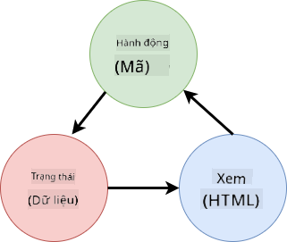
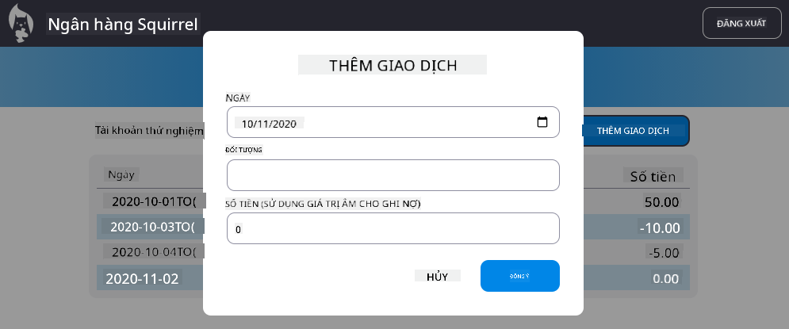

<!--
CO_OP_TRANSLATOR_METADATA:
{
  "original_hash": "32bd800759c3e943c38ad9ae6e1f51e0",
  "translation_date": "2025-10-24T13:42:14+00:00",
  "source_file": "7-bank-project/4-state-management/README.md",
  "language_code": "vi"
}
-->
# Xây dựng ứng dụng ngân hàng Phần 4: Khái niệm về Quản lý trạng thái

## Câu hỏi trước bài học

[Câu hỏi trước bài học](https://ff-quizzes.netlify.app/web/quiz/47)

## Giới thiệu

Quản lý trạng thái giống như hệ thống điều hướng trên tàu vũ trụ Voyager – khi mọi thứ hoạt động trơn tru, bạn hầu như không nhận ra nó tồn tại. Nhưng khi có vấn đề xảy ra, nó trở thành sự khác biệt giữa việc đạt đến không gian liên sao và việc trôi dạt trong khoảng không vũ trụ. Trong phát triển web, trạng thái đại diện cho tất cả những gì ứng dụng của bạn cần ghi nhớ: trạng thái đăng nhập của người dùng, dữ liệu biểu mẫu, lịch sử điều hướng và trạng thái giao diện tạm thời.

Khi ứng dụng ngân hàng của bạn đã phát triển từ một biểu mẫu đăng nhập đơn giản thành một ứng dụng phức tạp hơn, bạn có thể đã gặp phải một số thách thức phổ biến. Làm mới trang và người dùng bị đăng xuất một cách bất ngờ. Đóng trình duyệt và mọi tiến trình biến mất. Gỡ lỗi một vấn đề và bạn phải tìm kiếm qua nhiều hàm khác nhau, tất cả đều sửa đổi cùng một dữ liệu theo các cách khác nhau.

Đây không phải là dấu hiệu của việc lập trình kém – chúng là những khó khăn tự nhiên xảy ra khi ứng dụng đạt đến một ngưỡng phức tạp nhất định. Mỗi nhà phát triển đều phải đối mặt với những thách thức này khi ứng dụng của họ chuyển từ "bằng chứng khái niệm" sang "sẵn sàng sản xuất."

Trong bài học này, chúng ta sẽ triển khai một hệ thống quản lý trạng thái tập trung, biến ứng dụng ngân hàng của bạn thành một ứng dụng chuyên nghiệp, đáng tin cậy. Bạn sẽ học cách quản lý luồng dữ liệu một cách có thể dự đoán, duy trì phiên người dùng một cách phù hợp và tạo ra trải nghiệm người dùng mượt mà mà các ứng dụng web hiện đại yêu cầu.

## Điều kiện tiên quyết

Trước khi đi sâu vào các khái niệm quản lý trạng thái, bạn cần thiết lập môi trường phát triển của mình đúng cách và có nền tảng ứng dụng ngân hàng sẵn sàng. Bài học này xây dựng trực tiếp trên các khái niệm và mã từ các phần trước của loạt bài này.

Hãy đảm bảo bạn đã chuẩn bị các thành phần sau trước khi tiếp tục:

**Thiết lập cần thiết:**
- Hoàn thành bài học [lấy dữ liệu](../3-data/README.md) - ứng dụng của bạn phải tải và hiển thị dữ liệu tài khoản thành công
- Cài đặt [Node.js](https://nodejs.org) trên hệ thống của bạn để chạy API backend
- Khởi động [API server](../api/README.md) cục bộ để xử lý các thao tác dữ liệu tài khoản

**Kiểm tra môi trường của bạn:**

Xác minh rằng API server của bạn đang chạy đúng cách bằng cách thực hiện lệnh này trong terminal:

```sh
curl http://localhost:5000/api
# -> should return "Bank API v1.0.0" as a result
```

**Lệnh này làm gì:**
- **Gửi** yêu cầu GET đến API server cục bộ của bạn
- **Kiểm tra** kết nối và xác minh server đang phản hồi
- **Trả về** thông tin phiên bản API nếu mọi thứ hoạt động đúng cách

---

## Chẩn đoán các vấn đề trạng thái hiện tại

Giống như Sherlock Holmes kiểm tra hiện trường vụ án, chúng ta cần hiểu chính xác điều gì đang xảy ra trong triển khai hiện tại trước khi có thể giải quyết bí ẩn về các phiên người dùng biến mất.

Hãy thực hiện một thí nghiệm đơn giản để tiết lộ các thách thức quản lý trạng thái cơ bản:

**🧪 Thử nghiệm chẩn đoán này:**
1. Đăng nhập vào ứng dụng ngân hàng của bạn và điều hướng đến bảng điều khiển
2. Làm mới trang trình duyệt
3. Quan sát điều gì xảy ra với trạng thái đăng nhập của bạn

Nếu bạn bị chuyển hướng trở lại màn hình đăng nhập, bạn đã phát hiện ra vấn đề cổ điển về duy trì trạng thái. Hành vi này xảy ra vì triển khai hiện tại của chúng ta lưu trữ dữ liệu người dùng trong các biến JavaScript, những biến này sẽ được đặt lại mỗi khi tải lại trang.

**Các vấn đề triển khai hiện tại:**

Biến `account` đơn giản từ bài học [trước](../3-data/README.md) tạo ra ba vấn đề lớn ảnh hưởng đến cả trải nghiệm người dùng và khả năng duy trì mã:

| Vấn đề | Nguyên nhân kỹ thuật | Tác động đến người dùng |
|--------|----------------------|-------------------------|
| **Mất phiên** | Làm mới trang xóa các biến JavaScript | Người dùng phải xác thực lại thường xuyên |
| **Cập nhật rải rác** | Nhiều hàm sửa đổi trạng thái trực tiếp | Việc gỡ lỗi trở nên ngày càng khó khăn |
| **Dọn dẹp không hoàn chỉnh** | Đăng xuất không xóa tất cả tham chiếu trạng thái | Các vấn đề về bảo mật và quyền riêng tư tiềm ẩn |

**Thách thức kiến trúc:**

Giống như thiết kế ngăn cách của Titanic tưởng chừng như mạnh mẽ cho đến khi nhiều ngăn bị ngập nước cùng lúc, việc sửa chữa các vấn đề này riêng lẻ sẽ không giải quyết được vấn đề kiến trúc cơ bản. Chúng ta cần một giải pháp quản lý trạng thái toàn diện.

> 💡 **Chúng ta thực sự đang cố gắng đạt được điều gì ở đây?**

[Quản lý trạng thái](https://en.wikipedia.org/wiki/State_management) thực sự là về việc giải quyết hai câu đố cơ bản:

1. **Dữ liệu của tôi ở đâu?**: Theo dõi thông tin chúng ta có và nơi nó đến
2. **Mọi người có đồng bộ không?**: Đảm bảo những gì người dùng thấy khớp với những gì thực sự đang xảy ra

**Kế hoạch của chúng ta:**

Thay vì chạy vòng quanh, chúng ta sẽ tạo một hệ thống **quản lý trạng thái tập trung**. Hãy nghĩ về nó như có một người thực sự tổ chức chịu trách nhiệm về tất cả những thứ quan trọng:



**Hiểu luồng dữ liệu này:**
- **Tập trung** tất cả trạng thái ứng dụng tại một vị trí
- **Định tuyến** tất cả thay đổi trạng thái thông qua các hàm được kiểm soát
- **Đảm bảo** giao diện người dùng luôn đồng bộ với trạng thái hiện tại
- **Cung cấp** một mẫu rõ ràng, có thể dự đoán cho quản lý dữ liệu

> 💡 **Thông tin chuyên nghiệp**: Bài học này tập trung vào các khái niệm cơ bản. Đối với các ứng dụng phức tạp, các thư viện như [Redux](https://redux.js.org) cung cấp các tính năng quản lý trạng thái nâng cao hơn. Hiểu các nguyên tắc cốt lõi này sẽ giúp bạn làm chủ bất kỳ thư viện quản lý trạng thái nào.

> ⚠️ **Chủ đề nâng cao**: Chúng ta sẽ không đề cập đến việc cập nhật giao diện người dùng tự động được kích hoạt bởi thay đổi trạng thái, vì điều này liên quan đến các khái niệm [Lập trình phản ứng](https://en.wikipedia.org/wiki/Reactive_programming). Hãy coi đây là một bước tiếp theo tuyệt vời cho hành trình học tập của bạn!

### Nhiệm vụ: Tập trung cấu trúc trạng thái

Hãy bắt đầu chuyển đổi quản lý trạng thái rải rác của chúng ta thành một hệ thống tập trung. Bước đầu tiên này thiết lập nền tảng cho tất cả các cải tiến tiếp theo.

**Bước 1: Tạo một đối tượng trạng thái tập trung**

Thay thế khai báo `account` đơn giản:

```js
let account = null;
```

Bằng một đối tượng trạng thái có cấu trúc:

```js
let state = {
  account: null
};
```

**Tại sao thay đổi này quan trọng:**
- **Tập trung** tất cả dữ liệu ứng dụng tại một vị trí
- **Chuẩn bị** cấu trúc để thêm các thuộc tính trạng thái khác sau này
- **Tạo** ranh giới rõ ràng giữa trạng thái và các biến khác
- **Thiết lập** một mẫu có thể mở rộng khi ứng dụng của bạn phát triển

**Bước 2: Cập nhật mẫu truy cập trạng thái**

Cập nhật các hàm của bạn để sử dụng cấu trúc trạng thái mới:

**Trong các hàm `register()` và `login()`**, thay thế:
```js
account = ...
```

Bằng:
```js
state.account = ...
```

**Trong hàm `updateDashboard()`**, thêm dòng này ở đầu:
```js
const account = state.account;
```

**Những cập nhật này đạt được điều gì:**
- **Duy trì** chức năng hiện có trong khi cải thiện cấu trúc
- **Chuẩn bị** mã của bạn cho quản lý trạng thái tinh vi hơn
- **Tạo** các mẫu nhất quán để truy cập dữ liệu trạng thái
- **Thiết lập** nền tảng cho các cập nhật trạng thái tập trung

> 💡 **Lưu ý**: Việc tái cấu trúc này không ngay lập tức giải quyết các vấn đề của chúng ta, nhưng nó tạo ra nền tảng thiết yếu cho các cải tiến mạnh mẽ sắp tới!

## Triển khai các cập nhật trạng thái được kiểm soát

Với trạng thái của chúng ta được tập trung, bước tiếp theo liên quan đến việc thiết lập các cơ chế kiểm soát cho các sửa đổi dữ liệu. Cách tiếp cận này đảm bảo các thay đổi trạng thái có thể dự đoán và dễ dàng gỡ lỗi.

Nguyên tắc cốt lõi giống như kiểm soát không lưu: thay vì cho phép nhiều hàm sửa đổi trạng thái độc lập, chúng ta sẽ chuyển tất cả các thay đổi qua một hàm kiểm soát duy nhất. Mẫu này cung cấp sự giám sát rõ ràng về thời điểm và cách dữ liệu thay đổi.

**Quản lý trạng thái bất biến:**

Chúng ta sẽ xử lý đối tượng `state` của mình như [*bất biến*](https://en.wikipedia.org/wiki/Immutable_object), nghĩa là chúng ta không bao giờ sửa đổi nó trực tiếp. Thay vào đó, mỗi thay đổi tạo ra một đối tượng trạng thái mới với dữ liệu được cập nhật.

Mặc dù cách tiếp cận này ban đầu có vẻ không hiệu quả so với việc sửa đổi trực tiếp, nhưng nó mang lại những lợi ích đáng kể cho việc gỡ lỗi, kiểm tra và duy trì tính dự đoán của ứng dụng.

**Lợi ích của quản lý trạng thái bất biến:**

| Lợi ích | Mô tả | Tác động |
|---------|-------|---------|
| **Tính dự đoán** | Các thay đổi chỉ xảy ra thông qua các hàm kiểm soát | Dễ dàng gỡ lỗi và kiểm tra |
| **Theo dõi lịch sử** | Mỗi thay đổi trạng thái tạo ra một đối tượng mới | Cho phép chức năng hoàn tác/làm lại |
| **Ngăn chặn tác động phụ** | Không có sửa đổi ngẫu nhiên | Ngăn chặn lỗi bí ẩn |
| **Tối ưu hóa hiệu suất** | Dễ dàng phát hiện khi trạng thái thực sự thay đổi | Cho phép cập nhật giao diện người dùng hiệu quả |

**Tính bất biến trong JavaScript với `Object.freeze()`:**

JavaScript cung cấp [`Object.freeze()`](https://developer.mozilla.org/docs/Web/JavaScript/Reference/Global_Objects/Object/freeze) để ngăn chặn sửa đổi đối tượng:

```js
const immutableState = Object.freeze({ account: userData });
// Any attempt to modify immutableState will throw an error
```

**Phân tích điều gì xảy ra ở đây:**
- **Ngăn chặn** các gán hoặc xóa thuộc tính trực tiếp
- **Ném** ngoại lệ nếu có nỗ lực sửa đổi
- **Đảm bảo** các thay đổi trạng thái phải thông qua các hàm kiểm soát
- **Tạo** một hợp đồng rõ ràng về cách trạng thái có thể được cập nhật

> 💡 **Khám phá sâu**: Tìm hiểu sự khác biệt giữa đối tượng bất biến *nông* và *sâu* trong [tài liệu MDN](https://developer.mozilla.org/docs/Web/JavaScript/Reference/Global_Objects/Object/freeze#What_is_shallow_freeze). Hiểu sự khác biệt này rất quan trọng đối với các cấu trúc trạng thái phức tạp.

### Nhiệm vụ

Hãy tạo một hàm `updateState()` mới:

```js
function updateState(property, newData) {
  state = Object.freeze({
    ...state,
    [property]: newData
  });
}
```

Trong hàm này, chúng ta tạo một đối tượng trạng thái mới và sao chép dữ liệu từ trạng thái trước đó bằng [*toán tử spread (`...`)*](https://developer.mozilla.org/docs/Web/JavaScript/Reference/Operators/Spread_syntax#Spread_in_object_literals). Sau đó, chúng ta ghi đè một thuộc tính cụ thể của đối tượng trạng thái với dữ liệu mới bằng [cú pháp ngoặc vuông](https://developer.mozilla.org/docs/Web/JavaScript/Guide/Working_with_Objects#Objects_and_properties) `[property]` để gán. Cuối cùng, chúng ta khóa đối tượng để ngăn chặn sửa đổi bằng `Object.freeze()`. Hiện tại, chúng ta chỉ lưu trữ thuộc tính `account` trong trạng thái, nhưng với cách tiếp cận này, bạn có thể thêm bao nhiêu thuộc tính tùy thích vào trạng thái.

Chúng ta cũng sẽ cập nhật khởi tạo `state` để đảm bảo trạng thái ban đầu cũng được đóng băng:

```js
let state = Object.freeze({
  account: null
});
```

Sau đó, cập nhật hàm `register` bằng cách thay thế `state.account = result;` với:

```js
updateState('account', result);
```

Làm tương tự với hàm `login`, thay thế `state.account = data;` bằng:

```js
updateState('account', data);
```

Chúng ta sẽ tận dụng cơ hội này để sửa lỗi dữ liệu tài khoản không được xóa khi người dùng nhấp vào *Đăng xuất*.

Tạo một hàm mới `logout()`:

```js
function logout() {
  updateState('account', null);
  navigate('/login');
}
```

Trong `updateDashboard()`, thay thế chuyển hướng `return navigate('/login');` bằng `return logout();`

Hãy thử đăng ký tài khoản mới, đăng xuất và đăng nhập lại để kiểm tra rằng mọi thứ vẫn hoạt động đúng cách.

> Mẹo: bạn có thể xem tất cả các thay đổi trạng thái bằng cách thêm `console.log(state)` ở cuối `updateState()` và mở bảng điều khiển trong công cụ phát triển của trình duyệt.

## Triển khai duy trì dữ liệu

Vấn đề mất phiên mà chúng ta đã xác định trước đó yêu cầu một giải pháp duy trì để giữ trạng thái người dùng qua các phiên trình duyệt. Điều này biến ứng dụng của chúng ta từ một trải nghiệm tạm thời thành một công cụ chuyên nghiệp, đáng tin cậy.

Hãy xem xét cách đồng hồ nguyên tử duy trì thời gian chính xác ngay cả khi mất điện bằng cách lưu trữ trạng thái quan trọng trong bộ nhớ không bay hơi. Tương tự, các ứng dụng web cần các cơ chế lưu trữ bền vững để bảo toàn dữ liệu người dùng thiết yếu qua các phiên trình duyệt và làm mới trang.

**Câu hỏi chiến lược cho duy trì dữ liệu:**

Trước khi triển khai duy trì, hãy xem xét các yếu tố quan trọng sau:

| Câu hỏi | Ngữ cảnh ứng dụng ngân hàng | Tác động quyết định |
|---------|-----------------------------|--------------------|
| **Dữ liệu có nhạy cảm không?** | Số dư tài khoản, lịch sử giao dịch | Chọn phương pháp lưu trữ an toàn |
| **Dữ liệu nên duy trì bao lâu?** | Trạng thái đăng nhập so với tùy chọn giao diện tạm thời | Chọn thời gian lưu trữ phù hợp |
| **Server có cần dữ liệu không?** | Token xác thực so với cài đặt giao diện | Xác định yêu cầu chia sẻ |

**Các tùy chọn lưu trữ trình duyệt:**

Các trình duyệt hiện đại cung cấp một số cơ chế lưu trữ, mỗi cơ chế được thiết kế cho các trường hợp sử dụng khác nhau:

**Các API lưu trữ chính:**

1. **[`localStorage`](https://developer.mozilla.org/docs/Web/API/Window/localStorage)**: Lưu trữ [Key/Value](https://en.wikipedia.org/wiki/Key%E2%80%93value_database) bền vững
   - **Duy trì** dữ liệu qua các phiên trình duyệt vô thời hạn  
   - **Tồn tại** qua các lần khởi động lại trình duyệt và máy tính
   - **Phạm vi** cho miền trang web cụ thể
   - **Hoàn hảo** cho tùy chọn người dùng và trạng thái đăng nhập

2. **[`sessionStorage`](https://developer.mozilla.org/docs/Web/API/Window/sessionStorage)**: Lưu trữ phiên tạm thời
   - **Hoạt động** giống hệt localStorage trong các phiên hoạt động
   - **Xóa** tự động khi tab trình duyệt đóng
   - **Lý tưởng** cho dữ liệu tạm thời không nên duy trì

3. **[HTTP Cookies](https://developer.mozilla.org/docs/Web/HTTP/Cookies)**: Lưu trữ chia sẻ với server
   - **Tự động** gửi với mọi yêu cầu server
   - **Hoàn hảo** cho [token xác thực](https://en.wikipedia.org/wiki/Authentication)
   - **Giới hạn** về kích thước và có thể ảnh hưởng đến hiệu suất

**Yêu cầu tuần tự hóa dữ liệu:**

Cả `localStorage` và `sessionStorage` chỉ lưu trữ [chuỗi](https://developer.mozilla.org/docs/Web/JavaScript/Reference/Global_Objects/String):

```js
// Convert objects to JSON strings for storage
const accountData = { user: 'john', balance: 150 };
localStorage.setItem('account', JSON.stringify(accountData));

// Parse JSON strings back to objects when retrieving
const savedAccount = JSON.parse(localStorage.getItem('account'));
```

**Hiểu tuần tự hóa:**
- **Chuyển đổi** các đối tượng JavaScript thành chuỗi JSON bằng [`JSON.stringify()`](https://developer.mozilla.org/docs/Web/JavaScript/Reference/Global_Objects/JSON/stringify)
- **Tái tạo** các đối tượng từ JSON bằng [`JSON.parse()`](https://developer.mozilla.org/docs/Web/JavaScript/Reference/Global_Objects/JSON/parse)
- **Xử lý** các đối tượng lồng nhau và mảng phức tạp tự động
- **Thất bại** với các hàm, giá trị undefined và tham chiếu vòng lặp
> 💡 **Tùy chọn nâng cao**: Đối với các ứng dụng offline phức tạp với dữ liệu lớn, hãy cân nhắc sử dụng [`IndexedDB` API](https://developer.mozilla.org/docs/Web/API/IndexedDB_API). Nó cung cấp một cơ sở dữ liệu đầy đủ phía client nhưng yêu cầu triển khai phức tạp hơn.

### Nhiệm vụ: Triển khai lưu trữ với localStorage

Hãy triển khai lưu trữ dữ liệu để người dùng vẫn đăng nhập cho đến khi họ chủ động đăng xuất. Chúng ta sẽ sử dụng `localStorage` để lưu trữ dữ liệu tài khoản qua các phiên trình duyệt.

**Bước 1: Định nghĩa cấu hình lưu trữ**

```js
const storageKey = 'savedAccount';
```

**Những gì hằng số này cung cấp:**
- **Tạo** một định danh nhất quán cho dữ liệu được lưu trữ
- **Ngăn chặn** lỗi chính tả trong các tham chiếu khóa lưu trữ
- **Dễ dàng** thay đổi khóa lưu trữ khi cần
- **Tuân theo** các nguyên tắc tốt nhất để viết mã dễ bảo trì

**Bước 2: Thêm tính năng lưu trữ tự động**

Thêm dòng này vào cuối hàm `updateState()`:

```js
localStorage.setItem(storageKey, JSON.stringify(state.account));
```

**Phân tích những gì xảy ra ở đây:**
- **Chuyển đổi** đối tượng tài khoản thành chuỗi JSON để lưu trữ
- **Lưu** dữ liệu bằng khóa lưu trữ nhất quán
- **Thực thi** tự động mỗi khi trạng thái thay đổi
- **Đảm bảo** dữ liệu lưu trữ luôn đồng bộ với trạng thái hiện tại

> 💡 **Lợi ích kiến trúc**: Vì chúng ta đã tập trung tất cả các cập nhật trạng thái thông qua `updateState()`, việc thêm tính năng lưu trữ chỉ cần một dòng mã. Điều này cho thấy sức mạnh của các quyết định kiến trúc tốt!

**Bước 3: Khôi phục trạng thái khi ứng dụng tải**

Tạo một hàm khởi tạo để khôi phục dữ liệu đã lưu:

```js
function init() {
  const savedAccount = localStorage.getItem(storageKey);
  if (savedAccount) {
    updateState('account', JSON.parse(savedAccount));
  }

  // Our previous initialization code
  window.onpopstate = () => updateRoute();
  updateRoute();
}

init();
```

**Hiểu quy trình khởi tạo:**
- **Lấy** bất kỳ dữ liệu tài khoản nào đã lưu trước đó từ localStorage
- **Phân tích** chuỗi JSON trở lại thành đối tượng JavaScript
- **Cập nhật** trạng thái bằng hàm cập nhật được kiểm soát
- **Khôi phục** phiên người dùng tự động khi tải trang
- **Thực thi** trước khi cập nhật route để đảm bảo trạng thái có sẵn

**Bước 4: Tối ưu hóa route mặc định**

Cập nhật route mặc định để tận dụng tính năng lưu trữ:

Trong `updateRoute()`, thay thế:
```js
// Replace: return navigate('/login');
return navigate('/dashboard');
```

**Tại sao thay đổi này hợp lý:**
- **Tận dụng** hệ thống lưu trữ mới một cách hiệu quả
- **Cho phép** dashboard xử lý kiểm tra xác thực
- **Chuyển hướng** đến trang đăng nhập tự động nếu không có phiên đã lưu
- **Tạo** trải nghiệm người dùng mượt mà hơn

**Kiểm tra triển khai của bạn:**

1. Đăng nhập vào ứng dụng ngân hàng của bạn
2. Làm mới trang trình duyệt
3. Xác minh rằng bạn vẫn đăng nhập và ở trên dashboard
4. Đóng và mở lại trình duyệt của bạn
5. Quay lại ứng dụng và xác nhận rằng bạn vẫn đăng nhập

🎉 **Thành tựu đạt được**: Bạn đã triển khai thành công quản lý trạng thái lưu trữ! Ứng dụng của bạn giờ đây hoạt động như một ứng dụng web chuyên nghiệp.

## Cân bằng giữa lưu trữ và độ mới của dữ liệu

Hệ thống lưu trữ của chúng ta duy trì phiên người dùng thành công, nhưng lại tạo ra một thách thức mới: dữ liệu cũ. Khi nhiều người dùng hoặc ứng dụng thay đổi cùng một dữ liệu trên máy chủ, thông tin được lưu trữ cục bộ trở nên lỗi thời.

Tình huống này giống như các nhà hàng hải Viking dựa vào cả bản đồ sao đã lưu trữ và các quan sát thiên văn hiện tại. Bản đồ cung cấp sự nhất quán, nhưng các nhà hàng hải cần các quan sát mới để tính đến điều kiện thay đổi. Tương tự, ứng dụng của chúng ta cần cả trạng thái người dùng lưu trữ và dữ liệu máy chủ hiện tại.

**🧪 Khám phá vấn đề dữ liệu cũ:**

1. Đăng nhập vào dashboard bằng tài khoản `test`
2. Chạy lệnh này trong terminal để mô phỏng một giao dịch từ nguồn khác:

```sh
curl --request POST \
     --header "Content-Type: application/json" \
     --data "{ \"date\": \"2020-07-24\", \"object\": \"Bought book\", \"amount\": -20 }" \
     http://localhost:5000/api/accounts/test/transactions
```

3. Làm mới trang dashboard của bạn trong trình duyệt
4. Quan sát xem bạn có thấy giao dịch mới hay không

**Những gì bài kiểm tra này cho thấy:**
- **Chỉ ra** cách localStorage có thể trở nên "cũ" (lỗi thời)
- **Mô phỏng** các tình huống thực tế khi dữ liệu thay đổi bên ngoài ứng dụng của bạn
- **Tiết lộ** sự căng thẳng giữa lưu trữ và độ mới của dữ liệu

**Thách thức dữ liệu cũ:**

| Vấn đề | Nguyên nhân | Tác động đến người dùng |
|--------|-------------|--------------------------|
| **Dữ liệu cũ** | localStorage không tự động hết hạn | Người dùng thấy thông tin lỗi thời |
| **Thay đổi máy chủ** | Các ứng dụng/người dùng khác thay đổi cùng dữ liệu | Hiển thị không nhất quán trên các nền tảng |
| **Bộ nhớ cache vs. Thực tế** | Bộ nhớ cache cục bộ không khớp với trạng thái máy chủ | Trải nghiệm người dùng kém và gây nhầm lẫn |

**Chiến lược giải pháp:**

Chúng ta sẽ triển khai một mô hình "làm mới khi tải" để cân bằng lợi ích của lưu trữ với nhu cầu về dữ liệu mới. Cách tiếp cận này duy trì trải nghiệm người dùng mượt mà trong khi đảm bảo độ chính xác của dữ liệu.

### Nhiệm vụ: Triển khai hệ thống làm mới dữ liệu

Chúng ta sẽ tạo một hệ thống tự động lấy dữ liệu mới từ máy chủ trong khi vẫn duy trì lợi ích của quản lý trạng thái lưu trữ.

**Bước 1: Tạo hàm cập nhật dữ liệu tài khoản**

```js
async function updateAccountData() {
  const account = state.account;
  if (!account) {
    return logout();
  }

  const data = await getAccount(account.user);
  if (data.error) {
    return logout();
  }

  updateState('account', data);
}
```

**Hiểu logic của hàm này:**
- **Kiểm tra** xem người dùng hiện có đang đăng nhập hay không (state.account tồn tại)
- **Chuyển hướng** đến đăng xuất nếu không tìm thấy phiên hợp lệ
- **Lấy** dữ liệu tài khoản mới từ máy chủ bằng hàm `getAccount()` hiện có
- **Xử lý** lỗi máy chủ một cách linh hoạt bằng cách đăng xuất các phiên không hợp lệ
- **Cập nhật** trạng thái với dữ liệu mới bằng hệ thống cập nhật được kiểm soát
- **Kích hoạt** lưu trữ tự động qua hàm `updateState()`

**Bước 2: Tạo trình xử lý làm mới dashboard**

```js
async function refresh() {
  await updateAccountData();
  updateDashboard();
}
```

**Những gì hàm làm mới này thực hiện:**
- **Phối hợp** quá trình làm mới dữ liệu và cập nhật giao diện người dùng
- **Chờ** dữ liệu mới được tải trước khi cập nhật hiển thị
- **Đảm bảo** dashboard hiển thị thông tin mới nhất
- **Duy trì** sự tách biệt rõ ràng giữa quản lý dữ liệu và cập nhật giao diện người dùng

**Bước 3: Tích hợp với hệ thống route**

Cập nhật cấu hình route của bạn để tự động kích hoạt làm mới:

```js
const routes = {
  '/login': { templateId: 'login' },
  '/dashboard': { templateId: 'dashboard', init: refresh }
};
```

**Cách tích hợp này hoạt động:**
- **Thực thi** hàm làm mới mỗi khi route dashboard được tải
- **Đảm bảo** dữ liệu mới luôn được hiển thị khi người dùng điều hướng đến dashboard
- **Duy trì** cấu trúc route hiện có trong khi thêm độ mới của dữ liệu
- **Cung cấp** một mô hình nhất quán cho khởi tạo theo route

**Kiểm tra hệ thống làm mới dữ liệu của bạn:**

1. Đăng nhập vào ứng dụng ngân hàng của bạn
2. Chạy lệnh curl từ trước để tạo một giao dịch mới
3. Làm mới trang dashboard của bạn hoặc điều hướng đi và quay lại
4. Xác minh rằng giao dịch mới xuất hiện ngay lập tức

🎉 **Cân bằng hoàn hảo đạt được**: Ứng dụng của bạn giờ đây kết hợp trải nghiệm mượt mà của trạng thái lưu trữ với độ chính xác của dữ liệu máy chủ mới!

## Thử thách GitHub Copilot Agent 🚀

Sử dụng chế độ Agent để hoàn thành thử thách sau:

**Mô tả:** Triển khai một hệ thống quản lý trạng thái toàn diện với chức năng hoàn tác/làm lại cho ứng dụng ngân hàng. Thử thách này sẽ giúp bạn thực hành các khái niệm quản lý trạng thái nâng cao bao gồm theo dõi lịch sử trạng thái, cập nhật bất biến và đồng bộ hóa giao diện người dùng.

**Yêu cầu:** Tạo một hệ thống quản lý trạng thái nâng cao bao gồm: 1) Một mảng lịch sử trạng thái theo dõi tất cả các trạng thái trước đó, 2) Các hàm hoàn tác và làm lại có thể quay lại các trạng thái trước đó, 3) Các nút giao diện người dùng cho các thao tác hoàn tác/làm lại trên dashboard, 4) Giới hạn lịch sử tối đa là 10 trạng thái để tránh vấn đề bộ nhớ, và 5) Dọn dẹp lịch sử đúng cách khi người dùng đăng xuất. Đảm bảo chức năng hoàn tác/làm lại hoạt động với các thay đổi số dư tài khoản và duy trì qua các lần làm mới trình duyệt.

Tìm hiểu thêm về [chế độ agent](https://code.visualstudio.com/blogs/2025/02/24/introducing-copilot-agent-mode) tại đây.

## 🚀 Thử thách: Tối ưu hóa lưu trữ

Triển khai của bạn hiện xử lý phiên người dùng, làm mới dữ liệu và quản lý trạng thái một cách hiệu quả. Tuy nhiên, hãy cân nhắc liệu cách tiếp cận hiện tại có tối ưu hóa cân bằng giữa hiệu quả lưu trữ và chức năng hay không.

Giống như các kỳ thủ cờ vua phân biệt giữa các quân cờ thiết yếu và các quân cờ có thể hy sinh, quản lý trạng thái hiệu quả yêu cầu xác định dữ liệu nào cần lưu trữ và dữ liệu nào nên luôn được tải mới từ máy chủ.

**Phân tích tối ưu hóa:**

Đánh giá triển khai localStorage hiện tại của bạn và cân nhắc các câu hỏi chiến lược sau:
- Thông tin tối thiểu nào cần thiết để duy trì xác thực người dùng?
- Dữ liệu nào thay đổi thường xuyên đến mức bộ nhớ cache cục bộ không mang lại lợi ích?
- Làm thế nào tối ưu hóa lưu trữ có thể cải thiện hiệu suất mà không làm giảm trải nghiệm người dùng?

**Chiến lược triển khai:**
- **Xác định** dữ liệu thiết yếu cần lưu trữ (có thể chỉ là định danh người dùng)
- **Sửa đổi** triển khai localStorage để chỉ lưu trữ dữ liệu phiên quan trọng
- **Đảm bảo** dữ liệu mới luôn được tải từ máy chủ khi truy cập dashboard
- **Kiểm tra** rằng cách tiếp cận tối ưu hóa của bạn duy trì cùng trải nghiệm người dùng

**Cân nhắc nâng cao:**
- **So sánh** các đánh đổi giữa việc lưu trữ toàn bộ dữ liệu tài khoản và chỉ lưu trữ token xác thực
- **Tài liệu hóa** các quyết định và lý do của bạn cho các thành viên nhóm trong tương lai

Thử thách này sẽ giúp bạn suy nghĩ như một nhà phát triển chuyên nghiệp, người cân nhắc cả trải nghiệm người dùng và hiệu quả ứng dụng. Hãy dành thời gian để thử nghiệm các cách tiếp cận khác nhau!

## Câu hỏi kiểm tra sau bài giảng

[Câu hỏi kiểm tra sau bài giảng](https://ff-quizzes.netlify.app/web/quiz/48)

## Bài tập

[Triển khai hộp thoại "Thêm giao dịch"](assignment.md)

Dưới đây là một ví dụ kết quả sau khi hoàn thành bài tập:



---

**Tuyên bố miễn trừ trách nhiệm**:  
Tài liệu này đã được dịch bằng dịch vụ dịch thuật AI [Co-op Translator](https://github.com/Azure/co-op-translator). Mặc dù chúng tôi cố gắng đảm bảo độ chính xác, xin lưu ý rằng các bản dịch tự động có thể chứa lỗi hoặc không chính xác. Tài liệu gốc bằng ngôn ngữ bản địa nên được coi là nguồn thông tin chính thức. Đối với thông tin quan trọng, nên sử dụng dịch vụ dịch thuật chuyên nghiệp bởi con người. Chúng tôi không chịu trách nhiệm về bất kỳ sự hiểu lầm hoặc diễn giải sai nào phát sinh từ việc sử dụng bản dịch này.