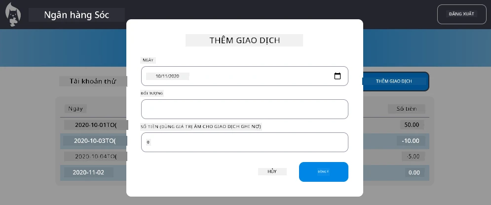

# Triển khai hộp thoại "Thêm giao dịch"

## Tổng quan

Ứng dụng ngân hàng của bạn hiện đã có hệ thống quản lý trạng thái và lưu trữ dữ liệu ổn định, nhưng vẫn thiếu một tính năng quan trọng mà các ứng dụng ngân hàng thực sự cần: khả năng cho phép người dùng thêm giao dịch của riêng họ. Trong bài tập này, bạn sẽ triển khai một hộp thoại "Thêm giao dịch" hoàn chỉnh, tích hợp liền mạch với hệ thống quản lý trạng thái hiện có của bạn.

Bài tập này kết hợp tất cả những gì bạn đã học trong bốn bài học về ngân hàng: tạo mẫu HTML, xử lý biểu mẫu, tích hợp API và quản lý trạng thái.

## Mục tiêu học tập

Khi hoàn thành bài tập này, bạn sẽ:
- **Tạo** giao diện hộp thoại thân thiện với người dùng để nhập dữ liệu
- **Triển khai** thiết kế biểu mẫu dễ tiếp cận với hỗ trợ bàn phím và trình đọc màn hình
- **Tích hợp** các tính năng mới với hệ thống quản lý trạng thái hiện có
- **Thực hành** giao tiếp API và xử lý lỗi
- **Áp dụng** các mẫu phát triển web hiện đại vào một tính năng thực tế

## Hướng dẫn

### Bước 1: Nút Thêm giao dịch

**Tạo** một nút "Thêm giao dịch" trên trang bảng điều khiển mà người dùng có thể dễ dàng tìm thấy và truy cập.

**Yêu cầu:**
- **Đặt** nút ở vị trí hợp lý trên bảng điều khiển
- **Sử dụng** văn bản nút rõ ràng, mang tính hành động
- **Thiết kế** nút phù hợp với giao diện người dùng hiện có của bạn
- **Đảm bảo** nút có thể truy cập bằng bàn phím

### Bước 2: Triển khai hộp thoại

Chọn một trong hai cách tiếp cận sau để triển khai hộp thoại của bạn:

**Lựa chọn A: Trang riêng biệt**
- **Tạo** một mẫu HTML mới cho biểu mẫu giao dịch
- **Thêm** một tuyến mới vào hệ thống định tuyến của bạn
- **Triển khai** điều hướng đến và từ trang biểu mẫu

**Lựa chọn B: Hộp thoại dạng Modal (Khuyến nghị)**
- **Sử dụng** JavaScript để hiển thị/ẩn hộp thoại mà không rời khỏi bảng điều khiển
- **Triển khai** bằng cách sử dụng thuộc tính [`hidden`](https://developer.mozilla.org/docs/Web/HTML/Global_attributes/hidden) hoặc các lớp CSS
- **Tạo** trải nghiệm người dùng mượt mà với quản lý tiêu điểm hợp lý

### Bước 3: Triển khai khả năng tiếp cận

**Đảm bảo** hộp thoại của bạn đáp ứng [tiêu chuẩn khả năng tiếp cận cho hộp thoại dạng modal](https://developer.paciellogroup.com/blog/2018/06/the-current-state-of-modal-dialog-accessibility/):

**Điều hướng bằng bàn phím:**
- **Hỗ trợ** phím Escape để đóng hộp thoại
- **Giữ** tiêu điểm trong hộp thoại khi mở
- **Trả lại** tiêu điểm cho nút kích hoạt khi đóng

**Hỗ trợ trình đọc màn hình:**
- **Thêm** nhãn ARIA và vai trò phù hợp
- **Thông báo** việc mở/đóng hộp thoại cho trình đọc màn hình
- **Cung cấp** nhãn trường biểu mẫu rõ ràng và thông báo lỗi

### Bước 4: Tạo biểu mẫu

**Thiết kế** một biểu mẫu HTML thu thập dữ liệu giao dịch:

**Trường bắt buộc:**
- **Ngày**: Thời điểm giao dịch diễn ra
- **Mô tả**: Nội dung giao dịch
- **Số tiền**: Giá trị giao dịch (dương cho thu nhập, âm cho chi tiêu)

**Tính năng biểu mẫu:**
- **Xác thực** đầu vào của người dùng trước khi gửi
- **Cung cấp** thông báo lỗi rõ ràng cho dữ liệu không hợp lệ
- **Bao gồm** văn bản gợi ý và nhãn hữu ích
- **Thiết kế** nhất quán với giao diện hiện có của bạn

### Bước 5: Tích hợp API

**Kết nối** biểu mẫu của bạn với API backend:

**Các bước triển khai:**
- **Xem lại** [đặc tả API máy chủ](../api/README.md) để biết endpoint và định dạng dữ liệu chính xác
- **Tạo** dữ liệu JSON từ đầu vào biểu mẫu của bạn
- **Gửi** dữ liệu đến API với xử lý lỗi phù hợp
- **Hiển thị** thông báo thành công/thất bại cho người dùng
- **Xử lý** lỗi mạng một cách hợp lý

### Bước 6: Tích hợp quản lý trạng thái

**Cập nhật** bảng điều khiển của bạn với giao dịch mới:

**Yêu cầu tích hợp:**
- **Làm mới** dữ liệu tài khoản sau khi thêm giao dịch thành công
- **Cập nhật** hiển thị bảng điều khiển mà không cần tải lại trang
- **Đảm bảo** giao dịch mới xuất hiện ngay lập tức
- **Duy trì** tính nhất quán trạng thái trong toàn bộ quá trình

## Thông số kỹ thuật

**Chi tiết endpoint API:**
Tham khảo [tài liệu API máy chủ](../api/README.md) để biết:
- Định dạng JSON yêu cầu cho dữ liệu giao dịch
- Phương thức HTTP và URL endpoint
- Định dạng phản hồi mong đợi
- Xử lý phản hồi lỗi

**Kết quả mong đợi:**
Sau khi hoàn thành bài tập này, ứng dụng ngân hàng của bạn sẽ có tính năng "Thêm giao dịch" hoạt động đầy đủ, trông chuyên nghiệp và hoạt động mượt mà:

## Kiểm tra triển khai của bạn

**Kiểm tra chức năng:**
1. **Xác minh** nút "Thêm giao dịch" hiển thị rõ ràng và dễ truy cập
2. **Kiểm tra** rằng hộp thoại mở và đóng đúng cách
3. **Xác nhận** việc xác thực biểu mẫu hoạt động cho tất cả các trường bắt buộc
4. **Kiểm tra** rằng các giao dịch thành công xuất hiện ngay lập tức trên bảng điều khiển
5. **Đảm bảo** xử lý lỗi hoạt động cho dữ liệu không hợp lệ và sự cố mạng

**Kiểm tra khả năng tiếp cận:**
1. **Điều hướng** qua toàn bộ quy trình chỉ bằng bàn phím
2. **Kiểm tra** với trình đọc màn hình để đảm bảo thông báo phù hợp
3. **Xác minh** quản lý tiêu điểm hoạt động chính xác
4. **Kiểm tra** rằng tất cả các phần tử biểu mẫu có nhãn phù hợp

## Tiêu chí đánh giá

| Tiêu chí | Xuất sắc | Đạt yêu cầu | Cần cải thiện |
| -------- | --------- | ----------- | ------------- |
| **Chức năng** | Tính năng thêm giao dịch hoạt động hoàn hảo với trải nghiệm người dùng tuyệt vời và tuân theo tất cả các thực tiễn tốt nhất từ các bài học | Tính năng thêm giao dịch hoạt động đúng nhưng có thể không tuân theo một số thực tiễn tốt nhất hoặc có vấn đề nhỏ về khả năng sử dụng | Tính năng thêm giao dịch hoạt động một phần hoặc có vấn đề lớn về khả năng sử dụng |
| **Chất lượng mã** | Mã được tổ chức tốt, tuân theo các mẫu đã thiết lập, bao gồm xử lý lỗi đúng cách và tích hợp liền mạch với quản lý trạng thái hiện có | Mã hoạt động nhưng có thể có một số vấn đề về tổ chức hoặc không nhất quán với mã hiện có | Mã có vấn đề cấu trúc lớn hoặc không tích hợp tốt với các mẫu hiện có |
| **Khả năng tiếp cận** | Hỗ trợ điều hướng bàn phím đầy đủ, tương thích với trình đọc màn hình và tuân theo hướng dẫn WCAG với quản lý tiêu điểm xuất sắc | Các tính năng khả năng tiếp cận cơ bản được triển khai nhưng có thể thiếu một số hỗ trợ điều hướng bàn phím hoặc trình đọc màn hình | Ít hoặc không có các cân nhắc về khả năng tiếp cận được triển khai |
| **Trải nghiệm người dùng** | Giao diện trực quan, được trau chuốt với phản hồi rõ ràng, tương tác mượt mà và ngoại hình chuyên nghiệp | Trải nghiệm người dùng tốt với một số khu vực cần cải thiện về phản hồi hoặc thiết kế trực quan | Trải nghiệm người dùng kém với giao diện khó hiểu hoặc thiếu phản hồi cho người dùng |

## Thử thách bổ sung (Tùy chọn)

Sau khi hoàn thành các yêu cầu cơ bản, hãy xem xét các cải tiến sau:

**Tính năng nâng cao:**
- **Thêm** danh mục giao dịch (thực phẩm, giao thông, giải trí, v.v.)
- **Triển khai** xác thực đầu vào với phản hồi theo thời gian thực
- **Tạo** phím tắt cho người dùng chuyên nghiệp
- **Thêm** khả năng chỉnh sửa và xóa giao dịch

**Tích hợp nâng cao:**
- **Triển khai** chức năng hoàn tác cho các giao dịch vừa thêm
- **Thêm** nhập giao dịch hàng loạt từ tệp CSV
- **Tạo** khả năng tìm kiếm và lọc giao dịch
- **Triển khai** chức năng xuất dữ liệu

Những tính năng tùy chọn này sẽ giúp bạn thực hành các khái niệm phát triển web nâng cao hơn và tạo ra một ứng dụng ngân hàng hoàn thiện hơn!

---

**Tuyên bố miễn trừ trách nhiệm**:  
Tài liệu này đã được dịch bằng dịch vụ dịch thuật AI [Co-op Translator](https://github.com/Azure/co-op-translator). Mặc dù chúng tôi cố gắng đảm bảo độ chính xác, xin lưu ý rằng các bản dịch tự động có thể chứa lỗi hoặc không chính xác. Tài liệu gốc bằng ngôn ngữ bản địa nên được coi là nguồn thông tin chính thức. Đối với thông tin quan trọng, chúng tôi khuyến nghị sử dụng dịch vụ dịch thuật chuyên nghiệp từ con người. Chúng tôi không chịu trách nhiệm về bất kỳ sự hiểu lầm hoặc diễn giải sai nào phát sinh từ việc sử dụng bản dịch này.