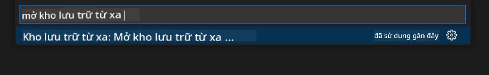
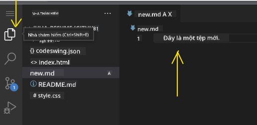
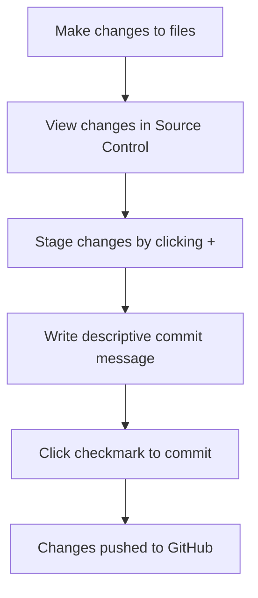

<!--
CO_OP_TRANSLATOR_METADATA:
{
  "original_hash": "cfd4a15974168ca426d50c67682ab9d4",
  "translation_date": "2025-10-24T13:29:18+00:00",
  "source_file": "8-code-editor/1-using-a-code-editor/README.md",
  "language_code": "vi"
}
-->
# Sử dụng Trình Soạn Thảo Mã: Làm Chủ VSCode.dev

Bạn còn nhớ trong *The Matrix* khi Neo phải kết nối vào một máy tính khổng lồ để truy cập thế giới số không? Các công cụ phát triển web ngày nay lại hoàn toàn ngược lại – khả năng mạnh mẽ có thể truy cập từ bất cứ đâu. VSCode.dev là một trình soạn thảo mã trên trình duyệt, mang đến các công cụ phát triển chuyên nghiệp cho bất kỳ thiết bị nào có kết nối internet.

Giống như cách máy in làm cho sách trở nên phổ biến với mọi người, không chỉ dành cho các tu sĩ trong tu viện, VSCode.dev dân chủ hóa việc lập trình. Bạn có thể làm việc trên các dự án từ máy tính thư viện, phòng thí nghiệm trường học, hoặc bất cứ nơi nào bạn có thể truy cập trình duyệt. Không cần cài đặt, không có giới hạn "Tôi cần thiết lập cụ thể của mình".

Kết thúc bài học này, bạn sẽ hiểu cách điều hướng VSCode.dev, mở các kho GitHub trực tiếp trên trình duyệt, và sử dụng Git để kiểm soát phiên bản – tất cả đều là những kỹ năng mà các nhà phát triển chuyên nghiệp sử dụng hàng ngày.

## Những Gì Bạn Sẽ Học

Sau khi chúng ta cùng nhau đi qua bài học này, bạn sẽ có thể:

- Điều hướng VSCode.dev như ngôi nhà thứ hai của mình – tìm mọi thứ bạn cần mà không bị lạc
- Mở bất kỳ kho GitHub nào trên trình duyệt và bắt đầu chỉnh sửa ngay lập tức (điều này thực sự kỳ diệu!)
- Sử dụng Git để theo dõi các thay đổi và lưu tiến trình của bạn như một chuyên gia
- Tăng tốc trình soạn thảo của bạn với các tiện ích mở rộng giúp việc lập trình nhanh hơn và thú vị hơn
- Tạo và tổ chức các tệp dự án một cách tự tin

## Những Gì Bạn Cần

Yêu cầu rất đơn giản:

- Một tài khoản [GitHub miễn phí](https://github.com) (chúng tôi sẽ hướng dẫn bạn tạo nếu cần)
- Hiểu biết cơ bản về trình duyệt web
- Bài học GitHub Basics cung cấp nền tảng hữu ích, mặc dù không bắt buộc

> 💡 **Mới sử dụng GitHub?** Tạo tài khoản miễn phí và chỉ mất vài phút. Giống như cách thẻ thư viện cho phép bạn truy cập sách trên toàn thế giới, tài khoản GitHub mở ra cánh cửa đến các kho mã trên internet.

## Tại Sao Trình Soạn Thảo Mã Dựa Trên Web Quan Trọng

Trước khi có internet, các nhà khoa học tại các trường đại học khác nhau không thể dễ dàng chia sẻ nghiên cứu. Sau đó, ARPANET ra đời vào những năm 1960, kết nối các máy tính qua khoảng cách. Trình soạn thảo mã dựa trên web tuân theo nguyên tắc tương tự – làm cho các công cụ mạnh mẽ có thể truy cập bất kể vị trí vật lý hay thiết bị của bạn.

Trình soạn thảo mã là không gian làm việc phát triển của bạn, nơi bạn viết, chỉnh sửa và tổ chức các tệp mã. Không giống như các trình soạn thảo văn bản đơn giản, các trình soạn thảo mã chuyên nghiệp cung cấp tô sáng cú pháp, phát hiện lỗi, và các tính năng quản lý dự án.

VSCode.dev mang những khả năng này đến trình duyệt của bạn:

**Ưu điểm của chỉnh sửa dựa trên web:**

| Tính năng | Mô tả | Lợi ích thực tế |
|---------|-------------|----------|
| **Độc lập nền tảng** | Chạy trên bất kỳ thiết bị nào có trình duyệt | Làm việc từ các máy tính khác nhau một cách liền mạch |
| **Không cần cài đặt** | Truy cập qua URL web | Bỏ qua các hạn chế cài đặt phần mềm |
| **Cập nhật tự động** | Luôn chạy phiên bản mới nhất | Truy cập các tính năng mới mà không cần cập nhật thủ công |
| **Tích hợp kho lưu trữ** | Kết nối trực tiếp với GitHub | Chỉnh sửa mã mà không cần quản lý tệp cục bộ |

**Ý nghĩa thực tế:**
- Liên tục làm việc qua các môi trường khác nhau
- Giao diện nhất quán bất kể hệ điều hành
- Khả năng cộng tác ngay lập tức
- Giảm yêu cầu lưu trữ cục bộ

## Khám Phá VSCode.dev

Giống như phòng thí nghiệm của Marie Curie chứa các thiết bị tinh vi trong một không gian tương đối đơn giản, VSCode.dev tích hợp các công cụ phát triển chuyên nghiệp vào giao diện trình duyệt. Ứng dụng web này cung cấp cùng chức năng cốt lõi như các trình soạn thảo mã trên máy tính.

Bắt đầu bằng cách truy cập [vscode.dev](https://vscode.dev) trên trình duyệt của bạn. Giao diện tải mà không cần tải xuống hay cài đặt hệ thống – một ứng dụng trực tiếp của nguyên tắc điện toán đám mây.

### Kết Nối Tài Khoản GitHub Của Bạn

Giống như cách điện thoại của Alexander Graham Bell kết nối các địa điểm xa xôi, việc liên kết tài khoản GitHub của bạn kết nối VSCode.dev với các kho mã của bạn. Khi được nhắc đăng nhập bằng GitHub, việc chấp nhận kết nối này được khuyến nghị.

**Tích hợp GitHub cung cấp:**
- Truy cập trực tiếp vào các kho lưu trữ của bạn trong trình soạn thảo
- Cài đặt và tiện ích mở rộng được đồng bộ hóa trên các thiết bị
- Quy trình lưu trữ hợp lý đến GitHub
- Môi trường phát triển cá nhân hóa

### Làm Quen Với Không Gian Làm Việc Mới Của Bạn

Khi mọi thứ đã tải lên, bạn sẽ thấy một không gian làm việc sạch sẽ được thiết kế để giữ bạn tập trung vào điều quan trọng – mã của bạn!

**Đây là chuyến tham quan khu vực của bạn:**
- **Thanh Hoạt Động** (dải bên trái): Điều hướng chính của bạn với Explorer 📁, Search 🔍, Source Control 🌿, Extensions 🧩, và Settings ⚙️
- **Thanh Bên** (bảng bên cạnh): Thay đổi để hiển thị thông tin liên quan dựa trên những gì bạn đã chọn
- **Khu Vực Soạn Thảo** (không gian lớn ở giữa): Đây là nơi phép thuật xảy ra – khu vực chính để bạn viết mã

**Hãy dành một chút thời gian để khám phá:**
- Nhấp vào các biểu tượng trên Thanh Hoạt Động và xem mỗi cái làm gì
- Chú ý cách thanh bên cập nhật để hiển thị thông tin khác nhau – khá thú vị, phải không?
- Chế độ xem Explorer (📁) có lẽ là nơi bạn sẽ dành phần lớn thời gian, vì vậy hãy làm quen với nó

## Mở Các Kho GitHub

Trước khi có internet, các nhà nghiên cứu phải đi đến thư viện để truy cập tài liệu. Các kho GitHub hoạt động tương tự – chúng là các bộ sưu tập mã được lưu trữ từ xa. VSCode.dev loại bỏ bước truyền thống là tải xuống các kho lưu trữ về máy cục bộ trước khi chỉnh sửa.

Khả năng này cho phép truy cập ngay lập tức vào bất kỳ kho lưu trữ công khai nào để xem, chỉnh sửa, hoặc đóng góp. Dưới đây là hai phương pháp để mở kho lưu trữ:

### Phương Pháp 1: Cách Nhấp Chuột

Cách này hoàn hảo khi bạn bắt đầu mới trong VSCode.dev và muốn mở một kho lưu trữ cụ thể. Nó đơn giản và thân thiện với người mới bắt đầu:

**Cách thực hiện:**

1. Truy cập [vscode.dev](https://vscode.dev) nếu bạn chưa ở đó
2. Tìm nút "Open Remote Repository" trên màn hình chào mừng và nhấp vào

   

3. Dán URL kho GitHub bất kỳ (thử cái này: `https://github.com/microsoft/Web-Dev-For-Beginners`)
4. Nhấn Enter và xem điều kỳ diệu xảy ra!

**Mẹo chuyên nghiệp - Phím tắt Command Palette:**

Muốn cảm thấy như một phù thủy lập trình? Thử phím tắt này: Ctrl+Shift+P (hoặc Cmd+Shift+P trên Mac) để mở Command Palette:

**Command Palette giống như có một công cụ tìm kiếm cho mọi thứ bạn có thể làm:**
- Gõ "open remote" và nó sẽ tìm trình mở kho lưu trữ cho bạn
- Nó nhớ các kho lưu trữ bạn đã mở gần đây (rất tiện lợi!)
- Khi bạn quen với nó, bạn sẽ cảm thấy như đang lập trình với tốc độ ánh sáng
- Nó cơ bản là phiên bản "Hey Siri, nhưng dành cho lập trình" của VSCode.dev

### Phương Pháp 2: Kỹ Thuật Sửa Đổi URL

Giống như cách HTTP và HTTPS sử dụng các giao thức khác nhau trong khi vẫn giữ cấu trúc tên miền giống nhau, VSCode.dev sử dụng một mẫu URL phản ánh hệ thống địa chỉ của GitHub. Bất kỳ URL kho GitHub nào cũng có thể được sửa đổi để mở trực tiếp trong VSCode.dev.

**Mẫu chuyển đổi URL:**

| Loại Kho Lưu Trữ | URL GitHub | URL VSCode.dev |
|----------------|---------------------|----------------|
| **Kho Lưu Trữ Công Khai** | `github.com/microsoft/Web-Dev-For-Beginners` | `vscode.dev/github/microsoft/Web-Dev-For-Beginners` |
| **Dự Án Cá Nhân** | `github.com/your-username/my-project` | `vscode.dev/github/your-username/my-project` |
| **Bất Kỳ Kho Nào Có Thể Truy Cập** | `github.com/their-username/awesome-repo` | `vscode.dev/github/their-username/awesome-repo` |

**Cách thực hiện:**
- Thay thế `github.com` bằng `vscode.dev/github`
- Giữ nguyên tất cả các thành phần URL khác
- Hoạt động với bất kỳ kho lưu trữ công khai nào
- Cung cấp quyền truy cập chỉnh sửa ngay lập tức

> 💡 **Mẹo thay đổi cuộc sống**: Đánh dấu các phiên bản VSCode.dev của các kho lưu trữ yêu thích của bạn. Tôi có các dấu trang như "Edit My Portfolio" và "Fix Documentation" đưa tôi trực tiếp đến chế độ chỉnh sửa!

**Bạn nên sử dụng phương pháp nào?**
- **Cách giao diện**: Tuyệt vời khi bạn đang khám phá hoặc không nhớ tên kho lưu trữ chính xác
- **Mẹo URL**: Hoàn hảo cho truy cập nhanh khi bạn biết chính xác nơi bạn muốn đến

## Làm Việc Với Tệp và Dự Án

Bây giờ bạn đã mở một kho lưu trữ, hãy bắt đầu xây dựng! VSCode.dev cung cấp cho bạn mọi thứ bạn cần để tạo, chỉnh sửa, và tổ chức các tệp mã của mình. Hãy nghĩ về nó như xưởng kỹ thuật số của bạn – mọi công cụ đều ở đúng nơi bạn cần.

Hãy cùng khám phá các nhiệm vụ hàng ngày sẽ chiếm phần lớn quy trình làm việc lập trình của bạn.

### Tạo Tệp Mới

Giống như việc tổ chức bản vẽ trong văn phòng kiến trúc sư, việc tạo tệp trong VSCode.dev tuân theo một cách tiếp cận có cấu trúc. Hệ thống hỗ trợ tất cả các loại tệp phát triển web tiêu chuẩn.

**Quy trình tạo tệp:**

1. Điều hướng đến thư mục mục tiêu trong thanh bên Explorer
2. Di chuột qua tên thư mục để hiển thị biểu tượng "New File" (📄+)
3. Nhập tên tệp bao gồm phần mở rộng phù hợp (`style.css`, `script.js`, `index.html`)
4. Nhấn Enter để tạo tệp

**Quy ước đặt tên:**
- Sử dụng tên mô tả chỉ ra mục đích của tệp
- Bao gồm phần mở rộng tệp để tô sáng cú pháp đúng
- Tuân theo các mẫu đặt tên nhất quán trong suốt các dự án
- Sử dụng chữ thường và dấu gạch ngang thay vì khoảng trắng

### Chỉnh Sửa và Lưu Tệp

Đây là nơi niềm vui thực sự bắt đầu! Trình soạn thảo của VSCode.dev được trang bị các tính năng hữu ích giúp việc lập trình trở nên mượt mà và trực quan. Nó giống như có một trợ lý viết thông minh, nhưng dành cho mã.

**Quy trình chỉnh sửa của bạn:**

1. Nhấp vào bất kỳ tệp nào trong Explorer để mở nó trong khu vực chính
2. Bắt đầu gõ và xem VSCode.dev hỗ trợ bạn với màu sắc, gợi ý, và phát hiện lỗi
3. Lưu công việc của bạn bằng Ctrl+S (Windows/Linux) hoặc Cmd+S (Mac) – mặc dù nó cũng tự động lưu!

**Những điều thú vị xảy ra khi bạn lập trình:**
- Mã của bạn được tô màu đẹp mắt để dễ đọc hơn
- VSCode.dev gợi ý hoàn thành khi bạn gõ (giống như tự động sửa lỗi, nhưng thông minh hơn nhiều)
- Nó phát hiện lỗi và sai sót trước khi bạn lưu
- Bạn có thể mở nhiều tệp trong các tab, giống như trong trình duyệt
- Mọi thứ tự động lưu trong nền

> ⚠️ **Mẹo nhanh**: Mặc dù tính năng tự động lưu đã hỗ trợ bạn, việc nhấn Ctrl+S hoặc Cmd+S vẫn là một thói quen tốt. Nó ngay lập tức lưu mọi thứ và kích hoạt một số tính năng hữu ích như kiểm tra lỗi.

### Kiểm Soát Phiên Bản Với Git

Giống như cách các nhà khảo cổ học tạo hồ sơ chi tiết về các lớp khai quật, Git theo dõi các thay đổi trong mã của bạn theo thời gian. Hệ thống này bảo tồn lịch sử dự án và cho phép bạn quay lại các phiên bản trước khi cần. VSCode.dev bao gồm chức năng Git tích hợp.

**Giao diện Source Control:**

1. Truy cập bảng Source Control qua biểu tượng 🌿 trên Thanh Hoạt Động
2. Các tệp đã sửa đổi xuất hiện trong phần "Changes"
3. Mã màu chỉ ra loại thay đổi: màu xanh lá cây cho các bổ sung, màu đỏ cho các xóa bỏ

**Lưu công việc của bạn (quy trình commit):**

**Quy trình từng bước của bạn:**
- Nhấp vào biểu tượng "+" bên cạnh các tệp bạn muốn lưu (điều này "stages" chúng)
- Kiểm tra kỹ rằng bạn hài lòng với tất cả các thay đổi đã staged
- Viết một ghi chú ngắn giải thích những gì bạn đã làm (đây là "commit message" của bạn)
- Nhấp vào nút dấu kiểm để lưu mọi thứ vào GitHub
- Nếu bạn đổi ý về điều gì đó, biểu tượng hoàn tác cho phép bạn loại bỏ các thay đổi

**Viết commit message tốt (dễ hơn bạn nghĩ!):**
- Chỉ cần mô tả những gì bạn đã làm, như "Thêm form liên hệ" hoặc "Sửa lỗi điều hướng"
- Giữ ngắn gọn và súc tích – nghĩ như viết tweet, không phải bài luận
- Bắt đầu với các từ hành động như "Thêm", "Sửa", "Cập nhật", hoặc "Xóa"
- **Ví dụ tốt**: "Thêm menu điều hướng đáp ứng", "Sửa lỗi bố cục di động", "Cập nhật màu sắc để cải thiện khả năng truy cập"

> 💡 **Mẹo điều hướng nhanh**: Sử dụng menu hamburger (☰) ở góc trên bên trái để quay lại kho GitHub của bạn và xem các thay đổi đã commit trực tuyến. Nó giống như một cổng giữa môi trường chỉnh sửa của bạn và ngôi nhà của dự án trên GitHub!

## Nâng Cao Chức Năng Với Các Tiện Ích Mở Rộng

Giống như xưởng của một nghệ nhân chứa các công cụ chuyên dụng cho các nhiệm vụ khác nhau, VSCode.dev có thể được tùy chỉnh với các tiện ích mở rộng bổ sung các khả năng cụ thể. Những plugin do cộng đồng phát triển này giải quyết các nhu cầu phát triển phổ biến như định dạng mã, xem trước trực tiếp, và tích hợp Git nâng cao.

Chợ tiện ích mở rộng lưu trữ hàng ngàn công cụ miễn phí được tạo bởi các nhà phát triển trên toàn thế giới. Mỗi tiện ích mở rộng giải quyết các thách thức quy trình làm việc cụ thể, cho phép bạn xây dựng một môi trường phát triển cá nhân hóa phù hợp với nhu cầu và sở thích của mình.

### Tìm Các Tiện Ích Mở Rộng Hoàn Hảo Của Bạn

Chợ tiện ích mở rộng được tổ chức rất tốt, vì vậy bạn sẽ không bị lạc khi tìm kiếm những gì bạn cần. Nó được thiết kế để giúp bạn khám phá cả các công cụ cụ thể và những thứ thú vị mà bạn thậm chí không biết là tồn tại!

**Truy cập chợ tiện ích mở rộng:**

1. Nhấp vào biểu tượng Extensions (🧩) trên Thanh Hoạt Động
2. Duyệt xung quanh hoặc tìm kiếm một thứ cụ thể
3. Nhấp vào bất cứ thứ gì trông thú vị để tìm hiểu thêm về nó

**Những gì bạn sẽ thấy trong đó:**

| Phần | Nội Dung Bên Trong | Tại Sao Nó Hữu Ích |
|----------|---------|----------|
| **Đã Cài Đặt** | Các tiện ích mở rộng bạn đã thêm | Bộ công cụ lập trình cá nhân của bạn |
| **Phổ Biến** | Những tiện ích được yêu thích | Những gì hầu hết các nhà phát triển tin dùng |
| **Được Đề Xuất** | Gợi ý thông minh cho dự án
- Mỗi tiện ích mở rộng hiển thị đánh giá, số lượt tải xuống và nhận xét từ người dùng thực
- Bạn sẽ thấy ảnh chụp màn hình và mô tả rõ ràng về chức năng của từng tiện ích
- Tất cả đều được đánh dấu rõ ràng với thông tin tương thích
- Các tiện ích mở rộng tương tự được gợi ý để bạn có thể so sánh các tùy chọn

### Cài đặt tiện ích mở rộng (Dễ vô cùng!)

Thêm sức mạnh mới vào trình chỉnh sửa của bạn chỉ đơn giản bằng cách nhấn một nút. Tiện ích mở rộng được cài đặt trong vài giây và hoạt động ngay lập tức – không cần khởi động lại, không phải chờ đợi.

**Đây là tất cả những gì bạn cần làm:**

1. Tìm kiếm những gì bạn muốn (thử tìm "live server" hoặc "prettier")
2. Nhấp vào tiện ích trông có vẻ tốt để xem thêm chi tiết
3. Đọc qua chức năng của nó và kiểm tra đánh giá
4. Nhấn nút "Install" màu xanh và xong!

**Điều gì diễn ra phía sau:**
- Tiện ích mở rộng tự động tải xuống và thiết lập
- Các tính năng mới xuất hiện ngay trong giao diện của bạn
- Mọi thứ bắt đầu hoạt động ngay lập tức (thật sự nhanh chóng!)
- Nếu bạn đã đăng nhập, tiện ích sẽ được đồng bộ hóa trên tất cả các thiết bị của bạn

**Một số tiện ích mở rộng tôi khuyên bạn nên bắt đầu:**
- **Live Server**: Xem trang web của bạn cập nhật theo thời gian thực khi bạn viết mã (thật kỳ diệu!)
- **Prettier**: Tự động làm cho mã của bạn trông sạch sẽ và chuyên nghiệp
- **Auto Rename Tag**: Thay đổi một thẻ HTML và thẻ đối tác của nó cũng được cập nhật
- **Bracket Pair Colorizer**: Mã hóa màu cho các dấu ngoặc để bạn không bị lạc
- **GitLens**: Tăng cường các tính năng Git của bạn với rất nhiều thông tin hữu ích

### Tùy chỉnh tiện ích mở rộng của bạn

Hầu hết các tiện ích mở rộng đều đi kèm với các cài đặt mà bạn có thể điều chỉnh để làm cho chúng hoạt động đúng như ý bạn. Hãy nghĩ về nó như việc điều chỉnh ghế và gương trong xe – mỗi người đều có sở thích riêng!

**Điều chỉnh cài đặt tiện ích mở rộng:**

1. Tìm tiện ích mở rộng đã cài đặt của bạn trong bảng Extensions
2. Tìm biểu tượng bánh răng nhỏ (⚙️) bên cạnh tên của nó và nhấp vào
3. Chọn "Extension Settings" từ menu thả xuống
4. Điều chỉnh mọi thứ cho phù hợp với quy trình làm việc của bạn

**Những điều thường được điều chỉnh:**
- Cách mã của bạn được định dạng (tab hay khoảng trắng, độ dài dòng, v.v.)
- Các phím tắt nào kích hoạt các hành động khác nhau
- Loại tệp nào tiện ích mở rộng nên hoạt động
- Bật hoặc tắt các tính năng cụ thể để giữ mọi thứ gọn gàng

### Giữ tiện ích mở rộng của bạn được tổ chức

Khi bạn khám phá thêm nhiều tiện ích mở rộng thú vị, bạn sẽ muốn giữ bộ sưu tập của mình gọn gàng và hoạt động trơn tru. VSCode.dev làm cho việc quản lý này trở nên rất dễ dàng.

**Các tùy chọn quản lý tiện ích mở rộng của bạn:**

| Những gì bạn có thể làm | Khi nào hữu ích | Mẹo hay |
|--------|---------|----------|
| **Disable** | Kiểm tra xem tiện ích mở rộng có gây ra vấn đề không | Tốt hơn là gỡ cài đặt nếu bạn có thể muốn sử dụng lại |
| **Uninstall** | Hoàn toàn loại bỏ các tiện ích mở rộng không cần thiết | Giữ môi trường của bạn sạch sẽ và nhanh chóng |
| **Update** | Nhận các tính năng mới nhất và sửa lỗi | Thường tự động, nhưng đáng để kiểm tra |

**Cách tôi thích quản lý tiện ích mở rộng:**
- Cứ vài tháng, tôi xem lại những gì đã cài đặt và gỡ bỏ bất cứ thứ gì không sử dụng
- Tôi giữ các tiện ích mở rộng được cập nhật để nhận các cải tiến và sửa lỗi bảo mật mới nhất
- Nếu có gì đó chậm, tôi tạm thời vô hiệu hóa các tiện ích mở rộng để xem có phải một trong số chúng là nguyên nhân
- Tôi đọc ghi chú cập nhật khi các tiện ích mở rộng có bản cập nhật lớn – đôi khi có những tính năng mới thú vị!

> ⚠️ **Mẹo hiệu suất**: Tiện ích mở rộng rất tuyệt, nhưng có quá nhiều có thể làm chậm hệ thống. Tập trung vào những tiện ích thực sự làm cuộc sống của bạn dễ dàng hơn và đừng ngại gỡ bỏ những tiện ích bạn không bao giờ sử dụng.

## Thử thách GitHub Copilot Agent 🚀

Giống như cách tiếp cận có cấu trúc NASA sử dụng cho các nhiệm vụ không gian, thử thách này liên quan đến việc áp dụng có hệ thống các kỹ năng VSCode.dev trong một kịch bản quy trình làm việc hoàn chỉnh.

**Mục tiêu:** Thể hiện sự thành thạo với VSCode.dev bằng cách thiết lập một quy trình làm việc phát triển web toàn diện.

**Yêu cầu dự án:** Sử dụng chế độ Agent để hoàn thành các nhiệm vụ sau:
1. Fork một kho lưu trữ hiện có hoặc tạo một kho mới
2. Thiết lập cấu trúc dự án chức năng với các tệp HTML, CSS và JavaScript
3. Cài đặt và cấu hình ba tiện ích mở rộng tăng cường phát triển
4. Thực hành kiểm soát phiên bản với các thông điệp commit mô tả
5. Thử nghiệm tạo và chỉnh sửa nhánh tính năng
6. Ghi lại quy trình và những gì đã học được trong tệp README.md

Bài tập này tổng hợp tất cả các khái niệm VSCode.dev vào một quy trình làm việc thực tế có thể áp dụng cho các dự án phát triển trong tương lai.

Tìm hiểu thêm về [chế độ agent](https://code.visualstudio.com/blogs/2025/02/24/introducing-copilot-agent-mode) tại đây.

## Bài tập

Đã đến lúc thử nghiệm thực tế các kỹ năng này! Tôi có một dự án thực hành sẽ cho phép bạn áp dụng mọi thứ chúng ta đã học: [Tạo một trang web hồ sơ cá nhân bằng VSCode.dev](./assignment.md)

Bài tập này hướng dẫn bạn xây dựng một trang web hồ sơ cá nhân chuyên nghiệp hoàn toàn trên trình duyệt của bạn. Bạn sẽ sử dụng tất cả các tính năng VSCode.dev mà chúng ta đã khám phá, và cuối cùng, bạn sẽ có một trang web đẹp mắt cùng sự tự tin vững chắc trong quy trình làm việc mới của mình.

## Tiếp tục khám phá và nâng cao kỹ năng của bạn

Bạn đã có một nền tảng vững chắc, nhưng vẫn còn rất nhiều điều thú vị để khám phá! Dưới đây là một số tài nguyên và ý tưởng để đưa kỹ năng VSCode.dev của bạn lên một tầm cao mới:

**Tài liệu chính thức đáng để lưu lại:**
- [Tài liệu về VSCode Web](https://code.visualstudio.com/docs/editor/vscode-web?WT.mc_id=academic-0000-alfredodeza) – Hướng dẫn đầy đủ về chỉnh sửa trên trình duyệt
- [GitHub Codespaces](https://docs.github.com/en/codespaces) – Khi bạn muốn có thêm sức mạnh trên đám mây

**Các tính năng thú vị để thử nghiệm tiếp theo:**
- **Phím tắt**: Học các tổ hợp phím sẽ khiến bạn cảm thấy như một ninja lập trình
- **Cài đặt Workspace**: Thiết lập các môi trường khác nhau cho các loại dự án khác nhau
- **Multi-root Workspaces**: Làm việc trên nhiều kho lưu trữ cùng một lúc (rất tiện lợi!)
- **Tích hợp Terminal**: Truy cập các công cụ dòng lệnh ngay trong trình duyệt của bạn

**Ý tưởng để thực hành:**
- Tham gia một số dự án mã nguồn mở và đóng góp bằng VSCode.dev – đây là cách tuyệt vời để đóng góp!
- Thử nghiệm các tiện ích mở rộng khác nhau để tìm thiết lập hoàn hảo của bạn
- Tạo các mẫu dự án cho các loại trang web bạn thường xây dựng
- Thực hành các quy trình Git như tạo nhánh và hợp nhất – những kỹ năng này rất quý giá trong các dự án nhóm

---

**Bạn đã làm chủ phát triển trên trình duyệt!** 🎉 Giống như việc phát minh ra các dụng cụ di động cho phép các nhà khoa học nghiên cứu ở những địa điểm xa xôi, VSCode.dev cho phép lập trình chuyên nghiệp từ bất kỳ thiết bị nào có kết nối internet.

Những kỹ năng này phản ánh các thực tiễn hiện tại trong ngành – nhiều nhà phát triển chuyên nghiệp sử dụng môi trường phát triển dựa trên đám mây vì tính linh hoạt và khả năng truy cập của chúng. Bạn đã học được một quy trình làm việc có thể mở rộng từ các dự án cá nhân đến các cộng tác nhóm lớn.

Áp dụng những kỹ thuật này vào dự án phát triển tiếp theo của bạn! 🚀

---

**Tuyên bố miễn trừ trách nhiệm**:  
Tài liệu này đã được dịch bằng dịch vụ dịch thuật AI [Co-op Translator](https://github.com/Azure/co-op-translator). Mặc dù chúng tôi cố gắng đảm bảo độ chính xác, xin lưu ý rằng các bản dịch tự động có thể chứa lỗi hoặc không chính xác. Tài liệu gốc bằng ngôn ngữ bản địa nên được coi là nguồn thông tin chính thức. Đối với thông tin quan trọng, nên sử dụng dịch vụ dịch thuật chuyên nghiệp bởi con người. Chúng tôi không chịu trách nhiệm cho bất kỳ sự hiểu lầm hoặc diễn giải sai nào phát sinh từ việc sử dụng bản dịch này.