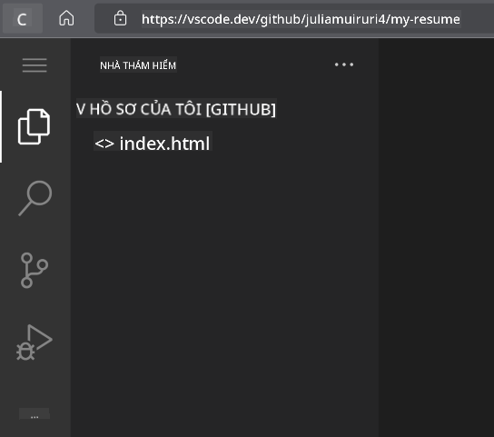
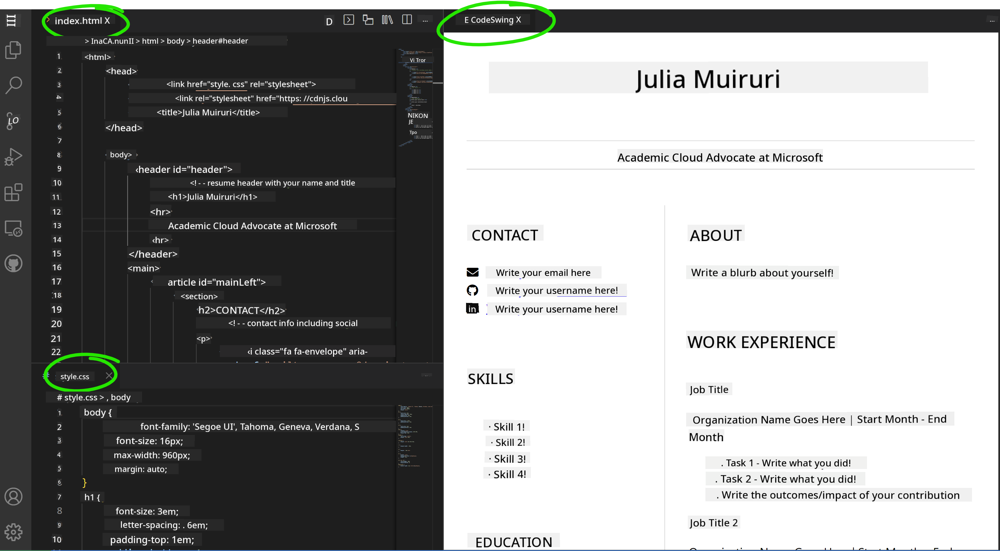

<!--
CO_OP_TRANSLATOR_METADATA:
{
  "original_hash": "2fcb983b8dbadadb1bc2e97f8c12dac5",
  "translation_date": "2025-08-27T23:06:28+00:00",
  "source_file": "8-code-editor/1-using-a-code-editor/assignment.md",
  "language_code": "vi"
}
-->
# Tạo một trang web sơ yếu lý lịch bằng vscode.dev

_Làm thế nào để gây ấn tượng khi nhà tuyển dụng yêu cầu sơ yếu lý lịch của bạn và bạn gửi cho họ một đường dẫn?_ 😎

## Mục tiêu

Sau bài tập này, bạn sẽ học cách:

- Tạo một trang web để giới thiệu sơ yếu lý lịch của bạn

### Điều kiện tiên quyết

1. Một tài khoản GitHub. Truy cập [GitHub](https://github.com/) và tạo tài khoản nếu bạn chưa có.

## Các bước thực hiện

**Bước 1:** Tạo một kho lưu trữ GitHub mới và đặt tên là `my-resume`

**Bước 2:** Tạo một tệp `index.html` trong kho lưu trữ của bạn. Chúng ta sẽ thêm ít nhất một tệp trong khi vẫn ở trên github.com vì bạn không thể mở một kho lưu trữ trống trên vscode.dev.

Nhấp vào liên kết `creating a new file`, nhập tên `index.html` và chọn nút `Commit new file`.


**Bước 3:** Mở [VSCode.dev](https://vscode.dev) và chọn nút `Open Remote Repository`.

Sao chép đường dẫn đến kho lưu trữ bạn vừa tạo cho trang sơ yếu lý lịch của mình và dán vào ô nhập liệu:

_Thay thế `your-username` bằng tên người dùng GitHub của bạn_

```
https://github.com/your-username/my-resume
```

✅ Nếu thành công, bạn sẽ thấy dự án của mình và tệp index.html được mở trong trình soạn thảo văn bản trên trình duyệt.



**Bước 4:** Mở tệp `index.html`, dán đoạn mã dưới đây vào khu vực mã của bạn và lưu lại.

<details>
    <summary><b>Mã HTML chịu trách nhiệm cho nội dung trên trang web sơ yếu lý lịch của bạn.</b></summary>
    
        <html>

            <head>
                <link href="style.css" rel="stylesheet">
                <link rel="stylesheet" href="https://cdnjs.cloudflare.com/ajax/libs/font-awesome/5.15.4/css/all.min.css">
                <title>Your Name Goes Here!</title>
            </head>
            <body>
                <header id="header">
                    <!-- tiêu đề sơ yếu lý lịch với tên và chức danh của bạn -->
                    <h1>Your Name Goes Here!</h1>
                    <hr>
                    Your Role!
                    <hr>
                </header>
                <main>
                    <article id="mainLeft">
                        <section>
                            <h2>LIÊN HỆ</h2>
                            <!-- thông tin liên hệ bao gồm mạng xã hội -->
                            <p>
                                <i class="fa fa-envelope" aria-hidden="true"></i>
                                <a href="mailto:username@domain.top-level domain">Viết email của bạn ở đây</a>
                            </p>
                            <p>
                                <i class="fab fa-github" aria-hidden="true"></i>
                                <a href="github.com/yourGitHubUsername">Viết tên người dùng của bạn ở đây!</a>
                            </p>
                            <p>
                                <i class="fab fa-linkedin" aria-hidden="true"></i>
                                <a href="linkedin.com/yourLinkedInUsername">Viết tên người dùng của bạn ở đây!</a>
                            </p>
                        </section>
                        <section>
                            <h2>KỸ NĂNG</h2>
                            <!-- kỹ năng của bạn -->
                            <ul>
                                <li>Kỹ năng 1!</li>
                                <li>Kỹ năng 2!</li>
                                <li>Kỹ năng 3!</li>
                                <li>Kỹ năng 4!</li>
                            </ul>
                        </section>
                        <section>
                            <h2>HỌC VẤN</h2>
                            <!-- học vấn của bạn -->
                            <h3>Viết khóa học của bạn ở đây!</h3>
                            <p>
                                Viết tên trường của bạn ở đây!
                            </p>
                            <p>
                                Ngày bắt đầu - Ngày kết thúc
                            </p>
                        </section>            
                    </article>
                    <article id="mainRight">
                        <section>
                            <h2>GIỚI THIỆU</h2>
                            <!-- giới thiệu về bạn -->
                            <p>Viết một đoạn giới thiệu về bản thân!</p>
                        </section>
                        <section>
                            <h2>KINH NGHIỆM LÀM VIỆC</h2>
                            <!-- kinh nghiệm làm việc của bạn -->
                            <h3>Chức danh công việc</h3>
                            <p>
                                Tên tổ chức ở đây | Tháng bắt đầu – Tháng kết thúc
                            </p>
                            <ul>
                                    <li>Nhiệm vụ 1 - Viết những gì bạn đã làm!</li>
                                    <li>Nhiệm vụ 2 - Viết những gì bạn đã làm!</li>
                                    <li>Viết kết quả/ảnh hưởng từ đóng góp của bạn</li>
                                    
                            </ul>
                            <h3>Chức danh công việc 2</h3>
                            <p>
                                Tên tổ chức ở đây | Tháng bắt đầu – Tháng kết thúc
                            </p>
                            <ul>
                                    <li>Nhiệm vụ 1 - Viết những gì bạn đã làm!</li>
                                    <li>Nhiệm vụ 2 - Viết những gì bạn đã làm!</li>
                                    <li>Viết kết quả/ảnh hưởng từ đóng góp của bạn</li>
                                    
                            </ul>
                        </section>
                    </article>
                </main>
            </body>
        </html>
</details>

Thêm chi tiết sơ yếu lý lịch của bạn để thay thế _văn bản giữ chỗ_ trong mã HTML.

**Bước 5:** Di chuột qua thư mục My-Resume, nhấp vào biểu tượng `New File ...` và tạo 2 tệp mới trong dự án của bạn: `style.css` và `codeswing.json`.

**Bước 6:** Mở tệp `style.css`, dán đoạn mã dưới đây và lưu lại.

<details>
        <summary><b>Mã CSS để định dạng bố cục của trang web.</b></summary>
            
            body {
                font-family: 'Segoe UI', Tahoma, Geneva, Verdana, sans-serif;
                font-size: 16px;
                max-width: 960px;
                margin: auto;
            }
            h1 {
                font-size: 3em;
                letter-spacing: .6em;
                padding-top: 1em;
                padding-bottom: 1em;
            }

            h2 {
                font-size: 1.5em;
                padding-bottom: 1em;
            }

            h3 {
                font-size: 1em;
                padding-bottom: 1em;
            }
            main { 
                display: grid;
                grid-template-columns: 40% 60%;
                margin-top: 3em;
            }
            header {
                text-align: center;
                margin: auto 2em;
            }

            section {
                margin: auto 1em 4em 2em;
            }

            i {
                margin-right: .5em;
            }

            p {
                margin: .2em auto
            }

            hr {
                border: none;
                background-color: lightgray;
                height: 1px;
            }

            h1, h2, h3 {
                font-weight: 100;
                margin-bottom: 0;
            }
            #mainLeft {
                border-right: 1px solid lightgray;
            }
            
</details>

**Bước 6:** Mở tệp `codeswing.json`, dán đoạn mã dưới đây và lưu lại.

    {
    "scripts": [],
    "styles": []
    }

**Bước 7:** Cài đặt `Codeswing extension` để xem trước trang web sơ yếu lý lịch trên khu vực mã.

Nhấp vào biểu tượng _`Extensions`_ trên thanh hoạt động và nhập Codeswing. Nhấp vào nút _màu xanh cài đặt_ trên thanh hoạt động mở rộng để cài đặt hoặc sử dụng nút cài đặt xuất hiện trên khu vực mã khi bạn chọn tiện ích mở rộng để tải thêm thông tin. Ngay sau khi cài đặt tiện ích mở rộng, quan sát khu vực mã của bạn để xem các thay đổi trong dự án 😃.


Đây là những gì bạn sẽ thấy trên màn hình sau khi cài đặt tiện ích mở rộng.



Nếu bạn hài lòng với các thay đổi đã thực hiện, di chuột qua thư mục `Changes` và nhấp vào nút `+` để đưa các thay đổi vào giai đoạn.

Nhập một thông điệp commit _(Mô tả thay đổi bạn đã thực hiện đối với dự án)_ và commit các thay đổi của bạn bằng cách nhấp vào `check`. Sau khi hoàn thành công việc trên dự án, chọn biểu tượng menu hamburger ở góc trên bên trái để quay lại kho lưu trữ trên GitHub.

Chúc mừng 🎉 Bạn vừa tạo trang web sơ yếu lý lịch của mình bằng vscode.dev chỉ trong vài bước.

## 🚀 Thử thách

Mở một kho lưu trữ từ xa mà bạn có quyền chỉnh sửa và cập nhật một số tệp. Tiếp theo, thử tạo một nhánh mới với các thay đổi của bạn và tạo một Pull Request.

## Đánh giá & Tự học

Đọc thêm về [VSCode.dev](https://code.visualstudio.com/docs/editor/vscode-web?WT.mc_id=academic-0000-alfredodeza) và một số tính năng khác của nó.

---

**Tuyên bố miễn trừ trách nhiệm**:  
Tài liệu này đã được dịch bằng dịch vụ dịch thuật AI [Co-op Translator](https://github.com/Azure/co-op-translator). Mặc dù chúng tôi cố gắng đảm bảo độ chính xác, xin lưu ý rằng các bản dịch tự động có thể chứa lỗi hoặc không chính xác. Tài liệu gốc bằng ngôn ngữ bản địa nên được coi là nguồn thông tin chính thức. Đối với các thông tin quan trọng, khuyến nghị sử dụng dịch vụ dịch thuật chuyên nghiệp bởi con người. Chúng tôi không chịu trách nhiệm cho bất kỳ sự hiểu lầm hoặc diễn giải sai nào phát sinh từ việc sử dụng bản dịch này.