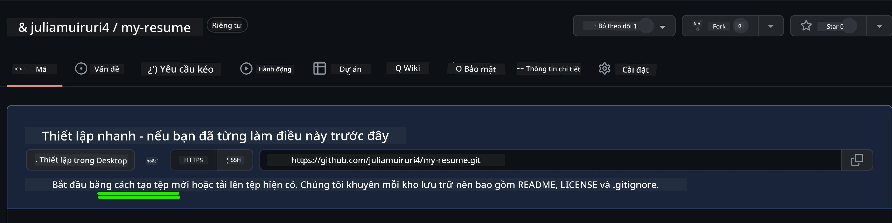
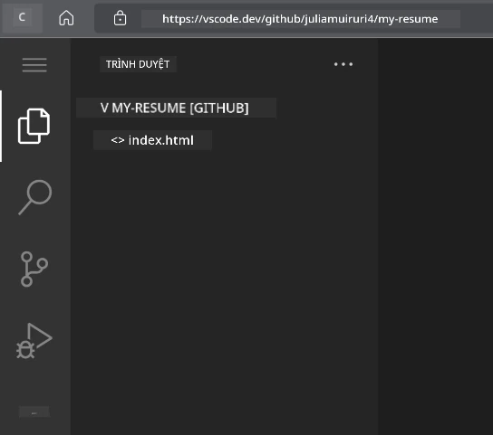
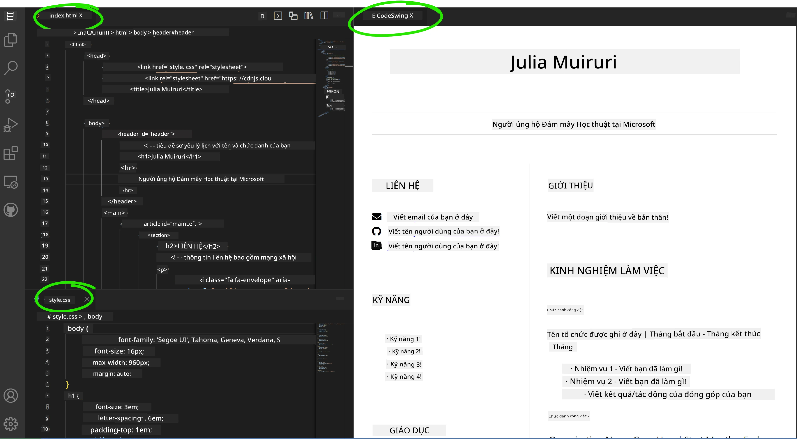

# Tạo Website Sơ Yếu Lý Lịch Bằng VSCode.dev

Nâng cao triển vọng nghề nghiệp của bạn bằng cách xây dựng một website sơ yếu lý lịch chuyên nghiệp, thể hiện kỹ năng và kinh nghiệm của bạn dưới dạng tương tác, hiện đại. Thay vì gửi các tệp PDF truyền thống, hãy tưởng tượng việc cung cấp cho nhà tuyển dụng một website đẹp mắt, đáp ứng tốt, vừa thể hiện trình độ chuyên môn vừa chứng minh khả năng phát triển web của bạn.

Bài tập thực hành này sẽ giúp bạn áp dụng tất cả các kỹ năng VSCode.dev của mình trong việc tạo ra một sản phẩm thực sự hữu ích cho sự nghiệp. Bạn sẽ trải nghiệm quy trình phát triển web hoàn chỉnh – từ việc tạo kho lưu trữ đến triển khai – tất cả đều thực hiện trong trình duyệt của bạn.

Hoàn thành dự án này, bạn sẽ có một sự hiện diện trực tuyến chuyên nghiệp, dễ dàng chia sẻ với các nhà tuyển dụng tiềm năng, cập nhật khi kỹ năng của bạn phát triển, và tùy chỉnh để phù hợp với thương hiệu cá nhân. Đây chính là loại dự án thực tế thể hiện kỹ năng phát triển web trong thế giới thực.

## Mục Tiêu Học Tập

Sau khi hoàn thành bài tập này, bạn sẽ có thể:

- **Tạo** và quản lý một dự án phát triển web hoàn chỉnh bằng VSCode.dev
- **Cấu trúc** một website chuyên nghiệp sử dụng các phần tử HTML ngữ nghĩa
- **Thiết kế** bố cục đáp ứng với các kỹ thuật CSS hiện đại
- **Triển khai** các tính năng tương tác bằng các công nghệ web cơ bản
- **Triển khai** một website trực tiếp có thể truy cập qua URL chia sẻ
- **Thể hiện** các thực hành tốt nhất về kiểm soát phiên bản trong suốt quá trình phát triển

## Yêu Cầu Trước Khi Bắt Đầu

Trước khi bắt đầu bài tập này, hãy đảm bảo bạn đã:

- Có tài khoản GitHub (tạo tại [github.com](https://github.com/) nếu cần)
- Hoàn thành bài học VSCode.dev về điều hướng giao diện và các thao tác cơ bản
- Hiểu cơ bản về cấu trúc HTML và các khái niệm thiết kế CSS

## Thiết Lập Dự Án và Tạo Kho Lưu Trữ

Hãy bắt đầu bằng việc thiết lập nền tảng cho dự án của bạn. Quy trình này mô phỏng các quy trình làm việc phát triển thực tế, nơi các dự án bắt đầu với việc khởi tạo kho lưu trữ và lập kế hoạch cấu trúc.

### Bước 1: Tạo Kho Lưu Trữ GitHub

Việc thiết lập một kho lưu trữ riêng biệt đảm bảo dự án của bạn được tổ chức và kiểm soát phiên bản từ đầu.

1. **Truy cập** [GitHub.com](https://github.com) và đăng nhập vào tài khoản của bạn
2. **Nhấn** nút "New" màu xanh lá hoặc biểu tượng "+" ở góc trên bên phải
3. **Đặt tên** cho kho lưu trữ của bạn là `my-resume` (hoặc chọn một tên cá nhân hóa như `john-smith-resume`)
4. **Thêm** mô tả ngắn: "Website sơ yếu lý lịch chuyên nghiệp được xây dựng bằng HTML và CSS"
5. **Chọn** "Public" để làm cho sơ yếu lý lịch của bạn có thể truy cập bởi các nhà tuyển dụng tiềm năng
6. **Chọn** "Add a README file" để tạo mô tả dự án ban đầu
7. **Nhấn** "Create repository" để hoàn tất thiết lập

> 💡 **Mẹo Đặt Tên Kho Lưu Trữ**: Sử dụng các tên mô tả, chuyên nghiệp để rõ ràng về mục đích của dự án. Điều này giúp ích khi chia sẻ với nhà tuyển dụng hoặc trong các buổi đánh giá danh mục đầu tư.

### Bước 2: Khởi Tạo Cấu Trúc Dự Án

Vì VSCode.dev yêu cầu ít nhất một tệp để mở kho lưu trữ, chúng ta sẽ tạo tệp HTML chính trực tiếp trên GitHub trước khi chuyển sang trình chỉnh sửa web.

1. **Nhấn** vào liên kết "creating a new file" trong kho lưu trữ mới của bạn
2. **Nhập** `index.html` làm tên tệp
3. **Thêm** cấu trúc HTML ban đầu này:

```html
<!DOCTYPE html>
<html lang="en">
<head>
    <meta charset="UTF-8">
    <meta name="viewport" content="width=device-width, initial-scale=1.0">
    <title>Your Name - Professional Resume</title>
</head>
<body>
    <h1>Your Name</h1>
    <p>Professional Resume Website</p>
</body>
</html>
```

4. **Viết** thông điệp commit: "Thêm cấu trúc HTML ban đầu"
5. **Nhấn** "Commit new file" để lưu thay đổi của bạn



**Những gì thiết lập ban đầu này đạt được:**
- **Thiết lập** cấu trúc tài liệu HTML5 đúng chuẩn với các phần tử ngữ nghĩa
- **Bao gồm** thẻ meta viewport để tương thích với thiết kế đáp ứng
- **Đặt** tiêu đề trang mô tả xuất hiện trên tab trình duyệt
- **Tạo** nền tảng cho tổ chức nội dung chuyên nghiệp

## Làm Việc Trong VSCode.dev

Bây giờ nền tảng kho lưu trữ của bạn đã được thiết lập, hãy chuyển sang VSCode.dev để thực hiện công việc phát triển chính. Trình chỉnh sửa web này cung cấp tất cả các công cụ cần thiết cho phát triển web chuyên nghiệp.

### Bước 3: Mở Dự Án Của Bạn Trong VSCode.dev

1. **Truy cập** [vscode.dev](https://vscode.dev) trong một tab trình duyệt mới
2. **Nhấn** "Open Remote Repository" trên màn hình chào mừng
3. **Sao chép** URL kho lưu trữ của bạn từ GitHub và dán vào trường nhập liệu

   Định dạng: `https://github.com/your-username/my-resume`
   
   *Thay thế `your-username` bằng tên người dùng GitHub thực của bạn*

4. **Nhấn** Enter để tải dự án của bạn

✅ **Chỉ báo thành công**: Bạn sẽ thấy các tệp dự án của mình trong thanh bên Explorer và `index.html` có sẵn để chỉnh sửa trong khu vực chỉnh sửa chính.



**Những gì bạn sẽ thấy trong giao diện:**
- **Thanh bên Explorer**: **Hiển thị** các tệp và cấu trúc thư mục của kho lưu trữ
- **Khu vực chỉnh sửa**: **Hiển thị** nội dung của các tệp được chọn để chỉnh sửa
- **Thanh hoạt động**: **Cung cấp** quyền truy cập vào các tính năng như Source Control và Extensions
- **Thanh trạng thái**: **Chỉ báo** trạng thái kết nối và thông tin nhánh hiện tại

### Bước 4: Xây Dựng Nội Dung Sơ Yếu Lý Lịch

Thay thế nội dung mẫu trong `index.html` bằng cấu trúc sơ yếu lý lịch toàn diện. HTML này cung cấp nền tảng cho việc trình bày chuyên nghiệp về trình độ của bạn.

<details>
<summary><b>Cấu Trúc HTML Sơ Yếu Lý Lịch Hoàn Chỉnh</b></summary>

```html
<!DOCTYPE html>
<html lang="en">
<head>
    <meta charset="UTF-8">
    <meta name="viewport" content="width=device-width, initial-scale=1.0">
    <link href="style.css" rel="stylesheet">
    <link rel="stylesheet" href="https://cdnjs.cloudflare.com/ajax/libs/font-awesome/5.15.4/css/all.min.css">
    <title>Your Name - Professional Resume</title>
</head>
<body>
    <header id="header">
        <h1>Your Full Name</h1>
        <hr>
        <p class="role">Your Professional Title</p>
        <hr>
    </header>
    
    <main>
        <article id="mainLeft">
            <section>
                <h2>CONTACT</h2>
                <p>
                    <i class="fa fa-envelope" aria-hidden="true"></i>
                    <a href="mailto:your.email@domain.com">your.email@domain.com</a>
                </p>
                <p>
                    <i class="fab fa-github" aria-hidden="true"></i>
                    <a href="https://github.com/your-username">github.com/your-username</a>
                </p>
                <p>
                    <i class="fab fa-linkedin" aria-hidden="true"></i>
                    <a href="https://linkedin.com/in/your-profile">linkedin.com/in/your-profile</a>
                </p>
            </section>
            
            <section>
                <h2>SKILLS</h2>
                <ul>
                    <li>HTML5 & CSS3</li>
                    <li>JavaScript (ES6+)</li>
                    <li>Responsive Web Design</li>
                    <li>Version Control (Git)</li>
                    <li>Problem Solving</li>
                </ul>
            </section>
            
            <section>
                <h2>EDUCATION</h2>
                <h3>Your Degree or Certification</h3>
                <p>Institution Name</p>
                <p>Start Date - End Date</p>
            </section>
        </article>
        
        <article id="mainRight">
            <section>
                <h2>ABOUT</h2>
                <p>Write a compelling summary that highlights your passion for web development, key achievements, and career goals. This section should give employers insight into your personality and professional approach.</p>
            </section>
            
            <section>
                <h2>WORK EXPERIENCE</h2>
                <div class="job">
                    <h3>Job Title</h3>
                    <p class="company">Company Name | Start Date – End Date</p>
                    <ul>
                        <li>Describe a key accomplishment or responsibility</li>
                        <li>Highlight specific skills or technologies used</li>
                        <li>Quantify impact where possible (e.g., "Improved efficiency by 25%")</li>
                    </ul>
                </div>
                
                <div class="job">
                    <h3>Previous Job Title</h3>
                    <p class="company">Previous Company | Start Date – End Date</p>
                    <ul>
                        <li>Focus on transferable skills and achievements</li>
                        <li>Demonstrate growth and learning progression</li>
                        <li>Include any leadership or collaboration experiences</li>
                    </ul>
                </div>
            </section>
            
            <section>
                <h2>PROJECTS</h2>
                <div class="project">
                    <h3>Project Name</h3>
                    <p>Brief description of what the project accomplishes and technologies used.</p>
                    <a href="#" target="_blank">View Project</a>
                </div>
            </section>
        </article>
    </main>
</body>
</html>
```
</details>

**Hướng dẫn tùy chỉnh:**
- **Thay thế** tất cả nội dung mẫu bằng thông tin thực tế của bạn
- **Điều chỉnh** các phần dựa trên mức độ kinh nghiệm và trọng tâm nghề nghiệp của bạn
- **Thêm** hoặc xóa các phần nếu cần (ví dụ: Chứng chỉ, Công việc Tình nguyện, Ngôn ngữ)
- **Bao gồm** liên kết đến các hồ sơ và dự án thực tế của bạn

### Bước 5: Tạo Các Tệp Hỗ Trợ

Các website chuyên nghiệp yêu cầu cấu trúc tệp được tổ chức. Tạo tệp CSS và các tệp cấu hình cần thiết cho một dự án hoàn chỉnh.

1. **Di chuột** qua tên thư mục dự án của bạn trong thanh bên Explorer
2. **Nhấn** biểu tượng "New File" (📄+) xuất hiện
3. **Tạo** các tệp này từng cái một:
   - `style.css` (dành cho thiết kế và bố cục)
   - `codeswing.json` (dành cho cấu hình tiện ích mở rộng)

**Tạo tệp CSS (`style.css`):**

<details>
<summary><b>Thiết Kế CSS Chuyên Nghiệp</b></summary>

```css
/* Modern Resume Styling */
body {
    font-family: 'Segoe UI', Tahoma, Geneva, Verdana, sans-serif;
    font-size: 16px;
    line-height: 1.6;
    max-width: 960px;
    margin: 0 auto;
    padding: 20px;
    color: #333;
    background-color: #f9f9f9;
}

/* Header Styling */
header {
    text-align: center;
    margin-bottom: 3em;
    padding: 2em;
    background: linear-gradient(135deg, #667eea 0%, #764ba2 100%);
    color: white;
    border-radius: 10px;
    box-shadow: 0 4px 6px rgba(0, 0, 0, 0.1);
}

h1 {
    font-size: 3em;
    letter-spacing: 0.1em;
    margin-bottom: 0.2em;
    font-weight: 300;
}

.role {
    font-size: 1.3em;
    font-weight: 300;
    margin: 1em 0;
}

/* Main Content Layout */
main {
    display: grid;
    grid-template-columns: 35% 65%;
    gap: 3em;
    margin-top: 3em;
    background: white;
    padding: 2em;
    border-radius: 10px;
    box-shadow: 0 2px 10px rgba(0, 0, 0, 0.1);
}

/* Typography */
h2 {
    font-size: 1.4em;
    font-weight: 600;
    margin-bottom: 1em;
    color: #667eea;
    border-bottom: 2px solid #667eea;
    padding-bottom: 0.3em;
}

h3 {
    font-size: 1.1em;
    font-weight: 600;
    margin-bottom: 0.5em;
    color: #444;
}

/* Section Styling */
section {
    margin-bottom: 2.5em;
}

#mainLeft {
    border-right: 1px solid #e0e0e0;
    padding-right: 2em;
}

/* Contact Links */
section a {
    color: #667eea;
    text-decoration: none;
    transition: color 0.3s ease;
}

section a:hover {
    color: #764ba2;
    text-decoration: underline;
}

/* Icons */
i {
    margin-right: 0.8em;
    width: 20px;
    text-align: center;
    color: #667eea;
}

/* Lists */
ul {
    list-style: none;
    padding-left: 0;
}

li {
    margin: 0.5em 0;
    padding: 0.3em 0;
    position: relative;
}

li:before {
    content: "▸";
    color: #667eea;
    margin-right: 0.5em;
}

/* Work Experience */
.job, .project {
    margin-bottom: 2em;
    padding-bottom: 1.5em;
    border-bottom: 1px solid #f0f0f0;
}

.company {
    font-style: italic;
    color: #666;
    margin-bottom: 0.5em;
}

/* Responsive Design */
@media (max-width: 768px) {
    main {
        grid-template-columns: 1fr;
        gap: 2em;
    }
    
    #mainLeft {
        border-right: none;
        border-bottom: 1px solid #e0e0e0;
        padding-right: 0;
        padding-bottom: 2em;
    }
    
    h1 {
        font-size: 2.2em;
    }
    
    body {
        padding: 10px;
    }
}

/* Print Styles */
@media print {
    body {
        background: white;
        color: black;
        font-size: 12pt;
    }
    
    header {
        background: none;
        color: black;
        box-shadow: none;
    }
    
    main {
        box-shadow: none;
    }
}
```
</details>

**Tạo tệp cấu hình (`codeswing.json`):**

```json
{
    "scripts": [],
    "styles": []
}
```

**Hiểu các tính năng CSS:**
- **Sử dụng** CSS Grid cho cấu trúc bố cục chuyên nghiệp, đáp ứng
- **Áp dụng** các bảng màu hiện đại với tiêu đề gradient
- **Bao gồm** hiệu ứng hover và chuyển đổi mượt mà để tăng tính tương tác
- **Cung cấp** thiết kế đáp ứng hoạt động trên mọi kích thước thiết bị
- **Thêm** kiểu dáng thân thiện với in ấn để tạo PDF

### Bước 6: Cài Đặt và Cấu Hình Tiện Ích Mở Rộng

Các tiện ích mở rộng cải thiện trải nghiệm phát triển của bạn bằng cách cung cấp khả năng xem trước trực tiếp và các công cụ hỗ trợ quy trình làm việc. Tiện ích CodeSwing đặc biệt hữu ích cho các dự án phát triển web.

**Cài đặt Tiện Ích CodeSwing:**

1. **Nhấn** biểu tượng Extensions (🧩) trong Thanh Hoạt Động
2. **Tìm kiếm** "CodeSwing" trong hộp tìm kiếm của marketplace
3. **Chọn** tiện ích CodeSwing từ kết quả tìm kiếm
4. **Nhấn** nút "Install" màu xanh


**Những gì CodeSwing cung cấp:**
- **Cho phép** xem trước trực tiếp website của bạn khi chỉnh sửa
- **Hiển thị** thay đổi theo thời gian thực mà không cần làm mới thủ công
- **Hỗ trợ** nhiều loại tệp bao gồm HTML, CSS, và JavaScript
- **Cung cấp** trải nghiệm môi trường phát triển tích hợp

**Kết quả ngay sau khi cài đặt:**
Khi CodeSwing được cài đặt, bạn sẽ thấy một bản xem trước trực tiếp của website sơ yếu lý lịch xuất hiện trong trình chỉnh sửa. Điều này cho phép bạn thấy chính xác cách website của bạn trông như thế nào khi thực hiện các thay đổi.



**Hiểu giao diện được cải tiến:**
- **Chế độ xem chia đôi**: **Hiển thị** mã của bạn ở một bên và bản xem trước trực tiếp ở bên kia
- **Cập nhật theo thời gian thực**: **Phản ánh** các thay đổi ngay lập tức khi bạn nhập
- **Xem trước tương tác**: **Cho phép** bạn kiểm tra các liên kết và tương tác
- **Mô phỏng di động**: **Cung cấp** khả năng kiểm tra thiết kế đáp ứng

### Bước 7: Kiểm Soát Phiên Bản và Xuất Bản

Bây giờ website sơ yếu lý lịch của bạn đã hoàn chỉnh, hãy sử dụng Git để lưu công việc của bạn và làm cho nó có sẵn trực tuyến.

**Commit các thay đổi của bạn:**

1. **Nhấn** biểu tượng Source Control (🌿) trong Thanh Hoạt Động
2. **Xem lại** tất cả các tệp bạn đã tạo và chỉnh sửa trong phần "Changes"
3. **Stage** các thay đổi của bạn bằng cách nhấn biểu tượng "+" bên cạnh mỗi tệp
4. **Viết** thông điệp commit mô tả, chẳng hạn:
   - "Thêm website sơ yếu lý lịch hoàn chỉnh với thiết kế đáp ứng"
   - "Triển khai thiết kế và cấu trúc nội dung chuyên nghiệp"
5. **Nhấn** dấu kiểm (✓) để commit và đẩy các thay đổi của bạn

**Ví dụ thông điệp commit hiệu quả:**
- "Thêm nội dung và thiết kế sơ yếu lý lịch chuyên nghiệp"
- "Triển khai thiết kế đáp ứng cho khả năng tương thích di động"
- "Cập nhật thông tin liên hệ và liên kết dự án"

> 💡 **Mẹo Chuyên Nghiệp**: Các thông điệp commit tốt giúp theo dõi sự phát triển của dự án và thể hiện sự chú ý đến chi tiết – những phẩm chất mà nhà tuyển dụng đánh giá cao.

**Truy cập website đã xuất bản của bạn:**
Sau khi commit, bạn có thể quay lại kho lưu trữ GitHub của mình bằng cách sử dụng menu hamburger (☰) ở góc trên bên trái. Website sơ yếu lý lịch của bạn hiện đã được kiểm soát phiên bản và sẵn sàng để triển khai hoặc chia sẻ.

## Kết Quả và Bước Tiếp Theo

**Chúc mừng! 🎉** Bạn đã thành công tạo một website sơ yếu lý lịch chuyên nghiệp bằng VSCode.dev. Dự án của bạn thể hiện:
**Kỹ năng kỹ thuật đã thể hiện:**
- **Quản lý kho lưu trữ**: Tạo và tổ chức cấu trúc dự án hoàn chỉnh
- **Phát triển web**: Xây dựng một website đáp ứng sử dụng HTML5 và CSS3 hiện đại
- **Kiểm soát phiên bản**: Triển khai quy trình Git đúng chuẩn với các commit ý nghĩa
- **Thành thạo công cụ**: Sử dụng hiệu quả giao diện và hệ thống tiện ích mở rộng của VSCode.dev

**Kết quả chuyên nghiệp đạt được:**
- **Sự hiện diện trực tuyến**: Một URL có thể chia sẻ để thể hiện trình độ của bạn
- **Định dạng hiện đại**: Một lựa chọn tương tác thay thế cho sơ yếu lý lịch PDF truyền thống
- **Kỹ năng có thể chứng minh**: Bằng chứng cụ thể về khả năng phát triển web của bạn
- **Dễ dàng cập nhật**: Một nền tảng bạn có thể liên tục cải thiện và tùy chỉnh

### Các Tùy Chọn Triển Khai

Để làm cho sơ yếu lý lịch của bạn có thể truy cập bởi nhà tuyển dụng, hãy xem xét các tùy chọn lưu trữ sau:

**GitHub Pages (Khuyến nghị):**
1. Truy cập vào phần Settings của kho lưu trữ trên GitHub
2. Cuộn xuống phần "Pages"
3. Chọn "Deploy from a branch" và chọn "main"
4. Website của bạn sẽ có sẵn tại `https://your-username.github.io/my-resume`

**Các nền tảng thay thế:**
- **Netlify**: Triển khai tự động với tên miền tùy chỉnh
- **Vercel**: Triển khai nhanh với các tính năng lưu trữ hiện đại
- **GitHub Codespaces**: Môi trường phát triển với bản xem trước tích hợp

### Gợi Ý Cải Tiến

Tiếp tục phát triển kỹ năng của bạn bằng cách thêm các tính năng sau:

**Cải tiến kỹ thuật:**
- **Tương tác JavaScript**: Thêm cuộn mượt hoặc các yếu tố tương tác
- **Chuyển đổi chế độ tối**: Triển khai chuyển đổi chủ đề theo sở thích người dùng
- **Biểu mẫu liên hệ**: Cho phép giao tiếp trực tiếp từ nhà tuyển dụng tiềm năng
- **Tối ưu hóa SEO**: Thêm thẻ meta và dữ liệu có cấu trúc để tăng khả năng hiển thị tìm kiếm

**Nâng cấp nội dung:**
- **Danh mục dự án**: Liên kết đến các kho lưu trữ GitHub và các bản trình diễn trực tiếp
- **Hình ảnh hóa kỹ năng**: Tạo thanh tiến độ hoặc hệ thống đánh giá kỹ năng
- **Phần lời chứng thực**: Bao gồm các khuyến nghị từ đồng nghiệp hoặc giảng viên
- **Tích hợp blog**: Thêm phần blog để thể hiện hành trình học tập của bạn

## Thử Thách GitHub Copilot Agent 🚀

Sử dụng chế độ Agent để hoàn thành thử thách sau:

**Mô tả:** Nâng cấp website sơ yếu lý lịch của bạn với các tính năng nâng cao thể hiện khả năng phát triển web chuyên nghiệp và nguyên tắc thiết kế hiện đại.

**Yêu cầu:** Dựa trên website sơ yếu lý lịch hiện có, triển khai các tính năng nâng cao sau:
1. Thêm chuyển đổi chủ đề sáng/tối với các hiệu ứng chuyển đổi mượt mà
2. Tạo phần kỹ năng tương tác với các thanh tiến độ hoạt hình
3. Triển khai biểu mẫu liên hệ với xác thực biểu mẫu
4. Thêm phần danh mục dự án với hiệu ứng hover và các popup modal
5. Bao gồm phần blog với ít nhất 3 bài viết mẫu về hành trình học tập của bạn
6. Tối ưu hóa SEO với thẻ meta, dữ liệu có cấu trúc, và hiệu suất
7. Triển khai website nâng cấp bằng GitHub Pages hoặc Netlify
8. Tài liệu hóa tất cả các tính năng mới trong README.md với ảnh chụp màn hình

Website nâng cấp của bạn nên thể hiện sự thành thạo các thực hành phát triển web hiện đại bao gồm thiết kế đáp ứng, tương tác JavaScript, và quy trình triển khai chuyên nghiệp.

## Mở Rộng Thử Thách

Sẵn sàng nâng cao kỹ năng của bạn hơn nữa? Hãy thử các thử thách nâng cao sau:

**📱 Thiết Kế Lại Ưu Tiên Di Động:** Xây dựng lại hoàn toàn website của bạn sử dụng cách tiếp cận ưu tiên di động với CSS Grid và Flexbox

**🔍 Tối Ưu Hóa SEO:** Triển khai SEO toàn diện bao gồm thẻ meta, dữ liệu có cấu trúc, và tối ưu hóa hiệu suất

**🌐 Hỗ Trợ Đa Ngôn Ngữ:** Thêm các tính năng quốc tế hóa để hỗ trợ nhiều ngôn ngữ

**📊 Tích Hợp Phân Tích:** Thêm Google Analytics để theo dõi sự tương tác của người dùng và tối ưu hóa nội dung của bạn

**🚀 Tối Ưu Hóa Hiệu Suất:** Đạt điểm Lighthouse hoàn hảo trên tất cả các danh mục

## Ôn Tập & Tự Học

Mở rộng kiến thức của bạn với các tài liệu sau:

**Các Tính Năng Nâng Cao của VSCode.dev:
- **Khả năng tiếp cận**: Tìm hiểu các hướng dẫn WCAG để thiết kế web toàn diện
- **Hiệu suất**: Khám phá các công cụ như Lighthouse để tối ưu hóa
- **SEO**: Hiểu các nguyên tắc cơ bản về tối ưu hóa công cụ tìm kiếm

**Phát triển chuyên môn:**
- **Xây dựng danh mục**: Tạo thêm các dự án để thể hiện kỹ năng đa dạng
- **Mã nguồn mở**: Đóng góp vào các dự án hiện có để tích lũy kinh nghiệm hợp tác
- **Kết nối**: Chia sẻ trang web hồ sơ của bạn trong các cộng đồng lập trình viên để nhận phản hồi
- **Học tập liên tục**: Luôn cập nhật các xu hướng và công nghệ phát triển web

---

**Bước tiếp theo của bạn:** Chia sẻ trang web hồ sơ của bạn với bạn bè, gia đình hoặc người cố vấn để nhận phản hồi. Sử dụng các gợi ý của họ để cải thiện và nâng cấp thiết kế của bạn. Hãy nhớ rằng, dự án này không chỉ là một hồ sơ – nó là minh chứng cho sự phát triển của bạn với tư cách là một nhà phát triển web!

---

**Tuyên bố miễn trừ trách nhiệm**:  
Tài liệu này đã được dịch bằng dịch vụ dịch thuật AI [Co-op Translator](https://github.com/Azure/co-op-translator). Mặc dù chúng tôi cố gắng đảm bảo độ chính xác, xin lưu ý rằng các bản dịch tự động có thể chứa lỗi hoặc không chính xác. Tài liệu gốc bằng ngôn ngữ bản địa nên được coi là nguồn thông tin chính thức. Đối với thông tin quan trọng, nên sử dụng dịch vụ dịch thuật chuyên nghiệp bởi con người. Chúng tôi không chịu trách nhiệm cho bất kỳ sự hiểu lầm hoặc diễn giải sai nào phát sinh từ việc sử dụng bản dịch này.