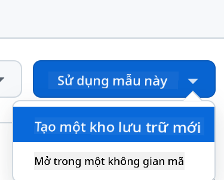

<!--
CO_OP_TRANSLATOR_METADATA:
{
  "original_hash": "cf15ff7770c5a484349383bb27d1131f",
  "translation_date": "2025-08-29T09:47:21+00:00",
  "source_file": "9-chat-project/README.md",
  "language_code": "vi"
}
-->
# Dự án Chat

Dự án chat này hướng dẫn cách xây dựng một Trợ lý Chat sử dụng GitHub Models.

Dưới đây là hình ảnh của dự án hoàn chỉnh:

<div>
  
</div>

Một chút bối cảnh, việc xây dựng các trợ lý Chat sử dụng AI tạo sinh là một cách tuyệt vời để bắt đầu học về AI. Trong bài học này, bạn sẽ học cách tích hợp AI tạo sinh vào một ứng dụng web. Hãy bắt đầu nào.

## Kết nối với AI tạo sinh

Ở phần backend, chúng ta sử dụng GitHub Models. Đây là một dịch vụ tuyệt vời cho phép bạn sử dụng AI miễn phí. Hãy truy cập playground của nó và lấy đoạn mã tương ứng với ngôn ngữ backend mà bạn chọn. Đây là hình ảnh tại [GitHub Models Playground](https://github.com/marketplace/models/azure-openai/gpt-4o-mini/playground)

<div>
  
</div>

Như đã nói, hãy chọn tab "Code" và runtime mà bạn muốn.

<div>
  
</div>

Trong trường hợp này, chúng ta chọn Python, điều này có nghĩa là chúng ta sẽ sử dụng đoạn mã sau:

```python
"""Run this model in Python

> pip install openai
"""
import os
from openai import OpenAI

# To authenticate with the model you will need to generate a personal access token (PAT) in your GitHub settings. 
# Create your PAT token by following instructions here: https://docs.github.com/en/authentication/keeping-your-account-and-data-secure/managing-your-personal-access-tokens
client = OpenAI(
    base_url="https://models.github.ai/inference",
    api_key=os.environ["GITHUB_TOKEN"],
)

response = client.chat.completions.create(
    messages=[
        {
            "role": "system",
            "content": "",
        },
        {
            "role": "user",
            "content": "What is the capital of France?",
        }
    ],
    model="openai/gpt-4o-mini",
    temperature=1,
    max_tokens=4096,
    top_p=1
)

print(response.choices[0].message.content)
```

Hãy làm sạch đoạn mã này một chút để có thể tái sử dụng:

```python
def call_llm(prompt: str, system_message: str):
    response = client.chat.completions.create(
        messages=[
            {
                "role": "system",
                "content": system_message,
            },
            {
                "role": "user",
                "content": prompt,
            }
        ],
        model="openai/gpt-4o-mini",
        temperature=1,
        max_tokens=4096,
        top_p=1
    )

    return response.choices[0].message.content
```

Với hàm `call_llm`, chúng ta có thể truyền vào một prompt và một system prompt, và hàm này sẽ trả về kết quả.

### Tùy chỉnh Trợ lý AI

Nếu bạn muốn tùy chỉnh Trợ lý AI, bạn có thể chỉ định cách bạn muốn nó hoạt động bằng cách điền vào system prompt như sau:

```python
call_llm("Tell me about you", "You're Albert Einstein, you only know of things in the time you were alive")
```

## Triển khai qua Web API

Tuyệt vời, chúng ta đã hoàn thành phần AI, giờ hãy xem cách tích hợp nó vào một Web API. Đối với Web API, chúng ta chọn sử dụng Flask, nhưng bất kỳ framework web nào cũng đều phù hợp. Dưới đây là đoạn mã:

```python
# api.py
from flask import Flask, request, jsonify
from llm import call_llm
from flask_cors import CORS

app = Flask(__name__)
CORS(app)   # *   example.com

@app.route("/", methods=["GET"])
def index():
    return "Welcome to this API. Call POST /hello with 'message': 'my message' as JSON payload"


@app.route("/hello", methods=["POST"])
def hello():
    # get message from request body  { "message": "do this taks for me" }
    data = request.get_json()
    message = data.get("message", "")

    response = call_llm(message, "You are a helpful assistant.")
    return jsonify({
        "response": response
    })

if __name__ == "__main__":
    app.run(host="0.0.0.0", port=5000)
```

Ở đây, chúng ta tạo một API Flask và định nghĩa hai route mặc định là "/" và "/chat". Route thứ hai được sử dụng bởi frontend để gửi câu hỏi đến backend.

Để tích hợp *llm.py*, đây là những gì chúng ta cần làm:

- Import hàm `call_llm`:

   ```python
   from llm import call_llm
   from flask import Flask, request
   ```

- Gọi hàm này từ route "/chat":

   ```python
   @app.route("/hello", methods=["POST"])
   def hello():
      # get message from request body  { "message": "do this taks for me" }
      data = request.get_json()
      message = data.get("message", "")

      response = call_llm(message, "You are a helpful assistant.")
      return jsonify({
         "response": response
      })
   ```

   Ở đây, chúng ta phân tích yêu cầu gửi đến để lấy thuộc tính `message` từ JSON body. Sau đó, chúng ta gọi LLM với đoạn mã sau:

   ```python
   response = call_llm(message, "You are a helpful assistant")

   # return the response as JSON
   return jsonify({
      "response": response 
   })
   ```

Tuyệt vời, giờ chúng ta đã hoàn thành những gì cần thiết.

### Cấu hình Cors

Chúng ta cần thiết lập CORS, chia sẻ tài nguyên giữa các nguồn. Điều này có nghĩa là vì backend và frontend sẽ chạy trên các cổng khác nhau, chúng ta cần cho phép frontend gọi vào backend. Có một đoạn mã trong *api.py* thiết lập điều này:

```python
from flask_cors import CORS

app = Flask(__name__)
CORS(app)   # *   example.com
```

Hiện tại, nó được thiết lập để cho phép "*" tức là tất cả các nguồn, điều này không an toàn lắm. Chúng ta nên giới hạn lại khi triển khai lên môi trường sản xuất.

## Chạy dự án của bạn

Ok, chúng ta đã có *llm.py* và *api.py*, làm thế nào để chạy chúng với backend? Có hai bước cần thực hiện:

- Cài đặt các dependencies:

   ```sh
   cd backend
   python -m venv venv
   source ./venv/bin/activate

   pip install openai flask flask-cors openai
   ```

- Khởi động API:

   ```sh
   python api.py
   ```

   Nếu bạn đang sử dụng Codespaces, hãy vào mục Ports ở phần dưới của trình chỉnh sửa, nhấp chuột phải và chọn "Port Visibility" rồi chọn "Public".

### Làm việc với frontend

Bây giờ chúng ta đã có API hoạt động, hãy tạo một frontend cho nó. Một frontend tối thiểu mà chúng ta sẽ cải thiện từng bước. Trong thư mục *frontend*, tạo các tệp sau:

```text
backend/
frontend/
index.html
app.js
styles.css
```

Hãy bắt đầu với **index.html**:

```html
<html>
    <head>
        <link rel="stylesheet" href="styles.css">
    </head>
    <body>
      <form>
        <textarea id="messages"></textarea>
        <input id="input" type="text" />
        <button type="submit" id="sendBtn">Send</button>  
      </form>  
      <script src="app.js" />
    </body>
</html>    
```

Đoạn mã trên là tối thiểu cần thiết để hỗ trợ một cửa sổ chat, bao gồm một textarea để hiển thị tin nhắn, một input để nhập tin nhắn và một nút để gửi tin nhắn đến backend. Tiếp theo, hãy xem JavaScript trong *app.js*.

**app.js**

```js
// app.js

(function(){
  // 1. set up elements  
  const messages = document.getElementById("messages");
  const form = document.getElementById("form");
  const input = document.getElementById("input");

  const BASE_URL = "change this";
  const API_ENDPOINT = `${BASE_URL}/hello`;

  // 2. create a function that talks to our backend
  async function callApi(text) {
    const response = await fetch(API_ENDPOINT, {
      method: "POST",
      headers: { "Content-Type": "application/json" },
      body: JSON.stringify({ message: text })
    });
    let json = await response.json();
    return json.response;
  }

  // 3. add response to our textarea
  function appendMessage(text, role) {
    const el = document.createElement("div");
    el.className = `message ${role}`;
    el.innerHTML = text;
    messages.appendChild(el);
  }

  // 4. listen to submit events
  form.addEventListener("submit", async(e) => {
    e.preventDefault();
   // someone clicked the button in the form
   
   // get input
   const text = input.value.trim();

   appendMessage(text, "user")

   // reset it
   input.value = '';

   const reply = await callApi(text);

   // add to messages
   appendMessage(reply, "assistant");

  })
})();
```

Hãy đi qua từng phần của đoạn mã:

- 1) Ở đây, chúng ta lấy tham chiếu đến tất cả các phần tử sẽ sử dụng sau này trong mã.
- 2) Trong phần này, chúng ta tạo một hàm sử dụng phương thức `fetch` tích hợp để gọi backend.
- 3) `appendMessage` giúp thêm phản hồi cũng như tin nhắn mà người dùng nhập.
- 4) Ở đây, chúng ta lắng nghe sự kiện submit, đọc trường input, đặt tin nhắn của người dùng vào textarea, gọi API, và hiển thị phản hồi trong textarea.

Tiếp theo, hãy xem phần styling, đây là nơi bạn có thể tùy chỉnh theo ý thích, nhưng dưới đây là một số gợi ý:

**styles.css**

```
.message {
    background: #222;
    box-shadow: 0 0 0 10px orange;
    padding: 10px:
    margin: 5px;
}

.message.user {
    background: blue;
}

.message.assistant {
    background: grey;
} 
```

Với ba class này, bạn sẽ định dạng tin nhắn khác nhau tùy thuộc vào việc chúng đến từ trợ lý hay từ người dùng. Nếu bạn muốn lấy cảm hứng, hãy xem thư mục `solution/frontend/styles.css`.

### Thay đổi Base Url

Có một điều chúng ta chưa thiết lập, đó là `BASE_URL`. Điều này không được biết cho đến khi backend của bạn được khởi động. Để thiết lập:

- Nếu bạn chạy API cục bộ, nó sẽ được đặt thành `http://localhost:5000`.
- Nếu chạy trong Codespaces, nó sẽ trông giống như "[name]app.github.dev".

## Bài tập

Tạo thư mục của riêng bạn *project* với nội dung như sau:

```text
project/
  frontend/
    index.html
    app.js
    styles.css
  backend/
    api.py
    llm.py
```

Sao chép nội dung từ hướng dẫn ở trên nhưng hãy tùy chỉnh theo ý thích của bạn.

## Giải pháp

[Giải pháp](./solution/README.md)

## Phần thưởng

Hãy thử thay đổi tính cách của Trợ lý AI. Khi bạn gọi `call_llm` trong *api.py*, bạn có thể thay đổi tham số thứ hai thành bất kỳ điều gì bạn muốn, ví dụ:

```python
call_llm(message, "You are Captain Picard")
```

Cũng thay đổi CSS và văn bản theo ý thích của bạn, thực hiện các thay đổi trong *index.html* và *styles.css*.

## Tóm tắt

Tuyệt vời, bạn đã học từ đầu cách tạo một trợ lý cá nhân sử dụng AI. Chúng ta đã thực hiện điều này bằng cách sử dụng GitHub Models, backend bằng Python và frontend bằng HTML, CSS và JavaScript.

## Thiết lập với Codespaces

- Điều hướng đến: [Web Dev For Beginners repo](https://github.com/microsoft/Web-Dev-For-Beginners)
- Tạo từ template (đảm bảo bạn đã đăng nhập vào GitHub) ở góc trên bên phải:

    

- Khi đã ở trong repo của bạn, tạo một Codespace:

    

    Điều này sẽ khởi động một môi trường mà bạn có thể làm việc.

---

**Tuyên bố miễn trừ trách nhiệm**:  
Tài liệu này đã được dịch bằng dịch vụ dịch thuật AI [Co-op Translator](https://github.com/Azure/co-op-translator). Mặc dù chúng tôi cố gắng đảm bảo độ chính xác, xin lưu ý rằng các bản dịch tự động có thể chứa lỗi hoặc không chính xác. Tài liệu gốc bằng ngôn ngữ bản địa nên được coi là nguồn thông tin chính thức. Đối với các thông tin quan trọng, khuyến nghị sử dụng dịch vụ dịch thuật chuyên nghiệp bởi con người. Chúng tôi không chịu trách nhiệm cho bất kỳ sự hiểu lầm hoặc diễn giải sai nào phát sinh từ việc sử dụng bản dịch này.