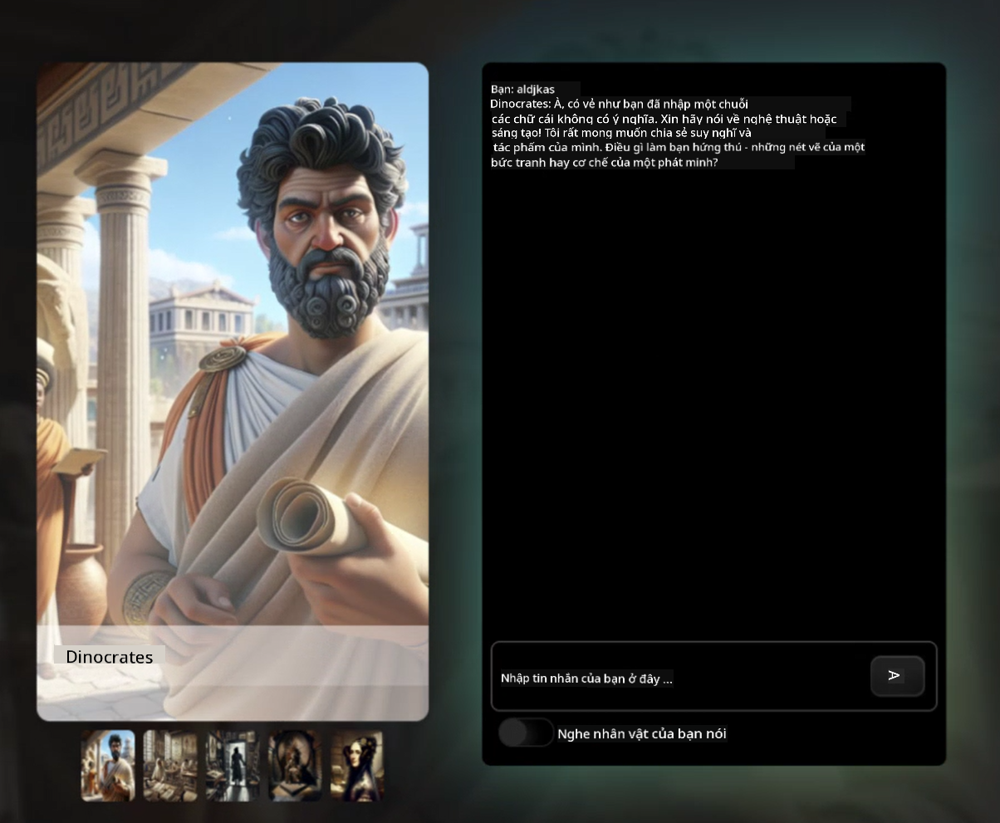
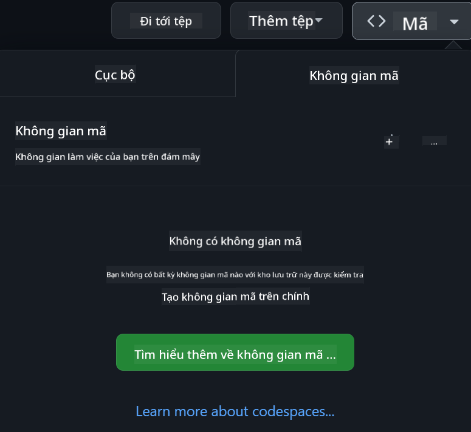

<!--
CO_OP_TRANSLATOR_METADATA:
{
  "original_hash": "3bea83a071750b68d3c8755f1155f805",
  "translation_date": "2025-10-03T10:13:18+00:00",
  "source_file": "README.md",
  "language_code": "vi"
}
-->
[](https://github.com/microsoft/Web-Dev-For-Beginners/blob/master/LICENSE)
[](https://GitHub.com/microsoft/Web-Dev-For-Beginners/graphs/contributors/)
[](https://GitHub.com/microsoft/Web-Dev-For-Beginners/issues/)
[](https://GitHub.com/microsoft/Web-Dev-For-Beginners/pulls/)
[](http://makeapullrequest.com)

[](https://GitHub.com/microsoft/Web-Dev-For-Beginners/watchers/)
[](https://GitHub.com/microsoft/Web-Dev-For-Beginners/network/)
[](https://GitHub.com/microsoft/Web-Dev-For-Beginners/stargazers/)

[](https://discord.gg/zxKYvhSnVp?WT.mc_id=academic-000002-leestott)

[](https://open.vscode.dev/microsoft/Web-Dev-For-Beginners)

[](https://discord.com/invite/ByRwuEEgH4)

Làm theo các bước sau để bắt đầu sử dụng tài nguyên này:
1. **Fork Repository**: Nhấn [](https://GitHub.com/microsoft/Web-Dev-For-Beginners/fork)
2. **Clone Repository**:   `git clone https://github.com/microsoft/Web-Dev-For-Beginners.git`
3. [**Tham gia Discord Azure AI Foundry và gặp gỡ các chuyên gia cùng các nhà phát triển khác**](https://discord.com/invite/ByRwuEEgH4)

# Phát triển Web cho Người Mới Bắt Đầu - Một Chương Trình Học

Học các nguyên tắc cơ bản về phát triển web với khóa học toàn diện kéo dài 12 tuần của Microsoft Cloud Advocates. Mỗi bài học trong số 24 bài học sẽ đi sâu vào JavaScript, CSS và HTML thông qua các dự án thực hành như làm terrarium, tiện ích mở rộng trình duyệt và trò chơi không gian. Tham gia các bài kiểm tra, thảo luận và bài tập thực hành. Nâng cao kỹ năng và tối ưu hóa việc ghi nhớ kiến thức với phương pháp học tập dựa trên dự án hiệu quả của chúng tôi. Bắt đầu hành trình lập trình của bạn ngay hôm nay!

### 🌐 Hỗ trợ đa ngôn ngữ

#### Được hỗ trợ qua GitHub Action (Tự động & Luôn cập nhật)

[French](../fr/README.md) | [Spanish](../es/README.md) | [German](../de/README.md) | [Russian](../ru/README.md) | [Arabic](../ar/README.md) | [Persian (Farsi)](../fa/README.md) | [Urdu](../ur/README.md) | [Chinese (Simplified)](../zh/README.md) | [Chinese (Traditional, Macau)](../mo/README.md) | [Chinese (Traditional, Hong Kong)](../hk/README.md) | [Chinese (Traditional, Taiwan)](../tw/README.md) | [Japanese](../ja/README.md) | [Korean](../ko/README.md) | [Hindi](../hi/README.md) | [Bengali](../bn/README.md) | [Marathi](../mr/README.md) | [Nepali](../ne/README.md) | [Punjabi (Gurmukhi)](../pa/README.md) | [Portuguese (Portugal)](../pt/README.md) | [Portuguese (Brazil)](../br/README.md) | [Italian](../it/README.md) | [Polish](../pl/README.md) | [Turkish](../tr/README.md) | [Greek](../el/README.md) | [Thai](../th/README.md) | [Swedish](../sv/README.md) | [Danish](../da/README.md) | [Norwegian](../no/README.md) | [Finnish](../fi/README.md) | [Dutch](../nl/README.md) | [Hebrew](../he/README.md) | [Vietnamese](./README.md) | [Indonesian](../id/README.md) | [Malay](../ms/README.md) | [Tagalog (Filipino)](../tl/README.md) | [Swahili](../sw/README.md) | [Hungarian](../hu/README.md) | [Czech](../cs/README.md) | [Slovak](../sk/README.md) | [Romanian](../ro/README.md) | [Bulgarian](../bg/README.md) | [Serbian (Cyrillic)](../sr/README.md) | [Croatian](../hr/README.md) | [Slovenian](../sl/README.md) | [Ukrainian](../uk/README.md) | [Burmese (Myanmar)](../my/README.md)

**Nếu bạn muốn có thêm các ngôn ngữ dịch, danh sách các ngôn ngữ được hỗ trợ có thể tìm thấy [tại đây](https://github.com/Azure/co-op-translator/blob/main/getting_started/supported-languages.md)**

#### 🧑‍🎓 _Bạn là sinh viên?_

Truy cập [**Trang Hub Sinh Viên**](https://docs.microsoft.com/learn/student-hub/?WT.mc_id=academic-77807-sagibbon) nơi bạn sẽ tìm thấy tài nguyên cho người mới bắt đầu, gói dành cho sinh viên và thậm chí cách nhận voucher chứng chỉ miễn phí. Đây là trang bạn nên đánh dấu và kiểm tra thường xuyên vì nội dung sẽ được thay đổi hàng tháng.

### 📣 Thông báo - _Dự án mới sử dụng AI Tạo Sinh_

Dự án Trợ lý AI mới vừa được thêm vào, hãy xem [dự án](./09-chat-project/README.md)

### 📣 Thông báo - _Chương trình học mới_ về AI Tạo Sinh cho JavaScript vừa được phát hành

Đừng bỏ lỡ chương trình học mới về AI Tạo Sinh!

Truy cập [https://aka.ms/genai-js-course](https://aka.ms/genai-js-course) để bắt đầu!


- Các bài học từ cơ bản đến RAG.
- Tương tác với các nhân vật lịch sử bằng GenAI và ứng dụng đồng hành của chúng tôi.
- Câu chuyện thú vị và hấp dẫn, bạn sẽ được du hành thời gian!



Mỗi bài học bao gồm bài tập để hoàn thành, kiểm tra kiến thức và thử thách để hướng dẫn bạn học các chủ đề như:
- Kỹ thuật tạo gợi ý
- Tạo ứng dụng văn bản và hình ảnh
- Ứng dụng tìm kiếm

Truy cập [https://aka.ms/genai-js-course](../../[https:/aka.ms/genai-js-course) để bắt đầu!

## 🌱 Bắt đầu

> **Giáo viên**, chúng tôi đã [bao gồm một số gợi ý](for-teachers.md) về cách sử dụng chương trình học này. Chúng tôi rất mong nhận được phản hồi của bạn [trong diễn đàn thảo luận](https://github.com/microsoft/Web-Dev-For-Beginners/discussions/categories/teacher-corner)!

**[Người học](https://aka.ms/student-page/?WT.mc_id=academic-77807-sagibbon)**, với mỗi bài học, bắt đầu bằng bài kiểm tra trước bài giảng và tiếp tục đọc tài liệu bài giảng, hoàn thành các hoạt động khác nhau và kiểm tra hiểu biết của bạn với bài kiểm tra sau bài giảng.

Để nâng cao trải nghiệm học tập, hãy kết nối với bạn bè để cùng làm các dự án! Khuyến khích thảo luận trong [diễn đàn thảo luận](https://github.com/microsoft/Web-Dev-For-Beginners/discussions) nơi đội ngũ quản trị viên của chúng tôi sẽ sẵn sàng trả lời câu hỏi của bạn.

Để mở rộng kiến thức, chúng tôi khuyến khích bạn khám phá [Microsoft Learn](https://learn.microsoft.com/users/wirelesslife/collections/p1ddcy5jwy0jkm?WT.mc_id=academic-77807-sagibbon) để tìm thêm tài liệu học tập.

### 📋 Thiết lập môi trường của bạn

Chương trình học này đã có môi trường phát triển sẵn sàng! Khi bắt đầu, bạn có thể chọn chạy chương trình học trong [Codespace](https://github.com/features/codespaces/) (_một môi trường dựa trên trình duyệt, không cần cài đặt_), hoặc trên máy tính của bạn bằng trình soạn thảo văn bản như [Visual Studio Code](https://code.visualstudio.com/?WT.mc_id=academic-77807-sagibbon).

#### Tạo repository của bạn
Để dễ dàng lưu lại công việc của bạn, chúng tôi khuyến nghị bạn tạo một bản sao của repository này. Bạn có thể làm điều này bằng cách nhấn nút **Use this template** ở đầu trang. Điều này sẽ tạo một repository mới trong tài khoản GitHub của bạn với bản sao của chương trình học.

Làm theo các bước sau:
1. **Fork Repository**: Nhấn nút "Fork" ở góc trên bên phải của trang này.
2. **Clone Repository**:   `git clone https://github.com/microsoft/Web-Dev-For-Beginners.git`

#### Chạy chương trình học trong Codespace

Trong bản sao repository mà bạn đã tạo, nhấn nút **Code** và chọn **Open with Codespaces**. Điều này sẽ tạo một Codespace mới để bạn làm việc.



#### Chạy chương trình học trên máy tính của bạn

Để chạy chương trình học trên máy tính của bạn, bạn sẽ cần một trình soạn thảo văn bản, một trình duyệt và một công cụ dòng lệnh. Bài học đầu tiên của chúng tôi, [Giới thiệu về Ngôn ngữ Lập trình và Công cụ](../../1-getting-started-lessons/1-intro-to-programming-languages), sẽ hướng dẫn bạn qua các tùy chọn khác nhau cho từng công cụ này để bạn chọn những gì phù hợp nhất với mình.

Chúng tôi khuyến nghị sử dụng [Visual Studio Code](https://code.visualstudio.com/?WT.mc_id=academic-77807-sagibbon) làm trình soạn thảo, nơi cũng có [Terminal](https://code.visualstudio.com/docs/terminal/basics/?WT.mc_id=academic-77807-sagibbon) tích hợp sẵn. Bạn có thể tải xuống Visual Studio Code [tại đây](https://code.visualstudio.com/?WT.mc_id=academic-77807-sagibbon).

1. Clone repository của bạn về máy tính. Bạn có thể làm điều này bằng cách nhấn nút **Code** và sao chép URL:

    [CodeSpace](./images/createcodespace.png)

    Sau đó, mở [Terminal](https://code.visualstudio.com/docs/terminal/basics/?WT.mc_id=academic-77807-sagibbon) trong [Visual Studio Code](https://code.visualstudio.com/?WT.mc_id=academic-77807-sagibbon) và chạy lệnh sau, thay thế `<your-repository-url>` bằng URL bạn vừa sao chép:

    ```bash 
    git clone <your-repository-url>
    ```

2. Mở thư mục trong Visual Studio Code. Bạn có thể làm điều này bằng cách nhấn **File** > **Open Folder** và chọn thư mục bạn vừa clone.

> Các tiện ích mở rộng Visual Studio Code được khuyến nghị:
>
> * [Live Server](https://marketplace.visualstudio.com/items?itemName=ritwickdey.LiveServer&WT.mc_id=academic-77807-sagibbon) - để xem trước các trang HTML trong Visual Studio Code
> * [Copilot](https://marketplace.visualstudio.com/items?itemName=GitHub.copilot&WT.mc_id=academic-77807-sagibbon) - để giúp bạn viết mã nhanh hơn

## 📂 Mỗi bài học bao gồm:

- sketchnote tùy chọn
- video bổ sung tùy chọn
- bài kiểm tra khởi động trước bài học
- bài học viết
- đối với các bài học dựa trên dự án, hướng dẫn từng bước cách xây dựng dự án
- kiểm tra kiến thức
- một thử thách
- tài liệu đọc bổ sung
- bài tập
- [bài kiểm tra sau bài học](https://ff-quizzes.netlify.app/web/)
> **Lưu ý về các bài kiểm tra**: Tất cả các bài kiểm tra đều nằm trong thư mục Quiz-app, tổng cộng có 48 bài kiểm tra, mỗi bài gồm ba câu hỏi. Bạn có thể truy cập [tại đây](https://ff-quizzes.netlify.app/web/). Ứng dụng kiểm tra có thể chạy cục bộ hoặc triển khai trên Azure; hãy làm theo hướng dẫn trong thư mục `quiz-app`.

## 🗃️ Các bài học

|     |                       Tên Dự Án                       |                            Khái Niệm Được Dạy                             | Mục Tiêu Học Tập                                                                                                                 |                                                         Bài Học Liên Kết                                                          |         Tác Giả          |
| :-: | :------------------------------------------------------: | :--------------------------------------------------------------------: | ----------------------------------------------------------------------------------------------------------------------------------- | :----------------------------------------------------------------------------------------------------------------------------: | :---------------------: |
| 01  |                     Bắt Đầu                      |           Giới thiệu về Lập trình và Công cụ hỗ trợ           | Tìm hiểu các nguyên lý cơ bản của hầu hết các ngôn ngữ lập trình và phần mềm giúp các nhà phát triển chuyên nghiệp làm việc hiệu quả | [Giới thiệu về Ngôn ngữ Lập trình và Công cụ hỗ trợ](./1-getting-started-lessons/1-intro-to-programming-languages/README.md) |         Jasmine         |
| 02  |                     Bắt Đầu                      |             Cơ bản về GitHub, bao gồm làm việc nhóm             | Cách sử dụng GitHub trong dự án của bạn, cách cộng tác với người khác trên một mã nguồn                                                    |                            [Giới thiệu về GitHub](./1-getting-started-lessons/2-github-basics/README.md)                             |          Floor          |
| 03  |                     Bắt Đầu                      |                             Khả năng tiếp cận                              | Tìm hiểu các nguyên tắc cơ bản về khả năng tiếp cận web                                                                                               |                       [Nguyên tắc về Khả năng Tiếp cận](./1-getting-started-lessons/3-accessibility/README.md)                       |       Christopher       |
| 04  |                        Cơ bản JS                         |                         Kiểu dữ liệu JavaScript                          | Các nguyên tắc cơ bản về kiểu dữ liệu trong JavaScript                                                                                                 |                                       [Kiểu Dữ Liệu](./2-js-basics/1-data-types/README.md)                                        |         Jasmine         |
| 05  |                        Cơ bản JS                         |                         Hàm và Phương thức                          | Tìm hiểu về hàm và phương thức để quản lý luồng logic của ứng dụng                                                             |                              [Hàm và Phương Thức](./2-js-basics/2-functions-methods/README.md)                               | Jasmine và Christopher |
| 06  |                        Cơ bản JS                         |                        Ra quyết định với JS                        | Tìm hiểu cách tạo điều kiện trong mã của bạn bằng các phương pháp ra quyết định                                                           |                                 [Ra Quyết Định](./2-js-basics/3-making-decisions/README.md)                                  |         Jasmine         |
| 07  |                        Cơ bản JS                         |                            Mảng và Vòng lặp                            | Làm việc với dữ liệu bằng mảng và vòng lặp trong JavaScript                                                                                 |                                   [Mảng và Vòng Lặp](./2-js-basics/4-arrays-loops/README.md)                                    |         Jasmine         |
| 08  |       [Terrarium](./3-terrarium/solution/README.md)       |                            HTML trong thực tế                            | Xây dựng HTML để tạo một terrarium trực tuyến, tập trung vào việc xây dựng bố cục                                                         |                                 [Giới thiệu về HTML](./3-terrarium/1-intro-to-html/README.md)                                 |           Jen           |
| 09  |       [Terrarium](./3-terrarium/solution/README.md)       |                            CSS trong thực tế                             | Xây dựng CSS để tạo kiểu cho terrarium trực tuyến, tập trung vào các nguyên tắc cơ bản của CSS bao gồm làm cho trang web đáp ứng                     |                                  [Giới thiệu về CSS](./3-terrarium/2-intro-to-css/README.md)                                  |           Jen           |
| 10  |            [Terrarium](./3-terrarium/solution/README.md)            |                 Đóng gói JavaScript, thao tác DOM                  | Xây dựng JavaScript để làm cho terrarium hoạt động như một giao diện kéo/thả, tập trung vào đóng gói và thao tác DOM             |                  [Đóng gói JavaScript, Thao tác DOM](./3-terrarium/3-intro-to-DOM-and-closures/README.md)                   |           Jen           |
| 11  |          [Trò chơi gõ phím](./4-typing-game/solution/README.md)          |                          Xây dựng trò chơi gõ phím                           | Tìm hiểu cách sử dụng sự kiện bàn phím để điều khiển logic của ứng dụng JavaScript của bạn                                                          |                                [Lập trình dựa trên sự kiện](./4-typing-game/typing-game/README.md)                                |       Christopher       |
| 12  | [Tiện ích mở rộng trình duyệt xanh](./5-browser-extension/solution/README.md) |                         Làm việc với trình duyệt                          | Tìm hiểu cách trình duyệt hoạt động, lịch sử của chúng và cách tạo các yếu tố đầu tiên của tiện ích mở rộng trình duyệt                               |                               [Về trình duyệt](./5-browser-extension/1-about-browsers/README.md)                                |           Jen           |
| 13  | [Tiện ích mở rộng trình duyệt xanh](./5-browser-extension/solution/README.md) | Xây dựng biểu mẫu, gọi API và lưu biến trong bộ nhớ cục bộ | Xây dựng các yếu tố JavaScript của tiện ích mở rộng trình duyệt để gọi API bằng các biến được lưu trong bộ nhớ cục bộ                      |                [API, Biểu mẫu, và Bộ nhớ cục bộ](./5-browser-extension/2-forms-browsers-local-storage/README.md)                 |           Jen           |
| 14  | [Tiện ích mở rộng trình duyệt xanh](./5-browser-extension/solution/README.md) |          Quá trình nền trong trình duyệt, hiệu suất web          | Sử dụng các quá trình nền của trình duyệt để quản lý biểu tượng của tiện ích mở rộng; tìm hiểu về hiệu suất web và một số tối ưu hóa để cải thiện   |             [Nhiệm vụ nền và Hiệu suất](./5-browser-extension/3-background-tasks-and-performance/README.md)              |           Jen           |
| 15  |           [Trò chơi không gian](./6-space-game/solution/README.md)           |             Phát triển trò chơi nâng cao với JavaScript             | Tìm hiểu về Kế thừa bằng cách sử dụng cả Lớp và Thành phần, cùng với mô hình Pub/Sub, để chuẩn bị xây dựng trò chơi              |                      [Giới thiệu về Phát triển trò chơi nâng cao](./6-space-game/1-introduction/README.md)                       |          Chris          |
| 16  |           [Trò chơi không gian](./6-space-game/solution/README.md)           |                           Vẽ lên canvas                            | Tìm hiểu về API Canvas, được sử dụng để vẽ các yếu tố lên màn hình                                                                       |                                [Vẽ lên Canvas](./6-space-game/2-drawing-to-canvas/README.md)                                |          Chris          |
| 17  |           [Trò chơi không gian](./6-space-game/solution/README.md)           |                   Di chuyển các yếu tố trên màn hình                    | Khám phá cách các yếu tố có thể chuyển động bằng cách sử dụng tọa độ Cartesian và API Canvas                                            |                           [Di chuyển các yếu tố](./6-space-game/3-moving-elements-around/README.md)                           |          Chris          |
| 18  |           [Trò chơi không gian](./6-space-game/solution/README.md)           |                          Phát hiện va chạm                           | Làm cho các yếu tố va chạm và phản ứng với nhau bằng cách sử dụng các phím nhấn và cung cấp chức năng làm mát để đảm bảo hiệu suất của trò chơi    |                              [Phát hiện va chạm](./6-space-game/4-collision-detection/README.md)                              |          Chris          |
| 19  |           [Trò chơi không gian](./6-space-game/solution/README.md)           |                             Ghi điểm                              | Thực hiện các phép tính toán dựa trên trạng thái và hiệu suất của trò chơi                                                                |                                    [Ghi điểm](./6-space-game/5-keeping-score/README.md)                                    |          Chris          |
| 20  |           [Trò chơi không gian](./6-space-game/solution/README.md)           |                     Kết thúc và khởi động lại trò chơi                     | Tìm hiểu về cách kết thúc và khởi động lại trò chơi, bao gồm việc dọn dẹp tài nguyên và đặt lại giá trị biến                              |                                [Điều kiện kết thúc](./6-space-game/6-end-condition/README.md)                                 |          Chris          |
| 21  |         [Ứng dụng ngân hàng](./7-bank-project/solution/README.md)          |                 Mẫu HTML và Định tuyến trong ứng dụng web                 | Tìm hiểu cách tạo cấu trúc của kiến trúc trang web nhiều trang bằng cách định tuyến và sử dụng mẫu HTML                             |                            [Mẫu HTML và Định tuyến](./7-bank-project/1-template-route/README.md)                             |          Yohan          |
| 22  |         [Ứng dụng ngân hàng](./7-bank-project/solution/README.md)          |                  Xây dựng Biểu mẫu Đăng nhập và Đăng ký                   | Tìm hiểu về cách xây dựng biểu mẫu và xử lý các quy trình xác thực                                                                          |                                           [Biểu mẫu](./7-bank-project/2-forms/README.md)                                           |          Yohan          |
| 23  |         [Ứng dụng ngân hàng](./7-bank-project/solution/README.md)          |                   Phương pháp Lấy và Sử dụng Dữ liệu                   | Cách dữ liệu luân chuyển vào và ra khỏi ứng dụng của bạn, cách lấy, lưu trữ và xử lý dữ liệu                                                 |                                            [Dữ liệu](./7-bank-project/3-data/README.md)                                            |          Yohan          |
| 24  |         [Ứng dụng ngân hàng](./7-bank-project/solution/README.md)          |                      Khái niệm về Quản lý Trạng thái                      | Tìm hiểu cách ứng dụng của bạn duy trì trạng thái và cách quản lý nó bằng lập trình                                                              |                                [Quản lý Trạng thái](./7-bank-project/4-state-management/README.md)                                |          Yohan          |
| 25 | [Trình duyệt/VScode Code](../../8-code-editor) | Làm việc với VScode | Tìm hiểu cách sử dụng trình chỉnh sửa mã | [Sử dụng Trình chỉnh sửa mã VScode](./8-code-editor/1-using-a-code-editor/README.md) | Chris |
| 26 | [Trợ lý AI](./9-chat-project/README.md) | Làm việc với AI | Tìm hiểu cách xây dựng trợ lý AI của riêng bạn | [Dự án Trợ lý AI](./9-chat-project/README.md) | Chris |

## 🏫 Phương pháp giảng dạy

Chương trình học của chúng tôi được thiết kế dựa trên hai nguyên tắc giảng dạy chính:
* học tập dựa trên dự án
* kiểm tra thường xuyên

Chương trình giảng dạy các nguyên tắc cơ bản của JavaScript, HTML và CSS, cũng như các công cụ và kỹ thuật mới nhất mà các nhà phát triển web hiện nay sử dụng. Học viên sẽ có cơ hội thực hành bằng cách xây dựng trò chơi gõ phím, terrarium ảo, tiện ích mở rộng trình duyệt thân thiện với môi trường, trò chơi kiểu "space invader" và ứng dụng ngân hàng cho doanh nghiệp. Đến cuối khóa học, học viên sẽ có được hiểu biết vững chắc về phát triển web.

> 🎓 Bạn có thể tham gia một số bài học đầu tiên trong chương trình này dưới dạng [Lộ trình học](https://docs.microsoft.com/learn/paths/web-development-101/?WT.mc_id=academic-77807-sagibbon) trên Microsoft Learn!

Bằng cách đảm bảo nội dung phù hợp với các dự án, quá trình học tập trở nên hấp dẫn hơn đối với học viên và khả năng ghi nhớ các khái niệm sẽ được tăng cường. Chúng tôi cũng đã viết một số bài học cơ bản về JavaScript để giới thiệu các khái niệm, đi kèm với video từ bộ sưu tập "[Beginners Series to: JavaScript](https://channel9.msdn.com/Series/Beginners-Series-to-JavaScript/?WT.mc_id=academic-77807-sagibbon)", một số tác giả của bộ video này đã đóng góp vào chương trình học.

Ngoài ra, một bài kiểm tra nhẹ nhàng trước lớp sẽ định hướng học viên tập trung vào việc học một chủ đề, trong khi bài kiểm tra thứ hai sau lớp sẽ đảm bảo khả năng ghi nhớ tốt hơn. Chương trình học này được thiết kế linh hoạt và thú vị, có thể học toàn bộ hoặc từng phần. Các dự án bắt đầu từ nhỏ và trở nên phức tạp hơn vào cuối chu kỳ 12 tuần.

Mặc dù chúng tôi cố tình tránh giới thiệu các framework JavaScript để tập trung vào các kỹ năng cơ bản cần thiết cho một nhà phát triển web trước khi áp dụng framework, bước tiếp theo tốt sau khi hoàn thành chương trình học này là tìm hiểu về Node.js thông qua một bộ sưu tập video khác: "[Beginner Series to: Node.js](https://channel9.msdn.com/Series/Beginners-Series-to-Nodejs/?WT.mc_id=academic-77807-sagibbon)".

> Xem [Quy tắc ứng xử](CODE_OF_CONDUCT.md) và hướng dẫn [Đóng góp](CONTRIBUTING.md) của chúng tôi. Chúng tôi hoan nghênh phản hồi mang tính xây dựng của bạn!

## 🧭 Truy cập ngoại tuyến

Bạn có thể chạy tài liệu này ngoại tuyến bằng cách sử dụng [Docsify](https://docsify.js.org/#/). Fork repo này, [cài đặt Docsify](https://docsify.js.org/#/quickstart) trên máy của bạn, sau đó trong thư mục gốc của repo này, gõ `docsify serve`. Trang web sẽ được phục vụ trên cổng 3000 trên localhost của bạn: `localhost:3000`.

## 📘 PDF

Một tệp PDF của tất cả các bài học có thể được tìm thấy [tại đây](https://microsoft.github.io/Web-Dev-For-Beginners/pdf/readme.pdf).

## 🎒 Các khóa học khác

Nhóm của chúng tôi sản xuất các khóa học khác! Hãy xem:

- [Generative AI for Beginners](https://aka.ms/genai-beginners)
- [Generative AI for Beginners .NET](https://github.com/microsoft/Generative-AI-for-beginners-dotnet)
- [Generative AI with JavaScript](https://github.com/microsoft/generative-ai-with-javascript)
- [Generative AI with Java](https://github.com/microsoft/Generative-AI-for-beginners-java)
- [AI for Beginners](https://aka.ms/ai-beginners)
- [Data Science for Beginners](https://aka.ms/datascience-beginners)
- [ML for Beginners](https://aka.ms/ml-beginners)
- [Cybersecurity for Beginners](https://github.com/microsoft/Security-101)
- [Web Dev for Beginners](https://aka.ms/webdev-beginners)
- [IoT for Beginners](https://aka.ms/iot-beginners)
- [XR Development for Beginners](https://github.com/microsoft/xr-development-for-beginners)
- [Mastering GitHub Copilot for Agentic use](https://github.com/microsoft/Mastering-GitHub-Copilot-for-Paired-Programming)
- [Mastering GitHub Copilot for C#/.NET Developers](https://github.com/microsoft/mastering-github-copilot-for-dotnet-csharp-developers)
- [Chọn Cuộc Phiêu Lưu Copilot Của Bạn](https://github.com/microsoft/CopilotAdventures)

## Nhận Hỗ Trợ

Nếu bạn gặp khó khăn hoặc có bất kỳ câu hỏi nào về việc xây dựng ứng dụng AI, hãy tham gia:

[](https://aka.ms/foundry/discord)

Nếu bạn có phản hồi về sản phẩm hoặc gặp lỗi trong quá trình xây dựng, hãy truy cập:

[](https://aka.ms/foundry/forum)

## Giấy Phép

Kho lưu trữ này được cấp phép theo giấy phép MIT. Xem tệp [LICENSE](../../LICENSE) để biết thêm thông tin.

---

**Tuyên bố miễn trừ trách nhiệm**:  
Tài liệu này đã được dịch bằng dịch vụ dịch thuật AI [Co-op Translator](https://github.com/Azure/co-op-translator). Mặc dù chúng tôi cố gắng đảm bảo độ chính xác, xin lưu ý rằng các bản dịch tự động có thể chứa lỗi hoặc không chính xác. Tài liệu gốc bằng ngôn ngữ bản địa nên được coi là nguồn thông tin chính thức. Đối với các thông tin quan trọng, khuyến nghị sử dụng dịch vụ dịch thuật chuyên nghiệp bởi con người. Chúng tôi không chịu trách nhiệm cho bất kỳ sự hiểu lầm hoặc diễn giải sai nào phát sinh từ việc sử dụng bản dịch này.