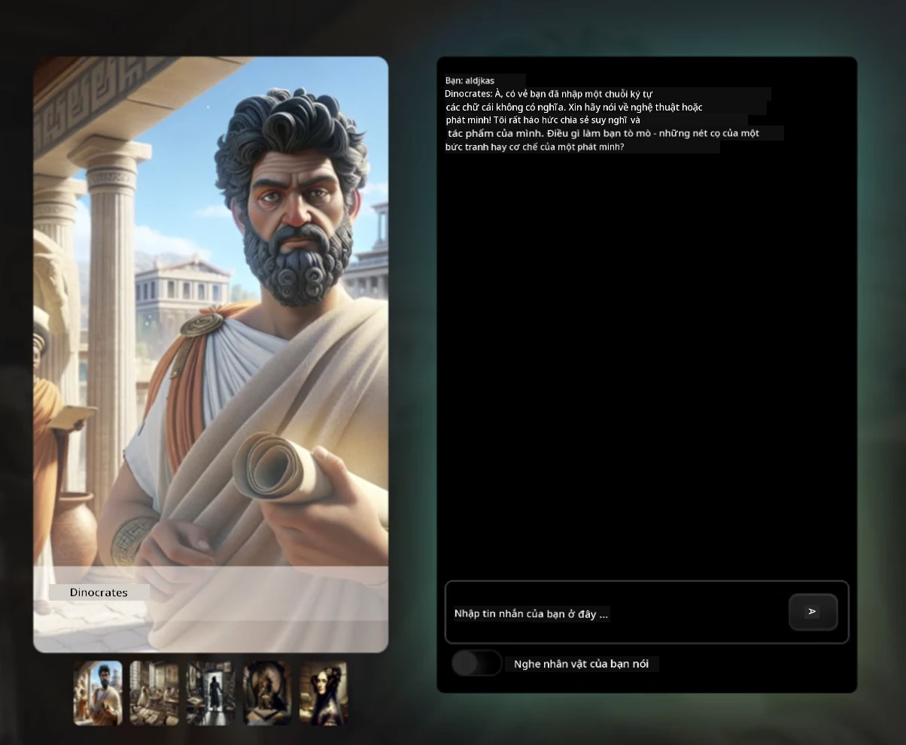
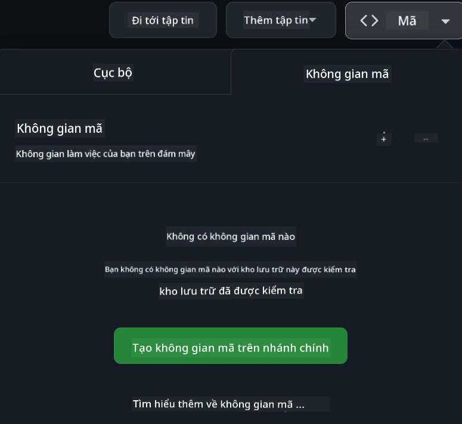

<!--
CO_OP_TRANSLATOR_METADATA:
{
  "original_hash": "fea3a0fceb8ad86fd640c09cf63a2aac",
  "translation_date": "2026-01-07T01:08:08+00:00",
  "source_file": "README.md",
  "language_code": "vi"
}
-->
[](https://github.com/microsoft/Web-Dev-For-Beginners/blob/master/LICENSE)
[](https://GitHub.com/microsoft/Web-Dev-For-Beginners/graphs/contributors/)
[](https://GitHub.com/microsoft/Web-Dev-For-Beginners/issues/)
[](https://GitHub.com/microsoft/Web-Dev-For-Beginners/pulls/)
[](http://makeapullrequest.com)

[](https://GitHub.com/microsoft/Web-Dev-For-Beginners/watchers/)
[](https://GitHub.com/microsoft/Web-Dev-For-Beginners/network/)
[](https://GitHub.com/microsoft/Web-Dev-For-Beginners/stargazers/)

[](https://discord.gg/nTYy5BXMWG)

# Phát triển Web cho Người mới bắt đầu - Chương trình học

Học những điều cơ bản về phát triển web với khóa học toàn diện 12 tuần do Microsoft Cloud Advocates thiết kế. Mỗi trong số 24 bài học đào sâu về JavaScript, CSS, và HTML thông qua các dự án thực hành như terrariums, tiện ích mở rộng trình duyệt, và trò chơi không gian. Tham gia với các bài kiểm tra, thảo luận, và bài tập thực tế. Nâng cao kỹ năng và tối ưu hóa việc ghi nhớ kiến thức với phương pháp dựa trên dự án hiệu quả của chúng tôi. Bắt đầu hành trình lập trình của bạn ngay hôm nay!

Tham gia Cộng đồng Discord Azure AI Foundry

[](https://discord.gg/nTYy5BXMWG)

Làm theo các bước sau để bắt đầu sử dụng các tài nguyên này:
1. **Fork Kho lưu trữ**: Nhấp vào [](https://GitHub.com/microsoft/Web-Dev-For-Beginners/fork)
2. **Clone Kho lưu trữ**:   `git clone https://github.com/microsoft/Web-Dev-For-Beginners.git`
3. [**Tham gia Discord Azure AI Foundry và gặp gỡ các chuyên gia cũng như các nhà phát triển khác**](https://discord.com/invite/ByRwuEEgH4)

### 🌐 Hỗ trợ Đa ngôn ngữ

#### Hỗ trợ qua GitHub Action (Tự động & Luôn được cập nhật)

<!-- CO-OP TRANSLATOR LANGUAGES TABLE START -->
[Arabic](../ar/README.md) | [Bengali](../bn/README.md) | [Bulgarian](../bg/README.md) | [Burmese (Myanmar)](../my/README.md) | [Chinese (Simplified)](../zh/README.md) | [Chinese (Traditional, Hong Kong)](../hk/README.md) | [Chinese (Traditional, Macau)](../mo/README.md) | [Chinese (Traditional, Taiwan)](../tw/README.md) | [Croatian](../hr/README.md) | [Czech](../cs/README.md) | [Danish](../da/README.md) | [Dutch](../nl/README.md) | [Estonian](../et/README.md) | [Finnish](../fi/README.md) | [French](../fr/README.md) | [German](../de/README.md) | [Greek](../el/README.md) | [Hebrew](../he/README.md) | [Hindi](../hi/README.md) | [Hungarian](../hu/README.md) | [Indonesian](../id/README.md) | [Italian](../it/README.md) | [Japanese](../ja/README.md) | [Kannada](../kn/README.md) | [Korean](../ko/README.md) | [Lithuanian](../lt/README.md) | [Malay](../ms/README.md) | [Malayalam](../ml/README.md) | [Marathi](../mr/README.md) | [Nepali](../ne/README.md) | [Nigerian Pidgin](../pcm/README.md) | [Norwegian](../no/README.md) | [Persian (Farsi)](../fa/README.md) | [Polish](../pl/README.md) | [Portuguese (Brazil)](../br/README.md) | [Portuguese (Portugal)](../pt/README.md) | [Punjabi (Gurmukhi)](../pa/README.md) | [Romanian](../ro/README.md) | [Russian](../ru/README.md) | [Serbian (Cyrillic)](../sr/README.md) | [Slovak](../sk/README.md) | [Slovenian](../sl/README.md) | [Spanish](../es/README.md) | [Swahili](../sw/README.md) | [Swedish](../sv/README.md) | [Tagalog (Filipino)](../tl/README.md) | [Tamil](../ta/README.md) | [Telugu](../te/README.md) | [Thai](../th/README.md) | [Turkish](../tr/README.md) | [Ukrainian](../uk/README.md) | [Urdu](../ur/README.md) | [Vietnamese](./README.md)

> **Ưu tiên Clone về máy tính?**

> Kho lưu trữ này bao gồm hơn 50 bản dịch ngôn ngữ làm tăng đáng kể kích thước tải xuống. Để clone mà không có bản dịch, hãy sử dụng sparse checkout:
> ```bash
> git clone --filter=blob:none --sparse https://github.com/microsoft/Web-Dev-For-Beginners.git
> cd Web-Dev-For-Beginners
> git sparse-checkout set --no-cone '/*' '!translations' '!translated_images'
> ```
> Điều này cung cấp cho bạn tất cả những gì bạn cần để hoàn thành khóa học với tốc độ tải xuống nhanh hơn nhiều.
<!-- CO-OP TRANSLATOR LANGUAGES TABLE END -->

**Nếu bạn muốn có thêm các ngôn ngữ dịch hỗ trợ được liệt kê [ở đây](https://github.com/Azure/co-op-translator/blob/main/getting_started/supported-languages.md)**

[](https://open.vscode.dev/microsoft/Web-Dev-For-Beginners)

#### 🧑‍🎓 _Bạn là sinh viên?_

Truy cập [**Trang Trung tâm Sinh viên**](https://docs.microsoft.com/learn/student-hub/?WT.mc_id=academic-77807-sagibbon) nơi bạn sẽ tìm thấy tài nguyên cho người mới bắt đầu, bộ dụng cụ dành cho sinh viên và thậm chí cả cách nhận phiếu chứng nhận miễn phí. Đây là trang bạn nên đánh dấu và kiểm tra thường xuyên vì chúng tôi thay đổi nội dung hàng tháng.

### 📣 Thông báo - Thử thách mới về Chế độ GitHub Copilot Agent để hoàn thành!

Thử thách mới đã được thêm, tìm "GitHub Copilot Agent Challenge 🚀" trong hầu hết các chương. Đây là thử thách mới dành cho bạn hoàn thành bằng cách sử dụng GitHub Copilot và Chế độ Agent. Nếu bạn chưa từng dùng Chế độ Agent trước đây, nó không chỉ tạo ra văn bản mà còn có thể tạo và chỉnh sửa tệp, chạy lệnh và nhiều hơn thế.

### 📣 Thông báo - _Dự án mới xây dựng sử dụng AI Tạo sinh_

Dự án Trợ lý AI mới vừa được thêm, xem ngay [dự án](./9-chat-project/README.md)

### 📣 Thông báo - _Chương trình học mới_ về Generative AI cho JavaScript vừa được phát hành

Đừng bỏ lỡ chương trình học Generative AI mới của chúng tôi!

Truy cập [https://aka.ms/genai-js-course](https://aka.ms/genai-js-course) để bắt đầu!


- Các bài học bao phủ từ cơ bản đến RAG.
- Tương tác với các nhân vật lịch sử bằng GenAI và ứng dụng đồng hành của chúng tôi.
- Câu chuyện thú vị và hấp dẫn, bạn sẽ du hành thời gian!



Mỗi bài học bao gồm một bài tập hoàn thành, kiểm tra kiến thức và một thử thách để hướng dẫn bạn học các chủ đề như:
- Lời nhắc và kỹ thuật tạo lời nhắc
- Tạo ứng dụng văn bản và hình ảnh
- Ứng dụng tìm kiếm

Truy cập [https://aka.ms/genai-js-course](https://aka.ms/genai-js-course) để bắt đầu!


## 🌱 Bắt đầu

> **Giáo viên**, chúng tôi đã [đưa ra một số gợi ý](for-teachers.md) về cách sử dụng chương trình học này. Chúng tôi rất mong nhận được phản hồi của bạn [trong diễn đàn thảo luận của chúng tôi](https://github.com/microsoft/Web-Dev-For-Beginners/discussions/categories/teacher-corner)!

**[Người học](https://aka.ms/student-page/?WT.mc_id=academic-77807-sagibbon)**, với mỗi bài học, bắt đầu với bài kiểm tra trước bài giảng và tiếp tục đọc tài liệu bài giảng, hoàn thành các hoạt động đa dạng và kiểm tra hiểu biết của bạn bằng bài kiểm tra sau bài giảng.

Để nâng cao trải nghiệm học tập, hãy kết nối với bạn bè để cùng làm các dự án! Thảo luận được khuyến khích trong [diễn đàn thảo luận](https://github.com/microsoft/Web-Dev-For-Beginners/discussions) nơi đội ngũ điều hành của chúng tôi sẽ hỗ trợ trả lời câu hỏi của bạn.

Để mở rộng kiến thức, chúng tôi khuyên bạn nên khám phá [Microsoft Learn](https://learn.microsoft.com/users/wirelesslife/collections/p1ddcy5jwy0jkm?WT.mc_id=academic-77807-sagibbon) để có thêm tài liệu học tập.

### 📋 Thiết lập môi trường

Chương trình học này đã có sẵn môi trường phát triển! Khi bắt đầu, bạn có thể chọn chạy chương trình trong [Codespace](https://github.com/features/codespaces/) (_một môi trường trên trình duyệt không cần cài đặt_), hoặc chạy cục bộ trên máy tính sử dụng trình soạn thảo văn bản như [Visual Studio Code](https://code.visualstudio.com/?WT.mc_id=academic-77807-sagibbon).

#### Tạo kho lưu trữ của bạn
Để dễ dàng lưu trữ công việc của bạn, bạn nên tạo bản sao riêng của kho lưu trữ này. Bạn có thể làm điều đó bằng cách nhấp vào nút **Use this template** ở đầu trang. Điều này sẽ tạo một kho lưu trữ mới trong tài khoản GitHub của bạn với bản sao chương trình học.

Thực hiện theo các bước:
1. **Fork Kho lưu trữ**: Nhấp vào nút "Fork" ở góc trên bên phải của trang này.
2. **Clone Kho lưu trữ**:   `git clone https://github.com/microsoft/Web-Dev-For-Beginners.git`

#### Chạy chương trình trong Codespace

Trong bản sao kho lưu trữ bạn đã tạo, nhấp nút **Code** và chọn **Open with Codespaces**. Điều này sẽ tạo Codespace mới để bạn làm việc.



#### Chạy chương trình trên máy tính của bạn

Để chạy chương trình này trên máy tính, bạn cần trình soạn thảo văn bản, trình duyệt và công cụ dòng lệnh. Bài học đầu tiên của chúng tôi, [Giới thiệu về Ngôn ngữ Lập trình và Công cụ](../../1-getting-started-lessons/1-intro-to-programming-languages), sẽ hướng dẫn bạn các lựa chọn cho từng công cụ để bạn chọn phù hợp nhất.

Chúng tôi khuyên bạn dùng [Visual Studio Code](https://code.visualstudio.com/?WT.mc_id=academic-77807-sagibbon) làm trình soạn thảo, trình soạn thảo này cũng có [Terminal](https://code.visualstudio.com/docs/terminal/basics/?WT.mc_id=academic-77807-sagibbon) tích hợp sẵn. Bạn có thể tải Visual Studio Code [tại đây](https://code.visualstudio.com/?WT.mc_id=academic-77807-sagibbon).


1. Clone kho lưu trữ về máy tính. Bạn có thể làm điều này bằng cách nhấp nút **Code** và sao chép URL:

    [CodeSpace](./images/createcodespace.png)
Sau đó, mở [Terminal](https://code.visualstudio.com/docs/terminal/basics/?WT.mc_id=academic-77807-sagibbon) trong [Visual Studio Code](https://code.visualstudio.com/?WT.mc_id=academic-77807-sagibbon) và chạy lệnh sau, thay thế `<your-repository-url>` bằng URL bạn vừa sao chép:

    ```bash 
    git clone <your-repository-url>
    ```

2. Mở thư mục trong Visual Studio Code. Bạn có thể làm điều này bằng cách nhấp vào **File** > **Open Folder** và chọn thư mục bạn vừa sao chép.

> Các tiện ích mở rộng Visual Studio Code được khuyến nghị:
>
> * [Live Server](https://marketplace.visualstudio.com/items?itemName=ritwickdey.LiveServer&WT.mc_id=academic-77807-sagibbon) - để xem trước các trang HTML trong Visual Studio Code
> * [Copilot](https://marketplace.visualstudio.com/items?itemName=GitHub.copilot&WT.mc_id=academic-77807-sagibbon) - giúp bạn viết mã nhanh hơn

## 📂 Mỗi bài học bao gồm:

- có thể có sketchnote tùy chọn
- có thể có video bổ sung tùy chọn
- bài kiểm tra làm nóng trước bài học
- bài học viết
- đối với các bài học dựa trên dự án, hướng dẫn từng bước cách xây dựng dự án
- các bài kiểm tra kiến thức
- một thử thách
- tài liệu đọc bổ sung
- bài kiểm tra sau bài học [post-lesson quiz](https://ff-quizzes.netlify.app/web/)

> **Lưu ý về các bài kiểm tra**: Tất cả các bài kiểm tra đều nằm trong thư mục Quiz-app, tổng cộng 48 bài kiểm tra với mỗi bài 3 câu hỏi. Chúng có sẵn [tại đây](https://ff-quizzes.netlify.app/web/); ứng dụng kiểm tra có thể chạy cục bộ hoặc triển khai lên Azure; làm theo hướng dẫn trong thư mục `quiz-app`.

## 🗃️ Các bài học

|     |                       Tên Dự Án                        |                            Khái Niệm Được Dạy                             | Mục Tiêu Học Tập                                                                                                                 |                                                        Bài Học Liên Kết                                                        |          Tác Giả          |
| :-: | :----------------------------------------------------: | :----------------------------------------------------------------------: | -------------------------------------------------------------------------------------------------------------------------------- | :----------------------------------------------------------------------------------------------------------------------------: | :-----------------------: |
| 01  |                     Getting Started                      |           Giới thiệu về Lập trình và Công cụ làm việc                    | Tìm hiểu nền tảng cơ bản đằng sau hầu hết các ngôn ngữ lập trình và về phần mềm hỗ trợ các nhà phát triển chuyên nghiệp            | [Intro to Programming Languages and Tools of the Trade](./1-getting-started-lessons/1-intro-to-programming-languages/README.md) |           Jasmine         |
| 02  |                     Getting Started                      |             Kiến thức cơ bản về GitHub, bao gồm làm việc nhóm            | Cách sử dụng GitHub trong dự án của bạn, cách hợp tác với người khác trên mã code                                                  |                          [Intro to GitHub](./1-getting-started-lessons/2-github-basics/README.md)                               |            Floor          |
| 03  |                     Getting Started                      |                             Khả năng truy cập                               | Tìm hiểu các kiến thức cơ bản về truy cập web                                                                                        |                     [Accessibility Fundamentals](./1-getting-started-lessons/3-accessibility/README.md)                        |         Christopher       |
| 04  |                        JS Basics                         |                         Các loại dữ liệu trong JavaScript                 | Các kiến thức cơ bản về các loại dữ liệu trong JavaScript                                                                           |                                     [Data Types](./2-js-basics/1-data-types/README.md)                                         |           Jasmine         |
| 05  |                        JS Basics                         |                         Hàm và Phương thức                               | Tìm hiểu về hàm và phương thức để quản lý luồng logic ứng dụng                                                                     |                               [Functions and Methods](./2-js-basics/2-functions-methods/README.md)                               |    Jasmine và Christopher |
| 06  |                        JS Basics                         |                        Ra quyết định với JavaScript                      | Tìm hiểu cách tạo điều kiện trong mã của bạn bằng các phương pháp ra quyết định                                                     |                                [Making Decisions](./2-js-basics/3-making-decisions/README.md)                                   |           Jasmine         |
| 07  |                        JS Basics                         |                            Mảng và Vòng lặp                              | Làm việc với dữ liệu bằng cách sử dụng mảng và vòng lặp trong JavaScript                                                           |                                  [Arrays and Loops](./2-js-basics/4-arrays-loops/README.md)                                     |           Jasmine         |
| 08  |       [Terrarium](./3-terrarium/solution/README.md)       |                            HTML trong Thực hành                          | Xây dựng HTML để tạo một terrarium trực tuyến, tập trung vào xây dựng bố cục                                                        |                                 [Introduction to HTML](./3-terrarium/1-intro-to-html/README.md)                                |            Jen            |
| 09  |       [Terrarium](./3-terrarium/solution/README.md)       |                             CSS trong Thực hành                          | Xây dựng CSS để tạo kiểu cho terrarium trực tuyến, tập trung vào kiến thức cơ bản CSS bao gồm làm trang web phản hồi                 |                                  [Introduction to CSS](./3-terrarium/2-intro-to-css/README.md)                                 |            Jen            |
| 10  |            [Terrarium](./3-terrarium/solution/README.md)            |                JavaScript Closures, thao tác DOM                         | Xây dựng JavaScript để làm cho terrarium hoạt động như giao diện kéo và thả, tập trung vào closures và thao tác DOM               |                  [JavaScript Closures, DOM manipulation](./3-terrarium/3-intro-to-DOM-and-closures/README.md)                 |            Jen            |
| 11  |          [Typing Game](./4-typing-game/solution/README.md)          |                          Xây dựng trò chơi đánh máy                      | Tìm hiểu cách sử dụng sự kiện bàn phím để điều khiển luồng logic cho ứng dụng JavaScript của bạn                                    |                              [Event-Driven Programming](./4-typing-game/typing-game/README.md)                                 |         Christopher       |
| 12  | [Green Browser Extension](./5-browser-extension/solution/README.md) |                         Làm việc với Trình duyệt                        | Tìm hiểu về cách trình duyệt hoạt động, lịch sử của nó và cách dựng khung đầu tiên cho tiện ích mở rộng trình duyệt               |                              [About Browsers](./5-browser-extension/1-about-browsers/README.md)                                 |            Jen            |
| 13  | [Green Browser Extension](./5-browser-extension/solution/README.md) | Xây dựng biểu mẫu, gọi API và lưu biến trong bộ nhớ cục bộ               | Xây dựng các thành phần JavaScript của tiện ích trình duyệt để gọi API sử dụng biến lưu trữ trong bộ nhớ cục bộ                    |                    [APIs, Forms, and Local Storage](./5-browser-extension/2-forms-browsers-local-storage/README.md)             |            Jen            |
| 14  | [Green Browser Extension](./5-browser-extension/solution/README.md) |          Các tiến trình nền của trình duyệt, hiệu suất web               | Sử dụng các tiến trình nền của trình duyệt để quản lý biểu tượng tiện ích; tìm hiểu về hiệu suất web và một số tối ưu để cải thiện |           [Background Tasks and Performance](./5-browser-extension/3-background-tasks-and-performance/README.md)              |            Jen            |
| 15  |           [Space Game](./6-space-game/solution/README.md)           |          Phát triển trò chơi nâng cao hơn với JavaScript                | Tìm hiểu về Kế thừa sử dụng cả Lớp và Thành phần cũng như mô hình Pub/Sub, chuẩn bị cho việc xây dựng trò chơi                     |                      [Introduction to Advanced Game Development](./6-space-game/1-introduction/README.md)                      |           Chris           |
| 16  |           [Space Game](./6-space-game/solution/README.md)           |                          Vẽ lên canvas                                   | Tìm hiểu về Canvas API, sử dụng để vẽ các phần tử lên màn hình                                                                     |                                [Drawing to Canvas](./6-space-game/2-drawing-to-canvas/README.md)                                |           Chris           |
| 17  |           [Space Game](./6-space-game/solution/README.md)           |                   Di chuyển các phần tử trên màn hình                    | Khám phá cách các phần tử có thể di chuyển sử dụng tọa độ Decart và Canvas API                                                      |                            [Moving Elements Around](./6-space-game/3-moving-elements-around/README.md)                         |           Chris           |
| 18  |           [Space Game](./6-space-game/solution/README.md)           |                          Phát hiện va chạm                               | Làm cho các phần tử va chạm và phản ứng lẫn nhau sử dụng phím bấm và cung cấp chức năng làm mát để đảm bảo hiệu suất của trò chơi  |                              [Collision Detection](./6-space-game/4-collision-detection/README.md)                              |           Chris           |
| 19  |           [Space Game](./6-space-game/solution/README.md)           |                           Giữ điểm số                                    | Thực hiện các phép tính toán dựa trên trạng thái và hiệu suất của trò chơi                                                         |                                   [Keeping Score](./6-space-game/5-keeping-score/README.md)                                    |           Chris           |
| 20  |           [Space Game](./6-space-game/solution/README.md)           |                     Kết thúc và khởi động lại trò chơi                   | Tìm hiểu về kết thúc và khởi động lại trò chơi, bao gồm dọn dẹp tài nguyên và đặt lại các giá trị biến                             |                                [The Ending Condition](./6-space-game/6-end-condition/README.md)                                 |           Chris           |
| 21  |         [Banking App](./7-bank-project/solution/README.md)          |               Mẫu HTML và Định tuyến trong Web App                      | Tìm hiểu cách tạo khung kiến trúc website nhiều trang bằng kỹ thuật định tuyến và mẫu HTML                                          |                             [HTML Templates and Routes](./7-bank-project/1-template-route/README.md)                             |           Yohan           |
| 22  |         [Banking App](./7-bank-project/solution/README.md)          |                  Xây dựng mẫu đăng nhập và đăng ký                      | Tìm hiểu cách xây dựng biểu mẫu và xử lý các quy trình xác thực                                                                     |                                            [Forms](./7-bank-project/2-forms/README.md)                                           |           Yohan           |
| 23  |         [Banking App](./7-bank-project/solution/README.md)          |                  Các phương thức lấy và sử dụng dữ liệu                  | Cách dữ liệu chảy vào và ra khỏi ứng dụng của bạn, cách lấy dữ liệu, lưu trữ và loại bỏ                                             |                                             [Data](./7-bank-project/3-data/README.md)                                           |           Yohan           |
| 24  |         [Banking App](./7-bank-project/solution/README.md)          |                         Các khái niệm quản lý trạng thái                 | Tìm hiểu cách ứng dụng của bạn giữ trạng thái và cách quản lý nó bằng lập trình                                                     |                                [State Management](./7-bank-project/4-state-management/README.md)                                |           Yohan           |
| 25 | [Browser/VScode Code](../../8-code-editor) | Làm việc với VScode | Tìm hiểu cách sử dụng trình soạn thảo mã | [Use VScode Code Editor](./8-code-editor/1-using-a-code-editor/README.md) | Chris |
| 26 | [AI Assistants](./9-chat-project/README.md) | Làm việc với AI | Tìm hiểu cách xây dựng trợ lý AI của riêng bạn | [AI Assistant project](./9-chat-project/README.md) | Chris |

## 🏫 Phương pháp giảng dạy

Chương trình học của chúng tôi được thiết kế dựa trên hai nguyên tắc sư phạm chủ chốt:
* học dựa trên dự án
* các bài kiểm tra thường xuyên

Chương trình giảng dạy dạy các kiến thức cơ bản của JavaScript, HTML và CSS, cũng như các công cụ và kỹ thuật mới nhất được các nhà phát triển web hiện nay sử dụng. Học sinh sẽ có cơ hội phát triển kinh nghiệm thực hành bằng cách xây dựng trò chơi đánh máy, terrarium ảo, tiện ích mở rộng trình duyệt thân thiện với môi trường, trò chơi kiểu xâm lược không gian và ứng dụng ngân hàng cho doanh nghiệp. Cuối chuỗi bài học, học viên sẽ nắm chắc kiến thức cơ bản về phát triển web.

> 🎓 Bạn có thể theo học vài bài học đầu tiên trong chương trình này dưới dạng [Learn Path](https://docs.microsoft.com/learn/paths/web-development-101/?WT.mc_id=academic-77807-sagibbon) trên Microsoft Learn!

Bằng cách đảm bảo nội dung phù hợp với dự án, quá trình học trở nên hấp dẫn hơn cho học sinh và khả năng ghi nhớ các khái niệm sẽ được tăng cường. Chúng tôi cũng đã viết một số bài học khởi đầu về cơ bản JavaScript để giới thiệu các khái niệm, kết hợp với video từ bộ sưu tập "[Beginners Series to: JavaScript](https://channel9.msdn.com/Series/Beginners-Series-to-JavaScript/?WT.mc_id=academic-77807-sagibbon)", một số tác giả của video này đã góp sức vào chương trình học này.

Ngoài ra, một bài kiểm tra nhẹ trước lớp giúp học sinh có định hướng học tập chủ động về chủ đề, trong khi một bài kiểm tra thứ hai sau lớp giúp đảm bảo sự ghi nhớ lâu dài. Chương trình này được thiết kế linh hoạt và vui vẻ, bạn có thể học toàn bộ hoặc học từng phần. Các dự án bắt đầu nhỏ và trở nên phức tạp hơn dần vào cuối chu kỳ 12 tuần.

Mặc dù chúng tôi cố tình tránh giới thiệu các framework JavaScript để tập trung vào các kỹ năng cơ bản cần thiết cho một nhà phát triển web trước khi áp dụng framework, bước tiếp theo tốt để hoàn thành chương trình học này là tìm hiểu về Node.js thông qua bộ sưu tập video khác: "[Beginner Series to: Node.js](https://channel9.msdn.com/Series/Beginners-Series-to-Nodejs/?WT.mc_id=academic-77807-sagibbon)".

> Hãy tham khảo hướng dẫn [Quy tắc ứng xử](CODE_OF_CONDUCT.md) và [Đóng góp](CONTRIBUTING.md) của chúng tôi. Chúng tôi rất hoan nghênh phản hồi xây dựng của bạn!

## 🧭 Truy cập ngoại tuyến

Bạn có thể chạy tài liệu này ngoại tuyến bằng cách sử dụng [Docsify](https://docsify.js.org/#/). Fork kho lưu trữ này, [cài đặt Docsify](https://docsify.js.org/#/quickstart) trên máy tính của bạn, sau đó trong thư mục gốc của kho này, gõ `docsify serve`. Trang web sẽ được phục vụ trên cổng 3000 tại localhost của bạn: `localhost:3000`.

## 📘 PDF

Bản PDF của tất cả các bài học có thể được tìm thấy [tại đây](https://microsoft.github.io/Web-Dev-For-Beginners/pdf/readme.pdf).


## 🎒 Các khóa học khác
Nhóm của chúng tôi còn sản xuất các khóa học khác! Hãy xem qua:

<!-- CO-OP TRANSLATOR OTHER COURSES START -->
### LangChain
[](https://aka.ms/langchain4j-for-beginners)
[](https://aka.ms/langchainjs-for-beginners?WT.mc_id=m365-94501-dwahlin)

---

### Azure / Edge / MCP / Agents
[](https://github.com/microsoft/AZD-for-beginners?WT.mc_id=academic-105485-koreyst)
[](https://github.com/microsoft/edgeai-for-beginners?WT.mc_id=academic-105485-koreyst)
[](https://github.com/microsoft/mcp-for-beginners?WT.mc_id=academic-105485-koreyst)
[](https://github.com/microsoft/ai-agents-for-beginners?WT.mc_id=academic-105485-koreyst)

---
 
### Chuỗi AI Tạo Sinh
[](https://github.com/microsoft/generative-ai-for-beginners?WT.mc_id=academic-105485-koreyst)
[-9333EA?style=for-the-badge&labelColor=E5E7EB&color=9333EA)](https://github.com/microsoft/Generative-AI-for-beginners-dotnet?WT.mc_id=academic-105485-koreyst)
[-C084FC?style=for-the-badge&labelColor=E5E7EB&color=C084FC)](https://github.com/microsoft/generative-ai-for-beginners-java?WT.mc_id=academic-105485-koreyst)
[-E879F9?style=for-the-badge&labelColor=E5E7EB&color=E879F9)](https://github.com/microsoft/generative-ai-with-javascript?WT.mc_id=academic-105485-koreyst)

---
 
### Học Tập Cốt Lõi
[](https://aka.ms/ml-beginners?WT.mc_id=academic-105485-koreyst)
[](https://aka.ms/datascience-beginners?WT.mc_id=academic-105485-koreyst)
[](https://aka.ms/ai-beginners?WT.mc_id=academic-105485-koreyst)
[](https://github.com/microsoft/Security-101?WT.mc_id=academic-96948-sayoung)
[](https://aka.ms/webdev-beginners?WT.mc_id=academic-105485-koreyst)
[](https://aka.ms/iot-beginners?WT.mc_id=academic-105485-koreyst)
[](https://github.com/microsoft/xr-development-for-beginners?WT.mc_id=academic-105485-koreyst)

---
 
### Chuỗi Copilot
[](https://aka.ms/GitHubCopilotAI?WT.mc_id=academic-105485-koreyst)
[](https://github.com/microsoft/mastering-github-copilot-for-dotnet-csharp-developers?WT.mc_id=academic-105485-koreyst)
[](https://github.com/microsoft/CopilotAdventures?WT.mc_id=academic-105485-koreyst)
<!-- CO-OP TRANSLATOR OTHER COURSES END -->

## Nhận trợ giúp

Nếu bạn gặp khó khăn hoặc có bất kỳ câu hỏi nào về việc xây dựng ứng dụng AI, hãy tham gia cùng những người học khác và các nhà phát triển giàu kinh nghiệm trong các cuộc thảo luận về MCP. Đây là một cộng đồng hỗ trợ, nơi các câu hỏi được chào đón và kiến thức được chia sẻ tự do.

[](https://discord.gg/nTYy5BXMWG)

Nếu bạn có phản hồi về sản phẩm hoặc lỗi trong quá trình xây dựng, hãy truy cập:

[](https://aka.ms/foundry/forum)

## Giấy phép

Kho lưu trữ này được cấp phép theo giấy phép MIT. Xem tệp [LICENSE](../../LICENSE) để biết thêm thông tin.

---

<!-- CO-OP TRANSLATOR DISCLAIMER START -->
**Tuyên bố từ chối trách nhiệm**:
Tài liệu này đã được dịch bằng dịch vụ dịch thuật AI [Co-op Translator](https://github.com/Azure/co-op-translator). Mặc dù chúng tôi cố gắng đảm bảo độ chính xác, xin lưu ý rằng các bản dịch tự động có thể chứa lỗi hoặc sai sót. Tài liệu gốc bằng ngôn ngữ nguyên bản nên được xem là nguồn thông tin chính xác nhất. Đối với các thông tin quan trọng, nên sử dụng dịch vụ dịch thuật chuyên nghiệp bởi người dịch. Chúng tôi không chịu trách nhiệm đối với bất kỳ sự hiểu nhầm hay giải thích sai nào phát sinh từ việc sử dụng bản dịch này.
<!-- CO-OP TRANSLATOR DISCLAIMER END -->