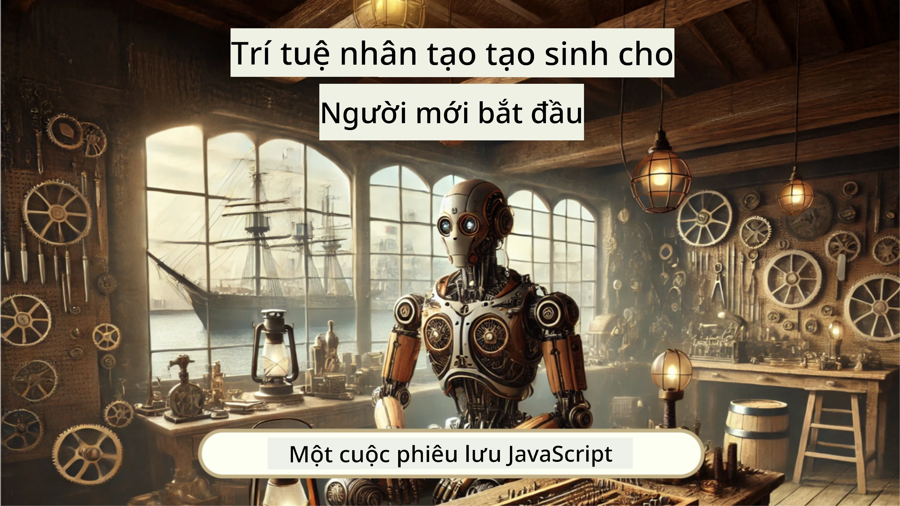
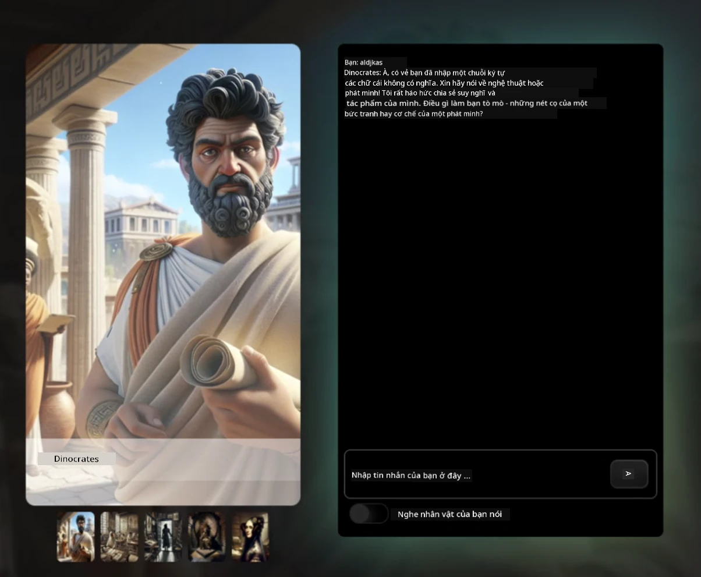
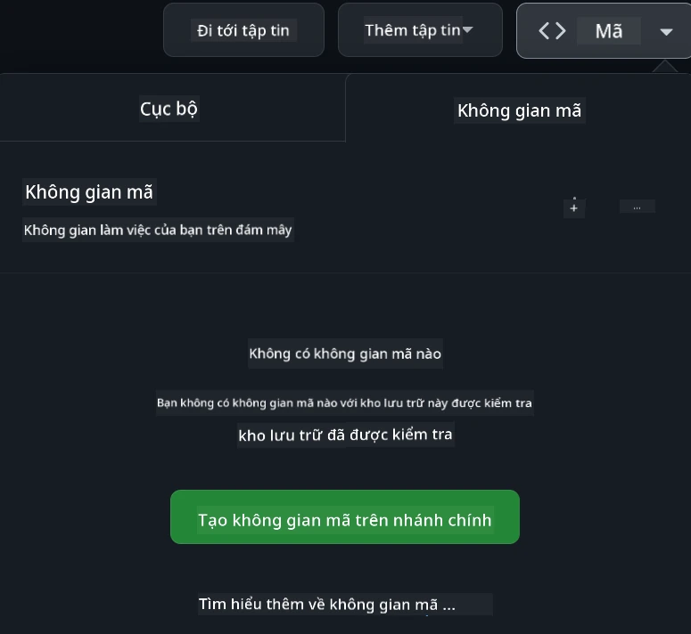

[](https://github.com/microsoft/Web-Dev-For-Beginners/blob/master/LICENSE)
[](https://GitHub.com/microsoft/Web-Dev-For-Beginners/graphs/contributors/)
[](https://GitHub.com/microsoft/Web-Dev-For-Beginners/issues/)
[](https://GitHub.com/microsoft/Web-Dev-For-Beginners/pulls/)
[](http://makeapullrequest.com) 

[](https://GitHub.com/microsoft/Web-Dev-For-Beginners/watchers/)
[](https://GitHub.com/microsoft/Web-Dev-For-Beginners/network/)
[](https://GitHub.com/microsoft/Web-Dev-For-Beginners/stargazers/)

[](https://discord.gg/nTYy5BXMWG)

# Phát Triển Web Cho Người Mới Bắt Đầu - Một Chương Trình Học

Học các kiến thức cơ bản về phát triển web với khóa học toàn diện 12 tuần do Microsoft Cloud Advocates tổ chức. Mỗi trong số 24 bài học sẽ đi sâu vào JavaScript, CSS, và HTML thông qua các dự án thực hành như terrarium, tiện ích trình duyệt và trò chơi không gian. Tham gia với các bài kiểm tra, thảo luận và bài tập thực hành. Nâng cao kỹ năng và tối ưu khả năng ghi nhớ kiến thức của bạn với phương pháp học dựa trên dự án hiệu quả của chúng tôi. Bắt đầu hành trình lập trình của bạn ngay hôm nay!

Tham gia Cộng đồng Discord Azure AI Foundry

[](https://discord.gg/nTYy5BXMWG)

Theo các bước sau để bắt đầu sử dụng tài nguyên này:
1. **Fork Repository**: Nhấp vào [](https://GitHub.com/microsoft/Web-Dev-For-Beginners/fork)
2. **Clone Repository**:   `git clone https://github.com/microsoft/Web-Dev-For-Beginners.git`
3. [**Tham gia Azure AI Foundry Discord và gặp gỡ chuyên gia cùng những nhà phát triển khác**](https://discord.com/invite/ByRwuEEgH4)

### 🌐 Hỗ trợ đa ngôn ngữ

#### Hỗ trợ qua GitHub Action (Tự động và Luôn Cập Nhật)

<!-- CO-OP TRANSLATOR LANGUAGES TABLE START -->
[Tiếng Ả Rập](../ar/README.md) | [Tiếng Bengal](../bn/README.md) | [Tiếng Bulgaria](../bg/README.md) | [Tiếng Miến Điện (Myanmar)](../my/README.md) | [Tiếng Trung (Giản thể)](../zh-CN/README.md) | [Tiếng Trung (Phồn thể, Hồng Kông)](../zh-HK/README.md) | [Tiếng Trung (Phồn thể, Macau)](../zh-MO/README.md) | [Tiếng Trung (Phồn thể, Đài Loan)](../zh-TW/README.md) | [Tiếng Croatia](../hr/README.md) | [Tiếng Séc](../cs/README.md) | [Tiếng Đan Mạch](../da/README.md) | [Tiếng Hà Lan](../nl/README.md) | [Tiếng Estonia](../et/README.md) | [Tiếng Phần Lan](../fi/README.md) | [Tiếng Pháp](../fr/README.md) | [Tiếng Đức](../de/README.md) | [Tiếng Hy Lạp](../el/README.md) | [Tiếng Do Thái](../he/README.md) | [Tiếng Hindi](../hi/README.md) | [Tiếng Hungary](../hu/README.md) | [Tiếng Indonesia](../id/README.md) | [Tiếng Ý](../it/README.md) | [Tiếng Nhật](../ja/README.md) | [Tiếng Kannada](../kn/README.md) | [Tiếng Khmer](../km/README.md) | [Tiếng Hàn](../ko/README.md) | [Tiếng Litva](../lt/README.md) | [Tiếng Mã Lai](../ms/README.md) | [Tiếng Malayalam](../ml/README.md) | [Tiếng Marathi](../mr/README.md) | [Tiếng Nepal](../ne/README.md) | [Tiếng Pidgin Nigeria](../pcm/README.md) | [Tiếng Na Uy](../no/README.md) | [Tiếng Ba Tư (Farsi)](../fa/README.md) | [Tiếng Ba Lan](../pl/README.md) | [Tiếng Bồ Đào Nha (Brazil)](../pt-BR/README.md) | [Tiếng Bồ Đào Nha (Bồ Đào Nha)](../pt-PT/README.md) | [Tiếng Punjabi (Gurmukhi)](../pa/README.md) | [Tiếng Romania](../ro/README.md) | [Tiếng Nga](../ru/README.md) | [Tiếng Serbia (Cyrillic)](../sr/README.md) | [Tiếng Slovakia](../sk/README.md) | [Tiếng Slovenia](../sl/README.md) | [Tiếng Tây Ban Nha](../es/README.md) | [Tiếng Swahili](../sw/README.md) | [Tiếng Thụy Điển](../sv/README.md) | [Tiếng Tagalog (Filipino)](../tl/README.md) | [Tiếng Tamil](../ta/README.md) | [Tiếng Telugu](../te/README.md) | [Tiếng Thái](../th/README.md) | [Tiếng Thổ Nhĩ Kỳ](../tr/README.md) | [Tiếng Ukraina](../uk/README.md) | [Tiếng Urdu](../ur/README.md) | [Tiếng Việt](./README.md)

> **Thích Clone Cục Bộ?**
>
> Repository này bao gồm hơn 50 bản dịch ngôn ngữ làm cho dung lượng tải về tăng đáng kể. Để clone mà không có bản dịch, hãy dùng sparse checkout:
>
> **Bash / macOS / Linux:**
> ```bash
> git clone --filter=blob:none --sparse https://github.com/microsoft/Web-Dev-For-Beginners.git
> cd Web-Dev-For-Beginners
> git sparse-checkout set --no-cone '/*' '!translations' '!translated_images'
> ```
>
> **CMD (Windows):**
> ```cmd
> git clone --filter=blob:none --sparse https://github.com/microsoft/Web-Dev-For-Beginners.git
> cd Web-Dev-For-Beginners
> git sparse-checkout set --no-cone "/*" "!translations" "!translated_images"
> ```
>
> Điều này cung cấp cho bạn mọi thứ bạn cần để hoàn tất khóa học với tốc độ tải nhanh hơn nhiều.
<!-- CO-OP TRANSLATOR LANGUAGES TABLE END -->

**Nếu bạn muốn có thêm ngôn ngữ dịch hỗ trợ được liệt kê [ở đây](https://github.com/Azure/co-op-translator/blob/main/getting_started/supported-languages.md)**

[](https://open.vscode.dev/microsoft/Web-Dev-For-Beginners)

#### 🧑‍🎓 _Bạn là sinh viên?_

Truy cập [**trang Student Hub**](https://docs.microsoft.com/learn/student-hub/?WT.mc_id=academic-77807-sagibbon) nơi bạn sẽ tìm thấy tài nguyên cho người mới bắt đầu, bộ dụng cụ học sinh và thậm chí cả cách nhận phiếu chứng nhận miễn phí. Đây là trang bạn nên đánh dấu và kiểm tra định kỳ khi chúng tôi thay đổi nội dung hàng tháng.

### 📣 Thông báo - Thử thách mới Chế độ GitHub Copilot Agent để hoàn thành!

Thử thách mới được thêm vào, hãy tìm "GitHub Copilot Agent Challenge 🚀" trong hầu hết các chương. Đây là thử thách mới để bạn hoàn thành bằng cách sử dụng GitHub Copilot và Chế độ Agent. Nếu bạn chưa từng dùng Chế độ Agent trước đây, nó không chỉ tạo văn bản mà còn có thể tạo và chỉnh sửa tệp, chạy lệnh và hơn thế nữa.

### 📣 Thông báo - _Dự án mới xây dựng sử dụng AI Tạo Tác_

Dự án trợ lý AI mới vừa được thêm, xem tại [dự án](./9-chat-project/README.md)

### 📣 Thông báo - _Chương Trình Mới_ về AI Tạo Tác cho JavaScript vừa được phát hành

Đừng bỏ lỡ chương trình AI Tạo Tác mới của chúng tôi!

Truy cập [https://aka.ms/genai-js-course](https://aka.ms/genai-js-course) để bắt đầu!



- Các bài học bao gồm từ căn bản đến RAG.
- Tương tác với các nhân vật lịch sử qua GenAI và ứng dụng đồng hành của chúng tôi.
- Câu chuyện hấp dẫn và vui nhộn, bạn sẽ được du hành thời gian!



Mỗi bài học bao gồm một bài tập để hoàn thành, một bài kiểm tra kiến thức và một thử thách để hướng dẫn bạn học các chủ đề như:
- Đặt câu lệnh và kỹ thuật thiết kế câu lệnh
- Tạo ứng dụng văn bản và hình ảnh
- Ứng dụng tìm kiếm

Truy cập [https://aka.ms/genai-js-course](https://aka.ms/genai-js-course) để bắt đầu!


## 🌱 Bắt Đầu

> **Giáo viên**, chúng tôi đã [bao gồm một số đề xuất](for-teachers.md) về cách sử dụng chương trình học này. Chúng tôi rất mong nhận phản hồi từ bạn [trong diễn đàn thảo luận của chúng tôi](https://github.com/microsoft/Web-Dev-For-Beginners/discussions/categories/teacher-corner)!

**[Người học](https://aka.ms/student-page/?WT.mc_id=academic-77807-sagibbon)**, với mỗi bài học, bắt đầu với bài kiểm tra trước giờ học và tiếp tục với việc đọc tài liệu bài giảng, hoàn thành các hoạt động khác nhau và kiểm tra hiểu biết của bạn bằng bài kiểm tra sau giờ học.

Để nâng cao trải nghiệm học tập, hãy kết nối với bạn bè cùng học để làm dự án cùng nhau! Việc thảo luận được khuyến khích trong [diễn đàn thảo luận](https://github.com/microsoft/Web-Dev-For-Beginners/discussions) nơi nhóm điều phối viên của chúng tôi sẽ có mặt để trả lời câu hỏi của bạn.

Để mở rộng kiến thức, chúng tôi rất khuyên bạn khám phá [Microsoft Learn](https://learn.microsoft.com/users/wirelesslife/collections/p1ddcy5jwy0jkm?WT.mc_id=academic-77807-sagibbon) để có thêm tài liệu học.

### 📋 Thiết lập môi trường của bạn

Chương trình này có một môi trường phát triển sẵn sàng để dùng! Khi bắt đầu, bạn có thể chọn chạy chương trình trong [Codespace](https://github.com/features/codespaces/) (_một môi trường dựa trên trình duyệt, không cần cài đặt_), hoặc trên máy tính của bạn bằng một trình chỉnh sửa văn bản như [Visual Studio Code](https://code.visualstudio.com/?WT.mc_id=academic-77807-sagibbon).

#### Tạo repository của bạn
Để bạn dễ dàng lưu công việc, nên tạo bản sao repository này cho riêng bạn. Bạn có thể làm điều này bằng cách nhấp nút **Use this template** ở đầu trang. Điều này sẽ tạo một repository mới trong tài khoản GitHub của bạn với bản sao chương trình học.

Thực hiện theo các bước:
1. **Fork Repository**: Nhấp vào nút "Fork" ở góc trên bên phải của trang này.
2. **Clone Repository**:   `git clone https://github.com/microsoft/Web-Dev-For-Beginners.git`

#### Chạy chương trình trong Codespace

Trong bản sao repository bạn tạo, nhấp nút **Code** và chọn **Open with Codespaces**. Điều này sẽ tạo một Codespace mới cho bạn làm việc.



#### Chạy chương trình trên máy tính của bạn

Để chạy chương trình này trên máy tính của bạn, bạn sẽ cần một trình chỉnh sửa văn bản, một trình duyệt và một công cụ dòng lệnh. Bài học đầu tiên của chúng tôi, [Giới thiệu về Ngôn Ngữ Lập Trình và Công Cụ Phát Triển](../../1-getting-started-lessons/1-intro-to-programming-languages), sẽ hướng dẫn bạn qua các lựa chọn khác nhau cho mỗi công cụ để bạn có thể chọn cái phù hợp nhất.

Khuyến nghị của chúng tôi là sử dụng [Visual Studio Code](https://code.visualstudio.com/?WT.mc_id=academic-77807-sagibbon) làm trình soạn thảo, nó cũng có [Terminal](https://code.visualstudio.com/docs/terminal/basics/?WT.mc_id=academic-77807-sagibbon) tích hợp sẵn. Bạn có thể tải Visual Studio Code [tại đây](https://code.visualstudio.com/?WT.mc_id=academic-77807-sagibbon).
1. Sao chép kho lưu trữ của bạn về máy tính. Bạn có thể làm điều này bằng cách nhấn nút **Code** và sao chép URL:

    [CodeSpace](./images/createcodespace.png)

    Sau đó, mở [Terminal](https://code.visualstudio.com/docs/terminal/basics/?WT.mc_id=academic-77807-sagibbon) trong [Visual Studio Code](https://code.visualstudio.com/?WT.mc_id=academic-77807-sagibbon) và chạy lệnh sau, thay thế `<your-repository-url>` bằng URL bạn vừa sao chép:

    ```bash 
    git clone <your-repository-url>
    ```

2. Mở thư mục trong Visual Studio Code. Bạn có thể làm điều này bằng cách nhấn **File** > **Open Folder** và chọn thư mục bạn vừa sao chép.


>  Các tiện ích mở rộng Visual Studio Code được khuyên dùng:
>
> * [Live Server](https://marketplace.visualstudio.com/items?itemName=ritwickdey.LiveServer&WT.mc_id=academic-77807-sagibbon) - để xem trước các trang HTML trong Visual Studio Code
> * [Copilot](https://marketplace.visualstudio.com/items?itemName=GitHub.copilot&WT.mc_id=academic-77807-sagibbon) - giúp bạn viết mã nhanh hơn

## 📂 Mỗi bài học bao gồm:

- bản ghi chú vẽ tay tùy chọn
- video bổ trợ tùy chọn
- bài kiểm tra khởi động trước bài học
- bài học viết
- với bài học dự án, hướng dẫn từng bước để xây dựng dự án
- kiểm tra kiến thức
- một thử thách
- đọc thêm bổ trợ
- bài tập
- [bài kiểm tra sau bài học](https://ff-quizzes.netlify.app/web/)

> **Lưu ý về các bài kiểm tra**: Tất cả các bài kiểm tra đều được chứa trong thư mục Quiz-app, tổng cộng 48 bài kiểm tra với mỗi bài 3 câu hỏi. Chúng có sẵn [ở đây](https://ff-quizzes.netlify.app/web/) ứng dụng kiểm tra có thể chạy cục bộ hoặc được triển khai lên Azure; hãy làm theo hướng dẫn trong thư mục `quiz-app`.

## 🗃️ Các bài học

|     |                       Tên Dự Án                        |                          Các Khái Niệm Được Giảng Dạy                           | Mục Tiêu Học Tập                                                                                                                  |                                                         Bài Học Liên Quan                                                          |         Tác Giả         |
| :-: | :----------------------------------------------------: | :--------------------------------------------------------------------------: | --------------------------------------------------------------------------------------------------------------------------------- | :----------------------------------------------------------------------------------------------------------------------------: | :---------------------: |
| 01  |                     Bắt Đầu                           |          Giới thiệu về Lập trình và Công cụ chuyên môn          | Tìm hiểu cơ bản về nền tảng của hầu hết ngôn ngữ lập trình và về phần mềm hỗ trợ các nhà phát triển chuyên nghiệp                 | [Giới thiệu về Ngôn ngữ Lập trình và Công cụ chuyên môn](./1-getting-started-lessons/1-intro-to-programming-languages/README.md) |         Jasmine         |
| 02  |                     Bắt Đầu                           |             Kiến thức cơ bản về GitHub, làm việc theo nhóm            | Cách sử dụng GitHub trong dự án, cách cộng tác với những người khác trên cùng mã nguồn                                            |                            [Giới thiệu về GitHub](./1-getting-started-lessons/2-github-basics/README.md)                             |          Floor          |
| 03  |                     Bắt Đầu                           |                             Khả năng tiếp cận                              | Tìm hiểu cơ bản về khả năng tiếp cận web                                                                                         |                       [Kiến thức cơ bản về Khả năng tiếp cận](./1-getting-started-lessons/3-accessibility/README.md)                |       Christopher       |
| 04  |                        JS Cơ Bản                      |                         Các kiểu dữ liệu trong JavaScript                | Những kiến thức cơ bản về các kiểu dữ liệu trong JavaScript                                                                        |                                       [Kiểu Dữ liệu](./2-js-basics/1-data-types/README.md)                                        |         Jasmine         |
| 05  |                        JS Cơ Bản                      |                         Hàm và Phương thức                             | Tìm hiểu về hàm và phương thức để quản lý luồng logic của ứng dụng                                                                |                              [Hàm và Phương thức](./2-js-basics/2-functions-methods/README.md)                               | Jasmine và Christopher  |
| 06  |                        JS Cơ Bản                      |                        Quyết định với JS                                | Tìm hiểu cách tạo điều kiện trong mã bằng các phương pháp ra quyết định                                                            |                                 [Ra Quyết Định](./2-js-basics/3-making-decisions/README.md)                                  |         Jasmine         |
| 07  |                        JS Cơ Bản                      |                            Mảng và Vòng lặp                             | Làm việc với dữ liệu sử dụng mảng và vòng lặp trong JavaScript                                                                    |                                   [Mảng và Vòng lặp](./2-js-basics/4-arrays-loops/README.md)                                    |         Jasmine         |
| 08  |       [Terrarium](./3-terrarium/solution/README.md)  |                            Thực hành HTML                               | Xây dựng HTML để tạo terrarium trực tuyến, tập trung vào xây dựng bố cục                                                         |                                 [Giới thiệu về HTML](./3-terrarium/1-intro-to-html/README.md)                                 |           Jen           |
| 09  |       [Terrarium](./3-terrarium/solution/README.md)  |                            Thực hành CSS                                | Xây dựng CSS để tạo kiểu cho terrarium trực tuyến, tập trung vào những kiến thức cơ bản về CSS bao gồm làm cho trang hiển thị responsive |                                  [Giới thiệu về CSS](./3-terrarium/2-intro-to-css/README.md)                                  |           Jen           |
| 10  |            [Terrarium](./3-terrarium/solution/README.md)           |               Đóng gói JavaScript, thao tác DOM                         | Xây dựng JavaScript để làm terrarium hoạt động như một giao diện kéo/thả, tập trung vào sử dụng closures và thao tác DOM          |                  [Closures trong JavaScript, thao tác DOM](./3-terrarium/3-intro-to-DOM-and-closures/README.md)                   |           Jen           |
| 11  |          [Typing Game](./4-typing-game/solution/README.md)          |                          Xây dựng trò chơi đánh máy                    | Tìm hiểu cách sử dụng sự kiện bàn phím để điều khiển logic trong ứng dụng JavaScript của bạn                                         |                                [Lập trình theo sự kiện](./4-typing-game/typing-game/README.md)                                |       Christopher       |
| 12  | [Green Browser Extension](./5-browser-extension/solution/README.md) |                         Làm việc với trình duyệt                       | Tìm hiểu cách hoạt động của trình duyệt, lịch sử của chúng và cách tạo các phần tử đầu tiên của tiện ích mở rộng trình duyệt      |                               [Về trình duyệt](./5-browser-extension/1-about-browsers/README.md)                                |           Jen           |
| 13  | [Green Browser Extension](./5-browser-extension/solution/README.md) | Xây dựng form, gọi API và lưu biến trong bộ nhớ cục bộ                 | Xây dựng các phần tử JavaScript của tiện ích mở rộng trình duyệt để gọi API sử dụng biến được lưu trong bộ nhớ cục bộ             |                [API, Form và Bộ nhớ cục bộ](./5-browser-extension/2-forms-browsers-local-storage/README.md)                 |           Jen           |
| 14  | [Green Browser Extension](./5-browser-extension/solution/README.md) |          Tiến trình nền trong trình duyệt, hiệu năng web              | Sử dụng tiến trình nền của trình duyệt để quản lý biểu tượng tiện ích; tìm hiểu về hiệu năng web và một số tối ưu hóa             |             [Tiến trình nền và Hiệu năng](./5-browser-extension/3-background-tasks-and-performance/README.md)              |           Jen           |
| 15  |           [Space Game](./6-space-game/solution/README.md)           |             Phát triển game nâng cao với JavaScript                    | Tìm hiểu về Kế thừa sử dụng cả Lớp và Thành phần cũng như mẫu Pub/Sub, chuẩn bị cho việc xây dựng game                            |                      [Giới thiệu về Phát triển Game Nâng cao](./6-space-game/1-introduction/README.md)                       |          Chris          |
| 16  |           [Space Game](./6-space-game/solution/README.md)           |                           Vẽ trên canvas                               | Tìm hiểu về Canvas API, dùng để vẽ các phần tử lên màn hình                                                                       |                                [Vẽ trên Canvas](./6-space-game/2-drawing-to-canvas/README.md)                                |          Chris          |
| 17  |           [Space Game](./6-space-game/solution/README.md)           |                  Di chuyển các phần tử trên màn hình                    | Khám phá cách các phần tử có thể chuyển động sử dụng tọa độ Descartes và Canvas API                                               |                           [Di chuyển các phần tử](./6-space-game/3-moving-elements-around/README.md)                           |          Chris          |
| 18  |           [Space Game](./6-space-game/solution/README.md)           |                         Phát hiện va chạm                              | Làm cho các phần tử va chạm và phản ứng với nhau bằng các phím nhấn, đồng thời cung cấp hàm cooldown để đảm bảo hiệu năng game  |                              [Phát hiện Va chạm](./6-space-game/4-collision-detection/README.md)                              |          Chris          |
| 19  |           [Space Game](./6-space-game/solution/README.md)           |                            Giữ điểm số                                | Thực hiện các phép tính toán dựa trên trạng thái và hiệu suất của game                                                            |                                    [Giữ điểm số](./6-space-game/5-keeping-score/README.md)                                    |          Chris          |
| 20  |           [Space Game](./6-space-game/solution/README.md)           |                   Kết thúc và khởi động lại game                      | Tìm hiểu về cách kết thúc và khởi động lại game, bao gồm dọn dẹp tài nguyên và đặt lại giá trị các biến                           |                                [Điều kiện kết thúc](./6-space-game/6-end-condition/README.md)                                 |          Chris          |
| 21  |         [Banking App](./7-bank-project/solution/README.md)          |                  Mẫu HTML và Định tuyến trong Ứng dụng Web           | Tìm hiểu cách tạo bộ khung kiến trúc website đa trang sử dụng định tuyến và mẫu HTML                                             |                            [Mẫu HTML và Định tuyến](./7-bank-project/1-template-route/README.md)                             |          Yohan          |
| 22  |         [Banking App](./7-bank-project/solution/README.md)          |                  Xây dựng Form Đăng nhập và Đăng ký                   | Tìm hiểu về xây dựng form và xử lý các quy trình xác thực                                                                        |                                           [Form](./7-bank-project/2-forms/README.md)                                           |          Yohan          |
| 23  |         [Banking App](./7-bank-project/solution/README.md)          |               Phương pháp lấy và sử dụng dữ liệu                      | Cách dữ liệu chảy vào và ra ứng dụng, cách lấy dữ liệu, lưu trữ và loại bỏ dữ liệu                                               |                                            [Dữ liệu](./7-bank-project/3-data/README.md)                                            |          Yohan          |
| 24  |         [Banking App](./7-bank-project/solution/README.md)          |                       Khái niệm Quản lý Trạng thái                    | Tìm hiểu cách ứng dụng giữ trạng thái và cách quản lý bằng lập trình                                                             |                                [Quản lý Trạng thái](./7-bank-project/4-state-management/README.md)                                |          Yohan          |
| 25 | [Browser/VScode Code](../../8-code-editor) | Làm việc với VScode | Tìm hiểu cách sử dụng trình soạn thảo mã | [Sử dụng Trình soạn thảo VScode](./8-code-editor/1-using-a-code-editor/README.md) | Chris |
| 26 | [AI Assistants](./9-chat-project/README.md) | Làm việc với AI | Tìm hiểu cách xây dựng trợ lý AI của riêng bạn | [Dự án Trợ lý AI](./9-chat-project/README.md) | Chris |

## 🏫 Phương pháp giảng dạy

Chương trình học được thiết kế dựa trên hai nguyên tắc sư phạm chính:
* học qua dự án
* các bài kiểm tra thường xuyên

Chương trình giảng dạy dạy các kiến thức nền tảng của JavaScript, HTML, và CSS, cũng như các công cụ và kỹ thuật mới nhất mà các nhà phát triển web hiện nay sử dụng. Học viên sẽ có cơ hội phát triển kinh nghiệm thực hành bằng cách xây dựng một trò chơi đánh máy, terrarium ảo, tiện ích mở rộng trình duyệt thân thiện với môi trường, trò chơi kiểu space-invader, và một ứng dụng ngân hàng cho doanh nghiệp. Cuối chuỗi bài học, học viên sẽ nắm vững kiến thức về phát triển web.

> 🎓 Bạn có thể học các bài học đầu tiên trong chương trình học này như một [Lộ trình Học](https://docs.microsoft.com/learn/paths/web-development-101/?WT.mc_id=academic-77807-sagibbon) trên Microsoft Learn!

Bằng cách đảm bảo nội dung phù hợp với các dự án, quá trình học trở nên thú vị hơn với học viên và tăng cường việc ghi nhớ các khái niệm. Chúng tôi cũng đã viết một số bài học khởi đầu về các kiến thức cơ bản JavaScript để giới thiệu các khái niệm, kèm theo một video trong bộ sưu tập "[Beginners Series to: JavaScript](https://channel9.msdn.com/Series/Beginners-Series-to-JavaScript/?WT.mc_id=academic-77807-sagibbon)", một số tác giả của video góp phần xây dựng chương trình này.

Ngoài ra, một bài kiểm tra nhẹ nhàng trước lớp giúp học viên xác định mục tiêu học tập chủ đề, trong khi bài kiểm tra thứ hai sau lớp giúp củng cố kiến thức. Chương trình này được thiết kế linh hoạt và vui nhộn, có thể học toàn bộ hoặc một phần. Các dự án bắt đầu đơn giản và ngày càng phức tạp hơn sau 12 tuần học.

Mặc dù chúng tôi cố tình tránh giới thiệu các framework JavaScript để tập trung vào kỹ năng cơ bản cần thiết cho lập trình viên web trước khi chuyển sang học framework, bước tiếp theo tốt để hoàn thành chương trình này là học về Node.js qua bộ video khác: "[Beginner Series to: Node.js](https://channel9.msdn.com/Series/Beginners-Series-to-Nodejs/?WT.mc_id=academic-77807-sagibbon)".

> Hãy tham khảo [Quy tắc ứng xử](CODE_OF_CONDUCT.md) và [Đóng góp](CONTRIBUTING.md) của chúng tôi. Chúng tôi hoan nghênh những góp ý xây dựng của bạn!


## 🧭 Truy cập ngoài mạng

Bạn có thể chạy tài liệu này ngoại tuyến bằng cách sử dụng [Docsify](https://docsify.js.org/#/). Tạo nhánh (fork) kho này, [cài đặt Docsify](https://docsify.js.org/#/quickstart) trên máy cục bộ, và sau đó trong thư mục gốc của kho này, gõ `docsify serve`. Trang web sẽ được phục vụ trên cổng 3000 tại localhost của bạn: `localhost:3000`.

## 📘 PDF
Một tệp PDF của tất cả các bài học có thể được tìm thấy [ở đây](https://microsoft.github.io/Web-Dev-For-Beginners/pdf/readme.pdf).


## 🎒 Các Khóa Học Khác

Nhóm của chúng tôi sản xuất các khóa học khác! Hãy xem qua:

<!-- CO-OP TRANSLATOR OTHER COURSES START -->
### LangChain
[](https://aka.ms/langchain4j-for-beginners)
[](https://aka.ms/langchainjs-for-beginners?WT.mc_id=m365-94501-dwahlin)
[](https://github.com/microsoft/langchain-for-beginners?WT.mc_id=m365-94501-dwahlin)
---

### Azure / Edge / MCP / Agents
[](https://github.com/microsoft/AZD-for-beginners?WT.mc_id=academic-105485-koreyst)
[](https://github.com/microsoft/edgeai-for-beginners?WT.mc_id=academic-105485-koreyst)
[](https://github.com/microsoft/mcp-for-beginners?WT.mc_id=academic-105485-koreyst)
[](https://github.com/microsoft/ai-agents-for-beginners?WT.mc_id=academic-105485-koreyst)

---
 
### Dòng AI Tạo Sinh
[](https://github.com/microsoft/generative-ai-for-beginners?WT.mc_id=academic-105485-koreyst)
[-9333EA?style=for-the-badge&labelColor=E5E7EB&color=9333EA)](https://github.com/microsoft/Generative-AI-for-beginners-dotnet?WT.mc_id=academic-105485-koreyst)
[-C084FC?style=for-the-badge&labelColor=E5E7EB&color=C084FC)](https://github.com/microsoft/generative-ai-for-beginners-java?WT.mc_id=academic-105485-koreyst)
[-E879F9?style=for-the-badge&labelColor=E5E7EB&color=E879F9)](https://github.com/microsoft/generative-ai-with-javascript?WT.mc_id=academic-105485-koreyst)

---
 
### Học Tập Cốt Lõi
[](https://aka.ms/ml-beginners?WT.mc_id=academic-105485-koreyst)
[](https://aka.ms/datascience-beginners?WT.mc_id=academic-105485-koreyst)
[](https://aka.ms/ai-beginners?WT.mc_id=academic-105485-koreyst)
[](https://github.com/microsoft/Security-101?WT.mc_id=academic-96948-sayoung)
[](https://aka.ms/webdev-beginners?WT.mc_id=academic-105485-koreyst)
[](https://aka.ms/iot-beginners?WT.mc_id=academic-105485-koreyst)
[](https://github.com/microsoft/xr-development-for-beginners?WT.mc_id=academic-105485-koreyst)

---
 
### Dòng Copilot
[](https://aka.ms/GitHubCopilotAI?WT.mc_id=academic-105485-koreyst)
[](https://github.com/microsoft/mastering-github-copilot-for-dotnet-csharp-developers?WT.mc_id=academic-105485-koreyst)
[](https://github.com/microsoft/CopilotAdventures?WT.mc_id=academic-105485-koreyst)
<!-- CO-OP TRANSLATOR OTHER COURSES END -->

## Nhận Trợ Giúp

Nếu bạn bị mắc kẹt hoặc có bất kỳ câu hỏi nào về việc xây dựng ứng dụng AI. Hãy tham gia cùng các học viên khác và các nhà phát triển có kinh nghiệm trong các cuộc thảo luận về MCP. Đây là một cộng đồng hỗ trợ nơi các câu hỏi được chào đón và kiến thức được chia sẻ một cách tự do.

[](https://discord.gg/nTYy5BXMWG)

Nếu bạn có phản hồi sản phẩm hoặc lỗi trong quá trình xây dựng, hãy truy cập:

[](https://aka.ms/foundry/forum)

## Giấy Phép

Kho lưu trữ này được cấp phép theo giấy phép MIT. Xem tệp [LICENSE](../../LICENSE) để biết thêm thông tin.

---

<!-- CO-OP TRANSLATOR DISCLAIMER START -->
**Tuyên bố từ chối trách nhiệm**:  
Tài liệu này đã được dịch bằng dịch vụ dịch thuật AI [Co-op Translator](https://github.com/Azure/co-op-translator). Mặc dù chúng tôi nỗ lực đảm bảo độ chính xác, xin lưu ý rằng bản dịch tự động có thể chứa lỗi hoặc không chính xác. Tài liệu gốc bằng ngôn ngữ mẹ đẻ nên được xem là nguồn tham khảo chính xác nhất. Đối với thông tin quan trọng, nên sử dụng dịch vụ dịch thuật chuyên nghiệp bởi con người. Chúng tôi không chịu trách nhiệm về bất kỳ sự hiểu nhầm hay giải thích sai nào phát sinh từ việc sử dụng bản dịch này.
<!-- CO-OP TRANSLATOR DISCLAIMER END -->