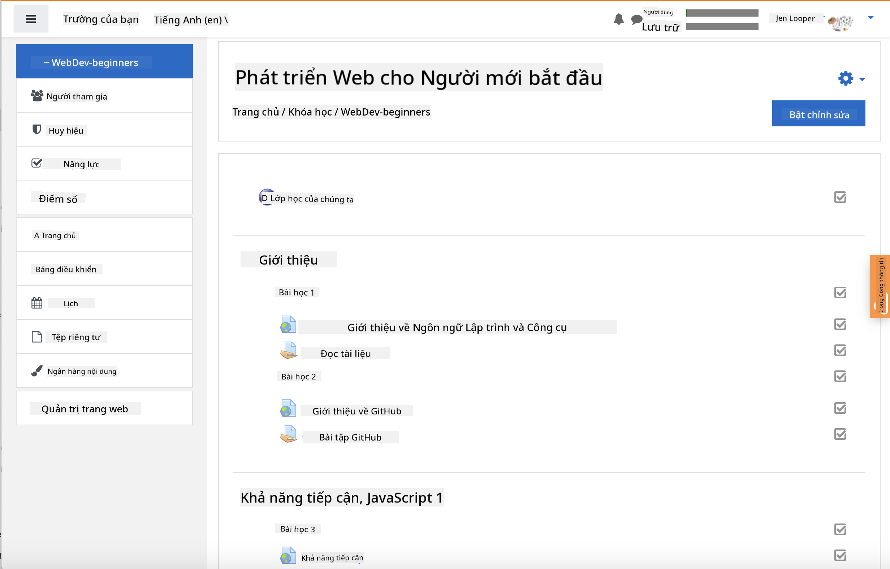
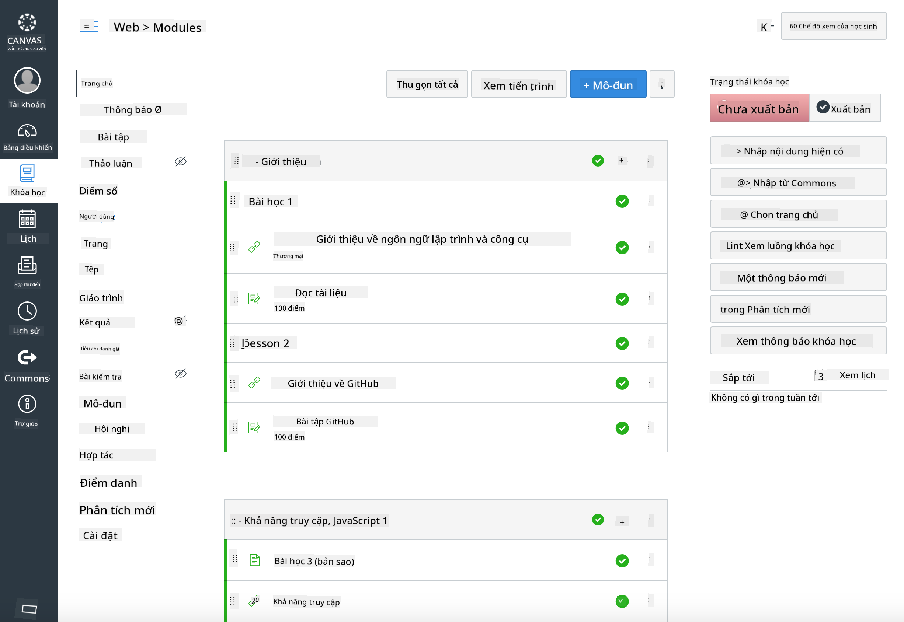

<!--
CO_OP_TRANSLATOR_METADATA:
{
  "original_hash": "75cb51f7ca9ea0b097ef4a1287e9290c",
  "translation_date": "2025-08-27T21:59:19+00:00",
  "source_file": "for-teachers.md",
  "language_code": "vi"
}
-->
## Dành cho giáo viên

Bạn có muốn sử dụng chương trình học này trong lớp học của mình không? Hãy thoải mái sử dụng nhé!

Thực tế, bạn có thể sử dụng nó ngay trên GitHub bằng cách sử dụng GitHub Classroom.

Để làm điều đó, hãy fork repo này. Bạn sẽ cần tạo một repo cho mỗi bài học, vì vậy bạn sẽ cần tách từng thư mục thành một repo riêng biệt. Bằng cách đó, [GitHub Classroom](https://classroom.github.com/classrooms) có thể nhận từng bài học một cách riêng biệt.

Những [hướng dẫn đầy đủ](https://github.blog/2020-03-18-set-up-your-digital-classroom-with-github-classroom/) này sẽ giúp bạn hình dung cách thiết lập lớp học của mình.

## Sử dụng trong Moodle, Canvas hoặc Blackboard

Chương trình học này hoạt động tốt trên các hệ thống quản lý học tập này! Sử dụng [tệp tải lên Moodle](../../../../../../../teaching-files/webdev-moodle.mbz) để có toàn bộ nội dung, hoặc thử [tệp Common Cartridge](../../../../../../../teaching-files/webdev-common-cartridge.imscc) chứa một phần nội dung. Moodle Cloud không hỗ trợ xuất khẩu đầy đủ Common Cartridge, vì vậy tốt hơn là sử dụng tệp tải xuống Moodle, tệp này có thể được tải lên Canvas. Vui lòng cho chúng tôi biết cách chúng tôi có thể cải thiện trải nghiệm này.

> Chương trình học trong lớp học Moodle

> Chương trình học trong Canvas

## Sử dụng repo như hiện tại

Nếu bạn muốn sử dụng repo này như hiện tại, mà không cần sử dụng GitHub Classroom, điều đó cũng có thể thực hiện được. Bạn sẽ cần giao tiếp với học sinh để cùng nhau làm bài học nào.

Trong hình thức trực tuyến (Zoom, Teams, hoặc các nền tảng khác), bạn có thể tạo các phòng thảo luận nhỏ cho các bài kiểm tra, và hướng dẫn học sinh để giúp họ sẵn sàng học tập. Sau đó mời học sinh tham gia các bài kiểm tra và nộp câu trả lời của họ dưới dạng 'issues' vào một thời điểm nhất định. Bạn cũng có thể làm tương tự với các bài tập nếu muốn học sinh làm việc cùng nhau một cách công khai.

Nếu bạn thích hình thức riêng tư hơn, hãy yêu cầu học sinh fork chương trình học, từng bài học một, vào các repo GitHub riêng tư của họ, và cấp quyền truy cập cho bạn. Sau đó, họ có thể hoàn thành các bài kiểm tra và bài tập một cách riêng tư và gửi cho bạn thông qua issues trên repo lớp học của bạn.

Có rất nhiều cách để làm cho điều này hoạt động trong hình thức lớp học trực tuyến. Vui lòng cho chúng tôi biết cách nào phù hợp nhất với bạn!

## Hãy cho chúng tôi ý kiến của bạn!

Chúng tôi muốn làm cho chương trình học này phù hợp với bạn và học sinh của bạn. Kết nối với chúng tôi tại [Teacher corner](https://github.com/microsoft/Web-Dev-For-Beginners/discussions/categories/teacher-corner) và mở một [**issue mới**](https://github.com/microsoft/Web-Dev-For-Beginners/issues/new/choose) để gửi yêu cầu, báo lỗi và phản hồi.

---

**Tuyên bố miễn trừ trách nhiệm**:  
Tài liệu này đã được dịch bằng dịch vụ dịch thuật AI [Co-op Translator](https://github.com/Azure/co-op-translator). Mặc dù chúng tôi cố gắng đảm bảo độ chính xác, xin lưu ý rằng các bản dịch tự động có thể chứa lỗi hoặc không chính xác. Tài liệu gốc bằng ngôn ngữ bản địa nên được coi là nguồn thông tin chính thức. Đối với các thông tin quan trọng, khuyến nghị sử dụng dịch vụ dịch thuật chuyên nghiệp bởi con người. Chúng tôi không chịu trách nhiệm cho bất kỳ sự hiểu lầm hoặc diễn giải sai nào phát sinh từ việc sử dụng bản dịch này.