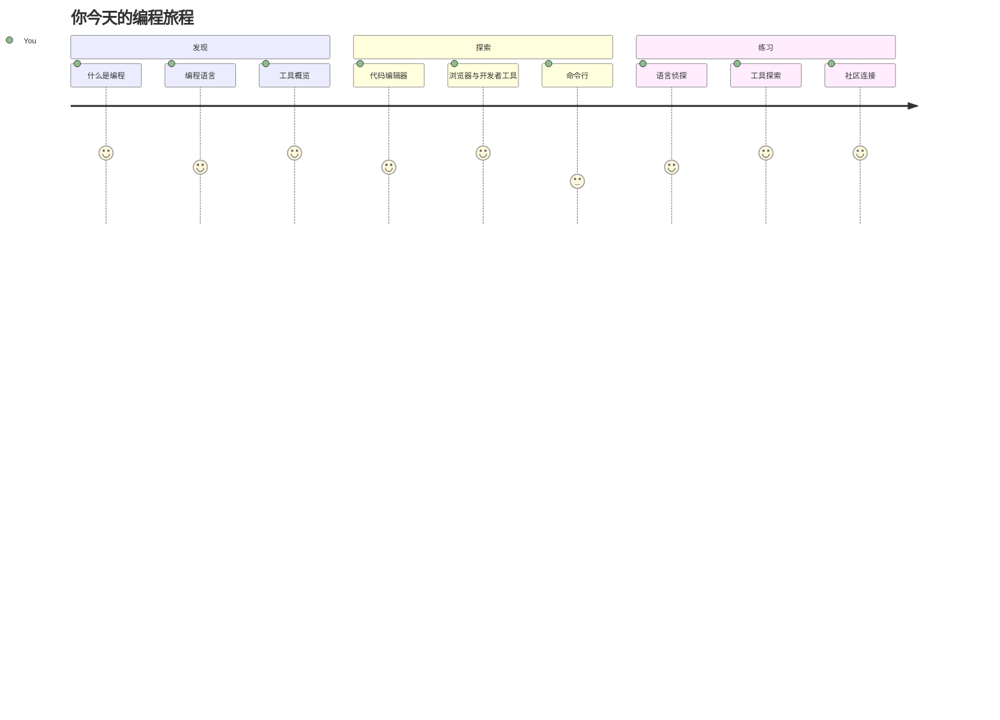
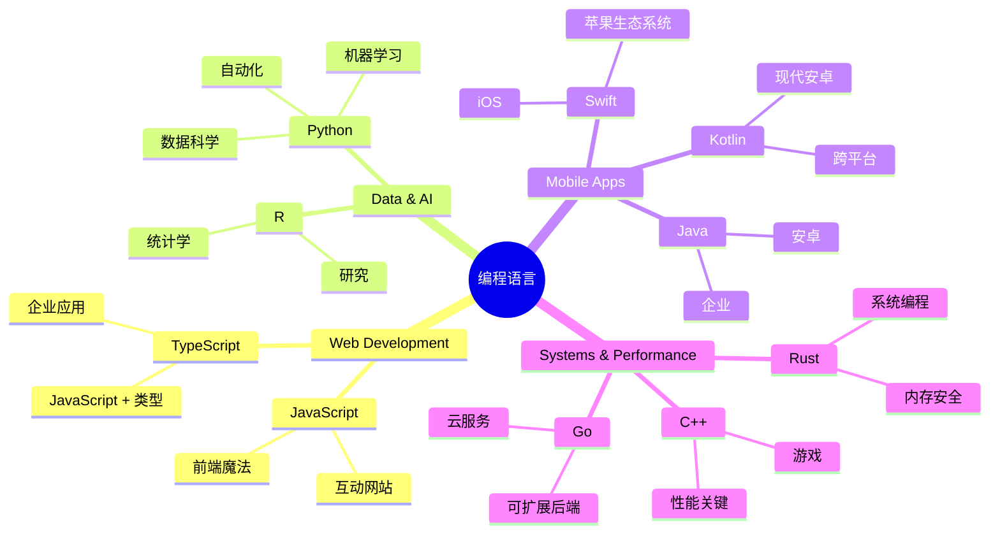
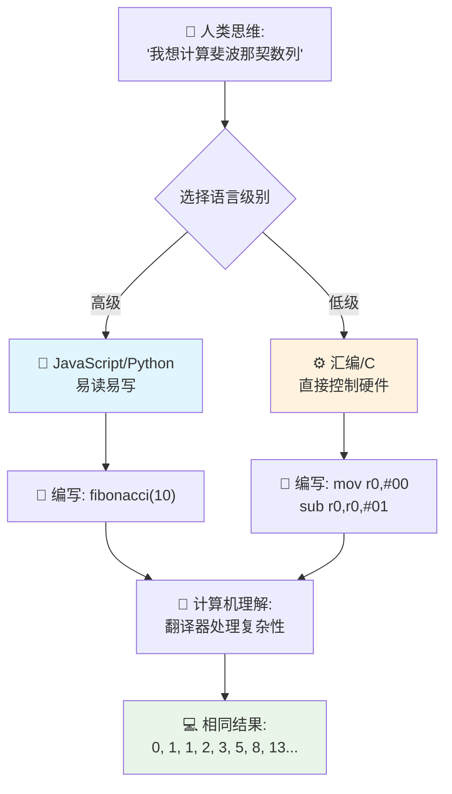
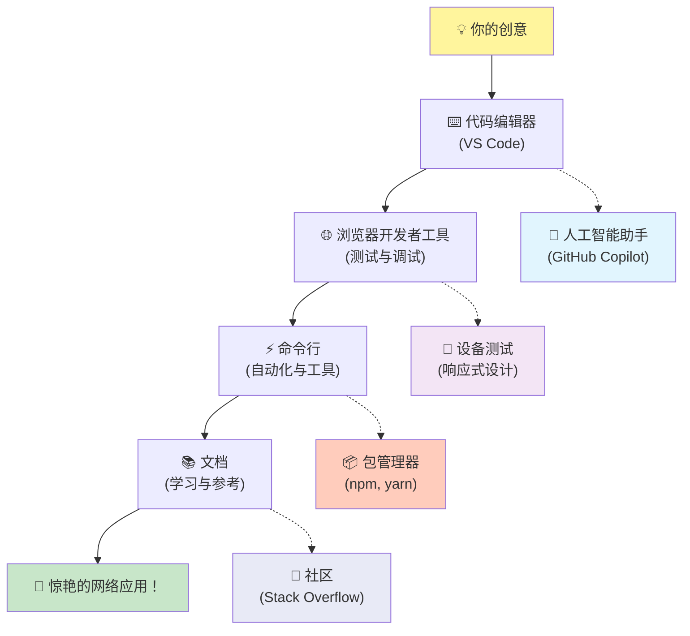
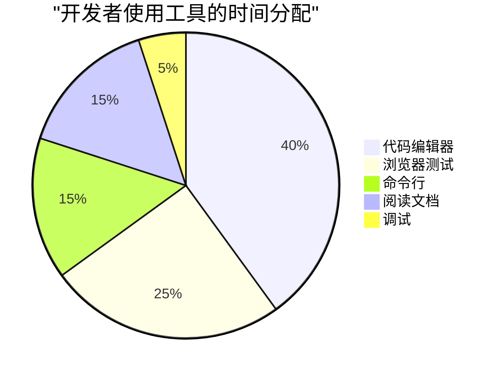
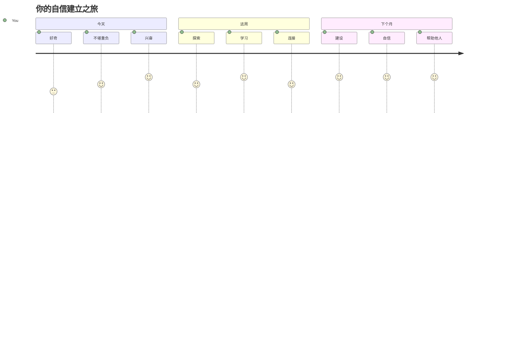

# 编程语言与现代开发工具简介

嗨，未来的开发者！👋 我可以告诉你一件每天都让我激动不已的事吗？你即将发现，编程不只是关于计算机——它是拥有实际超能力，将你最狂野的想法变为现实的能力！

你知道那种时刻吗？当你使用你最喜欢的应用，所有东西恰到好处地运作起来？当你点击一个按钮，发生了某种完全神奇的事情，让你不禁惊呼“哇，他们是怎么做到的？”嗯，正是像你一样的某个人——可能深夜两点坐在他最爱咖啡馆，喝着第三杯浓缩咖啡——写下了创造那魔法的代码。最让你惊讶的是：到本课结束时，你不仅会理解他们是如何做到的，还会迫不及待想自己试一试！

听着，如果现在觉得编程有点吓人，我完全理解。我刚开始学习时，真的以为你得是数学天才，或者从五岁就开始写代码。但彻底改变我看法的是：编程就像学习用新语言对话。你从“你好”和“谢谢”学起，然后慢慢学会点咖啡，过不了多久，你就能进行深刻的哲学讨论！不过这里，你是在跟计算机对话，说实话？它们是你见过最有耐心的对话伙伴——从不因为你的错误而评判你，总是乐意再试一次！

今天，我们将探索那些让现代网页开发不仅可能还极其上瘾的神奇工具。我说的正是 Netflix、Spotify 以及你最喜欢的独立应用工作室的开发者们每天使用的编辑器、浏览器和工作流。这里有个让你忍不住开心跳舞的部分：大部分这些专业级、行业标准的工具都是完全免费的！


> Sketchnote by [Tomomi Imura](https://twitter.com/girlie_mac)



## 来看看你已经知道些什么！

在我们跳入有趣的内容之前，我很想知道——你对这个编程世界已经了解多少？听着，如果你看到这些问题时想“我一点头绪都没有”，那不但没关系，反而是完美的！这意味着你来对地方了。把这个测试当成运动前的热身——我们只是在热身你的大脑肌肉！

[参加课前测试](https://ff-quizzes.netlify.app/web/)


## 我们即将一起展开的冒险

好吧，我真的是激动得跳起来，迫不及待要和你一起探索今天的内容！说真的，我真希望能看到你在某些概念终于明白时的表情。这是我们一起踏上的精彩旅程：

- **什么是编程（以及为什么它是最酷的事情！）**——我们将发现代码是如何成为无形的魔法，驱动你周围的一切，从那个奇妙知道现在是周一早晨的闹钟，到精准策划你 Netflix 推荐的算法
- **编程语言及其令人惊叹的性格**——想象走进一个派对，每个人都拥有完全不同的超能力和解决问题的方式。编程语言的世界就是这样，你会喜欢认识它们！
- **构成数字魔法的基本构件**——把它们想象成终极乐高积木。一旦理解了这些拼接方式，你会发现你可以建立任何你想象出来的东西
- **让你感觉像刚拿到魔法棒的专业工具**——我一点不会夸张——这些工具真能让你感觉拥有超能力，最棒的是？它们跟专业人士用的是一样的！

> 💡 **提示**：别想着今天把所有东西都记住！现在，我只希望你感受到对无限可能的那份兴奋。细节会随着一起练习自然牢固——这才是真正的学习！

> 你也可以在 [Microsoft Learn](https://learn.microsoft.com/en-us/learn/modules/web-development-101/introduction-programming/?WT.mc_id=academic-77807-sagibbon) 上学习本课程！

## 那么编程到底*是什么*？

好，来解答这个价值百万的问题：编程到底是什么？

我给你讲一个完全改变我看法的故事。上周，我试图给我妈妈讲怎么用我们新的智能电视遥控器。我发现我一直在说“按红色按键，但不是那个大红色，是左边那个小红色……不，另一个左边……好了，现在按住两秒，不是一秒，也不是三秒……”听起来熟悉吗？😅

这就是编程！向一个非常强大的对象提供极其详细、一步步的说明的艺术，但需要把所有事都细致到位。只是你不是解释给你妈妈（她可以问“哪个红色按键？！”），而是在解释给计算机（它只执行你说的，哪怕你说的不是你真正想表达的意思）。

我刚学时最震撼的是：计算机其实内核非常简单。它们只懂两种东西——1 和 0，基本上就是“是”和“否”或者“开”和“关”。就是这样！但是这里就神奇了——我们不需要像《黑客帝国》那样直接用 1 和 0 交流。这时，**编程语言**就派上用场了。它们就像最棒的翻译官，把你正常人的思维转成电脑能懂的语言。

还有让我每天早上醒来都激动得起鸡皮疙瘩的是：你生活中几乎所有数字化的东西，都是某个跟你一样的人开始的，可能穿着睡衣，手捧一杯咖啡，在笔记本上敲代码。那个让你看起来完美无瑕的 Instagram 滤镜？有人写了那段代码。为你推荐新歌的算法？有个程序员构建了它。帮你和朋友分摊晚餐账单的应用？是的，某个人想“这太烦了，我能解决”，然后他们做到了！

当你学会编程，不只是学会一项新技能——你成为了一个不可思议的解决问题社区的一员。他们每天都在想，“如果我能造出点让别人生活稍微好一点的东西怎么办？”老实说，这还有什么比这更酷的吗？

✅ **趣味小知识**：有空时查查这个超酷话题——你知道世界上第一个计算机程序员是谁吗？我给你个提示：可能不是你想象的那个人！这个人的故事绝对精彩，展示了编程一直是关于创造性解决问题和跳出思维框架。

### 🧠 **自我检测时间：你感觉如何？**

**花点时间思考：**
- 现在“给计算机下指令”的概念对你有意义吗？
- 你能想到一个想用编程自动化的日常任务吗？
- 对整个编程世界有什么疑问在你脑海中冒出来？

> **记住**：现在有些概念模糊是完全正常的。学编程就像学新语言——你的大脑需要时间来建立神经通路。你做得很棒！

## 编程语言就像不同口味的魔法

好，这听起来可能怪怪的，但坚持听我说——编程语言很像不同类型的音乐。想想看：有爵士，顺滑而即兴；摇滚，强力而直白；古典，优雅且结构严谨；还有嘻哈，充满创意与表达。每种风格都有自己的氛围，热情的粉丝团体，各自适合不同场合和情绪。

编程语言也是一样！你不会用同一种语言写一个有趣的手机游戏，也用它来处理庞大的气候数据分析，就像在瑜伽课上不可能放着死亡金属（嗯，大多数瑜伽课至少如此😄）。

但让我每次想起都惊叹的是：这些语言就像身旁有最耐心、最聪明的翻译官。你可以用大脑自然的方式表达思想，它们会帮你完成将想法翻译成计算机真正懂的 1 和 0 的复杂工作。这就像你有个朋友，精通“人类创造力”和“计算机逻辑”两种语言——而且他们永不疲倦，不用喝咖啡休息，也不会因为你重复问同一个问题而不耐烦！

### 流行的编程语言及其用途


| 语言 | 最佳用途 | 热门原因 |
|----------|----------|------------------|
| **JavaScript** | 网页开发、用户界面 | 浏览器运行，驱动交互式网站 |
| **Python** | 数据科学、自动化、人工智能 | 易读易学，强大库支持 |
| **Java** | 企业应用、安卓应用 | 跨平台，适合大型系统 |
| **C#** | Windows 应用、游戏开发 | 微软生态支持强大 |
| **Go** | 云服务、后端系统 | 快速简单，面向现代计算 |

### 高级语言 vs 低级语言

老实说，这是我初学时最头疼的概念，所以我想用一个帮我彻底领会的比喻分享给你——希望对你也有帮助！

想象你去一个语言不通的国家，急需找洗手间（谁都经历过吧？😅）：

- **低级编程** 就像你学会当地方言，能跟街角卖水果的老太太聊上天，用文化暗示、本地俚语和只有本地人懂的笑话。超级厉害且效率极高……如果你流利的话！但当你只是想找个厕所时，真的很难。

- **高级编程** 像有个能懂你心思的当地朋友。你直接用英文说“我真的需要找洗手间”，他帮你翻译成当地话，给你解释得非常明白，适合你这种外来者理解。

用编程术语来说：
- **低级语言**（如汇编或C）让你直接与计算机硬件细致对话，但你得用机器思维，这……嗯，心理转换很大！
- **高级语言**（如 JavaScript、Python或 C#）让你像人类思考，它们负责幕后处理机器语言。另外，它们有热情欢迎新手的社区，大家都记得刚学时的辛苦，真心想帮忙！

你猜我建议你从哪种开始学？😉 高级语言就像带着辅助轮的自行车，根本不想摘掉，因为它让整个体验轻松愉快！



### 为你展示为何高级语言更亲切

好，我马上给你展示一段代码，完美说明我为何爱上高级语言。但首先——我需要你答应我，看到第一段代码时别慌！它故意看起来可怕。这正是我要强调的点！

我们将以两种完全不同的风格写出相同的任务。它们生成的是斐波那契数列——一个美丽的数学模式，每个数字都是前两个之和：0, 1, 1, 2, 3, 5, 8, 13……（趣味知识：自然界到处都有这个模式——向日葵种子螺旋、松果纹理，甚至银河系的形成！）

准备好了看差别吗？走起！

**高级语言 (JavaScript) —— 友好易懂：**

```javascript
// 第一步：基本斐波那契设置
const fibonacciCount = 10;
let current = 0;
let next = 1;

console.log('Fibonacci sequence:');
```

**这段代码做了什么：**
- **声明**一个常量确定我们要生成多少个斐波那契数字
- **初始化**两个变量跟踪当前和下一个数字
- **设定**起始值（0 和 1），定义数列规则
- **展示**一个标题，标识输出结果

```javascript
// 第2步：使用循环生成序列
for (let i = 0; i < fibonacciCount; i++) {
  console.log(`Position ${i + 1}: ${current}`);
  
  // 计算序列中的下一个数字
  const sum = current + next;
  current = next;
  next = sum;
}
```

**下面发生了什么：**
- **使用**`for` 循环遍历序列的位置
- **显示**每个数字和其位置，采用模板字符串格式化
- **计算**下一个数，当前值加上下一个值
- **更新**变量，前进到下一步循环

```javascript
// 第3步：现代函数式方法
const generateFibonacci = (count) => {
  const sequence = [0, 1];
  
  for (let i = 2; i < count; i++) {
    sequence[i] = sequence[i - 1] + sequence[i - 2];
  }
  
  return sequence;
};

// 使用示例
const fibSequence = generateFibonacci(10);
console.log(fibSequence);
```

**上述代码中我们：**
- **创建**了一个使用现代箭头函数语法的可重用函数
- **构建**了一个数组来存储完整序列，而不是逐个显示
- **用**数组索引计算每个新数字，基于前面值
- **返回**完整序列，方便程序其他部分调用

**低级语言（ARM 汇编）——计算机友好：**

```assembly
 area ascen,code,readonly
 entry
 code32
 adr r0,thumb+1
 bx r0
 code16
thumb
 mov r0,#00
 sub r0,r0,#01
 mov r1,#01
 mov r4,#10
 ldr r2,=0x40000000
back add r0,r1
 str r0,[r2]
 add r2,#04
 mov r3,r0
 mov r0,r1
 mov r1,r3
 sub r4,#01
 cmp r4,#00
 bne back
 end
```

你注意到 JavaScript 版本几乎像英文说明，而汇编版本则使用神秘命令直接控制计算机处理器。两者任务相同，但高级语言更易理解、编写和维护。

**你会注意到的主要区别：**
- **可读性**：JavaScript 使用描述性名称如 `fibonacciCount`，而汇编语言则使用晦涩的标签如 `r0`、`r1`
- **注释**：高级语言鼓励写解释性注释，使代码具备自我文档功能
- **结构**：JavaScript 的逻辑流程符合人类逐步思考问题的方式
- **维护**：根据不同需求更新 JavaScript 版本简单清晰

✅ **关于斐波那契数列**：这个绝美的数字模式（每个数字等于前两个数字之和：0、1、1、2、3、5、8……）实际上在大自然中 *无处不在*！你会在向日葵的螺旋形、松果的纹理、鹦鹉螺壳的弯曲方式，甚至树枝生长的方式中找到它。数学和代码能帮助我们理解并复刻自然用来创造美丽的模式，这真是令人震惊！

## 构建魔法的基石

好了，现在你已经看到编程语言的实际表现了，接下来让我们拆解构成所有程序的基础要素。把它们想象成你最喜欢的食谱中的必备材料——一旦了解每个材料的用途，你就能用几乎任何语言读写代码！

这有点像学习编程的语法。还记得学校里学习名词、动词和如何构成句子吗？编程也有自己的语法，坦白说，它比英语语法要逻辑得多，也宽容得多！😄

### 语句：一步步的指令

让我们从**语句**开始——它们就像跟计算机对话中的一句句子。每条语句告诉计算机做一件具体的事，就像给出指示：“这里左转”、“红灯停”、“在那个车位停车”。

我喜欢语句的原因是它们通常很易读。看看这个：

```javascript
// 执行单个操作的基本语句
const userName = "Alex";                    
console.log("Hello, world!");              
const sum = 5 + 3;                         
```

**这段代码的功能是：**
- **声明**一个常量变量用来存储用户的名字
- **向控制台输出**一条问候信息
- **计算**并存储一个数学运算结果

```javascript
// 与网页交互的语句
document.title = "My Awesome Website";      
document.body.style.backgroundColor = "lightblue";
```

**一步步说明：**
- **修改**浏览器标签页中显示的网页标题
- **更改**整个页面主体的背景颜色

### 变量：程序的记忆系统

好了，**变量**是我最喜欢讲解的概念之一，因为它们和你日常使用的东西非常相似！

想象一下你的手机通讯录。你不会记住每个人的电话号码——相反，你会保存“妈妈”、“最好朋友”或“凌晨两点还送外卖的披萨店”，然后让手机帮你记住实际号码。变量也是这样！它们就像带标签的容器，你的程序可以用有意义的名字存储信息，之后再取出来用。

更酷的是：变量可以随着程序运行而改变（所以叫“变量”——懂了吗？）。就像你可能会更新那个披萨联系人的号码，变量会随着程序获取到新信息或环境变化不断更新！

我来给你演示一下，这可以多么简单：

```javascript
// 第一步：创建基本变量
const siteName = "Weather Dashboard";        
let currentWeather = "sunny";               
let temperature = 75;                       
let isRaining = false;                      
```

**理解这些概念：**
- **用 `const` 存储**不变的值（比如网站名称）
- **用 `let` 存储**在程序中可能改变的值
- **赋值**不同数据类型：字符串（文本）、数字和布尔值（真/假）
- **选择**描述性名称，说明变量存储的内容

```javascript
// 第2步：使用对象对相关数据进行分组
const weatherData = {                       
  location: "San Francisco",
  humidity: 65,
  windSpeed: 12
};
```

**上面代码里，我们：**
- **创建**一个对象，将相关的天气信息组合在一起
- **用一个变量名**组织多条数据
- **使用**键值对明确定义每条信息

```javascript
// 第3步：使用和更新变量
console.log(`${siteName}: Today is ${currentWeather} and ${temperature}°F`);
console.log(`Wind speed: ${weatherData.windSpeed} mph`);

// 更新可变变量
currentWeather = "cloudy";                  
temperature = 68;                          
```

**理解各部分功能：**
- **用模板字符串**（`${}` 语法）展示信息
- **用点号语法**访问对象属性（如 `weatherData.windSpeed`）
- **更新**用 `let` 声明的变量，反映变化的情况
- **组合**多个变量加工输出有意义的信息

```javascript
// 步骤4：使用现代解构赋值使代码更简洁
const { location, humidity } = weatherData; 
console.log(`${location} humidity: ${humidity}%`);
```

**你需要知道的是：**
- **用解构赋值**提取对象中的特定属性
- **创建**与对象键相同名称的新变量
- **简化**代码，避免重复使用点号语法

### 控制流：教程序如何思考

好了，接下来编程就有点神奇了！**控制流**基本上就是教你的程序像你每天自然而然做的那样，做出聪明决策。

想象一下：今天早晨你可能经历了这样的逻辑，“如果下雨了，我就带伞。如果很冷，我就穿夹克。如果我要迟到了，我就跳过早餐在路上买咖啡。”你每天大概都用这种 if-then 逻辑思考几十次！

这让程序看起来聪明有活力，而不是死板乏味地执行脚本。它们可以观察情况，评估发生了什么，并做出相应反应。就像给程序装了大脑，能灵活地做决定！

想看到它多酷吗？我来给你演示：

```javascript
// 第一步：基本条件逻辑
const userAge = 17;

if (userAge >= 18) {
  console.log("You can vote!");
} else {
  const yearsToWait = 18 - userAge;
  console.log(`You'll be able to vote in ${yearsToWait} year(s).`);
}
```

**这段代码作用：**
- **检查**用户年龄是否符合投票要求
- **根据条件结果**执行不同代码块
- **计算**并显示未满 18 岁者距离投票资格还有多久
- **为每种情况**提供具体有用的反馈

```javascript
// 第2步：使用逻辑运算符的多条件判断
const userAge = 17;
const hasPermission = true;

if (userAge >= 18 && hasPermission) {
  console.log("Access granted: You can enter the venue.");
} else if (userAge >= 16) {
  console.log("You need parent permission to enter.");
} else {
  console.log("Sorry, you must be at least 16 years old.");
}
```

**代码解析：**
- **用 `&&`（且）操作符合并多条件**
- **用 `else if` 构建多层条件判断**
- **用最终的 `else`**应对所有其他情况
- **针对每种情况**给出清晰且可操作的反馈

```javascript
// 第3步：使用三元运算符实现简洁的条件语句
const votingStatus = userAge >= 18 ? "Can vote" : "Cannot vote yet";
console.log(`Status: ${votingStatus}`);
```

**你需要记住：**
- **用三元运算符 (`? :`)**处理简单的两选一条件
- **写条件，跟 `?`，然后是为真时返回的结果，再是冒号 `:`，最后是为假时返回结果**
- **在需要根据条件赋值时使用此模式**

```javascript
// 第4步：处理多个特定情况
const dayOfWeek = "Tuesday";

switch (dayOfWeek) {
  case "Monday":
  case "Tuesday":
  case "Wednesday":
  case "Thursday":
  case "Friday":
    console.log("It's a weekday - time to work!");
    break;
  case "Saturday":
  case "Sunday":
    console.log("It's the weekend - time to relax!");
    break;
  default:
    console.log("Invalid day of the week");
}
```

**这段代码实现了：**
- **将变量值与多个特定情况匹配**
- **将相似情况分组**（工作日与周末）
- **匹配时执行**相应代码块
- **包含 `default`**应对意外值
- **用 `break`**防止代码继续执行下一个情况

> 💡 **现实类比**：把控制流想象成世界上最有耐心的 GPS 指路。它可能会说：“如果主街有堵车，那走高速。如果高速封闭施工，试试风景路线。”程序用同样的条件逻辑智能响应不同情境，总是给用户最佳体验。

### 🎯 **概念检测：构建基石掌握度**

**让我们看看你对基础的掌握情况：**
- 用你自己的话解释变量和语句的区别？
- 想个现实生活中的 if-then 决策场景（比如投票示例）
- 有关编程逻辑，你觉得最让你惊讶的一点是什么？

**快速提升信心：**

✅ **接下来是什么**：我们将继续这段精彩旅程，深入探讨这些概念，绝对轻松愉快！现在只需感受对未来无限可能的兴奋，具体技能和技巧随着练习自然掌握——我保证这比你想象的要有趣多了！

## 必备工具

说实话，这部分让我激动得几乎无法自持！🚀 我们即将聊聊那些超级棒的工具，它们会让你感觉仿佛刚拿到了数字飞船的钥匙。

你知道厨师用那种平衡感极佳、仿佛手的一部分的刀子吗？或音乐家一碰吉他就让它唱起来的那把吉他吗？开发者也有属于自己的魔法工具，更令人震撼的是——它们大多数都是完全免费的！

想到能和你分享它们我就激动不已，因为这些工具彻底改变了软件构建方式。我们说的是 AI 驱动的编码助手，能帮你写代码（真不是开玩笑！），还有云端环境让你随时随地用 Wi-Fi 构建完整应用，调试工具先进到像给程序配了透视眼。

最让我热血沸腾的是：这些可不是“入门工具”，你用它们不会觉得学完就扔。Google、Netflix 甚至你喜欢的独立应用工作室里的开发者们现在就用这些专业级工具。你用它们也能秒变高手！


### 代码编辑器与 IDE：你新的数字好朋友

聊聊代码编辑器——它们马上就会成为你最喜欢待的地方！把它们看作你的个人编程圣地，你将在这里花费大部分时间创作和打磨数码作品。

现代编辑器的魔法：它们不仅是高级文本编辑器，更像是全天候最聪明、最支持你的编程导师。它们能在你察觉错误前帮你抓住错字，给出让你看起来像天才的改进建议，帮你理解每段代码作用，还有些能预测你即将输入什么，主动帮你补全！

我记得第一次发现自动补全时，感觉自己像生活在未来。你开始输入，编辑器就说：“嘿，你是不是想用这个正好符合你需要的函数？”就像有个读心术好友陪编程一样！

**这些编辑器的强大在哪？**

现代代码编辑器提供了丰富功能提升效率：

| 功能 | 作用 | 优点 |
|---------|--------------|--------------|
| **语法高亮** | 为代码不同部分着色 | 让代码更易读，更易发现错误 |
| **自动补全** | 输入时推荐代码 | 加快编码速度，减少错误 |
| **调试工具** | 帮你查找修复错误 | 节省大量排错时间 |
| **插件扩展** | 添加专门功能 | 定制编辑器适配各种技术 |
| **AI 助手** | 推荐代码和解释 | 加速学习和开发效率 |

> 🎥 **视频资源**：想看这些工具怎么用？看这段[必备工具视频](https://youtube.com/watch?v=69WJeXGBdxg)来全面了解。

#### 推荐的网页开发编辑器

**[Visual Studio Code](https://code.visualstudio.com/?WT.mc_id=academic-77807-sagibbon)**（免费）
- 网页开发者中最流行
- 插件生态丰富
- 内置终端和 Git 集成
- **必装插件**：
  - [GitHub Copilot](https://marketplace.visualstudio.com/items?itemName=GitHub.copilot) - AI 代码建议
  - [Live Share](https://marketplace.visualstudio.com/items?itemName=MS-vsliveshare.vsliveshare) - 实时协作
  - [Prettier](https://marketplace.visualstudio.com/items?itemName=esbenp.prettier-vscode) - 自动格式化代码
  - [Code Spell Checker](https://marketplace.visualstudio.com/items?itemName=streetsidesoftware.code-spell-checker) - 检查拼写错误

**[JetBrains WebStorm](https://www.jetbrains.com/webstorm/)**（付费，学生免费）
- 先进的调试和测试工具
- 智能代码补全
- 内置版本控制

**基于云的 IDE**（价格各异）
- [GitHub Codespaces](https://github.com/features/codespaces) - 浏览器里的完整 VS Code
- [Replit](https://replit.com/) - 适合学习和共享代码
- [StackBlitz](https://stackblitz.com/) - 即时全栈网页开发

> 💡 **入门建议**：从 Visual Studio Code 开始——它免费、业内广泛使用，有庞大的社区提供教程和插件支持。

### 网页浏览器：你的秘密开发实验室

准备好让你大开眼界吧！你知道一直在用浏览器刷社交媒体、看视频吗？它们其实藏着一个惊人的秘密开发实验室，只等着你去发现！

每次右键网页选择“检查元素”，你就打开了一个隐藏世界，里面的开发者工具功能强大得远超我曾经花数百美元购买的软件。这就像发现你家普通厨房后面藏着专业大厨的秘密实验室！
第一次有人向我展示浏览器开发者工具时，我花了差不多三个小时不停地点击，心里想着“等等，它居然还能做这个？！”你真的可以实时编辑任何网站，准确看到加载速度，测试你的网站在不同设备上的表现，甚至像专家一样调试 JavaScript。这简直让人震惊！

**这就是浏览器成为你秘密武器的原因：**

当你创建网站或网络应用时，你需要看到它在现实中的外观和行为。浏览器不仅展示你的作品，还提供关于性能、可访问性和潜在问题的详细反馈。

#### 浏览器开发者工具 (DevTools)

现代浏览器包含全面的开发工具套件：

| 工具类别 | 功能介绍 | 示例用例 |
|----------|----------|----------|
| **元素检查器** | 实时查看和编辑 HTML/CSS | 调整样式即刻查看效果 |
| **控制台** | 查看错误信息及测试 JavaScript | 调试问题和试验代码 |
| **网络监视器** | 跟踪资源加载情况 | 优化性能和加载时间 |
| **可访问性检查器** | 测试包容性设计 | 确保网站适合所有用户 |
| **设备模拟器** | 预览不同屏幕尺寸 | 无需多设备测试响应式设计 |

#### 推荐的开发浏览器

- **[Chrome](https://developers.google.com/web/tools/chrome-devtools/)** - 行业标准的 DevTools，附带详尽文档
- **[Firefox](https://developer.mozilla.org/docs/Tools)** - 出色的 CSS Grid 和可访问性工具
- **[Edge](https://docs.microsoft.com/microsoft-edge/devtools-guide-chromium/?WT.mc_id=academic-77807-sagibbon)** - 基于 Chromium，配备微软的开发资源

> ⚠️ **重要测试提示**：一定要在多种浏览器中测试你的网站！在 Chrome 上完美运行的东西，可能在 Safari 或 Firefox 中看起来完全不同。专业开发者会跨所有主要浏览器测试，以确保用户体验一致。


### 命令行工具：你的开发超级力量入口

好了，来说一说关于命令行的完全坦白时刻，因为我想让你听听一个真的懂它的人的看法。刚看到时——就是那个黑黑的屏幕，闪烁的文字——我真的想，“不，我绝对不行！这看起来像80年代黑客电影里的东西，我肯定不够聪明！”😅

但我希望当时有人告诉我，现在我告诉你：命令行并不可怕——它实际上就像与你的计算机直接对话。想象一下通过带图片和菜单的高级点餐App订餐（既方便又轻松），和走进你最喜欢的本地餐馆，厨师只需听你说“给我个惊喜的美味”就能做出完美菜肴的区别。

命令行是令开发者感觉自己像魔法师的地方。你输入几条看似神奇的命令（其实就是命令，但感觉很神奇！），按下回车，砰——你创建了完整的项目结构，从世界各地安装强大工具，或者将应用部署到互联网上供数百万人访问。一旦尝到那种力量，真的会上瘾！

**命令行为何会成为你最爱的工具：**

虽然图形界面适用于许多任务，但命令行在自动化、精确度和速度上无与伦比。许多开发工具主要通过命令行操作，学会高效使用它们能大幅提升你的生产力。

```bash
# 第一步：创建并进入项目目录
mkdir my-awesome-website
cd my-awesome-website
```

**这段代码的作用是：**
- **创建** 一个名为 "my-awesome-website" 的新目录作为你的项目文件夹
- **进入**这个新建的目录开始工作

```bash
# 第2步：使用package.json初始化项目
npm init -y

# 安装现代开发工具
npm install --save-dev vite prettier eslint
npm install --save-dev @eslint/js
```

**逐步说明：**
- **初始化** 使用 `npm init -y` 快速创建默认配置的 Node.js 项目
- **安装** Vite 作为现代构建工具，支持快速开发和生产构建
- **添加** Prettier 用于自动代码格式化，ESLint 用于代码质量检测
- **使用** `--save-dev` 标记这些依赖为开发阶段专用

```bash
# 第3步：创建项目结构和文件
mkdir src assets
echo '<!DOCTYPE html><html><head><title>My Site</title></head><body><h1>Hello World</h1></body></html>' > index.html

# 启动开发服务器
npx vite
```

**上述操作中，我们：**
- **组织** 项目结构，创建独立的源代码和资源文件夹
- **生成** 一个基本的 HTML 文件，包含正确的文档结构
- **启动** Vite 开发服务器，实现实时重载和热模块替换

#### Web开发必备命令行工具

| 工具 | 作用 | 你为什么需要它 |
|------|-------|-----------------|
| **[Git](https://git-scm.com/)** | 版本控制 | 追踪变更，协作开发，数据备份 |
| **[Node.js & npm](https://nodejs.org/)** | JavaScript 运行环境及包管理 | 浏览器外运行 JavaScript，安装现代开发工具 |
| **[Vite](https://vitejs.dev/)** | 构建工具及开发服务器 | 支持极快的开发速度和热模块替换 |
| **[ESLint](https://eslint.org/)** | 代码质量检测 | 自动发现并修复 JavaScript 问题 |
| **[Prettier](https://prettier.io/)** | 代码格式化 | 保持代码风格一致，易于阅读 |

#### 平台专属选项

**Windows：**
- **[Windows Terminal](https://docs.microsoft.com/windows/terminal/?WT.mc_id=academic-77807-sagibbon)** - 现代、功能丰富的终端
- **[PowerShell](https://docs.microsoft.com/powershell/?WT.mc_id=academic-77807-sagibbon)** 💻 - 强大的脚本环境
- **[命令提示符](https://docs.microsoft.com/windows-server/administration/windows-commands/?WT.mc_id=academic-77807-sagibbon)** 💻 - 传统的 Windows 命令行

**macOS：**
- **[终端](https://support.apple.com/guide/terminal/)** 💻 - 系统自带终端应用
- **[iTerm2](https://iterm2.com/)** - 功能增强的终端模拟器

**Linux：**
- **[Bash](https://www.gnu.org/software/bash/)** 💻 - 标准 Linux Shell
- **[KDE Konsole](https://docs.kde.org/trunk5/en/konsole/konsole/index.html)** - 高级终端模拟器

> 💻 = 操作系统预装

> 🎯 **学习路径**：先从基础命令学起，如 `cd`（切换目录）、`ls` 或 `dir`（列出文件）、`mkdir`（创建文件夹）。练习用现代工作流命令，如 `npm install`、`git status`、`code .`（在 VS Code 打开当前目录）。渐渐熟悉后，你会自然而然掌握更多高级命令和自动化技巧。


### 文档：你随时可用的学习导师

好，让我透露一个小秘密，让你作为新手的心情好很多：即使是最有经验的开发者，也大量时间花在看文档上。这并不是说他们不知道在做什么——相反，这是一种聪明的表现！

把文档想象成世界上最耐心、最有知识的老师，全年无休随时待命。凌晨两点卡壳了？文档就像温暖的虚拟拥抱，给你正需要的答案。想了解某个大家都在聊的炫酷新功能？文档里有详细步骤和示例。想弄明白某个东西为什么这样工作？对，文档准备好了以你最终能理解的方式解释！

这有个让我彻底转变认知的事实：网络开发变化飞快，没有人（我说的是绝对没人！）能把所有东西记在脑子里。我见过有15年经验的资深开发者查基本语法，你知道吗？这不丢脸——这很聪明！不是记忆有多好，而是知道该去哪里快速找到可靠答案，并懂得如何应用。

**真正的魔法发生在这里：**

专业开发者大量时间阅读文档——不是因为他们不会，而是因为网络开发环境更新迅速，必须不断学习才能跟上。优秀的文档帮你理解不仅是*怎么用*，还有*为什么用*和*什么时候用*。

#### 重要文档资源

**[Mozilla Developer Network (MDN)](https://developer.mozilla.org/docs/Web)**
- Web 技术文档的金标准
- HTML、CSS 和 JavaScript 的综合指南
- 包含浏览器兼容信息
- 有实用示例与交互演示

**[Web.dev](https://web.dev)**（Google 提供）
- 现代 Web 开发最佳实践
- 性能优化指南
- 可访问性与包容性设计原则
- 真实项目案例研究

**[Microsoft Developer Documentation](https://docs.microsoft.com/microsoft-edge/#microsoft-edge-for-developers)**
- Edge 浏览器开发资源
- 渐进式 Web 应用指南
- 跨平台开发洞见

**[Frontend Masters Learning Paths](https://frontendmasters.com/learn/)**
- 结构化学习课程
- 行业专家视频课程
- 实战编码练习

> 📚 **学习策略**：别试图背文档——学会高效查阅才是关键。收藏常用参考文档，练习使用搜索功能快速找到具体信息。

### 🔧 **工具掌握检测：你最有兴趣是什么？**

**花点时间思考：**
- 你最想先尝试哪个工具？（没有错误答案！）
- 命令行还觉得可怕吗，还是开始好奇了？
- 你能想象用浏览器 DevTools 探秘你喜欢的网站幕后吗？


> **趣味见解**：大多数开发者约40%的时间在代码编辑器，但留心有多少时间用于测试、学习和解决问题。编程不仅是写代码——更是创造体验！

✅ **思考素材**：来点有意思的——你觉得用来构建网站（开发）的工具和设计外观（设计）的工具会有何不同？这就像设计漂亮房子的建筑师和真正盖房子的承包商的区别。两者都很重要，但需要不同的工具箱！这样的思维能帮你更好理解网站诞生的全貌。

## GitHub Copilot Agent 挑战 🚀

用 Agent 模式完成以下挑战：

**描述：** 探索现代代码编辑器或 IDE 的功能，演示它如何提升你作为 Web 开发者的工作流程。

**提示：** 选择一个代码编辑器或 IDE（如 Visual Studio Code、WebStorm 或云端 IDE）。列出三个能帮助你更高效编写、调试或维护代码的功能或扩展。并简述它们如何助益你的工作流程。

---

## 🚀 挑战

**好了，侦探，准备好迎接你的第一个案件了吗？**

既然打下了坚实基础，这次冒险会帮你看到编程世界多么丰富多彩又迷人。听好了——这次不用立刻写代码，别有压力！把自己当作编程语言的侦探，开启令人兴奋的首次侦察任务！

**你的任务，如果接受的话：**
1. **成为语言探险者**：选择三个完全来自不同领域的编程语言——比如一个做网站的，一个做手机应用的，一个做科学数据分析的。找出用这三种语言做相同简单任务的示例。我保证你会惊讶于它们虽然目的相同，但写法差异巨大！

2. **揭秘它们的起源**：每种语言有什么特别之处？有个有趣的事实——每种语言诞生都是有人想，“嗯，我觉得一定有更好的方式解决这个特定问题。”你能搞清那些问题是什么吗？其中一些故事真很有趣！

3. **认识社区**：看看每种语言的社区有多热情友好。有的有百万开发者分享知识互帮互助，有的虽小但紧密支持。你一定会喜欢观察这些社区的不同“性格”！

4. **跟随直觉**：现在哪个语言最让你觉得容易接近？别纠结“完美”选择——听听内心声音！真的没有错，反正以后还可以探索其他的。

**额外侦探任务**：试试看能不能发现每种语言支撑着哪些大型网站或应用。我敢打赌你会震惊 Instagram、Netflix，甚至那个让你停不下来的手机游戏都是用什么做的！

> 💡 **记住**：今天你不用成为任何语言的专家。你只是在熟悉环境，为选址打基础。慢慢来，玩得开心，让好奇心带路！

## 一起庆祝你的发现吧！

哇哦，今天的信息量太惊人了！我真心期待看到你记住了多少这段奇妙旅程。记住——这不是考试，不需要一切完美。这更像是庆祝你对即将进入的迷人世界学到的所有酷知识！

[参加课后测验](https://ff-quizzes.netlify.app/web/)

## 复习与自学

**慢慢探索，玩得开心！**
你今天已经学习了很多内容，这值得你骄傲！现在迎来有趣的部分——探索那些激发你好奇心的话题。记住，这不是作业——而是一场冒险！

**深入探索让你兴奋的内容：**

**动手体验编程语言：**
- 访问你感兴趣的2-3种语言的官方网站。每种语言都有自己独特的个性和故事！
- 试试在线编码游乐场，比如 [CodePen](https://codepen.io/)、[JSFiddle](https://jsfiddle.net/) 或 [Replit](https://replit.com/)。别害怕试验——你不会弄坏任何东西的！
- 阅读你喜欢的语言的诞生故事。真的，有些起源故事非常吸引人，有助于你理解语言为何这么设计。

**熟悉你的新工具：**
- 如果你还没下载 Visual Studio Code，赶紧下载吧——它是免费的，你一定会喜欢！
- 花几分钟浏览扩展市场。它就像你的代码编辑器的应用商店！
- 打开浏览器的开发者工具，随便点击浏览。别担心完全理解——先熟悉下里面的内容。

**加入社区：**
- 关注一些开发者社区，比如 [Dev.to](https://dev.to/)、[Stack Overflow](https://stackoverflow.com/) 或 [GitHub](https://github.com/)。编程社区非常欢迎新人！
- 在 YouTube 上观看一些适合初学者的编程视频。很多优秀的创作者都记得刚开始时的感觉。
- 考虑参加线下聚会或加入线上社区。相信我，开发者们很乐于帮助新人！

> 🎯 **听着，我希望你记住这点**：你不必一夜之间变成编程高手！现在，你只是刚开始了解你即将加入的这个精彩世界。慢慢来，享受这段旅程，记住——每个你敬佩的开发者，曾经也坐在你现在的位置上，既兴奋又可能有点不知所措。这完全正常，也说明你正在正确地前进！


## 作业

[Reading the Docs](assignment.md)

> 💡 **作业小提示**：我真心希望看到你探索一些我们还没提过的工具！跳过我们讲过的编辑器、浏览器和命令行工具——外面有一整个令人惊叹的开发工具宇宙正待你发现。寻找那些活跃维护且拥有充满活力、乐于助人的社区的工具（这些通常有最好的教程，当你遇到困难需要帮助时人们也非常友好）。

---

## 🚀 你的编程之旅时间表

### ⚡ **接下来5分钟你可以做什么**
- [ ] 收藏2-3个引起你兴趣的编程语言网站
- [ ] 如果还没下载，安装 Visual Studio Code
- [ ] 打开浏览器开发者工具（F12），在任意网站随便点点
- [ ] 加入一个编程社区（Dev.to、Reddit r/webdev 或 Stack Overflow）

### ⏰ **这小时你能完成什么**
- [ ] 完成课后测验并回顾你的答案
- [ ] 在 VS Code 中安装 GitHub Copilot 扩展
- [ ] 在线试着用2种不同编程语言写一个“Hello World”示例
- [ ] 观看YouTube上一段“开发者的一天”视频
- [ ] 开始你的编程语言侦探之旅（来自挑战部分）

### 📅 **你的一周冒险计划**
- [ ] 完成作业，并探索3个新的开发工具
- [ ] 在社交媒体上关注5位开发者或编程账号
- [ ] 在CodePen或Replit尝试做点小东西（甚至只是“Hello，[你的名字]！”）
- [ ] 阅读一篇开发者博客，讲述某人的编程历程
- [ ] 参加一次线上聚会或观看一次编程讲座
- [ ] 用在线教程开始学习你选择的语言

### 🗓️ **你一个月的转变计划**
- [ ] 搭建你的第一个小项目（简单网页也算！）
- [ ] 为开源项目贡献代码（从文档修正开始）
- [ ] 指导一个刚开始编程的人
- [ ] 创建你的开发者作品集网站
- [ ] 与本地开发者社区或学习小组建立联系
- [ ] 开始规划你的下一个学习里程碑

### 🎯 **最终反思检查**

**继续之前，花点时间庆祝一下：**
- 今天编程中，哪一点最让你兴奋？
- 你最想先探索哪个工具或概念？
- 你对开始这段编程之旅感觉如何？
- 你现在最想问一个开发者什么问题？


> 🌟 **记住**：每一个专家曾经都是初学者。每一个资深开发者曾经都像你现在这样——既兴奋，可能有点压力，但绝对好奇未来可能会有的精彩。你处在非凡的群体中，这段旅程将会非常精彩。欢迎来到奇妙的编程世界！🎉

---

<!-- CO-OP TRANSLATOR DISCLAIMER START -->
**免责声明**：  
本文件由AI翻译服务[Co-op Translator](https://github.com/Azure/co-op-translator)翻译完成。虽然我们力求准确，但请注意自动翻译可能存在错误或不准确之处。原始文件的母语版本应视为权威来源。对于关键信息，建议使用专业人工翻译。对于因使用本翻译所产生的任何误解或歧义，我们不承担任何责任。
<!-- CO-OP TRANSLATOR DISCLAIMER END -->