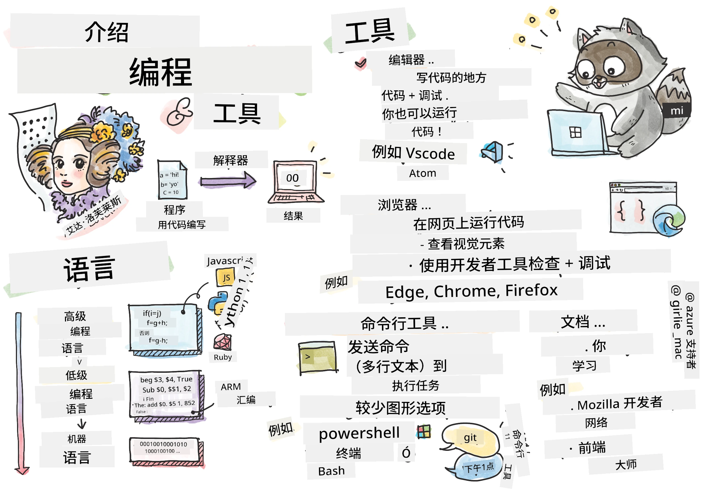
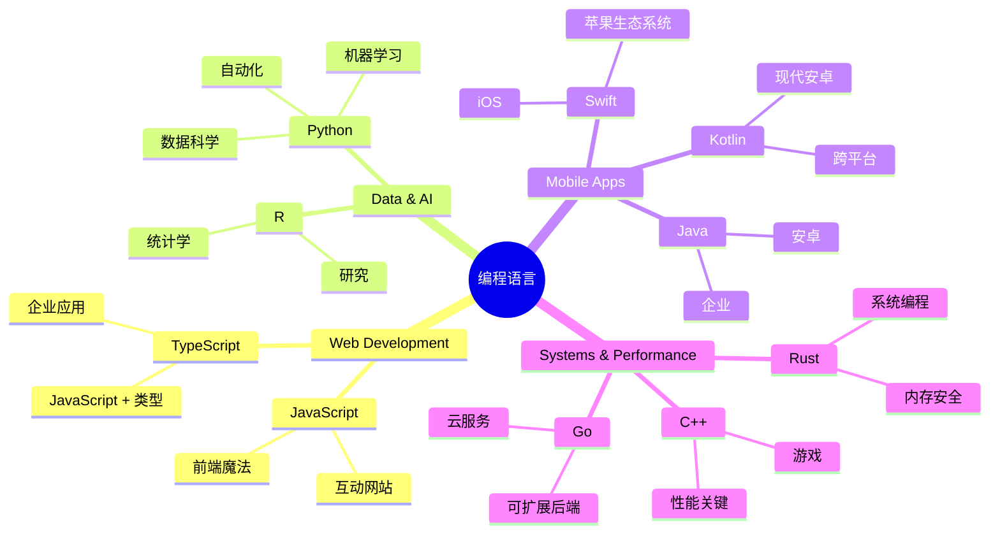
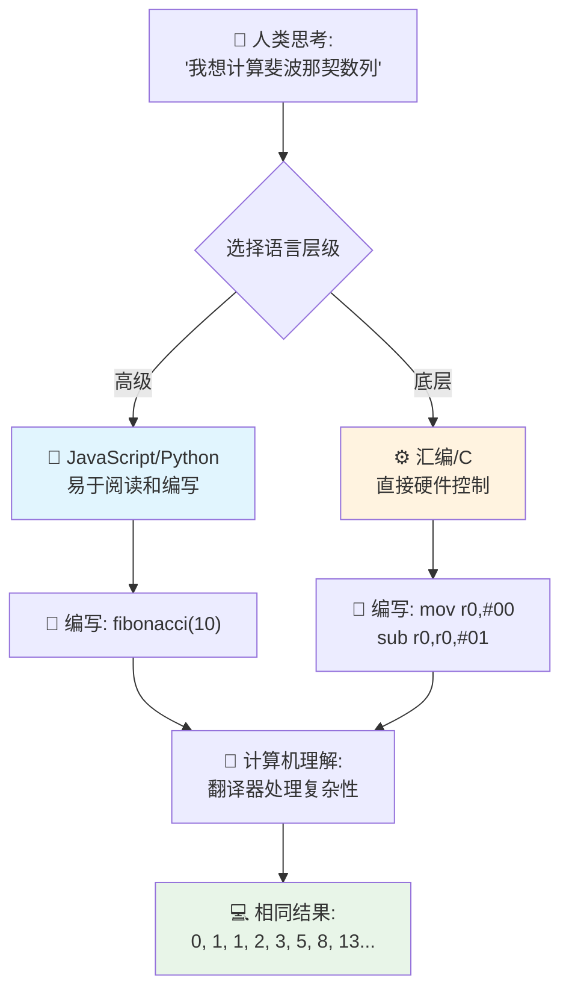
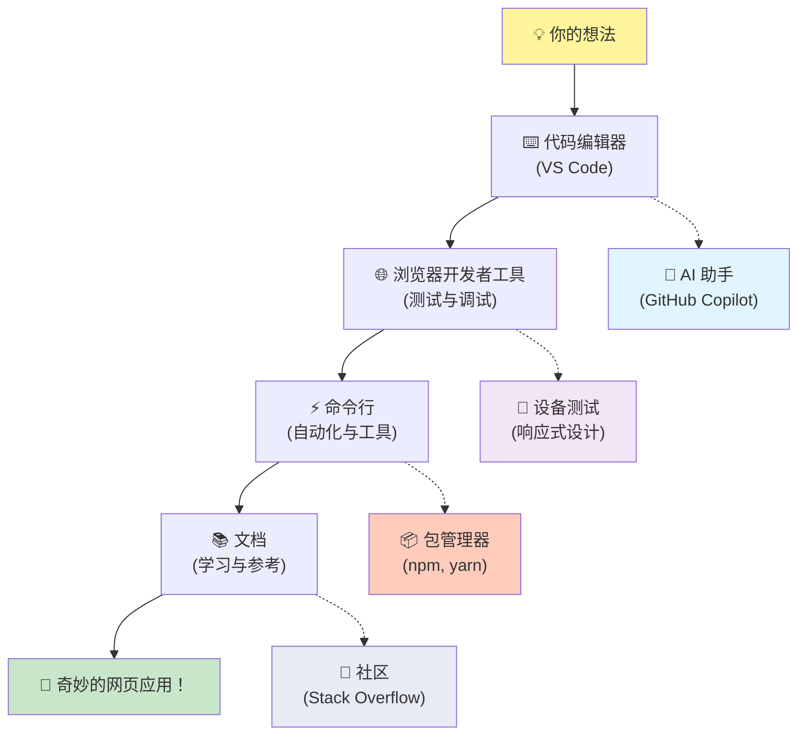
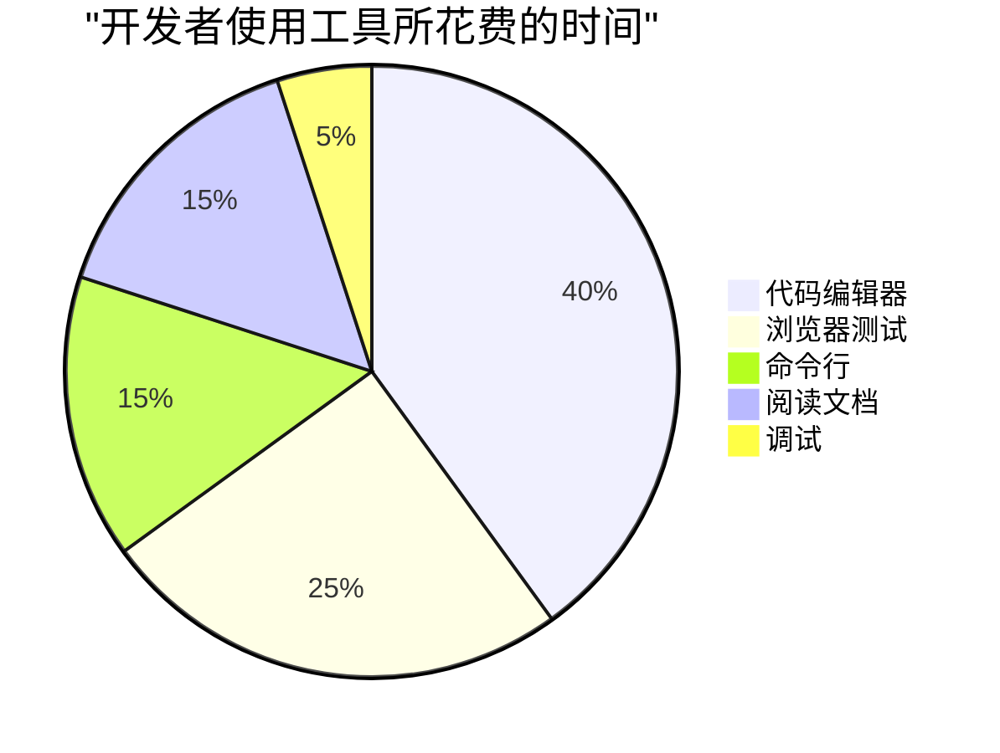

# 编程语言与现代开发工具简介

你好，未来的开发者！👋 我能告诉你一件每天都让我激动不已的事情吗？你即将发现编程不仅仅是关于计算机——它是赋予你把最疯狂的想法变为现实的超能力！

你知道使用你最喜欢的应用时，有那么一瞬间所有东西都完美契合吗？当你点击一个按钮，发生了某种绝对神奇的事情，让你忍不住惊呼“哇，他们是怎么做到的？” 那正是像你一样的人——可能凌晨两点坐在最喜欢的咖啡馆里，喝着第三杯浓缩咖啡——写出了创造那份魔力的代码。接下来要让你惊叹的是：在这节课结束时，你不仅会明白他们是怎么做到的，还会迫不及待地想自己尝试！

说实话，如果你现在觉得编程令人害怕，我完全理解。一开始我也觉得编程一定要是数学天才，或者从五岁起就开始写代码才行。但真正让我改变看法的是：编程就像学习一门新语言的交流。你起步于“你好”和“谢谢”，接着学会点咖啡，没多久就能谈哲学了！不过这次是和计算机“对话”，说实话？它们是你遇到过最耐心的“对话伙伴”——永不批评你的错误，永远兴奋地愿意再尝试一次！

今天，我们将探索那些让现代网页开发不仅可能而且极具吸引力的惊人工具。我说的正是 Netflix、Spotify 和你喜欢的独立应用工作室每天都在用的编辑器、浏览器和工作流程。最让你开心的是：这些专业级、行业标准工具大多数都是免费的！


> 草图由 [Tomomi Imura](https://twitter.com/girlie_mac) 绘制


## 来看看你已经知道些什么！

在进入有趣的内容之前，我很好奇——你对编程世界已经了解多少？听着，如果你看着这些问题想“我完全不知道这些东西”，没关系，这完全没问题！这就意味着你来对地方了。把这个测验当作运动前的热身——我们只是让脑子热身一下！

[参加课前测验](https://ff-quizzes.netlify.app/web/)


## 我们即将共同冒险的旅程

好吧，我对今天要探索的内容真的是兴奋得跳起来！说真的，我真希望我能看到当你理解某些概念时的表情。以下是我们共同踏上的精彩旅程：

- **什么是编程（以及为什么它是最酷的事情！）**——我们将发现代码是如何成为你周围一切的无形魔法推动力，从那个莫名其妙知道周一早晨的闹钟，到完美策划你 Netflix 推荐的算法
- <strong>编程语言及其奇妙个性</strong>——想象你进入一个聚会，每个人都拥有完全不同的超能力和解决问题的方式。编程语言的世界就像这样，你一定会喜欢认识它们！
- <strong>打造数字魔法的基础构件</strong>——把它们想象成终极创意乐高积木。理解这些零件如何组合后，你会发现自己真的可以建造出任何你想象中的东西
- <strong>让你感觉仿佛刚拿到魔法棒的专业工具</strong>——我并不夸张——这些工具会让你真切感受到拥有超能力，最棒的是？它们和专业人士用的一样！

> 💡 <strong>重点是</strong>：今天不要试图记住所有内容！现在，我只想让你感受到即将实现的那份激情。细节会随着我们一起练习自然而然地牢记——这才是真正的学习！

> 你也可以在 [Microsoft Learn](https://learn.microsoft.com/en-us/learn/modules/web-development-101/introduction-programming/?WT.mc_id=academic-77807-sagibbon) 上学习这节课！

## 那么，什么是<em>编程</em>？

好了，让我们来回答这个价值百万美元的问题：编程究竟是什么？

我给你讲个让我彻底改变看法的故事。上周我试图给妈妈讲怎么用我们新的智能电视遥控器。我发现自己老是说“按那个红色按钮，但不是大红按钮，是左边那个小红按钮……不，不，是你另一只手那边的左边……好了，现在按住两秒，不是一秒，也不是三秒……” 是不是很熟悉？😅

这就是编程！它是给非常强大的东西制定极其详细、一步步的指令的艺术，只不过你要把每条都讲清楚。唯一的区别是，你不是给妈妈解释（她可能会反问“哪个红按钮？”），而是给计算机解释（它只会严格执行你说的，哪怕那不是你真想表达的）。

我刚开始学时最让我震惊的是：计算机本质很简单。它们只懂两件事——1 和 0，基本上就是“是”和“否”或者“开”和“关”。仅此而已！神奇的地方在这——我们不必像《黑客帝国》那样用 1 和 0 交流。这时<strong>编程语言</strong>就派上用场了。它们就像是最棒的翻译官，将你正常的人类思维转换成计算机语言。

每天醒来时让我激动不已的是：你生活中<em>所有</em>数字内容，都是由像你一样的人创造的。可能穿着睡衣，拿着一杯咖啡，坐在笔记本电脑前敲代码。那个让你完美无瑕的 Instagram 滤镜？有人写了代码。推荐你新喜欢音乐的算法？开发者构建了它。帮你和朋友一起分摊晚饭账单的应用？有人想“这个好烦，我一定能改进”，然后……他们做到了！

当你学会编程时，不仅仅是在掌握一门新技能——你正在加入这个惊人的问题解决社区，他们每天思考着：“如果我能造点什么让别人一天变得更好一点？” 说真的，还有什么比这更酷的吗？

✅ <strong>趣味小知识狩猎</strong>：当你有空时，查查世界上第一位程序员是谁？提示：这可能不是你想象的那个人！这位先驱的故事绝对引人入胜，证明编程一直都是创造性解决问题和跳出框架思考的代名词。

### 🧠 **心情检视时间：你感觉如何？**

**静下心来想想：**
- “给计算机下指令”的概念现在对你来说通了吗？
- 你能想到某个想自动化的日常任务吗？
- 关于编程，你现在脑海中有哪些问题正在涌现？

> <strong>记住</strong>：即使某些概念现在有些模糊也完全正常。学习编程就像学习一门新语言，神经回路需要时间建立。你做得很棒！

## 编程语言就像不同风味的魔法

好，这听起来怪怪的，但跟我来——编程语言很像不同类型的音乐。试想：你有爵士乐，慵懒而即兴；摇滚，强劲直率；古典，高雅有序；还有嘻哈，创意丰富。每种风格有自己的氛围、激情粉丝群，适合不同心情和场合。

编程语言也完全如此！你不会用一样的语言去开发一个有趣的手机游戏，同时用它处理海量气候数据，就像你不会在瑜伽课上听死亡金属一样（嗯，大部分瑜伽课是这样 😄）。

但每次想到这点，都让我着迷：这些语言就像你身边有一个最耐心、最聪明的翻译官。你用符合人类思维的方式表达想法，他们负责复杂转换成计算机真正能理解的 1 和 0。就好比你有了那个能流利“人类创意”和“计算机逻辑”的朋友——他们永不疲倦，不需要咖啡休息，也绝不嘲笑你反复问同一个问题！

### 流行编程语言及其用途


| 语言 | 适用范围 | 流行原因 |
|----------|----------|------------------|
| **JavaScript** | 网页开发，用户界面 | 运行在浏览器中，支持交互式网站 |
| **Python** | 数据科学，自动化，人工智能 | 易读易学，拥有强大库支持 |
| **Java** | 企业应用，安卓应用 | 跨平台，适合大型系统 |
| **C#** | Windows 应用，游戏开发 | 强大的微软生态支持 |
| **Go** | 云服务，后端系统 | 快速简洁，专为现代计算设计 |

### 高级语言 vs. 低级语言

说实话，这一概念一开始把我搞晕了，后来我用下面这个类比终于弄懂了——希望对你也有帮助！

想象你去一个完全不会说其语言的国家，急需找到最近的厕所（相信我，我们都经历过😅）：

- <strong>低级编程</strong> 就像你把当地方言学到可以跟卖水果的老奶奶侃大山，用文化典故、本地俚语、只有土生土长才能懂的“梗”。超级厉害且效率奇高……如果你懂的话！不过当你只是要找厕所时会超头疼。

- <strong>高级编程</strong> 就像你有个超棒的本地朋友懂你想表达啥。你只需用普通英语说“我真的需要找洗手间”，好友帮你翻译、指路，一切对你这个外地人来说都明明白白。

在编程世界：
- <strong>低级语言</strong>（比如汇编或 C）让你能和电脑硬件“详谈”，但你得像机器一样思考……这心理转变很大啊！
- <strong>高级语言</strong>（比如 JavaScript、Python 或 C#）让你保持人类思维，幕后帮你处理机器语言。他们还有超友好的社区，记得刚入门时的尴尬并真诚乐于帮忙！

猜你该从哪种语言开始学？😉 高级语言就像训练轮，根本不想摘掉，因为它们让整个学习过程更轻松愉快！


### 让我给你演示高级语言有多友好

好，我马上给你展示我为啥爱上高级语言。先跟我约定看到第一个代码示例时别慌！它看上去吓人是故意的，这正是我想讲的重点！

我们会对比两种完全不同风格的代码实现同一任务——生成斐波那契数列——这是个美妙的数学模式，每个数是前两个数字之和：0，1，1，2，3，5，8，13……（趣味知识：自然界随处可见这个规律——向日葵种子螺旋、松果纹理，甚至银河形成方式！）

准备好看区别吗？走起！

**高级语言（JavaScript）——人类友好：**

```javascript
// 第1步：基本的斐波那契数列设置
const fibonacciCount = 10;
let current = 0;
let next = 1;

console.log('Fibonacci sequence:');
```

**此代码做了以下事情：**
- <strong>声明</strong>一个常量，指定生成多少个斐波那契数
- <strong>初始化</strong>两个变量，追踪序列中的当前数和下一个数
- <strong>设定</strong>起始值（0 和 1），定义斐波那契模式
- <strong>显示</strong>输出头部信息

```javascript
// 第2步：使用循环生成序列
for (let i = 0; i < fibonacciCount; i++) {
  console.log(`Position ${i + 1}: ${current}`);
  
  // 计算序列中的下一个数字
  const sum = current + next;
  current = next;
  next = sum;
}
```

**这里发生了什么：**
- **用`for`循环**遍历序列每个位置
- <strong>用模板字符串</strong>格式显示每个数及其位置
- <strong>计算</strong>下一个斐波那契数（当前值加下一个值）
- <strong>更新</strong>追踪变量，进入下一次循环

```javascript
// 第3步：现代函数式方法
const generateFibonacci = (count) => {
  const sequence = [0, 1];
  
  for (let i = 2; i < count; i++) {
    sequence[i] = sequence[i - 1] + sequence[i - 2];
  }
  
  return sequence;
};

// 使用示例
const fibSequence = generateFibonacci(10);
console.log(fibSequence);
```

**上述代码还：**
- <strong>用现代箭头函数语法</strong>创建可复用函数
- <strong>构建了数组</strong>保存完整序列而不是逐个打印
- <strong>利用数组索引</strong>从之前值计算新数
- <strong>返回完整序列</strong>以便其他程序部分灵活使用

**低级语言（ARM 汇编）——计算机友好：**

```assembly
 area ascen,code,readonly
 entry
 code32
 adr r0,thumb+1
 bx r0
 code16
thumb
 mov r0,#00
 sub r0,r0,#01
 mov r1,#01
 mov r4,#10
 ldr r2,=0x40000000
back add r0,r1
 str r0,[r2]
 add r2,#04
 mov r3,r0
 mov r0,r1
 mov r1,r3
 sub r4,#01
 cmp r4,#00
 bne back
 end
```

你会发现 JavaScript 版本几乎像英语指令，而汇编版本则使用直接控制处理器的冷僻命令。两者实现完全相同的功能，但高级语言对人类来说更易懂、编写和维护。

**你会注意到的关键区别：**
- <strong>可读性</strong>：JavaScript 使用像 `fibonacciCount` 这样描述性强的名称，而汇编语言使用像 `r0`、`r1` 这样的晦涩标签
- <strong>注释</strong>：高级语言鼓励写解释性注释，使代码自带文档功能
- <strong>结构</strong>：JavaScript 的逻辑流程符合人类一步步思考问题的方式
- <strong>维护</strong>：针对不同需求更新 JavaScript 版本直观且清晰

✅ <strong>关于斐波那契数列</strong>：这个绝美的数字模式（其中每个数字都是前两个数字之和：0、1、1、2、3、5、8……）实际上在大自然中无处不在！你会在向日葵的螺旋、松球的图案、鸵蚌壳的曲线，甚至树枝的生长方式中发现它。数学和代码帮助我们理解并重现大自然用来创造美丽的模式，这真是令人惊叹！


## 让魔法发生的基本构件

好了，现在你已经看到编程语言的实际样子了，让我们拆解构成所有程序的基础部分。把它们想象成你最喜欢食谱中的必备原料——一旦你理解了每个部分的作用，你就能读懂并编写几乎任何语言的代码！

这有点像学习编程的语法。还记得学校里学名词、动词和造句吗？编程也有自己的“语法”，老实说，它比英文语法更合逻辑、更宽容！😄

### 语句：一步步的指令

先从 <strong>语句</strong> 开始——它们就像你和电脑对话中的单句子。每条语句指示电脑做一件具体的事情，就像给出方向：“这里左转”，“红灯停”，“停到那个车位”。

我喜欢语句的一点是它们通常非常可读。看这个例子：

```javascript
// 执行单个操作的基本语句
const userName = "Alex";                    
console.log("Hello, world!");              
const sum = 5 + 3;                         
```

**这段代码做了什么：**
- <strong>声明</strong>一个常量变量来存储用户的名字
- <strong>向控制台</strong>输出问候信息
- <strong>计算</strong>并存储数学运算结果

```javascript
// 与网页交互的语句
document.title = "My Awesome Website";      
document.body.style.backgroundColor = "lightblue";
```

**一步步来看看发生了什么：**
- <strong>修改</strong>浏览器标签页中显示的网页标题
- <strong>改变</strong>整个页面主体的背景颜色

### 变量：程序的记忆系统

好了，<strong>变量</strong>说实话是我最喜欢教的概念之一，因为它们非常像你每天都在用的东西！

想象一下你的手机通讯录。你不会记住所有人的电话号码，而是保存“妈妈”、“最好的朋友”或者“凌晨2点之前送餐的披萨店”，然后让手机记住具体号码。变量的作用就是这样！它们就像带标签的容器，程序可以把信息存在里面，然后通过有意义的名字叫出来。

最酷的是：变量可以在程序运行时变化（因此得名“变量”——你看这名字多贴切！）。就像你发现了更棒的披萨店时会更新联系人一样，变量也会随着程序学习新信息或情况变化而更新！

看看这多简单：

```javascript
// 第一步：创建基本变量
const siteName = "Weather Dashboard";        
let currentWeather = "sunny";               
let temperature = 75;                       
let isRaining = false;                      
```

**理解这些概念：**
- **在 `const` 变量中**存储不变的值（例如网站名称）
- **用 `let`** 存储程序运行中可能会改变的值
- <strong>分配</strong>不同数据类型：字符串（文本）、数字和布尔值（true/false）
- <strong>选择</strong>描述性名称解释变量内容

```javascript
// 第2步：使用对象来分组相关数据
const weatherData = {                       
  location: "San Francisco",
  humidity: 65,
  windSpeed: 12
};
```

**上面代码中，我们：**
- <strong>创建</strong>了一个对象，用于组合相关的天气信息
- <strong>将</strong>多条数据组织到一个变量名下
- <strong>用</strong>键值对清楚标注每条信息内容

```javascript
// 第3步：使用和更新变量
console.log(`${siteName}: Today is ${currentWeather} and ${temperature}°F`);
console.log(`Wind speed: ${weatherData.windSpeed} mph`);

// 更新可变变量
currentWeather = "cloudy";                  
temperature = 68;                          
```

**逐部分理解：**
- <strong>使用</strong>模板字符串 `${}` 来显示信息
- <strong>用</strong>点号表示法访问对象属性（`weatherData.windSpeed`）
- <strong>更新</strong>用 `let` 声明的变量以反映变化的条件
- <strong>组合</strong>多个变量来生成有意义的消息

```javascript
// 第4步：使用现代解构使代码更简洁
const { location, humidity } = weatherData; 
console.log(`${location} humidity: ${humidity}%`);
```

**你需要知道的是：**
- <strong>用解构赋值</strong>从对象中提取特定属性
- <strong>自动创建</strong>与对象键同名的新变量
- <strong>简化</strong>代码，避免重复使用点号

### 控制流：教程序“思考”

好了，这里是绝对令人震撼的地方！<strong>控制流</strong>基本上就是教你的程序如何做出聪明决策，正如你每天毫不费力地做的事。

想象一下：今天早上你大概做了类似这样的判断：“如果下雨，我带伞；如果冷，我穿夹克；如果赶时间，我跳过早餐路上喝杯咖啡。”你的大脑每天都会无数次自然而然地遵循这种“如果-那么”的逻辑！

这就是让程序看起来聪明、有生命力、不再像流水线脚本的原因。它们可以实际观察情况，评估当前状态，并做出合适反应。就像给你的程序装上了一颗能适应环境、做出选择的大脑！

想看看它是怎么美妙工作的？我来给你演示：

```javascript
// 第一步：基本条件逻辑
const userAge = 17;

if (userAge >= 18) {
  console.log("You can vote!");
} else {
  const yearsToWait = 18 - userAge;
  console.log(`You'll be able to vote in ${yearsToWait} year(s).`);
}
```

**这段代码的作用：**
- <strong>检查</strong>用户年龄是否满足投票条件
- <strong>根据条件</strong>执行不同的代码块
- <strong>计算</strong>并显示未满18岁还需多久才有资格投票
- <strong>针对每种情况</strong>提供具体且有帮助的反馈

```javascript
// 第2步：使用逻辑运算符的多个条件
const userAge = 17;
const hasPermission = true;

if (userAge >= 18 && hasPermission) {
  console.log("Access granted: You can enter the venue.");
} else if (userAge >= 16) {
  console.log("You need parent permission to enter.");
} else {
  console.log("Sorry, you must be at least 16 years old.");
}
```

**这里发生了什么：**
- **用 `&&`（且）运算符**组合多个条件
- **用 `else if`** 创建多层条件判断体系
- **用最后的 `else`** 处理所有可能的其他情况
- <strong>为每种情况</strong>提供明确、可操作的反馈

```javascript
// 第3步：使用三元运算符的简洁条件语句
const votingStatus = userAge >= 18 ? "Can vote" : "Cannot vote yet";
console.log(`Status: ${votingStatus}`);
```

**你需要记住：**
- **使用条件（三元）运算符 (`? :`)** 表达简单的两选一条件
- **先写条件，紧跟`?`，然后是满足条件的结果，再写冒号`:`，最后是假时的结果**
- **当你需要根据条件给变量赋值时，使用这个模式**

```javascript
// 第4步：处理多个特定情况
const dayOfWeek = "Tuesday";

switch (dayOfWeek) {
  case "Monday":
  case "Tuesday":
  case "Wednesday":
  case "Thursday":
  case "Friday":
    console.log("It's a weekday - time to work!");
    break;
  case "Saturday":
  case "Sunday":
    console.log("It's the weekend - time to relax!");
    break;
  default:
    console.log("Invalid day of the week");
}
```

**这段代码实现了：**
- <strong>匹配变量值</strong>和多个具体案例
- <strong>将类似情况</strong>组合（工作日 vs. 周末）
- <strong>找到匹配时</strong>执行相应代码块
- **使用 `default`** 处理意外情况
- **用 `break` 语句** 防止继续执行后续案例

> 💡 <strong>现实世界类比</strong>：把控制流想象成世界上最耐心的 GPS 给你指路。它可能会说：“如果主街有堵车，就走高速。如果高速施工，试试风景路线。”程序用完全相同的条件逻辑智能地应对各种情况，总是为用户提供最佳体验。

### 🎯 **概念检查：构建模块掌握情况**

**来看看你对基础的理解：**
- 你能用自己的话解释变量和语句的区别吗？
- 想一个现实例子说明你会在什么情况下用 if-then 判断（比如我们的投票例子）
- 编程逻辑中，有什么让你感到惊讶的地方？

**快速信心提升：**

✅ <strong>接下来内容</strong>：我们将继续深入探讨这些概念，一路玩得开心！现在只要感受对未来各种奇妙可能的兴奋就好。具体技能和技巧自然会随着练习变得得心应手——保证比你想象的有趣多了！

## 工具介绍

好吧，坦白说我现在简直激动得不行！🚀 我们马上要聊的是那些让你感觉仿佛刚拿到数字宇宙飞船钥匙的神奇工具。

你知道厨师手中那些平衡极佳、像手臂扩展一样的刀具是什么感觉吗？或是音乐家那把刚被触碰就会唱歌的吉他？开发者们也有自己的“魔法工具”，让我爆料一波——它们中的大多数居然是完全免费的！

想到要跟你分享这些工具我已经兴奋得坐立不安了，因为它们彻底改变了我们构建软件的方式。我们说的是由 AI 驱动的代码助手，它们能帮你写代码（不是开玩笑！），基于云的开发环境可以让你随时随地有 Wi-Fi 都能做完整应用，调试工具强大到就像给程序装上了 X 光眼。

还有让我浑身起鸡皮疙瘩的是：这些可不是“初学者工具”，你用着会觉得棒极了，这正是 Google、Netflix 和你喜欢的那些独立应用工作室此刻正在使用的专业级工具。你用起来一定也会觉得自己超专业！


### 代码编辑器和 IDE：你的数字新好友

说说代码编辑器——这些将成为你新的最爱地盘！把它们看作你专属的编程圣地，大部分时间你都将在这里打造和完善数字作品。

现代编辑器的神奇之处在于：它们不仅仅是高级文本编辑器，更像是全天候在你旁边鼎力相助的天才导师。它们能在你察觉错字前帮你抓住，智能推荐让你代码写得像大神一样，帮你理解每行代码的功能，有些甚至能预测你要敲的内容并帮你补全思路！

我还记得第一次用到自动补全时的感觉，仿佛活在未来。你开始敲字，编辑器就“嗨，你是不是想调用这个正好符合需求的函数？”这简直像是有个心灵感应的编程伙伴！

**这些编辑器为何如此神奇？**

现代代码编辑器提供了令人印象深刻的功能，极大提升你的生产力：

| 功能 | 作用 | 益处 |
|---------|--------------|--------------|
| <strong>语法高亮</strong> | 用颜色区分代码的不同部分 | 让代码更易读，帮助发现错误 |
| <strong>自动补全</strong> | 输入时建议代码 | 加快编码速度，减少错别字 |
| <strong>调试工具</strong> | 帮助定位和修复错误 | 节省大量排查时间 |
| <strong>扩展功能</strong> | 添加专门的功能模块 | 可针对任意技术定制编辑器 |
| **AI助手** | 提供代码建议和解释 | 加速学习与编程效率 |

> 🎥 <strong>视频资源</strong>：想看看这些工具如何运作？请观看这段[工具介绍视频](https://youtube.com/watch?v=69WJeXGBdxg)了解详细内容。

#### 推荐用于 Web 开发的编辑器

**[Visual Studio Code](https://code.visualstudio.com/?WT.mc_id=academic-77807-sagibbon)**（免费）
- Web 开发者中的首选
- 优秀的扩展生态系统
- 内置终端和 Git 集成
- <strong>必装扩展</strong>：
  - [GitHub Copilot](https://marketplace.visualstudio.com/items?itemName=GitHub.copilot) - AI 驱动代码建议
  - [Live Share](https://marketplace.visualstudio.com/items?itemName=MS-vsliveshare.vsliveshare) - 实时协作
  - [Prettier](https://marketplace.visualstudio.com/items?itemName=esbenp.prettier-vscode) - 自动代码格式化
  - [Code Spell Checker](https://marketplace.visualstudio.com/items?itemName=streetsidesoftware.code-spell-checker) - 代码拼写检查

**[JetBrains WebStorm](https://www.jetbrains.com/webstorm/)**（付费，学生免费）
- 高级调试和测试工具
- 智能代码补全
- 内置版本控制

**云端 IDE**（多种价格）
- [GitHub Codespaces](https://github.com/features/codespaces) - 浏览器中的完整 VS Code
- [Replit](https://replit.com/) - 适合学习和分享代码
- [StackBlitz](https://stackblitz.com/) - 即刻启动的全栈 Web 开发

> 💡 <strong>入门建议</strong>：从 Visual Studio Code 开始——它免费、业界广泛使用，有庞大的社区提供教程和扩展。

### 网页浏览器：你的秘密开发实验室

准备好被完全震撼了吗！你平时用浏览器滚动社交媒体、看视频，但其实它们一直隐藏着一个惊人的秘密开发实验室，等着你去发现！

每次你右键点击网页选择“检查元素”，就打开了一个隐藏的开发者工具世界。这些工具强大得比我以前花几百美元买的软件还厉害。就像发现普通厨房背后藏着专业大厨基地的秘密开关一样！
第一次有人给我演示浏览器开发者工具的时候，我光是瞎点瞎点就花了三个小时，然后不断地惊呼：“等等，它居然还能这样？！”你真的可以实时编辑任何网站，准确地看到加载速度，测试你的网站在不同设备上的显示效果，甚至像专业人士一样调试 JavaScript。简直令人震惊！

**这就是浏览器成为你秘密武器的原因：**

当你创建网站或网络应用时，你需要看到它在现实世界中的外观和表现。浏览器不仅展示你的作品，还提供有关性能、可访问性和潜在问题的详细反馈。

#### 浏览器开发者工具（DevTools）

现代浏览器包含全面的开发套件：

| 工具类别 | 功能描述 | 示例用例 |
|---------------|--------------|------------------|
| <strong>元素检查器</strong> | 实时查看和编辑 HTML/CSS | 调整样式立即查看效果 |
| <strong>控制台</strong> | 查看错误信息和测试 JavaScript | 调试问题和尝试代码 |
| <strong>网络监视器</strong> | 跟踪资源加载情况 | 优化性能和加载速度 |
| <strong>可访问性检查器</strong> | 测试包容性设计 | 确保网站适合所有用户 |
| <strong>设备模拟器</strong> | 预览不同屏幕尺寸 | 无需多台设备测试响应式设计 |

#### 推荐的开发浏览器

- **[Chrome](https://developers.google.com/web/tools/chrome-devtools/)** - 行业标准的 DevTools，文档丰富
- **[Firefox](https://developer.mozilla.org/docs/Tools)** - 出色的 CSS Grid 和可访问性工具
- **[Edge](https://docs.microsoft.com/microsoft-edge/devtools-guide-chromium/?WT.mc_id=academic-77807-sagibbon)** - 基于 Chromium，拥有微软开发资源

> ⚠️ <strong>重要测试提示</strong>：务必在多个浏览器中测试你的网站！在 Chrome 上完美运行的内容，在 Safari 或 Firefox 可能会有不同表现。专业开发者会在所有主流浏览器中测试，以确保一致的用户体验。

### 命令行工具：开发者超级力量的大门

好了，我们来个坦白时刻聊聊命令行，因为我想让你听听一个真正懂它的人说说感受。一开始我看到那个——黑漆漆的屏幕上闪烁着文字——直接想：“不，不行！这看起来就像80年代黑客电影里的东西，我肯定没那个头脑！”😅

但我当时希望有人告诉我，现在我也想告诉你：命令行其实一点都不可怕——它就像你和电脑在直接对话。想象一下，这就好比你不是用附带图片和菜单的精美应用点餐（那很简单），而是走进你最爱的当地餐馆，厨师知道你喜欢什么，你一句“给我惊喜”的话，他就能做出完美美味。

命令行是开发者感受魔力的地方。你输入几个看似神奇的词（其实就是命令，但感觉很神奇！），按回车，哔——你可以创建整个项目结构，安装来自全世界的强大工具，或者把应用部署到互联网上供数百万人访问。一旦尝过这种力量，真是让人上瘾！

**命令行将成为你最喜欢工具的理由：**

虽然图形界面适合许多任务，但命令行在自动化、精确和速度上无可匹敌。许多开发工具主要通过命令行接口工作，学会高效使用它们能显著提升你的生产力。

```bash
# 第一步：创建并进入项目目录
mkdir my-awesome-website
cd my-awesome-website
```
  
**这段代码做了什么：**  
- <strong>创建</strong>一个名为"my-awesome-website"的新目录用于你的项目  
- <strong>进入</strong>新建目录开始工作  

```bash
# 第2步：使用 package.json 初始化项目
npm init -y

# 安装现代开发工具
npm install --save-dev vite prettier eslint
npm install --save-dev @eslint/js
```
  
**一步步来看发生了什么：**  
- 使用 `npm init -y` <strong>初始化</strong>一个默认配置的新 Node.js 项目  
- <strong>安装</strong> Vite 作为现代构建工具用于快速开发和生产构建  
- <strong>添加</strong> Prettier 进行自动代码格式化，ESLint 检查代码质量  
- 使用 `--save-dev` 标记它们为仅开发环境依赖  

```bash
# 第3步：创建项目结构和文件
mkdir src assets
echo '<!DOCTYPE html><html><head><title>My Site</title></head><body><h1>Hello World</h1></body></html>' > index.html

# 启动开发服务器
npx vite
```
  
**以上操作包括：**  
- <strong>组织</strong>项目，创建源码和资源分别存放的文件夹  
- <strong>生成</strong>结构完整的基本 HTML 文件  
- <strong>启动</strong> Vite 开发服务器实现实时重载和热模块替换  

#### Web 开发必备命令行工具

| 工具 | 作用 | 你需要它的理由 |
|------|---------|-----------------|
| **[Git](https://git-scm.com/)** | 版本控制 | 追踪更改、协作与备份 |
| **[Node.js & npm](https://nodejs.org/)** | JavaScript 运行时与包管理 | 在浏览器外运行 JS，安装现代开发工具 |
| **[Vite](https://vitejs.dev/)** | 构建工具与开发服务器 | 极速开发与热模块替换 |
| **[ESLint](https://eslint.org/)** | 代码质量 | 自动发现并修复 JS 问题 |
| **[Prettier](https://prettier.io/)** | 代码格式化 | 保持代码格式统一易读 |

#### 不同平台的选择

**Windows:**
- **[Windows Terminal](https://docs.microsoft.com/windows/terminal/?WT.mc_id=academic-77807-sagibbon)** - 现代化功能丰富的终端  
- **[PowerShell](https://docs.microsoft.com/powershell/?WT.mc_id=academic-77807-sagibbon)** 💻 - 强大的脚本环境  
- **[命令提示符](https://learn.microsoft.com/windows-server/administration/windows-commands/windows-commands)** 💻 - 传统 Windows 命令行  

**macOS:**
- **[Terminal](https://support.apple.com/guide/terminal/)** 💻 - 内置终端应用  
- **[iTerm2](https://iterm2.com/)** - 功能增强型终端  

**Linux:**
- **[Bash](https://www.gnu.org/software/bash/)** 💻 - 标准 Linux Shell  
- **[KDE Konsole](https://docs.kde.org/trunk5/en/konsole/konsole/index.html)** - 高级终端模拟器  

> 💻 = 操作系统预装  

> 🎯 <strong>学习路径</strong>：先掌握基本命令如 `cd`（切换目录），`ls` 或 `dir`（列出文件），`mkdir`（创建文件夹）。练习现代工作流命令如 `npm install`，`git status`，`code .`（在 VS Code 打开当前目录）。熟悉后自然能掌握更高级命令和自动化技巧。

### 文档：你随时可依赖的学习导师

好，我来透露一个让你作为初学者心里踏实点的小秘密：即便是最有经验的开发者也会花大量时间阅读文档。这不是因为他们不懂，而是智慧的表现！

可以把文档看作全球最耐心、知识最丰富的老师，全天候在线。凌晨两点卡在问题上？文档给你温暖的虚拟拥抱，恰到好处的答案。想了解热门新功能？文档带你一步步学。试图理解为什么某个东西会这样工作？没错，文档就是帮你“恍然大悟”的那把钥匙！

这彻底改变我看法的一点是：网络开发变化非常快，没人（真的没人！）能背下所有东西。我见过有 15 年经验的高级开发者查基础语法，知道吗？这不丢脸——那是聪明！不是完美记忆，而是知道快速找到可靠答案的方法，并懂得如何应用。

**真正的魔力在哪里：**

专业开发者大量时间用来阅读文档——不是因为他们不懂，而是网络开发领域更新太快，保持领先需要不断学习。优秀文档不仅告诉你<em>怎么用</em>东西，更说明<em>为什么</em>和<em>何时</em>用。

#### 必备文档资源

**[Mozilla Developer Network (MDN)](https://developer.mozilla.org/docs/Web)**  
- 网页技术文档的黄金标准  
- HTML、CSS 和 JavaScript 全面指南  
- 包含浏览器兼容性信息  
- 具实用示例和互动演示  

**[Web.dev](https://web.dev)**（谷歌出品）  
- 现代网络开发最佳实践  
- 性能优化指南  
- 可访问性和包容性设计原则  
- 真实项目案例研究  

**[Microsoft Developer Documentation](https://docs.microsoft.com/microsoft-edge/#microsoft-edge-for-developers)**  
- Edge 浏览器开发资源  
- 渐进式 Web App 指南  
- 跨平台开发见解  

**[Frontend Masters 学习路径](https://frontendmasters.com/learn/)**  
- 结构化学习课程  
- 行业专家视频课程  
- 实战编码练习  

> 📚 <strong>学习策略</strong>：别试图死记文档，学会高效浏览才重要。收藏常用文档，多练习用搜索功能快速找到所需信息。

### 🔧 **工具掌握度自测：你最共鸣的是？**

**花点时间想想：**  
- 你最想先试哪个工具？（答案无对错！）  
- 命令行还让你害怕吗，还是渐渐好奇了？  
- 你能想象用浏览器 DevTools 去窥探你最喜欢网站的“幕后”吗？  


> <strong>有趣的见解</strong>：多数开发者约 40% 时间花在代码编辑器里，但更多时间用于测试、学习和解决问题。编程不仅是写代码，更是打造体验！

✅ <strong>思考点</strong>：思考一个有趣问题——构建网站的工具（开发）和设计网站外观的工具（设计）可能有什么不同？就像建筑师设计漂亮房子和承包商真正建造一样。两者都关键，但需要不同的工具箱！这种思路能帮你更好理解网站诞生的全貌。

## GitHub Copilot Agent 挑战 🚀

使用 Agent 模式完成以下挑战：

**描述：** 探索现代代码编辑器或 IDE 的功能，展示它如何提升你作为网页开发者的工作流程。

**提示：** 选择一个代码编辑器或 IDE（如 Visual Studio Code、WebStorm 或云端 IDE）。列出三个帮助你更高效编写、调试或维护代码的功能或扩展。简要说明它们对你工作流程的好处。

---

## 🚀 挑战

**好了，侦探，准备好接第一单案子吗？**

既然你已经打下了坚实基础，这次冒险将帮助你认识编程世界多么丰富多彩、有趣。而且听着——这还不是写代码的时候，完全无压力！把你当作编程语言侦探，踏上第一单激动人心的案件！

**你的任务，如果你愿意接受：**  
1. <strong>成为语言探索者</strong>：选三种来自完全不同领域的编程语言——也许一个用于建网站，一个做移动应用，另一个助科学家分析数据。找到每种语言写的同一简单任务示例。我保证你会惊叹它们虽然做同样事，却长得多么不一样！  
2. <strong>挖掘起源故事</strong>：每种语言有什么特别之处？有个酷事实——每种语言诞生，都是因为有人想：“解决这个问题一定有更好方式。”你能找出那个问题是什么吗？这些故事往往非常有趣！  
3. <strong>见见社区</strong>：看看每种语言社区多么热情友好。有的有数百万开发者互帮互助，有的虽小但紧密团结。你会喜欢了解这些社区各自的个性！  
4. <strong>跟随直觉</strong>：哪种语言现在看起来最容易上手？别急着找“完美”答案——相信你的直觉！真的没有错误答案，而且你以后可以随时探索其他语言。

<strong>额外侦探任务</strong>：看看能否发现哪些主流网站或应用用每种语言开发。我保证你会被 Instagram、Netflix 或那个让你停不下来的手游背后的技术震惊！

> 💡 <strong>记住</strong>：你今天不是要成为这些语言专家，只是在决定“落脚点”前先逛逛附近。放轻松，玩得开心，让好奇心带路！

## 来庆祝你的新发现吧！

天哪，你今天吸收了这么多不可思议的信息！我真的很兴奋看到你对这段精彩旅程的理解。记住——这不是必须完全正确的测试，而是庆祝你对这个迷人世界学到的所有酷知识的时刻！

[参加课后测验](https://ff-quizzes.netlify.app/web/)

## 复习与自学

**慢慢探索，玩得开心！**
你今天已经学了很多东西，这值得你骄傲！现在有趣的部分来了——探索那些激发你好奇心的主题。记住，这不是作业——而是一场冒险！

**深入探索让你兴奋的内容：**

**动手体验编程语言：**
- 访问你感兴趣的2-3个编程语言的官方网站。每种语言都有自己独特的个性和故事！
- 试试一些在线编码平台，比如 [CodePen](https://codepen.io/)、[JSFiddle](https://jsfiddle.net/) 或 [Replit](https://replit.com/)。不要害怕尝试——你不会破坏任何东西！
- 阅读你喜欢的编程语言是如何诞生的。真的，有些起源故事非常有趣，能帮助你理解语言为什么会以这样的方式运作。

**熟悉你的新工具：**
- 如果还没下载 Visual Studio Code，赶快下载吧——它是免费的，你会喜欢它的！
- 花几分钟浏览一下扩展市场。它就像你的代码编辑器的应用商店！
- 打开浏览器的开发者工具，随便点点。别担心马上理解所有东西——先熟悉它们的存在就好。

**加入社区：**
- 关注一些开发者社区，比如 [Dev.to](https://dev.to/)、[Stack Overflow](https://stackoverflow.com/) 或 [GitHub](https://github.com/)。编程社区对新人非常友好！
- 在 YouTube 上观看一些适合初学者的编程视频。有很多优秀的创作者会记得刚开始时的感受。
- 考虑参加本地聚会或加入线上社区。相信我，开发者们很乐意帮助新手！

> 🎯 **听着，我希望你记住的是**：你不需要一夜之间成为编程高手！现在，你只是开始认识你即将加入的这个惊奇世界。慢慢来，享受这段旅程，记住——每一个你崇拜的开发者，都曾坐在你的位置上，感到既兴奋又有点不知所措。这完全正常，意味着你走在正确的路上！


## 任务

[Reading the Docs](assignment.md)

> 💡 <strong>给你任务的小提示</strong>：我非常希望看到你去探索一些我们还没涉及过的工具！跳过我们已经讨论过的编辑器、浏览器和命令行工具——外面有一整个令人惊叹的开发工具世界等待你去发现。挑选那些活跃维护且拥有活跃帮助社区的工具（通常这些工具有最棒的教程，以及当你卡住时最乐于助人的人群）。

---

## 🚀 你的编程旅程时间表

### ⚡ **接下来5分钟你可以做的事**
- [ ] 收藏2-3个引起你兴趣的编程语言网站
- [ ] 如果还没下载，安装 Visual Studio Code
- [ ] 打开浏览器的开发者工具（F12），随意浏览任何网站
- [ ] 加入一个编程社区（Dev.to、Reddit r/webdev，或 Stack Overflow）

### ⏰ <strong>这一小时你可以完成的任务</strong>
- [ ] 完成课后测验并反思你的答案
- [ ] 配置 VS Code，安装 GitHub Copilot 扩展
- [ ] 在线尝试用两种不同的编程语言写一个“Hello World”示例
- [ ] 在 YouTube 上观看一条“开发者的一天”视频
- [ ] 开始你的编程语言侦探之旅（挑战内容）

### 📅 <strong>你的一周冒险计划</strong>
- [ ] 完成任务并探索3个新的开发工具
- [ ] 关注5位开发者或编程账号的社交媒体
- [ ] 在 CodePen 或 Replit 上尝试做点小东西（哪怕只是“Hello, [你的名字]！”）
- [ ] 阅读一篇开发者博客，了解他们的编程历程
- [ ] 参加一次线上聚会或观看一次编程讲座
- [ ] 开始用在线教程学习你选择的语言

### 🗓️ <strong>你一个月的转变</strong>
- [ ] 构建你的第一个小项目（即使是一个简单的网页也算！）
- [ ] 参与开源项目（从文档修正开始）
- [ ] 指导一个刚开始编程的人
- [ ] 创建你的开发者个人网站作品集
- [ ] 连接本地的开发者社区或学习小组
- [ ] 开始规划你的下一个学习目标

### 🎯 <strong>最终反思检查</strong>

**在前进之前，花点时间庆祝一下：**
- 今天让你对编程感到兴奋的是什么？
- 你最想先探索哪个工具或概念？
- 你对开始这段编程旅程的感觉如何？
- 你现在最想问开发者的一个问题是什么？


> 🌟 <strong>记住</strong>：每个专家曾经都是新手。每个高级开发者曾经和你现在一样——兴奋，也许有点不知所措，当然还有对可能性的好奇。你现在处于一个了不起的大家庭中，这段旅程将会令人难以置信。欢迎来到奇妙的编程世界！ 🎉

---

<!-- CO-OP TRANSLATOR DISCLAIMER START -->
**免责声明**：  
本文件使用 AI 翻译服务 [Co-op Translator](https://github.com/Azure/co-op-translator) 进行翻译。尽管我们力求准确，但请注意，自动翻译可能包含错误或不准确之处。原始文档的本国语言版本应被视为权威来源。对于重要信息，建议使用专业人工翻译。对于因使用此翻译而产生的任何误解或错误解释，我们概不负责。
<!-- CO-OP TRANSLATOR DISCLAIMER END -->