# 创建无障碍网页


> 草图笔记由 [Tomomi Imura](https://twitter.com/girlie_mac) 制作

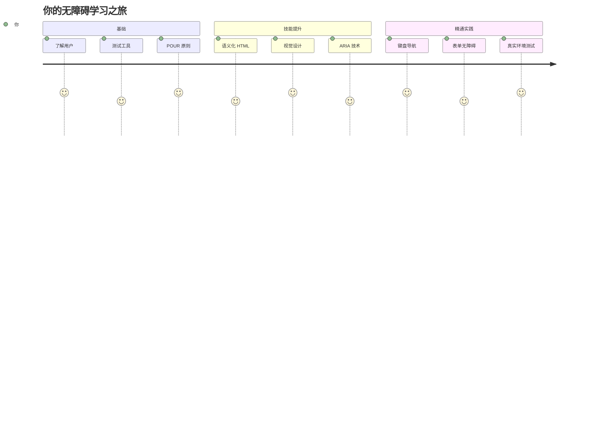
## 课前测验
[课前测验](https://ff-quizzes.netlify.app/web/)

> 网络的力量在于它的普遍性。无论是否有残疾，人人都能访问是其核心要素。
>
> \- Sir Timothy Berners-Lee，W3C 董事兼万维网发明者

这里有个可能会让你惊讶的事实：当你构建无障碍网站时，你不仅是在帮助残障人士——你实际上是在让网络对所有人更好用！

你有没有注意到街角的轮椅斜坡？它们最初是为轮椅设计的，但现在同样方便推婴儿车的人、搬运员推货车、带滚轮行李的旅行者和骑自行车的人。这正是无障碍网页设计的原理——帮助某一群体的解决方案最终会惠及所有人。相当酷，对吧？

在这节课中，我们将探讨如何创建真正适合所有人的网站，无论他们如何浏览网络。你将学习已经内置于网页标准中的实用技巧，动手使用测试工具，并了解无障碍如何让你的网站对所有用户都更易用。

课程结束时，你将有信心让无障碍成为开发工作流程中的自然一环。准备好探索那些用心设计如何为数十亿用户打开网络的大门了吗？开始吧！

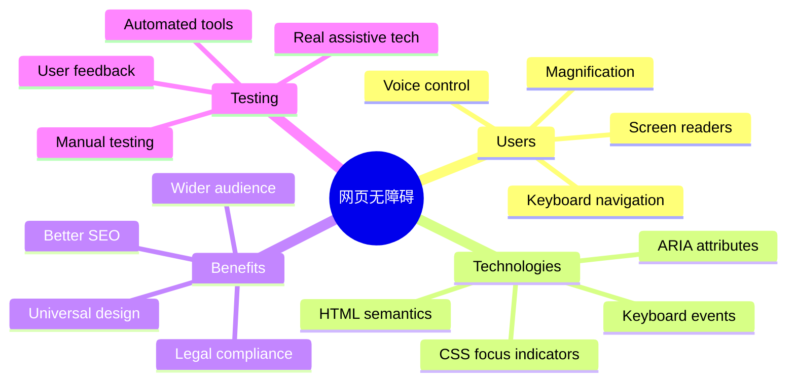
> 你也可以在 [Microsoft Learn](https://docs.microsoft.com/learn/modules/web-development-101/accessibility/?WT.mc_id=academic-77807-sagibbon) 在线学习这堂课！

## 了解辅助技术

在开始编码之前，让我们先花点时间了解不同能力的人们是如何体验网络的。这不仅仅是理论——理解这些真实的导航模式会让你成为更出色的开发者！

辅助技术是非常了不起的工具，它们帮助残障人士以你可能想不到的方式与网站交互。一旦你掌握了这些技术的运作方式，创建无障碍网页体验就会变得更加直观。这就像学会用别人的视角来看你的代码。

### 屏幕阅读器

[屏幕阅读器](https://en.wikipedia.org/wiki/Screen_reader) 是复杂的技术，它们将数字文本转换成语音或盲文输出。虽然主要用于视障人士，但它们对有阅读障碍等学习障碍的用户也非常有帮助。

我喜欢把屏幕阅读器想象成一个非常聪明的讲解者在为你朗读书籍。它以合乎逻辑的顺序朗读内容，宣布交互元素如“按钮”或“链接”，并提供键盘快捷键以跳转页面。然而，屏幕阅读器只有在我们构建的网站具有正确结构和有意义的内容时，才能发挥作用。这就需要你作为开发者参与进来了！

**各平台流行的屏幕阅读器：**
- **Windows**： [NVDA](https://www.nvaccess.org/about-nvda/)（免费且最受欢迎），[JAWS](https://webaim.org/articles/jaws/)，[Narrator](https://support.microsoft.com/windows/complete-guide-to-narrator-e4397a0d-ef4f-b386-d8ae-c172f109bdb1/?WT.mc_id=academic-77807-sagibbon)（内置）
- **macOS/iOS**： [VoiceOver](https://support.apple.com/guide/voiceover/welcome/10)（内置且性能强大）
- **Android**： [TalkBack](https://support.google.com/accessibility/android/answer/6283677)（内置）
- **Linux**： [Orca](https://wiki.gnome.org/Projects/Orca)（免费开源）

**屏幕阅读器浏览网页内容的方式：**

屏幕阅读器为有经验的用户提供多种高效的导航方式：
- **顺序阅读**：从上到下读取内容，就像看书一样
- **地标导航**：在页面章节间跳转（头部，导航，主内容，页脚）
- **标题导航**：跳转标题，以了解页面结构
- **链接列表**：生成所有链接的列表，快速访问
- **表单控件**：直接在输入框和按钮间导航

> 💡 **让人惊讶的是**：68% 的屏幕阅读器用户主要通过标题导航 ([WebAIM 调查](https://webaim.org/projects/screenreadersurvey9/#finding))。这意味着你的标题结构就像用户的导航图——当你弄对了，它们能帮助用户更快地找到内容！

### 构建你的测试工作流程

好消息是——有效的无障碍测试不必让人望而生畏！你需要结合自动化工具（它们非常擅长捕捉明显的问题）和一些手动测试。以下是我发现的一个体系化方法，能最大限度地发现问题且不会占用你太多时间：

**必备的手动测试工作流程：**

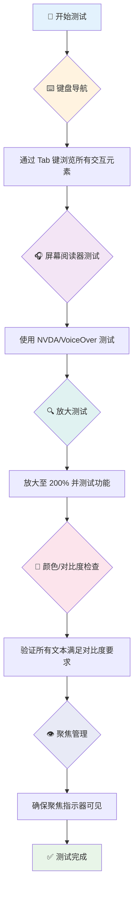
**逐步测试检查表：**
1. **键盘导航**：仅使用 Tab、Shift+Tab、Enter、空格键和方向键操作
2. **屏幕阅读器测试**：启动 NVDA、VoiceOver 或 Narrator，闭眼操作导航
3. **缩放测试**：分别测验 200% 和 400% 缩放级别
4. **颜色对比检查**：检查所有文本和 UI 组件
5. **焦点指示测试**：确保所有交互元素都有可见焦点样式

✅ **从 Lighthouse 开始**：打开浏览器开发者工具，运行 Lighthouse 无障碍审计，再用结果指导手动测试重点。

### 缩放和放大工具

你知道吗，当文本太小而你在手机上捏合放大，或者在强光下眯眼看笔记本时？很多用户每天都依赖放大工具让内容可读。这包括视力低下者、老年人，以及任何曾尝试在户外阅读网页的人。

现代缩放技术不仅是放大而已。了解这些工具的工作原理有助于你设计出响应式页面，无论放大多少倍都保持功能性和美观。

**现代浏览器的缩放能力：**
- **页面缩放**：成比例缩放所有内容（文本、图片、布局）——这是首选方法
- **仅文本缩放**：只放大字体大小，保持原有布局
- **捏合缩放**：移动端手势支持临时放大
- **浏览器支持**：所有现代浏览器支持最多 500% 缩放且不影响功能

**专用放大软件：**
- **Windows**： [放大镜](https://support.microsoft.com/windows/use-magnifier-to-make-things-on-the-screen-easier-to-see-414948ba-8b1c-d3bd-8615-0e5e32204198)（内置），[ZoomText](https://www.freedomscientific.com/training/zoomtext/getting-started/)
- **macOS/iOS**： [Zoom](https://www.apple.com/accessibility/mac/vision/)（内置，带高级功能）

> ⚠️ **设计要点**：WCAG 要求内容在放大到 200% 时仍保持功能。此时应尽量避免横向滚动，所有交互元素都应保持可访问。

✅ **测试响应式设计**：将浏览器缩放至 200% 和 400%。你的布局是否优雅适应？是否能使用全部功能且无需过度滚动？

## 现代无障碍测试工具

了解了人们如何用辅助技术浏览网页后，我们来看看帮助你构建和测试无障碍网站的工具。

简单来说：自动化工具擅长发现明显问题（比如缺少替代文本），而手动测试帮助你确保网站在真实使用中感觉良好。二者结合，让你有信心网站惠及所有人。

### 颜色对比测试

好消息是：颜色对比是最常见的无障碍问题之一，但也是最容易修正的。良好的对比度惠及所有人——从视障用户到在海滩上看手机的人。

**WCAG 对比度要求：**

| 文本类型 | WCAG AA（最低要求） | WCAG AAA（增强要求） |
|-----------|--------------------|---------------------|
| **普通文本**（小于18pt） | 4.5:1 对比度 | 7:1 对比度 |
| **大号文本**（18pt及以上或14pt加粗） | 3:1 对比度 | 4.5:1 对比度 |
| **UI 组件**（按钮，表单边框） | 3:1 对比度 | 3:1 对比度 |

**必备测试工具：**
- [Colour Contrast Analyser](https://www.tpgi.com/color-contrast-checker/) - 桌面应用带取色器
- [WebAIM Contrast Checker](https://webaim.org/resources/contrastchecker/) - 网站工具即时反馈
- [Stark](https://www.getstark.co/) - 针对 Figma, Sketch, Adobe XD 的设计插件
- [Accessible Colors](https://accessible-colors.com/) - 查找可访问的配色方案

✅ **打造更好的色彩方案**：从品牌颜色出发，使用对比度工具创建无障碍变体。将它们作为设计系统的无障碍色彩标记记录下来。

### 全面无障碍审计

最有效的无障碍测试是结合多种方法。没有单一工具能发现所有问题，因此建立多元测试流程能确保覆盖全面。

**基于浏览器的测试（集成在开发者工具中）：**
- **Chrome/Edge**：Lighthouse 无障碍审计 + 无障碍面板
- **Firefox**：带详细树视图的无障碍检查器
- **Safari**：Web Inspector 审计标签页 + VoiceOver 模拟

**专业测试插件：**
- [axe DevTools](https://www.deque.com/axe/devtools/) - 行业内标准的自动测试工具
- [WAVE](https://wave.webaim.org/extension/) - 可视反馈与错误高亮
- [Accessibility Insights](https://accessibilityinsights.io/) - 微软的综合测试套件

**命令行和 CI/CD 集成：**
- [axe-core](https://github.com/dequelabs/axe-core) - 用于自动测试的 JS 库
- [Pa11y](https://pa11y.org/) - 命令行无障碍测试工具
- [Lighthouse CI](https://github.com/GoogleChrome/lighthouse-ci) - 自动无障碍评分

> 🎯 **测试目标**：力争 Lighthouse 无障碍得分至少 95 分。记住，自动工具只能发现约 30-40% 的无障碍问题——手动测试依然不可少！

### 🧠 **测试技能自测：准备找问题了吗？**

**来看看你对无障碍测试的感觉：**
- 目前你觉得哪个测试方式最容易上手？
- 你能想象只用键盘导航一天吗？
- 你曾在线上遇到过哪些无障碍障碍？

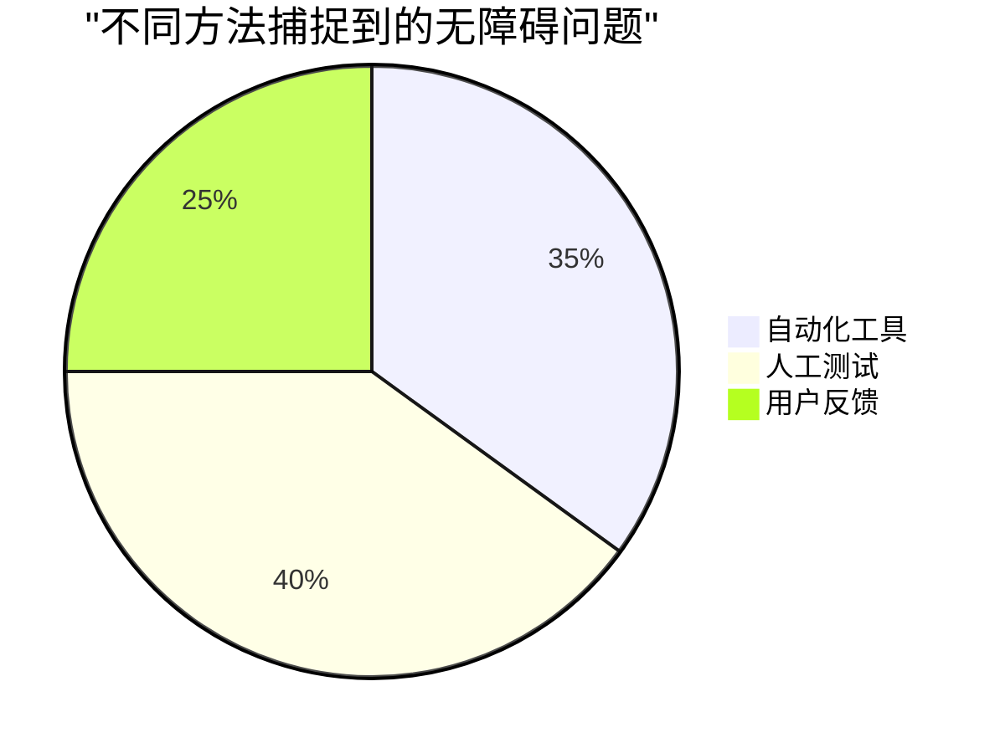
> **增强信心**：专业无障碍测试员正是使用上述组合方法。你正在学习行业标准的实践！

## 从根基开始构建无障碍

无障碍成功的关键是从一开始就将它构建进你的基础。虽然可能会想“我以后再加无障碍”，但这就像房子建好后再加坡道。可能吗？可以。但容易吗？不太。

把无障碍想象成房屋规划——在初期建筑设计时包含轮椅通道，要远比事后改造轻松很多。

### POUR 原则：你的无障碍基石

《网页内容无障碍指南》(WCAG) 建立在四个基本原则之上，简称 POUR。别担心，这些并非枯燥的学术概念，而是实用指南，帮助你制作适合所有人的内容。

掌握了 POUR，做无障碍相关决策会更加顺畅。这就像有一个心理清单指导你的设计选择。我们来逐条拆解：

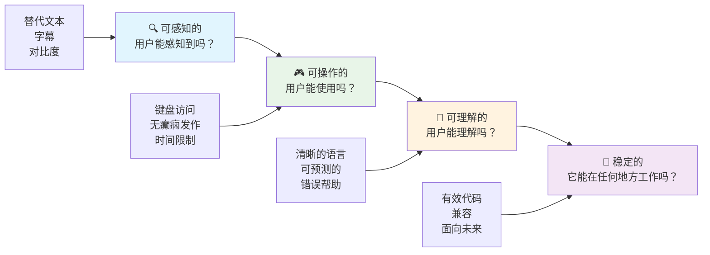
**🔍 可感知（Perceivable）**：信息必须以用户能通过其感官感知的方式呈现

- 为非文本内容（图片、视频、音频）提供文本替代
- 确保所有文本和 UI 组件有足够的颜色对比度
- 为多媒体内容提供字幕和文字稿
- 设计内容在放大至 200% 时仍保持功能
- 使用多重感官属性（不仅仅是颜色）传达信息

**🎮 可操作（Operable）**：所有界面组件必须可通过可用输入方式操作

- 使所有功能可通过键盘导航访问
- 给用户充足时间阅读和交互
- 避免引发癫痫或前庭障碍的内容
- 通过清晰结构和地标帮助用户高效导航
- 确保交互元素有足够触控面积（至少44像素）

**📖 可理解（Understandable）**：信息和界面操作必须清晰且易懂

- 使用适合目标用户的清晰简洁语言
- 保证内容出现和操作方式可预测、一致
- 为用户输入提供清晰的指引和错误提示
- 帮助用户理解并纠正表单错误
- 通过合理的阅读顺序和信息层级组织内容

**💪 稳健（Robust）**：内容必须在不同技术和辅助设备中可靠工作

- **使用有效且语义化的 HTML 作为基础**
- **确保兼容当前和未来的辅助技术**
- **遵循网页标准和最佳实践的标记规范**
- **在不同浏览器、设备和辅助工具上进行测试**
- **构建内容结构，以便在不支持高级功能时可优雅降级**

### 🎯 **POUR 原则检查：让它深入人心**

**对基础的快速反思：**
- 你能想到哪些网站功能未能满足每个 POUR 原则吗？
- 作为开发者，哪个原则对你来说最自然？
- 这些原则如何改善所有人的设计，而不仅仅是残障用户？

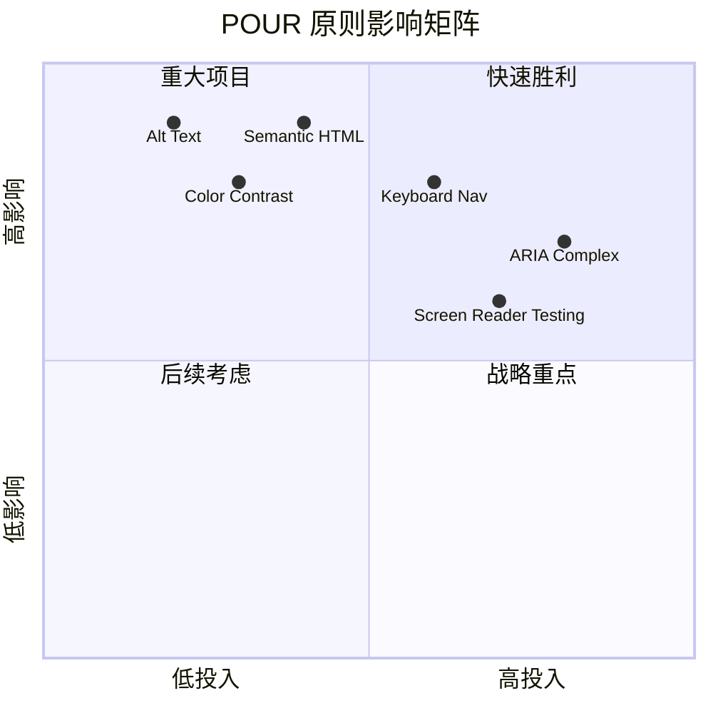
> **记住**：从高影响、低难度的改进开始。语义化 HTML 和 alt 文本能以最低的努力带来最大的无障碍提升！

## 创建无障碍的视觉设计

良好的视觉设计和无障碍是相辅相成的。当你以无障碍为设计出发点时，你常常会发现这些限制会带来更简洁、更优雅的解决方案，惠及所有用户。

让我们探讨如何创建对所有人都友好的视觉设计，无论他们的视觉能力如何，也无论他们在何种条件下浏览内容。

### 颜色和视觉无障碍策略

颜色是强有力的沟通手段，但不应成为传达重要信息的唯一方式。超越颜色的设计创造了更强健、更包容的体验，适用性更广。

**考虑色觉差异进行设计：**

约有 8% 的男性和 0.5% 的女性存在某种形式的色觉差异（通常称为“色盲”）。最常见的类型有：
- **红绿色盲（Deuteranopia）**：难以区分红色和绿色
- **红色弱视（Protanopia）**：红色看起来更加暗淡
- **蓝黄色盲（Tritanopia）**：难以区分蓝色和黄色（罕见）

**包容性色彩策略：**

```css
/* ❌ Bad: Using only color to indicate status */
.error { color: red; }
.success { color: green; }

/* ✅ Good: Color plus icons and context */
.error {
  color: #d32f2f;
  border-left: 4px solid #d32f2f;
}
.error::before {
  content: "⚠️";
  margin-right: 8px;
}

.success {
  color: #2e7d32;
  border-left: 4px solid #2e7d32;
}
.success::before {
  content: "✅";
  margin-right: 8px;
}
```

**超越基础对比度要求：**
- 使用色盲模拟器测试你的配色
- 结合使用图案、纹理或形状与颜色编码
- 确保交互状态无需色彩也能区分
- 考虑设计在高对比度模式下的表现

✅ **测试你的颜色无障碍性**：使用诸如 [Coblis](https://www.color-blindness.com/coblis-color-blindness-simulator/) 之类的工具查看不同色觉用户如何看到你的网站。

### 焦点指示器和交互设计

焦点指示器是数字世界中的光标——它向键盘用户显示他们在页面上的位置。设计良好的焦点指示器通过使交互清晰且可预测来提升所有用户的体验。

**现代焦点指示器最佳实践：**

```css
/* Enhanced focus styles that work across browsers */
button:focus-visible {
  outline: 2px solid #0066cc;
  outline-offset: 2px;
  box-shadow: 0 0 0 4px rgba(0, 102, 204, 0.25);
}

/* Remove focus outline for mouse users, preserve for keyboard users */
button:focus:not(:focus-visible) {
  outline: none;
}

/* Focus-within for complex components */
.card:focus-within {
  box-shadow: 0 0 0 3px rgba(74, 144, 164, 0.5);
  border-color: #4A90A4;
}

/* Ensure focus indicators meet contrast requirements */
.custom-focus:focus-visible {
  outline: 3px solid #ffffff;
  outline-offset: 2px;
  box-shadow: 0 0 0 6px #000000;
}
```

**焦点指示器要求：**
- **可见性**：必须与周围元素保持至少 3:1 的对比度
- **宽度**：元素周围必须至少有 2px 的厚度
- **持续性**：焦点移动到别处之前需要一直可见
- **区分性**：必须与其他 UI 状态有明显视觉差异

> 💡 **设计建议**：优秀的焦点指示器通常结合使用轮廓、盒阴影和颜色变化，以确保在不同背景和场景下都能清晰可见。

✅ **审查焦点指示器**：用 Tab 键遍历你的网站，记录哪些元素有清晰的焦点指示器。有没有难以看清或完全缺失的？

### 语义 HTML：无障碍的基础

语义 HTML 就像为你的网页提供一套 GPS 系统。当你为 HTML 元素赋予正确的语义时，基本上为屏幕阅读器、键盘和其他辅助工具提供了详细的导航路线图，帮助用户高效浏览。

我特别喜欢这个比喻：语义 HTML 的区别就像一个有明确类别和指示牌的图书馆，与一个书籍乱扔的仓库。两者虽然都有书，但你更愿意在哪个地方找书？没错！

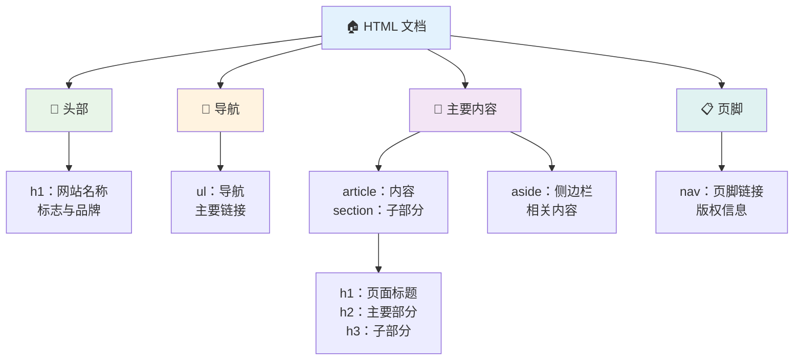
**构建无障碍页面结构的基本模块：**

```html
<!-- Landmark elements provide page navigation structure -->
<header>
  <h1>Your Site Name</h1>
  <nav aria-label="Main navigation">
    <ul>
      <li><a href="/home">Home</a></li>
      <li><a href="/about">About</a></li>
      <li><a href="/services">Services</a></li>
    </ul>
  </nav>
</header>

<main>
  <article>
    <header>
      <h1>Article Title</h1>
      <p>Published on <time datetime="2024-10-14">October 14, 2024</time></p>
    </header>
    
    <section>
      <h2>First Section</h2>
      <p>Content that relates to this section...</p>
    </section>
    
    <section>
      <h2>Second Section</h2>
      <p>More related content...</p>
    </section>
  </article>
  
  <aside>
    <h2>Related Links</h2>
    <nav aria-label="Related articles">
      <ul>
        <li><a href="/related-1">First related article</a></li>
        <li><a href="/related-2">Second related article</a></li>
      </ul>
    </nav>
  </aside>
</main>

<footer>
  <p>&copy; 2024 Your Site Name. All rights reserved.</p>
  <nav aria-label="Footer links">
    <ul>
      <li><a href="/privacy">Privacy Policy</a></li>
      <li><a href="/contact">Contact Us</a></li>
    </ul>
  </nav>
</footer>
```

**语义 HTML 如何改变无障碍体验：**

| 语义元素 | 作用 | 屏幕阅读器优势 |
|------------------|---------|----------------------|
| `<header>` | 页面或区域的页眉 | “横幅地标” - 快速导航至顶部 |
| `<nav>` | 导航链接 | “导航地标” - 导航部分列表 |
| `<main>` | 主要页面内容 | “主地标” - 直接跳转到内容 |
| `<article>` | 独立内容块 | 宣告文章边界 |
| `<section>` | 主题内容组 | 提供内容结构 |
| `<aside>` | 相关侧边栏内容 | “补充地标” |
| `<footer>` | 页面或区域页脚 | “内容信息地标” |

**语义 HTML 带来的屏幕阅读器超能力：**
- **地标导航**：快速在主要页面区域之间跳转
- **标题大纲**：根据标题结构生成目录
- **元素列表**：生成所有链接、按钮或表单控件的列表
- **上下文感知**：理解内容区块间的关系

> 🎯 **快速测试**：用屏幕阅读器尝试用地标快捷键导航网站（NVDA/JAWS 中的 D 用于地标，H 用于标题，K 用于链接）。导航是否合理？

### 🏗️ **语义 HTML 掌握检查：打牢坚实基础**

**让我们评估下你的语义理解：**
- 仅凭 HTML 能识别页面上的地标吗？
- 怎么向朋友解释 `<section>` 和 `<div>` 的区别？
- 如果屏幕阅读器用户报告导航问题，你首先检查什么？

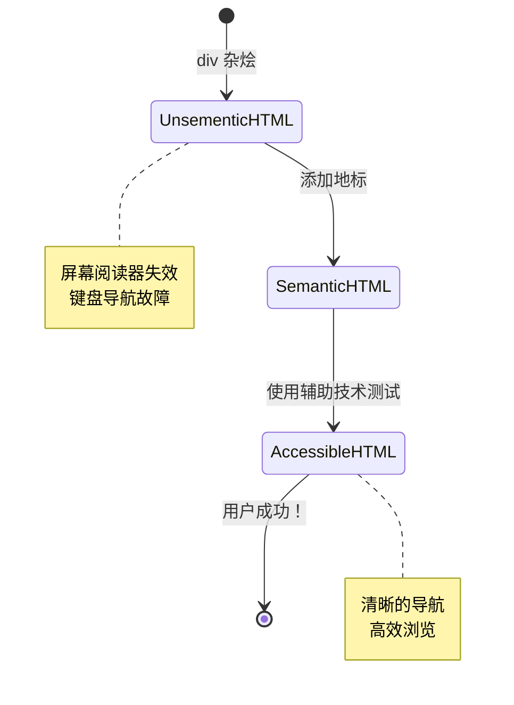
> **专业提示**：好的语义 HTML 可自动解决大约 70% 的无障碍问题。掌握这基础，你就走在正确的路上了！

✅ **审查你的语义结构**：使用浏览器开发者工具中的无障碍面板查看无障碍树，确保你的标记创建了逻辑结构。

### 标题层级：创建逻辑的内容大纲

标题对于无障碍内容绝对至关重要——它们就像支撑整体的脊梁。屏幕阅读器用户严重依赖标题来理解和浏览内容。你可以把它看作是为页面提供的目录。

**标题的黄金规则：**
绝不跳级。始终按逻辑顺序从 `<h1>` 到 `<h2>` 到 `<h3>` 依次递进。还记得学校做大纲吗？原则是一样的——你不会从“Ⅰ. 主要观点”直接跳到“C. 小小点”而跳过“A. 小点”，对吧？

**完美的标题结构示例：**

```html
<!-- ✅ Excellent: Logical, hierarchical progression -->
<main>
  <h1>Complete Guide to Web Accessibility</h1>
  
  <section>
    <h2>Understanding Screen Readers</h2>
    <p>Introduction to screen reader technology...</p>
    
    <h3>Popular Screen Reader Software</h3>
    <p>NVDA, JAWS, and VoiceOver comparison...</p>
    
    <h3>Testing with Screen Readers</h3>
    <p>Step-by-step testing instructions...</p>
  </section>
  
  <section>
    <h2>Color and Contrast Guidelines</h2>
    <p>Designing with sufficient contrast...</p>
    
    <h3>WCAG Contrast Requirements</h3>
    <p>Understanding the different contrast levels...</p>
    
    <h3>Testing Tools and Techniques</h3>
    <p>Tools for verifying contrast ratios...</p>
  </section>
</main>
```

```html
<!-- ❌ Problematic: Skipping levels, inconsistent structure -->
<h1>Page Title</h1>
<h3>Subsection</h3> <!-- Skipped h2 -->
<h2>This should come before h3</h2>
<h1>Another main heading?</h1> <!-- Multiple h1s -->
```

**标题最佳实践：**
- **每页仅一个 `<h1>`**：通常是主页标题或主要内容标题
- **逻辑递进**：绝不跳级（h1 → h2 → h3，而非 h1 → h3）
- **描述性内容**：即使脱离上下文也有意义
- **用 CSS 控制外观**：HTML 用于结构，CSS 管理视觉样式

**屏幕阅读器导航统计：**
- 68% 屏幕阅读器用户使用标题导航（[WebAIM 调查](https://webaim.org/projects/screenreadersurvey9/#finding)）
- 用户期望找到合理的标题大纲
- 标题是最快理解页面结构的方式

> 💡 **专业提示**：使用浏览器扩展如“HeadingsMap”可视化标题结构。它应该像一个有条理的目录。

✅ **测试标题结构**：用屏幕阅读器的标题导航功能（NVDA 中的 H 键），通过标题跳转。该层级过程逻辑清晰吗？

### 高级视觉无障碍技术

除了基础的对比度和颜色，还有一些高级技术帮助构建真正包容的视觉体验。这些方法确保内容能适应不同的观看条件和辅助技术。

**必备的视觉沟通策略：**

- **多模态反馈**：结合视觉、文字，有时还有声音提示
- **渐进披露**：将信息分段呈现
- **一致的交互模式**：使用熟悉的 UI 约定
- **响应式排版**：适配不同设备的字体大小
- **加载与错误状态**：为所有用户操作提供明确反馈

**提升无障碍的 CSS 工具：**

```css
/* Screen reader only text - visually hidden but accessible */
.sr-only {
  position: absolute;
  width: 1px;
  height: 1px;
  padding: 0;
  margin: -1px;
  overflow: hidden;
  clip: rect(0, 0, 0, 0);
  white-space: nowrap;
  border: 0;
}

/* Skip link for keyboard navigation */
.skip-link {
  position: absolute;
  top: -40px;
  left: 6px;
  background: #000000;
  color: #ffffff;
  padding: 8px 16px;
  text-decoration: none;
  border-radius: 4px;
  font-weight: bold;
  transition: top 0.3s ease;
  z-index: 1000;
}

.skip-link:focus {
  top: 6px;
}

/* Reduced motion respect */
@media (prefers-reduced-motion: reduce) {
  .skip-link {
    transition: none;
  }
  
  * {
    animation-duration: 0.01ms !important;
    animation-iteration-count: 1 !important;
    transition-duration: 0.01ms !important;
  }
}

/* High contrast mode support */
@media (prefers-contrast: high) {
  .button {
    border: 2px solid;
  }
}
```

> 🎯 **无障碍模式**：“跳转链接”对键盘用户至关重要。它应是页面上的第一个可聚焦元素，并允许直接跳转到主要内容区域。

✅ **实现跳转导航**：为页面添加跳转链接，页面加载后按 Tab 测试，跳转链接应出现并允许运行跳至主要内容。

## 编写有意义的链接文本

链接基本上是网络的高速公路，但糟糕的链接文本就像路标只写着“某地”，却不写“芝加哥市中心”。没什么用吧？

这里有个我刚学时震惊的事实：屏幕阅读器可以提取页面上的所有链接并作为一个大列表显示。想象一下，如果有人给你一份页面中每个链接的目录，每个链接本身都能立即让你理解它的作用吗？这是你的链接文本需要通过的测试！

### 理解链接导航模式

屏幕阅读器提供了强大的链接导航功能，依赖于写得好的链接文本：

**链接导航方式：**
- **顺序阅读**：作为内容流的一部分按顺序朗读链接
- **链接列表生成**：将所有页面链接汇编成可搜索的目录
- **快速导航**：用键盘快捷键在链接间跳转（NVDA中的K键）
- **搜索功能**：通过输入部分文本定位特定链接

**上下文为什么重要：**
当屏幕阅读器用户生成链接列表时，他们看到：
- “下载报告”
- “了解更多”
- “点击这里”
- “隐私政策”
- “点击这里”

其中只有两个链接在脱离上下文时提供有用信息！

> 📊 **用户影响**：屏幕阅读器用户扫描链接列表以快速了解页面内容。泛泛的链接文本迫使他们回到上下文，极大地减慢浏览速度。

### 避免常见的链接文本错误

理解错误模式可帮助你识别并修复现有内容中的无障碍问题。

**❌ 不提供上下文的泛用链接文本：**

```html
<!-- Meaningless when read from a link list -->
<p>Our sustainability efforts are detailed in our recent report. 
   <a href="/sustainability-2024.pdf">Click here</a> to view it.</p>

<!-- Repeated generic text throughout the page -->
<div class="article-card">
  <h3>Web Accessibility Guide</h3>
  <p>Learn the fundamentals...</p>
  <a href="/accessibility-guide">Read more</a>
</div>
<div class="article-card">
  <h3>Color Contrast Tips</h3>
  <p>Improve your design...</p>
  <a href="/color-contrast">Read more</a>
</div>

<!-- URLs as link text (difficult for screen readers to announce) -->
<p>Visit https://www.w3.org/WAI/WCAG21/quickref/ for WCAG guidelines.</p>

<!-- Vague action words -->
<a href="/contact">Go</a> | <a href="/about">See</a> | <a href="/help">View</a>
```

**这些模式为什么失败：**
- **“点击这里”** 不告诉用户目的地
- **“阅读更多”** 多次重复引起混淆
- **裸露 URL** 屏幕阅读器难以清晰朗读
- **单词如“去”或“查看”** 缺乏描述性上下文

### 编写出色的链接文本

描述性链接文本惠及所有人——有视力的用户能快速扫描，屏幕阅读器用户能立即理解目的地。

**✅ 清晰描述性链接文本示例：**

```html
<!-- Descriptive text that explains the destination -->
<p>Our comprehensive <a href="/sustainability-2024.pdf">2024 sustainability report (PDF, 2.1MB)</a> details our environmental initiatives.</p>

<!-- Specific, unique link text for each card -->
<div class="article-card">
  <h3>Web Accessibility Guide</h3>
  <p>Learn the fundamentals of inclusive design...</p>
  <a href="/accessibility-guide">Read our complete web accessibility guide</a>
</div>
<div class="article-card">
  <h3>Color Contrast Tips</h3>
  <p>Improve your design with better color choices...</p>
  <a href="/color-contrast">Explore color contrast best practices</a>
</div>

<!-- Meaningful text instead of raw URLs -->
<p>The <a href="https://www.w3.org/WAI/WCAG21/quickref/">WCAG 2.1 Quick Reference guide</a> provides comprehensive accessibility guidelines.</p>

<!-- Descriptive action links -->
<a href="/contact">Contact our support team</a> | 
<a href="/about">About our company</a> | 
<a href="/help">Get help with your account</a>
```

**链接文本最佳实践：**
- **具体明确**：比如“下载季度财务报告” 比 “下载” 更好
- **包含文件类型和大小**：针对可下载文件附加“（PDF，1.2MB）”
- **指出是否外部打开**：适当时注明“（在新窗口打开）”
- **使用主动语言**：如“联系我们”而非“联系方式页面”
- **保持简洁**：尽量控制在 2-8 个词内

### 高级链接无障碍模式

有时视觉设计限制或技术需求需特殊方案。以下是常见挑战场景的高级技巧：

**使用 ARIA 增强上下文：**

```html
<!-- When button text must be short but needs more context -->
<a href="/report.pdf" 
   aria-label="Download 2024 annual financial report, PDF format, 2.3MB">
  Download Report
</a>

<!-- When the full context comes from surrounding content -->
<h3 id="sustainability-heading">Sustainability Initiative</h3>
<p>Our efforts to reduce environmental impact...</p>
<a href="/sustainability-details" 
   aria-labelledby="sustainability-heading"
   aria-describedby="sustainability-summary">
  Learn more
</a>
<p id="sustainability-summary">Detailed breakdown of our 2024 environmental goals and achievements</p>
```

**指示文件类型和外部链接：**

```html
<!-- Method 1: Include information in visible link text -->
<a href="/annual-report.pdf">
  Download our 2024 annual report (PDF, 2.3MB)
</a>

<!-- Method 2: Use screen reader-only text for file details -->
<a href="/annual-report.pdf">
  Download our 2024 annual report
  <span class="sr-only">(PDF format, 2.3MB)</span>
</a>

<!-- Method 3: External link indication -->
<a href="https://example.com" 
   target="_blank" 
   aria-describedby="external-link-warning">
  Visit external resource
</a>
<span id="external-link-warning" class="sr-only">
  (opens in new window)
</span>

<!-- Method 4: Using CSS for visual indicators -->
<a href="https://example.com" class="external-link">
  External resource
</a>
```

```css
/* Visual indicator for external links */
.external-link::after {
  content: " ↗";
  font-size: 0.8em;
  color: #666;
}

/* Screen reader announcement for external links */
.external-link::before {
  content: "External link: ";
  position: absolute;
  left: -10000px;
  width: 1px;
  height: 1px;
  overflow: hidden;
}
```

> ⚠️ **重要**：使用 `target="_blank"` 时，务必告知用户链接会在新窗口或标签页打开。意外的导航变化可能引起迷惑。

✅ **测试链接上下文**：用浏览器开发者工具生成页面上的所有链接列表。你能在无上下文的情况下理解每个链接的用途吗？

## ARIA：为 HTML 无障碍加速

[无障碍富互联网应用（ARIA）](https://developer.mozilla.org/docs/Web/Accessibility/ARIA) 就像你的复杂 Web 应用与辅助技术间的通用翻译器。当纯 HTML 无法表达交互组件行为时，ARIA 填补这些空白。

我喜欢将 ARIA 看作是给 HTML 加上辅助注释——就像戏剧剧本中的舞台指示，帮助演员理解角色和关系。

**关于 ARIA 的最重要规则**：始终先用语义 HTML，然后用 ARIA 进行增强。把 ARIA 看作调味料，而不是主菜。它应当澄清并提升 HTML 结构，绝不会替代它。务必先把基础打好！

### ARIA 的战略性实施

ARIA 很强大，但强大也意味责任。错误使用 ARIA 反而会让无障碍比没有 ARIA 更糟。何时以及如何有效使用：

**✅ 何时使用 ARIA：**
- 创建自定义交互控件（手风琴、标签页、轮播）
- 构建不用刷新页面就动态变化的内容
- 为复杂 UI 关系提供额外上下文
- 指示加载状态或实时内容更新
- 构建具有自定义控件的类应用界面

**❌ 避免使用 ARIA：**
- 已有标准 HTML 元素提供所需语义
- 你不确定如何正确实现
- 与语义 HTML 重复提供信息
- 未经过实际辅助技术测试

> 🎯 **ARIA 终极法则**：“除非万不得已不要更改语义，确保始终支持键盘操作，并用真实辅助技术测试。”
**ARIA 的五大类别：**

1. **角色**：这个元素是什么？（`button`，`tab`，`dialog`）
2. **属性**：它有什么特征？（`aria-required`，`aria-haspopup`）
3. **状态**：它当前的状态如何？（`aria-expanded`，`aria-checked`）
4. **地标**：它在页面结构中的位置？（`banner`，`navigation`，`main`）
5. **动态区域**：应如何发布更改？（`aria-live`，`aria-atomic`）

### 现代网络应用的基本 ARIA 模式

这些模式解决了交互式网络应用中最常见的无障碍挑战：

**为元素命名和描述：**

```html
<!-- aria-label: Provides accessible name when visible text isn't sufficient -->
<button aria-label="Close newsletter subscription dialog">×</button>

<!-- aria-labelledby: References existing text as the accessible name -->
<section aria-labelledby="news-heading">
  <h2 id="news-heading">Latest News</h2>
  <!-- news content -->
</section>

<!-- aria-describedby: Links to additional descriptive text -->
<input type="password" 
       aria-describedby="pwd-requirements pwd-strength"
       required>
<div id="pwd-requirements">
  Password must contain at least 8 characters, including uppercase, lowercase, and numbers.
</div>
<div id="pwd-strength" aria-live="polite">
  <!-- Dynamic password strength indicator -->
</div>
```

**动态内容的动态区域：**

```html
<!-- Polite announcements (don't interrupt current speech) -->
<div aria-live="polite" id="status-updates">
  <!-- Status messages appear here -->
</div>

<!-- Assertive announcements (interrupt and announce immediately) -->
<div aria-live="assertive" id="urgent-alerts">
  <!-- Error messages and critical alerts -->
</div>

<!-- Loading states with live regions -->
<button id="submit-btn" aria-describedby="loading-status">
  Submit Application
</button>
<div id="loading-status" aria-live="polite" aria-atomic="true">
  <!-- "Processing your application..." appears here -->
</div>
```

**交互式控件示例（手风琴）：**

```html
<div class="accordion">
  <h3>
    <button aria-expanded="false" 
            aria-controls="panel-1" 
            id="accordion-trigger-1"
            class="accordion-trigger">
      Accessibility Guidelines
    </button>
  </h3>
  <div id="panel-1" 
       role="region"
       aria-labelledby="accordion-trigger-1" 
       hidden>
    <p>WCAG 2.1 provides comprehensive guidelines...</p>
  </div>
</div>
```

```javascript
// 管理手风琴状态的JavaScript
function toggleAccordion(trigger) {
  const panel = document.getElementById(trigger.getAttribute('aria-controls'));
  const isExpanded = trigger.getAttribute('aria-expanded') === 'true';
  
  // 切换状态
  trigger.setAttribute('aria-expanded', !isExpanded);
  panel.hidden = isExpanded;
  
  // 向屏幕阅读器宣布更改
  const status = document.getElementById('status-updates');
  status.textContent = isExpanded ? 'Section collapsed' : 'Section expanded';
}
```

### ARIA 实现最佳实践

ARIA 功能强大，但需要小心实现。遵循这些指南有助于确保您的 ARIA 能提升而非阻碍无障碍：

**🛡️ 核心原则：**

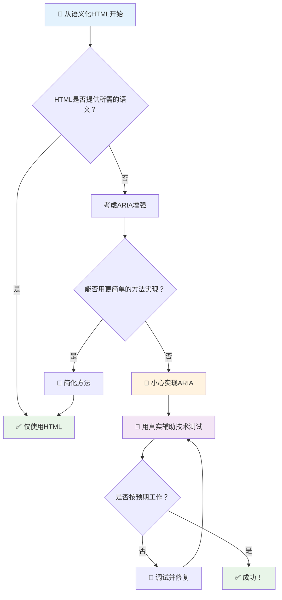
1. **语义 HTML 优先**：始终优先使用 `<button>` 而非 `<div role="button">`
2. **不破坏语义**：绝不覆盖已有的 HTML 含义（避免 `<h1 role="button">`）
3. **保持键盘可访问性**：所有交互式 ARIA 元素必须完全支持键盘操作
4. **与真实用户测试**：不同辅助技术的 ARIA 支持差异很大
5. **从简单开始**：复杂的 ARIA 实现更容易出错

**🔍 测试流程：**

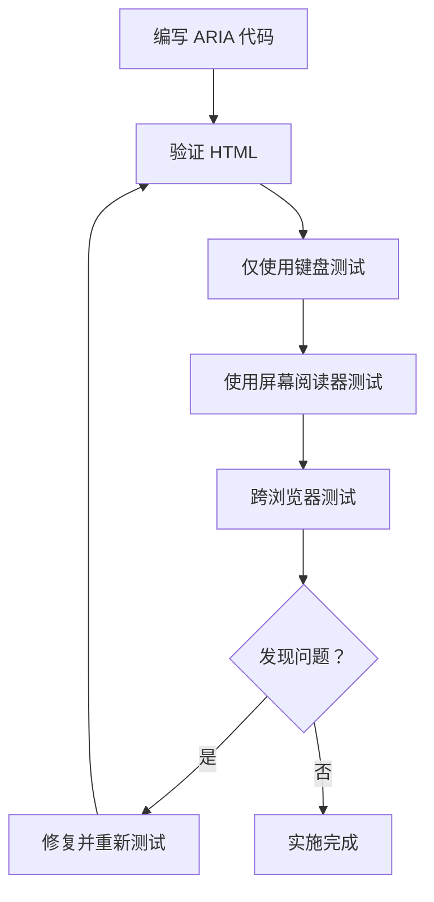
**🚫 常见 ARIA 错误避免：**

- **信息冲突**：不要与 HTML 语义相矛盾
- **过度标注**：太多 ARIA 信息会让用户不知所措
- **静态 ARIA**：忘记在内容变化时更新 ARIA 状态
- **未经测试的实现**：理论上可行但实际失败的 ARIA
- **缺失键盘支持**：有 ARIA 角色但缺少相应键盘交互

> 💡 **测试资源**：使用 [accessibility-checker](https://www.npmjs.com/package/accessibility-checker) 等工具进行自动 ARIA 验证，但始终用真实屏幕阅读器进行全面测试。

### 🎭 **ARIA 技能检测：准备好处理复杂交互了吗？**

**评估你的 ARIA 自信度：**
- 你什么时候会选择使用 ARIA 而非语义 HTML？（提示：几乎不会！）
- 你能解释为什么 `<div role="button">` 通常不如 `<button>` 吗？
- 关于 ARIA 测试，最重要的事情是什么？

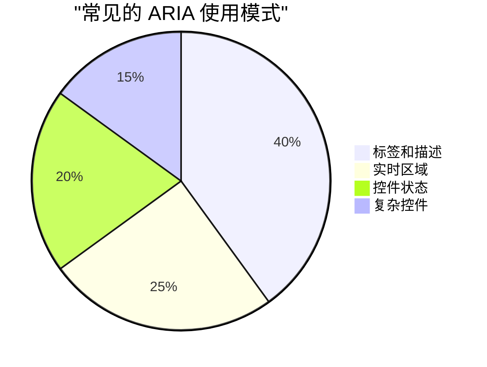
> **关键洞察**：大多数 ARIA 用于标注和描述元素。复杂控件模式远没有你想象的那么常见！

✅ **向专家学习**：研读 [ARIA Authoring Practices Guide](https://w3c.github.io/aria-practices/) ，了解经过实战检验的复杂交互控件模式和实现。

## 使图像和媒体无障碍

视觉和音频内容是现代网络体验的核心，但如果实现不当会造成障碍。目标是确保您的媒体信息与情感影响触及每位用户。掌握之后，它将成为习惯。

不同类型的媒体需要不同的无障碍方法。这就像烹饪 —— 你不会用对待丰富牛排的方式去处理细腻鱼类。理解这些差异有助于为每种情况选择合适方案。

### 图像无障碍策略

网站上的每张图像都有其用途。理解其用途有助于编写更好的替代文字，创造更包容的体验。

**四种图像类型及其 alt 文本策略：**

**信息性图像** - 传递重要信息：
```html

```

**装饰性图像** - 纯视觉，无信息价值：
```html

```

**功能性图像** - 作为按钮或控件：
```html
<button>
  
</button>
```

**复杂图像** - 图表、图解、信息图：
```html

<div id="chart-description">
  <p>Detailed description: Sales data shows a steady increase across all quarters...</p>
</div>
```

### 视频和音频无障碍

**视频要求：**
- **字幕**：口语内容及音效的文本版本
- **音频描述**：为盲人叙述视觉元素
- **文字记录**：所有音频和视觉内容的全文本版

```html
<video controls>
  <source src="video.mp4" type="video/mp4">
  <track kind="captions" src="captions.vtt" srclang="en" label="English">
  <track kind="descriptions" src="descriptions.vtt" srclang="en" label="Audio descriptions">
</video>
```

**音频要求：**
- **文字记录**：所有口语内容的文本版
- **视觉指示**：对纯音频内容提供视觉提示

### 现代图像技术

**用 CSS 实现装饰性图像：**
```css
.hero-section {
  background-image: url('decorative-hero.jpg');
  /* Decorative images in CSS don't need alt text */
}
```

**响应式图像与无障碍：**
```html
<picture>
  <source media="(min-width: 800px)" srcset="large-chart.png">
  <source media="(min-width: 400px)" srcset="medium-chart.png">
  
</picture>
```

✅ **测试图像无障碍**：用屏幕阅读器浏览带图像的页面。你能获得足够信息理解内容吗？

## 键盘导航和焦点管理

许多用户完全使用键盘浏览网页。这包括运动障碍者、觉得键盘比鼠标更快捷的高级用户，以及鼠标失灵的用户。确保网站键盘友好至关重要，且通常能提高所有用户的效率。

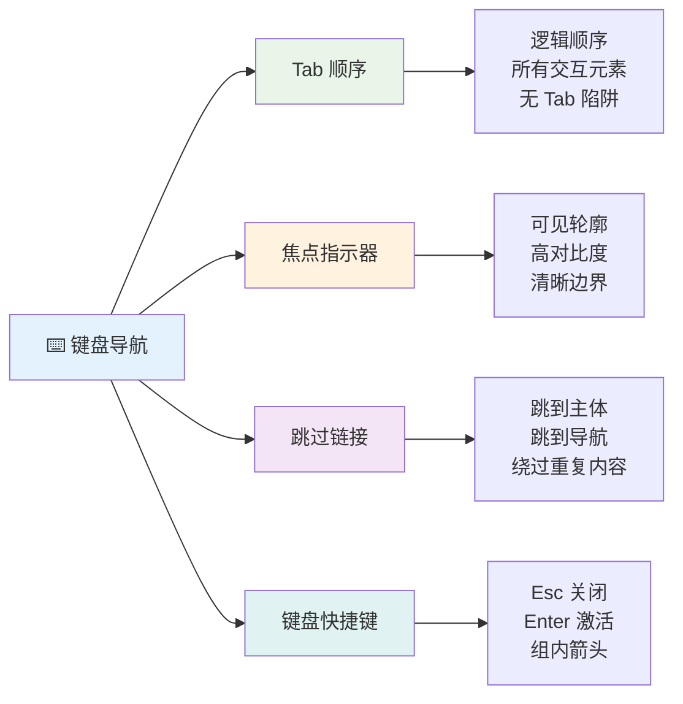
### 必要的键盘导航模式

**标准键盘交互：**
- **Tab**：向前遍历交互元素
- **Shift + Tab**：向后遍历
- **Enter**：激活按钮和链接
- **空格键**：激活按钮，勾选复选框
- **箭头键**：在组件组内导航（单选按钮、菜单）
- **Esc**：关闭模态框、下拉菜单或取消操作

### 焦点管理最佳实践

**可见焦点指示：**
```css
/* Ensure focus is always visible */
button:focus-visible {
  outline: 2px solid #4A90A4;
  outline-offset: 2px;
}

/* Custom focus styles for different components */
.card:focus-within {
  box-shadow: 0 0 0 3px rgba(74, 144, 164, 0.5);
}
```

**用于高效导航的跳过链接：**
```html
<a href="#main-content" class="skip-link">Skip to main content</a>
<a href="#navigation" class="skip-link">Skip to navigation</a>

<nav id="navigation">
  <!-- navigation content -->
</nav>
<main id="main-content">
  <!-- main content -->
</main>
```

**正确的 Tab 顺序：**
```html
<!-- Use semantic HTML for natural tab order -->
<form>
  <label for="name">Name:</label>
  <input type="text" id="name" tabindex="0">
  
  <label for="email">Email:</label>
  <input type="email" id="email" tabindex="0">
  
  <button type="submit" tabindex="0">Submit</button>
</form>
```

### 模态框中的焦点锁定

打开模态对话框时，焦点应锁定在模态框内：

```javascript
// 现代焦点陷阱实现
function trapFocus(element) {
  const focusableElements = element.querySelectorAll(
    'button, [href], input, select, textarea, [tabindex]:not([tabindex="-1"])'
  );
  
  const firstElement = focusableElements[0];
  const lastElement = focusableElements[focusableElements.length - 1];

  element.addEventListener('keydown', (e) => {
    if (e.key === 'Tab') {
      if (e.shiftKey && document.activeElement === firstElement) {
        e.preventDefault();
        lastElement.focus();
      } else if (!e.shiftKey && document.activeElement === lastElement) {
        e.preventDefault();
        firstElement.focus();
      }
    }
    
    if (e.key === 'Escape') {
      closeModal();
    }
  });
  
  // 模态打开时聚焦第一个元素
  firstElement.focus();
}
```

✅ **测试键盘导航**：尝试只用 Tab 键浏览网站。能访问所有交互元素吗？焦点顺序合理吗？焦点指示清晰可见吗？

## 表单无障碍

表单是用户交互的关键，需特别关注无障碍。

### 标签与表单控件关联

**每个控件都需要标签：**
```html
<!-- Explicit labeling (preferred) -->
<label for="username">Username:</label>
<input type="text" id="username" name="username" required>

<!-- Implicit labeling -->
<label>
  Password:
  <input type="password" name="password" required>
</label>

<!-- Using aria-label when visual label isn't desired -->
<input type="search" aria-label="Search products" placeholder="Search...">
```

### 错误处理和验证

**可访问的错误信息：**
```html
<label for="email">Email Address:</label>
<input type="email" id="email" name="email" 
       aria-describedby="email-error" 
       aria-invalid="true" required>
<div id="email-error" role="alert">
  Please enter a valid email address
</div>
```

**表单验证最佳实践：**
- 使用 `aria-invalid` 标识无效字段
- 提供清晰具体的错误提示
- 对重要错误使用 `role="alert"` 进行提示
- 错误显示应即时且提交时都呈现

### 字段集和分组

**分组相关的表单控件：**
```html
<fieldset>
  <legend>Shipping Address</legend>
  <label for="street">Street Address:</label>
  <input type="text" id="street" name="street">
  
  <label for="city">City:</label>
  <input type="text" id="city" name="city">
</fieldset>

<fieldset>
  <legend>Preferred Contact Method</legend>
  <input type="radio" id="contact-email" name="contact" value="email">
  <label for="contact-email">Email</label>
  
  <input type="radio" id="contact-phone" name="contact" value="phone">
  <label for="contact-phone">Phone</label>
</fieldset>
```

## 你的无障碍旅程：关键心得

恭喜！你已掌握创建真正包容性网页体验的基础知识。这真是令人振奋！网页无障碍不仅仅是核对符合标准——它关乎理解人们如何多样化地与数字内容互动，并为这种奇妙的复杂性设计。

你现在是理解优秀设计服务所有人的开发者社区的一员。欢迎加入！

**🎯 你的无障碍工具包包括：**

| 核心原则 | 实施方法 | 影响 |
|----------|----------|-------|
| **语义 HTML 基础** | 使用适用的 HTML 元素 | 屏幕阅读器高效导航，键盘自动工作 |
| **包容性视觉设计** | 足够的对比度，有意义的色彩使用，明显焦点指示 | 任何光线下都清晰可见 |
| **描述性内容** | 有意义的链接文本、alt 文本、标题 | 用户无需视觉上下文即可理解内容 |
| **键盘可访问性** | Tab 顺序，键盘快捷键，焦点管理 | 运动无障碍及高级用户效率提升 |
| **ARIA 增强** | 战略性填补语义空缺 | 复杂应用适配辅助技术 |
| **全面测试** | 自动化工具 + 手动验证 + 真实用户测试 | 在问题影响用户前发现它们 |

**🚀 你的下一步：**

1. **将无障碍纳入工作流程**：让测试成为开发自然环节
2. **向真实用户学习**：收集辅助技术用户反馈
3. **持续更新**：随着技术和标准变更更新无障碍技巧
4. **倡导包容**：分享知识，推动团队重视无障碍

> 💡 **记住**：无障碍限制常催生创新且优雅的解决方案。无障碍斜坡、字幕和语音控制最初都是无障碍特性，现已成为主流改进。

**商业理由非常明确**：无障碍网站触达更多用户，搜索排名更好，维护成本更低，法律风险更小。但坦白说？关心无障碍的真正原因更为深远。无障碍网站体现了网络最佳价值——开放、包容，以及人人应享平等访问信息的理念。

你现在有能力构建未来的包容性网络。你创建的每个无障碍网站都让互联网变得更加友好。这真的很了不起！

## 额外资源

继续你的无障碍学习旅程，以下是必备资源：

**📚 官方标准与指南：**
- [WCAG 2.1 指南](https://www.w3.org/WAI/WCAG21/quickref/) - 官方无障碍标准及快速参考
- [ARIA Authoring Practices Guide](https://w3c.github.io/aria-practices/) - 交互控件的全面模式
- [WebAIM 指南](https://webaim.org/) - 实用、适合初学者的无障碍指导

**🛠️ 工具与测试资源：**
- [axe DevTools](https://www.deque.com/axe/devtools/) - 行业标准的无障碍测试工具
- [A11y Project Checklist](https://www.a11yproject.com/checklist/) - 分步无障碍验证清单
- [Accessibility Insights](https://accessibilityinsights.io/) - 微软全面的测试套件
- [Color Oracle](https://colororacle.org/) - 色盲模拟器，辅助设计测试

**🎓 学习与社区：**
- [WebAIM 屏幕阅读器调查](https://webaim.org/projects/screenreadersurvey9/) - 真实用户偏好及行为
- [Inclusive Components](https://inclusive-components.design/) - 现代无障碍组件模式
- [A11y Coffee](https://a11y.coffee/) - 快速无障碍技巧与见解
- [Web Accessibility Initiative (WAI)](https://www.w3.org/WAI/) - W3C 综合无障碍资源

**🎥 实操学习：**
- [Accessibility Developer Guide](https://www.accessibility-developer-guide.com/) - 实践实施指导
- [Deque University](https://dequeuniversity.com/) - 专业无障碍培训课程

## GitHub Copilot Agent 挑战 🚀

使用 Agent 模式完成以下挑战：

**描述：** 创建一个无障碍模态对话框组件，展示正确的焦点管理、ARIA 属性和键盘导航模式。

**提示：** 构建一个完整的模态对话框组件，包含 HTML，CSS，JavaScript，具备正确的焦点锁定，ESC 键关闭，点击外部关闭，屏幕阅读器所需 ARIA 属性，可见焦点指示。模态内包含带正确标签和错误处理的表单。确保符合 WCAG 2.1 AA 标准。

## 🚀 挑战

请根据你学到的策略，用更无障碍的方式重写以下 HTML。

```html
<!DOCTYPE html>
<html lang="en">
  <head>
    <meta charset="UTF-8">
    <meta name="viewport" content="width=device-width, initial-scale=1.0">
    <title>Turtle Ipsum - The World's Premier Turtle Fan Club</title>
    <link href='../assets/style.css' rel='stylesheet' type='text/css'>
  </head>
  <body>
    <header class="site-header">
      <h1 class="site-title">Turtle Ipsum</h1>
      <p class="site-subtitle">The World's Premier Turtle Fan Club</p>
    </header>
    
    <nav class="main-nav" aria-label="Main navigation">
      <h2 class="nav-header">Resources</h2>
      <ul class="nav-list">
        <li><a href="https://www.youtube.com/watch?v=CMNry4PE93Y">"I like turtles" video</a></li>
        <li><a href="https://en.wikipedia.org/wiki/Turtle">Basic turtle information</a></li>
        <li><a href="https://en.wikipedia.org/wiki/Turtles_(chocolate)">Chocolate turtles candy</a></li>
      </ul>
    </nav>
    
    <main class="main-content">
      <article>
        <h1>Welcome to Turtle Ipsum</h1>
        <p class="intro">
          <a href="/about">Learn more about our turtle community</a> and discover fascinating facts about these amazing creatures.
        </p>
        <p class="article-text">
          Turtle ipsum dolor sit amet, consectetur adipiscing elit, sed do eiusmod tempor incididunt ut labore et dolore magna aliqua. Ut enim ad minim veniam, quis nostrud exercitation ullamco laboris nisi ut aliquip ex ea commodo consequat. Duis aute irure dolor in reprehenderit in voluptate velit esse cillum dolore eu fugiat nulla pariatur. Excepteur sint occaecat cupidatat non proident, sunt in culpa qui officia deserunt mollit anim id est laborum.
        </p>
      </article>
    </main>
    
    <footer class="footer">
      <section class="newsletter-signup">
        <h2>Stay Updated</h2>
        <button type="button" onclick="showNewsletterForm()">Sign up for turtle news</button>
      </section>
      
      <nav class="footer-nav" aria-label="Footer navigation">
        <h2>Site Pages</h2>
        <ul>
          <li><a href="../">Home</a></li>
          <li><a href="../semantic">Semantic HTML example</a></li>
        </ul>
      </nav>
      
      <p class="footer-copyright">&copy; 2024 Instrument. All rights reserved.</p>
    </footer>
  </body>
</html>
```

**主要改进点：**
- 添加了正确的语义 HTML 结构
- 修正了标题层级（单一 h1，逻辑递进）
- 替换了“点击这里”为有意义的链接文本
- 添加了适当的导航 ARIA 标签
- 添加了 lang 属性和合适的 meta 标签
- 互动元素使用 button 元素
- 底部内容结构采用正确的地标元素

## 课后测验
[课后测验](https://ff-quizzes.netlify.app/web/en/)

## 复习与自学

许多政府对无障碍有法律要求。请阅读你所在国家的无障碍法律，了解覆盖内容和不涉及的部分。一个例子是 [这个政府网站](https://accessibility.blog.gov.uk/)。

## 作业

[分析一个无障碍不足的网站](assignment.md)

鸣谢：[Turtle Ipsum](https://github.com/Instrument/semantic-html-sample) — Instrument 提供

---

## 🚀 你的无障碍精通时间表

### ⚡ **接下来的 5 分钟你可以做什么**
- [ ] 在浏览器中安装 axe DevTools 扩展
- [ ] 在你喜欢的网站上运行 Lighthouse 无障碍审计
- [ ] 尝试仅用 Tab 键导航任意网站
- [ ] 测试浏览器内置屏幕阅读器（Narrator/VoiceOver）

### 🎯 **本小时你可以完成什么**
- [ ] 完成课后测验，反思无障碍见解
- [ ] 为 10 张不同图片练习编写有意义的 alt 文本
- [ ] 用 HeadingsMap 扩展审核一个网站的标题结构
- [ ] 修复挑战 HTML 中发现的无障碍问题
- [ ] 用 WebAIM 工具测试当前项目的色彩对比度

### 📅 **你为期一周的无障碍旅程**
- [ ] 完成分析无障碍不足网站的作业
- [ ] 搭建含无障碍测试工具的开发环境
- [ ] 在5个不同的复杂网站上练习键盘导航  
- [ ] 构建一个带有适当标签、错误处理和ARIA的简单表单  
- [ ] 加入无障碍社区（A11y Slack，WebAIM论坛）  
- [ ] 观看残障用户浏览网站的视频（YouTube上有很好的例子）  

### 🌟 **你为期一个月的转变**  
- [ ] 将无障碍测试集成到你的开发工作流程中  
- [ ] 通过修复无障碍问题为开源项目做贡献  
- [ ] 与使用辅助技术的用户进行可用性测试  
- [ ] 为你的团队构建一个无障碍组件库  
- [ ] 在你的工作场所或社区中倡导无障碍  
- [ ] 指导刚接触无障碍概念的人  

### 🏆 **最终无障碍冠军检查点**  

**庆祝你的无障碍之旅：**  
- 你学到的最令人惊讶的关于人们如何使用网络的事情是什么？  
- 哪个无障碍原则与你的开发风格最契合？  
- 学习无障碍如何改变了你对设计的看法？  
- 你希望在真实项目中首先进行的无障碍改进是什么？  

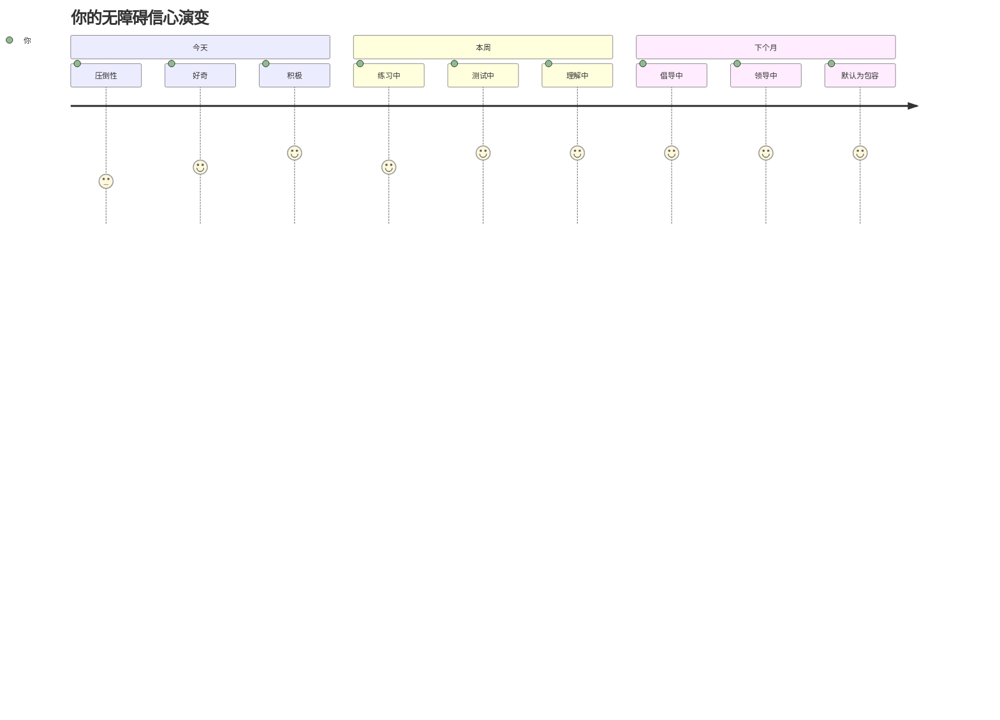
> 🌍 **你现在是一名无障碍冠军！** 你明白优秀的网络体验适合所有人，无论他们如何访问网络。你构建的每一个无障碍功能都使互联网更具包容性。网络需要像你这样，将无障碍视为机会而非限制的开发者，从而为所有用户创造更好的体验。欢迎加入这场运动！ 🎉

---

<!-- CO-OP TRANSLATOR DISCLAIMER START -->
**免责声明**：
本文件使用 AI 翻译服务 [Co-op Translator](https://github.com/Azure/co-op-translator) 翻译。虽然我们力求准确，但请注意自动翻译可能包含错误或不准确之处。原始文件的母语版本应被视为权威来源。对于重要信息，建议采用专业人工翻译。我们不对因使用本翻译而产生的任何误解或误释承担责任。
<!-- CO-OP TRANSLATOR DISCLAIMER END -->