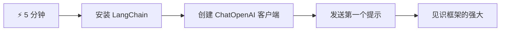
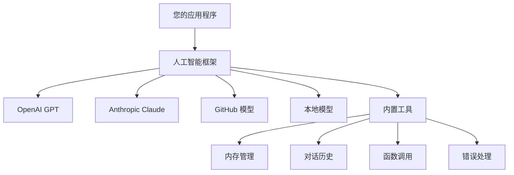
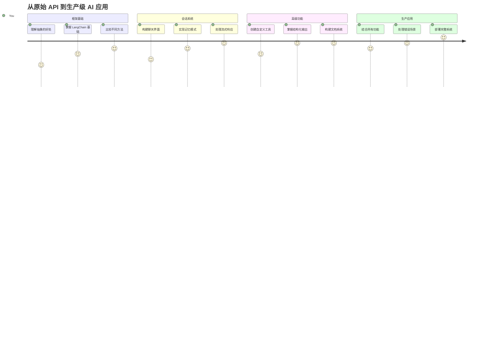
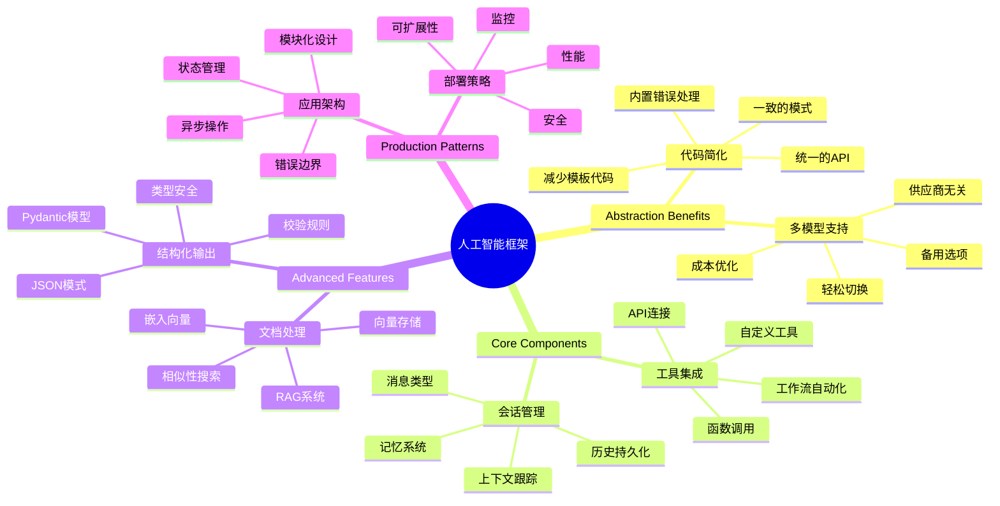
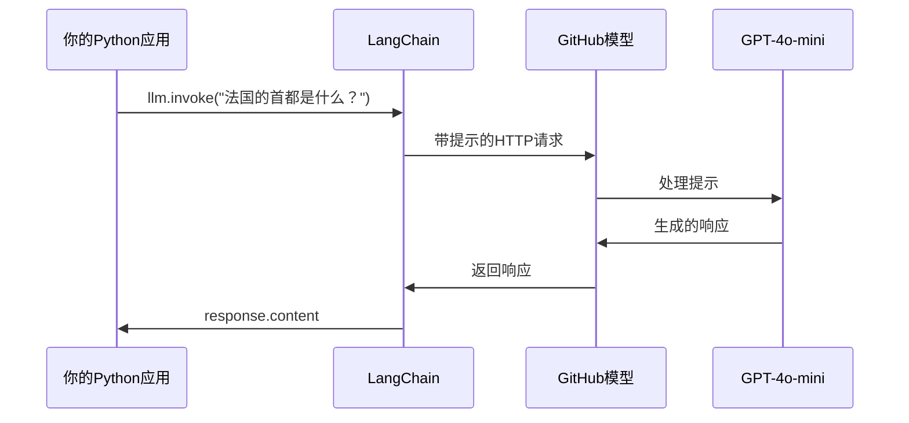
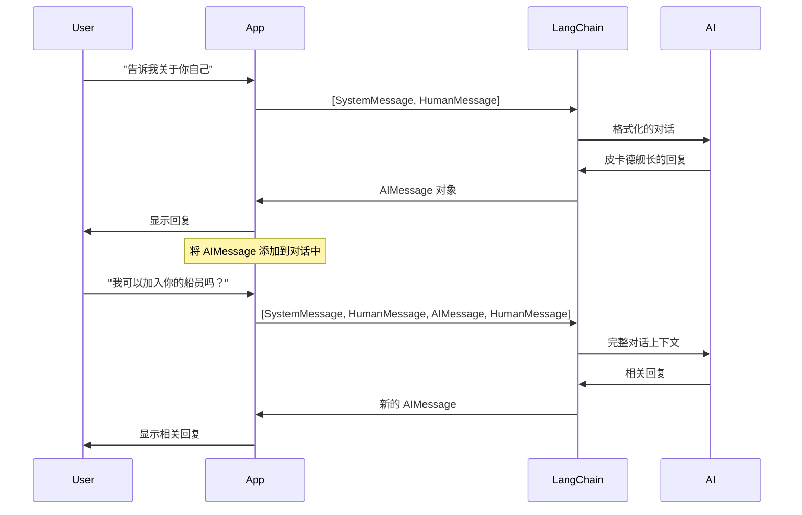
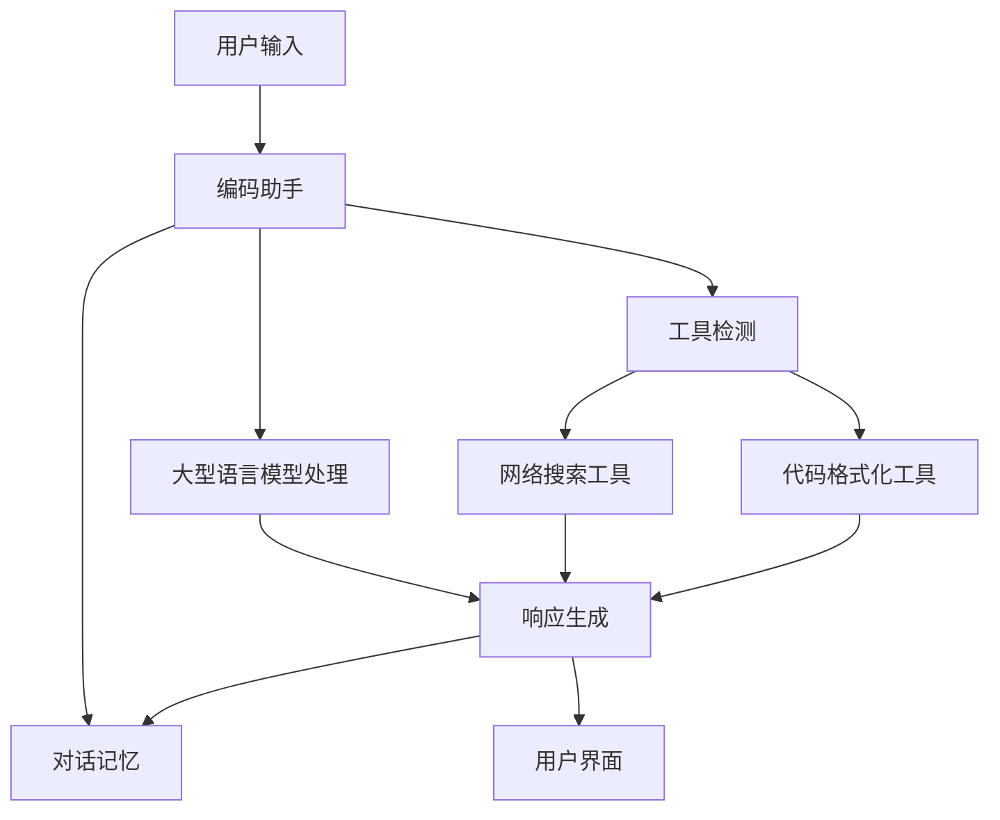
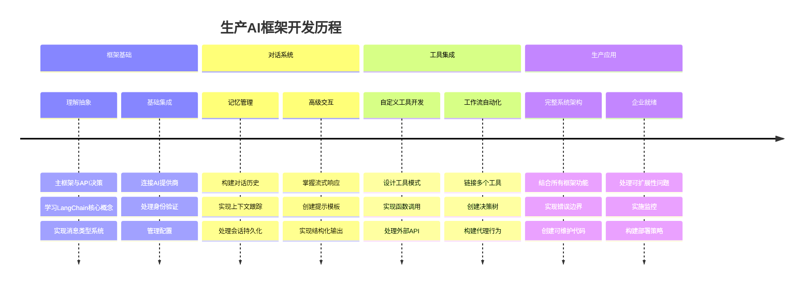
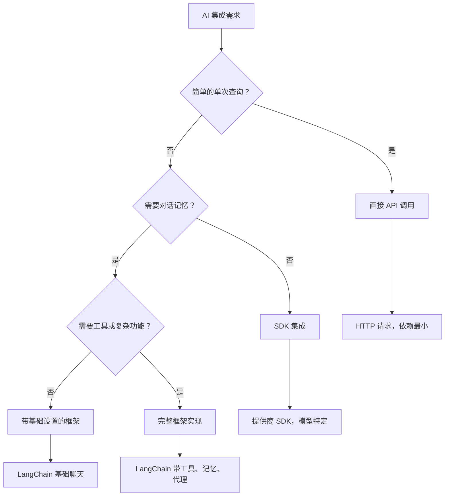

# AI 框架

曾经觉得从头开始构建 AI 应用令人不知所措吗？你并不孤单！AI 框架就像 AI 开发的瑞士军刀——它们是强大的工具，可以在构建智能应用时为你节省时间和烦恼。把 AI 框架想象成一个组织良好的库：它提供预构建组件、标准化 API 以及智能抽象，让你可以专注于解决问题，而不是与实现细节搏斗。

在本课中，我们将探讨像 LangChain 这样的框架如何将过去复杂的 AI 集成任务转变为清晰、可读的代码。你将学会如何应对诸如保持对话跟踪、实现工具调用以及通过统一接口管理多个 AI 模型等现实挑战。

课程结束时，你将知道何时选择框架而非直接调用 API，如何有效使用它们的抽象，以及如何构建适合实际应用的 AI 应用。让我们一起来探索 AI 框架能为你的项目带来什么。

## ⚡ 接下来5分钟内你能做什么

**忙碌开发者的快速入门路径**


- **第1分钟**：安装 LangChain：`pip install langchain langchain-openai`
- **第2分钟**：设置你的 GitHub 令牌并导入 ChatOpenAI 客户端
- **第3分钟**：创建一个包含系统和人工消息的简单对话
- **第4分钟**：添加一个基础工具（如加法函数）并体验 AI 工具调用
- **第5分钟**：体验原始 API 调用和框架抽象之间的区别

**快速测试代码**：
```python
from langchain_openai import ChatOpenAI
from langchain_core.messages import SystemMessage, HumanMessage

llm = ChatOpenAI(
    api_key=os.environ["GITHUB_TOKEN"],
    base_url="https://models.github.ai/inference",
    model="openai/gpt-4o-mini"
)

response = llm.invoke([
    SystemMessage(content="You are a helpful coding assistant"),
    HumanMessage(content="Explain Python functions briefly")
])
print(response.content)
```

**为什么这很重要**：5分钟内，你将感受到 AI 框架如何将复杂的 AI 集成转变为简单的方法调用。这是支撑生产级 AI 应用的基础。

## 为什么选择框架？

你已经准备好构建一个 AI 应用——太棒了！但问题是：你可以选择几种不同的路径，每种都有自己的优缺点。这有点像选择走路、自行车或开车去某地——它们都能到达，但是体验（和付出的努力）完全不同。

让我们来拆解三种主要的 AI 集成方式：

| 方式 | 优势 | 适用场景 | 注意事项 |
|----------|------------|----------|--------------|
| **直接 HTTP 请求** | 完全控制，无依赖 | 简单查询，学习基础 | 代码更冗长，需手动处理错误 |
| **SDK 集成** | 减少样板代码，特定模型优化 | 单一模型应用 | 限于特定服务商 |
| **AI 框架** | 统一 API，内置抽象 | 多模型应用，复杂工作流 | 学习曲线，可能过度抽象 |

### 框架带来的实际好处


**框架为何重要：**
- **统一**多家 AI 提供商于一个接口下
- **自动处理**对话记忆
- **提供**常见任务的现成工具，如嵌入和函数调用
- **管理**错误处理和重试逻辑
- **将**复杂工作流转换为可读的方法调用

> 💡 **专业提示**：当需要在不同 AI 模型间切换或构建复杂功能（如代理、记忆或工具调用）时，选用框架。学习基础或构建简单、专注的应用时，则坚持使用直接 API。

**总结**：就像选择使用工匠的专用工具还是完整工作坊一样，关键是让工具匹配任务。框架在复杂、功能丰富的应用中表现优异，而直接 API 更适合简单场景。

## 🗺️ 你的 AI 框架学习之旅


**你的目标**：课程结束时，你将掌握 AI 框架开发，能够构建复杂、生产就绪的 AI 应用，媲美商用 AI 助手。

## 介绍

本课目标：

- 使用通用 AI 框架。
- 解决常见问题，如聊天对话、工具使用、记忆与上下文。
- 利用这些构建 AI 应用。

## 🧠 AI 框架开发生态


**核心原则**：AI 框架将复杂性抽象化，同时提供强大的对话管理、工具集成与文档处理抽象，使开发者能够用整洁、可维护的代码构建复杂 AI 应用。

## 你的第一个 AI 提示

让我们从基础开始，创建你的第一个 AI 应用，它发送一个问题并得到回复。就像阿基米德在浴缸中发现位移原理一样，有时最简单的观察带来最强大的见解——框架让这些见解触手可及。

### 使用 LangChain 连接 GitHub 模型

我们将用 LangChain 连接到 GitHub 模型，这很棒，因为它让你可以免费访问各种 AI 模型。最重要的是？只需几个简单的配置参数即可开始：

```python
from langchain_openai import ChatOpenAI
import os

llm = ChatOpenAI(
    api_key=os.environ["GITHUB_TOKEN"],
    base_url="https://models.github.ai/inference",
    model="openai/gpt-4o-mini",
)

# 发送一个简单的提示
response = llm.invoke("What's the capital of France?")
print(response.content)
```

**解析代码发生了什么：**
- **创建**一个 LangChain 客户端，使用 `ChatOpenAI` 类——这是你通往 AI 的大门！
- **配置**连接到 GitHub 模型，使用你的认证令牌
- **指定**使用哪款 AI 模型（`gpt-4o-mini`）——把它当作选择 AI 助手
- **发送**你的问题，通过 `invoke()` 方法——魔法就发生在这里
- **提取**并展示响应——瞧，你已经开始跟 AI 对话啦！

> 🔧 **设置提示**：如果你在使用 GitHub Codespaces，幸运的是 `GITHUB_TOKEN` 已自动配置！如果本地运行，不用担心，只需创建一个带合适权限的个人访问令牌。

**预期输出：**
```text
The capital of France is Paris.
```


## 构建对话式 AI

第一个示例演示了基础，但它只是单轮交互——你提问，得到答复，仅此而已。在实际应用中，你希望 AI 记得之前的对话内容，就像华生和福尔摩斯随时间积累调查对话一样。

这时候 LangChain 显得特别有用。它提供了不同的消息类型，帮助你结构化对话，并赋予 AI 个性。你将构建维持上下文和角色的聊天体验。

### 理解消息类型

把这些消息类型视为对话中参与者戴的不同“帽子”。LangChain 使用不同的消息类跟踪谁说了什么：

| 消息类型 | 作用 | 示例用途 |
|--------------|---------|------------------|
| `SystemMessage` | 定义 AI 个性与行为 | “你是一个乐于助人的编码助手” |
| `HumanMessage` | 代表用户输入 | “解释函数是如何工作的” |
| `AIMessage` | 存储 AI 回复 | 对话中的先前 AI 回复 |

### 创建你的第一个对话

让我们创建一个让 AI 扮演特定角色的对话。它将化身为皮卡德船长——以其外交智慧和领导力著称的角色：

```python
messages = [
    SystemMessage(content="You are Captain Picard of the Starship Enterprise"),
    HumanMessage(content="Tell me about you"),
]
```

**解析对话设置：**
- **通过 `SystemMessage`**确立 AI 的角色和个性
- **通过 `HumanMessage`**提供初始用户查询
- **为多轮对话**奠定基础

完整代码示例如下：

```python
from langchain_core.messages import HumanMessage, SystemMessage
from langchain_openai import ChatOpenAI
import os

llm = ChatOpenAI(
    api_key=os.environ["GITHUB_TOKEN"],
    base_url="https://models.github.ai/inference",
    model="openai/gpt-4o-mini",
)

messages = [
    SystemMessage(content="You are Captain Picard of the Starship Enterprise"),
    HumanMessage(content="Tell me about you"),
]


# 工作
response  = llm.invoke(messages)
print(response.content)
```

你会看到类似这样的结果：

```text
I am Captain Jean-Luc Picard, the commanding officer of the USS Enterprise (NCC-1701-D), a starship in the United Federation of Planets. My primary mission is to explore new worlds, seek out new life and new civilizations, and boldly go where no one has gone before. 

I believe in the importance of diplomacy, reason, and the pursuit of knowledge. My crew is diverse and skilled, and we often face challenges that test our resolve, ethics, and ingenuity. Throughout my career, I have encountered numerous species, grappled with complex moral dilemmas, and have consistently sought peaceful solutions to conflicts.

I hold the ideals of the Federation close to my heart, believing in the importance of cooperation, understanding, and respect for all sentient beings. My experiences have shaped my leadership style, and I strive to be a thoughtful and just captain. How may I assist you further?
```

为了维持对话连续性（而非每次重置上下文），你需要不断把回复添加到消息列表中。就像口耳相传的故事代代相传，这种方法建立了持久记忆：

```python
from langchain_core.messages import HumanMessage, SystemMessage
from langchain_openai import ChatOpenAI
import os

llm = ChatOpenAI(
    api_key=os.environ["GITHUB_TOKEN"],
    base_url="https://models.github.ai/inference",
    model="openai/gpt-4o-mini",
)

messages = [
    SystemMessage(content="You are Captain Picard of the Starship Enterprise"),
    HumanMessage(content="Tell me about you"),
]


# 工作
response  = llm.invoke(messages)

print(response.content)

print("---- Next ----")

messages.append(response)
messages.append(HumanMessage(content="Now that I know about you, I'm Chris, can I be in your crew?"))

response  = llm.invoke(messages)

print(response.content)

```

是不是很酷？这里发生的是，我们调用了两次 LLM ——第一次只用最初的两条消息，第二次用完整的对话历史。感觉 AI 真正跟上了我们的聊天节奏！

运行代码时，你会得到这样第二条回复：

```text
Welcome aboard, Chris! It's always a pleasure to meet those who share a passion for exploration and discovery. While I cannot formally offer you a position on the Enterprise right now, I encourage you to pursue your aspirations. We are always in need of talented individuals with diverse skills and backgrounds. 

If you are interested in space exploration, consider education and training in the sciences, engineering, or diplomacy. The values of curiosity, resilience, and teamwork are crucial in Starfleet. Should you ever find yourself on a starship, remember to uphold the principles of the Federation: peace, understanding, and respect for all beings. Your journey can lead you to remarkable adventures, whether in the stars or on the ground. Engage!
```


我觉得这答案有点可能吧 ;)

## 流式响应

有没有注意到 ChatGPT 看似“实时”键入回复？那就是流式响应。就像看书法家写字，一笔一划出现，而不是瞬间展示——流式让交互更加自然，提供即时反馈。

### 用 LangChain 实现流式

```python
from langchain_openai import ChatOpenAI
import os

llm = ChatOpenAI(
    api_key=os.environ["GITHUB_TOKEN"],
    base_url="https://models.github.ai/inference",
    model="openai/gpt-4o-mini",
    streaming=True
)

# 流式传输响应
for chunk in llm.stream("Write a short story about a robot learning to code"):
    print(chunk.content, end="", flush=True)
```

**流式响应的优点：**
- **边生成边显示内容**——不用再尴尬等待！
- **让用户感觉有实质进展**
- **感觉更快**，即使技术上不然
- **让用户边“思考”边开始阅读**

> 💡 **用户体验技巧**：处理较长回复时，如代码讲解、创意写作或详细教程，流式效果尤为出色。用户会喜欢看见进度，而非看着空白屏幕！

### 🎯 教学小结：框架抽象好处

**暂停思考**：你刚体验了 AI 框架抽象的威力。对比之前的原始 API 调用。

**快速自评**：
- 能否解释 LangChain 如何简化对话管理，相较于手动跟踪消息？
- `invoke()` 和 `stream()` 方法有什么区别？何时使用？
- 框架的消息类型系统如何改进代码组织？

**现实连接**：你学到的抽象模式（消息类型、流接口、对话记忆）被所有主流 AI 应用采纳——从 ChatGPT 界面到 GitHub Copilot 编码辅助。你正掌握专业 AI 团队同样的架构模式。

**挑战问题**：你会如何设计一个框架抽象，以用单一接口处理不同 AI 模型提供商（OpenAI、Anthropic、Google）？请权衡利弊。

## 提示模板

提示模板就像经典演讲中的修辞结构——想象西塞罗如何针对不同听众调整演讲模式，同时保持同一说服框架。它让你创建可复用提示，能替换不同信息而无需重写全部内容。模板一旦搭建好，只需填写变量即可。

### 创建可复用提示

```python
from langchain_core.prompts import ChatPromptTemplate

# 定义代码解释的模板
template = ChatPromptTemplate.from_messages([
    ("system", "You are an expert programming instructor. Explain concepts clearly with examples."),
    ("human", "Explain {concept} in {language} with a practical example for {skill_level} developers")
])

# 使用模板并替换不同的值
questions = [
    {"concept": "functions", "language": "JavaScript", "skill_level": "beginner"},
    {"concept": "classes", "language": "Python", "skill_level": "intermediate"},
    {"concept": "async/await", "language": "JavaScript", "skill_level": "advanced"}
]

for question in questions:
    prompt = template.format_messages(**question)
    response = llm.invoke(prompt)
    print(f"Topic: {question['concept']}\n{response.content}\n---\n")
```

**你会喜欢模板的原因：**
- **保持**提示在整个应用中的一致性
- **不再**乱拼字符串，只需干净简洁的变量
- **AI 的行为**更可预测，因为结构不变
- **更新**更轻松——改模板，一处生效全局

## 结构化输出

是否曾为解析 AI 返回的非结构化文本感到头疼？结构化输出就像林奈生物分类体系那样系统——有组织、可预测、易操作。你可以要求 JSON、特定数据结构或任何需要的格式。

### 定义输出模式

```python
from langchain_core.prompts import ChatPromptTemplate
from langchain_core.output_parsers import JsonOutputParser
from pydantic import BaseModel, Field

class CodeReview(BaseModel):
    score: int = Field(description="Code quality score from 1-10")
    strengths: list[str] = Field(description="List of code strengths")
    improvements: list[str] = Field(description="List of suggested improvements")
    overall_feedback: str = Field(description="Summary feedback")

# 设置解析器
parser = JsonOutputParser(pydantic_object=CodeReview)

# 创建带格式说明的提示
prompt = ChatPromptTemplate.from_messages([
    ("system", "You are a code reviewer. {format_instructions}"),
    ("human", "Review this code: {code}")
])

# 用说明格式化提示
chain = prompt | llm | parser

# 获取结构化响应
code_sample = """
def calculate_average(numbers):
    return sum(numbers) / len(numbers)
"""

result = chain.invoke({
    "code": code_sample,
    "format_instructions": parser.get_format_instructions()
})

print(f"Score: {result['score']}")
print(f"Strengths: {', '.join(result['strengths'])}")
```

**结构化输出的改变游戏规则的理由：**
- **不再**猜测返回格式——每次都一致
- **无缝**对接数据库和接口，无需额外转换
- **捕获**异常 AI 响应，避免应用崩溃
- **让**代码更简洁，因为你知道具体数据结构

## 工具调用

现在进入最强大的功能之一：工具。这是你赋予 AI 实际能力的方式，超出简单对话。就像中世纪行会为特定工艺开发专用工具一样，你可以装备 AI 以聚焦工具。你描述可用工具，当请求匹配时，AI 可执行操作。

### 使用 Python

让我们添加一些工具：

```python
from typing_extensions import Annotated, TypedDict

class add(TypedDict):
    """Add two integers."""

    # 注解必须有类型，并且可以选择性地包含默认值和描述（按此顺序）。
    a: Annotated[int, ..., "First integer"]
    b: Annotated[int, ..., "Second integer"]

tools = [add]

functions = {
    "add": lambda a, b: a + b
}
```

这段代码做了什么？我们为名为 `add` 的工具创建了蓝图。通过继承 `TypedDict` 并为 `a` 和 `b` 使用那些精妙的 `Annotated` 类型，我们向 LLM 清晰地描述了这个工具的功能和需求。`functions` 字典就像我们的工具箱——告诉代码在 AI 决定使用某工具时该怎么做。

接下来来看我们如何用这个工具调用 LLM：

```python
llm = ChatOpenAI(
    api_key=os.environ["GITHUB_TOKEN"],
    base_url="https://models.github.ai/inference",
    model="openai/gpt-4o-mini",
)

llm_with_tools = llm.bind_tools(tools)
```

这里我们用 `tools` 数组调用 `bind_tools`，因而带工具的 LLM `llm_with_tools` 现在具备这个工具的知识。

要使用这个新的 LLM，可以这样写代码：

```python
query = "What is 3 + 12?"

res = llm_with_tools.invoke(query)
if(res.tool_calls):
    for tool in res.tool_calls:
        print("TOOL CALL: ", functions[tool["name"]](../../../10-ai-framework-project/**tool["args"]))
print("CONTENT: ",res.content)
```

现在调用带工具的这个新 llm 的 `invoke`，可能会生成 `tool_calls` 属性。如果有的话，任何被识别的工具都会有 `name` 和 `args` 属性，指明应调用的工具及其参数。完整代码如下：

```python
from langchain_core.messages import HumanMessage, SystemMessage
from langchain_openai import ChatOpenAI
import os
from typing_extensions import Annotated, TypedDict

class add(TypedDict):
    """Add two integers."""

    # 注释必须有类型，并且可以选择性地包含默认值和描述（按该顺序）。
    a: Annotated[int, ..., "First integer"]
    b: Annotated[int, ..., "Second integer"]

tools = [add]

functions = {
    "add": lambda a, b: a + b
}

llm = ChatOpenAI(
    api_key=os.environ["GITHUB_TOKEN"],
    base_url="https://models.github.ai/inference",
    model="openai/gpt-4o-mini",
)

llm_with_tools = llm.bind_tools(tools)

query = "What is 3 + 12?"

res = llm_with_tools.invoke(query)
if(res.tool_calls):
    for tool in res.tool_calls:
        print("TOOL CALL: ", functions[tool["name"]](../../../10-ai-framework-project/**tool["args"]))
print("CONTENT: ",res.content)
```

运行这段代码时，你应看到类似输出：

```text
TOOL CALL:  15
CONTENT: 
```

AI 对“3 + 12 等于多少？”进行了分析，认定这是 `add` 工具的任务。就像有经验的图书管理员根据问题类型确定参考书一样，它通过工具名字、描述和字段规格做出判断。结果 15 来自我们的 `functions` 字典执行该工具：

```python
print("TOOL CALL: ", functions[tool["name"]](../../../10-ai-framework-project/**tool["args"]))
```

### 一个更有趣的调用 Web API 的工具
添加数字演示了这个概念，但真正的工具通常执行更复杂的操作，比如调用 Web API。让我们扩展示例，让 AI 从互联网上获取内容——类似于电报操作员曾经连接遥远地点的方式：

```python
class joke(TypedDict):
    """Tell a joke."""

    # 注释必须包含类型，并且可以选择性地包括默认值和描述（按此顺序）。
    category: Annotated[str, ..., "The joke category"]

def get_joke(category: str) -> str:
    response = requests.get(f"https://api.chucknorris.io/jokes/random?category={category}", headers={"Accept": "application/json"})
    if response.status_code == 200:
        return response.json().get("value", f"Here's a {category} joke!")
    return f"Here's a {category} joke!"

functions = {
    "add": lambda a, b: a + b,
    "joke": lambda category: get_joke(category)
}

query = "Tell me a joke about animals"

# 其余代码保持不变
```

现在如果你运行这段代码，你会得到类似下面的响应：

```text
TOOL CALL:  Chuck Norris once rode a nine foot grizzly bear through an automatic car wash, instead of taking a shower.
CONTENT:  
```

```mermaid
flowchart TD
    A[用户查询: "告诉我一个关于动物的笑话"] --> B[LangChain 分析]
    B --> C{有可用工具吗？}
    C -->|是| D[选择笑话工具]
    C -->|否| E[生成直接响应]
    
    D --> F[提取参数]
    F --> G[调用笑话(category="animals")]
    G --> H[向 chucknorris.io 发送 API 请求]
    H --> I[返回笑话内容]
    I --> J[展示给用户]
    
    E --> K[AI 生成的响应]
    K --> J
    
    subgraph "工具定义层"
        L[TypedDict 模式]
        M[函数实现]
        N[参数验证]
    end
    
    D --> L
    F --> N
    G --> M
```
以下是完整代码：

```python
from langchain_openai import ChatOpenAI
import requests
import os
from typing_extensions import Annotated, TypedDict

class add(TypedDict):
    """Add two integers."""

    # 注解必须有类型，并且可以选择性地包含默认值和描述（按此顺序）。
    a: Annotated[int, ..., "First integer"]
    b: Annotated[int, ..., "Second integer"]

class joke(TypedDict):
    """Tell a joke."""

    # 注解必须有类型，并且可以选择性地包含默认值和描述（按此顺序）。
    category: Annotated[str, ..., "The joke category"]

tools = [add, joke]

def get_joke(category: str) -> str:
    response = requests.get(f"https://api.chucknorris.io/jokes/random?category={category}", headers={"Accept": "application/json"})
    if response.status_code == 200:
        return response.json().get("value", f"Here's a {category} joke!")
    return f"Here's a {category} joke!"

functions = {
    "add": lambda a, b: a + b,
    "joke": lambda category: get_joke(category)
}

llm = ChatOpenAI(
    api_key=os.environ["GITHUB_TOKEN"],
    base_url="https://models.github.ai/inference",
    model="openai/gpt-4o-mini",
)

llm_with_tools = llm.bind_tools(tools)

query = "Tell me a joke about animals"

res = llm_with_tools.invoke(query)
if(res.tool_calls):
    for tool in res.tool_calls:
        # print("工具调用: ", tool)
        print("TOOL CALL: ", functions[tool["name"]](../../../10-ai-framework-project/**tool["args"]))
print("CONTENT: ",res.content)
```

## 嵌入向量与文档处理

嵌入向量是现代 AI 中最优雅的解决方案之一。想象一下，你可以将任何文本转换成捕捉其意义的数值坐标。这正是嵌入向量所做的 - 它们将文本转化为多维空间中的点，相似的概念聚集在一起。这就像为思想建立了一个坐标系统，类似于门捷列夫如何根据原子性质组织元素周期表。

### 创建和使用嵌入向量

```python
from langchain_openai import OpenAIEmbeddings
from langchain_community.vectorstores import FAISS
from langchain_community.document_loaders import TextLoader
from langchain.text_splitter import CharacterTextSplitter

# 初始化嵌入
embeddings = OpenAIEmbeddings(
    api_key=os.environ["GITHUB_TOKEN"],
    base_url="https://models.github.ai/inference",
    model="text-embedding-3-small"
)

# 加载并拆分文档
loader = TextLoader("documentation.txt")
documents = loader.load()

text_splitter = CharacterTextSplitter(chunk_size=1000, chunk_overlap=0)
texts = text_splitter.split_documents(documents)

# 创建向量存储
vectorstore = FAISS.from_documents(texts, embeddings)

# 执行相似度搜索
query = "How do I handle user authentication?"
similar_docs = vectorstore.similarity_search(query, k=3)

for doc in similar_docs:
    print(f"Relevant content: {doc.page_content[:200]}...")
```

### 各种格式的文档加载器

```python
from langchain_community.document_loaders import (
    PyPDFLoader,
    CSVLoader,
    JSONLoader,
    WebBaseLoader
)

# 加载不同类型的文档
pdf_loader = PyPDFLoader("manual.pdf")
csv_loader = CSVLoader("data.csv")
json_loader = JSONLoader("config.json")
web_loader = WebBaseLoader("https://example.com/docs")

# 处理所有文档
all_documents = []
for loader in [pdf_loader, csv_loader, json_loader, web_loader]:
    docs = loader.load()
    all_documents.extend(docs)
```

**使用嵌入向量可以做的事情：**
- **构建**真正理解你意思的搜索，而不仅仅是关键词匹配
- **创建**能够回答你文档问题的 AI
- **制作**能够推荐真正相关内容的推荐系统
- **自动**组织和分类你的内容

```mermaid
flowchart LR
    A[文档] --> B[文本拆分器]
    B --> C[创建嵌入]
    C --> D[向量存储]
    
    E[用户查询] --> F[查询嵌入]
    F --> G[相似度搜索]
    G --> D
    D --> H[相关文档]
    H --> I[AI 回答]
    
    subgraph "向量空间"
        J[文档 A: [0.1, 0.8, 0.3...]]
        K[文档 B: [0.2, 0.7, 0.4...]]
        L[查询: [0.15, 0.75, 0.35...]]
    end
    
    C --> J
    C --> K
    F --> L
    G --> J
    G --> K
```
## 构建完整的 AI 应用程序

现在我们将把所学整合成一个综合应用——一个能够回答问题、使用工具并保持对话记忆的编码助手。就像印刷机把现有技术（活字、油墨、纸张和压力）组合变革一样，我们将把 AI 组件组合成实用且有用的东西。

### 完整应用示例

```python
from langchain_openai import ChatOpenAI, OpenAIEmbeddings
from langchain_core.prompts import ChatPromptTemplate
from langchain_core.messages import HumanMessage, SystemMessage, AIMessage
from langchain_community.vectorstores import FAISS
from typing_extensions import Annotated, TypedDict
import os
import requests

class CodingAssistant:
    def __init__(self):
        self.llm = ChatOpenAI(
            api_key=os.environ["GITHUB_TOKEN"],
            base_url="https://models.github.ai/inference",
            model="openai/gpt-4o-mini"
        )
        
        self.conversation_history = [
            SystemMessage(content="""You are an expert coding assistant. 
            Help users learn programming concepts, debug code, and write better software.
            Use tools when needed and maintain a helpful, encouraging tone.""")
        ]
        
        # 定义工具
        self.setup_tools()
    
    def setup_tools(self):
        class web_search(TypedDict):
            """Search for programming documentation or examples."""
            query: Annotated[str, "Search query for programming help"]
        
        class code_formatter(TypedDict):
            """Format and validate code snippets."""
            code: Annotated[str, "Code to format"]
            language: Annotated[str, "Programming language"]
        
        self.tools = [web_search, code_formatter]
        self.llm_with_tools = self.llm.bind_tools(self.tools)
    
    def chat(self, user_input: str):
        # 将用户消息添加到对话中
        self.conversation_history.append(HumanMessage(content=user_input))
        
        # 获取AI响应
        response = self.llm_with_tools.invoke(self.conversation_history)
        
        # 处理工具调用（如果有）
        if response.tool_calls:
            for tool_call in response.tool_calls:
                tool_result = self.execute_tool(tool_call)
                print(f"🔧 Tool used: {tool_call['name']}")
                print(f"📊 Result: {tool_result}")
        
        # 将AI响应添加到对话中
        self.conversation_history.append(response)
        
        return response.content
    
    def execute_tool(self, tool_call):
        tool_name = tool_call['name']
        args = tool_call['args']
        
        if tool_name == 'web_search':
            return f"Found documentation for: {args['query']}"
        elif tool_name == 'code_formatter':
            return f"Formatted {args['language']} code: {args['code'][:50]}..."
        
        return "Tool execution completed"

# 使用示例
assistant = CodingAssistant()

print("🤖 Coding Assistant Ready! Type 'quit' to exit.\n")

while True:
    user_input = input("You: ")
    if user_input.lower() == 'quit':
        break
    
    response = assistant.chat(user_input)
    print(f"🤖 Assistant: {response}\n")
```

**应用架构：**


**我们实现的关键功能：**
- **记忆**你的整个对话，保证上下文连贯
- **执行操作**通过调用工具，而不仅仅是对话
- **遵循**可预测的交互模式
- **管理**错误处理和复杂工作流程自动化

### 🎯 教学检视：生产级 AI 架构

**架构理解**：你已构建完整 AI 应用，结合了对话管理、工具调用与结构化工作流。这代表了生产级 AI 应用开发。

**掌握的关键概念**：
- **基于类的架构**：有组织、可维护的 AI 应用结构
- **工具集成**：超越对话的自定义功能
- **记忆管理**：持久对话上下文
- **错误处理**：健壮的应用行为

**行业联系**：你实现的架构模式（对话类、工具系统、记忆管理）是企业级 AI 应用（如 Slack AI 助手、GitHub Copilot 和 Microsoft Copilot）所采用的相同模式。你正在用专业级的架构思维构建。

**反思问题**：你如何扩展此应用以支持多用户、持久存储或与外部数据库集成？考虑可扩展性和状态管理挑战。

## 任务：构建你自己的 AI 驱动学习助手

**目标**：创建一个帮助学生学习编程概念的 AI 应用，提供解释、代码示例和互动测验。

### 要求

**核心功能（必需）：**
1. **对话接口**：实现一个能跨多个问题保持上下文的聊天系统
2. **教育工具**：创建至少两个辅助学习的工具：
   - 代码解释工具
   - 概念测验生成器
3. **个性化学习**：使用系统消息适应不同技能水平的响应
4. **响应格式**：实现测验问题的结构化输出

### 实现步骤

**步骤 1：搭建环境**
```bash
pip install langchain langchain-openai
```

**步骤 2：基础聊天功能**
- 创建 `StudyAssistant` 类
- 实现对话记忆
- 添加个性化配置，支持教育辅导

**步骤 3：添加教育工具**
- **代码解读器**：将代码分解为易于理解的部分
- **测验生成器**：创建有关编程概念的问题
- **进度跟踪器**：记录已覆盖的主题

**步骤 4：增强功能（可选）**
- 实现流式响应，提升用户体验
- 添加文档加载，融入课程资料
- 创建嵌入，支持基于相似度的内容检索

### 评估标准

| 功能 | 优秀 (4) | 良好 (3) | 合格 (2) | 需要改进 (1) |
|---------|---------------|----------|------------------|----------------|
| **对话流程** | 自然，具上下文感知 | 良好上下文保持 | 基础对话 | 交流无记忆 |
| **工具集成** | 多个实用工具无缝配合 | 正确实现 2 个以上工具 | 1-2 个基本工具 | 工具不工作 |
| **代码质量** | 代码整洁，注释齐全，处理错误 | 结构良好，有部分注释 | 基础功能正常 | 结构混乱，无错误处理 |
| **教育价值** | 真正有助学习，适应性强 | 良好的学习支持 | 基础解释 | 教育价值有限 |

### 示例代码结构

```python
class StudyAssistant:
    def __init__(self, skill_level="beginner"):
        # 初始化大型语言模型、工具和对话记忆
        pass
    
    def explain_code(self, code, language):
        # 工具：解释代码如何工作
        pass
    
    def generate_quiz(self, topic, difficulty):
        # 工具：创建练习题
        pass
    
    def chat(self, user_input):
        # 主要对话界面
        pass

# 示例用法
assistant = StudyAssistant(skill_level="intermediate")
response = assistant.chat("Explain how Python functions work")
```

**额外挑战：**
- 添加语音输入/输出功能
- 使用 Streamlit 或 Flask 实现 Web 界面
- 利用嵌入构建课程材料知识库
- 添加进度跟踪和个性化学习路径

## 📈 你的 AI 框架开发精通时间线


**🎓 毕业里程碑**：你已成功掌握 AI 框架开发，使用了推动现代 AI 应用的相同工具和模式。这些技能代表了 AI 应用开发的前沿，为构建企业级智能系统奠定基础。

**🔄 下一级能力**：
- 准备探索高级 AI 架构（智能体、多智能体系统）
- 准备构建基于向量数据库的 RAG 系统
- 拥有创建多模态 AI 应用的能力
- 打下 AI 应用扩展和优化的基础

## 总结

🎉 你现在已掌握 AI 框架开发基础，并学会如何使用 LangChain 构建复杂 AI 应用。就像完成了一个系统的学徒期，你获得了丰富的技能工具箱。让我们回顾你取得的成果。

### 你学到了什么

**核心框架概念：**
- **框架优势**：理解何时选择框架而非直接调用 API
- **LangChain 基础**：搭建和配置 AI 模型连接
- **消息类型**：使用 `SystemMessage`、`HumanMessage` 和 `AIMessage` 进行结构化对话

**高级功能：**
- **工具调用**：创建并集成自定义工具，增强 AI 能力
- **对话记忆**：跨多轮持续保持上下文
- **流式响应**：实现实时响应交付
- **提示模板**：构建可复用、动态的提示
- **结构化输出**：确保 AI 响应一致且可解析
- **嵌入向量**：实现语义搜索和文档处理能力

**实际应用：**
- **构建完整应用**：整合多种功能成生产就绪应用
- **错误处理**：实现健壮的错误管理和验证
- **工具集成**：开发扩展 AI 功能的自定义工具

### 关键收获

> 🎯 **记住**：像 LangChain 这样的 AI 框架是你隐藏复杂性、功能丰富的最佳伙伴。当你需要对话记忆、工具调用或管理多个 AI 模型时，它们是理想选择，避免了混乱。

**AI 集成的决策框架：**


### 接下来你该做什么？

**马上开始构建：**
- 使用这些概念创建令你兴奋的项目！
- 通过 LangChain 玩转不同 AI 模型——这就像拥有一个 AI 模型游乐场
- 创建解决你工作或项目中实际问题的工具

**准备好升级了吗？**
- **AI 智能体**：构建能够自行规划执行复杂任务的 AI 系统
- **RAG（检索增强生成）**：结合 AI 与你的知识库，实现超级应用
- **多模态 AI**：同时处理文本、图像和音频——可能性无限！
- **生产部署**：学习如何扩展你的 AI 应用并在真实环境中监控它们

**加入社区：**
- LangChain 社区非常适合保持最新动态和学习最佳实践
- GitHub Models 让你获取最前沿的 AI 能力——适合试验
- 多练习不同用例——每个项目都会带来新的收获

你现在具备构建智能、对话应用的知识，可以帮助人们解决真实问题。就像文艺复兴工匠将艺术视野与技术技能结合一样，你现在可以将 AI 功能与实际应用融合。问题是：你将创造什么？🚀

## GitHub Copilot 智能体挑战 🚀

使用智能体模式完成以下挑战：

**描述**：构建一个高级 AI 驱动的代码审查助手，结合多个 LangChain 特性，包括工具调用、结构化输出和对话记忆，为代码提交提供全面反馈。

**提示**：创建一个 CodeReviewAssistant 类，要求：
1. 一个用于分析代码复杂度并提出改进建议的工具
2. 一个用于检测代码是否符合最佳实践的工具
3. 使用 Pydantic 模型实现结构化输出，以保证审查格式一致
4. 对话记忆以跟踪审查会话
5. 一个主聊天界面，能处理代码提交并提供详细、可执行的反馈

该助手应能审查多种编程语言代码，保持多次提交的上下文，并同时提供总结评分和详细改进建议。

了解更多关于 [agent mode](https://code.visualstudio.com/blogs/2025/02/24/introducing-copilot-agent-mode) 的信息。

---

<!-- CO-OP TRANSLATOR DISCLAIMER START -->
**免责声明**：
本文件由 AI 翻译服务 [Co-op Translator](https://github.com/Azure/co-op-translator) 进行翻译。尽管我们力求准确，但请注意，自动翻译可能存在错误或不准确之处。原始语言版本的文件应被视为权威来源。对于重要信息，建议采用专业人工翻译。因使用此翻译而产生的任何误解或误释，我们概不负责。
<!-- CO-OP TRANSLATOR DISCLAIMER END -->