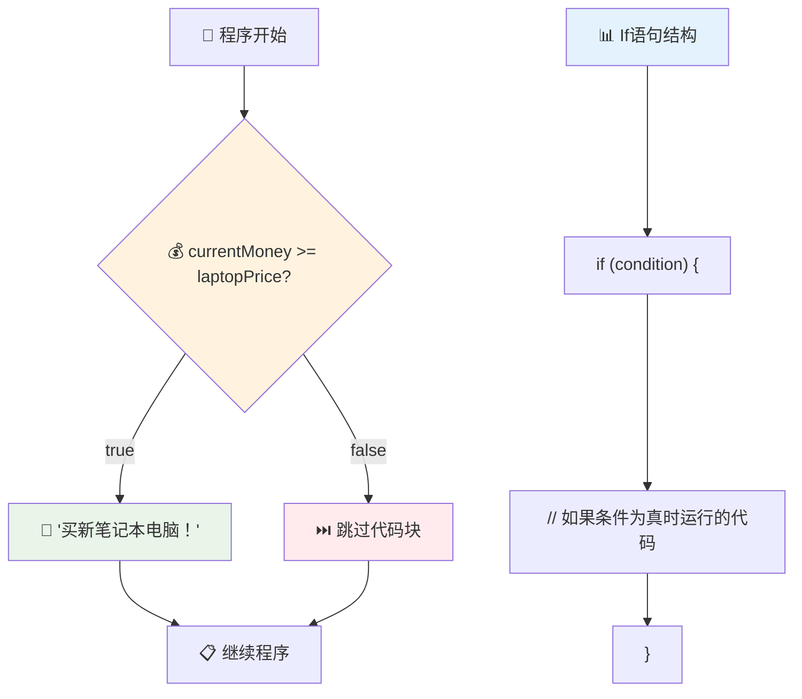

# JavaScript基础：做出决策


> 速写笔记由 [Tomomi Imura](https://twitter.com/girlie_mac) 提供


你有没有想过应用程序是如何做出智能决策的？比如导航系统如何选择最快路线，或者恒温器如何决定何时开启供暖？这就是编程中决策制定的基本概念。

正如查尔斯·巴贝奇的分析机设计为根据条件执行不同的操作序列一样，现代的JavaScript程序也需要根据不同的情况做出选择。分支和决策的能力使得静态代码变成响应型的智能应用程序。

在本课中，你将学习如何在程序中实现条件逻辑。我们将探讨条件语句、比较运算符和逻辑表达式，让你的代码能够评估情况并做出恰当响应。

## 课前小测

[课前小测](https://ff-quizzes.netlify.app/web/quiz/11)

做出决策和控制程序流程的能力是编程的基础部分。本节涵盖如何使用布尔值和条件逻辑来控制JavaScript程序的执行路径。

[](https://youtube.com/watch?v=SxTp8j-fMMY "Making Decisions")

> 🎥 点击上方图片观看关于做出决策的视频。

> 你还可以在[Microsoft Learn](https://docs.microsoft.com/learn/modules/web-development-101-if-else/?WT.mc_id=academic-77807-sagibbon)上学习本课程！


## 布尔值简要回顾

在探讨决策制定前，让我们回顾上一节课提到的布尔值。布尔值以数学家乔治·布尔命名，代表两个二进制状态——`true` 或 `false`。没有模糊，没有中间状态。

这些二进制值构成了所有计算逻辑的基础。你程序中每个决策最终都归结为一次布尔值判断。

创建布尔变量非常简单：

```javascript
let myTrueBool = true;
let myFalseBool = false;
```

这创建了两个明确具有布尔值的变量。

✅ 布尔值以英国数学家、哲学家和逻辑学家乔治·布尔（1815–1864）命名。

## 比较运算符与布尔值

在实际中，你很少手动设置布尔值。相反，你会通过条件判断生成它们：比如“这个数字大于那个吗？”或者“这些值相等吗？”

比较运算符支持这些判断。它们比较两个值并根据操作数之间的关系返回布尔结果。

| 符号   | 描述                                                                                                                                                     | 例子               |
| ------ | -------------------------------------------------------------------------------------------------------------------------------------------------------- | ------------------ |
| `<`    | **小于**：比较两个值，如果左边的值小于右边，则返回布尔值 `true`                                                                                        | `5 < 6 // true`    |
| `<=`   | **小于或等于**：比较两个值，如果左边的值小于或等于右边，则返回布尔值 `true`                                                                             | `5 <= 6 // true`   |
| `>`    | **大于**：比较两个值，如果左边的值大于右边，则返回布尔值 `true`                                                                                        | `5 > 6 // false`   |
| `>=`   | **大于或等于**：比较两个值，如果左边的值大于或等于右边，则返回布尔值 `true`                                                                           | `5 >= 6 // false`  |
| `===`  | **严格相等**：比较两个值，如果两边的值相等且数据类型相同，返回布尔值 `true`                                                                          | `5 === 6 // false` |
| `!==`  | **不等于**：比较两个值，返回严格相等运算符相反的布尔值                                                                                                 | `5 !== 6 // true`  |

✅ 通过在浏览器控制台里写一些比较语句来检验你的理解。有返回结果让你感到惊讶吗？


### 🧠 **比较运算理解测试：布尔逻辑掌握**

**测试你的比较理解能力：**
- 为什么一般推荐用 `===` (严格相等) 而不是 `==` (宽松相等)？
- 你能预测 `5 === '5'` 返回什么吗？`5 == '5'` 呢？
- `!==` 和 `!=` 有什么区别？


> **实用建议**：除非需要类型转换，否则总是使用 `===` 和 `!==` 进行相等性检查。这能防止意外行为发生！

## If 语句

`if` 语句就像在你的代码中提出一个问题。“如果这个条件为真，那么就执行这件事。” 这可能是你在JavaScript中做决策时用得最重要的工具。

运作方式如下：

```javascript
if (condition) {
  // 条件为真。此代码块中的代码将会执行。
}
```

条件放在括号内，如果结果为 `true`，JavaScript会执行大括号中的代码。如果是 `false`，JavaScript会跳过这整个代码块。

你经常会用比较运算符来组成这些条件。来看一个实际的例子：

```javascript
let currentMoney = 1000;
let laptopPrice = 800;

if (currentMoney >= laptopPrice) {
  // 条件为真。此块中的代码将会运行。
  console.log("Getting a new laptop!");
}
```

因为 `1000 >= 800` 计算结果为 `true`，代码块内的内容得以执行，控制台打印出“Getting a new laptop!”。


## If..Else 语句

但是如果你想在条件为假时执行不同的操作呢？这时就用到 `else` —— 就像有备选方案一样。

`else` 语句让你说“如果这个条件不为真，那就执行另一件事情。”

```javascript
let currentMoney = 500;
let laptopPrice = 800;

if (currentMoney >= laptopPrice) {
  // 条件为真。此代码块中的代码将运行。
  console.log("Getting a new laptop!");
} else {
  // 条件为假。此代码块中的代码将运行。
  console.log("Can't afford a new laptop, yet!");
}
```

现在由于 `500 >= 800` 为 `false`，JavaScript跳过第一个代码块，转而执行 `else` 代码块。你会看到控制台打印“Can't afford a new laptop, yet!”。

✅ 通过运行这段代码和下面代码来测试你的理解。改变 `currentMoney` 和 `laptopPrice` 变量的值，观察控制台输出变化。

### 🎯 **If-Else 逻辑检测：分支路径**

**评估你对条件逻辑的理解：**
- 如果 `currentMoney` 正好等于 `laptopPrice` 会发生什么？
- 你能想到一个现实场景，哪里使用if-else逻辑会很有用？
- 你如何扩展这个逻辑来处理多个价格区间？


> **关键见解**：If-else 确保只有一条路径被执行。这保证你的程序对任何条件都有响应！

## Switch 语句

有时你需要把一个值和多个选项进行比较。虽然可以串联多个 `if..else` 语句，但代码会变得难以管理。`switch` 语句为多个离散值提供了更清晰的结构。

这个概念类似于早期电话交换机中的机械切换系统 — 一个输入值决定执行哪个具体路径。

```javascript
switch (expression) {
  case x:
    // 代码块
    break;
  case y:
    // 代码块
    break;
  default:
    // 代码块
}
```

它的结构如下：
- JavaScript只计算表达式一次
- 遍历每个 `case` 寻找匹配项
- 找到匹配时执行该代码块
- `break` 使JavaScript停止并退出switch
- 如果没有匹配项执行 `default` 块（如果存在）

```javascript
// 使用 switch 语句的周日程序
let dayNumber = 2;
let dayName;

switch (dayNumber) {
  case 1:
    dayName = "Monday";
    break;
  case 2:
    dayName = "Tuesday";
    break;
  case 3:
    dayName = "Wednesday";
    break;
  default:
    dayName = "Unknown day";
    break;
}
console.log(`Today is ${dayName}`);
```

在该例中，JavaScript看到 `dayNumber` 为 `2`，匹配到 `case 2`，将 `dayName` 设置为"Tuesday"，然后跳出switch。结果就是控制台打印“Today is Tuesday”。


✅ 通过运行这段代码和接下来的代码来测试你的理解。改变变量 `a` 的值，观察控制台输出变化。

### 🔄 **Switch 语句掌握：多选项处理**

**测试你的switch理解：**
- 如果忘了写 `break` 会发生什么？
- 你什么时候会选择用 `switch` 而不是多个 `if-else` 语句？
- 即使你认为涵盖了所有可能，为什么 `default` 情况仍然有用？


> **最佳实践**：当需要对一个变量与多个具体值进行比较时，用 `switch`。处理数值范围或复杂条件时，用 `if-else`。

## 逻辑运算符与布尔值

复杂决策通常需要同时评估多个条件。正如布尔代数允许数学家结合逻辑表达式，编程语言也提供了逻辑运算符来连接多个布尔条件。

这些运算符通过组合简单的真/假判断，支持复杂的条件逻辑。

| 符号    | 描述                                                                                          | 示例                                                                 |
| ------- | --------------------------------------------------------------------------------------------- | -------------------------------------------------------------------- |
| `&&`    | **逻辑与（AND）**：比较两个布尔表达式，只有两边都为真时返回 `true`                            | `(5 > 3) && (5 < 10) // 两边都为真，返回true`                       |
| `\|\|`  | **逻辑或（OR）**：比较两个布尔表达式，只要有一边为真就返回 `true`                              | `(5 > 10) \|\| (5 < 10) // 一边是假，另一边是真，返回true`          |
| `!`     | **逻辑非（NOT）**：返回布尔表达式的相反值                                                     | `!(5 > 10) // 5不大于10，"!"使其变成true`                          |

这些运算符让你以有用的方式组合条件：
- AND (`&&`) 表示两个条件都必须为真
- OR (`||`) 表示至少一个条件为真  
- NOT (`!`) 将真变假，假变真


## 逻辑运算符的条件与决策

来看一个更现实的例子，演示这些逻辑运算符的用法：

```javascript
let currentMoney = 600;
let laptopPrice = 800;
let laptopDiscountPrice = laptopPrice - (laptopPrice * 0.2); // 笔记本电脑价格打八折

if (currentMoney >= laptopPrice || currentMoney >= laptopDiscountPrice) {
  // 条件为真。此代码块中的代码将被执行。
  console.log("Getting a new laptop!");
} else {
  // 条件为假。此代码块中的代码将被执行。
  console.log("Can't afford a new laptop, yet!");
}
```

在此示例中：我们计算出20%的折扣价（640），然后判断资金是否足够支付全价或折扣价。由于600未达到折扣价640条件，整个表达式计算结果为false。

### 🧮 **逻辑运算符检测：条件组合**

**测试你的逻辑运算符理解：**
- 在表达式 `A && B` 中，如果 A 为假，B 会被计算吗？
- 你能想到什么情况下需要同时使用 `&&`, `||`, `!` 三个运算符吗？
- `!user.isActive` 和 `user.isActive !== true` 有什么区别？


> **性能提示**：JavaScript使用“短路求值”——在 `A && B` 中，如果 A 为假，B不会被计算。利用这一点可以优化代码！

### 取反运算符

有时更容易思考某事“不成立”的情况。比如不问“用户是否登录？”，而是问“用户是否未登录？”。感叹号(`!`)运算符就帮你翻转逻辑。

```javascript
if (!condition) {
  // 如果条件为假则执行
} else {
  // 如果条件为真则执行
}
```

`!` 运算符就像说“相反的……”，如果条件是 `true`，`!` 使它变成 `false`，反之亦然。

### 三元表达式

对于简单的条件赋值，JavaScript提供了**三元运算符**。这种简洁写法允许你在一行中写出条件表达式，在需要根据条件赋值两种情形时特别有用。

```javascript
let variable = condition ? returnThisIfTrue : returnThisIfFalse;
```

它读起来像个问题：“这个条件成立吗？如果是，用这个值。不成立，用那个值。”

下面是更具体的例子：

```javascript
let firstNumber = 20;
let secondNumber = 10;
let biggestNumber = firstNumber > secondNumber ? firstNumber : secondNumber;
```

✅ 花点时间多读几遍这段代码。你理解这些运算如何工作吗？

这句代码相当于：“`firstNumber` 是否大于 `secondNumber`？如果是，把 `firstNumber` 赋给 `biggestNumber`，否则赋 `secondNumber`。”

三元运算符是传统 `if..else` 语句的简写方式：

```javascript
let biggestNumber;
if (firstNumber > secondNumber) {
  biggestNumber = firstNumber;
} else {
  biggestNumber = secondNumber;
}
```

两种写法结果相同。三元运算符较简洁，而传统的if-else结构在复杂条件下更易读。


---


## 🚀 挑战

写一个程序，先用逻辑运算符实现，再用三元表达式重写。你更喜欢哪种写法？

---

## GitHub Copilot Agent 挑战 🚀

用Agent模式完成以下挑战：

**描述：** 创建一个综合评分计算器，演示本课多种决策概念，包括 if-else 语句、switch 语句、逻辑运算符和三元表达式。

**提示：** 编写一个 JavaScript 程序，输入学生的数字成绩（0-100），根据以下标准确定字母等级：
- A：90-100
- B：80-89  
- C：70-79
- D：60-69
- F：低于60

要求：
1. 使用 if-else 语句确定字母等级
2. 使用逻辑运算符检查学生是否及格（grade >= 60）且获得荣誉（grade >= 90）  
3. 使用 switch 语句为每个成绩等级提供具体反馈  
4. 使用三元运算符判断学生是否有资格参加下一门课程（grade >= 70）  
5. 包含输入验证以确保分数在 0 到 100 之间  

使用多种分数测试你的程序，包括临界值如 59、60、89、90 以及无效输入。  

在此处了解更多关于 [agent mode](https://code.visualstudio.com/blogs/2025/02/24/introducing-copilot-agent-mode) 的信息。  


## 课后测验  

[课后测验](https://ff-quizzes.netlify.app/web/quiz/12)  

## 复习与自学  

阅读更多关于用户可用的多种运算符，[请见 MDN](https://developer.mozilla.org/docs/Web/JavaScript/Reference/Operators)。  

浏览 Josh Comeau 精彩的[运算符查找](https://joshwcomeau.com/operator-lookup/)！  

## 作业  

[运算符](assignment.md)  

---

## 🧠 **你的决策工具包总结**  


---

## 🚀 你的 JavaScript 决策能力掌握时间线  

### ⚡ **接下来 5 分钟内你能做什么**  
- [ ] 在浏览器控制台练习比较运算符  
- [ ] 编写一个简单的 if-else 语句来检查你的年龄  
- [ ] 尝试挑战：用三元运算符重写 if-else  
- [ ] 测试不同“真值”和“假值”时的表现  

### 🎯 **接下来一小时内你能完成的任务**  
- [ ] 完成课后测验并复习任何困惑的概念  
- [ ] 构建 GitHub Copilot 挑战中的综合成绩计算器  
- [ ] 创建一个现实场景的简单决策树（例如选择穿什么）  
- [ ] 练习用逻辑运算符组合多个条件  
- [ ] 试验 switch 语句在不同用例中的应用  

### 📅 **你的周度逻辑掌握**  
- [ ] 完成包含创造性示例的运算符作业  
- [ ] 使用各种条件结构构建迷你测验应用  
- [ ] 创建一个检查多个输入条件的表单验证器  
- [ ] 练习 Josh Comeau 的[运算符查找](https://joshwcomeau.com/operator-lookup/)练习  
- [ ] 重构现有代码以使用更合适的条件结构  
- [ ] 研究短路求值和性能影响  

### 🌟 **你的月度提升计划**  
- [ ] 精通复杂嵌套条件且保持代码可读性  
- [ ] 构建带有复杂决策逻辑的应用  
- [ ] 通过改进现有项目中的条件逻辑参与开源贡献  
- [ ] 教授他人不同条件结构及其适用场景  
- [ ] 探索函数式编程在条件逻辑中的应用  
- [ ] 创建一份条件最佳实践的个人参考指南  

### 🏆 **最终决策大师自查**  

**庆祝你的逻辑思维掌握：**  
- 你成功实现过的最复杂的决策逻辑是什么？  
- 你觉得哪种条件结构最自然，为什么？  
- 学习逻辑运算符如何改变了你的问题解决方法？  
- 哪些现实应用会从复杂决策逻辑中获益？  


> 🧠 **你已经掌握了数字决策的艺术！** 每个交互式应用都依赖条件逻辑来智能地响应用户操作和变化的环境。你现在理解了如何让程序进行思考、评估并选择适当的响应。这一逻辑基础将为你构建的每一个动态应用提供强大动力！ 🎉

---

<!-- CO-OP TRANSLATOR DISCLAIMER START -->
**免责声明**：
本文件使用AI翻译服务[Co-op Translator](https://github.com/Azure/co-op-translator)进行翻译。虽然我们努力确保准确性，但请注意自动翻译可能包含错误或不准确之处。原始语言版本的文件应被视为权威来源。对于重要信息，建议采用专业人工翻译。对于因使用本翻译而产生的任何误解或错误理解，我们不承担任何责任。
<!-- CO-OP TRANSLATOR DISCLAIMER END -->