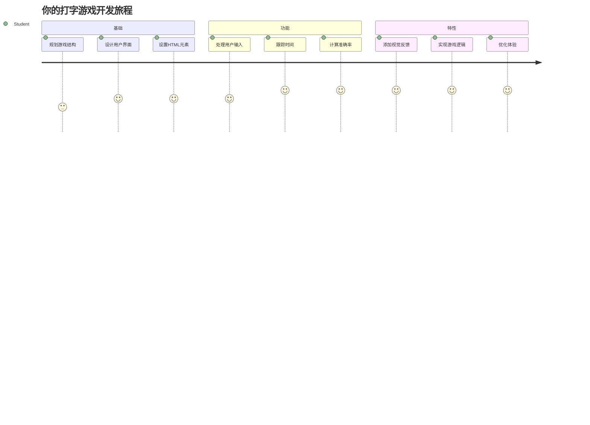
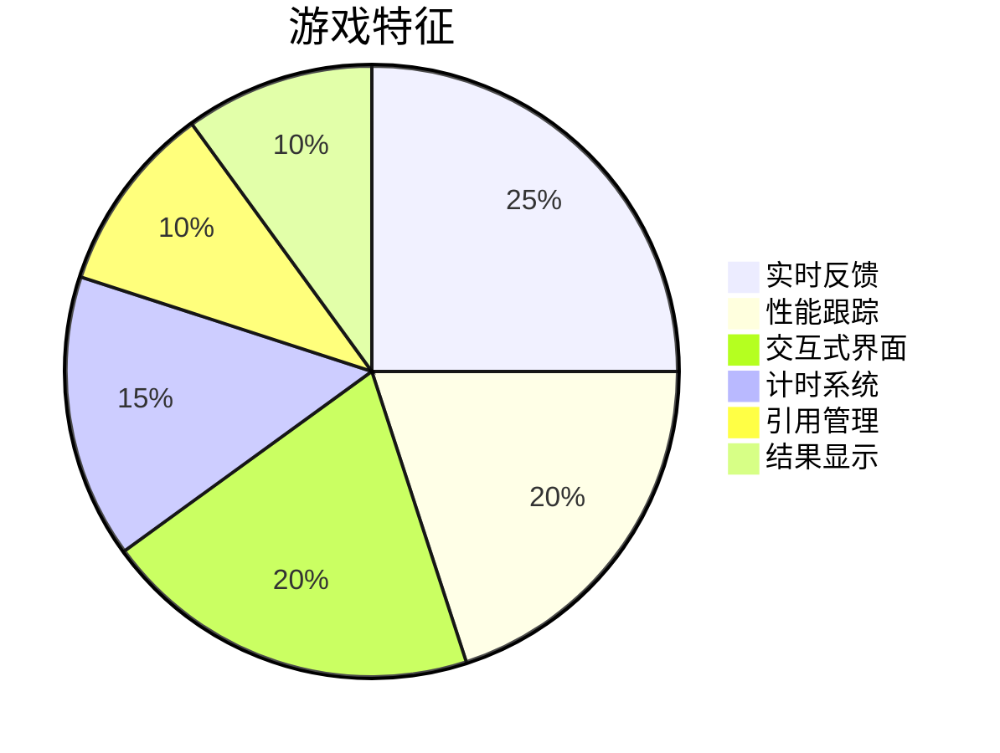
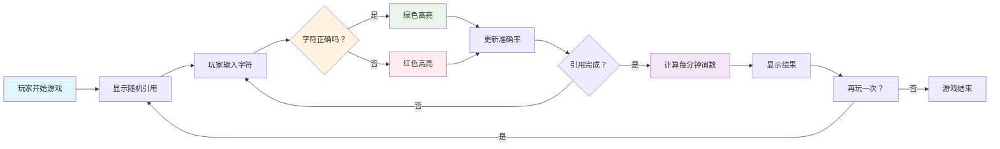
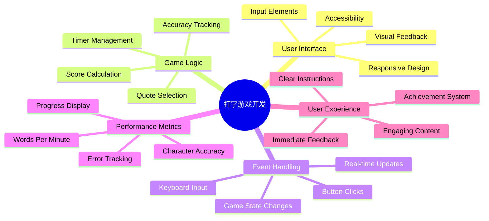
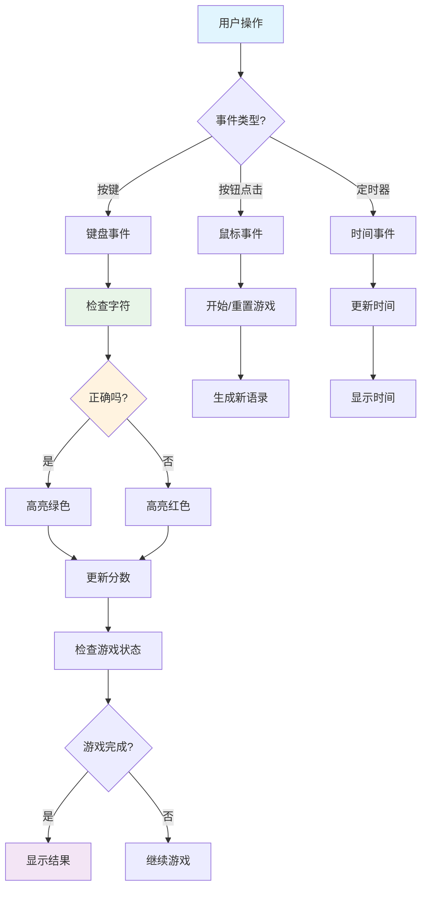
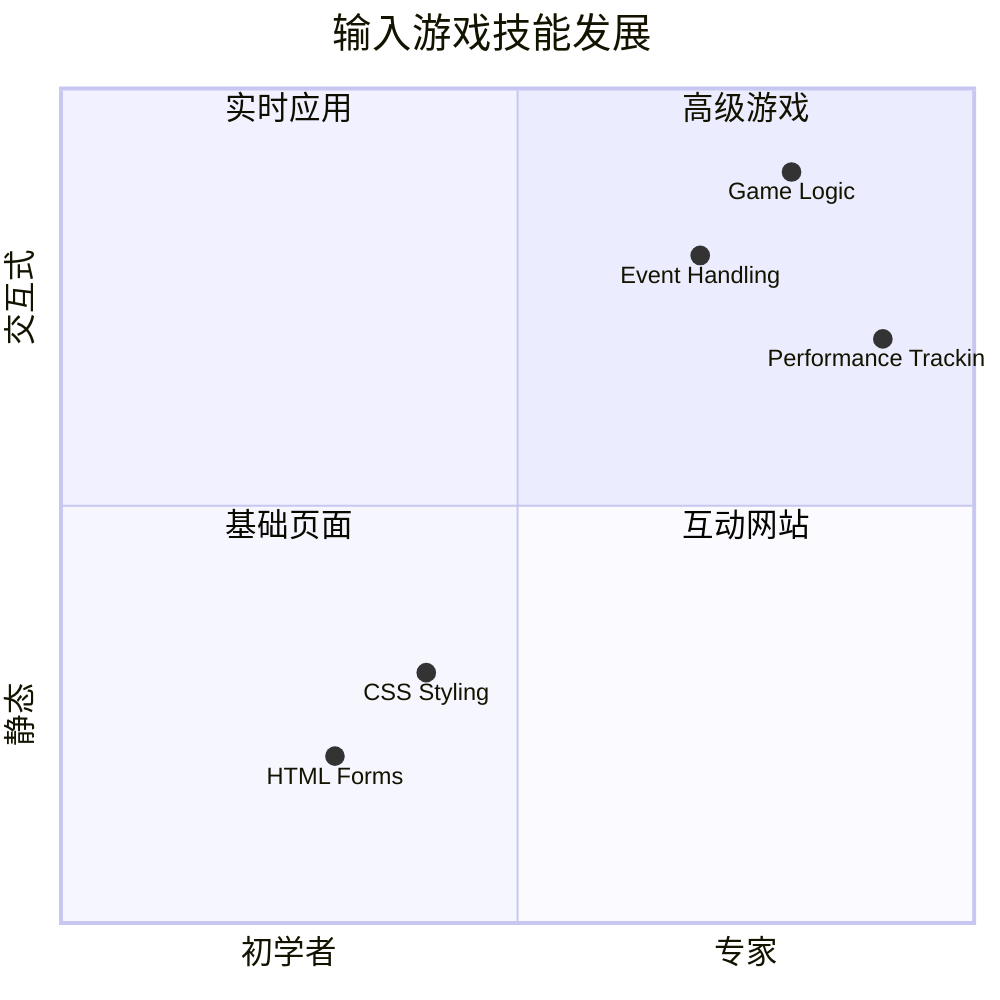
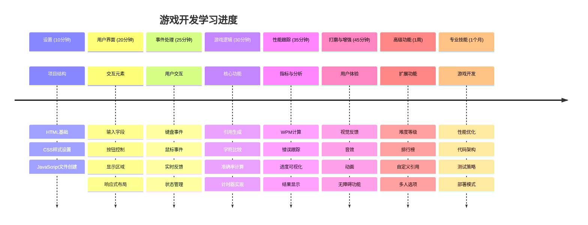

# 事件驱动编程 - 构建一个打字游戏

## 介绍

这里有件每个开发者都知道但很少谈论的事：打字快是一种超级能力！🚀 想想看——你把想法从大脑传到代码编辑器的速度越快，你的创造力就能流动得越顺畅。这就像在你的思维和屏幕之间建立了一条直接通道。

想知道提升这项技能的最佳方法之一吗？没错——我们要做一个游戏！

> 让我们一起创建一个很棒的打字游戏吧！

准备好把你一直在学习的 JavaScript、HTML 和 CSS 技能用起来了吗？我们将构建一个打字游戏，它会用传奇侦探 [夏洛克·福尔摩斯](https://en.wikipedia.org/wiki/Sherlock_Holmes) 的随机名言来考验你的速度和准确度——相信我，这比你想象的还要上瘾！

## 你需要了解的内容

在我们开始之前，确保你熟悉以下概念（如果需要快速复习也没关系——我们都有过的！）：

- 创建文本输入和按钮控件
- 使用类设置 CSS 样式  
- JavaScript 基础
  - 创建数组
  - 生成随机数
  - 获取当前时间

如果这些有点生疏，那完全没问题！有时候巩固知识的最好方法就是跳进项目中，边干边学。

### 🔄 **教学检查**
**基础评估**：开始开发之前，请确保你理解：
- ✅ HTML 表单和输入元素的工作原理
- ✅ CSS 类和动态样式
- ✅ JavaScript 事件监听器和处理程序
- ✅ 数组操作和随机选择
- ✅ 时间测量和计算

**快速自测**：你能解释这些概念如何在交互式游戏中协同工作吗？
- **事件**在用户与元素交互时触发
- **处理程序**处理这些事件并更新游戏状态
- **CSS**为用户操作提供视觉反馈
- **计时**支持性能测量和游戏进程

## 让我们动手吧！

[使用事件驱动编程创建打字游戏](./typing-game/README.md)

### ⚡ **接下来 5 分钟你可以做什么**
- [ ] 打开浏览器控制台，尝试使用 `addEventListener` 监听键盘事件
- [ ] 创建一个带输入框的简单 HTML 页面，测试输入检测
- [ ] 练习字符串操作，将输入文本与目标文本进行比较
- [ ] 使用 `setTimeout` 了解定时函数

### 🎯 **你一小时内能完成的目标**
- [ ] 完成课程后测验，理解事件驱动编程
- [ ] 构建一个带单词验证的基本打字游戏版本
- [ ] 为正确和错误输入添加视觉反馈
- [ ] 实现一个基于速度和准确度的简单计分系统
- [ ] 使用 CSS 美化游戏界面

### 📅 **你一周内的游戏开发计划**
- [ ] 完善完整的打字游戏及其所有功能和细节
- [ ] 添加难度等级，提供不同复杂度的词汇
- [ ] 实现用户统计跟踪（字数速度、准确率随时间变化）
- [ ] 制作音效和动画提升用户体验
- [ ] 使游戏支持移动设备响应和触摸操作
- [ ] 在线分享你的游戏并收集用户反馈

### 🌟 **你一个月的互动开发计划**
- [ ] 构建多个游戏，探索不同的交互模式
- [ ] 学习游戏循环、状态管理和性能优化
- [ ] 参与开源游戏开发项目
- [ ] 精通高级计时概念和平滑动画
- [ ] 创建展示各类交互应用的作品集
- [ ] 指导对游戏开发和用户交互感兴趣的其他人

## 🎯 你的打字游戏精通时间线

### 🛠️ 你的游戏开发工具总结

完成此项目后，你将掌握：
- **事件驱动编程**：响应用户输入的互动界面
- **实时反馈**：即时的视觉和性能更新
- **性能测量**：精准的计时和计分系统
- **游戏状态管理**：控制应用流程和用户体验
- **交互设计**：打造引人入胜、令人上瘾的用户体验
- **现代网页 API**：利用浏览器能力实现丰富互动
- **无障碍模式**：为所有用户设计包容性体验

**现实应用**：这些技能广泛应用于：
- **网络应用**：任何互动界面或仪表盘
- **教育软件**：学习平台和技能评估工具
- **生产力工具**：文本编辑器、集成开发环境和协作软件
- **游戏行业**：浏览器游戏和互动娱乐
- **移动开发**：基于触控的界面和手势处理

**下一步**：你已准备好探索高级游戏框架、实时多人系统或复杂交互应用！

## 致谢

由 [Christopher Harrison](http://www.twitter.com/geektrainer) 用 ♥️ 撰写

---

<!-- CO-OP TRANSLATOR DISCLAIMER START -->
**免责声明**：  
本文件使用 AI 翻译服务 [Co-op Translator](https://github.com/Azure/co-op-translator) 进行翻译。虽然我们努力保证译文的准确性，但请注意，自动翻译可能存在错误或不准确之处。原始文档的原文版本应被视为权威来源。对于重要信息，建议采用专业人工翻译。对于因使用本翻译而产生的任何误解或曲解，我们不承担任何责任。
<!-- CO-OP TRANSLATOR DISCLAIMER END -->