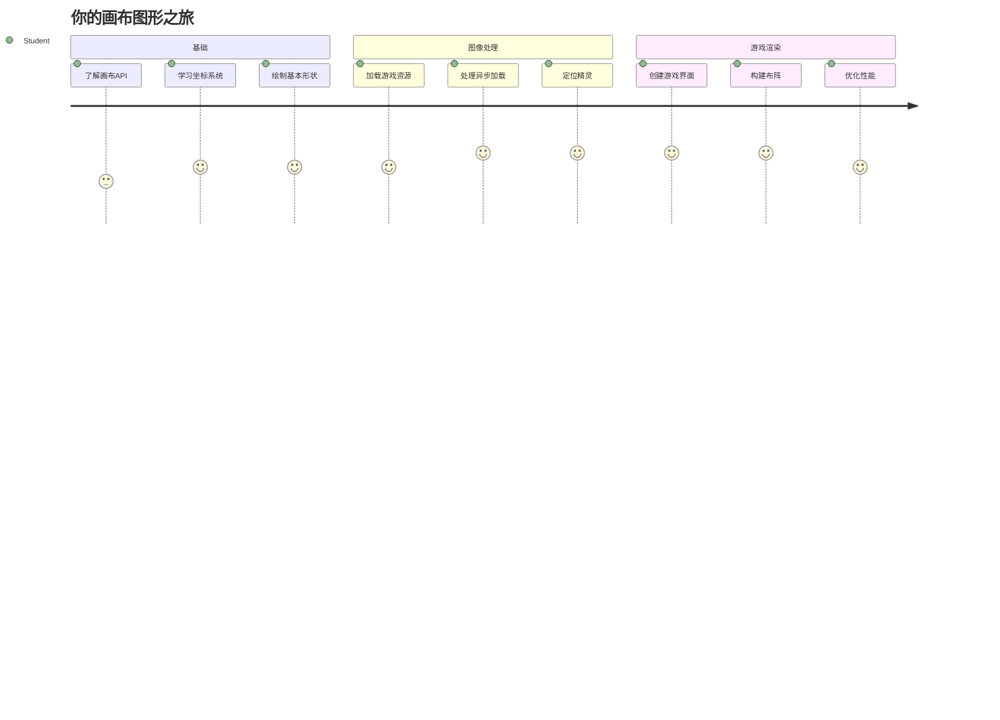
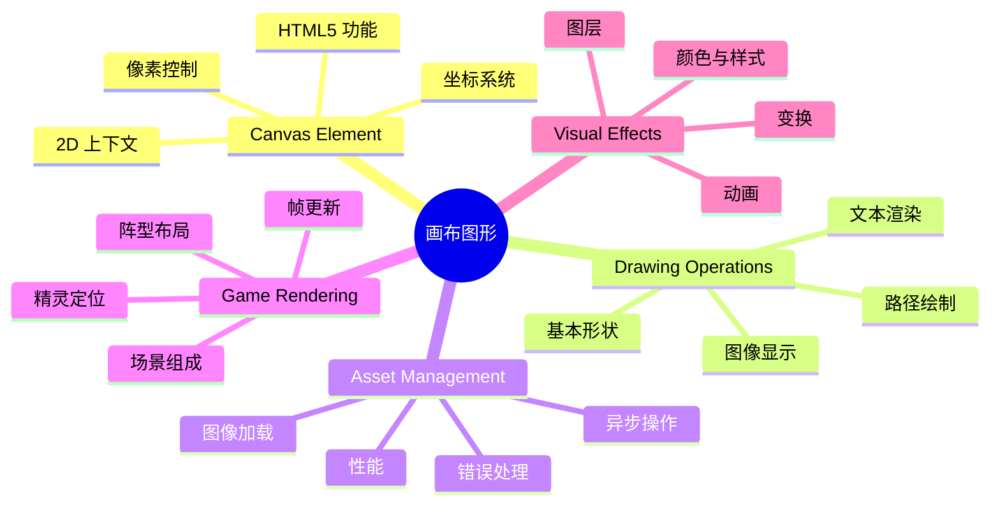
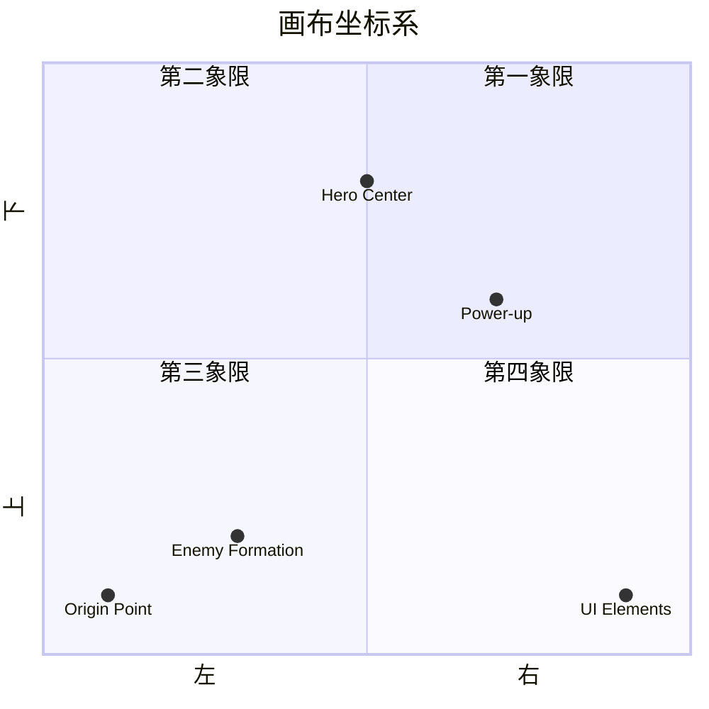
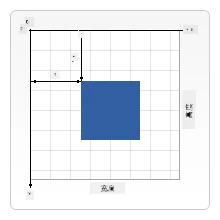
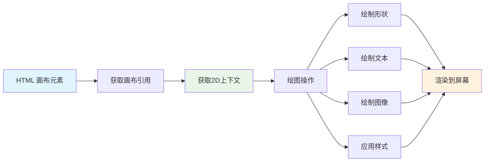
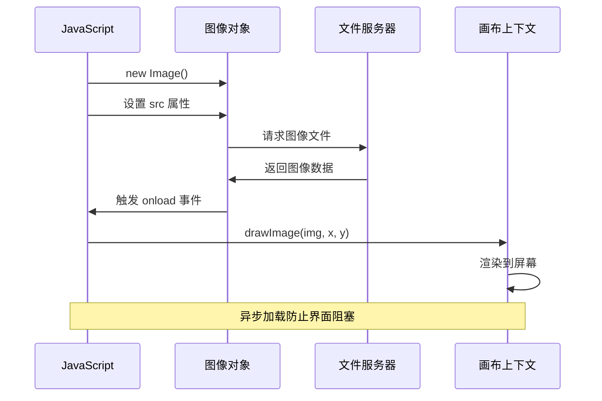
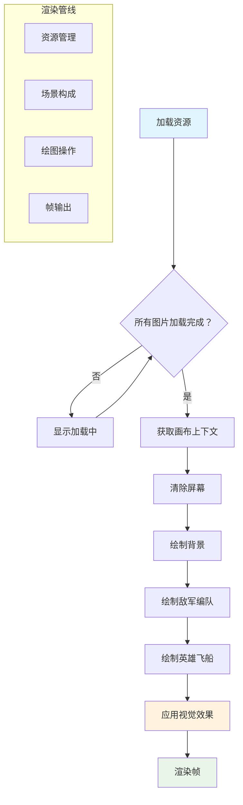
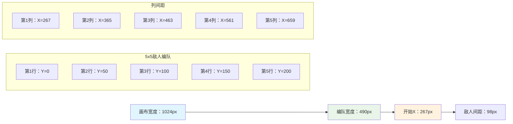
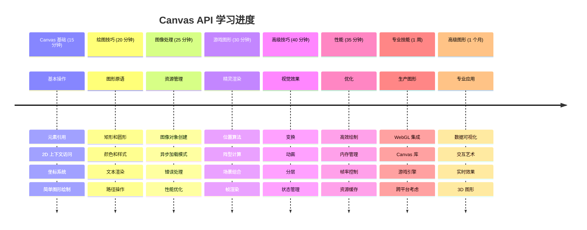

# 构建太空游戏第二部分：将英雄和怪物绘制到画布上


Canvas API 是网页开发中用于在浏览器中创建动态交互图形的最强大功能之一。在本课中，我们将把那个空白的 HTML `<canvas>` 元素变成一个充满英雄和怪物的游戏世界。把画布想象成你的数字画板，代码变成视觉效果。

我们将基于上一课的内容，现在深入视觉方面。你将学习如何加载和显示游戏精灵，精确定位元素，并为你的太空游戏创建视觉基础。这桥接了静态网页与动态交互体验之间的差距。

本课结束时，你将拥有一个完整的游戏场景，准确定位的英雄飞船和准备战斗的敌人阵型。你会理解现代游戏如何在浏览器中渲染图形，并获得制作自己交互式视觉体验的技能。让我们一起探索画布图形，赋予你的太空游戏生命吧！


## 课前测验

[课前测验](https://ff-quizzes.netlify.app/web/quiz/31)

## 画布

那么，这个 `<canvas>` 元素到底是什么呢？它是 HTML5 用于在网页浏览器中创建动态图形和动画的解决方案。与静态的普通图像或视频不同，画布让你能够像素级别地控制屏幕上显示的一切。这使它非常适合游戏、数据可视化和交互艺术。把它想象成一个可编程的绘图表面，JavaScript 成为你的画笔。

默认情况下，canvas 元素看起来像页面上的一个空白透明矩形。但潜力就在这里！当你用 JavaScript 绘制形状、加载图像、创建动画并让事物响应用户交互时，它的真正威力就显现出来。这类似于 1960 年代贝尔实验室的早期计算机图形先驱——他们必须编程控制每个像素，才能创建第一批数字动画。

✅ 在 MDN 上阅读[更多关于 Canvas API](https://developer.mozilla.org/docs/Web/API/Canvas_API)。

它通常这样声明，作为页面主体的一部分：

```html
<canvas id="myCanvas" width="200" height="100"></canvas>
```

**这段代码做了什么：**
- **设置** `id` 属性，以便你在 JavaScript 中引用这个特定的画布元素
- **定义** `width`（宽度）以像素为单位，控制画布的水平尺寸
- **设置** `height`（高度）以像素为单位，确定画布的垂直尺寸

## 绘制简单几何图形

既然你知道了 canvas 元素是什么，接下来我们来探索如何真正地在上面绘图！画布使用的坐标系统你可能从数学课上见过，但有一个针对计算机图形的重要区别。

画布使用笛卡尔坐标系，包含 x 轴（水平轴）和 y 轴（垂直轴）来定位所有绘制内容。但关键的不同点是：与数学课上的坐标系不同，原点 `(0,0)` 从左上角开始，x 值向右增加，y 值向下增加。这种方式源于早期计算机显示器的电子束从上到下扫描，使得左上角成为自然的起点。



> 图片来自 [MDN](https://developer.mozilla.org/docs/Web/API/Canvas_API/Tutorial/Drawing_shapes)

要在 canvas 元素上绘图，你需要遵循所有画布图形基础的三个步骤。重复几次后，会变得很自然：


1. **获取引用**：从 DOM 获取你的 Canvas 元素（就像任何其他 HTML 元素一样）
2. **获取 2D 渲染上下文** — 它提供了所有绘图方法
3. **开始绘制！** 使用上下文的内建方法创建图形

代码示例如下：

```javascript
// 第一步：获取画布元素
const canvas = document.getElementById("myCanvas");

// 第二步：获取2D渲染上下文
const ctx = canvas.getContext("2d");

// 第三步：设置填充颜色并绘制矩形
ctx.fillStyle = 'red';
ctx.fillRect(0, 0, 200, 200); // x，y，宽度，高度
```

**逐步解析：**
- 我们 **获取** 了画布元素，使用它的 ID 并存储在变量中
- 我们 **获得** 2D 渲染上下文，它是我们的绘图工具箱
- 我们 **告诉** 画布用红色填充，设置填充样式 `fillStyle`
- 我们 **绘制** 了一个矩形，从左上角(0,0)开始，宽高均为200像素

✅ Canvas API 主要关注于二维形状，但你也可以用它在网站上绘制三维元素；为此，你可能会用到 [WebGL API](https://developer.mozilla.org/docs/Web/API/WebGL_API)。

你可以用 Canvas API 绘制各种内容，例如：

- **几何图形**，我们已经展示了如何绘制矩形，但还有很多形状你可以画。
- **文本**，你可以以任何字体和颜色绘制文字。
- **图像**，你可以根据图像资源（如 .jpg 或 .png）绘制图像。

✅ 试试吧！你已经会画矩形了，你能画一个圆形吗？看看 CodePen 上的一些有趣 Canvas 绘图。这里有一个[特别棒的示例](https://codepen.io/dissimulate/pen/KrAwx)。

### 🔄 **教学检查点**
**Canvas 基础理解**：在学习加载图像之前，确保你能够：
- ✅ 解释画布坐标系与数学坐标系的不同
- ✅ 理解画布绘图操作的三步流程
- ✅ 识别 2D 渲染上下文提供了什么
- ✅ 描述 fillStyle 和 fillRect 如何协作工作

**快速自测**：如何在位置 (100, 50) 画一个半径为 25 的蓝色圆圈？
```javascript
ctx.fillStyle = 'blue';
ctx.beginPath();
ctx.arc(100, 50, 25, 0, 2 * Math.PI);
ctx.fill();
```

**你现在知道的 Canvas 绘图方法：**
- **fillRect()**：绘制填充矩形
- **fillStyle**：设置颜色和图案
- **beginPath()**：开始新绘图路径
- **arc()**：创建圆和曲线

## 加载并绘制图像资源

绘制基础形状有助于入门，但大多数游戏需要真实的图像！精灵、背景和纹理赋予游戏视觉魅力。在画布上加载和显示图像的方式与绘制几何形状不同，但一旦掌握过程就很简单。

你需要创建一个 `Image` 对象，加载你的图像文件（这是异步的，即“后台”加载），然后图像准备好后再绘制到画布上。这样做能保证图像正确显示，同时不阻塞应用程序加载。


### 基本图像加载

```javascript
const img = new Image();
img.src = 'path/to/my/image.png';
img.onload = () => {
  // 图像已加载并准备好使用
  console.log('Image loaded successfully!');
};
```

**这段代码发生了什么：**
- 我们 **创建** 了一个新的 Image 对象来存放我们的精灵或纹理
- 我们 **指明** 它要加载的图像文件路径
- 我们 **监听** 加载完成事件，确保图像准备好使用

### 更好的图像加载方式

这是专业开发者常用的更健壮图像加载方法。我们将图像加载包装成基于 Promise 的函数——这种方法自 ES6 引入 JavaScript Promise 后变得流行，让代码更有条理且能优雅处理错误：

```javascript
function loadAsset(path) {
  return new Promise((resolve, reject) => {
    const img = new Image();
    img.src = path;
    img.onload = () => {
      resolve(img);
    };
    img.onerror = () => {
      reject(new Error(`Failed to load image: ${path}`));
    };
  });
}

// 使用 async/await 的现代用法
async function initializeGame() {
  try {
    const heroImg = await loadAsset('hero.png');
    const monsterImg = await loadAsset('monster.png');
    // 图像现在可以使用了
  } catch (error) {
    console.error('Failed to load game assets:', error);
  }
}
```

**这里做的事情：**
- **用 Promise 封装** 图像加载逻辑，更好地管理它
- **添加** 错误处理，能告诉我们什么时候出了问题
- **使用** 现代 async/await 语法，阅读起来更简洁
- **包括** try/catch 块优雅处理加载异常

图像加载完成后，将它绘制到画布其实很简单：

```javascript
async function renderGameScreen() {
  try {
    // 加载游戏资源
    const heroImg = await loadAsset('hero.png');
    const monsterImg = await loadAsset('monster.png');

    // 获取画布和上下文
    const canvas = document.getElementById("myCanvas");
    const ctx = canvas.getContext("2d");

    // 在特定位置绘制图像
    ctx.drawImage(heroImg, canvas.width / 2, canvas.height / 2);
    ctx.drawImage(monsterImg, 0, 0);
  } catch (error) {
    console.error('Failed to render game screen:', error);
  }
}
```

**逐步讲解：**
- 我们用 await 在后台加载了英雄和怪物的图像
- 我们获取画布元素及其 2D 渲染上下文
- 通过简单的坐标计算，把英雄图像放到画布中心
- 将怪物图像放置在左上角，开始敌人阵型
- 使用 try/catch 捕捉任何加载或渲染时可能出现的错误


## 现在开始构建你的游戏

现在我们把所有内容整合，创建太空游戏的视觉基础。你已经掌握了画布基础和图像加载技巧，这部分将引导你构建一个完整的游戏画面，实现精灵正确定位。

### 要构建什么

你将构建一个包含 Canvas 元素的网页。它应该渲染一个黑色画面，大小为 `1024*768`。我们给你提供了两张图片：

- 英雄飞船

   

- 5*5 怪物阵型

   

### 推荐开发步骤

找到为你准备好的启动文件，放在 `your-work` 子文件夹。你的项目结构应包含：

```bash
your-work/
├── assets/
│   ├── enemyShip.png
│   └── player.png
├── index.html
├── app.js
└── package.json
```

**你会使用这些资源：**
- **游戏精灵**存在于 `assets/` 文件夹，保持组织有序
- **主 HTML 文件**负责设置画布元素及环境
- **JavaScript 文件**中你将编写所有游戏渲染代码
- **package.json** 配置了开发服务器，支持本地测试

用 Visual Studio Code 打开此文件夹开始开发。你需要在本地环境安装 Visual Studio Code、NPM 和 Node.js。如果电脑未安装 `npm`，[这里有安装指南](https://www.npmjs.com/get-npm)。

进入 `your-work` 文件夹启动开发服务器：

```bash
cd your-work
npm start
```

**这个命令做了很酷的事情：**
- **启动**本地服务器 `http://localhost:5000`，方便测试游戏
- **正确服务**所有文件，浏览器能正常加载
- **监视**文件修改，保证开发顺畅
- **提供**专业开发环境，测试所有功能

> 💡 **注意**：浏览器初次会显示空白页——这很正常！随着你添加代码，刷新浏览器即可看到变化。这种迭代开发方式类似 NASA 构建阿波罗制导计算机——逐步测试每个组成部分后再集成。

### 添加代码

在 `your-work/app.js` 中添加代码，完成以下任务：

1. **绘制黑色背景的画布**
   > 💡 **操作示范**：找到 `/app.js` 中的 TODO，添加两行即可。设置 `ctx.fillStyle` 为黑色，再调用 `ctx.fillRect()`，起点(0,0)，尺寸与画布相符，简单易懂！

2. **加载游戏纹理**
   > 💡 **操作示范**：使用 `await loadAsset()` 加载英雄和敌人图像，存入变量以备后用。记住——只有实际绘制才能看到它们！

3. **将英雄飞船绘制在中心下部**
   > 💡 **操作示范**：用 `ctx.drawImage()` 放置英雄。x 坐标尝试 `canvas.width / 2 - 45` 使其居中，y 坐标使用 `canvas.height - canvas.height / 4` 放到底部区域。

4. **绘制 5×5 阵型敌人舰队**
   > 💡 **操作示范**：找到 `createEnemies` 函数，设置嵌套循环。你将进行一些间距和定位计算，别担心，我会引导你完成！

首先，定义常量以便合理布局敌人阵型：

```javascript
const ENEMY_TOTAL = 5;
const ENEMY_SPACING = 98;
const FORMATION_WIDTH = ENEMY_TOTAL * ENEMY_SPACING;
const START_X = (canvas.width - FORMATION_WIDTH) / 2;
const STOP_X = START_X + FORMATION_WIDTH;
```

**这些常量实现了什么：**
- 设定每行每列 5 个敌人（整齐的 5×5 网格）
- 定义敌人之间的间距，避免紧凑不适
- 计算整阵型的宽度
- 计算起止坐标，令阵型居中


然后，使用嵌套循环绘制敌人阵型：

```javascript
for (let x = START_X; x < STOP_X; x += ENEMY_SPACING) {
  for (let y = 0; y < 50 * 5; y += 50) {
    ctx.drawImage(enemyImg, x, y);
  }
}
```

**这个嵌套循环做了什么：**
- 外层循环从左往右遍历阵型
- 内层循环垂直遍历，创建整齐行列
- 在计算的精确 x,y 坐标绘制每个敌人精灵
- 保持均匀间距，效果专业有序

### 🔄 **教学检查点**
**游戏渲染掌握情况**：验证你对完整渲染系统的理解：
- ✅ 异步图像加载如何防止游戏启动时阻塞用户界面？
- ✅ 为什么用常量计算敌人阵型位置而非硬编码？
- ✅ 2D 渲染上下文在绘图操作中扮演什么角色？
- ✅ 嵌套循环如何创建有序的精灵阵型？

**性能考量**：你的游戏现展示了：
- **高效资源加载**：基于 Promise 的图像管理
- **有序渲染**：结构化绘图操作
- **数学定位**：计算精灵摆放
- **错误处理**：优雅的失败管理

**视觉编程概念**：你已经学会了：
- **坐标系统**：将数学转换为屏幕位置
- **精灵管理**：加载和显示游戏图形
- **阵型算法**：组织布局的数学模式
- **异步操作**：现代 JavaScript 实现流畅的用户体验

## 结果

完成的结果应如下所示：


## 解决方案

请先尝试自己解决，但如果遇到困难，可以查看[解决方案](../../../../6-space-game/2-drawing-to-canvas/solution/app.js)

---

## GitHub Copilot Agent 挑战 🚀

使用 Agent 模式完成以下挑战：

**描述：** 使用你学到的 Canvas API 技术，通过添加视觉效果和交互元素来增强你的太空游戏画布。

**提示：** 创建一个名为 `enhanced-canvas.html` 的新文件，画布中显示背景中动画的星星、英雄飞船的脉动生命条，以及缓慢向下移动的敌船。包含使用随机位置和不透明度绘制闪烁星星的 JavaScript 代码，实现根据生命值变化颜色（绿色 > 黄色 > 红色）的生命条，并让敌船以不同速度在屏幕上向下移动。

在这里了解更多关于[Agent 模式](https://code.visualstudio.com/blogs/2025/02/24/introducing-copilot-agent-mode)。

## 🚀 挑战

你已经学会了使用专注于2D的 Canvas API 绘图；看看[WebGL API](https://developer.mozilla.org/docs/Web/API/WebGL_API)，尝试绘制一个3D对象。

## 课后测验

[课后测验](https://ff-quizzes.netlify.app/web/quiz/32)

## 复习与自主学习

通过[阅读相关内容](https://developer.mozilla.org/docs/Web/API/Canvas_API)了解更多关于 Canvas API 的知识。

### ⚡ **接下来 5 分钟你可以做什么**
- [ ] 打开浏览器控制台，用 `document.createElement('canvas')` 创建画布元素
- [ ] 试着使用画布上下文的 `fillRect()` 绘制矩形
- [ ] 通过 `fillStyle` 属性尝试不同颜色
- [ ] 使用 `arc()` 方法绘制简单的圆形

### 🎯 **本小时你可以完成什么**
- [ ] 完成课后测验，理解画布基础
- [ ] 创建一个具有多种形状和颜色的画布绘图应用
- [ ] 实现你的游戏图像加载和精灵渲染
- [ ] 构建一个简单动画，让对象在画布上移动
- [ ] 练习画布变换，如缩放、旋转和平移

### 📅 **你的一周画布学习旅程**
- [ ] 完成太空游戏，拥有精致图形和精灵动画
- [ ] 精通高级画布技术，如渐变、图案和合成
- [ ] 使用画布创建数据交互可视化
- [ ] 了解画布性能优化技术，确保流畅运行
- [ ] 构建具有多种工具的绘图或绘画应用
- [ ] 探索创意编程模式和生成艺术与画布结合

### 🌟 **你的一月图形大师之路**
- [ ] 使用 Canvas 2D 和 WebGL 构建复杂视觉应用
- [ ] 学习图形编程概念与着色器基础
- [ ] 为开源图形库和可视化工具做贡献
- [ ] 精通图形密集应用的性能优化
- [ ] 制作关于画布编程和计算机图形学的教学内容
- [ ] 成为图形编程专家，帮助他人打造视觉体验

## 🎯 你的画布图形大师时间线


### 🛠️ 你的画布图形工具包总结

完成本课程后，你现在拥有：
- **Canvas API 掌握**：完全理解2D图形编程
- **坐标数学**：精准定位和布局算法
- **资源管理**：专业的图像加载与错误处理
- **渲染管线**：结构化场景组成方法
- **游戏图形**：精灵定位和阵型计算
- **异步编程**：现代 JavaScript 模式实现流畅性能
- **视觉编程**：将数学概念转换为屏幕图形

**现实应用**：你的 Canvas 技能可广泛应用于：
- **数据可视化**：图表、图形和互动仪表盘
- **游戏开发**：2D游戏、模拟和交互体验
- **数字艺术**：创意编程和生成艺术项目
- **UI/UX 设计**：自定义图形和交互元素
- **教育软件**：视觉学习工具和模拟
- **Web 应用**：动态图形和实时可视化

**所获专业技能**：你现在可以：
- **构建** 无需外部库的定制图形解决方案
- **优化** 渲染性能，实现流畅用户体验
- **调试** 使用浏览器开发工具排查复杂视觉问题
- **设计** 采用数学原理的可扩展图形系统
- **整合** Canvas 图形与现代 Web 应用框架

**你已掌握的 Canvas API 方法**：
- **元素管理**：getElementById、getContext
- **绘图操作**：fillRect、drawImage、fillStyle
- **资源加载**：图像对象、Promise 模式
- **数学定位**：坐标计算、阵型算法

**下一步**：你已经准备好添加动画、用户交互、碰撞检测，或探索 WebGL 实现3D图形！

🌟 **成就解锁**：你已用基础 Canvas API 技术构建完整游戏渲染系统！

## 作业

[玩转 Canvas API](assignment.md)

---

<!-- CO-OP TRANSLATOR DISCLAIMER START -->
**免责声明**：  
本文件使用 AI 翻译服务 [Co-op Translator](https://github.com/Azure/co-op-translator) 进行翻译。尽管我们力求准确，但请注意自动翻译可能包含错误或不准确之处。原文应被视为权威来源。对于重要信息，建议采用专业人工翻译。我们概不对因使用本翻译而导致的任何误解或误释承担责任。
<!-- CO-OP TRANSLATOR DISCLAIMER END -->