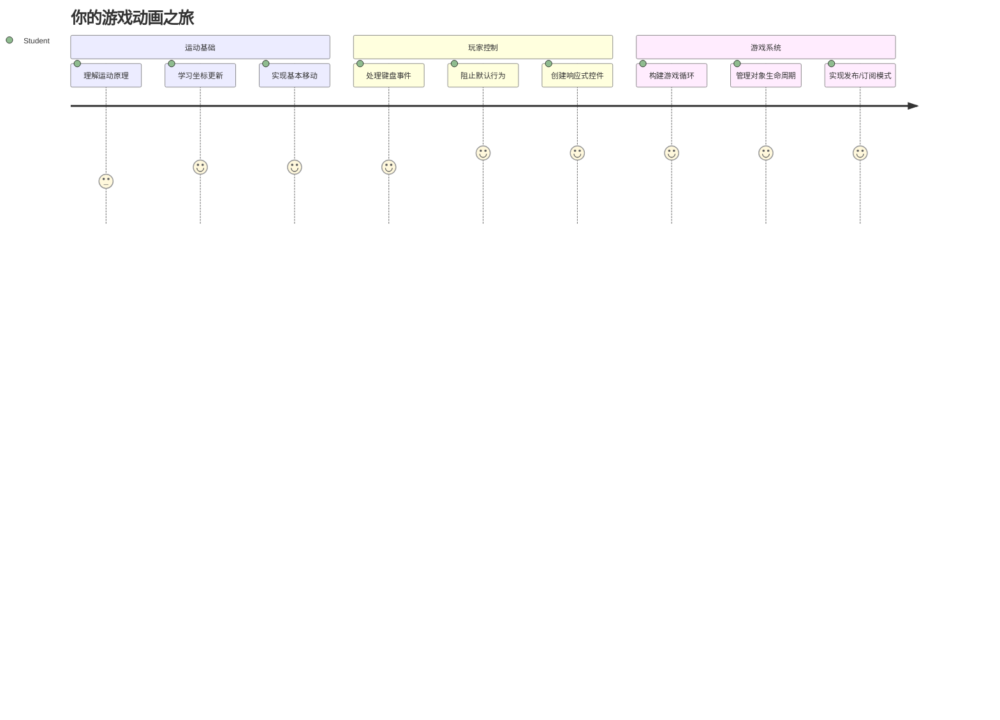
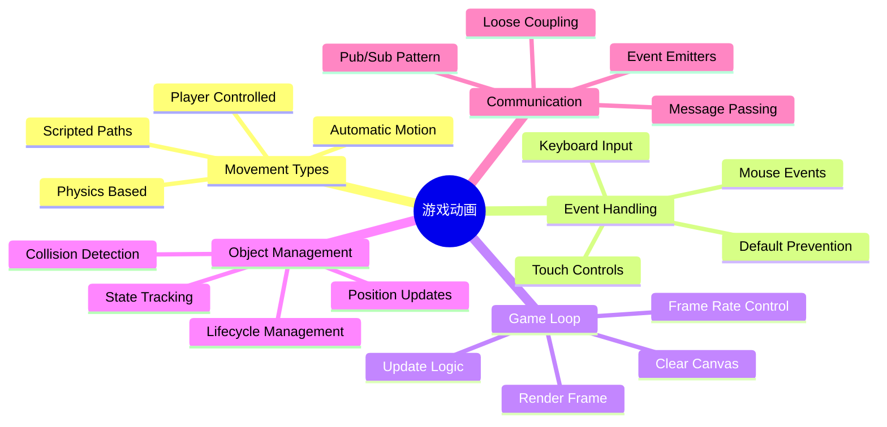
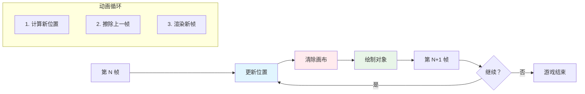
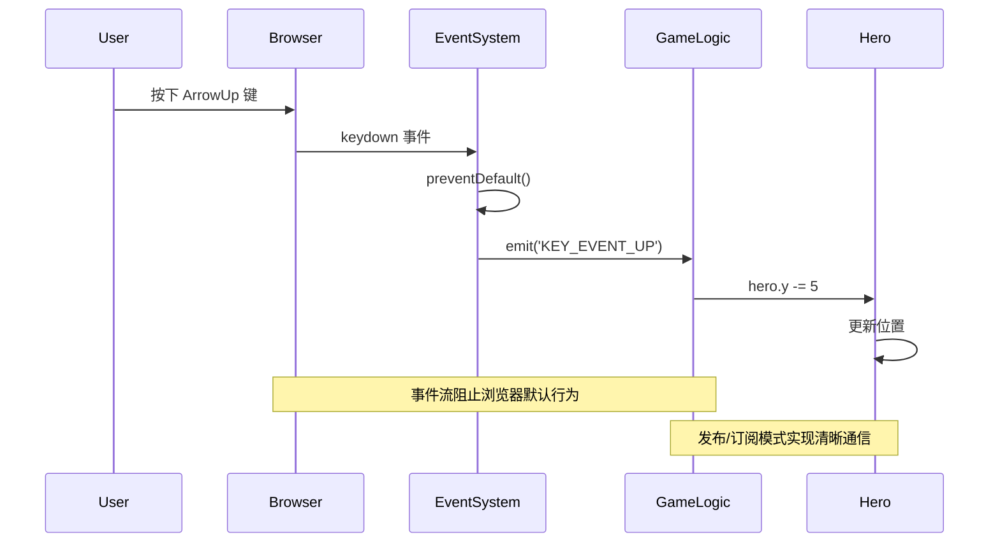
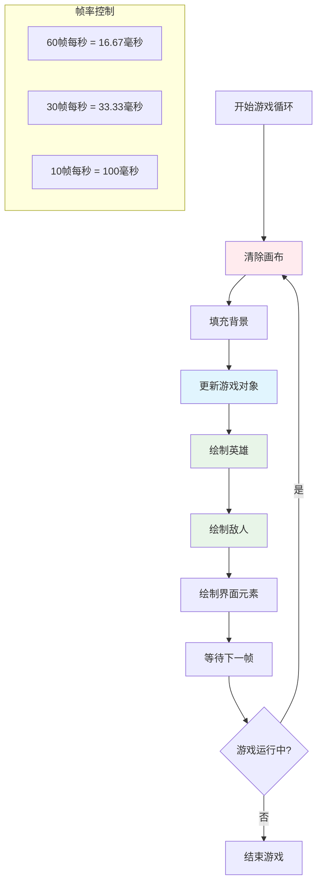
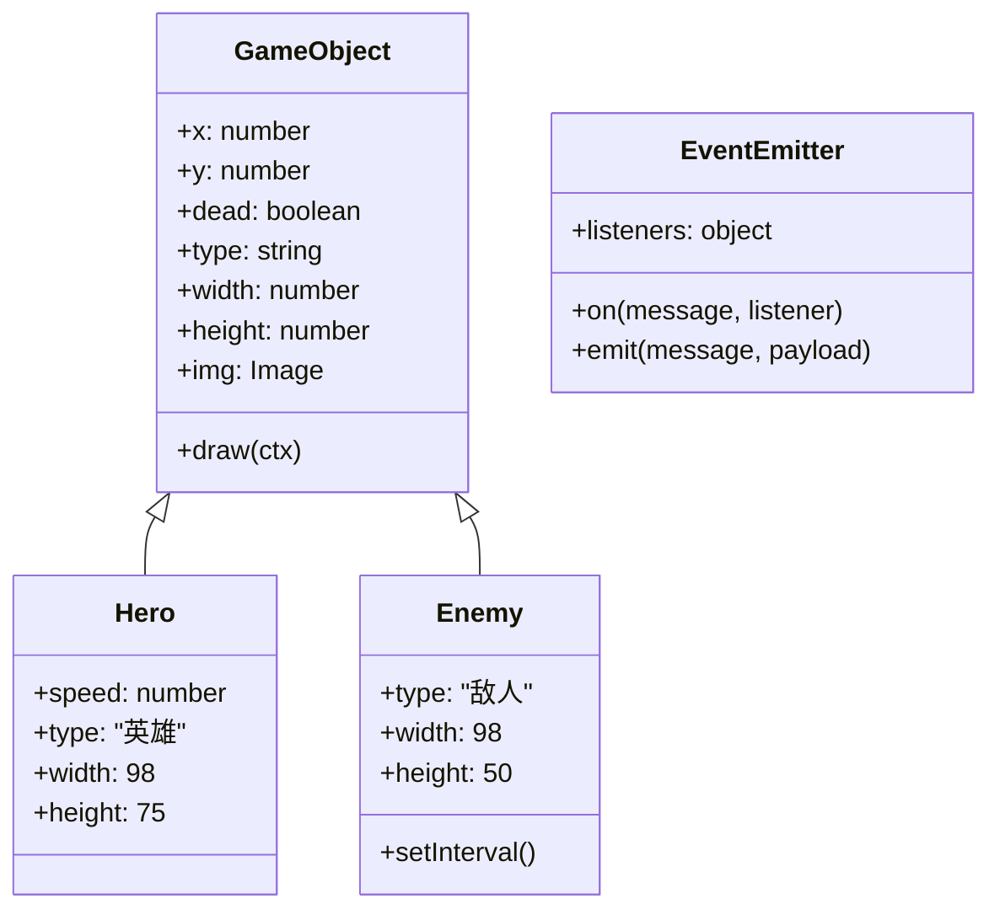
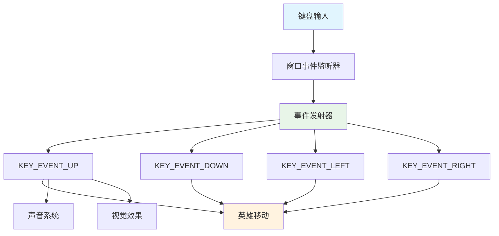
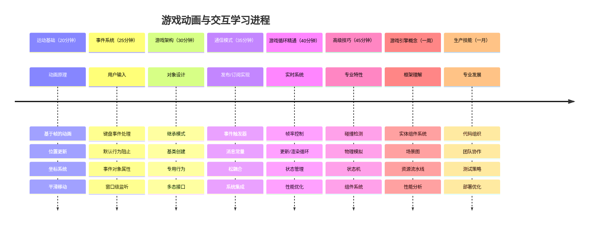

# 构建太空游戏 第3部分：添加运动


想想你最喜欢的游戏——让它们吸引人不仅仅是漂亮的图形，而是所有东西如何移动并响应你的操作。现在，你的太空游戏就像一幅美丽的画，但我们马上要添加使其充满活力的动作。

当 NASA 工程师为阿波罗任务编写导航计算机程序时，他们面临着类似的挑战：如何让航天器在自动保持航向校正的同时响应飞行员的指令？我们今天要学习的原理正是这些——管理玩家控制的运动和自动系统行为协同工作。

本课中，你将学习如何让飞船在屏幕上滑行，响应玩家命令，创建流畅的移动模式。我们会将所有内容拆解成易于理解且自然递进的概念。

最后，你将拥有一个那样的游戏：玩家可以驾驶英雄飞船在屏幕上飞行，而敌舰在头顶巡逻。更重要的是，你将理解驱动游戏运动系统的核心原理。


## 课前测验

[课前测验](https://ff-quizzes.netlify.app/web/quiz/33)

## 理解游戏运动

当游戏中的元素开始移动时，游戏才会真正生动起来，基本上有两种运动方式：

- **玩家控制的运动**：当你按下一个键或点击鼠标时，某事物会移动。这是你与游戏世界之间的直接联系。
- **自动运动**：游戏本身决定移动某些东西——比如那些无论你是否操作都在屏幕上巡逻的敌舰。

在计算机屏幕上移动物体其实没你想的复杂。还记得数学课上的 x 和 y 坐标吗？这正是我们现在使用的。1610年，当伽利略追踪木星的卫星时，实际上也是在做同样事情——随着时间绘制位置以理解运动规律。

屏幕上移动事物就像制作翻页动画——你需要遵循以下三个简单步骤：


1. **更新位置**——改变物体应该所在的位置（比如向右移动5像素）
2. **擦除旧帧**——清除屏幕防止出现鬼影尾迹
3. **绘制新帧**——将物体放到新位置

做得够快，砰！你就拥有顺滑且自然的运动效果。

下面是代码中的表现：

```javascript
// 设置英雄的位置
hero.x += 5;
// 清除英雄所在的矩形区域
ctx.clearRect(0, 0, canvas.width, canvas.height);
// 重新绘制游戏背景和英雄
ctx.fillRect(0, 0, canvas.width, canvas.height);
ctx.fillStyle = "black";
ctx.drawImage(heroImg, hero.x, hero.y);
```

**这段代码的作用是：**
- **更新**英雄的 x 坐标，加5像素，实现水平移动
- **清空**整个画布区域，移除上一帧
- **填充**画布黑色背景
- **重绘**英雄图片于新位置

✅ 你能想出为什么每秒多次重绘英雄可能导致性能开销吗？阅读关于[这种模式的替代方案](https://developer.mozilla.org/en-US/docs/Web/API/Canvas_API/Tutorial/Optimizing_canvas)。

## 处理键盘事件

这里是我们将玩家输入连接到游戏动作的地方。当有人按下空格键开火激光或点击方向键躲避小行星时，你的游戏需要检测到并响应这些输入。

键盘事件发生在 window 级别，也就是说整个浏览器窗口都在监听键盘按下。鼠标点击可以绑定到特定元素（如按钮）。对于我们的太空游戏，我们专注键盘控制——这赋予玩家经典街机的感觉。

这让我想到1800年代电报操作员如何将莫尔斯电码翻译成有意义的信息——我们也正做类似事情，将按键转成游戏指令。

处理事件需要使用 window 的 `addEventListener()` 方法，传入两个参数。第一个是事件名，例如 `keyup`；第二个是事件触发时调用的函数。

示例：

```javascript
window.addEventListener('keyup', (evt) => {
  // evt.key = 键的字符串表示
  if (evt.key === 'ArrowUp') {
    // 做某事
  }
});
```

**这里发生了什么：**
- **监听**整个窗口的键盘事件
- **捕获**事件对象，包含按了哪个键的信息
- **检查**按键是否匹配特定键（这里是向上箭头）
- **满足条件时**执行相应代码

键盘事件可通过以下属性判断按了什么键：

- `key` —— 字符串形式，比如 `'ArrowUp'`
- `keyCode` —— 数字形式，比如 `37`，对应 `ArrowLeft`

✅ 键盘事件处理适用游戏开发外的场景，你还能想到哪些用途？


### 特殊键：须知！

部分按键默认行为会影响游戏体验。箭头键会滚动页面，空格键会跳到页面下方——当玩家驾驶飞船时，这些行为当然不希望发生。

我们可以阻止这些默认行为，让游戏自行处理输入。这类似早期程序员覆盖系统中断实现自定义行为——我们这次是浏览器层面的操作。方法如下：

```javascript
const onKeyDown = function (e) {
  console.log(e.keyCode);
  switch (e.keyCode) {
    case 37:
    case 39:
    case 38:
    case 40: // 方向键
    case 32:
      e.preventDefault();
      break; // 空格键
    default:
      break; // 不阻塞其他按键
  }
};

window.addEventListener('keydown', onKeyDown);
```

**理解这段阻止代码：**
- **检查**可能引起问题的键码
- **阻止**箭头键和空格键的默认浏览器行为
- **允许**其他键正常工作
- **使用** `e.preventDefault()` 阻止浏览器默认动作

### 🔄 **教学确认**
**事件处理理解点**：转入自动运动前，确保你能：
- ✅ 解释 `keydown` 和 `keyup` 事件的区别
- ✅ 理解为何需要防止默认浏览器行为
- ✅ 描述事件监听器如何连接用户输入与游戏逻辑
- ✅ 识别哪些键可能会干扰游戏操作

**快速自测**：如果你不阻止箭头键的默认行为会怎样？
*答：浏览器会滚动页面，影响游戏运动*

**事件系统架构**：你现在理解了：
- **窗口级监听**：在浏览器层捕获事件
- **事件对象属性**：`key` 字符串与 `keyCode` 数字
- **默认阻止**：防止不想要的浏览器行为
- **条件逻辑**：针对特定按键做响应

## 游戏引导的运动

接下来聊聊无需玩家输入也会运动的物体。想想敌舰在屏幕上巡航，子弹直线飞行，背景云朵飘过。这种自主运动让游戏世界即使无人操作也充满生命力。

我们使用 JavaScript 内置计时器，定时更新位置。这就像钟摆时钟——定期触发动作。示例如下：

```javascript
const id = setInterval(() => {
  // 在y轴上移动敌人
  enemy.y += 10;
}, 100);
```

**这段运动代码的作用：**
- **创建**一个每100毫秒运行一次的定时器
- **每次**更新敌人 y 坐标，下移10像素
- **存储**定时器ID以备后续停止
- **自动**将敌人往屏幕下方移动

## 游戏循环

这是贯穿全局的核心机制——游戏循环。把游戏比作电影，游戏循环就是放映机，快速播放一帧又一帧，营造顺畅运动感。

每款游戏背后都有一个这样的循环。它持续更新所有游戏对象，重绘屏幕，重复进行。追踪英雄、所有敌人及飞行的激光——保持整局游戏状态同步。

这让我想起早期动画师如华特·迪士尼，逐帧重绘角色制造运动假象。我们同理，不过用代码替代铅笔。

一般的游戏循环代码如下：


```javascript
const gameLoopId = setInterval(() => {
  function gameLoop() {
    ctx.clearRect(0, 0, canvas.width, canvas.height);
    ctx.fillStyle = "black";
    ctx.fillRect(0, 0, canvas.width, canvas.height);
    drawHero();
    drawEnemies();
    drawStaticObjects();
  }
  gameLoop();
}, 200);
```

**理解游戏循环结构：**
- **清空**画布，移除上一帧
- **填充**背景色
- **绘制**所有游戏对象当前位置
- **每隔200毫秒**重复上述过程，产生流畅动画
- **控制**帧率通过定时间隔

## 继续构建太空游戏

现在给你之前搭建的静态场景添加运动。把它从一张静态截图变成交互体验。我们逐步完成，确保每个部分自然衔接。

从上一课结束的代码开始，或者如果需要全新开始，请使用 [Part II- starter](../../../../6-space-game/3-moving-elements-around/your-work) 文件夹里的代码。

**今天要做的是：**
- **英雄控制**：用箭头键驾驶飞船在屏幕内移动
- **敌人运动**：外星舰开始进攻

我们开始实现这些特性。

## 推荐步骤

找到为你准备好的文件，位于 `your-work` 子文件夹。里面应包含：

```bash
-| assets
  -| enemyShip.png
  -| player.png
-| index.html
-| app.js
-| package.json
```

在 `your-work` 文件夹启动项目，运行：

```bash
cd your-work
npm start
```

**此命令做了什么：**
- **切换**到项目目录
- **启动**HTTP服务器，地址为 `http://localhost:5000`
- **托管**你的游戏文件，可以用浏览器测试

以上会在地址 `http://localhost:5000` 启动HTTP服务器。打开浏览器访问它，当前应看到英雄和所有敌机；但暂时还没有运动！

### 添加代码

1. **新增独立对象** `hero`，`enemy` 和 `game object`，它们应有 `x` 和 `y` 属性。（回想[继承或组合](../README.md)部分）

   *提示* `game object` 应是拥有 `x` 和 `y`，能在画布上自绘的基础类。

   > **提示**：先新增一个 `GameObject` 类，构造函数如下，后续在画布上绘制它：

    ```javascript
    class GameObject {
      constructor(x, y) {
        this.x = x;
        this.y = y;
        this.dead = false;
        this.type = "";
        this.width = 0;
        this.height = 0;
        this.img = undefined;
      }
    
      draw(ctx) {
        ctx.drawImage(this.img, this.x, this.y, this.width, this.height);
      }
    }
    ```

    **理解此基础类：**
    - **定义**所有游戏对象共享的通用属性（位置、尺寸、图片）
    - **包含**一个 `dead` 标记，跟踪对象是否应移除
    - **提供**一个 `draw()` 方法，在画布绘制对象
    - **默认设置**所有属性值，子类可覆盖


    现在，继承该 `GameObject` 创建 `Hero` 和 `Enemy`：
    
    ```javascript
    class Hero extends GameObject {
      constructor(x, y) {
        super(x, y);
        this.width = 98;
        this.height = 75;
        this.type = "Hero";
        this.speed = 5;
      }
    }
    ```

    ```javascript
    class Enemy extends GameObject {
      constructor(x, y) {
        super(x, y);
        this.width = 98;
        this.height = 50;
        this.type = "Enemy";
        const id = setInterval(() => {
          if (this.y < canvas.height - this.height) {
            this.y += 5;
          } else {
            console.log('Stopped at', this.y);
            clearInterval(id);
          }
        }, 300);
      }
    }
    ```

    **这些类的关键点：**
    - **通过** `extends` 关键字继承 `GameObject`
    - **用** `super(x, y)` 调用父类构造函数
    - **设置**各自的尺寸与属性
    - **使用** `setInterval()` 实现敌人的自动移动

2. **添加键盘事件处理器**，监听按键实现导航（控制英雄上下左右移动）

   *记住* 是笛卡尔坐标系，左上角是 `0,0`。别忘了添加代码阻止 *默认行为*。

   > **提示**：创建你的 `onKeyDown` 函数并绑定到 window：

   ```javascript
   const onKeyDown = function (e) {
     console.log(e.keyCode);
     // 添加上面课文中的代码以阻止默认行为
     switch (e.keyCode) {
       case 37:
       case 39:
       case 38:
       case 40: // 方向键
       case 32:
         e.preventDefault();
         break; // 空格键
       default:
         break; // 不阻止其他按键
     }
   };

   window.addEventListener("keydown", onKeyDown);
   ```
    
   **事件处理器作用：**
   - **监听**整个窗口的键盘按下事件
   - **记录**按下的键码，方便调试
   - **阻止**箭头键和空格键的默认行为
   - **允许**其他按键正常工作
   
   此时查看浏览器控制台，观察键击日志。

3. **实现**[发布-订阅模式](../README.md)，使代码保持整洁，便于后续扩展。

   发布-订阅模式帮助组织代码，将事件检测与事件处理分开，使代码模块化，更易维护。

   要执行这最后一步，可以：

   1. **在 window 上添加事件监听器**：

       ```javascript
       window.addEventListener("keyup", (evt) => {
         if (evt.key === "ArrowUp") {
           eventEmitter.emit(Messages.KEY_EVENT_UP);
         } else if (evt.key === "ArrowDown") {
           eventEmitter.emit(Messages.KEY_EVENT_DOWN);
         } else if (evt.key === "ArrowLeft") {
           eventEmitter.emit(Messages.KEY_EVENT_LEFT);
         } else if (evt.key === "ArrowRight") {
           eventEmitter.emit(Messages.KEY_EVENT_RIGHT);
         }
       });
       ```

   **事件系统作用：**
   - **检测**键盘输入，转换为自定义游戏事件
   - **分离**输入检测与游戏逻辑
   - **便于**后续更改控制方式，不影响游戏代码
   - **支持**多个系统响应同一输入


   2. **创建 EventEmitter 类**发布和订阅消息：

       ```javascript
       class EventEmitter {
         constructor() {
           this.listeners = {};
         }
       
         on(message, listener) {
           if (!this.listeners[message]) {
             this.listeners[message] = [];
           }
           this.listeners[message].push(listener);
         }
       
   3. **添加常量**，初始化 EventEmitter：

       ```javascript
       const Messages = {
         KEY_EVENT_UP: "KEY_EVENT_UP",
         KEY_EVENT_DOWN: "KEY_EVENT_DOWN",
         KEY_EVENT_LEFT: "KEY_EVENT_LEFT",
         KEY_EVENT_RIGHT: "KEY_EVENT_RIGHT",
       };
       
       let heroImg, 
           enemyImg, 
           laserImg,
           canvas, ctx, 
           gameObjects = [], 
           hero, 
           eventEmitter = new EventEmitter();
       ```

   **理解此配置：**
   - **定义**消息常量，避免拼写错误，便于重构
   - **声明**图像变量、画布上下文及游戏状态
   - **创建**全局事件发射器用于发布-订阅系统
   - **初始化**一个数组以保存所有游戏对象

   4. **初始化游戏**

       ```javascript
       function initGame() {
         gameObjects = [];
         createEnemies();
         createHero();
       
         eventEmitter.on(Messages.KEY_EVENT_UP, () => {
           hero.y -= 5;
         });
       
         eventEmitter.on(Messages.KEY_EVENT_DOWN, () => {
           hero.y += 5;
         });
       
         eventEmitter.on(Messages.KEY_EVENT_LEFT, () => {
           hero.x -= 5;
         });
       
4. **设置游戏循环**

   重构 `window.onload` 函数以初始化游戏并以合适的间隔设置游戏循环。同时，你还将添加一个激光束：

    ```javascript
    window.onload = async () => {
      canvas = document.getElementById("canvas");
      ctx = canvas.getContext("2d");
      heroImg = await loadTexture("assets/player.png");
      enemyImg = await loadTexture("assets/enemyShip.png");
      laserImg = await loadTexture("assets/laserRed.png");
    
      initGame();
      const gameLoopId = setInterval(() => {
        ctx.clearRect(0, 0, canvas.width, canvas.height);
        ctx.fillStyle = "black";
        ctx.fillRect(0, 0, canvas.width, canvas.height);
        drawGameObjects(ctx);
      }, 100);
    };
    ```

   **理解游戏设置：**
   - **等待**页面完全加载后开始
   - **获取**画布元素及其2D渲染上下文
   - **异步加载**所有图像资源，使用 `await`
   - **启动**以100毫秒间隔（10 FPS）运行的游戏循环
   - **每帧**清除并重新绘制整个屏幕

5. **添加代码**以在一定间隔移动敌人

    重构 `createEnemies()` 函数以创建敌人并将它们推入新的 gameObjects 类里：

    ```javascript
    function createEnemies() {
      const MONSTER_TOTAL = 5;
      const MONSTER_WIDTH = MONSTER_TOTAL * 98;
      const START_X = (canvas.width - MONSTER_WIDTH) / 2;
      const STOP_X = START_X + MONSTER_WIDTH;
    
      for (let x = START_X; x < STOP_X; x += 98) {
        for (let y = 0; y < 50 * 5; y += 50) {
          const enemy = new Enemy(x, y);
          enemy.img = enemyImg;
          gameObjects.push(enemy);
        }
      }
    }
    ```

    **敌人创建做了什么：**
    - **计算**位置以使敌人居中显示
    - **使用嵌套循环**创建敌人网格
    - **给每个敌人对象**赋予敌人图像
    - **将每个敌人**添加到全局游戏对象数组中
    
    并添加一个 `createHero()` 函数对英雄执行类似操作。
    
    ```javascript
    function createHero() {
      hero = new Hero(
        canvas.width / 2 - 45,
        canvas.height - canvas.height / 4
      );
      hero.img = heroImg;
      gameObjects.push(hero);
    }
    ```

    **英雄创建做了什么：**
    - **将英雄定位**在屏幕底部中央
    - **赋予英雄对象**英雄图像
    - **将英雄添加**到用于渲染的游戏对象数组中

    最后，添加一个 `drawGameObjects()` 函数开始绘制：

    ```javascript
    function drawGameObjects(ctx) {
      gameObjects.forEach(go => go.draw(ctx));
    }
    ```

    **理解绘制函数：**
    - **遍历**数组中所有游戏对象
    - **调用**每个对象的 `draw()` 方法
    - **传入**画布上下文让对象自我渲染

    ### 🔄 **教学检查点**
    **完整游戏系统理解**：验证你对整个架构的掌握：
    - ✅ 继承如何让 Hero 和 Enemy 共享通用的 GameObject 属性？
    - ✅ pub/sub 模式为何能让代码更易维护？
    - ✅ 游戏循环在创建流畅动画中起什么作用？
    - ✅ 事件监听器如何将用户输入连接到游戏对象行为？

    **系统集成**：你的游戏现已展示：
    - **面向对象设计**：基类及专门继承
    - **事件驱动架构**：松耦合的 pub/sub 模式
    - **动画框架**：拥有稳定帧更新的游戏循环
    - **输入处理**：带默认预防的键盘事件
    - **资源管理**：图像加载与精灵渲染

    **专业模式**：你已实现：
    - **关注点分离**：输入、逻辑与渲染分开
    - **多态性**：所有游戏对象共享绘图接口
    - **消息传递**：组件间干净通信
    - **资源管理**：高效的精灵和动画处理

    你的敌人应该开始向你的英雄飞船推进！
      }
    }
    ```
    
    and add a `createHero()` function to do a similar process for the hero.
    
    ```javascript
    function createHero() {
      hero = new Hero(
        canvas.width / 2 - 45,
        canvas.height - canvas.height / 4
      );
      hero.img = heroImg;
      gameObjects.push(hero);
    }
    ```

    最后，添加一个 `drawGameObjects()` 函数开始绘制：

    ```javascript
    function drawGameObjects(ctx) {
      gameObjects.forEach(go => go.draw(ctx));
    }
    ```

    你的敌人应该开始向你的英雄飞船推进！

---

## GitHub Copilot Agent 挑战 🚀

这里有一个挑战，将提升你的游戏精细度：添加屏幕边界和流畅控制。目前，你的英雄可以飞出屏幕，移动可能会感觉不连贯。

**你的任务：** 通过实现屏幕边界和流畅移动，让你的飞船感觉更真实。这类似于 NASA 的飞行控制系统防止航天器超过安全操作参数。

**你要构建：** 创建一个系统保持你的英雄飞船在屏幕内，并让控制感觉顺滑。当玩家按住方向键时，飞船应连续滑动，而不是离散移动。考虑在飞船触及屏幕边界时添加视觉反馈——或许是微妙的效果提醒玩家已到达游戏区边缘。

了解更多关于 [agent 模式](https://code.visualstudio.com/blogs/2025/02/24/introducing-copilot-agent-mode)。

## 🚀 挑战

随着项目增长，代码组织变得越来越重要。你可能已经注意到文件被函数、变量和类混在一起挤满了。这让我想到阿波罗任务的工程师们，他们必须创建清晰、可维护的系统，让多个团队能够同时协作开发。

**你的使命：**
像软件架构师一样思考。你会如何组织代码，以便六个月后，无论是你还是队友，都能理解发生了什么？即使暂时所有代码都在一个文件中，也可以更好地组织：

- **将相关函数分组**，并用清晰的注释标题
- **分离关注点** — 保持游戏逻辑和渲染分开
- **使用一致命名** 规范给变量和函数命名
- **创建模块**或命名空间组织游戏不同部分
- **添加文档**解释每个主要部分的目的

**反思问题：**
- 回头看时，代码中哪些部分最难理解？
- 如何组织代码让其他人更容易贡献？
- 如果想添加道具或不同敌人类型，会发生什么？

## 课后测验

[课后测验](https://ff-quizzes.netlify.app/web/quiz/34)

## 复习与自学

我们一直从零开始构建，这对学习非常棒，但这里有个小秘密——有一些了不起的 JavaScript 框架能帮你处理大量繁重工作。掌握我们覆盖的基础后，值得去 [探索现有资源](https://github.com/collections/javascript-game-engines)。

把框架看作是工具箱里现成的工具，而不是手工制造每个工具。它们能解决许多代码组织难题，还提供需要几周才能自己写出的功能。

**值得探索的内容：**
- 游戏引擎如何组织代码——你会惊讶于它们巧妙的模式
- 提升画布游戏性能的小技巧
- 现代 JavaScript 特性如何让代码更简洁易维护
- 管理游戏对象及其关系的不同方法

## 🎯 你的游戏动画掌握时间表


### 🛠️ 你的游戏开发工具包总结

完成本课后，你已经掌握了：
- **动画原理**：基于帧的运动和平滑过渡
- **事件驱动编程**：键盘输入处理及事件管理
- **面向对象设计**：继承层次和多态接口
- **通信模式**：易维护的 pub/sub 架构
- **游戏循环架构**：实时更新和渲染周期
- **输入系统**：用户控制映射及默认行为预防
- **资源管理**：精灵加载和高效渲染技术

### ⚡ **你接下来5分钟能做的事**
- [ ] 打开浏览器控制台，试试 `addEventListener('keydown', console.log)` 观察键盘事件
- [ ] 创建一个简单的 div，并用箭头键移动它
- [ ] 试用 `setInterval` 实现持续移动
- [ ] 尝试用 `event.preventDefault()` 阻止默认行为

### 🎯 **你这一小时能完成的任务**
- [ ] 完成课后测验，理解事件驱动编程
- [ ] 构建带完整键盘控制的移动英雄飞船
- [ ] 实现流畅的敌人移动模式
- [ ] 添加边界，防止游戏对象离开屏幕
- [ ] 创建基本的游戏对象碰撞检测

### 📅 **你的为期一周的动画旅程**
- [ ] 完成带精细移动和互动的完整太空游戏
- [ ] 添加高级移动模式，如曲线、加速和物理效果
- [ ] 实现平滑过渡和缓动函数
- [ ] 创建粒子效果和视觉反馈系统
- [ ] 优化游戏性能，实现流畅60fps体验
- [ ] 添加手机触控控制和响应式设计

### 🌟 **你的为期一个月的交互开发**
- [ ] 构建带高级动画系统的复杂交互应用
- [ ] 学习动画库如 GSAP 或自己创建动画引擎
- [ ] 参与开源游戏开发和动画项目
- [ ] 掌握图形密集型应用的性能优化
- [ ] 创建关于游戏开发和动画的教育内容
- [ ] 构建展示高级交互编程技能的作品集

**现实应用场景**：你的游戏动画技能直接应用于：
- **交互式网页应用**：动态仪表盘与实时界面
- **数据可视化**：动画图表和互动图形
- **教育软件**：交互式仿真和学习工具
- **移动开发**：基于触摸的游戏和手势处理
- **桌面应用**：带流畅动画的 Electron 应用
- **网页动画**：CSS 和 JavaScript 动画库

**获得的专业技能**：
- **架构设计**可扩展的事件驱动系统
- **实现**基于数学原理的平滑动画
- **调试**复杂交互系统，使用浏览器开发者工具
- **优化**不同设备和浏览器的游戏性能
- **设计**使用成熟模式的可维护代码结构

**掌握的游戏开发概念**：
- **帧率管理**：理解 FPS 和时序控制
- **输入处理**：跨平台键盘和事件系统
- **对象生命周期**：创建、更新与销毁模式
- **状态同步**：保持游戏状态在帧间一致
- **事件架构**：游戏系统间解耦通信

**下一步**：你已准备好添加碰撞检测、得分系统、音效，或探索现代游戏框架如 Phaser 或 Three.js！

🌟 **成就解锁**：你已经构建了一个完整的交互游戏系统，采用了专业的架构模式！

## 任务

[给你的代码添加注释](assignment.md)

---

<!-- CO-OP TRANSLATOR DISCLAIMER START -->
**免责声明**：  
本文档采用AI翻译服务[Co-op Translator](https://github.com/Azure/co-op-translator)进行翻译。尽管我们力求准确，但请注意自动翻译可能存在错误或不准确之处。原始语言版本的文档应被视为权威来源。对于关键信息，建议使用专业人工翻译。对于因使用本翻译而产生的任何误解或误释，我们概不负责。
<!-- CO-OP TRANSLATOR DISCLAIMER END -->