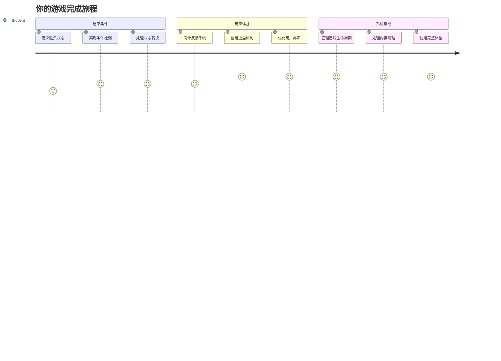
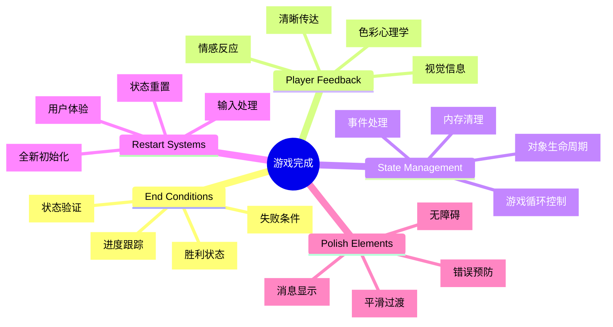
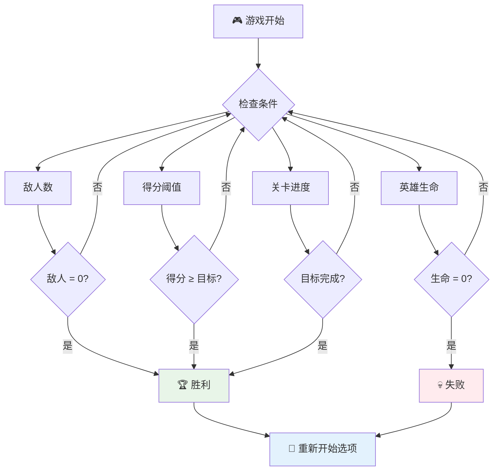
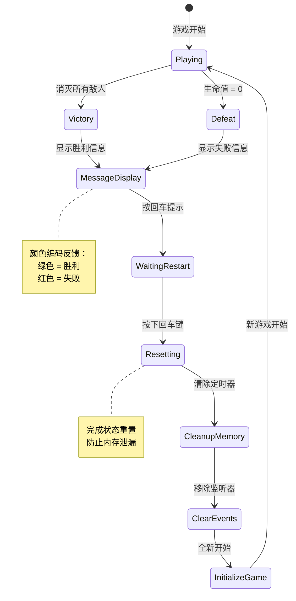
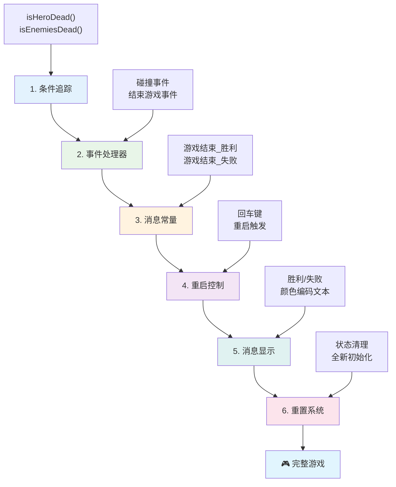
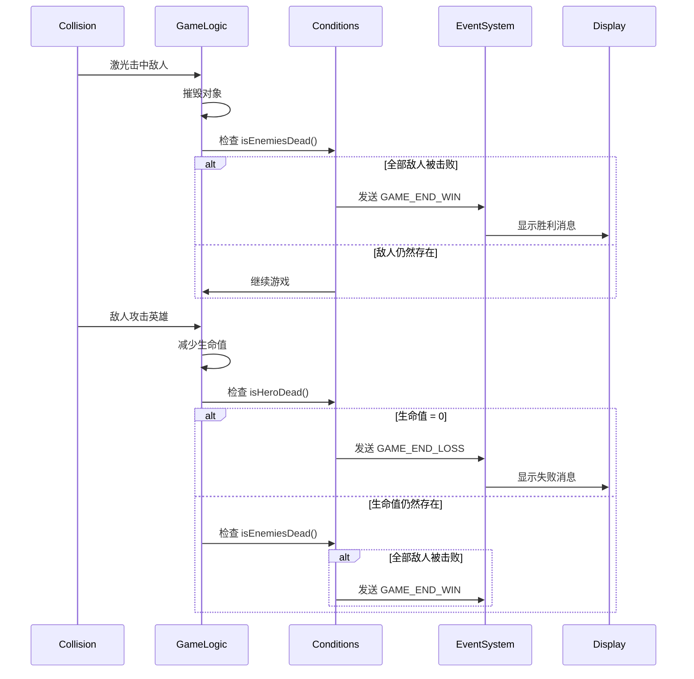

# 构建太空游戏第6部分：结束与重启


每个伟大的游戏都需要清晰的结束条件和流畅的重启机制。你已经打造了一个具有移动、战斗和计分功能的令人印象深刻的太空游戏——现在是时候添加最终的部分，让它感觉完整了。

你的游戏当前无限运行，就像美国宇航局1977年发射的旅行者探测器——几十年后仍在太空中旅行。虽然这对于太空探索很好，但游戏需要定义好的终点来创造令人满意的体验。

今天，我们将实现合适的胜负条件和重启系统。课程结束时，你将拥有一个抛光完善的游戏，玩家可以完成并重玩，就像定义了媒介的经典街机游戏一样。


## 课前测验

[课前测验](https://ff-quizzes.netlify.app/web/quiz/39)

## 理解游戏结束条件

你的游戏应该何时结束？这个基础问题自早期街机时代以来影响了游戏设计。吃豆人被鬼抓住或吃掉所有豆子即结束，太空入侵者则是在外星人到达底部或全部被击毁时结束。

作为游戏创作者，你定义胜利和失败条件。对于我们的太空游戏，以下是创造引人入胜玩法的常见方式：


- **已击毁 `N` 艘敌舰**：如果你将游戏分为不同关卡，通常需要击毁 `N` 艘敌舰以完成关卡
- **你的飞船被击毁**：有些游戏中，如果你的船被毁你就会输。一种常见方式是生命值机制。每当你的船被毁损失一条命，命数耗尽时游戏失败。
- **你获得了 `N` 分**：另一种常见的结束条件是你收集到足够的分数。分数来源由你决定，通常分数赋予消灭敌舰或收集敌舰被击毁后掉落的物品。
- **完成一个关卡**：这可能涉及多个条件，如击毁 `X` 艘敌舰、收集 `Y` 分数，或收集特定道具。

## 实现游戏重启功能

好的游戏通过流畅的重启机制提高重玩价值。当玩家完成游戏（或失败）时，通常希望立即再试一次——无论是为了超越分数还是提升表现。


俄罗斯方块是这方面的典范：当方块堆满顶部时，你可以立即开始新游戏，无需复杂菜单操作。我们将构建类似的重启系统，清晰地重置游戏状态，让玩家迅速回归游戏。

✅ **思考**：想想你玩过的游戏。它们在什么情况下结束？如何提示你重启？什么样的重启体验让人感觉顺畅而非烦躁？

## 你将构建的内容

你将实现最终的功能，把项目打造成完整的游戏体验。这些元素让精致游戏区别于基础原型。

**今天我们添加的内容：**

1. **胜利条件**：消灭全部敌人并庆祝胜利（你应得的！）
2. **失败条件**：耗尽所有生命，面对失败画面
3. **重启机制**：按回车键即可重新开始——因为一场游戏永远不够
4. **状态管理**：每次都是崭新开始——无遗留敌人或奇怪故障

## 准备工作

让我们准备开发环境。你应该已经有上节课的所有太空游戏文件。

**你的项目文件结构应大致如下：**

```bash
-| assets
  -| enemyShip.png
  -| player.png
  -| laserRed.png
  -| life.png
-| index.html
-| app.js
-| package.json
```

**启动你的开发服务器：**

```bash
cd your-work
npm start
```

**该命令执行：**
- 在 `http://localhost:5000` 运行本地服务器
- 正确提供你的文件服务
- 当你修改时自动刷新浏览器

在浏览器打开 `http://localhost:5000` 并验证游戏是否能运行。你应该可以移动，发射并与敌人互动。确认后，我们即可开始实现功能。

> 💡 **专业建议**：为避免Visual Studio Code中警告，请在文件顶部声明 `let gameLoopId;`，而不是在 `window.onload` 函数内声明。这符合现代JavaScript变量声明最佳实践。


## 实现步骤

### 步骤1：创建结束条件追踪函数

我们需要函数来监测游戏何时结束。就像国际空间站上的传感器不断监控关键系统一样，这些函数将持续检查游戏状态。

```javascript
function isHeroDead() {
  return hero.life <= 0;
}

function isEnemiesDead() {
  const enemies = gameObjects.filter((go) => go.type === "Enemy" && !go.dead);
  return enemies.length === 0;
}
```

**幕后发生的事情：**
- **检查** 主角是否已无生命（糟糕！）
- **计算** 当前还活着并在战斗的敌人数量
- **返回** 当战场清空敌人时返回 `true`
- **使用** 简单的真假逻辑保持清晰明了
- **过滤** 所有游戏对象，找出存活者

### 步骤2：更新事件处理器以检测结束条件

现在我们将把这些条件检测连接到游戏事件系统中。每当发生碰撞时，游戏会评估是否触发结束条件。这为关键游戏事件创建即时反馈。


```javascript
eventEmitter.on(Messages.COLLISION_ENEMY_LASER, (_, { first, second }) => {
    first.dead = true;
    second.dead = true;
    hero.incrementPoints();

    if (isEnemiesDead()) {
      eventEmitter.emit(Messages.GAME_END_WIN);
    }
});

eventEmitter.on(Messages.COLLISION_ENEMY_HERO, (_, { enemy }) => {
    enemy.dead = true;
    hero.decrementLife();
    if (isHeroDead())  {
      eventEmitter.emit(Messages.GAME_END_LOSS);
      return; // 胜利之前的代价
    }
    if (isEnemiesDead()) {
      eventEmitter.emit(Messages.GAME_END_WIN);
    }
});

eventEmitter.on(Messages.GAME_END_WIN, () => {
    endGame(true);
});
  
eventEmitter.on(Messages.GAME_END_LOSS, () => {
  endGame(false);
});
```

**这里发生的事情：**
- **激光击中敌人**：双方消失，你得分，我们检查你是否获胜
- **敌人撞击你**：你失去一条命，我们检查你是否还活着
- **合理顺序**：先检查失败（没人想同时赢又输！）
- **即时反应**：重要事件发生时游戏立刻感知

### 步骤3：添加新消息常量

你需要为 `Messages` 常量对象添加新的消息类型。这些常量帮助保持一致性，避免事件系统中的拼写错误。

```javascript
GAME_END_LOSS: "GAME_END_LOSS",
GAME_END_WIN: "GAME_END_WIN",
```

**上面内容：**
- **添加** 代表游戏结束事件的常量以保持一致性
- **使用** 描述性名称清晰标识事件目的
- **遵循** 现有消息类型命名规范

### 步骤4：实现重启控制

接下来添加键盘控制，让玩家能重启游戏。回车键是自然选择，因其常用作确认与开始新游戏的按键。

**在现有keydown事件监听器中添加对回车键的检测：**

```javascript
else if(evt.key === "Enter") {
   eventEmitter.emit(Messages.KEY_EVENT_ENTER);
}
```

**添加新的消息常量：**

```javascript
KEY_EVENT_ENTER: "KEY_EVENT_ENTER",
```

**你需要知道的：**
- **扩展** 你现有的键盘事件处理系统
- **使用** 回车键作为重启触发器，提升用户体验直观性
- **发布** 自定义事件，供游戏的其他部分监听
- **保持** 与其他键盘控制相同模式

### 步骤5：创建消息显示系统

游戏需要清楚地向玩家传达结果。我们将创建一个消息系统，使用颜色编码的文本显示胜利和失败状态，类似早期计算机终端界面绿色表示成功，红色表示错误。

**创建 `displayMessage()` 函数：**

```javascript
function displayMessage(message, color = "red") {
  ctx.font = "30px Arial";
  ctx.fillStyle = color;
  ctx.textAlign = "center";
  ctx.fillText(message, canvas.width / 2, canvas.height / 2);
}
```

**一步步，发生了什么：**
- **设置** 字号和字体，确保文字清晰易读
- **应用** 颜色参数，默认为“红色”表示警告
- **让** 文字在画布水平和垂直居中
- **利用** 现代JavaScript默认参数支持灵活颜色选择
- **借助** canvas 2D上下文直接渲染文本

**创建 `endGame()` 函数：**

```javascript
function endGame(win) {
  clearInterval(gameLoopId);

  // 设置延迟以确保所有待处理的渲染完成
  setTimeout(() => {
    ctx.clearRect(0, 0, canvas.width, canvas.height);
    ctx.fillStyle = "black";
    ctx.fillRect(0, 0, canvas.width, canvas.height);
    if (win) {
      displayMessage(
        "Victory!!! Pew Pew... - Press [Enter] to start a new game Captain Pew Pew",
        "green"
      );
    } else {
      displayMessage(
        "You died !!! Press [Enter] to start a new game Captain Pew Pew"
      );
    }
  }, 200)  
}
```

**此函数做了什么：**
- **冻结** 所有移动——不再有舰船或激光动作
- **暂停** 200毫秒，让最后一帧完成绘制
- **清屏** 并将背景涂成黑色，效果更戏剧化
- **显示** 不同消息给胜利者和失败者
- **用色彩区分消息**——绿代表好消息，红代表……不太好
- **告诉** 玩家如何重新开始游戏

### 🔄 **教学反馈点**
**游戏状态管理**：在实现重置功能前确保理解：
- ✅ 结束条件如何创造清晰的游戏目标
- ✅ 为什么视觉反馈对玩家理解至关重要
- ✅ 合适清理对防止内存泄漏的重要性
- ✅ 事件驱动架构如何实现干净的状态切换

**自测速答**：如果重置时不清理事件监听器会怎样？
*答案：导致内存泄漏和重复事件处理器，引发不可预测的行为*

**游戏设计原则**：你正在实现的是：
- **清晰目标**：玩家明确什么是胜利、什么是失败
- **即时反馈**：游戏状态变化立即被传达
- **用户控制**：玩家准备好了就能重启
- **系统可靠性**：适当清理避免bug和性能损耗

### 步骤6：实现游戏重置功能

重置系统需彻底清理当前游戏状态，初始化清新的游戏会话。保证玩家得到干净的开局，无前一局遗留数据。

**创建 `resetGame()` 函数：**

```javascript
function resetGame() {
  if (gameLoopId) {
    clearInterval(gameLoopId);
    eventEmitter.clear();
    initGame();
    gameLoopId = setInterval(() => {
      ctx.clearRect(0, 0, canvas.width, canvas.height);
      ctx.fillStyle = "black";
      ctx.fillRect(0, 0, canvas.width, canvas.height);
      drawPoints();
      drawLife();
      updateGameObjects();
      drawGameObjects(ctx);
    }, 100);
  }
}
```

**逐部分理解：**
- **检查** 当前是否有游戏循环正在运行
- **清除** 现有游戏循环以停止所有当前游戏活动
- **移除** 所有事件监听器防止内存泄漏
- **重新初始化** 游戏状态，生成全新对象和变量
- **启动** 新的游戏循环，包含必需的游戏逻辑
- **保持** 100毫秒间隔，确保游戏性能一致

**将回车键事件处理器添加到 `initGame()` 函数：**

```javascript
eventEmitter.on(Messages.KEY_EVENT_ENTER, () => {
  resetGame();
});
```

**为你的 EventEmitter 类添加 `clear()` 方法：**

```javascript
clear() {
  this.listeners = {};
}
```

**关键点总结：**
- **将** 回车键按下连接到重置游戏功能
- **在** 游戏初始化时注册此事件监听器
- **提供** 一种清理所有事件监听器的干净方式，用于重置
- **通过** 清空事件处理器避免内存泄漏
- **将** 监听器对象重置为空以便重新初始化

## 恭喜！🎉

👽 💥 🚀 你成功从零构建了完整的游戏。像1970年代首批电子游戏程序员一样，你把代码变成了带有合适游戏机制和用户反馈的互动体验。🚀 💥 👽

**你完成了：**
- **实现** 完整的胜负条件并向用户反馈
- **创建** 无缝重启系统，支持连续游戏
- **设计** 明确的游戏状态视觉传达
- **管理** 复杂的游戏状态切换和清理
- **整合** 所有组件成一个连贯、可玩的游戏

### 🔄 **教学反馈点**
**完整游戏开发系统**：庆祝你掌握了完整开发流程：
- ✅ 结束条件如何创造满足感玩家体验？
- ✅ 为什么正确的状态管理对游戏稳定性关键？
- ✅ 视觉反馈如何增强玩家理解？
- ✅ 重启系统在玩家留存中扮演什么角色？

**系统掌控力**：你的完整游戏展现了：
- **全栈游戏开发**：涵盖图形、输入和状态管理
- **专业架构**：事件驱动系统加上适当清理
- **用户体验设计**：清晰反馈与直观控制
- **性能优化**：高效渲染和内存管理
- **打磨完善**：所有细节让游戏感觉完美

**行业级技能**：你实现了：
- **游戏循环架构**：实时系统性能稳定
- **事件驱动编程**：解耦系统便于扩展
- **状态管理**：复杂数据处理与生命周期管控
- **用户界面设计**：清晰沟通与响应式操作
- **测试与调试**：迭代开发和问题解决

### ⚡ **下5分钟你可以做什么**
- [ ] 玩你的完整游戏，测试所有胜负条件
- [ ] 尝试修改不同结束条件参数
- [ ] 加入 console.log 语句追踪游戏状态变化
- [ ] 与朋友分享游戏并收集反馈

### 🎯 **这小时你可以完成什么**
- [ ] 完成课后测验，反思你的开发历程
- [ ] 为胜负状态添加音效效果
- [ ] 实现额外的结束条件，如限时或奖励目标
- [ ] 制作不同难度，调整敌人数量
- [ ] 美化视觉效果，使用更好字体和颜色

### 📅 **你的周度游戏开发精通计划**
- [ ] 完成增强版太空游戏，多关卡和进度系统
- [ ] 增加高级功能，如增强道具、多样敌人类型和特殊武器
- [ ] 创建保存的高分榜系统
- [ ] 设计菜单、设置和选项的用户界面
- [ ] 优化性能，适配不同设备和浏览器
- [ ] 在线部署你的游戏，与社区分享
### 🌟 **您的一个月游戏开发职业规划**
- [ ] 制作多个完整游戏，探索不同的类型和机制
- [ ] 学习高级游戏开发框架，如 Phaser 或 Three.js
- [ ] 参与开源游戏开发项目的贡献
- [ ] 研究游戏设计原则和玩家心理
- [ ] 创建展示您游戏开发技能的作品集
- [ ] 与游戏开发社区连接，持续学习

## 🎯 您的完整游戏开发精通时间表

```mermaid
timeline
    title 完整游戏开发学习进度
    
    section 基础（课程1-2）
        游戏架构：项目结构
                         ：资源管理
                         ：画布基础
                         ：事件系统
        
    section 交互系统（课程3-4）
        玩家控制：输入处理
                      ：移动机制
                      ：碰撞检测
                      ：物理模拟
        
    section 游戏机制（课程5）
        反馈系统：得分机制
                        ：生命管理
                        ：视觉传达
                        ：玩家激励
        
    section 游戏完成（课程6）
        精细化与流程：结束条件
                     ：状态管理
                     ：重启系统
                     ：用户体验
        
    section 高级功能（一周）
        增强技能：音频整合
                          ：视觉特效
                          ：关卡进度
                          ：性能优化
        
    section 职业发展（一月）
        行业准备：框架精通
                          ：团队协作
                          ：作品集开发
                          ：社区参与
        
    section 职业晋升（三月）
        专业化：高级游戏引擎
                      ：平台部署
                      ：盈利策略
                      ：行业网络
```


### 🛠️ 您的完整游戏开发工具包总结

完成整个太空游戏系列后，您现已掌握：
- **游戏架构**：事件驱动系统、游戏循环和状态管理
- **图形编程**：Canvas API，精灵渲染和视觉效果
- **输入系统**：键盘处理、碰撞检测和响应式控制
- **游戏设计**：玩家反馈、进度系统和参与机制
- **性能优化**：高效渲染、内存管理和帧率控制
- **用户体验**：清晰沟通、直观控制和细节打磨
- **专业模式**：整洁代码、调试技术和项目组织

**现实应用**：您的游戏开发技能直接适用于：
- **交互式网络应用**：动态界面和实时系统
- **数据可视化**：动画图表和交互图形
- **教育技术**：游戏化和吸引人的学习体验
- **移动开发**：基于触摸的交互和性能优化
- **模拟软件**：物理引擎和实时建模
- **创意产业**：互动艺术、娱乐和数字体验

**获得的专业技能**：您现在可以：
- **架构**复杂的交互系统从零开始
- **调试**使用系统化方法的实时应用
- **优化**性能以流畅用户体验
- **设计**吸引人的用户界面和交互模式
- **高效协作**处理技术项目并合理组织代码

**掌握的游戏开发概念**：
- **实时系统**：游戏循环、帧率管理和性能
- **事件驱动架构**：解耦系统和消息传递
- **状态管理**：复杂数据处理和生命周期管理
- **用户界面编程**：Canvas 图形和响应式设计
- **游戏设计理论**：玩家心理和参与机制

**下一阶段**：您已准备好探索高级游戏框架、3D 图形、多玩家系统，或转向专业游戏开发职位！

🌟 **成就解锁**：您已完成完整的游戏开发旅程，从零打造出专业品质的互动体验！

**欢迎加入游戏开发社区！** 🎮✨

## GitHub Copilot Agent 挑战 🚀

使用 Agent 模式完成以下挑战：

**描述：** 通过实现一个关卡进度系统，增加难度和奖励功能，增强太空游戏。

**提示：** 创建一个多关卡太空游戏系统，每个关卡中敌舰数量增加，速度和生命值也提高。增加随关卡增长的得分倍增器，并实现当敌人被摧毁时随机出现的强化道具（如速射或护盾）。包括关卡完成奖励，并在屏幕上显示当前关卡与现有的得分和生命值。

了解更多关于[agent mode](https://code.visualstudio.com/blogs/2025/02/24/introducing-copilot-agent-mode)的信息。

## 🚀 可选增强挑战

**给您的游戏添加音效**：通过实现音效来增强游戏体验！考虑添加以下音效：

- **激光射击**，玩家开火时
- **敌舰摧毁**，敌舰被击中时
- **英雄受伤**，玩家受击时
- **胜利音乐**，游戏胜利时
- **失败音效**，游戏失败时

**音频实现示例：**

```javascript
// 创建音频对象
const laserSound = new Audio('assets/laser.wav');
const explosionSound = new Audio('assets/explosion.wav');

// 在游戏事件中播放声音
function playLaserSound() {
  laserSound.currentTime = 0; // 重置到开始处
  laserSound.play();
}
```

**您需要了解：**
- **创建**用于不同音效的 Audio 对象
- **重置**`currentTime`以支持快速连续音效播放
- **处理**浏览器自动播放策略，通过用户交互触发声音
- **管理**音量和时序以提升游戏体验

> 💡 **学习资源**：探索这个[audio sandbox](https://www.w3schools.com/jsref/tryit.asp?filename=tryjsref_audio_play)，了解更多 JavaScript 游戏中音频实现。

## 课后测验

[课后测验](https://ff-quizzes.netlify.app/web/quiz/40)

## 复习与自学

您的作业是创建一个新的示例游戏，您可以探索一些有趣的游戏，看看想制作哪种类型的游戏。

## 任务

[构建示例游戏](assignment.md)

---

<!-- CO-OP TRANSLATOR DISCLAIMER START -->
**免责声明**：  
本文件由 AI 翻译服务 [Co-op Translator](https://github.com/Azure/co-op-translator) 翻译而成。尽管我们努力确保准确性，但请注意自动翻译可能包含错误或不准确之处。原始文本的原文版本应视为权威来源。对于重要信息，建议采用专业人工翻译。对于因使用本翻译而产生的任何误解或曲解，我们概不负责。
<!-- CO-OP TRANSLATOR DISCLAIMER END -->