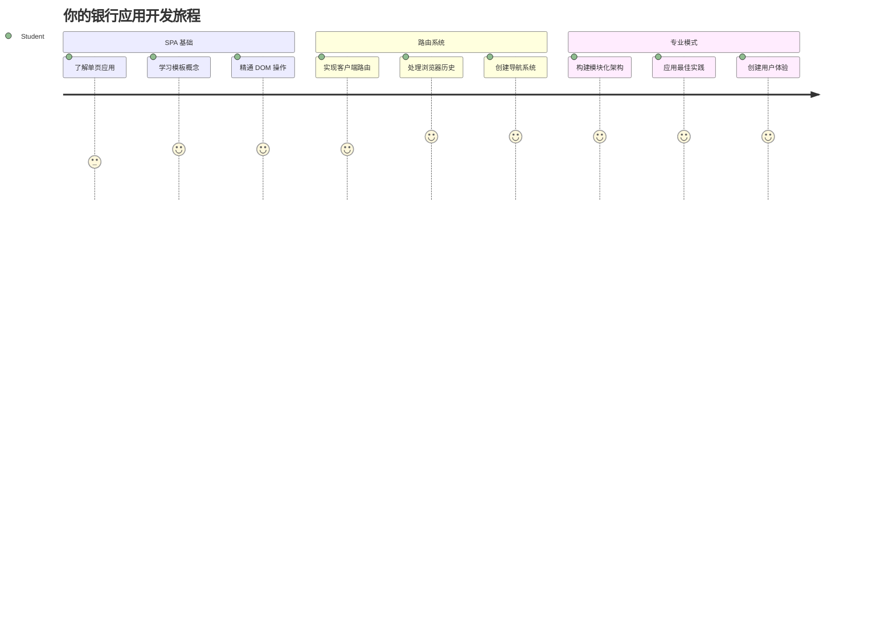
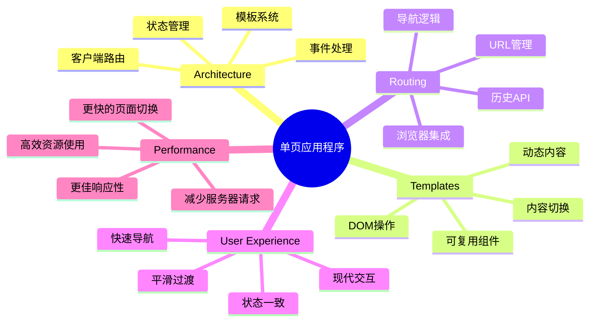
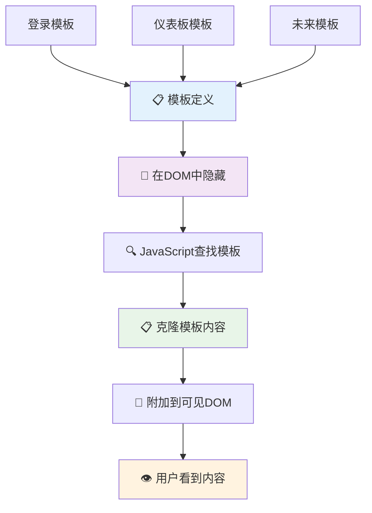
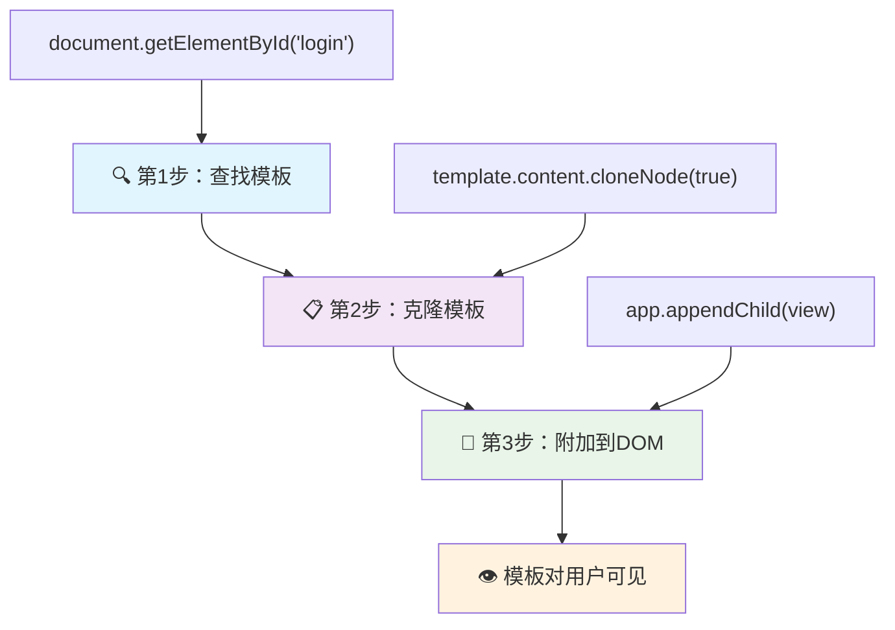
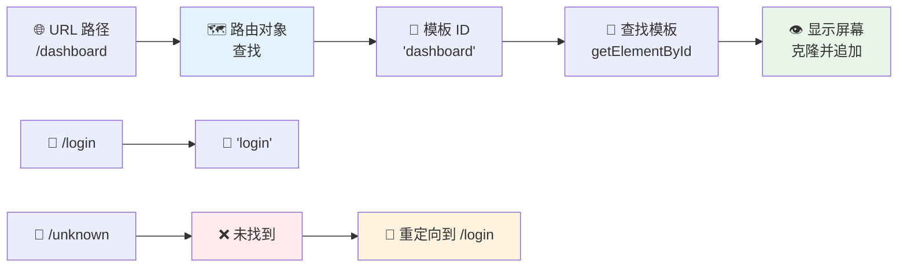
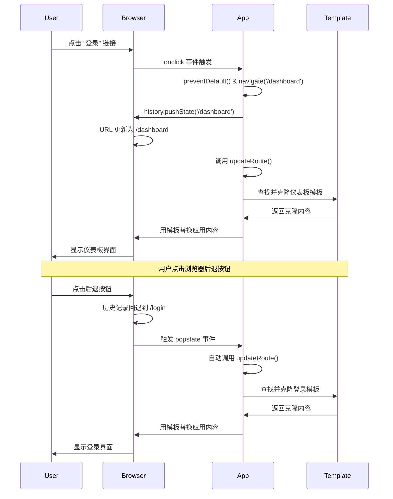
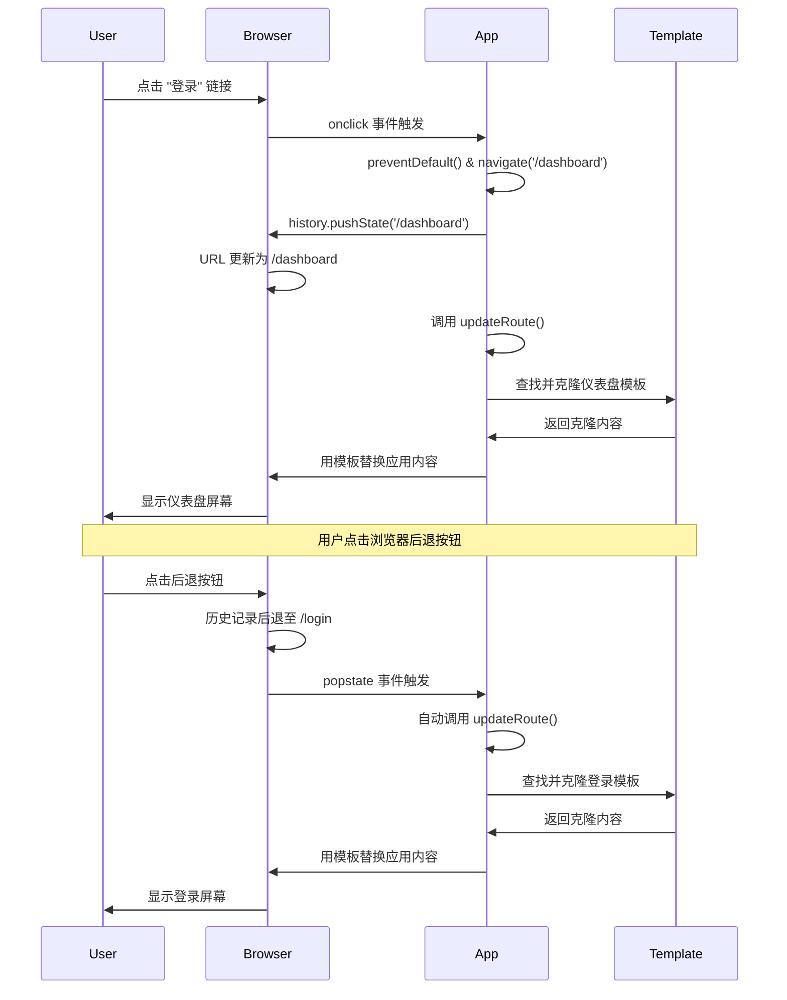
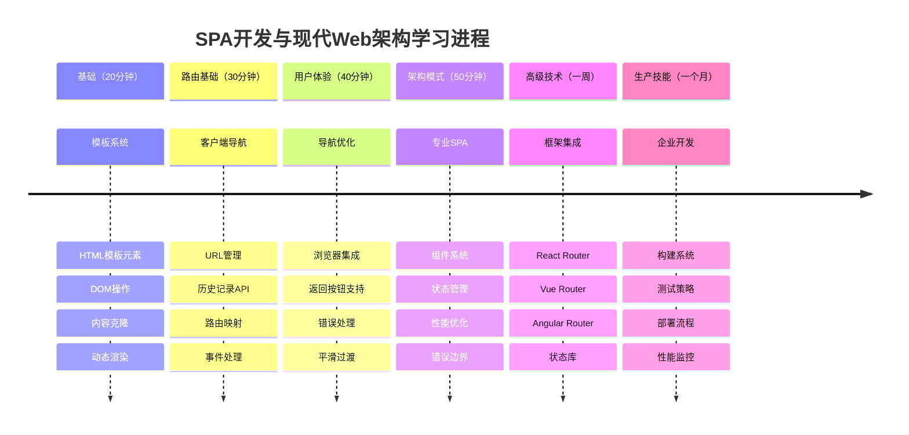

# 构建银行应用第1部分：Web应用中的HTML模板与路由


1969年，当阿波罗11号的导航计算机飞向月球时，它必须在不重启整个系统的情况下切换不同程序。现代Web应用类似——它们改变你看到的内容而不重新加载所有内容。这创造了用户如今期望的流畅、响应式体验。

与每次交互都重新加载整个页面的传统网站不同，现代Web应用只更新需要更改的部分。这种方法就像任务控制中心在保持持续通信的同时切换不同显示屏一样，产生了我们习以为常的流畅体验。

以下是造成差异的关键：

| 传统多页面应用 | 现代单页面应用 |
|----------------------------|-------------------------|
| **导航** | 每个屏幕都全页重新加载 | 内容瞬时切换 |
| **性能** | 由于完整HTML下载较慢 | 通过局部更新更快 |
| **用户体验** | 令人不适的页面闪烁 | 平滑的类应用过渡 |
| **数据共享** | 页面间共享困难 | 状态管理简单 |
| **开发** | 维护多个HTML文件 | 单一HTML与动态模板 |

**理解演变：**
- **传统应用** 每次导航都需服务器请求
- **现代SPA** 一次加载，使用JavaScript动态更新内容
- **用户期望** 现偏好即时、无缝交互
- **性能优势** 包括带宽减少和响应加快

本课将构建一个拥有多个无缝流转页面的银行应用。就像科学家使用可重构的模块化仪器进行不同实验一样，我们将使用HTML模板作为可重复使用的组件，根据需要显示。

你将使用HTML模板（不同画面的可重用蓝图）、JavaScript路由（切换不同屏幕的系统）和浏览器历史API（保持返回按钮正常工作）。这些是React、Vue和Angular等框架的基本技术。

最终，你将获得一个展示专业单页面应用原则的可用银行应用。


## 课前测验

[课前测验](https://ff-quizzes.netlify.app/web/quiz/41)

### 你需要准备的内容

我们需要一个本地Web服务器来测试银行应用——别担心，没你想象的难！如果你还没有配置，只需安装 [Node.js](https://nodejs.org) 并在项目文件夹运行 `npx lite-server`。这个命令会启动本地服务器并自动在浏览器打开应用。

### 准备工作

在你的电脑上创建一个名为 `bank` 的文件夹，里面放一个名为 `index.html` 的文件。我们将从这个HTML [模板](https://en.wikipedia.org/wiki/Boilerplate_code)开始：

```html
<!DOCTYPE html>
<html lang="en">
  <head>
    <meta charset="UTF-8">
    <meta name="viewport" content="width=device-width, initial-scale=1.0">
    <title>Bank App</title>
  </head>
  <body>
    <!-- This is where you'll work -->
  </body>
</html>
```

**这个模板提供了：**
- **建立** 正确DOCTYPE声明的HTML5文档结构
- **设置** 字符编码为UTF-8以支持国际文本
- **启用** 响应式设计，使用viewport元标签兼容移动设备
- **设定** 浏览器标签页显示的描述性标题
- **创建** 一个干净的主体部分，用于构建应用

> 📁 **项目结构预览**
> 
> **完成此课时后，项目将包含：**
> ```
> bank/
> ├── index.html      <!-- Main HTML with templates -->
> ├── app.js          <!-- Routing and navigation logic -->
> └── style.css       <!-- (Optional for future lessons) -->
> ```
> 
> **文件职责：**
> - **index.html**：包含所有模板和应用结构
> - **app.js**：负责路由、导航和模板管理
> - **模板**：定义登录、仪表盘及其他屏幕的UI

---

## HTML模板

模板解决了Web开发中的一个根本问题。古腾堡在1440年代发明活字印刷时意识到，与其刻画整页，他可以制作可复用的字母块并按需排列。HTML模板原理相同——不为每个屏幕创建单独HTML文件，而是定义可复用结构，按需显示。


把模板看作应用不同部分的蓝图。就像建筑师绘制一个蓝图多次使用，而不是重复绘制相同房间，我们创建模板一次，按需实例化。浏览器会将这些模板隐藏，直到JavaScript激活它们。

如果想为网页创建多个屏幕，一种办法是每个屏幕一个HTML文件。然而，这样做有不便：

- 切换屏幕时必须重新加载整个HTML，速度较慢
- 不同屏幕间共享数据困难

另一种方法是只用一个HTML文件，通过 `<template>` 元素定义多个 [HTML模板](https://developer.mozilla.org/docs/Web/HTML/Element/template)。模板是一个复用的HTML块，浏览器不显示，需使用JavaScript在运行时实例化。

### 我们开始构建

我们要创建一个包含两个主要屏幕的银行应用：登录页和仪表盘。首先，在HTML body中添加一个占位元素——所有不同屏幕将显示于此：

```html
<div id="app">Loading...</div>
```

**理解这个占位符：**
- **创建** 一个ID为“app”的容器，将显示所有屏幕
- **显示** 加载消息，直到JavaScript初始化第一个屏幕
- **提供** 动态内容的唯一挂载点
- **便于** JavaScript 使用 `document.getElementById()` 访问

> 💡 **专业提示**: 由于该元素内容将被替换，可以放置加载消息或指示器，应用加载时显示。

接下来，在HTML模板下方添加登录页的模板。暂时只放置一个标题和一个包含用于导航的链接的部分。

```html
<template id="login">
  <h1>Bank App</h1>
  <section>
    <a href="/dashboard">Login</a>
  </section>
</template>
```

**分析此登录模板：**
- **定义** ID为“login”的模板，便于JavaScript定位
- **包含** 一个主标题，确立应用品牌
- **用** 语义化的 `<section>` 元素分组相关内容
- **提供** 导航链接，引导用户跳转仪表盘

然后，添加仪表盘的另一个HTML模板。此页面包含几个部分：

- 带标题和注销链接的页眉
- 当前银行账户余额
- 一个使用表格展示的交易列表

```html
<template id="dashboard">
  <header>
    <h1>Bank App</h1>
    <a href="/login">Logout</a>
  </header>
  <section>
    Balance: 100$
  </section>
  <section>
    <h2>Transactions</h2>
    <table>
      <thead>
        <tr>
          <th>Date</th>
          <th>Object</th>
          <th>Amount</th>
        </tr>
      </thead>
      <tbody></tbody>
    </table>
  </section>
</template>
```

**理解此仪表盘各部分：**
- **用** 语义 `<header>` 元素组织页面及导航
- **显示** 跨屏幕一致的应用标题，强化品牌
- **提供** 返回登录页的注销链接
- **展示** 专门区域内的当前账户余额
- **使用** 结构化的HTML表格组织交易数据
- **定义** 日期、对象和金额三栏表头
- **留空** 表体，待后续动态注入内容

> 💡 **专业提示**：创建HTML模板时，若想预览外观，可以将 `<template>` 和 `</template>` 标签注释掉，使用 `<!-- -->` 包围。

### 🔄 **教学小检验**
**模板系统理解**：在实现JavaScript前，确保你了解：
- ✅ 模板与普通HTML元素的区别
- ✅ 模板为何在JavaScript激活前保持隐藏
- ✅ 语义化HTML结构在模板中的重要性
- ✅ 模板如何支持可复用UI组件

**快速自测**：若移除HTML外围的 `<template>` 标记会怎样？
*答：内容立即可见，却失去模板功能*

**架构优势**：模板提供：
- **重用性**：定义一次，多次实例
- **性能**：避免重复HTML解析
- **可维护性**：UI结构集中管理
- **灵活性**：动态切换内容

✅ 为什么我们给模板加了 `id` 属性？能否用类名代替？

## 用JavaScript激活模板

现在我们需要让模板具备功能。就像3D打印机根据数字蓝图制造实体，JavaScript将我们的隐藏模板转换成用户可见且可交互的元素。

这个过程有三个一致步骤，形成了现代Web开发的基础。掌握此模式，你会在各框架和库中见到。

若在浏览器打开当前HTML文件，屏幕会一直显示“Loading...”，因为我们还没添加JavaScript来实例化并显示HTML模板。

实例化模板通常分三步：

1. 使用 [`document.getElementById`](https://developer.mozilla.org/docs/Web/API/Document/getElementById) 获取DOM中的模板元素。
2. 使用 [`cloneNode`](https://developer.mozilla.org/docs/Web/API/Node/cloneNode) 复制模板内容。
3. 使用 [`appendChild`](https://developer.mozilla.org/docs/Web/API/Node/appendChild) 将复制的内容附加到可见DOM元素。


**过程视觉分解：**
- **第一步** 定位隐藏在DOM中的模板
- **第二步** 创建可安全修改的工作副本
- **第三步** 将副本插入可见页面区域
- **结果** 为用户提供可交互的功能屏幕

✅ 为什么需要在附加到DOM前克隆模板？若跳过这步会怎样？

### 任务

在项目文件夹内创建一个新文件 `app.js`，并在HTML `<head>` 中引入它：

```html
<script src="app.js" defer></script>
```

**理解此脚本引入：**
- **关联** JavaScript文件至HTML文档
- **使用** `defer` 属性确保脚本在HTML解析完成后执行
- **允许** 脚本执行时所有DOM元素已加载
- **遵循** 现代最佳脚本加载及性能实践

接下来在 `app.js` 中创建一个新函数 `updateRoute`：

```js
function updateRoute(templateId) {
  const template = document.getElementById(templateId);
  const view = template.content.cloneNode(true);
  const app = document.getElementById('app');
  app.innerHTML = '';
  app.appendChild(view);
}
```

**逐步解析：**
- **通过唯一ID定位** 模板元素
- **使用** `cloneNode(true)` 深拷贝模板内容
- **定位** 应用容器，用于显示内容
- **清空** 应用容器已有内容
- **插入** 克隆后的模板内容至可见DOM

调用此函数，传入其中一个模板ID，看看结果。

```js
updateRoute('login');
```

**函数调用做了什么：**
- **激活** 传入的登录模板ID对应模板
- **展示** 如何程序化切换应用不同屏幕
- **将“Loading...”替换成登录界面**

✅ 代码中的 `app.innerHTML = '';` 是做什么的？没有它会怎样？

## 创建路由

路由本质上是把URL与正确内容连接起来。想想早期电话接线员如何使用配线板连接电话——他们接受请求并转接至正确目标。Web路由也类似，根据URL请求决定展示何内容。


传统上，Web服务器通过不同HTML文件响应不同URL。我们构建的是单页面应用，需用JavaScript自主管理路由。这样我们能更好地控制用户体验和性能。


**理解路由流程：**
- **URL变更** 触发查看路由配置
- **有效路由** 映射至特定模板ID渲染
- **无效路由** 触发回退行为，避免错误状态
- **模板渲染** 按照之前学的三步完成

在Web应用中，*路由*指意图将**URL**映射到应展示的特定屏幕。多HTML文件的网站会自动完成此映射，因为文件路径和URL对应。例如，假设项目有这些文件：

```
mywebsite/index.html
mywebsite/login.html
mywebsite/admin/index.html
```

若以 `mywebsite` 作为根目录运行Web服务器，URL映射将是：

```
https://site.com            --> mywebsite/index.html
https://site.com/login.html --> mywebsite/login.html
https://site.com/admin/     --> mywebsite/admin/index.html
```

不过，我们的Web应用只有一个HTML文件包含所有屏幕，默认行为不适用。我们需手动创建映射并用JavaScript更新显示的模板。

### 任务

用一个简单对象实现URL路径和模板间的[映射](https://en.wikipedia.org/wiki/Associative_array)。在`app.js`文件顶部添加此对象。

```js
const routes = {
  '/login': { templateId: 'login' },
  '/dashboard': { templateId: 'dashboard' },
};
```

**理解此路由配置：**
- **定义** URL路径至模板ID的映射关系
- **使用** 对象语法，键为URL路径，值为模板信息
- **方便** 对任意URL快速查找对应模板
- **提供** 未来添加新路由的可扩展结构
现在让我们稍微修改一下 `updateRoute` 函数。不是直接将 `templateId` 作为参数传递，而是先查看当前的 URL，然后使用我们的映射关系来获取相应的模板 ID。我们可以使用 [`window.location.pathname`](https://developer.mozilla.org/docs/Web/API/Location/pathname) 来仅获取 URL 中的路径部分。

```js
function updateRoute() {
  const path = window.location.pathname;
  const route = routes[path];

  const template = document.getElementById(route.templateId);
  const view = template.content.cloneNode(true);
  const app = document.getElementById('app');
  app.innerHTML = '';
  app.appendChild(view);
}
```

**解析这里发生的事情：**
- **提取** 浏览器 URL 中当前的路径，使用 `window.location.pathname`
- **查找** 在我们的 routes 对象中对应的路由配置
- **获取** 路由配置中的模板 ID
- **遵循** 之前相同的模板渲染过程
- **创建** 一个响应 URL 变化的动态系统

这里我们将声明的路由映射到对应的模板。你可以通过手动更改浏览器中的 URL 来尝试检验其是否正确工作。

✅ 如果你在 URL 中输入一个未知路径会发生什么？我们该如何解决这个问题？

## 添加导航

有了路由，用户需要一种方式在应用内导航。传统网站点击链接时会重新加载整个页面，但我们希望在不刷新页面的情况下同时更新 URL 和内容。这会带来更流畅的体验，类似于桌面应用切换不同视图的方式。

我们需要协调两件事：更新浏览器的 URL 以便用户可以收藏页面和分享链接，以及显示恰当的内容。正确实现时，这将创建用户对现代应用所期待的无缝导航体验。


### 🔄 **教学核对点**
**单页应用架构**：验证你对完整系统的理解：
- ✅ 客户端路由与传统服务器端路由有何不同？
- ✅ History API 为什么对正确的 SPA 导航至关重要？
- ✅ 模板如何实现无刷新页面的动态内容？
- ✅ 事件处理在拦截导航中扮演什么角色？

**系统集成**：你的 SPA 展示了：
- **模板管理**：可复用的 UI 组件与动态内容
- **客户端路由**：无需服务器请求的 URL 管理
- **事件驱动架构**：响应式导航与用户交互
- **浏览器集成**：正确的历史记录和前进/后退按钮支持
- **性能优化**：快速切换，减少服务器负担

**专业模式**：你已实现：
- **模型-视图分离**：模板与应用逻辑分开
- **状态管理**：URL 状态与显示内容同步
- **渐进增强**：JavaScript 强化基础 HTML 功能
- **用户体验**：平滑类应用导航，无需刷新页面

> � **架构洞见**：导航系统组件
>
> **你构建的内容：**
> - **🔄 URL 管理**：无刷新更新浏览器地址栏
> - **📋 模板系统**：根据当前路由动态切换内容  
> - **📚 历史集成**：支持浏览器前进和后退按钮
> - **🛡️ 错误处理**：无效或缺失路由时的优雅降级
>
> **组件协同工作方式：**
> - **监听** 导航事件（点击、历史变化）
> - **更新** URL，使用 History API
> - **渲染** 新路由对应的模板
> - **维持** 用户无缝体验

下一步是让我们的应用可以在不手动更改 URL 的情况下导航页面。这包括两件事：

  1. 更新当前 URL
  2. 基于新 URL 更新显示的模板

我们已经用 `updateRoute` 处理了第二部分，所以需要弄清楚如何更新当前 URL。

我们将使用 JavaScript，尤其是 [`history.pushState`](https://developer.mozilla.org/docs/Web/API/History/pushState)，它允许更新 URL 以及在浏览历史中创建新条目，而无需重新加载 HTML。

> ⚠️ **重要说明**：虽然 HTML 的锚点元素 [`<a href>`](https://developer.mozilla.org/docs/Web/HTML/Element/a) 可以用来创建指向不同 URL 的超链接，但默认行为是浏览器重新加载页面。使用自定义 JavaScript 处理路由时，必须通过点击事件的 preventDefault() 函数来阻止这种行为。

### 任务

让我们创建一个可以用来在应用内导航的新函数：

```js
function navigate(path) {
  window.history.pushState({}, path, path);
  updateRoute();
}
```

**理解导航函数的功能：**
- **更新** 浏览器 URL，使用 `history.pushState`
- **添加** 新条目到浏览器历史栈，支持前进/后退按钮
- **触发** `updateRoute()` 函数，显示对应模板
- **保持** 单页应用体验，无页面刷新

此方法先根据给定路径更新当前 URL，接着更新模板。`window.location.origin` 属性返回 URL 根地址，方便根据路径重新构建完整 URL。

既然有了这个函数，我们可以解决路径不匹配任何定义路由的问题。我们将在 `updateRoute` 函数中添加一个回退逻辑，当找不到匹配时导航至现有路由。

```js
function updateRoute() {
  const path = window.location.pathname;
  const route = routes[path];

  if (!route) {
    return navigate('/login');
  }

  const template = document.getElementById(route.templateId);
  const view = template.content.cloneNode(true);
  const app = document.getElementById('app');
  app.innerHTML = '';
  app.appendChild(view);
}
```

**关键点回顾：**
- **检查** 当前路径是否有对应路由
- **访问无效路由时，重定向** 到登录页
- **提供** 防止导航失败的回退机制
- **确保** 即使 URL 错误，用户也能看到有效页面

如果找不到路由，则重定向到 `login` 页面。

接下来创建一个函数，能够在点击链接时获取 URL，并阻止浏览器默认跳转行为：

```js
function onLinkClick(event) {
  event.preventDefault();
  navigate(event.target.href);
}
```

**解析这个点击处理函数：**
- **阻止** 浏览器默认点击链接行为，调用 `preventDefault()` 
- **提取** 所点击链接元素的目标 URL
- **调用** 自定义导航函数，代替页面重载
- **保持** 平滑的单页应用体验

```html
<a href="/dashboard" onclick="onLinkClick(event)">Login</a>
...
<a href="/login" onclick="onLinkClick(event)">Logout</a>
```

**这个 onclick 绑定实现了什么：**
- **连接** 每个链接与自定义导航系统
- **将** 点击事件传递给 `onLinkClick` 函数处理
- **启用** 无刷新平滑导航
- **维持** 用户可收藏或分享的正确 URL 结构

[`onclick`](https://developer.mozilla.org/docs/Web/API/GlobalEventHandlers/onclick) 属性绑定了 `click` 事件，这里绑定的是调用 `navigate()` 函数。

试着点击这些链接，现在应该能在应用的不同界面间导航。

✅ `history.pushState` 方法是 HTML5 标准的一部分，已被[所有现代浏览器](https://caniuse.com/?search=pushState)支持。如果你为较老浏览器构建应用，有个替代方案：使用 [hash（#）](https://en.wikipedia.org/wiki/URI_fragment) 作为路径前缀，你可以实现基于常规锚点导航的路由，页面不会重载，因为其本意是创建页内锚点链接。

## 让后退和前进按钮生效

后退和前进按钮是网页浏览的基础，就像 NASA 任务控制人员可以回顾太空任务中的系统状态一样。用户期望这些按钮正常工作，不然就破坏了预期的浏览体验。

我们的单页应用需要额外配置来支持这一点。浏览器维护一个历史记录栈（我们通过 `history.pushState` 持续添加），但在用户通过历史记录导航时，应用需要对应更新显示内容。


**关键交互点：**
- **用户操作** 通过点击或浏览器按钮触发导航
- **应用拦截** 链接点击，防止页面刷新
- **历史 API** 管理 URL 变化和浏览器历史栈
- **模板** 提供每个页面的内容结构
- **事件监听** 确保应用对所有导航操作响应

使用 `history.pushState` 创建了新的浏览历史条目。你可以按住浏览器的 *后退按钮* 来查看，如下图所示：


如果你尝试点击后退几次，你会发现当前 URL 变化了，历史记录也更新了，但显示的模板却没有变化。

这是因为应用并不知道每当历史变化时需要调用 `updateRoute()`。查看 [`history.pushState` 文档](https://developer.mozilla.org/docs/Web/API/History/pushState) 会看到，如果状态发生变化 —— 意味着我们跳转到了不同 URL —— 会触发 [`popstate`](https://developer.mozilla.org/docs/Web/API/Window/popstate_event) 事件。我们将用它来解决这个问题。

### 任务

为了确保当浏览器历史变化时，显示的模板也会更新，我们将在 `app.js` 文件底部添加一个新函数，调用 `updateRoute()`：

```js
window.onpopstate = () => updateRoute();
updateRoute();
```

**理解历史集成：**
- **监听** 当用户通过浏览器按钮导航时触发的 `popstate` 事件
- **使用** 箭头函数简写事件处理器
- **自动调用** 每次历史状态改变就调用 `updateRoute()`
- **初始化** 页面首次加载时也调用 `updateRoute()`
- **保证** 无论用户如何导航，显示正确模板

> 💡 **专业提示**：这里我们用 [箭头函数](https://developer.mozilla.org/docs/Web/JavaScript/Reference/Functions/Arrow_functions) 简洁声明 `popstate` 事件处理器，但常规函数也同样有效。

这是一个箭头函数复习视频：

[](https://youtube.com/watch?v=OP6eEbOj2sc "箭头函数")

> 🎥 点击上图观看箭头函数视频。

现在尝试使用浏览器的后退和前进按钮，查看这次显示的路由是否正确更新。

### ⚡ **你可以在接下来的 5 分钟内做什么**
- [ ] 测试你的银行应用是否支持浏览器前进/后退按钮导航
- [ ] 尝试手动在地址栏输入不同的 URL 测试路由
- [ ] 打开浏览器开发者工具，查看模板如何被克隆到 DOM
- [ ] 尝试添加 console.log 来跟踪路由流程

### 🎯 **你可以在接下来的一小时内完成什么**
- [ ] 完成课后测验，理解 SPA 架构概念
- [ ] 添加 CSS 样式，让银行应用模板更专业
- [ ] 实现 404 错误页挑战，处理错误路由
- [ ] 创建鸣谢页面挑战，添加额外路由功能
- [ ] 添加加载状态和模板切换过渡动画

### 📅 **你的一周 SPA 开发路线**
- [ ] 完成包含表单、数据管理和持久化的完整银行应用
- [ ] 添加路由参数和嵌套路由等高级功能
- [ ] 实现导航守卫和基于认证的路由
- [ ] 创建可复用的模板组件和组件库
- [ ] 添加动画与过渡，提升用户体验
- [ ] 部署 SPA 至托管平台并正确配置路由

### 🌟 **你一个月的前端架构精通计划**
- [ ] 使用 React、Vue 或 Angular 构建复杂 SPA
- [ ] 学习高级状态管理模式与库
- [ ] 精通 SPA 构建工具与开发流程
- [ ] 实现渐进式 Web 应用与离线功能
- [ ] 研究大型 SPA 的性能优化技巧
- [ ] 参与开源 SPA 项目并分享经验

## 🎯 你的单页应用掌握时间线


### 🛠️ 你的 SPA 开发工具总结

完成本课后，你已掌握：
- **模板架构**：可复用的 HTML 组件与动态内容渲染
- **客户端路由**：无刷新页面的 URL 管理与导航
- **浏览器集成**：History API 使用及前进/后退支持
- **事件驱动系统**：导航处理与用户交互管理
- **DOM 操作**：模板克隆、内容切换与元素管理
- **错误处理**：无效路由与缺失内容的优雅降级
- **性能模式**：高效内容加载与渲染策略

**真实应用场景**：你的 SPA 开发技能直接应用于：
- **现代网络应用**：React、Vue、Angular 等框架开发
- **渐进式 Web 应用**：支持离线和类应用体验
- **企业仪表盘**：多视图复杂业务应用
- **电子商务平台**：产品目录、购物车和结账流程
- **内容管理**：动态内容创建与编辑接口
- **移动开发**：使用 Web 技术的混合应用

**获得的职业技能**：你现在可以：
- **构建** 单页应用，合理实现关注点分离  
- **实现** 可随应用复杂度扩展的客户端路由系统  
- **调试** 复杂的导航流程，使用浏览器开发者工具  
- **优化** 应用性能，通过高效的模板管理  
- **设计** 原生且响应迅速的用户体验  

**掌握的前端开发概念**：  
- **组件架构**：可复用的UI模式和模板系统  
- **状态同步**：URL状态管理和浏览器历史记录  
- **事件驱动编程**：用户交互处理和导航  
- **性能优化**：高效的DOM操作和内容加载  
- **用户体验设计**：流畅的过渡和直观的导航  

**下一阶段**：你已准备好探索现代前端框架、高级状态管理，或构建复杂的企业级应用！  

🌟 **成就解锁**：你已使用现代网页架构模式构建了专业的单页应用基础！  

---

## GitHub Copilot Agent 挑战 🚀

使用 Agent 模式完成以下挑战：

**描述：** 通过为无效路由实现错误处理和404页面模板，提升银行应用的用户体验，改善访问不存在页面时的表现。

**提示：** 创建一个id为 "not-found" 的新HTML模板，显示用户友好的404错误页面并附加样式。然后修改JavaScript路由逻辑，当用户导航到无效URL时显示此模板，并添加一个 “回首页” 按钮，导航回登录页。

在这里了解更多关于[agent模式](https://code.visualstudio.com/blogs/2025/02/24/introducing-copilot-agent-mode)的信息。

## 🚀 挑战

添加一个新的模板和路由，作为第三个页面，展示本应用的鸣谢内容。

**挑战目标：**  
- **创建** 一个新的HTML模板，包含合适的内容结构  
- **添加** 新路由至你的路由配置对象中  
- **包含** 指向鸣谢页及从其返回的导航链接  
- **测试** 浏览器历史下所有导航的正常工作  

## 课后测验

[课后测验](https://ff-quizzes.netlify.app/web/quiz/42)

## 复习与自主学习

路由是web开发中意外复杂的部分之一，尤其随着网页从刷新行为转向单页应用的页面刷新。阅读一些关于[Azure静态网站服务](https://docs.microsoft.com/azure/static-web-apps/routes/?WT.mc_id=academic-77807-sagibbon)如何处理路由的内容。你能解释文档中描述的某些决策为什么是必要的吗？  

**额外学习资源：**  
- **探索** React Router 和 Vue Router 等流行框架如何实现客户端路由  
- **研究** 基于哈希的路由和历史API路由的区别  
- **学习** 服务器端渲染（SSR）以及它如何影响路由策略  
- **调查** 渐进式网页应用（PWA）如何处理路由和导航  

## 作业

[改进路由](assignment.md)

---

<!-- CO-OP TRANSLATOR DISCLAIMER START -->
**免责声明**：  
本文件由人工智能翻译服务[Co-op Translator](https://github.com/Azure/co-op-translator)翻译而成。虽然我们努力保证翻译的准确性，但请注意自动翻译可能存在错误或不准确之处。原文应被视为权威版本。对于重要信息，建议采用专业人工翻译。因使用本翻译所产生的任何误解或误释，我们不承担任何责任。
<!-- CO-OP TRANSLATOR DISCLAIMER END -->