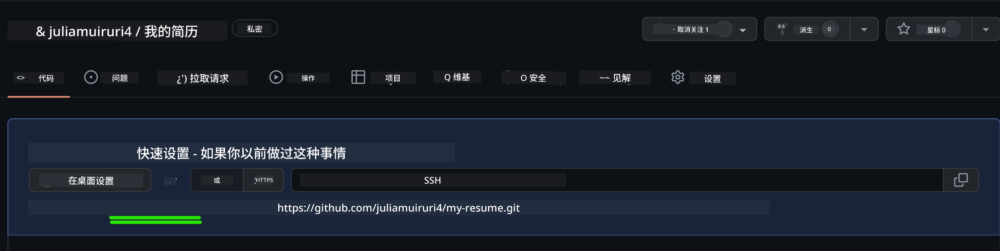
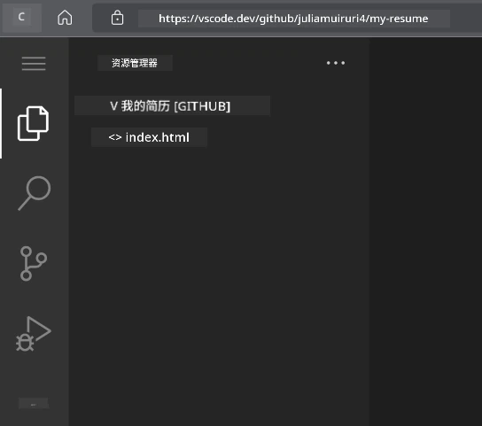
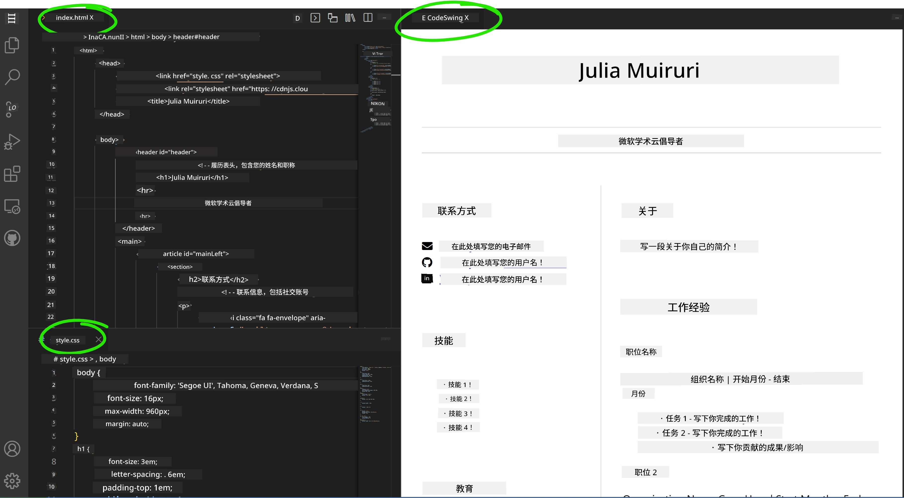

# 使用 VSCode.dev 创建简历网站

通过构建一个专业的简历网站，展示您的技能和经验，以交互式、现代化的形式提升您的职业前景。想象一下，您不再发送传统的 PDF，而是向招聘人员提供一个时尚、响应式的网站，既展示您的资格，也体现您的网页开发能力。

此动手作业让您将所有 VSCode.dev 技能付诸实践，同时创建一个对您的职业生涯真正有用的东西。您将体验完整的网页开发工作流程——从仓库创建到部署——全部在浏览器内完成。

完成本项目后，您将拥有一个专业的线上形象，能够轻松与潜在雇主分享，随着技能提升不断更新，并可根据个人品牌定制。这正是展示实际网页开发技能的实用项目。

## 学习目标

完成此作业后，您将能够：

- **使用 VSCode.dev** 创建并管理完整的网页开发项目
- **使用语义 HTML 元素** 构建专业网站结构
- **利用现代 CSS 技术** 设计响应式布局
- **使用基础网页技术** 实现交互功能
- **部署** 可通过共享链接访问的实时网站
- **展示** 开发过程中的版本控制最佳实践

## 前提条件

开始本作业之前，请确保您具备：

- 一个 GitHub 账号（如需请前往 [github.com](https://github.com/) 创建）
- 已完成 VSCode.dev 课程中关于界面导航和基本操作的学习
- 对 HTML 结构和 CSS 样式概念有基本理解

## 项目设置与仓库创建

让我们从搭建项目基础开始。此过程模拟实际开发流程，项目起步即有合适的仓库初始化和结构规划。

### 第 1 步：创建您的 GitHub 仓库

设置专用仓库，确保项目自始至终有良好组织和版本控制。

1. **访问** [GitHub.com](https://github.com) 并登录您的账号
2. **点击** 右上角绿色的“New”按钮或“+”图标
3. **为仓库命名** 为 `my-resume`（或选择个性化名称如 `john-smith-resume`）
4. **填写** 简短描述：“使用 HTML 和 CSS 构建的专业简历网站”
5. **选择** “Public”，使您的简历对潜在雇主可见
6. **勾选** “Add a README file” 以创建初始项目描述
7. **点击** “Create repository” 完成设置

> 💡 **仓库命名建议**：使用描述性、专业的名称，明确表明项目用途，有助于与雇主分享或作品集展示。

### 第 2 步：初始化项目结构

由于 VSCode.dev 需要至少一个文件才能打开仓库，我们将在 GitHub 上直接创建主 HTML 文件，然后切换到网页编辑器。

1. **点击** “creating a new file” 链接
2. **输入** 文件名为 `index.html`
3. **添加** 以下初始 HTML 结构：

```html
<!DOCTYPE html>
<html lang="en">
<head>
    <meta charset="UTF-8">
    <meta name="viewport" content="width=device-width, initial-scale=1.0">
    <title>Your Name - Professional Resume</title>
</head>
<body>
    <h1>Your Name</h1>
    <p>Professional Resume Website</p>
</body>
</html>
```


4. **填写** 提交信息：“Add initial HTML structure”
5. **点击** “Commit new file” 保存更改



**此初始设置功效：**
- **建立** 合适的 HTML5 文档结构及语义元素
- **包含** 适用于响应式设计的视口元标签
- **设置** 浏览器标签页上显示的描述性页面标题
- **搭建** 专业内容组织的基础

## 在 VSCode.dev 中工作

有了仓库基础后，让我们切换到 VSCode.dev 进行主要开发工作。这个基于网页的编辑器提供了专业网页开发所需的所有工具。

### 第 3 步：在 VSCode.dev 中打开项目

1. **在新标签页中访问** [vscode.dev](https://vscode.dev)
2. **点击** 欢迎屏幕上的“Open Remote Repository”
3. **复制** 您在 GitHub 上仓库的 URL 并粘贴到输入框中

   格式示例：`https://github.com/your-username/my-resume`
   
   *将 `your-username` 替换为您的实际 GitHub 用户名*

4. **按回车键** 加载项目

✅ **成功标志**：您将在资源管理器侧边栏看到项目文件，并可在主编辑区打开 `index.html` 进行编辑。



**界面包含内容：**
- **资源管理器侧边栏**：显示仓库文件及目录结构
- **编辑区**：展示选中文件内容供编辑
- **活动栏**：访问版本控制、扩展等功能
- **状态栏**：显示连接状态和当前分支信息

### 第 4 步：构建简历内容

用完整的简历结构替换 `index.html` 中的占位内容。此 HTML 构成您资格专业展现的基础。

<details>
<summary><b>完整 HTML 简历结构</b></summary>

```html
<!DOCTYPE html>
<html lang="en">
<head>
    <meta charset="UTF-8">
    <meta name="viewport" content="width=device-width, initial-scale=1.0">
    <link href="style.css" rel="stylesheet">
    <link rel="stylesheet" href="https://cdnjs.cloudflare.com/ajax/libs/font-awesome/5.15.4/css/all.min.css">
    <title>Your Name - Professional Resume</title>
</head>
<body>
    <header id="header">
        <h1>Your Full Name</h1>
        <hr>
        <p class="role">Your Professional Title</p>
        <hr>
    </header>
    
    <main>
        <article id="mainLeft">
            <section>
                <h2>CONTACT</h2>
                <p>
                    <i class="fa fa-envelope" aria-hidden="true"></i>
                    <a href="mailto:your.email@domain.com">your.email@domain.com</a>
                </p>
                <p>
                    <i class="fab fa-github" aria-hidden="true"></i>
                    <a href="https://github.com/your-username">github.com/your-username</a>
                </p>
                <p>
                    <i class="fab fa-linkedin" aria-hidden="true"></i>
                    <a href="https://linkedin.com/in/your-profile">linkedin.com/in/your-profile</a>
                </p>
            </section>
            
            <section>
                <h2>SKILLS</h2>
                <ul>
                    <li>HTML5 & CSS3</li>
                    <li>JavaScript (ES6+)</li>
                    <li>Responsive Web Design</li>
                    <li>Version Control (Git)</li>
                    <li>Problem Solving</li>
                </ul>
            </section>
            
            <section>
                <h2>EDUCATION</h2>
                <h3>Your Degree or Certification</h3>
                <p>Institution Name</p>
                <p>Start Date - End Date</p>
            </section>
        </article>
        
        <article id="mainRight">
            <section>
                <h2>ABOUT</h2>
                <p>Write a compelling summary that highlights your passion for web development, key achievements, and career goals. This section should give employers insight into your personality and professional approach.</p>
            </section>
            
            <section>
                <h2>WORK EXPERIENCE</h2>
                <div class="job">
                    <h3>Job Title</h3>
                    <p class="company">Company Name | Start Date – End Date</p>
                    <ul>
                        <li>Describe a key accomplishment or responsibility</li>
                        <li>Highlight specific skills or technologies used</li>
                        <li>Quantify impact where possible (e.g., "Improved efficiency by 25%")</li>
                    </ul>
                </div>
                
                <div class="job">
                    <h3>Previous Job Title</h3>
                    <p class="company">Previous Company | Start Date – End Date</p>
                    <ul>
                        <li>Focus on transferable skills and achievements</li>
                        <li>Demonstrate growth and learning progression</li>
                        <li>Include any leadership or collaboration experiences</li>
                    </ul>
                </div>
            </section>
            
            <section>
                <h2>PROJECTS</h2>
                <div class="project">
                    <h3>Project Name</h3>
                    <p>Brief description of what the project accomplishes and technologies used.</p>
                    <a href="#" target="_blank">View Project</a>
                </div>
            </section>
        </article>
    </main>
</body>
</html>
```
</details>

**定制指南：**
- **将所有占位文本替换** 为您的真实信息
- **根据经验和职业重点** 调整各版块
- **按需添加或删除** 部分（如证书、志愿活动、语言能力）
- **包含** 指向您的实际简历资料和项目的链接

### 第 5 步：创建辅助文件

专业网站需要有条理的文件结构。创建 CSS 样式文件和配置文件，实现完整项目。

1. **在资源管理器侧边栏** 将鼠标悬浮于项目文件夹名称上
2. **点击** 出现的“新建文件”图标 (📄+)
3. **依次创建** 以下文件：
   - `style.css`（用于样式及布局）
   - `codeswing.json`（预览扩展配置文件）

**创建 CSS 文件（`style.css`）：**

<details>
<summary><b>专业 CSS 样式</b></summary>

```css
/* Modern Resume Styling */
body {
    font-family: 'Segoe UI', Tahoma, Geneva, Verdana, sans-serif;
    font-size: 16px;
    line-height: 1.6;
    max-width: 960px;
    margin: 0 auto;
    padding: 20px;
    color: #333;
    background-color: #f9f9f9;
}

/* Header Styling */
header {
    text-align: center;
    margin-bottom: 3em;
    padding: 2em;
    background: linear-gradient(135deg, #667eea 0%, #764ba2 100%);
    color: white;
    border-radius: 10px;
    box-shadow: 0 4px 6px rgba(0, 0, 0, 0.1);
}

h1 {
    font-size: 3em;
    letter-spacing: 0.1em;
    margin-bottom: 0.2em;
    font-weight: 300;
}

.role {
    font-size: 1.3em;
    font-weight: 300;
    margin: 1em 0;
}

/* Main Content Layout */
main {
    display: grid;
    grid-template-columns: 35% 65%;
    gap: 3em;
    margin-top: 3em;
    background: white;
    padding: 2em;
    border-radius: 10px;
    box-shadow: 0 2px 10px rgba(0, 0, 0, 0.1);
}

/* Typography */
h2 {
    font-size: 1.4em;
    font-weight: 600;
    margin-bottom: 1em;
    color: #667eea;
    border-bottom: 2px solid #667eea;
    padding-bottom: 0.3em;
}

h3 {
    font-size: 1.1em;
    font-weight: 600;
    margin-bottom: 0.5em;
    color: #444;
}

/* Section Styling */
section {
    margin-bottom: 2.5em;
}

#mainLeft {
    border-right: 1px solid #e0e0e0;
    padding-right: 2em;
}

/* Contact Links */
section a {
    color: #667eea;
    text-decoration: none;
    transition: color 0.3s ease;
}

section a:hover {
    color: #764ba2;
    text-decoration: underline;
}

/* Icons */
i {
    margin-right: 0.8em;
    width: 20px;
    text-align: center;
    color: #667eea;
}

/* Lists */
ul {
    list-style: none;
    padding-left: 0;
}

li {
    margin: 0.5em 0;
    padding: 0.3em 0;
    position: relative;
}

li:before {
    content: "▸";
    color: #667eea;
    margin-right: 0.5em;
}

/* Work Experience */
.job, .project {
    margin-bottom: 2em;
    padding-bottom: 1.5em;
    border-bottom: 1px solid #f0f0f0;
}

.company {
    font-style: italic;
    color: #666;
    margin-bottom: 0.5em;
}

/* Responsive Design */
@media (max-width: 768px) {
    main {
        grid-template-columns: 1fr;
        gap: 2em;
    }
    
    #mainLeft {
        border-right: none;
        border-bottom: 1px solid #e0e0e0;
        padding-right: 0;
        padding-bottom: 2em;
    }
    
    h1 {
        font-size: 2.2em;
    }
    
    body {
        padding: 10px;
    }
}

/* Print Styles */
@media print {
    body {
        background: white;
        color: black;
        font-size: 12pt;
    }
    
    header {
        background: none;
        color: black;
        box-shadow: none;
    }
    
    main {
        box-shadow: none;
    }
}
```
</details>

**创建配置文件（`codeswing.json`）：**

```json
{
    "scripts": [],
    "styles": []
}
```


**CSS 功能解析：**
- **使用** CSS Grid 实现响应式、专业布局结构
- **采用** 渐变头部等现代配色方案
- **加入** 悬停效果和平滑过渡增强交互性
- **提供** 适用于各种设备尺寸的响应式设计
- **支持** 打印友好样式，便于生成 PDF

### 第 6 步：安装和配置扩展

扩展提升开发体验，提供实时预览和改进工作流的工具。CodeSwing 扩展对网页开发尤为有用。

**安装 CodeSwing 扩展：**

1. **点击** 活动栏的扩展图标 (🧩)
2. **在市场搜索框** 输入“CodeSwing”
3. **在搜索结果中** 选中 CodeSwing 扩展
4. **点击** 蓝色“安装”按钮


**CodeSwing 提供的功能：**
- **允许** 编辑网页时实时预览
- **无需手动刷新** 实时展示更改
- **支持** HTML、CSS 和 JavaScript 等多种文件类型
- **提供** 集成开发环境体验

**安装后即时效果：**
安装完成后，编辑器内会显示简历网站的实时预览，方便您边编辑边查看网站实际效果。



**增强界面解析：**
- **分屏视图**：左侧显示代码，右侧实时预览
- **实时更新**：敲击代码立即反映更改
- **交互式预览**：允许测试链接和交互行为
- **移动端模拟**：支持响应式设计测试

### 第 7 步：版本控制与发布

简历网站完成后，使用 Git 保存工作并上线。

**提交更改：**

1. **点击** 活动栏中的版本控制图标 (🌿)
2. **在“Changes”区** 查看所有新建和更改文件
3. **点击** 每个文件旁的“+”图标进行暂存
4. **填写** 描述性提交信息，如：
   - “添加完整响应式简历网站”
   - “实现专业样式与内容结构”
5. **点击** 勾号(✓)提交并推送改动

**有效提交信息示例：**
- “添加专业简历内容及样式”
- “实现移动设备兼容的响应式设计”
- “更新联系方式和项目链接”

> 💡 **职业建议**：规范的提交信息有助于跟踪项目演变，展现细致认真，是雇主看重的品质。

**访问已发布网站：**
提交完成后，您可通过左上角汉堡菜单 (☰) 返回 GitHub 仓库。您的简历网站已进入版本管理，随时可部署或分享。

## 成果与后续步骤

**恭喜！🎉** 您已成功使用 VSCode.dev 创建了专业简历网站。您的项目展示了：

**技术技能体现：**
- **仓库管理**：创建并组织完整项目结构
- **网页开发**：用现代 HTML5 和 CSS3 构建响应式网站
- **版本控制**：结合有意义的提交实现 Git 工作流
- **工具熟练度**：高效使用 VSCode.dev 界面及扩展系统

**职业成效达成：**
- **线上形象**：可分享链接，展示您的资历
- **现代形式**：互动式替代传统 PDF 简历
- **技能展示**：切实证明您的网页开发能力
- **轻松更新**：可持续完善和自定义的基础

### 部署选项

为让雇主访问您的简历，考虑这些托管方案：

**GitHub Pages (推荐)：**
1. 进入 GitHub 仓库的 Settings
2. 滚动至 "Pages" 区域
3. 选择“从分支部署”，选“main”
4. 访问网址为 `https://your-username.github.io/my-resume`

**其他平台：**
- **Netlify**：自动部署，支持自定义域名
- **Vercel**：快速部署，现代托管功能
- **GitHub Codespaces**：带内置预览的开发环境

### 增强建议

继续提升技能，添加以下功能：

**技术改进：**
- **JavaScript 交互**：添加平滑滚动或互动元素
- **暗/亮主题切换**：实现主题切换功能及平滑过渡
- **联系表单**：支持潜在雇主直接联系
- **SEO 优化**：加入元标签和结构化数据提升搜索可见度

**内容升级：**
- **项目作品集**：链接 GitHub 仓库和实时演示
- **技能可视化**：制作进度条或技能评分系统
- **推荐信部分**：展示同事或导师推荐
- **博客集成**：添加博客，记录学习历程

## GitHub Copilot Agent 挑战 🚀

使用 Agent 模式完成以下挑战：

**描述：** 通过高级功能增强您的简历网站，展示专业网页开发能力和现代设计理念。

**提示：** 在现有简历网站基础上，实现：

1. 添加暗/亮主题切换，支持平滑过渡
2. 创建带动画进度条的互动技能模块
3. 实现带表单验证的联系表单
4. 添加带悬停效果和模态弹窗的项目作品集
5. 包含至少 3 篇有关学习历程的博客文章
6. 进行 SEO 优化，包含正确的元标签、结构化数据及性能优化
7. 使用 GitHub Pages 或 Netlify 部署增强版网站
8. 在 README.md 中使用截图记录所有新功能

您增强的网站应展示现代网页开发实践精通，包括响应式设计、JavaScript 交互和专业部署流程。

## 挑战扩展

准备好进一步提升技能？尝试这些高级挑战：

**📱 移动优先重构：** 使用 CSS Grid 和 Flexbox 完全重建网站，采用移动优先策略

**🔍 SEO 优化：** 实现全面 SEO，包括元标签、结构化数据和性能优化

**🌐 多语言支持：** 添加国际化功能支持多语言

**📊 分析集成：** 集成 Google Analytics，用于跟踪访客参与度并优化内容

**🚀 性能优化：** 在所有分类中达到完美 Lighthouse 分数

## 复习与自学

拓展知识，参考以下资源：

**高级 VSCode.dev 功能：**
- [VSCode.dev 文档](https://code.visualstudio.com/docs/editor/vscode-web?WT.mc_id=academic-0000-alfredodeza) - 网页编辑全指南
- [GitHub Codespaces](https://docs.github.com/en/codespaces) - 云开发环境

**网页开发最佳实践：**
- **响应式设计**：深入学习 CSS Grid 和 Flexbox 用于现代布局
- **无障碍性**：学习符合WCAG指南的包容性网页设计  
- **性能**：探索如Lighthouse等优化工具  
- **SEO**：了解搜索引擎优化基础  

**职业发展：**  
- **作品集建设**：创建更多项目以展示多样化技能  
- **开源贡献**：参与现有项目以获得协作经验  
- **社交网络**：在开发者社区分享你的简历网站以获得反馈  
- **持续学习**：保持对网页开发趋势和技术的更新  

---

**你的下一步：** 将你的简历网站分享给朋友、家人或导师，获取反馈。利用他们的建议不断迭代和改进你的设计。记住，这个项目不仅仅是简历——它展示了你作为网页开发者的成长！

---

<!-- CO-OP TRANSLATOR DISCLAIMER START -->
**免责声明**：  
本文件使用人工智能翻译服务 [Co-op Translator](https://github.com/Azure/co-op-translator) 进行翻译。虽然我们力求准确，但请注意，自动翻译可能包含错误或不准确之处。原始文档的母语版本应被视为权威来源。对于重要信息，建议进行专业人工翻译。对于因使用本翻译而引起的任何误解或误译，我们概不负责。
<!-- CO-OP TRANSLATOR DISCLAIMER END -->