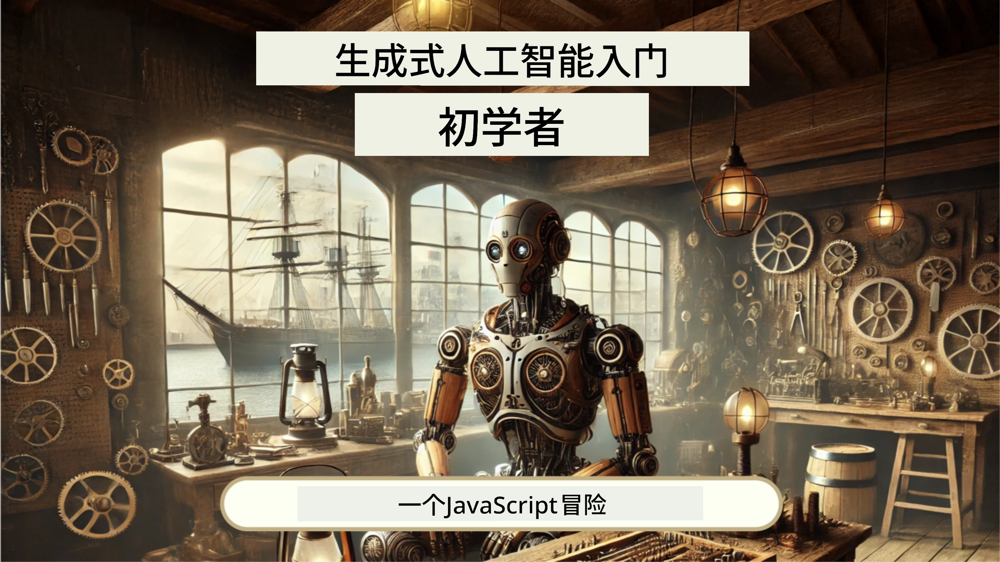
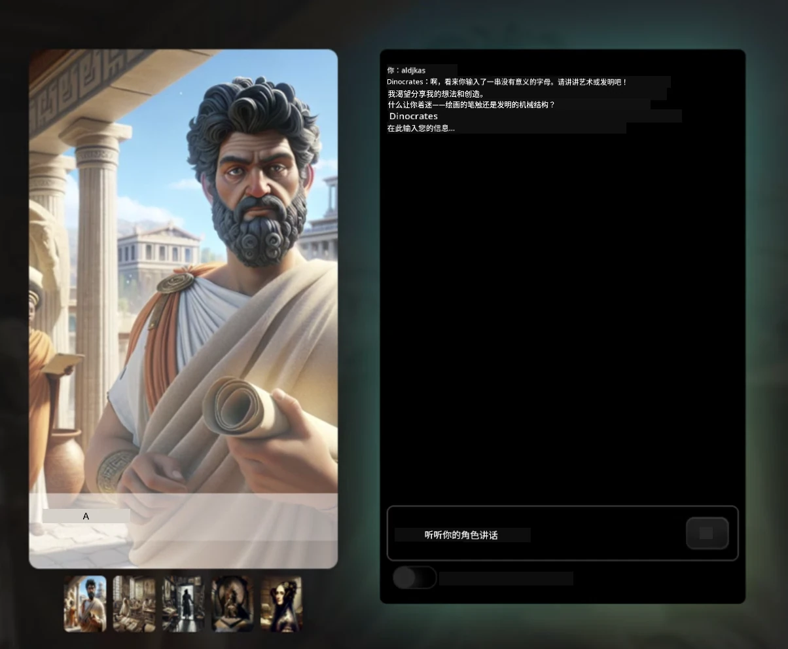
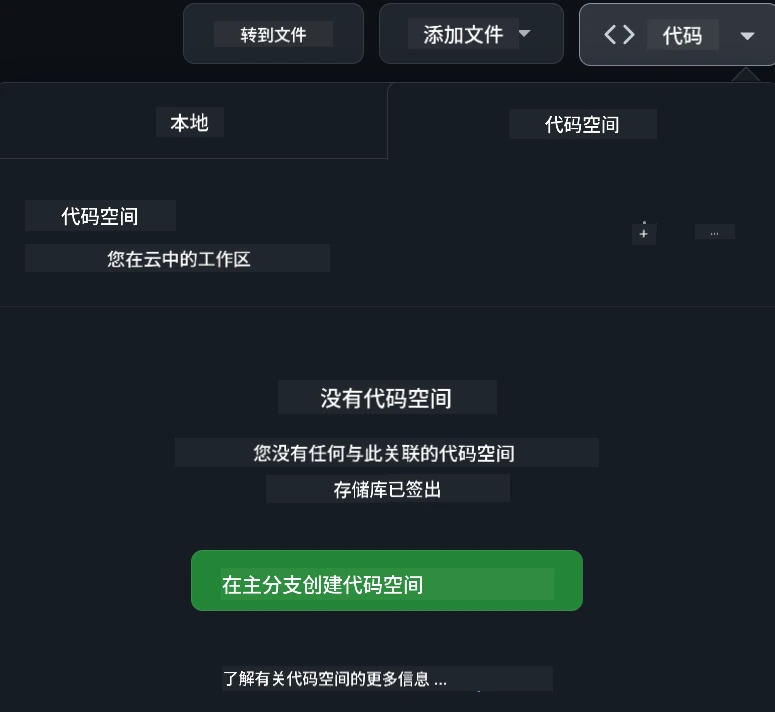

[](https://github.com/microsoft/Web-Dev-For-Beginners/blob/master/LICENSE)
[](https://GitHub.com/microsoft/Web-Dev-For-Beginners/graphs/contributors/)
[](https://GitHub.com/microsoft/Web-Dev-For-Beginners/issues/)
[](https://GitHub.com/microsoft/Web-Dev-For-Beginners/pulls/)
[](http://makeapullrequest.com) 

[](https://GitHub.com/microsoft/Web-Dev-For-Beginners/watchers/)
[](https://GitHub.com/microsoft/Web-Dev-For-Beginners/network/)
[](https://GitHub.com/microsoft/Web-Dev-For-Beginners/stargazers/)

[](https://discord.gg/nTYy5BXMWG)

# 初学者的网页开发课程

通过微软云推广者提供的为期12周的综合课程学习网页开发的基础知识。24个课程深入讲解JavaScript、CSS和HTML，配合手工项目如植物培养箱、浏览器扩展和太空游戏。参加测验、讨论和实践作业。通过我们的高效项目为基础的教学法，提升技能并优化知识掌握。今天就开始你的编码之旅吧！

加入 Azure AI Foundry Discord 社区

[](https://discord.gg/nTYy5BXMWG)

按照以下步骤开始使用这些资源：
1. **Fork 仓库**：点击 [](https://GitHub.com/microsoft/Web-Dev-For-Beginners/fork)
2. **克隆仓库**：  `git clone https://github.com/microsoft/Web-Dev-For-Beginners.git`
3. [**加入 Azure AI Foundry Discord，结识专家和其他开发者**](https://discord.com/invite/ByRwuEEgH4)

### 🌐 多语言支持

#### 通过 GitHub Action 支持（自动且始终最新）

<!-- CO-OP TRANSLATOR LANGUAGES TABLE START -->
[Arabic](../ar/README.md) | [Bengali](../bn/README.md) | [Bulgarian](../bg/README.md) | [Burmese (Myanmar)](../my/README.md) | [Chinese (Simplified)](./README.md) | [Chinese (Traditional, Hong Kong)](../zh-HK/README.md) | [Chinese (Traditional, Macau)](../zh-MO/README.md) | [Chinese (Traditional, Taiwan)](../zh-TW/README.md) | [Croatian](../hr/README.md) | [Czech](../cs/README.md) | [Danish](../da/README.md) | [Dutch](../nl/README.md) | [Estonian](../et/README.md) | [Finnish](../fi/README.md) | [French](../fr/README.md) | [German](../de/README.md) | [Greek](../el/README.md) | [Hebrew](../he/README.md) | [Hindi](../hi/README.md) | [Hungarian](../hu/README.md) | [Indonesian](../id/README.md) | [Italian](../it/README.md) | [Japanese](../ja/README.md) | [Kannada](../kn/README.md) | [Korean](../ko/README.md) | [Lithuanian](../lt/README.md) | [Malay](../ms/README.md) | [Malayalam](../ml/README.md) | [Marathi](../mr/README.md) | [Nepali](../ne/README.md) | [Nigerian Pidgin](../pcm/README.md) | [Norwegian](../no/README.md) | [Persian (Farsi)](../fa/README.md) | [Polish](../pl/README.md) | [Portuguese (Brazil)](../pt-BR/README.md) | [Portuguese (Portugal)](../pt-PT/README.md) | [Punjabi (Gurmukhi)](../pa/README.md) | [Romanian](../ro/README.md) | [Russian](../ru/README.md) | [Serbian (Cyrillic)](../sr/README.md) | [Slovak](../sk/README.md) | [Slovenian](../sl/README.md) | [Spanish](../es/README.md) | [Swahili](../sw/README.md) | [Swedish](../sv/README.md) | [Tagalog (Filipino)](../tl/README.md) | [Tamil](../ta/README.md) | [Telugu](../te/README.md) | [Thai](../th/README.md) | [Turkish](../tr/README.md) | [Ukrainian](../uk/README.md) | [Urdu](../ur/README.md) | [Vietnamese](../vi/README.md)

> **更喜欢本地克隆？**

> 本仓库包含50多种语言的翻译，显著增加下载大小。若需无翻译版本，请使用稀疏检出：
> ```bash
> git clone --filter=blob:none --sparse https://github.com/microsoft/Web-Dev-For-Beginners.git
> cd Web-Dev-For-Beginners
> git sparse-checkout set --no-cone '/*' '!translations' '!translated_images'
> ```
> 这样你可以更快完成课程所需的一切内容。
<!-- CO-OP TRANSLATOR LANGUAGES TABLE END -->

**如果您希望支持更多翻译语言，列于[这里](https://github.com/Azure/co-op-translator/blob/main/getting_started/supported-languages.md)**

[](https://open.vscode.dev/microsoft/Web-Dev-For-Beginners)

#### 🧑‍🎓 _你是学生吗？_

访问[**学生中心页面**](https://docs.microsoft.com/learn/student-hub/?WT.mc_id=academic-77807-sagibbon)，这里有入门资源、学生包甚至获得免费证书的方式。请收藏此页面并定期查看，因为我们每月都会更换内容。

### 📣 公告 - 新增 GitHub Copilot Agent 模式挑战！

新挑战已添加，请在大多数章节中查找 “GitHub Copilot Agent Challenge 🚀”。这是一个使用 GitHub Copilot 和 Agent 模式完成的新挑战。如果你以前没用过 Agent 模式，它不仅能生成文本，还可以创建和编辑文件、运行命令等。

### 📣 公告 - _新增使用生成式 AI 构建的项目_

新增 AI 助手项目，查看[项目](./9-chat-project/README.md)

### 📣 公告 - _刚发布的 JavaScript 生成式 AI 新课程_

不要错过我们的生成式 AI 新课程！

访问 [https://aka.ms/genai-js-course](https://aka.ms/genai-js-course) 开始学习！



- 覆盖从基础到 RAG 的课程。
- 使用 GenAI 和我们的配套应用与历史人物互动。
- 有趣且引人入胜的叙事，你将进行时空旅行！




每节课包括作业、知识检测和挑战，帮助你学习如：
- 提示及提示工程
- 文字和图像应用生成
- 搜索应用

访问 [https://aka.ms/genai-js-course](https://aka.ms/genai-js-course) 开始！

## 🌱 入门指南

> **教师们**，我们[提供了一些建议](for-teachers.md)关于如何使用此课程。欢迎在我们的[讨论区](https://github.com/microsoft/Web-Dev-For-Beginners/discussions/categories/teacher-corner)反馈意见！

**[学习者](https://aka.ms/student-page/?WT.mc_id=academic-77807-sagibbon)**，每节课先完成课前测验，然后阅读讲义，完成各项活动，并通过课后测验检验理解。

为提升学习体验，建议和同学们一起合作完成项目！欢迎在我们的[讨论区](https://github.com/microsoft/Web-Dev-For-Beginners/discussions)发起讨论，我们的版主团队将为你解答问题。

为进一步学习，强烈推荐探索[Microsoft Learn](https://learn.microsoft.com/users/wirelesslife/collections/p1ddcy5jwy0jkm?WT.mc_id=academic-77807-sagibbon)获取更多学习材料。

### 📋 环境搭建

本课程已预置开发环境！开始学习时，你可以选择在[Codespace](https://github.com/features/codespaces/)（基于浏览器，无需安装环境）运行课程，或在本地电脑使用如[Visual Studio Code](https://code.visualstudio.com/?WT.mc_id=academic-77807-sagibbon)的文本编辑器。

#### 创建你的仓库
为方便保存作业，建议创建本仓库的个人副本。点击页面顶部的 **Use this template** 按钮，即可在你的 GitHub 账户创建一份该课程副本。

步骤如下：
1. **Fork 仓库**：点击页面右上角的“Fork”按钮。
2. **克隆仓库**：  `git clone https://github.com/microsoft/Web-Dev-For-Beginners.git`

#### 在 Codespace 中运行课程

在你创建的个人副本中，点击 **Code** 按钮，选择 **Open with Codespaces**。这会为你创建一个新的 Codespace 工作环境。



#### 在本地电脑运行课程

要在电脑本地运行课程，你需要文本编辑器、浏览器和命令行工具。我们的第一课，[编程语言和开发工具入门](../../1-getting-started-lessons/1-intro-to-programming-languages)，将介绍各种工具供你选择。

推荐使用 [Visual Studio Code](https://code.visualstudio.com/?WT.mc_id=academic-77807-sagibbon)作为编辑器，它内置[终端](https://code.visualstudio.com/docs/terminal/basics/?WT.mc_id=academic-77807-sagibbon)。可从[这里](https://code.visualstudio.com/?WT.mc_id=academic-77807-sagibbon)下载。

1. 将你的仓库克隆到电脑。点击 **Code** 按钮，复制 URL：

    [CodeSpace](./images/createcodespace.png)
然后，在 [Visual Studio Code](https://code.visualstudio.com/?WT.mc_id=academic-77807-sagibbon) 中打开 [终端](https://code.visualstudio.com/docs/terminal/basics/?WT.mc_id=academic-77807-sagibbon)，运行以下命令，将 `<your-repository-url>` 替换为你刚才复制的 URL：

    ```bash 
    git clone <your-repository-url>
    ```

2. 在 Visual Studio Code 中打开文件夹。你可以通过点击 **文件** > **打开文件夹**，然后选择你刚克隆的文件夹来完成此操作。


>  推荐的 Visual Studio Code 扩展：
>
> * [Live Server](https://marketplace.visualstudio.com/items?itemName=ritwickdey.LiveServer&WT.mc_id=academic-77807-sagibbon) - 在 Visual Studio Code 内预览 HTML 页面
> * [Copilot](https://marketplace.visualstudio.com/items?itemName=GitHub.copilot&WT.mc_id=academic-77807-sagibbon) - 帮助你更快编写代码

## 📂 每节课包含：

- 可选的草图笔记
- 可选的补充视频
- 课前热身测验
- 书面课程内容
- 针对项目课程，包含逐步构建项目的指导
- 知识检查
- 挑战任务
- 补充阅读
- 作业
- [课后测验](https://ff-quizzes.netlify.app/web/)

> **关于测验的说明**：所有测验都包含在 Quiz-app 文件夹中，共 48 个测验，每个有三道问题。它们可在[这里](https://ff-quizzes.netlify.app/web/)获得，测验应用可以本地运行或部署到 Azure；请遵循 `quiz-app` 文件夹中的说明。

## 🗃️ 课程列表

|     |                       项目名称                       |                            教授的概念                             | 学习目标                                                                                                                 |                                                         关联课程                                                          |         作者          |
| :-: | :--------------------------------------------------: | :----------------------------------------------------------------: | ------------------------------------------------------------------------------------------------------------------------ | :------------------------------------------------------------------------------------------------------------------------: | :-------------------: |
| 01  |                     入门入手                      |           编程介绍及工具基础           | 了解大多数编程语言背后的基础原理以及帮助专业开发者完成工作的软件工具                                                    | [编程语言及工具入门](./1-getting-started-lessons/1-intro-to-programming-languages/README.md) |         Jasmine         |
| 02  |                     入门入手                      |             GitHub 基础，团队协作             | 学习如何在项目中使用 GitHub，以及如何与他人在代码库中协作                                                                 |                            [GitHub 入门](./1-getting-started-lessons/2-github-basics/README.md)                             |          Floor          |
| 03  |                     入门入手                      |                             无障碍访问                            | 学习网页无障碍访问的基础                                                                                                    |                       [无障碍基础](./1-getting-started-lessons/3-accessibility/README.md)                       |       Christopher       |
| 04  |                        JS 基础                         |                         JavaScript 数据类型                          | JavaScript 数据类型的基础                                                                                                |                                       [数据类型](./2-js-basics/1-data-types/README.md)                                        |         Jasmine         |
| 05  |                        JS 基础                         |                         函数与方法                          | 学习函数和方法以管理应用逻辑流                                                                                               |                              [函数与方法](./2-js-basics/2-functions-methods/README.md)                               | Jasmine 和 Christopher |
| 06  |                        JS 基础                         |                        使用 JS 进行决策                        | 学习如何使用条件语句创建代码中的判断                                                                                          |                                 [决策](./2-js-basics/3-making-decisions/README.md)                                  |         Jasmine         |
| 07  |                        JS 基础                         |                            数组与循环                            | 使用 JavaScript 中的数组和循环处理数据                                                                                          |                                   [数组与循环](./2-js-basics/4-arrays-loops/README.md)                                    |         Jasmine         |
| 08  |       [Terrarium](./3-terrarium/solution/README.md)       |                            HTML 实践                            | 构建用于创建在线生态瓶（Terrarium）的 HTML，重点是构建布局                                                                       |                                 [HTML 入门](./3-terrarium/1-intro-to-html/README.md)                                 |           Jen           |
| 09  |       [Terrarium](./3-terrarium/solution/README.md)       |                            CSS 实践                             | 构建用于为在线生态瓶设计样式的 CSS，重点是 CSS 基础以及页面响应式设计                                                              |                                  [CSS 入门](./3-terrarium/2-intro-to-css/README.md)                                  |           Jen           |
| 10  |            [Terrarium](./3-terrarium/solution/README.md)            |                 JavaScript 闭包与 DOM 操作                  | 构建 JavaScript 使生态瓶实现拖拽功能，重点是闭包和 DOM 操作                                                                       |                  [JavaScript 闭包与 DOM 操作](./3-terrarium/3-intro-to-DOM-and-closures/README.md)                   |           Jen           |
| 11  |          [打字游戏](./4-typing-game/solution/README.md)          |                          制作打字游戏                           | 学习如何使用键盘事件驱动 JavaScript 应用的逻辑                                                                                   |                                [事件驱动编程](./4-typing-game/typing-game/README.md)                                |       Christopher       |
| 12  | [绿色浏览器扩展](./5-browser-extension/solution/README.md) |                         浏览器工作原理                          | 了解浏览器的工作原理、发展历史及如何搭建浏览器扩展的基础元素                                                                      |                               [关于浏览器](./5-browser-extension/1-about-browsers/README.md)                                |           Jen           |
| 13  | [绿色浏览器扩展](./5-browser-extension/solution/README.md) | 构建表单、调用 API 及本地存储变量 | 构建浏览器扩展的 JavaScript 元素，以便使用存储在本地的变量调用 API                                                                |                [API、表单与本地存储](./5-browser-extension/2-forms-browsers-local-storage/README.md)                 |           Jen           |
| 14  | [绿色浏览器扩展](./5-browser-extension/solution/README.md) |          浏览器后台进程与网页性能          | 利用浏览器的后台进程管理扩展图标；学习网页性能及优化方法                                                                      |             [后台任务与性能](./5-browser-extension/3-background-tasks-and-performance/README.md)              |           Jen           |
| 15  |           [太空游戏](./6-space-game/solution/README.md)           |             进阶游戏开发 – 继承与模式             | 学习继承（包括类和组合）以及发布/订阅模式，为制作游戏做准备                                                                       |                      [进阶游戏开发介绍](./6-space-game/1-introduction/README.md)                       |          Chris          |
| 16  |           [太空游戏](./6-space-game/solution/README.md)           |                           画布绘制                            | 学习 Canvas API，用于向屏幕绘制元素                                                                                                  |                                [画布绘制](./6-space-game/2-drawing-to-canvas/README.md)                                |          Chris          |
| 17  |           [太空游戏](./6-space-game/solution/README.md)           |                   元素运动                    | 探索如何利用笛卡尔坐标和 Canvas API 赋予元素运动                                                                                    |                           [移动元素](./6-space-game/3-moving-elements-around/README.md)                           |          Chris          |
| 18  |           [太空游戏](./6-space-game/solution/README.md)           |                          碰撞检测                           | 使元素碰撞并相互响应按键，提供冷却功能确保游戏性能                                                                                   |                              [碰撞检测](./6-space-game/4-collision-detection/README.md)                              |          Chris          |
| 19  |           [太空游戏](./6-space-game/solution/README.md)           |                             计分                              | 根据游戏状态和表现进行数学计算                                                                                                        |                                    [计分](./6-space-game/5-keeping-score/README.md)                                    |          Chris          |
| 20  |           [太空游戏](./6-space-game/solution/README.md)           |                     结束和重启游戏                     | 学习如何结束和重启游戏，包括清理资源和重置变量                                                                                      |                                [结束条件](./6-space-game/6-end-condition/README.md)                                 |          Chris          |
| 21  |         [银行应用](./7-bank-project/solution/README.md)          |                 Web 应用中的 HTML 模板和路由                 | 学习如何使用路由和 HTML 模板构建多页面网站的框架                                                                                   |                            [HTML 模板和路由](./7-bank-project/1-template-route/README.md)                             |          Yohan          |
| 22  |         [银行应用](./7-bank-project/solution/README.md)          |                  构建登录和注册表单                   | 学习表单构建和验证处理流程                                                                                                        |                                           [表单](./7-bank-project/2-forms/README.md)                                           |          Yohan          |
| 23  |         [银行应用](./7-bank-project/solution/README.md)          |                   数据获取和使用                   | 学习数据如何流入流出你的应用，如何获取、存储和处理数据                                                                          |                                            [数据](./7-bank-project/3-data/README.md)                                            |          Yohan          |
| 24  |         [银行应用](./7-bank-project/solution/README.md)          |                      状态管理概念                      | 学习应用如何保留状态及其编程管理方法                                                                                              |                                [状态管理](./7-bank-project/4-state-management/README.md)                                |          Yohan          |
| 25 | [浏览器/VScode 代码](../../8-code-editor) | 使用 VScode | 学习如何使用代码编辑器| [使用 VScode 代码编辑器](./8-code-editor/1-using-a-code-editor/README.md) | Chris |
| 26 | [人工智能助手](./9-chat-project/README.md) | 使用 AI | 学习如何构建自己的 AI 助手 | [AI 助手项目](./9-chat-project/README.md) | Chris |

## 🏫 教学法

我们的课程设计基于两个关键的教学原则：
* 项目驱动学习
* 频繁测验

该课程教授 JavaScript、HTML 和 CSS 的基础知识，以及当今网页开发者使用的最新工具和技术。学生将通过制作打字游戏、虚拟生态瓶、环保浏览器扩展、太空入侵游戏和企业银行应用获得实践经验。到课程结束时，学生将具备扎实的网页开发理解。

> 🎓 你可以在 Microsoft Learn 上将本课程的前几节作为[学习路径](https://docs.microsoft.com/learn/paths/web-development-101/?WT.mc_id=academic-77807-sagibbon)完成！

通过确保内容与项目对齐，学习过程对学生更具吸引力，并增强概念的记忆。我们还编写了几节 JavaScript 基础入门课程，配合 “[JavaScript 初学者系列](https://channel9.msdn.com/Series/Beginners-Series-to-JavaScript/?WT.mc_id=academic-77807-sagibbon)” 视频教程集合，其中有些作者也贡献了本课程。

此外，课前的低风险测验帮助学生树立学习目标，课后的第二次测验确保知识的进一步巩固。此课程设计灵活有趣，可以全部完成也可以部分学习。项目难度由浅入深，经过 12 周的学习持续递增。

虽然我们有意避免引入 JavaScript 框架，以专注于作为网络开发者在使用框架前需掌握的基础技能，但完成本课程的良好后续步骤是通过另一个视频集合学习 Node.js：“[Node.js 初学者系列](https://channel9.msdn.com/Series/Beginners-Series-to-Nodejs/?WT.mc_id=academic-77807-sagibbon)”。

> 请访问我们的[行为准则](CODE_OF_CONDUCT.md)和[贡献指南](CONTRIBUTING.md)。我们欢迎你的建设性反馈！

## 🧭 离线访问

你可以使用 [Docsify](https://docsify.js.org/#/) 离线运行本文档。将此仓库 Fork 到本地，安装 [Docsify](https://docsify.js.org/#/quickstart)，然后在此仓库根目录运行 `docsify serve`。网站将在本地的 3000 端口提供服务，即访问 `localhost:3000`。

## 📘 PDF

所有课程的 PDF 可在[这里](https://microsoft.github.io/Web-Dev-For-Beginners/pdf/readme.pdf)找到。


## 🎒 其他课程
我们的团队还制作了其他课程！查看：

<!-- CO-OP TRANSLATOR OTHER COURSES START -->
### LangChain
[](https://aka.ms/langchain4j-for-beginners)
[](https://aka.ms/langchainjs-for-beginners?WT.mc_id=m365-94501-dwahlin)
[](https://github.com/microsoft/langchain-for-beginners?WT.mc_id=m365-94501-dwahlin)
---

### Azure / Edge / MCP / Agents
[](https://github.com/microsoft/AZD-for-beginners?WT.mc_id=academic-105485-koreyst)
[](https://github.com/microsoft/edgeai-for-beginners?WT.mc_id=academic-105485-koreyst)
[](https://github.com/microsoft/mcp-for-beginners?WT.mc_id=academic-105485-koreyst)
[](https://github.com/microsoft/ai-agents-for-beginners?WT.mc_id=academic-105485-koreyst)

---
 
### 生成式 AI 系列
[](https://github.com/microsoft/generative-ai-for-beginners?WT.mc_id=academic-105485-koreyst)
[-9333EA?style=for-the-badge&labelColor=E5E7EB&color=9333EA)](https://github.com/microsoft/Generative-AI-for-beginners-dotnet?WT.mc_id=academic-105485-koreyst)
[-C084FC?style=for-the-badge&labelColor=E5E7EB&color=C084FC)](https://github.com/microsoft/generative-ai-for-beginners-java?WT.mc_id=academic-105485-koreyst)
[-E879F9?style=for-the-badge&labelColor=E5E7EB&color=E879F9)](https://github.com/microsoft/generative-ai-with-javascript?WT.mc_id=academic-105485-koreyst)

---
 
### 核心学习
[](https://aka.ms/ml-beginners?WT.mc_id=academic-105485-koreyst)
[](https://aka.ms/datascience-beginners?WT.mc_id=academic-105485-koreyst)
[](https://aka.ms/ai-beginners?WT.mc_id=academic-105485-koreyst)
[](https://github.com/microsoft/Security-101?WT.mc_id=academic-96948-sayoung)
[](https://aka.ms/webdev-beginners?WT.mc_id=academic-105485-koreyst)
[](https://aka.ms/iot-beginners?WT.mc_id=academic-105485-koreyst)
[](https://github.com/microsoft/xr-development-for-beginners?WT.mc_id=academic-105485-koreyst)

---
 
### Copilot 系列
[](https://aka.ms/GitHubCopilotAI?WT.mc_id=academic-105485-koreyst)
[](https://github.com/microsoft/mastering-github-copilot-for-dotnet-csharp-developers?WT.mc_id=academic-105485-koreyst)
[](https://github.com/microsoft/CopilotAdventures?WT.mc_id=academic-105485-koreyst)
<!-- CO-OP TRANSLATOR OTHER COURSES END -->

## 获取帮助

如果您遇到困难或对构建 AI 应用有任何疑问，加入其他学习者和经验丰富的开发者一起讨论 MCP。这里是一个支持性的社区，欢迎提问并自由分享知识。

[](https://discord.gg/nTYy5BXMWG)

如果您在构建过程中有产品反馈或遇到错误，请访问：

[](https://aka.ms/foundry/forum)

## 许可证

本存储库采用 MIT 许可证。详情请参见 [LICENSE](../../LICENSE) 文件。

---

<!-- CO-OP TRANSLATOR DISCLAIMER START -->
**免责声明**：
本文件使用人工智能翻译服务 [Co-op Translator](https://github.com/Azure/co-op-translator) 进行翻译。虽然我们力求准确，但请注意自动翻译可能存在错误或不准确之处。请将原始语言版本视为权威来源。对于关键信息，建议采用专业人工翻译。我们不对因使用本翻译而产生的任何误解或错误解释承担责任。
<!-- CO-OP TRANSLATOR DISCLAIMER END -->