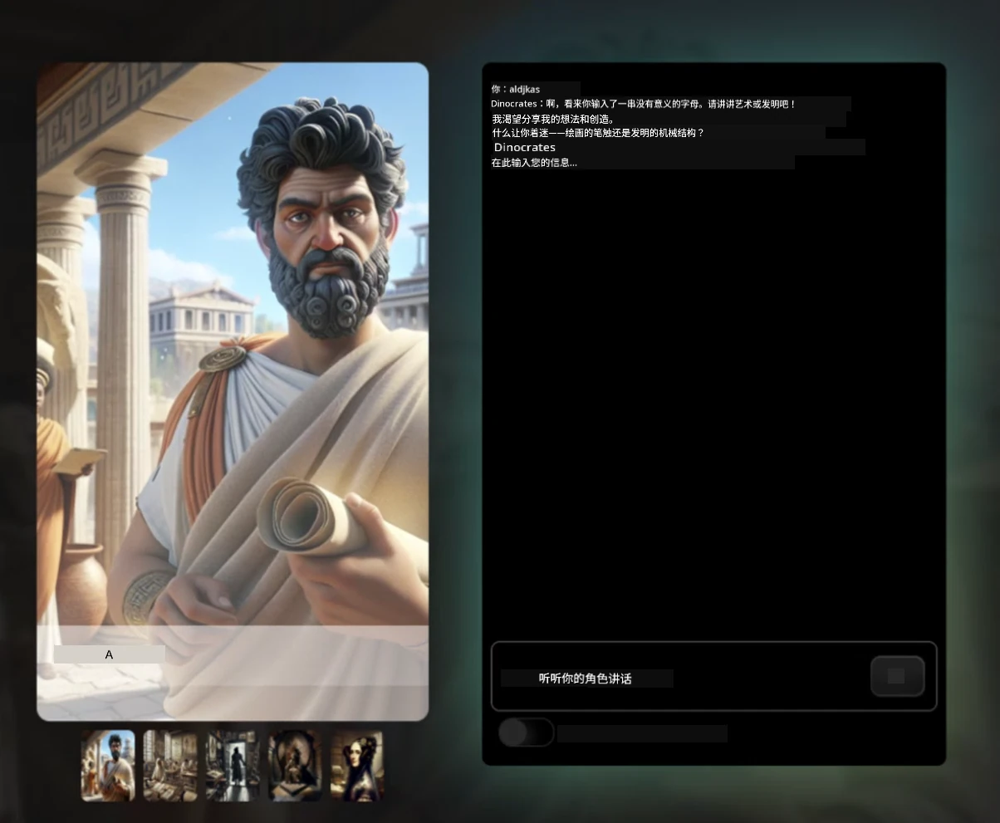
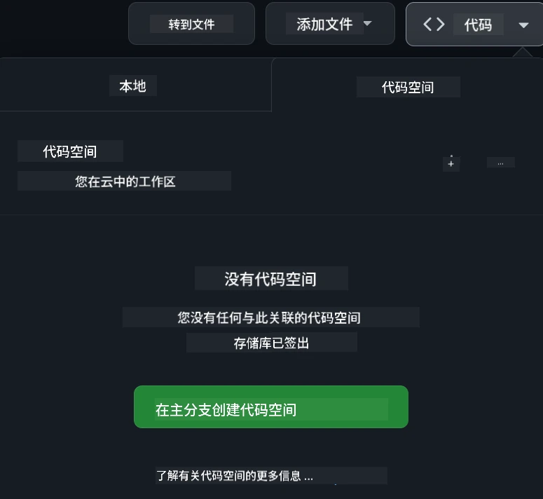

[](https://github.com/microsoft/Web-Dev-For-Beginners/blob/master/LICENSE)
[](https://GitHub.com/microsoft/Web-Dev-For-Beginners/graphs/contributors/)
[](https://GitHub.com/microsoft/Web-Dev-For-Beginners/issues/)
[](https://GitHub.com/microsoft/Web-Dev-For-Beginners/pulls/)
[](http://makeapullrequest.com) 

[](https://GitHub.com/microsoft/Web-Dev-For-Beginners/watchers/)
[](https://GitHub.com/microsoft/Web-Dev-For-Beginners/network/)
[](https://GitHub.com/microsoft/Web-Dev-For-Beginners/stargazers/)

[](https://discord.gg/nTYy5BXMWG)

# 针对初学者的网页开发课程

通过微软云倡导者提供的 12 周综合课程学习网页开发基础。每个 24 节课程通过动手项目，如植物养殖箱、浏览器扩展和太空游戏，深入探讨 JavaScript、CSS 和 HTML。参与测验、讨论和实践作业。采用高效的项目式教学法，提高技能并优化知识保留。立即开始您的编码旅程！

加入 Azure AI Foundry Discord 社区

[](https://discord.gg/nTYy5BXMWG)

按以下步骤开始使用这些资源：
1. **Fork 仓库**：点击 [](https://GitHub.com/microsoft/Web-Dev-For-Beginners/fork)
2. **克隆仓库**：   `git clone https://github.com/microsoft/Web-Dev-For-Beginners.git`
3. [**加入 Azure AI Foundry Discord，结识专家和其他开发者**](https://discord.com/invite/ByRwuEEgH4)

### 🌐 多语言支持

#### 通过 GitHub Action 支持（自动且始终保持最新）

<!-- CO-OP TRANSLATOR LANGUAGES TABLE START -->
[Arabic](../ar/README.md) | [Bengali](../bn/README.md) | [Bulgarian](../bg/README.md) | [Burmese (Myanmar)](../my/README.md) | [Chinese (Simplified)](./README.md) | [Chinese (Traditional, Hong Kong)](../zh-HK/README.md) | [Chinese (Traditional, Macau)](../zh-MO/README.md) | [Chinese (Traditional, Taiwan)](../zh-TW/README.md) | [Croatian](../hr/README.md) | [Czech](../cs/README.md) | [Danish](../da/README.md) | [Dutch](../nl/README.md) | [Estonian](../et/README.md) | [Finnish](../fi/README.md) | [French](../fr/README.md) | [German](../de/README.md) | [Greek](../el/README.md) | [Hebrew](../he/README.md) | [Hindi](../hi/README.md) | [Hungarian](../hu/README.md) | [Indonesian](../id/README.md) | [Italian](../it/README.md) | [Japanese](../ja/README.md) | [Kannada](../kn/README.md) | [Korean](../ko/README.md) | [Lithuanian](../lt/README.md) | [Malay](../ms/README.md) | [Malayalam](../ml/README.md) | [Marathi](../mr/README.md) | [Nepali](../ne/README.md) | [Nigerian Pidgin](../pcm/README.md) | [Norwegian](../no/README.md) | [Persian (Farsi)](../fa/README.md) | [Polish](../pl/README.md) | [Portuguese (Brazil)](../pt-BR/README.md) | [Portuguese (Portugal)](../pt-PT/README.md) | [Punjabi (Gurmukhi)](../pa/README.md) | [Romanian](../ro/README.md) | [Russian](../ru/README.md) | [Serbian (Cyrillic)](../sr/README.md) | [Slovak](../sk/README.md) | [Slovenian](../sl/README.md) | [Spanish](../es/README.md) | [Swahili](../sw/README.md) | [Swedish](../sv/README.md) | [Tagalog (Filipino)](../tl/README.md) | [Tamil](../ta/README.md) | [Telugu](../te/README.md) | [Thai](../th/README.md) | [Turkish](../tr/README.md) | [Ukrainian](../uk/README.md) | [Urdu](../ur/README.md) | [Vietnamese](../vi/README.md)

> **想本地克隆？**
>
> 该仓库包含 50 多种语言的翻译文件，显著增加下载体积。想要不含翻译的克隆版本，可以使用稀疏检出：
>
> **Bash / macOS / Linux:**
> ```bash
> git clone --filter=blob:none --sparse https://github.com/microsoft/Web-Dev-For-Beginners.git
> cd Web-Dev-For-Beginners
> git sparse-checkout set --no-cone '/*' '!translations' '!translated_images'
> ```
>
> **CMD (Windows):**
> ```cmd
> git clone --filter=blob:none --sparse https://github.com/microsoft/Web-Dev-For-Beginners.git
> cd Web-Dev-For-Beginners
> git sparse-checkout set --no-cone "/*" "!translations" "!translated_images"
> ```
>
> 这将让您更快下载且包含完成课程所需的所有内容。
<!-- CO-OP TRANSLATOR LANGUAGES TABLE END -->

**如果您希望支持更多语言，请查看[此处](https://github.com/Azure/co-op-translator/blob/main/getting_started/supported-languages.md)**

[](https://open.vscode.dev/microsoft/Web-Dev-For-Beginners)

#### 🧑‍🎓 _你是学生吗？_

访问[**学生中心页面**](https://docs.microsoft.com/learn/student-hub/?WT.mc_id=academic-77807-sagibbon)，您将找到初学资源、学生包以及获取免费证书优惠券的方式。建议收藏此页，并定期查看，因内容每月更新。

### 📣 公告 - 新增 GitHub Copilot Agent 模式挑战任务！

新增挑战，请在大多数章节查找“GitHub Copilot Agent Challenge 🚀”。这是一个让您使用 GitHub Copilot 和 Agent 模式完成的新挑战。如果您之前没用过 Agent 模式，它不仅能生成文本，还能创建和编辑文件、运行命令等。

### 📣 公告 - _使用生成式 AI 构建的新项目_

新增 AI 助手项目，请查看[项目](./9-chat-project/README.md)

### 📣 公告 - _新发布的 JavaScript 生成式 AI 课程_

别错过我们的生成式 AI 新课程！

访问 [https://aka.ms/genai-js-course](https://aka.ms/genai-js-course) 开始学习！


- 课程涵盖从基础到 RAG。
- 通过生成式 AI 和我们的辅助应用与历史人物互动。
- 有趣且引人入胜的故事叙述，带您穿越时空！




每节课包含作业、知识测试和挑战，帮助您学习以下主题：
- 提示词及提示工程
- 文本和图像应用生成
- 搜索应用

访问 [https://aka.ms/genai-js-course](https://aka.ms/genai-js-course) 开始学习！


## 🌱 快速开始

> **教师们**，我们[提供了一些建议](for-teachers.md)指导您如何使用这套课程。欢迎在[讨论区](https://github.com/microsoft/Web-Dev-For-Beginners/discussions/categories/teacher-corner)提供反馈！

**[学员](https://aka.ms/student-page/?WT.mc_id=academic-77807-sagibbon)**，每节课开始时，请先完成课前测验，然后阅读课程内容，完成各项活动，并通过课后测验检验理解。

为了提升学习体验，建议与同伴共同完成项目！欢迎在我们的[讨论区](https://github.com/microsoft/Web-Dev-For-Beginners/discussions)参与讨论，版主团队会解答您的问题。

扩展学习我们强烈推荐探索 [Microsoft Learn](https://learn.microsoft.com/users/wirelesslife/collections/p1ddcy5jwy0jkm?WT.mc_id=academic-77807-sagibbon) 上的额外学习资源。

### 📋 设置开发环境

本课程提供即用型开发环境！开始时，您可以选择在 [Codespace](https://github.com/features/codespaces/)（一种基于浏览器、无须安装的环境）中运行课程，也可以在本地电脑使用文本编辑器，如 [Visual Studio Code](https://code.visualstudio.com/?WT.mc_id=academic-77807-sagibbon) 。

#### 创建您的仓库
为了方便保存您的作品，推荐您创建此仓库的副本。点击页面顶部的 **Use this template** 按钮即可在您的 GitHub 账户中创建一个包含本课程内容的新仓库。

操作步骤：
1. **Fork 仓库**：点击页面右上角的“Fork”按钮。
2. **克隆仓库**：   `git clone https://github.com/microsoft/Web-Dev-For-Beginners.git`

#### 在 Codespace 中运行课程

在您创建的仓库副本中，点击 **Code** 按钮，选择 **Open with Codespaces**。将为您创建一个新的 Codespace 工作环境。



#### 在本地电脑运行课程

要在本地电脑运行该课程，您需要文本编辑器、浏览器和命令行工具。我们的第一课，[编程语言与工具基础介绍](../../1-getting-started-lessons/1-intro-to-programming-languages)，将引导您了解各种工具选择，以便您选择最合适的。

推荐使用 [Visual Studio Code](https://code.visualstudio.com/?WT.mc_id=academic-77807-sagibbon) 作为编辑器，它内置了[终端](https://code.visualstudio.com/docs/terminal/basics/?WT.mc_id=academic-77807-sagibbon)。您可以从[这里](https://code.visualstudio.com/?WT.mc_id=academic-77807-sagibbon)下载安装 Visual Studio Code。
1. 将你的仓库克隆到电脑上。你可以点击 **Code** 按钮并复制 URL：

    [CodeSpace](./images/createcodespace.png)

    然后，在 [Visual Studio Code](https://code.visualstudio.com/?WT.mc_id=academic-77807-sagibbon) 中打开 [终端](https://code.visualstudio.com/docs/terminal/basics/?WT.mc_id=academic-77807-sagibbon)，运行以下命令，将 `<your-repository-url>` 替换成刚才复制的 URL：

    ```bash 
    git clone <your-repository-url>
    ```

2. 在 Visual Studio Code 中打开该文件夹。你可以点击 **文件** > **打开文件夹** 并选择刚刚克隆的文件夹。


>  推荐的 Visual Studio Code 扩展：
>
> * [Live Server](https://marketplace.visualstudio.com/items?itemName=ritwickdey.LiveServer&WT.mc_id=academic-77807-sagibbon) - 在 Visual Studio Code 内预览 HTML 页面
> * [Copilot](https://marketplace.visualstudio.com/items?itemName=GitHub.copilot&WT.mc_id=academic-77807-sagibbon) - 帮助你更快地编写代码

## 📂 每节课包含：

- 可选的手绘笔记
- 可选的补充视频
- 课前热身测验
- 书面课程内容
- 针对项目课程的逐步项目搭建指南
- 知识检查
- 一项挑战
- 补充阅读
- 作业
- [课后测验](https://ff-quizzes.netlify.app/web/)

> **关于测验的说明**：所有测验都包含在 Quiz-app 文件夹中，共有48个测验，每个测验由三道题组成。它们可以在 [这里](https://ff-quizzes.netlify.app/web/) 访问，测验应用可以本地运行或部署到 Azure；请按照 `quiz-app` 文件夹中的说明操作。

## 🗃️ 课程列表

|     |                       项目名称                       |                            授课概念                             | 学习目标                                                                                                                 |                                                         关联课程                                                          |         作者          |
| :-: | :--------------------------------------------------: | :--------------------------------------------------------------: | ----------------------------------------------------------------------------------------------------------------------- | :--------------------------------------------------------------------------------------------------------------------------: | :-------------------: |
| 01  |                     入门课程                      |           编程入门及相关工具           | 了解大多数编程语言的基本原理及帮助专业开发者完成工作的软件工具                                                     | [编程语言与相关工具简介](./1-getting-started-lessons/1-intro-to-programming-languages/README.md) |         Jasmine      |
| 02  |                     入门课程                      |             GitHub 基础及团队协作             | 学习如何在项目中使用 GitHub，如何与他人协作开发代码库                                                                |                         [GitHub 简介](./1-getting-started-lessons/2-github-basics/README.md)                         |          Floor       |
| 03  |                     入门课程                      |                             无障碍访问                              | 学习网页无障碍访问的基础                                                                                                |                    [无障碍基础](./1-getting-started-lessons/3-accessibility/README.md)                    |       Christopher    |
| 04  |                        JS 基础                         |                         JavaScript 数据类型                          | 了解 JavaScript 数据类型的基础                                                                                          |                                [数据类型](./2-js-basics/1-data-types/README.md)                                |         Jasmine      |
| 05  |                        JS 基础                         |                         函数与方法                          | 学习函数和方法以管理应用程序的逻辑流程                                                                                  |                            [函数与方法](./2-js-basics/2-functions-methods/README.md)                            | Jasmine 和 Christopher |
| 06  |                        JS 基础                         |                        使用 JS 进行决策                        | 掌握如何使用条件语句在代码中创建决策                                                                                   |                               [决策制作](./2-js-basics/3-making-decisions/README.md)                               |         Jasmine      |
| 07  |                        JS 基础                         |                            数组与循环                            | 学习如何使用 JavaScript 中的数组与循环处理数据                                                                          |                                [数组与循环](./2-js-basics/4-arrays-loops/README.md)                                |         Jasmine      |
| 08  |       [生态瓶](./3-terrarium/solution/README.md)       |                            HTML 实践                            | 构建用于创建在线生态瓶的 HTML，重点是布局构建                                                                            |                             [HTML 入门](./3-terrarium/1-intro-to-html/README.md)                             |           Jen        |
| 09  |       [生态瓶](./3-terrarium/solution/README.md)       |                            CSS 实践                             | 构建用于美化在线生态瓶的 CSS，重点了解 CSS 基础并使页面具备响应式                                                      |                              [CSS 入门](./3-terrarium/2-intro-to-css/README.md)                              |           Jen        |
| 10  |       [生态瓶](./3-terrarium/solution/README.md)       |          JavaScript 闭包及 DOM 操作          | 构建生态瓶的 JavaScript，使其实现拖放功能，重点掌握闭包与 DOM 操作                                                     |                 [JavaScript 闭包及 DOM 操作](./3-terrarium/3-intro-to-DOM-and-closures/README.md)                 |           Jen        |
| 11  |          [打字游戏](./4-typing-game/solution/README.md)          |                          构建打字游戏                           | 学习如何使用键盘事件驱动 JavaScript 应用的逻辑                                                                           |                              [事件驱动编程](./4-typing-game/typing-game/README.md)                               |       Christopher    |
| 12  | [绿色浏览器扩展](./5-browser-extension/solution/README.md) |                         浏览器工作原理                          | 学习浏览器的工作方式，历史，并搭建浏览器扩展的基础元素                                                                  |                            [关于浏览器](./5-browser-extension/1-about-browsers/README.md)                            |           Jen        |
| 13  | [绿色浏览器扩展](./5-browser-extension/solution/README.md) | 构建表单、调用 API 及本地存储变量 | 构建浏览器扩展的 JavaScript 元素，利用本地存储变量调用 API                                                           |                 [API、表单与本地存储](./5-browser-extension/2-forms-browsers-local-storage/README.md)                 |           Jen        |
| 14  | [绿色浏览器扩展](./5-browser-extension/solution/README.md) |          浏览器后台进程与网页性能优化          | 利用浏览器后台进程管理扩展的图标，了解网页性能及相关优化方法                                                            |                   [后台任务与性能](./5-browser-extension/3-background-tasks-and-performance/README.md)              |           Jen        |
| 15  |           [太空游戏](./6-space-game/solution/README.md)           |             使用 JavaScript 进行更高级游戏开发             | 学习继承（类与组合）和发布/订阅模式，为游戏开发做准备                                                                  |                     [高级游戏开发简介](./6-space-game/1-introduction/README.md)                       |          Chris       |
| 16  |           [太空游戏](./6-space-game/solution/README.md)           |                           画布绘图                            | 了解 Canvas API，用于向屏幕绘制元素                                                                                      |                              [画布绘图](./6-space-game/2-drawing-to-canvas/README.md)                              |          Chris       |
| 17  |           [太空游戏](./6-space-game/solution/README.md)           |                   屏幕元素的移动                    | 探索如何使用笛卡尔坐标和 Canvas API 让元素运动                                                                          |                           [元素移动](./6-space-game/3-moving-elements-around/README.md)                           |          Chris       |
| 18  |           [太空游戏](./6-space-game/solution/README.md)           |                          碰撞检测                           | 让元素根据按键碰撞并相互反应，添加冷却函数提高游戏性能                                                                  |                            [碰撞检测](./6-space-game/4-collision-detection/README.md)                            |          Chris       |
| 19  |           [太空游戏](./6-space-game/solution/README.md)           |                             计分                              | 根据游戏状态和表现执行数学计算                                                                                            |                                  [计分](./6-space-game/5-keeping-score/README.md)                                  |          Chris       |
| 20  |           [太空游戏](./6-space-game/solution/README.md)           |                     结束与重新开始游戏                     | 了解游戏结束与重新开始的处理，包括资源清理和变量重置                                                                    |                              [结束条件](./6-space-game/6-end-condition/README.md)                              |          Chris       |
| 21  |         [银行应用](./7-bank-project/solution/README.md)          |                 网络应用中的 HTML 模板与路由                 | 学习如何通过路由和 HTML 模板构建多页面网站的架构                                                                        |                          [HTML 模板与路由](./7-bank-project/1-template-route/README.md)                          |          Yohan       |
| 22  |         [银行应用](./7-bank-project/solution/README.md)          |                  构建登录和注册表单                   | 学习表单构建与验证流程                                                                                                   |                                         [表单](./7-bank-project/2-forms/README.md)                                         |          Yohan       |
| 23  |         [银行应用](./7-bank-project/solution/README.md)          |                   数据获取与使用方法                   | 了解应用的数据流向、获取、存储及处理                                                                                     |                                          [数据](./7-bank-project/3-data/README.md)                                          |          Yohan       |
| 24  |         [银行应用](./7-bank-project/solution/README.md)          |                      状态管理概念                      | 学习应用如何保留状态及如何编程管理状态                                                                                   |                              [状态管理](./7-bank-project/4-state-management/README.md)                              |          Yohan       |
| 25 | [浏览器/VScode 代码](../../8-code-editor) | 使用 VScode | 学习如何使用代码编辑器 | [使用 VScode 代码编辑器](./8-code-editor/1-using-a-code-editor/README.md) | Chris |
| 26 | [AI 助手](./9-chat-project/README.md) | 使用 AI | 学习如何构建自己的 AI 助手 | [AI 助手项目](./9-chat-project/README.md) | Chris |

## 🏫 教学法

我们的课程设计基于两个关键的教学原则：
* 项目驱动学习
* 频繁测验

该项目教授 JavaScript、HTML 和 CSS 的基础知识，以及当前 Web 开发者使用的最新工具和技术。学生将通过构建打字游戏、虚拟生态瓶、环保浏览器扩展、太空入侵风格游戏和企业银行应用获得实践经验。系列课程结束时，学生将具备扎实的 Web 开发基础。

> 🎓 你可以将本课程的前几节课作为 Microsoft Learn 上的 [学习路径](https://docs.microsoft.com/learn/paths/web-development-101/?WT.mc_id=academic-77807-sagibbon) 进行学习！

通过确保内容与项目对齐，学习过程对学生更具吸引力，概念的掌握度也会提高。我们还编写了几节 JavaScript 基础入门课程，配合来自"[JavaScript 初学者系列](https://channel9.msdn.com/Series/Beginners-Series-to-JavaScript/?WT.mc_id=academic-77807-sagibbon)"合集的视频教程，这些视频的部分作者参与了本课程的编写。

此外，课前的低风险测验帮助学生树立学习目标，课后的测验则确保进一步巩固学习内容。本课程设计灵活且富有趣味性，支持整套学习或部分学习。项目从简单开始，随着12周课程周期逐步变得复杂。

虽然我们特意避免引入 JavaScript 框架，以专注于掌握作为 Web 开发者所需的基础技能，但完成本课程后，学习 Node.js 将是下一步的不错选择，推荐相关视频合集 "[Node.js 初学者系列](https://channel9.msdn.com/Series/Beginners-Series-to-Nodejs/?WT.mc_id=academic-77807-sagibbon)"。

> 请查看我们的[行为准则](CODE_OF_CONDUCT.md)和[贡献指南](CONTRIBUTING.md)。欢迎您提供建设性的反馈！


## 🧭 离线访问

你可以通过使用 [Docsify](https://docsify.js.org/#/) 来离线运行本文档。Fork 此仓库，在本地安装 [Docsify](https://docsify.js.org/#/quickstart)，然后在本仓库根目录下输入 `docsify serve`。网站将在本地主机的3000端口启动：`localhost:3000`。

## 📘 PDF
所有课程的 PDF 可以在[这里](https://microsoft.github.io/Web-Dev-For-Beginners/pdf/readme.pdf)找到。

## 🎒 其他课程

我们的团队还制作了其他课程！快来看看：

<!-- CO-OP TRANSLATOR OTHER COURSES START -->
### LangChain
[](https://aka.ms/langchain4j-for-beginners)
[](https://aka.ms/langchainjs-for-beginners?WT.mc_id=m365-94501-dwahlin)
[](https://github.com/microsoft/langchain-for-beginners?WT.mc_id=m365-94501-dwahlin)
---

### Azure / Edge / MCP / Agents
[](https://github.com/microsoft/AZD-for-beginners?WT.mc_id=academic-105485-koreyst)
[](https://github.com/microsoft/edgeai-for-beginners?WT.mc_id=academic-105485-koreyst)
[](https://github.com/microsoft/mcp-for-beginners?WT.mc_id=academic-105485-koreyst)
[](https://github.com/microsoft/ai-agents-for-beginners?WT.mc_id=academic-105485-koreyst)

---
 
### 生成式 AI 系列
[](https://github.com/microsoft/generative-ai-for-beginners?WT.mc_id=academic-105485-koreyst)
[-9333EA?style=for-the-badge&labelColor=E5E7EB&color=9333EA)](https://github.com/microsoft/Generative-AI-for-beginners-dotnet?WT.mc_id=academic-105485-koreyst)
[-C084FC?style=for-the-badge&labelColor=E5E7EB&color=C084FC)](https://github.com/microsoft/generative-ai-for-beginners-java?WT.mc_id=academic-105485-koreyst)
[-E879F9?style=for-the-badge&labelColor=E5E7EB&color=E879F9)](https://github.com/microsoft/generative-ai-with-javascript?WT.mc_id=academic-105485-koreyst)

---
 
### 核心学习
[](https://aka.ms/ml-beginners?WT.mc_id=academic-105485-koreyst)
[](https://aka.ms/datascience-beginners?WT.mc_id=academic-105485-koreyst)
[](https://aka.ms/ai-beginners?WT.mc_id=academic-105485-koreyst)
[](https://github.com/microsoft/Security-101?WT.mc_id=academic-96948-sayoung)
[](https://aka.ms/webdev-beginners?WT.mc_id=academic-105485-koreyst)
[](https://aka.ms/iot-beginners?WT.mc_id=academic-105485-koreyst)
[](https://github.com/microsoft/xr-development-for-beginners?WT.mc_id=academic-105485-koreyst)

---
 
### Copilot 系列
[](https://aka.ms/GitHubCopilotAI?WT.mc_id=academic-105485-koreyst)
[](https://github.com/microsoft/mastering-github-copilot-for-dotnet-csharp-developers?WT.mc_id=academic-105485-koreyst)
[](https://github.com/microsoft/CopilotAdventures?WT.mc_id=academic-105485-koreyst)
<!-- CO-OP TRANSLATOR OTHER COURSES END -->

## 获得帮助

如果你遇到困难或对构建 AI 应用有任何疑问，欢迎加入 MCP 的学习者和经验丰富的开发者讨论社区。这是一个支持性的社区，欢迎提问并自由分享知识。

[](https://discord.gg/nTYy5BXMWG)

如果你在构建过程中有产品反馈或遇到错误，请访问：

[](https://aka.ms/foundry/forum)

## 许可证

本仓库使用 MIT 许可证。更多信息请参见 [LICENSE](../../LICENSE) 文件。

---

<!-- CO-OP TRANSLATOR DISCLAIMER START -->
**免责声明**：  
本文件使用 AI 翻译服务 [Co-op Translator](https://github.com/Azure/co-op-translator) 进行翻译。虽然我们力求准确，但请注意，自动翻译可能包含错误或不准确之处。原始语言版本的文件应视为权威来源。对于关键信息，建议采用专业人工翻译。因使用此翻译而产生的任何误解或误释，我们不承担任何责任。
<!-- CO-OP TRANSLATOR DISCLAIMER END -->