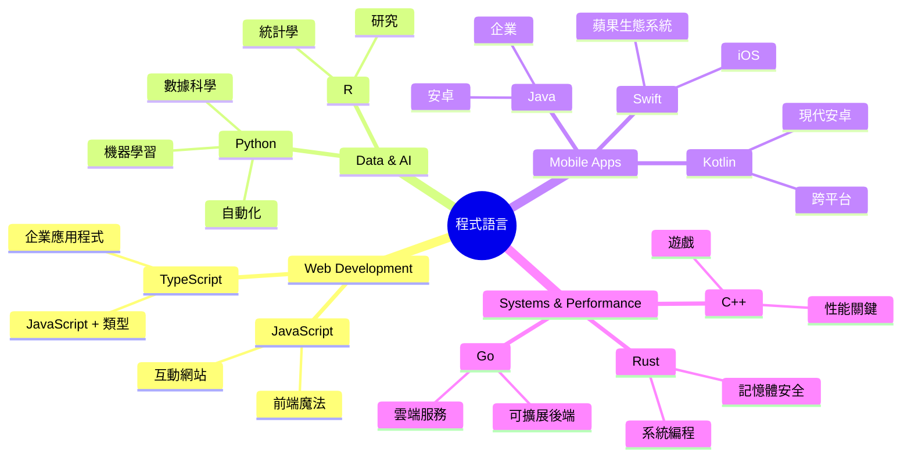
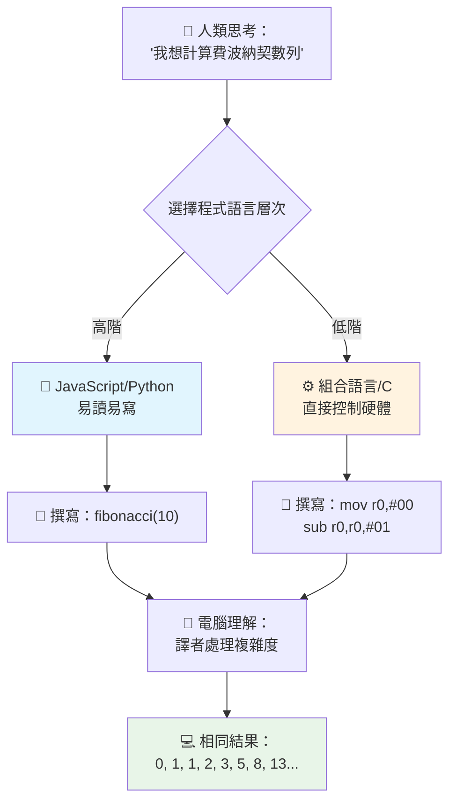
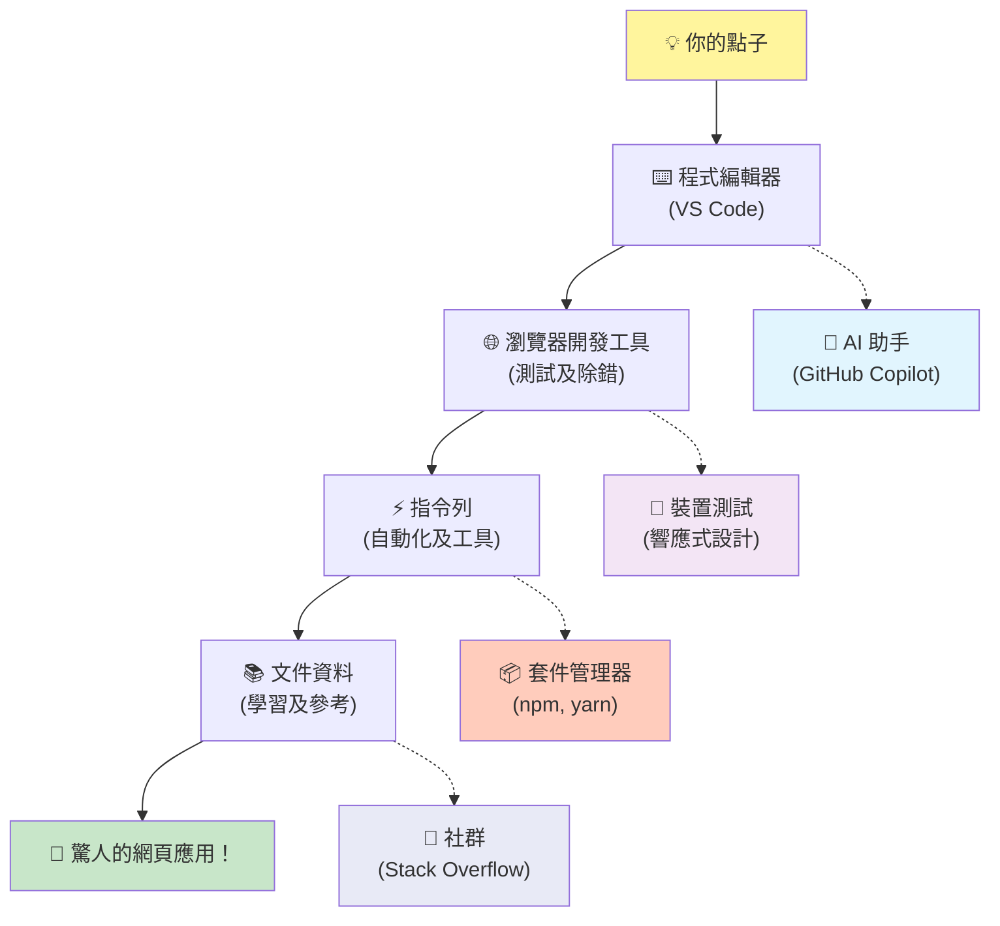
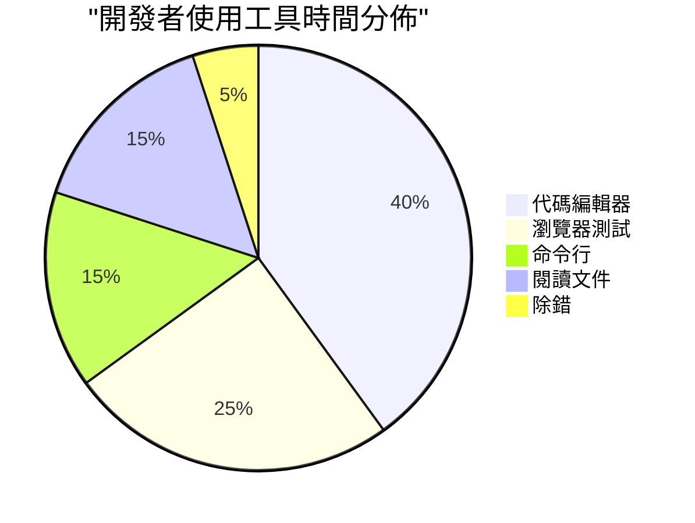

# 程式語言與現代開發工具入門
 
嗨，未來的開發者！👋 我可以告訴你一件每天都讓我起雞皮疙瘩的事情嗎？你即將發現，程式設計不只是關於電腦——它是擁有真正超能力，將你最瘋狂的想法變成現實！

你知道使用你最喜歡的應用程式、所有東西都完美契合的那一刻嗎？當你點一下按鈕，發生了某種神奇的事，讓你讚嘆「哇，他們怎麼做到的？」那麼，創造這種魔法的程式碼就是某個像你一樣的人寫的，可能當時他正坐在他最愛的咖啡店凌晨兩點，喝著第三杯特濃咖啡。你準備好了嗎？到了這堂課結束時，你不僅會了解他們怎麼做到的，還會迫不及待自己嘗試！

說真的，如果你現在覺得程式設計很嚇人，我完全理解。當我剛開始時，我真的以為你必須是數學天才或從五歲就開始寫程式。但有件事徹底改變了我的想法：程式設計就像學習用新語言交談一樣。你從「哈囉」和「謝謝」開始，接著學會點咖啡，不久後就能展開深刻的哲學對話！只是這次，你是在和電腦對話，說實話？電腦是你最有耐心的對話夥伴——它們永遠不會批評你的錯誤，總是樂於嘗試再來一次！

今天，我們要探索那些讓現代網頁開發不只是可能，而是令人上癮的強大工具。我說的是 Netflix、Spotify 以及你最愛的獨立應用工作室的開發者每天使用的編輯器、瀏覽器和工作流程。最棒的是：這些專業級、業界標準的工具大部分都是免費的！


> Sketchnote by [Tomomi Imura](https://twitter.com/girlie_mac)


## 先看看你已經知道什麼！

在我們跳進有趣的部分前，我很好奇——你對這個程式世界已經知道什麼？如果你看著這些問題心想「我完全一頭霧水」，那不只是沒關係，簡直是完美！代表你正站在最正確的起點。把這次測驗想像成運動前的暖身——我們只是在熱身大腦肌肉！

[做這堂課前測驗](https://ff-quizzes.netlify.app/web/)


## 我們即將一起踏上的冒險

好吧，我對今天將要探索的內容超級興奮！說真的，我真希望能看到你理解某些觀念時的表情。這是我們將一起展開的奇妙旅程：

- **程式設計到底是什麼（以及為什麼它超酷！）** — 我們將發現程式碼如何成為你周圍所有事物的隱形魔法，從那個怎麼知道是周一早晨的鬧鐘，到完美策展你 Netflix 推薦的演算法
- **程式語言和它們驚人的個性** — 想像走進一個派對，每個人的超能力和解決問題的方法都截然不同。程式語言世界就是這樣，而你將會愛上認識它們！
- **數位魔法的基本構成積木** — 把它們想成終極創意樂高套裝。當你理解這些積木如何拼合，你會發現你真的可以打造任何你想像的東西
- **專業工具讓你感覺像得到魔法棒** — 我不是在誇張——這些工具真的會讓你覺得有超能力，最棒的是？它們是專業人士正在使用的同樣工具！

> 💡 **這裡有件事**：今天不要試著把所有東西都記起來！現在我只希望你感受到對未來可能性的興奮火花。細節會隨著我們一起練習自然留下——這才是真正的學習！

> 你也可以在 [Microsoft Learn](https://learn.microsoft.com/en-us/learn/modules/web-development-101/introduction-programming/?WT.mc_id=academic-77807-sagibbon) 上進行此課程！

## 那麼程式設計*到底*是什麼？

好，我們來回答這個千萬美元的問題：程式設計到底是什麼？

我來說個改變我看法的故事。上週，我試著解釋給我媽媽怎麼使用我們的新智能電視遙控器。我發現自己說：「按紅色按鈕，但不是大紅色，是左邊的小紅色按鈕⋯⋯不，是你的另一邊左邊⋯⋯好了，現在按住兩秒，不是一秒，也不是三秒⋯⋯」聽起來很熟悉吧？😅

這就是程式設計！就是給一個非常強大的東西，極其詳細且逐步的指令的藝術。但你不是在跟媽媽解釋（媽媽會問「哪個紅色按鈕？！」），而是在跟電腦解釋（電腦只會照你說的做，即使你說的不是你真正想的）。

當我第一次學到這點時，這件事令我驚訝不已：電腦本質上其實相當簡單。它們只能理解兩種東西——1 和 0，基本上就是「是」和「不是」或「開」和「關」。僅此而已！但神奇的是，我們不需要像《駭客任務》那樣用 1 和 0 溝通。這就是**程式語言**派上用場的地方。它們就像擁有世界上最棒的翻譯員，將你極自然的人類思維轉換成電腦語言。

而且現在每天早上醒來，這仍會讓我起雞皮疙瘩：你生活中*一切*數碼東西都起始於某個像你一樣的人，可能穿著睡衣、喝著咖啡，在筆電上敲著碼。那個讓你看起來完美無瑕的 Instagram 濾鏡？有人寫了那段程式碼。那份推介你新歡歌曲的推薦？一位開發者設計了那套演算法。幫你跟朋友分帳單的應用程式？沒錯，有人想「這太煩了，我能不能修好它」，然後……他們做到了！

當你學會程式設計，你不只是學會新技能——你成為了這個令人難以置信的問題解決者社群的一份子，每天都在想：「如果我能做點什麼，讓某人的一天更美好一點，那該有多好？」說真的，有比這更酷的事嗎？

✅ **趣味考古**：當你有空的時候，可以查查看這件事——你認為世界上第一位電腦程式設計師是誰？給你個提示：可能不是你想像中的那位！這個人的故事非常迷人，也展示了程式設計一直以來都是關於創造性問題解決與跳出框架思考的。

### 🧠 **檢視時間：你現在感覺如何？**

**花點時間思考：**
- 「給電腦指令」的想法你現在懂了嗎？
- 你能想出一個想用程式自動化的日常任務嗎？
- 你對這整個程式設計主題有什麼問題在腦海中浮現？

> **記得**：如果有些概念現在還模糊完全正常。學習程式設計就像學習新語言——需要時間讓你的大腦建立神經連結。你做得很好！

## 程式語言就像不同口味的魔法

好啦，這聽起來可能有點怪，但請跟我繼續看——程式語言非常像不同風格的音樂。想想看：有爵士，滑順且即興；搖滾，強力且直接；古典，優雅且有結構；還有嘻哈，富創意且具表現力。每種風格有它獨特的氛圍、瘋狂粉絲族群，也適合不同心境和場合。

程式語言也是這樣！你不會用同一種語言去寫一款有趣的手機遊戲，然後又用它來處理龐大的氣候數據，就好像你不會在瑜伽課上聽死亡金屬音樂（至少大部分瑜伽課不會😄）。

但每次想起這點，我都驚嘆不已：這些語言就像身旁坐著世界上最有耐心、最聰明的口譯員。你用你人腦感覺最自然的方式表達想法，他們負責把它翻譯成電腦真的懂的 1 和 0。就像你有個朋友，流利掌握「人類創意」和「電腦邏輯」兩種語言——而且他永遠不累、不需要喝咖啡休息，也不會因為你連問兩次同一個問題就生氣！

### 熱門程式語言及用途


| 語言 | 最適合 | 為何受歡迎 |
|----------|----------|------------------|
| **JavaScript** | 網頁開發，用戶介面 | 可直接在瀏覽器運行，驅動互動式網站 |
| **Python** | 資料科學，自動化，人工智慧 | 易讀易學，有強大函式庫 |
| **Java** | 企業應用，安卓應用 | 跨平台，適合大型系統 |
| **C#** | Windows 應用，遊戲開發 | 微軟生態系統支援強大 |
| **Go** | 雲端服務，後端系統 | 快速、簡潔，為現代運算設計 |

### 高階語言 vs 低階語言

坦白說，這是我剛開始學程式時最讓我腦袋打結的概念，所以我想分享一個最後讓我懂得比喻——希望對你也有幫助！

想像你去了一個不會說當地語言的國家，急需找廁所（我們都遇過吧？😅）：

- **低階程式語言** 就像你學會當地方言，能跟街角賣水果的阿嬤用文化典故、當地俚語和只有在地人懂的內部笑話聊天。超級厲害且效率極高⋯⋯如果你真通這語言的話！但你光是想找個廁所時，這就有點嚇人了。

- **高階程式語言** 就像你有個超棒的當地朋友懂你意思。你用簡單的英文說「我真的很想找洗手間」，他幫你翻譯文化差異、用你非當地人能理解的方式給你指路。

用程式語言來說：
- **低階語言**（像是組合語言或 C 語言）讓你能用超細節跟電腦硬件談判，但你得用機器般思考，說真的，這是個相當大的心態轉換！
- **高階語言**（像 JavaScript、Python 或 C#）讓你用人的思考模式思考，後台幫你處理所有機器語言，而且還有超熱心的社群，有許多人記得第一次學時的挫折，願意真心幫助！

猜猜我建議你先學哪一種？😉 高階語言就像訓練輪，讓整個體驗更有趣，你甚至不想拿掉它們！


### 讓我來示範為什麼高階語言更親切易用

準備好了嗎？我要給你看一段完美證明我為何愛上高階語言的範例，但先請你答應我一件事。看到第一個程式碼範例時，別慌！它看起來組成壓迫感十足，那正是我想說的重點！

我們會看同一個任務，但用兩種完全不同的風格寫出來。兩者都生成所謂的費氏數列——這是個美妙的數學模式，每個數字都是前兩個數字的和：0、1、1、2、3、5、8、13⋯⋯（趣味小知識：你在自然界中到處都看得到這個模式——葵花籽螺旋、松果圖案，甚至星系的形成！）

準備好了嗎？出發！

**高階語言（JavaScript）——人類友好：**

```javascript
// 步驟 1：基本斐波那契設置
const fibonacciCount = 10;
let current = 0;
let next = 1;

console.log('Fibonacci sequence:');
```

**這段程式碼做了什麼：**
- **宣告**一個常數指定要產生多少個費氏數字
- **初始化**兩個變數追蹤數列中的目前與下一個數字
- **設定**起始值（0 和 1）形成費氏模式
- **顯示**標題訊息，辨識輸出內容

```javascript
// 步驟 2：使用循環產生序列
for (let i = 0; i < fibonacciCount; i++) {
  console.log(`Position ${i + 1}: ${current}`);
  
  // 計算序列中的下一個數字
  const sum = current + next;
  current = next;
  next = sum;
}
```

**細節解析：**
- **用 `for` 迴圈**逐個位置遍歷數列
- **顯示**每個數字與它的位置，使用模板字串格式化
- **計算**下一個費氏數，將目前與下一個值相加
- **更新**追蹤變數以進入下次迭代

```javascript
// 步驟 3: 現代函數式方法
const generateFibonacci = (count) => {
  const sequence = [0, 1];
  
  for (let i = 2; i < count; i++) {
    sequence[i] = sequence[i - 1] + sequence[i - 2];
  }
  
  return sequence;
};

// 使用範例
const fibSequence = generateFibonacci(10);
console.log(fibSequence);
```

**上述程式碼中，我們做了：**
- **用現代箭頭函式語法**建立一個可重用函式
- **建構陣列**儲存完整序列，而非一個一個印出
- **用陣列索引**從前面值計算新數字
- **回傳**完整序列，方便程式其他部分靈活使用

**低階語言（ARM 組合語言）——電腦友好：**

```assembly
 area ascen,code,readonly
 entry
 code32
 adr r0,thumb+1
 bx r0
 code16
thumb
 mov r0,#00
 sub r0,r0,#01
 mov r1,#01
 mov r4,#10
 ldr r2,=0x40000000
back add r0,r1
 str r0,[r2]
 add r2,#04
 mov r3,r0
 mov r0,r1
 mov r1,r3
 sub r4,#01
 cmp r4,#00
 bne back
 end
```

注意 JavaScript 版本讀起來幾乎像英文指令，而組合語言版本則使用直接控制電腦處理器的密碼指令。兩者達成完全相同的任務，但高階語言對人類而言更容易撰寫、閱讀和維護。

**你會發現的主要差異：**
- **可讀性**：JavaScript 使用描述性名稱如 `fibonacciCount`，而 Assembly 使用難以理解的標籤如 `r0`、`r1`
- **註解**：高階語言鼓勵撰寫能使程式碼自我說明的註解
- **結構**：JavaScript 的邏輯流程符合人類逐步思考問題的方式
- **維護性**：根據不同需求更新 JavaScript 版本既簡單又明確

✅ **關於 Fibonacci 數列**：這個絕美的數字模式（每個數字等於前兩個數字之和：0、1、1、2、3、5、8……）幾乎在自然界的每一處都可見！你會發現在向日葵的花瓣螺旋、松果的排列、鸚鵡螺的螺旋曲線，甚至樹枝的生長方式中都存在。數學與程式碼能幫助我們理解並重現自然用來創造美麗的模式，真是令人難以置信！

## 造就魔法的基礎元素

好了，既然你已經目睹了編程語言的運作樣貌，讓我們來拆解組成任何程式的基本元素。把它們想像成你最喜愛的食譜裡的必備材料——只要你懂得每樣材料的功能，你幾乎就能閱讀和撰寫任何語言的程式！

這有點像學習編程的語法。還記得學校裡學名詞、動詞和如何組句子嗎？編程也有自己的語法說法，老實說，這比英語的語法還邏輯且寬鬆得多！😄

### 陳述句：一步一步的指令

讓我們從 **陳述句** 開始——它們就像是你與電腦對話中的單句話。每個陳述句告訴電腦執行一件特定事情，有點像指路：「這裡左轉」、「紅燈停下」、「停在那個位置」。

我喜歡陳述句是因為它們往往相當易讀。看看這個：

```javascript
// 執行單一動作的基本語句
const userName = "Alex";                    
console.log("Hello, world!");              
const sum = 5 + 3;                         
```

**這段程式碼做了什麼：**
- **宣告**一個常數變數來存放用戶名稱
- **顯示**一則問候訊息到控制台輸出
- **計算**並儲存一個數學運算的結果

```javascript
// 與網頁互動的指令
document.title = "My Awesome Website";      
document.body.style.backgroundColor = "lightblue";
```

**一步步來看看發生了什麼：**
- **修改**瀏覽器分頁中網頁的標題
- **改變**整個頁面主體的背景顏色

### 變數：你的程式記憶系統

說實話，**變數** 是我最喜歡教的概念之一，因為它們非常像你每天都在使用的東西！

想一想你的手機通訊錄。你不會背下每個人的電話號碼，反而會把名字存成「媽媽」、「最好的朋友」，或「營業到凌晨 2 點的披薩店」，讓手機幫你記住真正的號碼。變數也是這樣！它們就像有標籤的容器，你的程式可以存放資訊，之後用有意義的名稱取回。

這有趣的是：變數會隨著程式執行而改變（所以才叫「變數」嘛——你看他們多聰明）。就像你可能會更新披薩店聯絡資訊當你發現更好的外賣選擇，變數也能隨著程式得到新資訊或情況變化而更新！

來看看多簡單：

```javascript
// 第一步：建立基本變數
const siteName = "Weather Dashboard";        
let currentWeather = "sunny";               
let temperature = 75;                       
let isRaining = false;                      
```

**理解這些概念：**
- **將**不變的值儲存在 `const` 變數（例如網站名稱）
- **用** `let` 來儲存程式過程中會變的值
- **指派**不同資料型態：字串（文字）、數字，布林值（true/false）
- **挑選**描述性名稱以說明每個變數裡存什麼

```javascript
// 第2步：使用物件來分組相關資料
const weatherData = {                       
  location: "San Francisco",
  humidity: 65,
  windSpeed: 12
};
```

**上面做了以下事：**
- **建立**一個物件來將相關天氣資訊群組起來
- **在一個變數名稱下**組織多筆資料
- **用**鍵值對清晰標記每筆資訊

```javascript
// 第三步：使用和更新變量
console.log(`${siteName}: Today is ${currentWeather} and ${temperature}°F`);
console.log(`Wind speed: ${weatherData.windSpeed} mph`);

// 更新可變變量
currentWeather = "cloudy";                  
temperature = 68;                          
```

**理解各部分：**
- **用**模板字串和 `${}` 語法來顯示資訊
- **用點記法**訪問物件屬性 (`weatherData.windSpeed`)
- **更新**用 `let` 宣告的變數以反映變化條件
- **結合**多個變數來組成有意義的訊息

```javascript
// 第4步：使用現代解構賦值讓代碼更簡潔
const { location, humidity } = weatherData; 
console.log(`${location} humidity: ${humidity}%`);
```

**你需要知道：**
- **用解構賦值**從物件中取出特定屬性
- **自動建立**與物件鍵相同名稱的新變數
- **省略**繁複的點記法來簡化程式碼

### 控制流程：教你的程式思考

這裡開始編程變得超乎想像！**控制流程**基本上就是教你的程式如何做出智慧判斷，就像你自己每天不假思索地做的事一樣。

舉例說：今早你可能心想「如果下雨，我就帶傘；如果冷，我就穿外套；如果遲到了，我就跳過早餐，路上買咖啡」。你的大腦每天都自然地遵循這種 if-then 邏輯好多次！

這正是讓程式感覺聰明又有生命力，而不是只照著無聊死板劇本走的原因。它們真能看狀況，評估發生什麼，然後適當回應。就像給你的程式一個能夠適應和做選擇的腦袋！

想看這是多麼美妙嗎？讓我展示給你：

```javascript
// 第一步：基本條件邏輯
const userAge = 17;

if (userAge >= 18) {
  console.log("You can vote!");
} else {
  const yearsToWait = 18 - userAge;
  console.log(`You'll be able to vote in ${yearsToWait} year(s).`);
}
```

**這段程式碼的功能：**
- **檢查**用戶年齡是否符合投票資格
- **根據條件結果**執行不同的程式區塊
- **計算**如果未滿18歲，距離投票資格還有多久
- **針對每個情況**提供明確有幫助的反饋

```javascript
// 第2步：使用邏輯運算子的多重條件
const userAge = 17;
const hasPermission = true;

if (userAge >= 18 && hasPermission) {
  console.log("Access granted: You can enter the venue.");
} else if (userAge >= 16) {
  console.log("You need parent permission to enter.");
} else {
  console.log("Sorry, you must be at least 16 years old.");
}
```

**把發生的事拆解：**
- **用** `&&`（且）運算符組合多個條件
- **用** `else if` 建立多重情況條件階層
- **用** 最後的 `else` 處理所有可能狀況
- **為每種狀況**提供明確且可執行的回饋

```javascript
// 第3步：使用三元運算符的簡潔條件語句
const votingStatus = userAge >= 18 ? "Can vote" : "Cannot vote yet";
console.log(`Status: ${votingStatus}`);
```

**你要記住：**
- **使用**三元運算子 (`? :`) 處理簡單兩種選項的條件
- **先寫**條件，後跟 `?`，再是符合條件的結果，接著 `:`，最後是假條件的結果
- **在需要根據條件指派值時**套用此模式

```javascript
// 第4步：處理多個具體情況
const dayOfWeek = "Tuesday";

switch (dayOfWeek) {
  case "Monday":
  case "Tuesday":
  case "Wednesday":
  case "Thursday":
  case "Friday":
    console.log("It's a weekday - time to work!");
    break;
  case "Saturday":
  case "Sunday":
    console.log("It's the weekend - time to relax!");
    break;
  default:
    console.log("Invalid day of the week");
}
```

**這段程式完成：**
- **將變數值與多個指定案例比對**
- **將類似案例分組**（工作日與週末）
- **找到符合案例時**執行相應程式區塊
- **包含**`default` 案例處理未預期值
- **用** `break` 防止程式跑到下一案例

> 💡 **現實世界比喻**：想像控制流程就像世界上最有耐心的 GPS 給你導航。它可能會說「如果主街交通擁擠，就走高速公路；如果高速公路施工，不妨走風景路線。」程式用完全一樣的條件邏輯來智慧回應不同情況，並總是給使用者最佳體驗。

### 🎯 **概念檢測：基礎元素掌握**

**讓我們看看你對基礎的理解：**
- 你能用自己的話解釋變數和陳述句的差別嗎？
- 想一想一個現實生活需要用 if-then 判斷的場景（如投票的例子）
- 有哪一件關於程式邏輯讓你感到驚喜？

**快來增強信心：**

✅ **接下來的內容**：我們會繼續深入這些概念，這趟精彩旅程會讓你玩得痛快！現在先感受對未來所有驚人可能性的興奮，專注於這份好奇心。隨著一起練習，那些技巧和技術會自然內化——我保證這比你想像中還有趣！

## 工具寶典

說真的，這時我超興奮到快忍不住了！🚀 我們即將談談那些會讓你覺得像拿到數碼太空船鑰匙一樣不可思議的工具。

你知道廚師為什麼有那一套把刀拿起來就像是手的延伸嗎？又或者一個音樂家總有一把吉他，觸碰時就像它會唱歌？開發者也有我們版本的魔法工具，最讓你震驚的是——它們大多完全免費！

想到要分享這些，我就忍不住在椅子上跳起來，因為這些工具徹底改變了我們寫軟體的方式。那些 AI 輔助的寫碼幫手（我不是開玩笑！）、你能用 Wi-Fi 任何地方建構整套應用的雲端環境，以及像有 X 光眼一樣能助你偵錯的高端工具。

最讓我背脊發涼的是：這些不僅是新手用的工具，你永遠不會用膩。這正是 Google、Netflix，以及你心愛的獨立遊戲工作室此刻正在使用的專業級工具。你用它們會覺得自己超級專業！


### 程式碼編輯器與整合開發環境：你的全新數碼摯友

談談程式碼編輯器——它們很快會成為你最愛的 hangout 地方！把它們想像成你個人的程式創作天堂，你會花大部分時間在這裡雕琢與完善你的數碼作品。

但現代編輯器的厲害之處是：它們不只是高級文字編輯器。它們就像全年無休、最聰明又超支持你的程式導師。在你察覺之前抓住你的打字錯誤，建議改進讓你看起來像天才，幫助你理解程式每段的作用，甚至有些還能預測你要輸入什麼，主動幫你完成想法！

我記得第一次發現自動補完功能時，真有活在未來的感覺。你開始打字，編輯器立刻說：「嘿，你想用這個剛好符合需求的函式嗎？」就像有個能讀心的 coding 伙伴！

**這些編輯器怎麼這麼厲害？**

現代程式碼編輯器提供豐富功能讓你工作更高效：

| 功能 | 功能說明 | 幫助原因 |
|---------|--------------|--------------|
| **語法高亮** | 不同程式碼區塊上色 | 讓代碼更易讀，錯誤更易察覺 |
| **自動補全** | 邊打字邊建議程式碼 | 加快編碼速度，減少錯字 |
| **偵錯工具** | 幫助找錯與修錯 | 節省大量除錯時間 |
| **擴充功能** | 添加專業功能 | 針對各種技術客製化編輯器 |
| **AI 助手** | 建議程式碼與解說 | 加快學習與工作效率 |

> 🎥 **影片資源**：想看看這些工具實際操作？請查閱這個 [工具寶典影片](https://youtube.com/watch?v=69WJeXGBdxg) 做全面介紹。

#### 推薦用於網頁開發的編輯器

**[Visual Studio Code](https://code.visualstudio.com/?WT.mc_id=academic-77807-sagibbon)**（免費）
- 網頁開發者中最受歡迎
- 出色的擴充生態圈
- 內建終端機與 Git 整合
- **必備擴充**：
  - [GitHub Copilot](https://marketplace.visualstudio.com/items?itemName=GitHub.copilot) - AI 驅動的程式碼建議
  - [Live Share](https://marketplace.visualstudio.com/items?itemName=MS-vsliveshare.vsliveshare) - 即時協作
  - [Prettier](https://marketplace.visualstudio.com/items?itemName=esbenp.prettier-vscode) - 自動程式碼格式化
  - [Code Spell Checker](https://marketplace.visualstudio.com/items?itemName=streetsidesoftware.code-spell-checker) - 偵測程式碼錯字

**[JetBrains WebStorm](https://www.jetbrains.com/webstorm/)**（收費，學生免費）
- 進階偵錯與測試工具
- 智慧程式碼補全
- 內建版本控制

**雲端 IDE**（價格多樣）
- [GitHub Codespaces](https://github.com/features/codespaces) - 瀏覽器版完整 VS Code
- [Replit](https://replit.com/) - 學習與分享程式碼的好選擇
- [StackBlitz](https://stackblitz.com/) - 即時全端網頁開發

> 💡 **入門建議**：從 Visual Studio Code 開始——它免費、業界廣泛應用，有龐大社群製作教程和擴充。

### 瀏覽器：你秘密的開發實驗室

準備好被震撼吧！你知道你平時用瀏覽器瀏覽社交媒體和看影片，原來它們一直隱藏著這個超強秘密開發者實驗室嗎？等著你來發掘！

每次你在網頁按右鍵選「檢查元素」，你其實打開了一個隱藏的開發者工具世界，老實說比我以前花大錢買過的軟體還強大。就像發現你的普通廚房背後藏著專業大廚的秘密實驗室一樣！
第一次有人向我展示瀏覽器 DevTools 時，我大概花了三個小時不停點來點去，然後一直說：「等等，它竟然還能這樣？！」你可以即時編輯任何網站，準確看到所有東西加載的速度，測試你網站在不同裝置上的呈現，甚至可以像專業人士那樣調試 JavaScript。這真的是令人震驚！

**這就是為什麼瀏覽器是你的秘密武器：**

當你建立網站或網頁應用程式時，你需要看到它在真實世界中的外觀和行為。瀏覽器不僅展示你的作品，還提供有關效能、無障礙性和潛在問題的詳細反饋。

#### 瀏覽器開發者工具 (DevTools)

現代瀏覽器包含了全面的開發套件：

| 工具類別 | 功能 | 例子應用場景 |
|---------------|--------------|------------------|
| **元素檢查器** | 即時查看和編輯 HTML/CSS | 調整樣式，立即看到結果 |
| **控制台** | 查看錯誤訊息及測試 JavaScript | 調試問題並試驗程式碼 |
| **網絡監控** | 追蹤資源加載情況 | 優化效能和加載時間 |
| **無障礙檢查器** | 測試包容性設計 | 確保網站適合所有用戶 |
| **裝置模擬器** | 在不同屏幕尺寸上預覽 | 測試響應式設計，不需多個裝置 |

#### 推薦的開發瀏覽器

- **[Chrome](https://developers.google.com/web/tools/chrome-devtools/)** - 產業標準 DevTools，附有詳細文件
- **[Firefox](https://developer.mozilla.org/docs/Tools)** - 出色的 CSS Grid 和無障礙工具
- **[Edge](https://docs.microsoft.com/microsoft-edge/devtools-guide-chromium/?WT.mc_id=academic-77807-sagibbon)** - 基於 Chromium，擁有微軟的開發資源

> ⚠️ **重要測試提醒**：一定要在多個瀏覽器測試你的網站！Chrome 上完美運作的東西，可能在 Safari 或 Firefox 會呈現不同。專業開發者會在所有主流瀏覽器上測試，以確保用戶體驗一致。


### 命令行工具：你的開發者超能力入口

好吧，讓我們來談談命令行的完全真心話，因為我想讓你聽聽一個真正理解它的人怎麼說。當我第一次看到它——只是一個令人生畏的黑色螢幕和閃爍的文字——我真的想，「不行，絕對不行！這看起來像1980年代黑客電影的東西，我肯定不夠聰明！」😅

但我一直希望當時有人告訴我，現在我要告訴你：命令行並不可怕——它就像和你的電腦進行直接對話一樣。把它想像成與通過華麗有圖片和菜單的應用來點餐（那當然很方便）相比，你走進你最愛的本地餐廳，廚師知道你喜歡什麼，只要你說「驚喜，來點厲害的」就能瞬間做出完美料理。

命令行是開發者覺得自己像魔法師的地方。你打出幾個看似神奇的字（好吧，其實只是命令，但感覺超神奇！），按下 Enter，砰——你就建立了整個專案架構，安裝了全球最強大的工具，或者將你的應用部署到大家都能看到的網絡上。第一次感受到這種力量後，老實說，真的是會上癮的！

**為什麼命令行會成為你最愛的工具：**

雖然圖形介面適合很多任務，但命令行在自動化、精準和速度方面非常出色。許多開發工具主要通過命令行操作，學會高效使用它們能大幅提升生產力。

```bash
# 第一步：建立並進入專案目錄
mkdir my-awesome-website
cd my-awesome-website
```

**這段程式碼作用是：**
- **建立** 一個名為「my-awesome-website」的新目錄給你的專案
- **進入** 新建立的目錄開始工作

```bash
# 第2步：使用 package.json 初始化項目
npm init -y

# 安裝現代開發工具
npm install --save-dev vite prettier eslint
npm install --save-dev @eslint/js
```

**一步步說明：**
- **初始化** 使用 `npm init -y` 建立一個默認設定的新 Node.js 專案
- **安裝** Vite，作為現代化快速開發及生產建構工具
- **加入** Prettier 做自動格式化，ESLint 做程式碼質量檢查
- **用** `--save-dev` 標記為開發時依賴

```bash
# 第3步：建立專案結構及檔案
mkdir src assets
echo '<!DOCTYPE html><html><head><title>My Site</title></head><body><h1>Hello World</h1></body></html>' > index.html

# 啟動開發伺服器
npx vite
```

**上面操作完成了：**
- **組織** 專案：建立源碼和資源分開的資料夾
- **產生** 基本的 HTML 文件，帶正確文件結構
- **啟動** Vite 開發伺服器，提供實時重新載入和熱模組替換功能

#### 網頁開發必備命令行工具

| 工具 | 用途 | 為什麼需要它 |
|------|---------|-----------------|
| **[Git](https://git-scm.com/)** | 版本控制 | 追蹤變更，與他人協作，備份工作 |
| **[Node.js & npm](https://nodejs.org/)** | JavaScript 執行環境和套件管理 | 瀏覽器外運行 JavaScript，安裝現代開發工具 |
| **[Vite](https://vitejs.dev/)** | 建構工具和開發伺服器 | 極速開發並支持熱模組替換 |
| **[ESLint](https://eslint.org/)** | 程式碼品質 | 自動檢查並修復 JavaScript 問題 |
| **[Prettier](https://prettier.io/)** | 程式碼格式化 | 保持程式碼風格一致且易讀 |

#### 平台專屬選項

**Windows:**
- **[Windows Terminal](https://docs.microsoft.com/windows/terminal/?WT.mc_id=academic-77807-sagibbon)** - 現代且功能豐富的終端機
- **[PowerShell](https://docs.microsoft.com/powershell/?WT.mc_id=academic-77807-sagibbon)** 💻 - 強大的指令腳本環境
- **[Command Prompt](https://docs.microsoft.com/windows-server/administration/windows-commands/?WT.mc_id=academic-77807-sagibbon)** 💻 - 傳統 Windows 命令行

**macOS:**
- **[Terminal](https://support.apple.com/guide/terminal/)** 💻 - 內建終端機應用程式
- **[iTerm2](https://iterm2.com/)** - 帶高級功能的強化終端機

**Linux:**
- **[Bash](https://www.gnu.org/software/bash/)** 💻 - 標準 Linux Shell
- **[KDE Konsole](https://docs.kde.org/trunk5/en/konsole/konsole/index.html)** - 先進終端機模擬器

> 💻 = 作業系統預裝

> 🎯 **學習路徑**：先從基本指令開始，如 `cd`(切換目錄)、`ls` 或 `dir`(列出檔案)、`mkdir` (建立資料夾)。練習使用現代工作流程命令，如 `npm install`、`git status`、`code .`（用 VS Code 開當前目錄）。熟悉後自然能掌握更多進階命令和自動化技巧。


### 文件說明：你隨時可用的學習導師

好吧，讓我分享一個小秘密，會讓你對自己是初學者這檔事更安心：即使是最有經驗的開發者，也會花大量時間在看文件。這不是因為他們不知道自己在做什麼——而是智慧的象徵！

把文件想像成擁有全世界最有耐心、知識豐富的老師，24/7 隨時幫助你。凌晨兩點卡關？文件就像虛擬的溫暖擁抱，提供你完整且精確的答案。想學習熱門新功能？文件會有分步範例帶你慢慢理解。試圖搞懂為什麼某事情能那麼運作？你猜對了——文件會用讓你恍然大悟的方式解釋。

有件事徹底改變我的看法：網頁開發世界變化超快，誰都不可能全部都記得。我看過經驗超過15年的資深開發者還是在查基本語法，知道嗎？這不丟臉，反而很聰明！重點不是記憶完美，而是知道去哪裡快速找到可靠答案，且知道怎麼應用。

**真正的魔法是：**

專業開發者花大量時間看文件，並非不懂，而是因為網頁開發環境變化太快，持續學習保持最新。優質文件幫助你不只是學「怎麼用」，還理解「為什麼用」和「什麼時候用」。

#### 關鍵文件資源

**[Mozilla Developer Network (MDN)](https://developer.mozilla.org/docs/Web)**
- 為網絡技術文件的黃金標準
- HTML、CSS 和 JavaScript 的全面指南
- 包含瀏覽器相容性資訊
- 提供實用範例與互動示範

**[Web.dev](https://web.dev)** (Google 提供)
- 現代網頁最佳實踐
- 效能優化指南
- 無障礙及包容性設計原則
- 真實專案案例研究

**[Microsoft Developer Documentation](https://docs.microsoft.com/microsoft-edge/#microsoft-edge-for-developers)**
- Edge 瀏覽器開發資源
- 漸進式網頁應用指南
- 跨平台開發洞見

**[Frontend Masters Learning Paths](https://frontendmasters.com/learn/)**
- 有結構的學習課程
- 業界專家視訊課程
- 實作編碼練習

> 📚 **學習策略**：別試著背文件——而是學會如何有效導覽。把常用參考標記書籤，練習用搜尋功能快速找到特定資訊。

### 🔧 **工具掌握檢核：你有什麼共鳴？**

**花點時間想想：**
- 你最想先試用哪個工具？（沒有錯誤答案！）
- 命令行還讓你覺得害怕嗎？還是開始好奇了？
- 你能想像用瀏覽器 DevTools 去窺探你最愛網站的幕後嗎？


> **趣味洞察**：大多數開發者花約40%時間在程式碼編輯器，但也別忘了花很多時間在測試、學習與解決問題。編程不只是寫程式碼，而是創造經驗！

✅ **思考食糧**：有趣的觀點在這——你覺得用於建構網站（開發）的工具和設計它外觀的工具會有什麼不同？這就像建築師設計美麗房子和承包商實際建造的差別。兩者同等重要，但需要不同工具！這種思維會幫助你看到網站誕生的整體圖景。

## GitHub Copilot 代理人挑戰 🚀

使用代理人模式完成以下挑戰：

**描述：** 探索現代程式碼編輯器或 IDE 的功能，展示它如何提升你的網頁開發工作流程。

**提示：** 選擇一個程式碼編輯器或 IDE（例如 Visual Studio Code、WebStorm 或雲端 IDE）。列出三個幫助你更高效編寫、調試或維護程式碼的功能或擴充套件。並簡短說明它們如何助益你的工作流程。

---

## 🚀 挑戰

**好的，偵探，準備好接受你的第一個案件了嗎？**

既然你有了這扎實的基礎，接下來有個冒險要讓你看到編程世界究竟多樣又迷人。聽著——現在還不用寫程式，別緊張！把自己當作編程語言偵探，解決你第一個令人興奮的案件！

**你的任務，如果你願意接受：**
1. **成為語言探險家**：從完全不同的領域挑選三種程式語言——可能一個用於建網站，一個做移動應用，一個做科學數據處理。找找同一個簡單任務用每種語言寫成的範例。我保證你會驚訝它們用不同方式做同樣的事！

2. **揭開起源故事**：每種語言有什麼特別之處？酷的是——每種程式語言都是因為有人想，「你看，有沒有更好方法解決這個特定問題？」你能找出那些問題是什麼嗎？有些故事非常有趣！

3. **認識社群**：看看每種語言的社群有多熱情和包容。有些有數百萬開發者分享知識互助，有些規模較小但非常緊密又支持彼此。你會愛上不同社群的個性！

4. **聽從直覺**：現在你覺得哪個語言最有親切感？別擔心要選「完美」答案，只要聽你的直覺！真心說沒有錯答案，以後你還可以繼續探索其他語言。

**額外偵探工作**：看看你能否發現各語言打造的著名網站或應用有哪些。保證你會驚訝 Instagram、Netflix 或你玩到停不下來的手機遊戲背後用的語言！

> 💡 **記得**：今天你不是要成為任何語言專家，而是先熟悉環境，看看你想在哪裡安身立命。慢慢來，玩得開心，讓好奇心帶領你！

## 一起慶祝你發現的成果！

哇，你今天吸收了好多精彩資訊！我真心期待看到你記住了多少這段不可思議的旅程。記得——這不是考試，不用完美。這是慶祝你學習到這個迷人世界裡所有酷東西的時刻！

[做課後小測驗](https://ff-quizzes.netlify.app/web/)

## 複習與自學

**慢慢來，玩得開心！**
你今天已經學了很多東西，這是值得驕傲的事！現在來到最有趣的部分——探索激發你好奇心的主題。記住，這不是功課——而是一場冒險！

**深入探索令你興奮的事物：**

**親自動手體驗程式語言：**
- 訪問 2 至 3 個吸引你注意的程式語言官方網站。每種語言都有其獨特的個性和故事！
- 嘗試一些線上程式碼遊樂場，如 [CodePen](https://codepen.io/)、[JSFiddle](https://jsfiddle.net/) 或 [Replit](https://replit.com/)。別害怕嘗試——不會弄壞任何東西！
- 閱讀你喜愛的語言的誕生故事。說真的，有些起源故事非常吸引人，能幫助你理解語言為何會以這種方式運作。

**熟悉你的新工具：**
- 如果還沒下載 Visual Studio Code，現在就去下載——它是免費的，你會喜歡的！
- 花幾分鐘瀏覽擴充功能市場。這就像你的程式碼編輯器的應用商店一樣！
- 打開瀏覽器的開發者工具，隨便點點看看。別擔心一定要懂——先熟悉工具所在即可。

**加入社群：**
- 在 [Dev.to](https://dev.to/)、[Stack Overflow](https://stackoverflow.com/) 或 [GitHub](https://github.com/) 關注一些開發者社群。程式設計社群對新手非常友善！
- 在 YouTube 觀看一些適合初學者的程式教學影片。很多創作者都懂得初學者的心情，非常值得一看。
- 考慮參加本地聚會或線上社群。相信我，開發者很樂意幫助新手！

> 🎯 **請牢記，我希望你記得的是**：你不必一夜之間成為編程高手！現在，你只是開始認識這個即將成為你一部分的奇妙新世界。慢慢來，享受這段旅程，並記住——你崇拜的每一位開發者，都曾經正坐在你現在的位置，既興奮又可能有點不知所措。這是完全正常的，表示你正走在正確的路上！


## Assignment

[Reading the Docs](assignment.md)

> 💡 **給你的作業小提示**：我非常期待看到你探索一些我們還未介紹過的工具！跳過我們已經提過的編輯器、瀏覽器和命令列工具，這裡有整個令人驚嘆的開發工具宇宙正等待著你去發掘。尋找那些仍在積極維護，且有活躍且有幫助的社群（這些通常有最佳教學，且當你卡住時會有熱心的人伸出援手）。

---

## 🚀 你的程式學習旅程時間表

### ⚡ **接下來 5 分鐘可以做的事**
- [ ] 收藏 2 至 3 個吸引你注意的程式語言網站
- [ ] 如果還沒下載 Visual Studio Code，現在下載它
- [ ] 打開瀏覽器的 DevTools（F12），隨便點擊任何網站看看
- [ ] 加入一個程式社群（Dev.to、Reddit r/webdev 或 Stack Overflow）

### ⏰ **這一小時可以完成的事**
- [ ] 完成課程後小測驗並反思你的答案
- [ ] 安裝 GitHub Copilot 擴充到 VS Code
- [ ] 在線上用兩種不同程式語言寫一個「Hello World」範例
- [ ] 觀看一支「開發者的一天」的 YouTube 影片
- [ ] 開始你的程式語言偵探工作（來自挑戰）

### 📅 **你的一週冒險計畫**
- [ ] 完成作業並探索 3 種新的開發工具
- [ ] 在社群媒體追蹤 5 位開發者或程式帳號
- [ ] 嘗試在 CodePen 或 Replit 製作一些小作品（即使只是「Hello, [你的名字]！」）
- [ ] 閱讀一篇開發者的程式旅程部落格文章
- [ ] 參加線上聚會或觀看程式講座
- [ ] 用線上教程開始學習你選的語言

### 🗓️ **你的一個月蛻變計畫**
- [ ] 建立你的第一個小專案（連簡單網頁也算！）
- [ ] 貢獻一個開源專案（從修正文檔開始）
- [ ] 指導一個剛開始程式旅程的人
- [ ] 建立你的開發者個人作品集網站
- [ ] 與本地開發者社群或讀書會建立連結
- [ ] 開始規劃你的下一個學習目標

### 🎯 **最後的反思檢視**

**在繼續前，花點時間慶祝：**
- 今天關於程式設計，有什麼事情讓你感到興奮？
- 哪個工具或概念是你想先探索的？
- 你對開始這個程式旅程有什麼感覺？
- 現在你想問一位開發者什麼問題？


> 🌟 **記得**：每位專家曾經都是初學者。每位資深開發者都曾經有過你現在的感覺——興奮、或許有點不知所措，並且充滿對可能性的好奇。你正處於美妙的環境中，這趟旅程將會非常精彩。歡迎來到奇妙的程式世界！🎉

---

<!-- CO-OP TRANSLATOR DISCLAIMER START -->
**免責聲明**：  
本文件係使用 AI 翻譯服務 [Co-op Translator](https://github.com/Azure/co-op-translator) 翻譯而成。雖然我們致力於確保準確性，但請注意自動翻譯可能包含錯誤或不準確之處。原始文件之母語版本應為權威依據。對於重要資訊，建議聘請專業人工翻譯。本公司對因使用此翻譯而引致之任何誤解或曲解不負任何責任。
<!-- CO-OP TRANSLATOR DISCLAIMER END -->