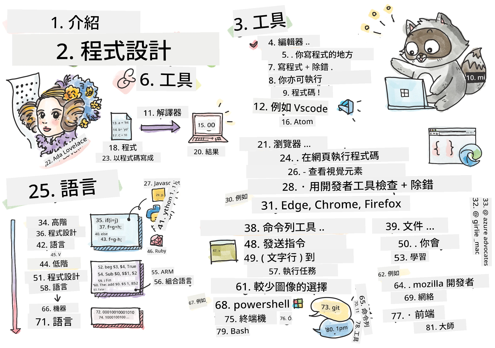
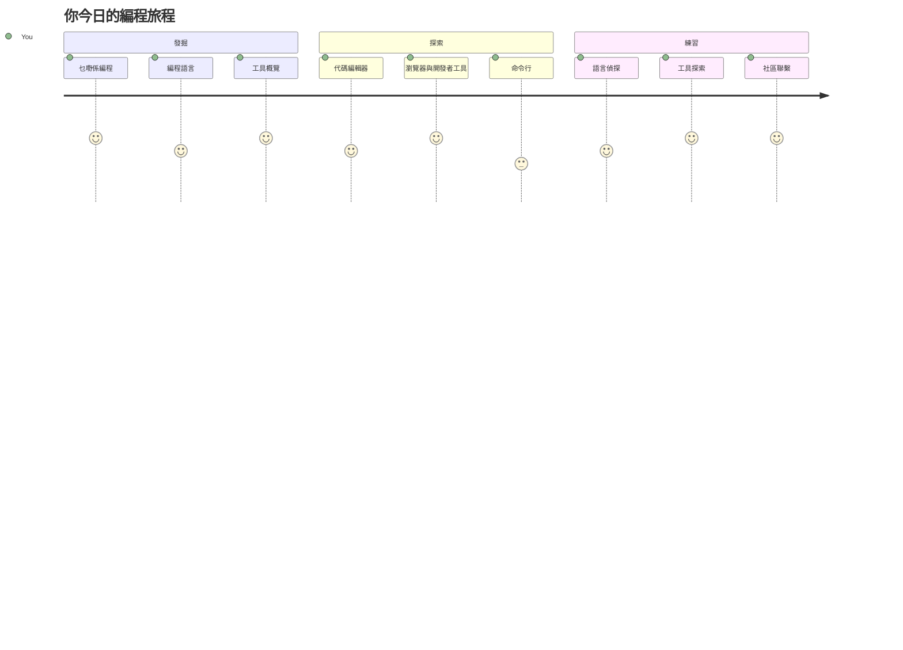
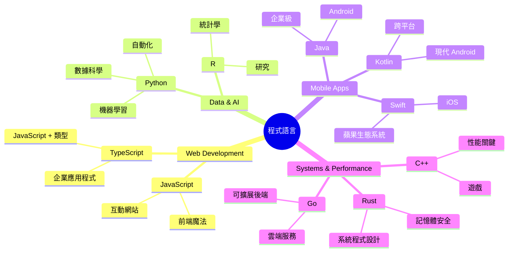
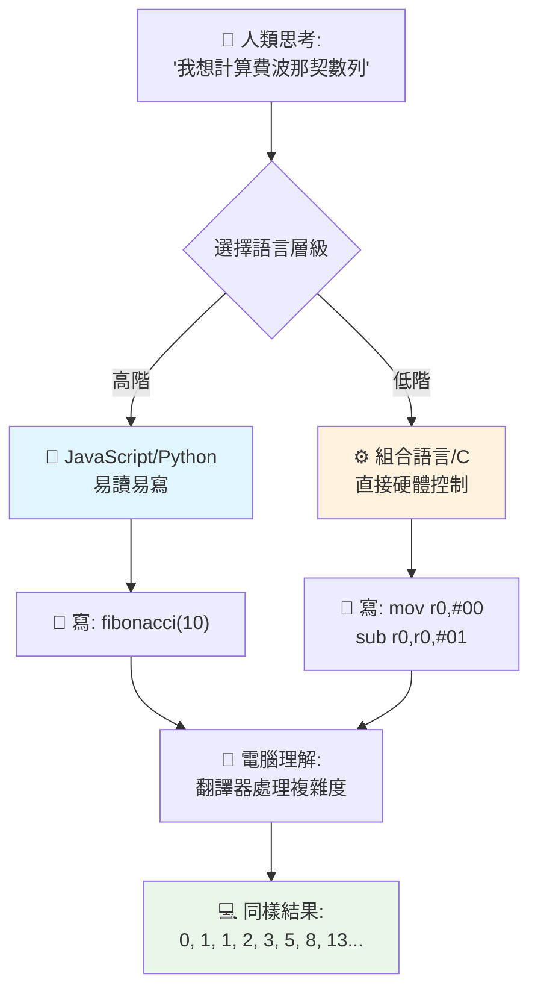
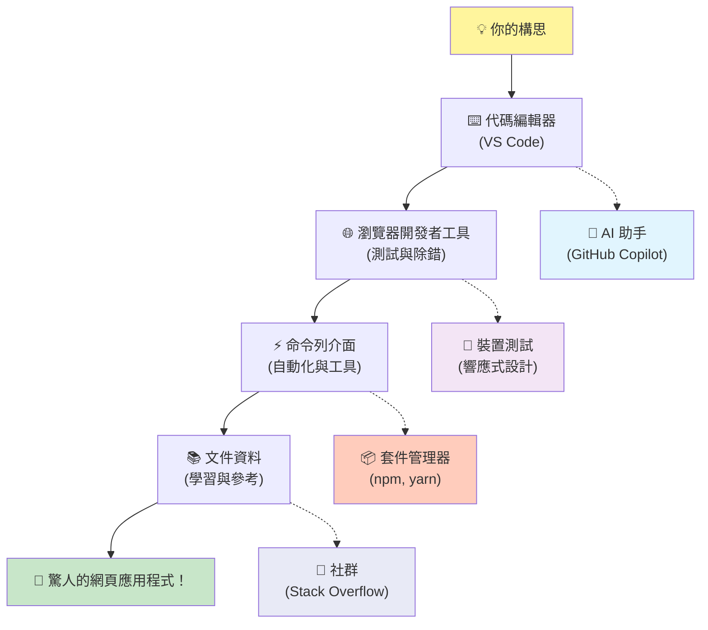
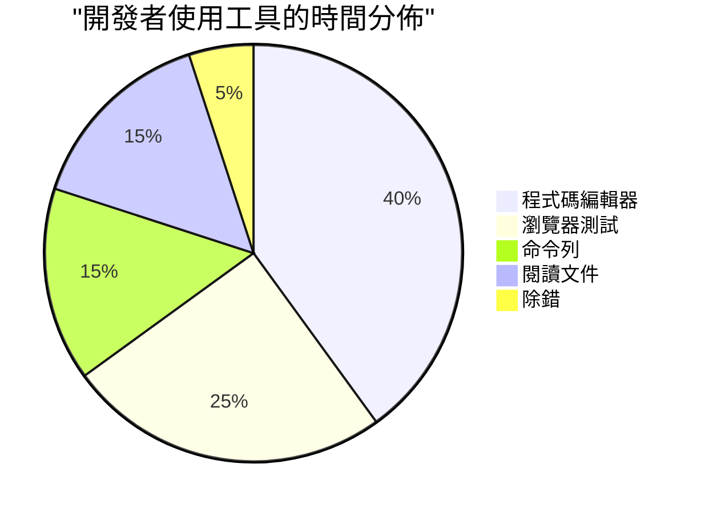
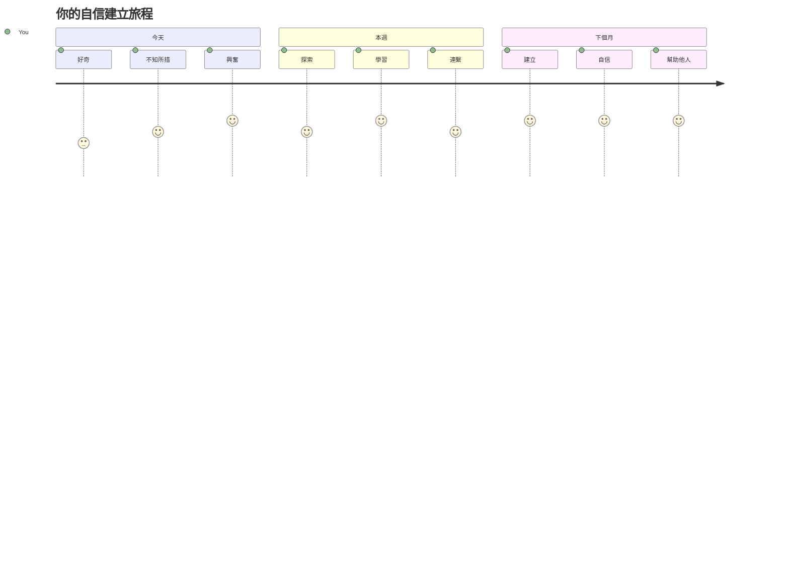

# 程式語言及現代開發工具入門

嗨，未來的開發者！👋 我可以告訴你一件每天都令我激動到雞皮疙瘩的事嗎？你即將發現，程式設計不是只關乎電腦——它是擁有真正超能力去實現你最瘋狂創意的能力！

你知不知道那種感覺，當你用你最喜歡的應用程式時，一切剛剛好很順暢？當你點一下按鈕，發生了什麼魔法般的事情，令你忍不住想：「哇，他們怎麼做到的？」嗯，就像你一樣的人——可能正坐在他們最愛的咖啡店，在凌晨兩點喝著第三杯濃縮咖啡——寫出創造魔法的程式碼。而令你震驚的是：到這堂課結束時，你不但會明白他們如何做到，還會迫不及待想親自嘗試！

說真的，如果你現在覺得程式設計令人害怕，我完全能理解。當我剛開始學習時，真心以為你必須是數學天才，或從五歲開始就寫程式才行。但徹底改變我看法的是：程式設計就像學習一種新語言的對話。你從「你好」「謝謝」開始，接著學會點咖啡，不久後就能討論深刻的哲學問題！不過在這個情況下，是你在跟電腦對話，說真心話？它們是你遇過最有耐性的對話夥伴——永遠不會因為你的錯誤而評判你，還總是樂意再試一次！

今天，我們將探索那些讓現代網頁開發不只是可能，更令人致迷的驚人工具。我說的正是像 Netflix、Spotify 和你喜歡的獨立應用工作室，每天都在用的編輯器、瀏覽器和工作流程。最令人開心的是：這些專業級、業界標準的工具大多完全免費！


> Sketchnote 由 [Tomomi Imura](https://twitter.com/girlie_mac) 繪製


## 先看看你已經知道什麼！

在跳進有趣的內容前，我很好奇——你對這個程式設計世界已經知道什麼？聽著，如果你看這些問題時想：「我完全一點概念都沒有」，這不只是無妨，還是最理想的狀態！代表你來對地方了。把這個小測驗當成運動前的伸展——我們只是熱身那群腦筋！

[做課前小測驗](https://ff-quizzes.netlify.app/web/)


## 我們即將一起展開的冒險

好，我真的超興奮地想跟你分享今天要探索的東西！說真的，我多希望能看到你當某些概念瞬間明白時的表情。以下是我們將一起踏上的精彩旅程：

- **程式設計究竟是什麼（以及為何它是最酷的事情！）**——我們會發現程式碼是包藏在你周圍一切中的無形魔法力量，從那個不知怎的知道是週一早上的鬧鐘，到能完美推介 Netflix 節目算法
- <strong>程式語言及其精彩的個性</strong>——想像走進一個派對，每個人都有截然不同的超能力和解決問題的方法。這就是程式語言的世界，你會愛上認識它們！
- <strong>成就數碼魔法的基本基石</strong>——把它們當作終極創意 LEGO 拼砌。當你懂得如何把這些組件融合，你會發現你能創造出任何你幻想得到的東西
- **專業工具，讓你感覺像剛握到法師魔杖**——我不是在誇張，這些工具真的讓你感覺有超能力，最棒的是？它們跟專業人士用的是同一套！

> 💡 <strong>重點</strong>：今天先別著急要背下所有東西！現在，我只想讓你感受到對可能性的興奮火花。細節會隨著我們一起練習自然而然地記住——真正的學習就是這樣！

> 你也可以在 [Microsoft Learn](https://learn.microsoft.com/en-us/learn/modules/web-development-101/introduction-programming/?WT.mc_id=academic-77807-sagibbon) 上學這堂課！

## 所以，什麼才是 <em>程式設計</em>？

好，讓我們來解答大哉問：程式設計，到底是什麼？

我會跟你分享一個完全改變我看法的故事。上星期，我試著跟我媽媽解釋怎麼用我們的新智能電視遙控器。我發現自己說著「按那個紅色按鈕，但不是大紅鈕，是左邊那個小紅鈕⋯⋯不，是你那邊的另外一個左邊面⋯⋯好，現在按住兩秒，別按一秒，也不是三秒⋯⋯」有沒有很眼熟？😅

這就是程式設計！它是給予非常詳細、逐步指令給極具威力但需要所有步驟全寫清楚的東西的藝術。只是這次不是跟你媽媽解釋（她還會問「哪一個紅鈕？！」），而是你在跟電腦解釋（電腦只照字面做，不管你說的是否正確反映你本意）。

我第一次學這套就震驚的是：電腦其實核心上非常簡單。它只懂兩種訊號——1 和 0，基本上就是「是」跟「否」或「開」與「關」。就這樣！但重點是魔法來自於這裡——我們不需要像《黑客帝國》那樣只用 1 跟 0 講話。這時，<strong>程式語言</strong> 就像最佳翻譯員，把你完完全全正常的想法，轉換成電腦聽得懂的語言。

還有一件事，每天早上起床都讓我真正感動的是：你生活中所有數碼事物，一開始都是像你一樣的人，可能穿著睡衣、手拿咖啡、用筆電打碼寫出來的。那讓你看起來完美無瑕的 Instagram 濾鏡？有人寫了它。那推薦給你新歌的算法？開發者打造的。幫你跟朋友分晚餐帳的應用程式？沒錯，有人想「這很煩，我來解決它」然後…他們真的做到了！

當你學會程式設計，你不只是獲得新技能——你成為這個令人興奮的社群一份子，那些每天都在思考「如果我能造出點什麼，讓別人日子變得稍微更好一點會怎樣？」的人。說真的，有什麼比這更酷的？

✅ <strong>趣味資訊挖掘</strong>：當你有空閒時，可以查查這個超酷的問題——你覺得世界上第一位電腦程式員是誰？提示：你可能想不到！背後的故事非常精彩，證明程式設計一直是關於創造性問題解決與跳出框架思考。

### 🧠 **狀態檢查：你感覺如何？**

**稍作反思：**
- 「給電腦指令」這個概念你現在覺得通嗎？
- 能想像用程式設計自動化哪些日常工作嗎？
- 腦海中對程式設計有什麼問題在醞釀？

> <strong>記得</strong>：如果有些概念現在還模糊，完全正常。學程式就像學語言——大腦需要時間建構神經路徑。你做得很好！

## 程式語言就像不同風味的魔法

這聽起來可能很怪，但請跟我走——程式語言很像不同種類的音樂。想想看：你有爵士樂，輕鬆即興；搖滾，強而有力直接；古典，優雅嚴謹；還有嘻哈，充滿創意與表現力。每種風格都有自己的氛圍、支持者社群，適合不同心情和場合。

程式語言也是一樣！你不會用同一種語言去寫有趣的手機遊戲又用它來處理龐大氣候資料，就像你不會在瑜伽課上放死亡金屬樂（嗯，大部分瑜伽課啦！😄）。

但讓我目瞪口呆的是：這些語言像有個世界上最有耐性的頂級翻譯員陪著你。你用人類大腦自然的語言表達想法，他們負責把所有複雜的細節翻譯成電腦真正懂的 0 與 1。就像有個全通「人類創意」和「電腦邏輯」的朋友——永遠不會累、永遠不需要喝咖啡、也不會因為你重複問同一個問題而評判你！

### 流行程式語言與用途


| 語言 | 擅長範疇 | 流行原因 |
|----------|----------|------------------|
| **JavaScript** | 網頁開發、使用者介面 | 在瀏覽器中運行，推動互動網站 |
| **Python** | 數據科學、自動化、人工智能 | 易學易讀，強大函式庫 |
| **Java** | 企業應用、Android 應用 | 跨平台，適合大型系統 |
| **C#** | Windows 應用、遊戲開發 | 強大微軟生態支持 |
| **Go** | 雲端服務、後端系統 | 快速、簡潔，設計適合現代運算 |

### 高階語言與低階語言

老實說，這是我剛開始學時腦袋瓦解的概念，現在我想用我終於懂得的比喻跟你分享——希望對你也有幫助！

想像你去一個不懂當地語言的國家，又急著找洗手間（我們大家都曾經吧？😅）：

- <strong>低階程式設計</strong> 就像你學會當地方言到可以跟賣水果的阿嬤用文化典故、當地俚語還有只有當地人知道的笑話聊天一樣。超猛又高效⋯⋯如果你懂得這些！但只想找洗手間時，這就太複雜了。

- <strong>高階程式設計</strong> 就像有個超棒的當地朋友完全懂你。你只要用簡單的英語說「我需要洗手間」，他就會幫你翻譯成當地語言，並給你簡單明瞭的指示，讓你這個外地人完全聽得懂。

程式設計的角度來看：
- <strong>低階語言</strong>（像組合語言 Assembly 或 C）讓你能和電腦硬體層直接溝通，但需要用機器思維去想，說實話很大腦跳躍！
- <strong>高階語言</strong>（像 JavaScript、Python 或 C#）讓你用像人類思考模式寫程式，然後它背後處理複雜的機器語言翻譯。而且它們都有超熱情的社群，裡面有人記得剛開始學的挫折，真正很願意幫忙！

你猜我建議你先從哪種開始學？😉 高階語言就像有訓練輪，一開始你不想拆掉，因為它讓整個過程愉快太多！


### 讓我示範為什麼高階語言親切多了

好，我要示範一個完美表達我為何愛上高階語言的例子，但先請你答應我。當你見到第一個程式碼示範時，別慌！它長得嚇人是有原因的，這正是我要說的重點！

我們會看看兩種截然不同風格寫的同一件事：產生費波那契數列——這是一個優美的數學序列，每個數字都是前兩個數字之和：0、1、1、2、3、5、8、13⋯⋯（趣味事實：你可以在自然界找到它的影子——向日葵種子螺旋、松果形態、甚至星系形成的方式！）

準備好了嗎？走起！

**高階語言 (JavaScript) — 親和人類：**

```javascript
// 第一步：基本斐波那契設置
const fibonacciCount = 10;
let current = 0;
let next = 1;

console.log('Fibonacci sequence:');
```

**這段程式碼做的是：**
- <strong>宣告</strong> 一個常數，定義要產生多少個費波那契數
- <strong>初始化</strong> 兩個變數來追蹤當前和下一個數字
- <strong>設定</strong> 開始的數值（0 和 1）作為序列基準
- <strong>顯示</strong> 標頭訊息來辨識輸出結果

```javascript
// 步驟 2：使用迴圈產生序列
for (let i = 0; i < fibonacciCount; i++) {
  console.log(`Position ${i + 1}: ${current}`);
  
  // 計算序列中的下一個數字
  const sum = current + next;
  current = next;
  next = sum;
}
```

**這裡的運作拆解：**
- <strong>用迴圈</strong>（for 迴圈）遍歷整個序列位置
- <strong>輸出</strong> 每個數字與其位置，利用模板字串格式
- <strong>計算</strong> 下一個費波那契數，通過相加當前與下一個
- <strong>更新</strong> 追蹤變數，準備下一輪計算

```javascript
// 第三步：現代函數式方法
const generateFibonacci = (count) => {
  const sequence = [0, 1];
  
  for (let i = 2; i < count; i++) {
    sequence[i] = sequence[i - 1] + sequence[i - 2];
  }
  
  return sequence;
};

// 使用範例
const fibSequence = generateFibonacci(10);
console.log(fibSequence);
```

**在上面，我們已經：**
- <strong>建立</strong> 用現代箭頭函式語法的可重用函式
- <strong>建構</strong> 陣列來存放完整的序列，而不是一個個顯示
- <strong>用</strong> 陣列索引從前面值計算每個新數字
- <strong>回傳</strong> 完整序列，以便程式其他部分靈活使用

**低階語言 (ARM 組合語言) — 電腦專用：**

```assembly
 area ascen,code,readonly
 entry
 code32
 adr r0,thumb+1
 bx r0
 code16
thumb
 mov r0,#00
 sub r0,r0,#01
 mov r1,#01
 mov r4,#10
 ldr r2,=0x40000000
back add r0,r1
 str r0,[r2]
 add r2,#04
 mov r3,r0
 mov r0,r1
 mov r1,r3
 sub r4,#01
 cmp r4,#00
 bne back
 end
```

你會注意到 JavaScript 版本幾乎像英文指令，而組合語言版本使用神祕命令直接控制處理器。它們都完成同樣的工作，但高階語言對人類來說更好理解、撰寫及維護。

**你會發現的關鍵差異：**
- <strong>可讀性</strong>：JavaScript 使用描述性的名稱，如 `fibonacciCount`，而組合語言用的是像 `r0`、`r1` 這樣難明的標籤
- <strong>註解</strong>：高階語言鼓勵撰寫說明性註解，使程式碼具備自我說明功能
- <strong>結構</strong>：JavaScript 的邏輯流程符合人類一步步思考問題的方式
- <strong>維護</strong>：根據不同需求更新 JavaScript 版本簡單且清晰

✅ <strong>關於斐波那契數列</strong>：這個絕美的數字模式（每個數字都是前兩個數字之和：0、1、1、2、3、5、8⋯）實際上在大自然中隨處可見！你會在向日葵的螺旋排列、松果的圖案、鸚鵡螺殼的曲線甚至樹枝的生長方式中發現它。數學和程式碼幫助我們理解並重現自然用來創造美的模式，真是令人驚嘆！


## 造就魔法發生的基石

好吧，既然你已經看過程式語言的實際樣貌，讓我們來拆解構成每一個程式的基本元素。把這些想像成你最喜愛食譜中的必備材料——一旦你懂了每個元素的作用，你幾乎能讀寫任何語言的程式碼！

這有點像在學習程式語言的文法。還記得學校裡學名詞、動詞，以及怎麼組成句子嗎？程式設計也有自己的文法，說真的，比英語文法邏輯得多且寬容得多！😄

### 陳述句：一步步的指令

從<strong>陳述句</strong>開始——它們就像你和電腦對話中的單句。每個陳述句告訴電腦去做一件特定的事，就像給出指示：「這裡左轉」、「紅燈停」、「停在那個位子」。

我喜歡陳述句的地方是它們通常非常易讀。看看這個：

```javascript
// 執行單一動作的基本敘述
const userName = "Alex";                    
console.log("Hello, world!");              
const sum = 5 + 3;                         
```

**這段程式碼做了什麼：**
- <strong>宣告</strong>一個常數變數來儲存使用者名稱
- <strong>顯示</strong>問候訊息到控制台輸出
- <strong>計算</strong>並儲存一個數學運算的結果

```javascript
// 與網頁互動的語句
document.title = "My Awesome Website";      
document.body.style.backgroundColor = "lightblue";
```

**一步步來看發生了什麼：**
- <strong>修改</strong>瀏覽器分頁中顯示的網頁標題
- <strong>更改</strong>整個頁面主體的背景顏色

### 變數：程式的記憶系統

說實話，<strong>變數</strong>是我最喜歡教的概念之一，因為它們非常貼近日常生活中的事物！

想想你手機的聯絡人清單。你不會背起每個人的電話號碼，而是會存成「媽媽」、「最好的朋友」或「凌晨2點前有外賣的披薩店」，讓手機幫你記住實際號碼。變數也是一樣！它們像是標籤容器，讓你的程式能儲存資訊，然後使用易懂的名稱來調用。

更酷的是：變數可以在程式執行時改變（這也是變數名的由來）。就如你發現更讚的披薩店時會更新聯絡人一樣，變數也能隨著程式運行時學到新資訊或情境變化而更新！

讓我給你看看這有多簡單又美妙：

```javascript
// 第一步：建立基本變數
const siteName = "Weather Dashboard";        
let currentWeather = "sunny";               
let temperature = 75;                       
let isRaining = false;                      
```

**理解這些概念：**
- <strong>存儲</strong>不會改變的數值用 `const`（像網站名稱）
- <strong>使用</strong> `let` 保存程式中可能會改變的值
- <strong>指定</strong>不同資料類型：字串（文字）、數字、布林值（真/假）
- <strong>挑選</strong>具描述性的名稱，讓變數內容一目了然

```javascript
// 第 2 步：使用物件將相關數據分組
const weatherData = {                       
  location: "San Francisco",
  humidity: 65,
  windSpeed: 12
};
```

**上述操作：**
- <strong>建立</strong>一個物件來整合相關天氣資訊
- <strong>組織</strong>多筆資料在同一變數名稱底下
- <strong>使用</strong>鍵值對清楚標記每筆資訊

```javascript
// 第三步：使用及更新變量
console.log(`${siteName}: Today is ${currentWeather} and ${temperature}°F`);
console.log(`Wind speed: ${weatherData.windSpeed} mph`);

// 更新可變變量
currentWeather = "cloudy";                  
temperature = 68;                          
```

**理解各部分：**
- <strong>用</strong>模板字串 `${}` 顯示資訊
- <strong>使用</strong>點符號（`weatherData.windSpeed`）存取物件屬性
- <strong>更新</strong>用 `let` 宣告的變數以反映變化情況
- <strong>結合</strong>多個變數以產生有意義的訊息

```javascript
// 第4步：使用現代解構賦值以使程式碼更整潔
const { location, humidity } = weatherData; 
console.log(`${location} humidity: ${humidity}%`);
```

**你需要知道的：**
- <strong>利用</strong>結構賦值從物件中取出特定屬性
- <strong>自動建立</strong>與物件鍵同名的新變數
- <strong>避免</strong>反覆使用點符號，簡化程式碼

### 控制流程：教你的程式學會思考

好了，這裡程式設計開始令人驚嘆！<strong>控制流程</strong>就是教你的程式如何做出聰明決策，像你每天不假思索地做的事情一樣。

想想今天早上你可能這麼思考：「如果下雨就帶傘，如果冷就穿外套，如果快遲到了就跳過早餐改路上買咖啡。」你的大腦每天自然而然地重複數十次這種 if-then 邏輯！

這讓程式感覺聰明有生命，而非只是死板遵循無聊固定腳本。程式能查看狀況、評估情形並做出適當反應。這就像給程式一顆能適應並做選擇的大腦！

想看看它有多奇妙嗎？我來示範：

```javascript
// 第一步：基本條件邏輯
const userAge = 17;

if (userAge >= 18) {
  console.log("You can vote!");
} else {
  const yearsToWait = 18 - userAge;
  console.log(`You'll be able to vote in ${yearsToWait} year(s).`);
}
```

**這段程式碼做了這些事：**
- <strong>檢查</strong>使用者年齡是否達投票資格
- <strong>根據條件結果執行</strong>不同程式區塊
- <strong>計算</strong>如果未滿18歲，還要多久能投票
- <strong>針對每種情況提供</strong>具體且有用的反饋

```javascript
// 第2步：使用邏輯運算子的多重條件
const userAge = 17;
const hasPermission = true;

if (userAge >= 18 && hasPermission) {
  console.log("Access granted: You can enter the venue.");
} else if (userAge >= 16) {
  console.log("You need parent permission to enter.");
} else {
  console.log("Sorry, you must be at least 16 years old.");
}
```

**拆解內容：**
- <strong>用</strong> `&&`（且）運算符串接多個條件
- <strong>用</strong> `else if` 建立多重情境條件層級
- <strong>用</strong> 最後的 `else` 處理所有剩餘狀況
- <strong>針對各種不同情況提供</strong>清楚可行的反饋

```javascript
// 第3步：使用三元運算子簡潔條件表達式
const votingStatus = userAge >= 18 ? "Can vote" : "Cannot vote yet";
console.log(`Status: ${votingStatus}`);
```

**你需要記得：**
- <strong>使用</strong>三元運算子（`? :`）表達簡單的二選一條件
- <strong>先寫</strong>條件，接著 `?`，然後是真結果，接著 `:`，最後是假結果
- <strong>當需要根據條件賦值時使用</strong>這種模式

```javascript
// 第4步：處理多個特定情況
const dayOfWeek = "Tuesday";

switch (dayOfWeek) {
  case "Monday":
  case "Tuesday":
  case "Wednesday":
  case "Thursday":
  case "Friday":
    console.log("It's a weekday - time to work!");
    break;
  case "Saturday":
  case "Sunday":
    console.log("It's the weekend - time to relax!");
    break;
  default:
    console.log("Invalid day of the week");
}
```

**這段程式可做到：**
- <strong>配對</strong>變數值至多個特定案例
- <strong>集合</strong>類似案例（工作日 vs 週末）
- <strong>當匹配成功時執行</strong>對應區塊
- <strong>包含</strong> `default` 處理意外狀況
- <strong>用</strong> `break` 避免接續執行下一個案例

> 💡 <strong>現實類比</strong>：把控制流程想像成世界上最有耐心的 GPS 給你導航，例如「如果主街塞車，就走高速公路；如果高速公路在施工，就走風景路線」。程式用同樣的條件邏輯智慧地回應不同情況，確保使用者得到最佳體驗。

### 🎯 **概念檢核：掌握基石元素**

**來看看你對基礎的掌握：**
- 你能用自己的話說明變數和陳述句的差異嗎？
- 想一個你會用 if-then 判斷的真實場景（像投票例子）
- 程式邏輯中有什麼事情讓你感到意外？

**快速增強信心：**

✅ <strong>接下來內容</strong>：我們將深入挖掘這些概念，一起開心地學習這奇妙旅程！此刻只要感覺對未來無盡可能性的期待就好。技巧和方法會隨著練習自然而然融會貫通——我保證你會比想像中更享受學習樂趣！

## 工作利器

好啦，說真的這部分讓我興奮到坐立不安！🚀 我們要談談一些令人無比激動的工具，它們會讓你感覺自己像剛拿到數位太空船的鑰匙。

你知道廚師那種完美平衡好用的刀具，好像就像手部延伸一樣？或是音樂家有一把只要碰一下就會唱歌的吉他？開發者也有自己的神奇工具，而最讓人震撼的是——它們大多完全免費！

我現在興奮得快跳起來要分享這些，因為它們徹底改變了我們開發軟體的方式。我們講的是 AI 驅動的智能編碼助手，它們能幫你寫程式（我不是開玩笑！）、讓你隨時隨地用 Wi-Fi 在雲端環境建置整套應用，還有像是給程式裝上 X 光視力一般高級的除錯工具。

而且這最讓我熱血沸騰的是：這些並非只有初學者用的工具，它們就是 Google、Netflix、你喜愛的那家獨立應用工作室當前使用的專業工具。你用起來會覺得自己超級專業！


### 程式碼編輯器和整合開發環境：你的新數位好夥伴

說到程式碼編輯器——它們真的會成為你最愛待著的地方！想像它們是你個人的程式碼聖地，你會花大部分時間在這裡打造和完善數位創作。

但現代編輯器最神奇的地方是：它們不只是一個華麗的文字編輯器。它們就像一個全天候超聰明、全力支持你的程式導師。它們在你注意到之前抓住你的錯字、建議能讓你看起來像天才的改進、幫你理解每行程式的作用，有些甚至能預測你想打什麼，主動幫你補完！

我記得第一次發現自動補全時，感覺自己就像活在未來。你剛輸入一點，它就說：「欸，你是不是想用這個函式，正好符合你需求？」就像有個讀心術的程式夥伴！

**這些編輯器厲害在哪裡？**

現代編輯器提供豐富功能，能大幅提升生產力：

| 功能 | 作用 | 好處 |
|---------|--------------|--------------|
| <strong>語法高亮</strong> | 為程式碼不同部分著色 | 讓程式碼更易閱讀並發現錯誤 |
| <strong>自動補全</strong> | 打字時建議程式碼 | 加速寫程式並減少錯字 |
| <strong>除錯工具</strong> | 協助尋找及修正錯誤 | 節省數小時排錯時間 |
| <strong>擴充功能</strong> | 增加專門特性 | 依技術需求自訂編輯器 |
| **AI 助手** | 提供程式碼建議與說明 | 加快學習及提升效率 |

> 🎥 <strong>影片資源</strong>：想看這些工具實際操作？請看這個[工作利器影片](https://youtube.com/watch?v=69WJeXGBdxg)，內容相當全面。

#### 推薦用於網頁開發的編輯器

**[Visual Studio Code](https://code.visualstudio.com/?WT.mc_id=academic-77807-sagibbon)**（免費）
- 網頁開發者最愛
- 出色的擴充功能生態系
- 內建終端機與 Git 整合
- <strong>必裝擴充功能</strong>：
  - [GitHub Copilot](https://marketplace.visualstudio.com/items?itemName=GitHub.copilot) - AI 驅動程式碼建議
  - [Live Share](https://marketplace.visualstudio.com/items?itemName=MS-vsliveshare.vsliveshare) - 即時協作
  - [Prettier](https://marketplace.visualstudio.com/items?itemName=esbenp.prettier-vscode) - 自動格式化程式碼
  - [Code Spell Checker](https://marketplace.visualstudio.com/items?itemName=streetsidesoftware.code-spell-checker) - 幫你抓錯別字

**[JetBrains WebStorm](https://www.jetbrains.com/webstorm/)**（付費，學生免費）
- 進階除錯及測試工具
- 智能程式碼補全
- 內建版本控制

**雲端 IDE**（價格不一）
- [GitHub Codespaces](https://github.com/features/codespaces) - 瀏覽器中完整 VS Code 體驗
- [Replit](https://replit.com/) - 適合學習與分享程式碼
- [StackBlitz](https://stackblitz.com/) - 即時全端網頁開發

> 💡 <strong>入門小秘訣</strong>：從 Visual Studio Code 開始——免費、業界廣泛使用又有龐大社群提供教學和擴充功能。


### 網頁瀏覽器：你神祕的開發實驗室

好，準備好讓你大開眼界！你平常用瀏覽器滑社群、看影片，不知道它們一直藏著一個超強大祕密的開發實驗室，等你來發掘！

每次你在網頁上按右鍵選「檢查元素」，你就打開了一扇大門，進入一組強大到連我以前花上百美元買的軟體都比不上的開發工具。就好像你發現自己家的廚房背後藏了專業廚師的秘密實驗室一樣！
第一次有人給我看瀏覽器開發工具（DevTools）時，我花了三個小時不停地點擊，然後驚呼：「等等，它竟然也能做到這個？！」你真的可以即時編輯任何網站，精確看到各部分載入速度，測試網站在不同裝置上的呈現，甚至像專業人士一樣偵錯 JavaScript。這真是讓人目瞪口呆！

**瀏覽器為何是你的秘密武器：**

當你建立網站或網頁應用程式時，你需要在真實世界中查看它的外觀和行為。瀏覽器不僅能呈現你的作品，還能提供有關效能、無障礙及潛在問題的詳細回饋。

#### 瀏覽器開發者工具 (DevTools)

現代瀏覽器包含全面的開發套件：

| 工具類別 | 功能說明 | 範例用途 |
|---------------|--------------|------------------|
| <strong>元素檢查器</strong> | 即時檢視及編輯 HTML/CSS | 調整樣式並立即看看效果 |
| <strong>控制台</strong> | 檢視錯誤訊息及測試 JavaScript | 偵錯問題及試驗程式碼 |
| <strong>網路監控</strong> | 追蹤資源載入狀況 | 優化效能與載入時間 |
| <strong>無障礙檢查器</strong> | 測試包含性設計 | 確保網站適用於所有用戶 |
| <strong>裝置模擬器</strong> | 在不同螢幕尺寸預覽 | 不需多部裝置也能測試響應式設計 |

#### 推薦開發瀏覽器

- **[Chrome](https://developers.google.com/web/tools/chrome-devtools/)** - 業界標準 DevTools，附有豐富文件
- **[Firefox](https://developer.mozilla.org/docs/Tools)** - 傑出的 CSS Grid 和無障礙工具
- **[Edge](https://docs.microsoft.com/microsoft-edge/devtools-guide-chromium/?WT.mc_id=academic-77807-sagibbon)** - 基於 Chromium，配合微軟開發資源

> ⚠️ <strong>重要測試小提示</strong>：一定要在多個瀏覽器中測試你的網站！Chrome 表現完美的東西，在 Safari 或 Firefox 可能會看起來不一樣。專業開發者會跨主要瀏覽器測試，以確保用戶體驗一致。


### 命令行工具：打開你的開發者超能力大門

好了，讓我們誠實談談命令行，因為我想讓你從一個真正懂的人那裡聽聽這件事。剛開始看到命令行這個黑屏閃爍著文字的東西時，我真的心想：「不行，絕對不行！這看起來像是1980年代駭客電影的東西，我肯定不夠聰明用這個！」😅

但我當時真希望有人告訴我，也就是現在我要告訴你的：命令行不可怕——它其實就像是與電腦直接對話的方式。想像你點餐時，用漂亮的 App 看菜單（輕鬆又方便）跟你走進最愛的小餐館，廚師知道你喜歡什麼，只要你說「給我驚喜」就能做出完美料理，哪一個更酷？命令行就是那種讓開發者覺得自己是巫師的地方。你只要輸入幾個看似神奇的詞（好啦，它們其實是命令，但感覺像魔法），按下 Enter ，砰——你就建立起整個專案結構、從世界各地安裝強大的工具，甚至把你的應用部署到網路上，讓數百萬人看到。嘗到這股力量後，你會上癮的！

**為什麼命令行會成為你最愛的工具：**

圖形介面確實適合很多任務，但命令行在自動化、精準度和速度方面超強。許多開發工具主要透過命令行介面運作，學會有效使用它們能大幅提升你的生產力。

```bash
# 第一步：建立並進入項目目錄
mkdir my-awesome-website
cd my-awesome-website
```

**這段程式碼做了什麼：**
- <strong>建立</strong> 一個叫做 "my-awesome-website" 的新資料夾給你的專案
- <strong>切換</strong> 進入剛建立的資料夾開始工作

```bash
# 第2步：使用 package.json 初始化專案
npm init -y

# 安裝現代開發工具
npm install --save-dev vite prettier eslint
npm install --save-dev @eslint/js
```

**一步步說明這裡發生的事：**
- 使用 `npm init -y` <strong>初始化</strong> 一個預設設定的新 Node.js 專案
- <strong>安裝</strong> Vite 作為快速開發和生產建置的現代工具
- <strong>加入</strong> Prettier 自動格式化程式碼，以及 ESLint 程式碼品質檢查
- 使用 `--save-dev` 標記這些僅為開發時使用的相依套件

```bash
# 步驟 3：建立項目結構和檔案
mkdir src assets
echo '<!DOCTYPE html><html><head><title>My Site</title></head><body><h1>Hello World</h1></body></html>' > index.html

# 啟動開發伺服器
npx vite
```

**上面做了什麼：**
- <strong>組織</strong> 專案，建立獨立的原始碼和資源資料夾
- <strong>產生</strong> 基本的 HTML 檔案，包含完整文檔結構
- <strong>啟動</strong> Vite 開發伺服器，提供即時重新載入和模組熱替換

#### 網頁開發必備命令行工具

| 工具 | 目的 | 你為何需要它 |
|------|---------|-----------------|
| **[Git](https://git-scm.com/)** | 版本控管 | 追蹤變動、協作、備份工作成果 |
| **[Node.js & npm](https://nodejs.org/)** | JavaScript 執行環境與套件管理 | 在瀏覽器外執行 JavaScript，安裝現代開發工具 |
| **[Vite](https://vitejs.dev/)** | 建置工具及開發伺服器 | 超快的開發速度及模組熱替換 |
| **[ESLint](https://eslint.org/)** | 程式碼品質 | 自動找出並修正 JavaScript 問題 |
| **[Prettier](https://prettier.io/)** | 程式碼格式化 | 保持程式碼格式一致且易讀 |

#### 平台專用選項

**Windows:**
- **[Windows Terminal](https://docs.microsoft.com/windows/terminal/?WT.mc_id=academic-77807-sagibbon)** - 現代且功能豐富的終端機
- **[PowerShell](https://docs.microsoft.com/powershell/?WT.mc_id=academic-77807-sagibbon)** 💻 - 強大的腳本環境
- **[命令提示字元](https://learn.microsoft.com/windows-server/administration/windows-commands/windows-commands)** 💻 - 傳統的 Windows 命令行

**macOS:**
- **[終端機](https://support.apple.com/guide/terminal/)** 💻 - 內建終端機應用程式
- **[iTerm2](https://iterm2.com/)** - 功能強化的終端機

**Linux:**
- **[Bash](https://www.gnu.org/software/bash/)** 💻 - 標準 Linux shell
- **[KDE Konsole](https://docs.kde.org/trunk5/en/konsole/konsole/index.html)** - 進階終端機模擬器

> 💻 = 作業系統預先安裝

> 🎯 <strong>學習路線</strong>：從基本指令開始，如 `cd`（切換目錄）、`ls` 或 `dir`（列出檔案）、`mkdir`（建立資料夾）。練習使用現代工作流程命令，如 `npm install`、`git status` 和 `code .`（用 VS Code 開啟目前資料夾）。熟悉後，你會自然而然掌握更進階的命令與自動化技巧。


### 文件資源：你隨時可用的學習導師

來，讓我分享一個秘密，保證讓你這個初學者感覺輕鬆很多：即使是最有經驗的開發者，也花大量時間在看文件。這並不是他們不懂問題，而是智慧的表現！

把文件想像成全球最有耐心、知識最豐富的老師，24/7 隨時在線。半夜兩點卡關了？文件像個溫暖隨行的擁抱，恰好給你需要的答案。想學某個大家熱議的新功能？文件會有逐步範例幫你解惑。想搞懂某些東西為何這樣運作？沒錯，文件會用淺顯的方式幫你理解！

這讓我徹底改變看法：網頁開發世界非常快速變動，沒有人能記住一切（我說真的，絕無例外）！我看過擁有15年以上經驗的資深開發者還是會查基本語法，知道嗎？這不丟臉，而是聰明！不是記憶完美，而是知道該去哪裡快速找到可靠答案並懂得應用。

**真正的魔法就在這裡：**

專業開發者花很多時間在看文件——不是因為不懂，而是網頁開發領域變化太快，持續學習才是王道。優秀的文件不僅教你 <em>怎麼</em> 用，還教你 <em>為什麼</em> 和 <em>何時</em> 用。

#### 重要文件資源

**[Mozilla Developer Network (MDN)](https://developer.mozilla.org/docs/Web)**
- 網頁技術文件的金標準
- 詳盡 HTML、CSS、JavaScript 指南
- 包含瀏覽器相容性資訊
- 實用範例與互動示範

**[Web.dev](https://web.dev)**（由 Google 提供）
- 現代網頁開發最佳實務
- 效能優化指南
- 無障礙及包容性設計原則
- 真實案例研究

**[Microsoft Developer Documentation](https://docs.microsoft.com/microsoft-edge/#microsoft-edge-for-developers)**
- Edge 瀏覽器開發資源
- 漸進式網頁應用程式 (PWA) 指南
- 跨平台開發心得

**[Frontend Masters Learning Paths](https://frontendmasters.com/learn/)**
- 有結構的學習課程
- 業界專家授課影片
- 實作練習題

> 📚 <strong>學習策略</strong>：不要死記文件，而是學會高效瀏覽。把常用參考書籤收藏，練習用搜尋功能快速找到關鍵資訊。

### 🔧 **工具掌握小檢測：你最有共鳴的是？**

**花點時間思考：**
- 你最想先嘗試哪個工具？（沒有錯答案！）
- 命令行還覺得害怕嗎？還是開始好奇了？
- 能想像用瀏覽器 DevTools 窺探你最愛網站的內幕嗎？


> <strong>有趣訊息</strong>：多數開發者約40%時間待在程式碼編輯器，但你會發現測試、學習與問題解決也佔很大比例。寫程式不只是寫程式碼——而是在打造體驗！

✅ <strong>給你思考的點子</strong>：你覺得建造網站（開發）用的工具，跟設計它們外觀（設計）用的工具有何不同？就像建築師設計漂亮房屋，跟承包商直接蓋房子的差別。兩者都重要，但工具箱完全不同！這種想法會幫助你看到網站誕生的全貌。

## GitHub Copilot Agent 挑戰 🚀

使用 Agent 模式完成以下挑戰：

**說明：** 探索現代程式碼編輯器或 IDE 的功能，並展示它如何提升你作為網頁開發者的工作流程。

**提示：** 選擇一個程式碼編輯器或 IDE（如 Visual Studio Code、WebStorm，或雲端 IDE）。列出三個特性或擴充功能，說明如何幫助你更有效率地撰寫、偵錯或維護程式碼。每個功能附上簡短說明，解釋其對工作流程的優勢。

---

## 🚀 挑戰

**偵探，準備好接你的第一個案件了嗎？**

現在你已經有了很棒的基礎，我這裡有個冒險任務，能幫你看到程式世界多麼多元又迷人。聽著——這不是寫程式的要求，所以不用有壓力！把自己當成程式語言偵探，踏上你的第一場刺激探案吧！

**你的任務，如果你願意接受：**
1. <strong>成為語言探險家</strong>：挑選三種完全不同宇宙的程式語言——或許一個用來建網站，一個用來寫手機 App，還有一個用於科學資料處理。找找相同簡單任務在每種語言的寫法。保證你會驚訝它們做同一件事的長相是多麼不同！

2. <strong>揭秘誕生故事</strong>：是什麼讓每種語言特別？有趣的是，每種語言誕生的背後，其實都是有人想，「我得有更好的方法解決這個問題！」你能找到那些問題是什麼嗎？有些故事超精彩！

3. <strong>認識社群</strong>：看看各語言社群多友善且熱情。有人數百萬開發者分享知識互助，有的則是精緻緊密、支持力十足。你一定會喜歡看到不同社群的個性！

4. <strong>跟隨你的直覺</strong>：哪種語言現在看起來最親切？不用擔心選擇「完美」語言——聽聽你的本能！真的沒有錯答案，而且你隨時可以再探索其他。

<strong>額外偵探任務</strong>：試著找出主要網站或應用是用哪種語言打造的。我保證你會被 Instagram、Netflix，或你玩不膩的手機遊戲背後的技術嚇一跳！

> 💡 <strong>記住</strong>：今天不是要你成為語言高手。只是讓你先認識這個街區，再決定要在哪裡安家。慢慢來，玩得開心，讓好奇心引領你！

## 一起慶祝你的發現！

哇，你今天吸收了超多驚人資訊！我真的很期待看到你記住多少這趟精彩旅程的內容。記得——這不是要你完美答題的考試，而是慶祝你對這迷人世界所學到的所有酷東西！

[進行課後小測驗](https://ff-quizzes.netlify.app/web/)

## 複習與自學

**慢慢來，探索也要玩得開心！**
你今天已經學習了很多，值得為自己感到驕傲！現在來到有趣的部分——探索激發你好奇心的主題。記住，這不是功課——而是一場冒險！

**深入探索讓你興奮的事物：**

**動手試試程式語言：**
- 瀏覽2-3個吸引你注意的程式語言官方網站。每個語言都有它獨特的個性和故事！
- 嘗試一些線上程式碼練習平台，如 [CodePen](https://codepen.io/)、[JSFiddle](https://jsfiddle.net/)、或 [Replit](https://replit.com/)。不要害怕嘗試——你不會弄壞什麼！
- 讀讀你喜愛的語言是如何誕生的。真的，有些起源故事非常有趣，能幫助你理解語言運作的原因。

**熟悉你的新工具：**
- 如果還沒下載 Visual Studio Code，就去下載吧——免費又好用，你一定會喜歡！
- 花幾分鐘逛逛擴充功能市集。它就像你程式編輯器的應用商店！
- 打開瀏覽器的開發者工具，隨意點點看。別擔心要全部明白——先熟悉裡面有些什麼。

**加入社群：**
- 追蹤一些開發者社群，如 [Dev.to](https://dev.to/)、[Stack Overflow](https://stackoverflow.com/)、或 [GitHub](https://github.com/)。程式社群對新手非常友好！
- 在 YouTube 看一些適合初學者的程式教學影片。很多優秀的創作者都記得剛開始的感受。
- 考慮參加當地聚會或線上社群。相信我，開發者很樂意幫助新手！

> 🎯 **聽著，這是我希望你記住的**：你不需要一夜之間成為編碼高手！現在，你只是開始了解你即將參與這個精彩新世界。慢慢來，享受過程，記得——每個你敬佩的開發者，曾經都坐在你現在的位置，既興奮又可能稍微有點不知所措。這完全正常，這表示你走在正確的路上！


## Assignment

[Reading the Docs](assignment.md)

> 💡 <strong>給你作業的一點提示</strong>：我真的很希望看到你去探索一些我們還沒說過的工具！跳過編輯器、瀏覽器和命令行工具這些我們已經講過的——那裡有一整個令人驚嘆的開發工具世界等著你去發現。尋找那些有活躍維護和充滿活力、樂於助人社群的工具（這些工具往往有最好的教學和當你卡住時能伸出援手的社群）。

---

## 🚀 你的程式旅程時間表

### ⚡ **接下來5分鐘內你可以做到的事**
- [ ] 收藏2-3個吸引你的程式語言網站
- [ ] 如果還沒下載，下載 Visual Studio Code
- [ ] 開啟瀏覽器的開發者工具（F12），隨意點閱任何網站
- [ ] 加入一個程式開發社群（Dev.to、Reddit r/webdev，或 Stack Overflow）

### ⏰ <strong>這一小時你可以完成的事</strong>
- [ ] 完成課後小測驗，並思考你的答案
- [ ] 安裝 VS Code 上的 GitHub Copilot 擴充功能
- [ ] 在線上嘗試用兩種不同程式語言寫「Hello World」範例
- [ ] 看一支關於「開發者的一天」的 YouTube 影片
- [ ] 開始你的程式語言偵探探索（從挑戰開始）

### 📅 <strong>你的一週冒險計畫</strong>
- [ ] 完成作業並探索3個全新開發工具
- [ ] 在社交媒體上追蹤5位開發者或程式帳號
- [ ] 嘗試在 CodePen 或 Replit 建立一個小作品（甚至是「Hello，[你的名字]！」）
- [ ] 閱讀一篇開發者分享的程式旅程部落格文章
- [ ] 參加線上聚會或觀看程式演講
- [ ] 開始使用線上教學學習你選定的程式語言

### 🗓️ <strong>你的一個月蛻變計畫</strong>
- [ ] 建置你的第一個小專案（即使是一個簡單的網頁也算！）
- [ ] 為開源專案做出貢獻（從文檔改進開始）
- [ ] 指導剛開始程式旅程的人
- [ ] 建立你的開發者作品集網站
- [ ] 與當地的開發社群或讀書會連結
- [ ] 開始規劃你的下一個學習里程碑

### 🎯 <strong>最後的反思檢討</strong>

**在前進之前，先花點時間慶祝：**
- 今天有什麼關於程式讓你感到興奮？
- 你想先探索哪個工具或概念？
- 你對開始這程式旅程的感受如何？
- 現在有什麼問題是你想問開發者的？


> 🌟 <strong>記住</strong>：每位專家都曾是初學者。每位資深開發者都曾有過你現在的感覺——興奮、可能有點不知所措，且充滿好奇。他們是你很棒的同行，這段旅程將會很精彩。歡迎來到奇妙的程式世界！ 🎉

---

<!-- CO-OP TRANSLATOR DISCLAIMER START -->
**免責聲明**：  
本文件是使用 AI 翻譯服務 [Co-op Translator](https://github.com/Azure/co-op-translator) 翻譯而成。雖然我們致力於確保準確性，但請注意，自動翻譯可能包含錯誤或不準確之處。原始文件的原文版本應被視為權威來源。對於關鍵資訊，建議使用專業人工翻譯。我們不對因使用此翻譯而產生的任何誤解或誤譯承擔責任。
<!-- CO-OP TRANSLATOR DISCLAIMER END -->