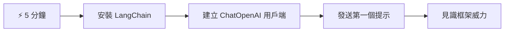
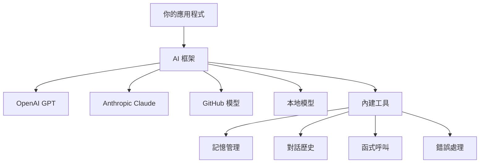
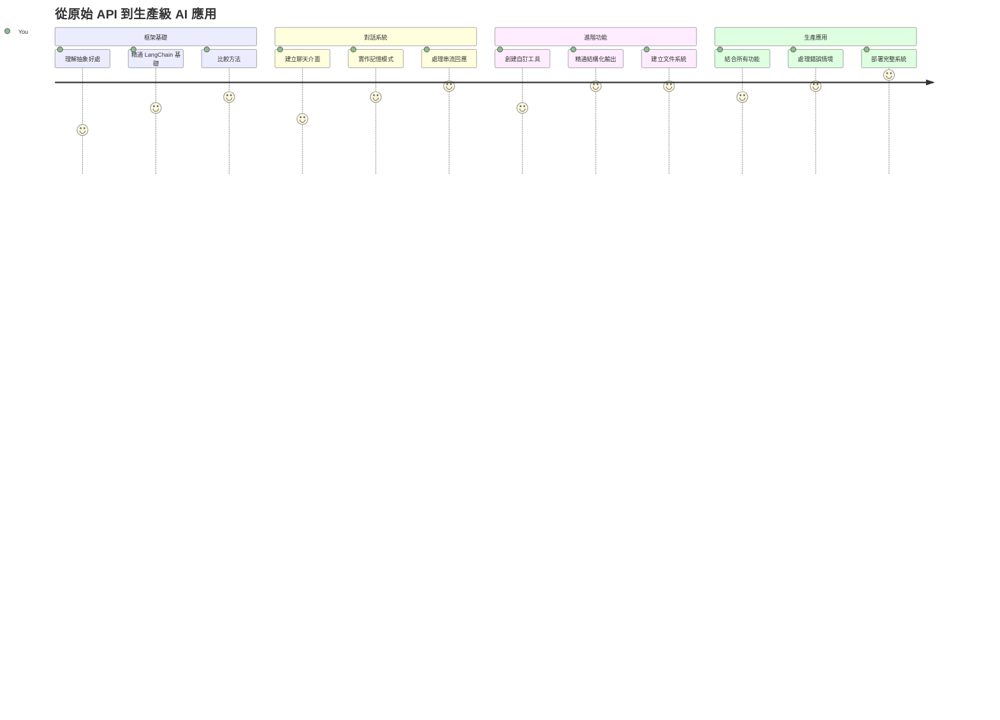
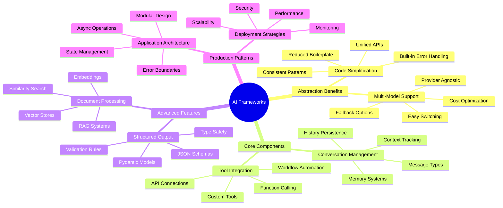
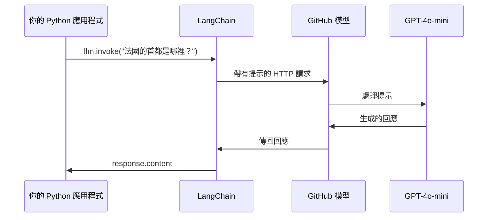
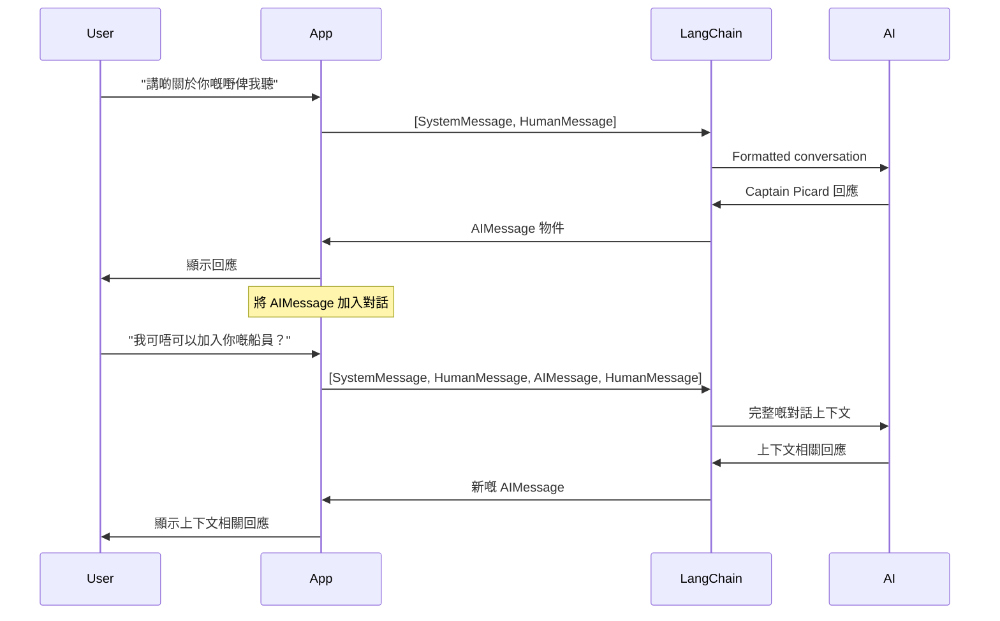
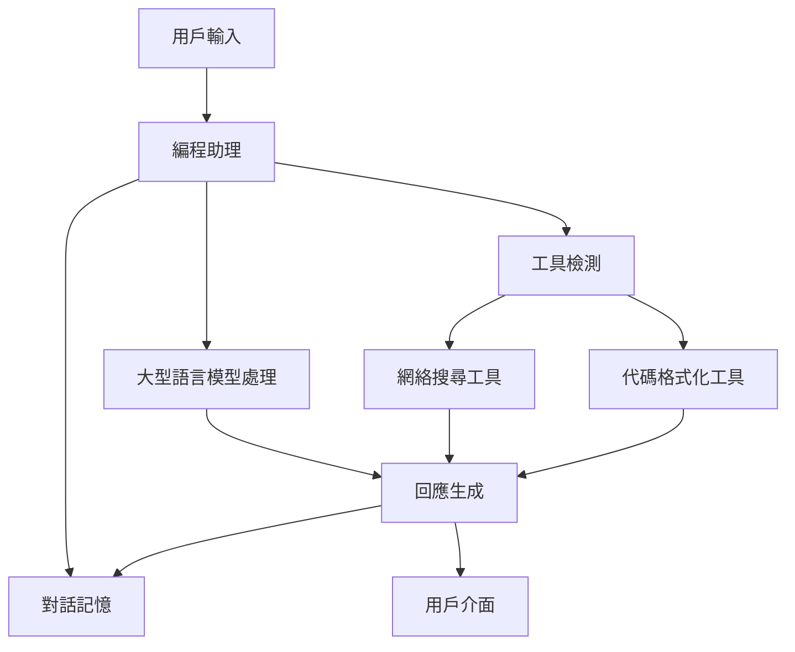
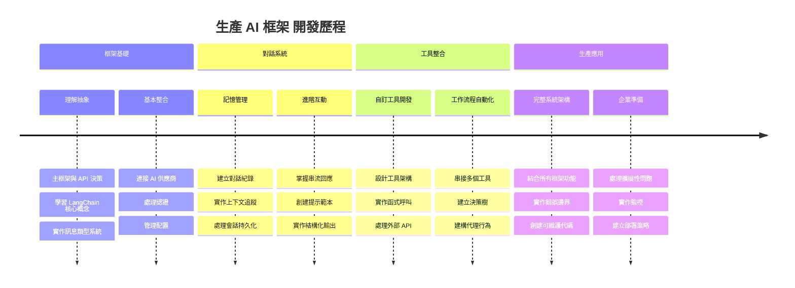
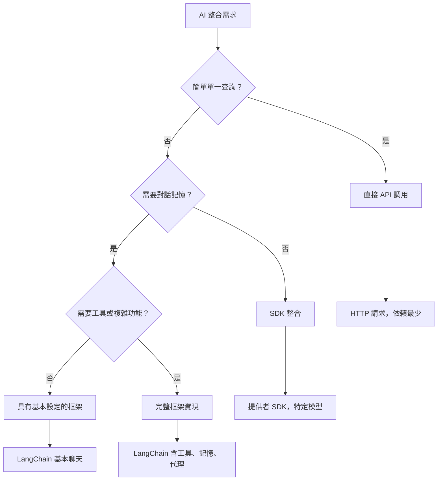

# AI Framework

曾經試過從零開始建立 AI 應用程式，感覺不知所措嗎？你並不孤單！AI 框架就像是 AI 開發的瑞士軍刀 — 它們是強大的工具，能在建立智能應用時為你節省時間和煩惱。把 AI 框架想像成一個井然有序的函式庫：它提供預建元件、標準化 API 及智能抽象，讓你專注於解決問題，而不是為實現細節苦惱。

在本課程中，我們將探索像 LangChain 這樣的框架怎樣將過去複雜的 AI 整合任務，轉化成清晰、可閱讀的程式碼。你將學會如何應對真實世界的挑戰，如追蹤對話、實現工具調用，以及通過單一統一介面管理不同的 AI 模型。

等我們完成後，你將明白何時應使用框架而非原生 API 調用，如何有效利用其抽象，並建構適合實際應用的 AI 應用程式。讓我們一起探索 AI 框架能為你的專案帶來什麼。

## ⚡ 下一個 5 分鐘你可以做什麼

**忙碌開發者的快速起步路徑**


- **第 1 分鐘**：安裝 LangChain：`pip install langchain langchain-openai`
- **第 2 分鐘**：設定你的 GitHub 令牌並匯入 ChatOpenAI 用戶端
- **第 3 分鐘**：建立一個簡單的系統和人類訊息對話
- **第 4 分鐘**：加入一個基本工具（例如加法函數），觀看 AI 工具調用
- **第 5 分鐘**：體驗原始 API 調用與框架抽象的差異

**快速測試程式碼**：
```python
from langchain_openai import ChatOpenAI
from langchain_core.messages import SystemMessage, HumanMessage

llm = ChatOpenAI(
    api_key=os.environ["GITHUB_TOKEN"],
    base_url="https://models.github.ai/inference",
    model="openai/gpt-4o-mini"
)

response = llm.invoke([
    SystemMessage(content="You are a helpful coding assistant"),
    HumanMessage(content="Explain Python functions briefly")
])
print(response.content)
```

**為什麼這很重要**：在 5 分鐘內，你將體驗到 AI 框架如何將複雜的 AI 整合轉變為簡單的方法調用。這是支撐生產環境 AI 應用的基礎。

## 為什麼選擇框架？

你已經準備好建立 AI 應用了 — 太棒了！但事情是這樣的：你有幾條不同的路可以走，每條都有其優缺點。這有點像選擇走路、騎車或開車去某處 — 你都能到達，但體驗（和付出的努力）會完全不同。

讓我們拆解三種主要整合 AI 的方式：

| 方法 | 優勢 | 適用對象 | 考量 |
|----------|------------|----------|--------------|
| **直接 HTTP 請求** | 完全控制，無依賴 | 簡單查詢，學習基礎 | 程式碼冗長，錯誤處理需手動 |
| **SDK 整合** | 減少樣板碼，模型專屬優化 | 單模型應用 | 限定特定提供者 |
| **AI 框架** | 統一 API，內建抽象 | 多模型應用，複雜工作流程 | 學習曲線，可能過度抽象 |

### 框架實務中的好處


**為什麼框架重要：**
- **統一**多個 AI 供應商在一個介面下
- **自動處理**對話記憶
- **提供**現成工具，例如嵌入向量和函數調用
- **管理**錯誤處理和重試邏輯
- **將**複雜工作流程轉為可閱讀的方法調用

> 💡 **專家技巧**：當你在多種 AI 模型切換或開發複雜功能（如代理、記憶、工具調用）時，使用框架最合適。學習基礎或建立簡單專注應用時，直接使用 API 較適合。

**總結**：就像在選擇專業工匠工具和完整工作坊之間一樣，重點是工具與任務的匹配。框架在複雜且功能豐富的應用程式中表現卓越，而直接 API 更適合簡單明確的使用場景。

## 🗺️ 你的 AI 框架精通學習之旅


**你的學習終點**：在本課程結束時，你將精通 AI 框架開發，能打造出媲美商業 AI 助手的高階生產級 AI 應用。

## 介紹

本課程將學習如何：

- 使用通用的 AI 框架。
- 解決常見問題，如聊天對話、工具使用、記憶與上下文。
- 利用此構建 AI 應用。

## 🧠 AI 框架開發生態系統


**核心原則**：AI 框架隱藏複雜性，同時提供強大的抽象層，用於對話管理、工具整合與文檔處理，協助開發者用乾淨且易於維護的程式碼建立複雜的 AI 應用。

## 你的第一個 AI 提示

讓我們從基礎開始，建立你的第一個 AI 應用程式，發送問題並獲得回答。就像阿基米德在浴缸裡發現排水原理一樣，最簡單的觀察有時能揭示最強大的洞見 — 而框架讓這些洞見變得可及。

### 使用 GitHub 模型設定 LangChain

我們將使用 LangChain 連接到 GitHub 模型，這很棒，因為它讓你免費使用多種 AI 模型。最棒的是，你只需幾個簡單的設定參數即可開始：

```python
from langchain_openai import ChatOpenAI
import os

llm = ChatOpenAI(
    api_key=os.environ["GITHUB_TOKEN"],
    base_url="https://models.github.ai/inference",
    model="openai/gpt-4o-mini",
)

# 發送一個簡單的提示
response = llm.invoke("What's the capital of France?")
print(response.content)
```

**解釋這裡發生了什麼：**
- **建立**一個使用 `ChatOpenAI` 類別的 LangChain 用戶端 — 這是你接觸 AI 的入口！
- **設定**以你的認證令牌連接 GitHub 模型
- **指定**要用的 AI 模型（`gpt-4o-mini`）— 想像成選擇你的 AI 助理
- **用**`invoke()` 方法送出問題 — 這是魔法發生的地方
- **擷取**並顯示回覆 — 瞧，你正在跟 AI 聊天！

> 🔧 **設定提示**：如果你使用 GitHub Codespaces，很幸運 — `GITHUB_TOKEN` 已為你設定好！本機工作？別擔心，只要建立適當權限的個人訪問令牌即可。

**預期輸出：**
```text
The capital of France is Paris.
```


## 建立對話式 AI

第一個範例展示了基礎，但只是一輪問答 — 你問問題，AI 回答。但真正的應用中，你會希望 AI 記住之前的對話，就像華生和福爾摩斯隨著調查進展建立對話一樣。

這時候 LangChain 特別有用。它提供多種訊息類型幫助你結構對話，讓你的 AI 有個性。你將打造能保持上下文與角色風格的聊天體驗。

### 了解訊息類型

想像這些訊息類型為對話中參與者所戴的不同「帽子」。LangChain 使用不同訊息類別來追蹤誰在說什麼：

| 訊息類型 | 目的 | 範例使用情境 |
|--------------|---------|------------------|
| `SystemMessage` | 定義 AI 個性與行為 | "你是一位樂於助人的程式碼助理" |
| `HumanMessage` | 代表使用者輸入 | "解釋函數如何運作" |
| `AIMessage` | 儲存 AI 回應 | 先前對話中的 AI 回應 |

### 創建你的第一個對話

讓我們建立一個對話，讓 AI 扮演特定角色。我們會讓它化身為皮卡德船長 — 以外交智慧和領導力著稱的角色：

```python
messages = [
    SystemMessage(content="You are Captain Picard of the Starship Enterprise"),
    HumanMessage(content="Tell me about you"),
]
```

**解析這個對話設定：**
- **確立** AI 的角色與個性，使用 `SystemMessage`
- **提供**起始使用者問題，透過 `HumanMessage`
- **為**多輪對話建立基礎

完整程式碼如下：

```python
from langchain_core.messages import HumanMessage, SystemMessage
from langchain_openai import ChatOpenAI
import os

llm = ChatOpenAI(
    api_key=os.environ["GITHUB_TOKEN"],
    base_url="https://models.github.ai/inference",
    model="openai/gpt-4o-mini",
)

messages = [
    SystemMessage(content="You are Captain Picard of the Starship Enterprise"),
    HumanMessage(content="Tell me about you"),
]


# 運作正常
response  = llm.invoke(messages)
print(response.content)
```

你應該會看到類似的結果：

```text
I am Captain Jean-Luc Picard, the commanding officer of the USS Enterprise (NCC-1701-D), a starship in the United Federation of Planets. My primary mission is to explore new worlds, seek out new life and new civilizations, and boldly go where no one has gone before. 

I believe in the importance of diplomacy, reason, and the pursuit of knowledge. My crew is diverse and skilled, and we often face challenges that test our resolve, ethics, and ingenuity. Throughout my career, I have encountered numerous species, grappled with complex moral dilemmas, and have consistently sought peaceful solutions to conflicts.

I hold the ideals of the Federation close to my heart, believing in the importance of cooperation, understanding, and respect for all sentient beings. My experiences have shaped my leadership style, and I strive to be a thoughtful and just captain. How may I assist you further?
```

為了保持對話連貫性（而非每次都重設上下文），你需要持續將回應加入訊息列表中。如口述傳統世代相傳故事，此方法建立了持久記憶：

```python
from langchain_core.messages import HumanMessage, SystemMessage
from langchain_openai import ChatOpenAI
import os

llm = ChatOpenAI(
    api_key=os.environ["GITHUB_TOKEN"],
    base_url="https://models.github.ai/inference",
    model="openai/gpt-4o-mini",
)

messages = [
    SystemMessage(content="You are Captain Picard of the Starship Enterprise"),
    HumanMessage(content="Tell me about you"),
]


# 有效
response  = llm.invoke(messages)

print(response.content)

print("---- Next ----")

messages.append(response)
messages.append(HumanMessage(content="Now that I know about you, I'm Chris, can I be in your crew?"))

response  = llm.invoke(messages)

print(response.content)

```

相當不錯吧？這裡發生的事情是我們呼叫了 LLM 兩次 — 第一次只有起始兩則訊息，第二次帶上了整個對話歷史。感覺就像 AI 真正跟著我們聊天！

執行後，你會得到第二次的回應，聽起來大致是：

```text
Welcome aboard, Chris! It's always a pleasure to meet those who share a passion for exploration and discovery. While I cannot formally offer you a position on the Enterprise right now, I encourage you to pursue your aspirations. We are always in need of talented individuals with diverse skills and backgrounds. 

If you are interested in space exploration, consider education and training in the sciences, engineering, or diplomacy. The values of curiosity, resilience, and teamwork are crucial in Starfleet. Should you ever find yourself on a starship, remember to uphold the principles of the Federation: peace, understanding, and respect for all beings. Your journey can lead you to remarkable adventures, whether in the stars or on the ground. Engage!
```


我這邊當作是「或許吧」;)

## 串流回應

有沒有注意過 ChatGPT 好像「即時輸入」文字回覆？那就是串流技術。就像看一位熟練書法家筆畫逐一揮毫 — 不是立刻成形文字 — 串流讓互動更自然，且能立即給用戶回饋。

### LangChain 中實作串流

```python
from langchain_openai import ChatOpenAI
import os

llm = ChatOpenAI(
    api_key=os.environ["GITHUB_TOKEN"],
    base_url="https://models.github.ai/inference",
    model="openai/gpt-4o-mini",
    streaming=True
)

# 串流回應
for chunk in llm.stream("Write a short story about a robot learning to code"):
    print(chunk.content, end="", flush=True)
```

**串流的優點：**
- **即時展示**內容產出 — 不用再尷尬等待！
- **讓使用者**感覺正在進行中
- **即使技術上沒變快**，也讓整體感覺更快
- **允許使用者**在 AI 還「思考」時開始閱讀

> 💡 **用戶體驗提示**：當處理較長回覆，例如程式碼解析、創作文字或詳細教學時，串流特別有用。使用者會喜歡看到進度，而非盯著空白螢幕！

### 🎯 教學自我檢視：框架抽象優勢

**停下思考**：你剛體驗了 AI 框架抽象的威力。比較你所學與先前課程中的原始 API 呼叫。

**快速自我評估**：
- 你能解釋 LangChain 如何簡化對話管理，相較於手動追蹤訊息嗎？
- `invoke()` 與 `stream()` 方法的差異是什麼？何時使用？
- 框架的訊息類型系統如何提升程式碼組織？

**現實世界連結**：你學到的抽象模式（訊息類型、串流介面、對話記憶）被所有主流 AI 應用使用 — 從 ChatGPT 介面到 GitHub Copilot 的程式碼協助。你正在掌握專業 AI 開發團隊採用的架構模式。

**挑戰問題**：你會如何設計一個框架抽象，以單一介面管理不同 AI 模型供應商（OpenAI、Anthropic、Google）？請考慮其優勢與權衡。

## 提示模板

提示模板就像古典演說中的修辭結構 — 想想西塞羅如何為不同聽眾調整演講模式，同時保持相同的說服框架。它們讓你建立可重用的提示，你可以替換不同資訊片段而不必重寫整份文本。設定模板後，你只需填入變數即可。

### 建立可重用提示

```python
from langchain_core.prompts import ChatPromptTemplate

# 定義一個程式碼說明的範本
template = ChatPromptTemplate.from_messages([
    ("system", "You are an expert programming instructor. Explain concepts clearly with examples."),
    ("human", "Explain {concept} in {language} with a practical example for {skill_level} developers")
])

# 使用該範本搭配不同的值
questions = [
    {"concept": "functions", "language": "JavaScript", "skill_level": "beginner"},
    {"concept": "classes", "language": "Python", "skill_level": "intermediate"},
    {"concept": "async/await", "language": "JavaScript", "skill_level": "advanced"}
]

for question in questions:
    prompt = template.format_messages(**question)
    response = llm.invoke(prompt)
    print(f"Topic: {question['concept']}\n{response.content}\n---\n")
```

**你會喜歡使用模板的原因：**
- **保持**整個應用中的提示一致
- **不再需要**雜亂的字串拼接 — 只有乾淨、簡單的變數
- **你的 AI**行為可預測，因為結構保持不變
- **更新**輕鬆 — 改一次模板，全域生效

## 結構化輸出

是否曾因 AI 回傳未結構化文字而感到挫折？結構化輸出就像教導你的 AI 遵循林奈用於生物分類的系統方法 — 有組織、可預測且易於操作。你可以要求 JSON、特定資料結構或任何所需格式。

### 定義輸出架構

```python
from langchain_core.prompts import ChatPromptTemplate
from langchain_core.output_parsers import JsonOutputParser
from pydantic import BaseModel, Field

class CodeReview(BaseModel):
    score: int = Field(description="Code quality score from 1-10")
    strengths: list[str] = Field(description="List of code strengths")
    improvements: list[str] = Field(description="List of suggested improvements")
    overall_feedback: str = Field(description="Summary feedback")

# 設定解析器
parser = JsonOutputParser(pydantic_object=CodeReview)

# 建立帶有格式指示的提示
prompt = ChatPromptTemplate.from_messages([
    ("system", "You are a code reviewer. {format_instructions}"),
    ("human", "Review this code: {code}")
])

# 使用指示格式化提示
chain = prompt | llm | parser

# 獲取結構化回應
code_sample = """
def calculate_average(numbers):
    return sum(numbers) / len(numbers)
"""

result = chain.invoke({
    "code": code_sample,
    "format_instructions": parser.get_format_instructions()
})

print(f"Score: {result['score']}")
print(f"Strengths: {', '.join(result['strengths'])}")
```

**為何結構化輸出改變遊戲規則：**
- **不再需要**猜測回傳格式 — 每次都一致
- **可直接連接**你的資料庫和 API，無需額外工作
- **攔截**異常的 AI 回覆，防止破壞應用
- **程式碼更簡潔**，因為你知道精確處理的內容

## 工具調用

現在進入最強大的功能之一：工具。這是給你的 AI 實際能力，超越對話的方式。就像中世紀行會為特定工藝開發專用工具一樣，你可以為 AI 配備專注的工具。你描述可使用哪些工具，當有人提出匹配需求時，AI 便可執行行動。

### 使用 Python

讓我們加入一些工具，如下：

```python
from typing_extensions import Annotated, TypedDict

class add(TypedDict):
    """Add two integers."""

    # 註解必須有類型，且可選擇性地包括預設值及描述（按此順序）。
    a: Annotated[int, ..., "First integer"]
    b: Annotated[int, ..., "Second integer"]

tools = [add]

functions = {
    "add": lambda a, b: a + b
}
```

這裡發生什麼事？我們創建了一個名為 `add` 的工具藍圖。通過繼承 `TypedDict` 並使用漂亮的 `Annotated` 類型標註 `a` 和 `b`，我們讓 LLM 清楚了解此工具是什麼及其需求。`functions` 字典就像工具箱，告訴程式碼當 AI 決定使用特定工具時該執行什麼。

接著來看看如何搭配工具調用 LLM：

```python
llm = ChatOpenAI(
    api_key=os.environ["GITHUB_TOKEN"],
    base_url="https://models.github.ai/inference",
    model="openai/gpt-4o-mini",
)

llm_with_tools = llm.bind_tools(tools)
```

這裡我們用我們的 `tools` 陣列呼叫 `bind_tools`，因此帶工具的 LLM `llm_with_tools` 現在知道該工具。

使用這個新的 LLM，寫如下代碼：

```python
query = "What is 3 + 12?"

res = llm_with_tools.invoke(query)
if(res.tool_calls):
    for tool in res.tool_calls:
        print("TOOL CALL: ", functions[tool["name"]](../../../10-ai-framework-project/**tool["args"]))
print("CONTENT: ",res.content)
```

現在呼叫這個帶工具的新 llm 的 `invoke`，如果成功，`tool_calls` 屬性會被填充。若被識別的工具有 `name` 與 `args`，表示應呼叫哪個工具及其引數。完整程式碼如下：

```python
from langchain_core.messages import HumanMessage, SystemMessage
from langchain_openai import ChatOpenAI
import os
from typing_extensions import Annotated, TypedDict

class add(TypedDict):
    """Add two integers."""

    # 註解必須包含類型，並且可選地包括預設值和描述（依此順序）。
    a: Annotated[int, ..., "First integer"]
    b: Annotated[int, ..., "Second integer"]

tools = [add]

functions = {
    "add": lambda a, b: a + b
}

llm = ChatOpenAI(
    api_key=os.environ["GITHUB_TOKEN"],
    base_url="https://models.github.ai/inference",
    model="openai/gpt-4o-mini",
)

llm_with_tools = llm.bind_tools(tools)

query = "What is 3 + 12?"

res = llm_with_tools.invoke(query)
if(res.tool_calls):
    for tool in res.tool_calls:
        print("TOOL CALL: ", functions[tool["name"]](../../../10-ai-framework-project/**tool["args"]))
print("CONTENT: ",res.content)
```

執行這個程式碼，你應該看到類似輸出：

```text
TOOL CALL:  15
CONTENT: 
```

AI 檢視了「3 + 12 是多少」並辨識這是 `add` 工具的任務。就像熟練的圖書管理員根據問題類型知道該查什麼參考資料一樣，它根據工具的名稱、描述和欄位規格做出判斷。15 的結果來自我們在 `functions` 字典中執行該工具：

```python
print("TOOL CALL: ", functions[tool["name"]](../../../10-ai-framework-project/**tool["args"]))
```

### 一個更有趣的會呼叫 Web API 的工具
加法示範了這個概念，但真正的工具通常會執行更複雜的操作，例如呼叫網絡 API。讓我們擴充範例，讓 AI 從網際網路擷取內容——類似早期電報員連結遙遠地點的方式：

```python
class joke(TypedDict):
    """Tell a joke."""

    # 標註必須有類型，且可選擇性包含預設值及說明（按該順序）。
    category: Annotated[str, ..., "The joke category"]

def get_joke(category: str) -> str:
    response = requests.get(f"https://api.chucknorris.io/jokes/random?category={category}", headers={"Accept": "application/json"})
    if response.status_code == 200:
        return response.json().get("value", f"Here's a {category} joke!")
    return f"Here's a {category} joke!"

functions = {
    "add": lambda a, b: a + b,
    "joke": lambda category: get_joke(category)
}

query = "Tell me a joke about animals"

# 其餘代碼相同
```

現在如果你執行這段程式碼，你會收到像是以下的回應：

```text
TOOL CALL:  Chuck Norris once rode a nine foot grizzly bear through an automatic car wash, instead of taking a shower.
CONTENT:  
```

```mermaid
flowchart TD
    A[用戶查詢："講一個關於動物的笑話"] --> B[LangChain 分析]
    B --> C{有可用工具？}
    C -->|是| D[選擇笑話工具]
    C -->|否| E[生成直接回應]
    
    D --> F[提取參數]
    F --> G[呼叫 joke(category="animals")]
    G --> H[向 chucknorris.io 發出 API 請求]
    H --> I[返回笑話內容]
    I --> J[顯示給用戶]
    
    E --> K[AI 生成回應]
    K --> J
    
    subgraph "工具定義層"
        L[TypedDict 架構]
        M[函數實現]
        N[參數驗證]
    end
    
    D --> L
    F --> N
    G --> M
```
以下是完整的程式碼：

```python
from langchain_openai import ChatOpenAI
import requests
import os
from typing_extensions import Annotated, TypedDict

class add(TypedDict):
    """Add two integers."""

    # 註解必須有類型，並且可以選擇性地包含預設值和描述（按該順序）。
    a: Annotated[int, ..., "First integer"]
    b: Annotated[int, ..., "Second integer"]

class joke(TypedDict):
    """Tell a joke."""

    # 註解必須有類型，並且可以選擇性地包含預設值和描述（按該順序）。
    category: Annotated[str, ..., "The joke category"]

tools = [add, joke]

def get_joke(category: str) -> str:
    response = requests.get(f"https://api.chucknorris.io/jokes/random?category={category}", headers={"Accept": "application/json"})
    if response.status_code == 200:
        return response.json().get("value", f"Here's a {category} joke!")
    return f"Here's a {category} joke!"

functions = {
    "add": lambda a, b: a + b,
    "joke": lambda category: get_joke(category)
}

llm = ChatOpenAI(
    api_key=os.environ["GITHUB_TOKEN"],
    base_url="https://models.github.ai/inference",
    model="openai/gpt-4o-mini",
)

llm_with_tools = llm.bind_tools(tools)

query = "Tell me a joke about animals"

res = llm_with_tools.invoke(query)
if(res.tool_calls):
    for tool in res.tool_calls:
        # print("工具呼叫: ", tool)
        print("TOOL CALL: ", functions[tool["name"]](../../../10-ai-framework-project/**tool["args"]))
print("CONTENT: ",res.content)
```

## Embeddings 與文件處理

Embeddings 是現代 AI 中最優雅的解決方案之一。想像如果你能把任何文字轉成捕捉其意義的數值座標，這正是 embeddings 所做到的——它將文字轉換成多維空間中的點，類似概念會群聚在一起。這就像為思想建立座標系，有點像孟得烈依據原子特性排列元素週期表的方式。

### 建立與使用 embeddings

```python
from langchain_openai import OpenAIEmbeddings
from langchain_community.vectorstores import FAISS
from langchain_community.document_loaders import TextLoader
from langchain.text_splitter import CharacterTextSplitter

# 初始化嵌入
embeddings = OpenAIEmbeddings(
    api_key=os.environ["GITHUB_TOKEN"],
    base_url="https://models.github.ai/inference",
    model="text-embedding-3-small"
)

# 載入並分割文件
loader = TextLoader("documentation.txt")
documents = loader.load()

text_splitter = CharacterTextSplitter(chunk_size=1000, chunk_overlap=0)
texts = text_splitter.split_documents(documents)

# 建立向量庫
vectorstore = FAISS.from_documents(texts, embeddings)

# 執行相似度搜索
query = "How do I handle user authentication?"
similar_docs = vectorstore.similarity_search(query, k=3)

for doc in similar_docs:
    print(f"Relevant content: {doc.page_content[:200]}...")
```

### 各種格式的文件載入器

```python
from langchain_community.document_loaders import (
    PyPDFLoader,
    CSVLoader,
    JSONLoader,
    WebBaseLoader
)

# 載入不同文件類型
pdf_loader = PyPDFLoader("manual.pdf")
csv_loader = CSVLoader("data.csv")
json_loader = JSONLoader("config.json")
web_loader = WebBaseLoader("https://example.com/docs")

# 處理所有文件
all_documents = []
for loader in [pdf_loader, csv_loader, json_loader, web_loader]:
    docs = loader.load()
    all_documents.extend(docs)
```

**使用 embeddings 可以做的事：**
- **建構** 搜尋功能，真正理解你的意思，而非僅靠關鍵字比對
- **建立** 能回答文件相關問題的 AI
- **製作** 推薦系統，建議真正相關的內容
- **自動** 組織與分類你的內容

```mermaid
flowchart LR
    A[文件] --> B[文本拆分器]
    B --> C[建立嵌入]
    C --> D[向量儲存]
    
    E[用戶查詢] --> F[查詢嵌入]
    F --> G[相似度搜索]
    G --> D
    D --> H[相關文件]
    H --> I[AI 回應]
    
    subgraph "向量空間"
        J[文件 A: [0.1, 0.8, 0.3...]]
        K[文件 B: [0.2, 0.7, 0.4...]]
        L[查詢: [0.15, 0.75, 0.35...]]
    end
    
    C --> J
    C --> K
    F --> L
    G --> J
    G --> K
```
## 建立完整的 AI 應用

現在我們將所學整合成一套完整應用——一個能回答問題、使用工具並維持對話記憶的程式助理。就像印刷術將可移動字型、墨水、紙張與壓力技術結合，創造革命性的產物，我們將把 AI 元件合而為一，做出實用且有用的東西。

### 完整應用範例

```python
from langchain_openai import ChatOpenAI, OpenAIEmbeddings
from langchain_core.prompts import ChatPromptTemplate
from langchain_core.messages import HumanMessage, SystemMessage, AIMessage
from langchain_community.vectorstores import FAISS
from typing_extensions import Annotated, TypedDict
import os
import requests

class CodingAssistant:
    def __init__(self):
        self.llm = ChatOpenAI(
            api_key=os.environ["GITHUB_TOKEN"],
            base_url="https://models.github.ai/inference",
            model="openai/gpt-4o-mini"
        )
        
        self.conversation_history = [
            SystemMessage(content="""You are an expert coding assistant. 
            Help users learn programming concepts, debug code, and write better software.
            Use tools when needed and maintain a helpful, encouraging tone.""")
        ]
        
        # 定義工具
        self.setup_tools()
    
    def setup_tools(self):
        class web_search(TypedDict):
            """Search for programming documentation or examples."""
            query: Annotated[str, "Search query for programming help"]
        
        class code_formatter(TypedDict):
            """Format and validate code snippets."""
            code: Annotated[str, "Code to format"]
            language: Annotated[str, "Programming language"]
        
        self.tools = [web_search, code_formatter]
        self.llm_with_tools = self.llm.bind_tools(self.tools)
    
    def chat(self, user_input: str):
        # 將使用者訊息加入對話
        self.conversation_history.append(HumanMessage(content=user_input))
        
        # 獲取 AI 回應
        response = self.llm_with_tools.invoke(self.conversation_history)
        
        # 處理工具調用（如果有的話）
        if response.tool_calls:
            for tool_call in response.tool_calls:
                tool_result = self.execute_tool(tool_call)
                print(f"🔧 Tool used: {tool_call['name']}")
                print(f"📊 Result: {tool_result}")
        
        # 將 AI 回應加入對話
        self.conversation_history.append(response)
        
        return response.content
    
    def execute_tool(self, tool_call):
        tool_name = tool_call['name']
        args = tool_call['args']
        
        if tool_name == 'web_search':
            return f"Found documentation for: {args['query']}"
        elif tool_name == 'code_formatter':
            return f"Formatted {args['language']} code: {args['code'][:50]}..."
        
        return "Tool execution completed"

# 使用範例
assistant = CodingAssistant()

print("🤖 Coding Assistant Ready! Type 'quit' to exit.\n")

while True:
    user_input = input("You: ")
    if user_input.lower() == 'quit':
        break
    
    response = assistant.chat(user_input)
    print(f"🤖 Assistant: {response}\n")
```

**應用架構：**


**我們實作的關鍵功能：**
- **記住** 你的整段對話以保有上下文連貫性
- **透過工具呼叫** 執行動作，不僅限於交談
- **遵循** 可預期的互動模式
- **自動管理** 錯誤處理與複雜工作流程

### 🎯 教學檢核：生產環境 AI 架構

**架構理解**：你建立了結合對話管理、工具呼叫與結構化工作流程的完整 AI 應用，這代表生產品級的 AI 應用開發能力。

**掌握的重要概念**：
- **基於類別的架構**：組織化、易維護的 AI 應用結構
- **工具整合**：自訂功能，超越對話本身
- **記憶管理**：持續的對話上下文
- **錯誤處理**：穩健的應用行為

**業界連結**：你實作的架構模式（對話類別、工具系統、記憶管理）與企業 AI 應用相同，例如 Slack 的 AI 助理、GitHub Copilot 和 Microsoft Copilot。你正在用專業級的架構思維建構。

**反思問題**：你會如何延伸此應用來處理多用戶、持久儲存或與外部資料庫整合？思考擴展性與狀態管理的挑戰。

## 作業：打造專屬的 AI 學習助理

**目標**：建立一個協助學生學習程式設計概念的 AI 應用，提供解說、程式碼範例與互動測驗。

### 需求

**核心功能（必須具備）：**
1. **對話介面**：實作維持多輪問題上下文的聊天系統
2. **教育工具**：建立至少兩個輔助學習的工具：
   - 程式碼解釋工具
   - 概念問答生成器
3. **個人化學習**：使用系統訊息調整回應以適應不同技能層級
4. **回應格式**：實作測驗題目的結構化輸出

### 實作步驟

**步驟 1：設置你的環境**
```bash
pip install langchain langchain-openai
```

**步驟 2：基本聊天功能**
- 建立 `StudyAssistant` 類別
- 實作對話記憶
- 新增教育支援的人格設定

**步驟 3：加入教育工具**
- **程式碼解說器**：將程式碼拆解成易理解部分
- **測驗生成器**：產生程式設計概念的問答題
- **進度追蹤器**：記錄已覆蓋主題

**步驟 4：進階功能（可選）**
- 實作串流回應，提升用戶體驗
- 新增文件載入功能，整合課程教材
- 建立 embeddings，實現基於相似度的內容檢索

### 評估標準

| 功能 | 優秀 (4) | 良好 (3) | 普通 (2) | 需改進 (1) |
|---------|---------------|----------|------------------|----------------|
| **對話流程** | 自然、具上下文感知 | 良好上下文保持 | 基本對話 | 對話間無記憶 |
| **工具整合** | 多個有用工具無縫協作 | 正確實作2個以上工具 | 1-2個基本工具 | 工具無法運作 |
| **程式碼品質** | 清晰、註解完整、錯誤處理 | 結構良好、有些註解 | 基本功能正常 | 結構糟糕，無錯誤處理 |
| **教育價值** | 真正有助學習、具適應性 | 良好學習支持 | 基本解說 | 教育效果有限 |

### 範例程式碼結構

```python
class StudyAssistant:
    def __init__(self, skill_level="beginner"):
        # 初始化大型語言模型、工具和對話記憶
        pass
    
    def explain_code(self, code, language):
        # 工具：解釋程式碼如何運作
        pass
    
    def generate_quiz(self, topic, difficulty):
        # 工具：創建練習題目
        pass
    
    def chat(self, user_input):
        # 主要對話介面
        pass

# 使用範例
assistant = StudyAssistant(skill_level="intermediate")
response = assistant.chat("Explain how Python functions work")
```

**額外挑戰：**
- 新增語音輸入/輸出功能
- 使用 Streamlit 或 Flask 實作網頁介面
- 利用 embeddings 從課程資料建立知識庫
- 加入進度追蹤與個人化學習路徑

## 📈 你的 AI 框架開發精通時間表


**🎓 畢業里程碑**：你已成功掌握用於現代 AI 應用開發的 AI 框架開發技術，具備與業界相當的技能，準備打造企業級智能系統。

**🔄 下一階段能力**：
- 探索進階 AI 架構（代理人、多代理系統）
- 準備打造結合向量資料庫的 RAG 系統
- 能力涵蓋多模態 AI 應用建置
- 為 AI 應用擴展與優化打下基礎

## 總結

🎉 你已掌握 AI 框架開發核心，並學會使用 LangChain 建構複雜 AI 應用。就像完成全面學徒訓練，你掌握了豐富技能工具包。讓我們回顧你所達成的。

### 你學會了什麼

**核心框架概念：**
- **框架優勢**：了解何時選擇框架而非直接呼叫 API
- **LangChain 基礎**：設定並連接 AI 模型
- **訊息類型**：利用 `SystemMessage`、`HumanMessage` 和 `AIMessage` 建立結構化對話

**進階功能：**
- **工具呼叫**：創建及整合自訂工具以提升 AI 能力
- **對話記憶**：多輪對話中維持上下文
- **串流回應**：實作實時回應傳輸
- **提示模板**：建立重複使用的動態提示
- **結構化輸出**：確保一致且可解析的 AI 回應
- **Embeddings**：製作語意搜尋與文件處理功能

**實務應用：**
- **建構完整應用**：將多項功能整合為生產品級應用
- **錯誤處理**：實作強健錯誤管理與驗證
- **工具整合**：創建可擴展 AI 功能的自訂工具

### 主要收穫

> 🎯 **記住**：像 LangChain 這樣的 AI 框架是你隱藏複雜度、帶有豐富功能的最佳夥伴。當你需要對話記憶、工具呼叫，或想要在多模型間操作且不失控時，它們最適合不過。

**AI 整合決策框架：**


### 下一步去哪裡？

**立刻開始打造：**
- 用這些理念開發令你興奮的應用！
- 透過 LangChain 玩轉不同 AI 模型——宛如 AI 模型遊樂場
- 創造能解決你工作或專案中實際問題的工具

**準備好晉級？**
- **AI 代理人**：打造能自行規劃與執行複雜任務的 AI 系統
- **RAG（檢索增強生成）**：結合 AI 與你的知識庫，打造超強應用
- **多模態 AI**：同時處理文字、圖像與音訊，可能性無限
- **生產部署**：學習如何擴展 AI 應用並於真實世界監控

**加入社群：**
- LangChain 社群極佳，助你掌握最新且最佳實務
- GitHub Models 讓你體驗前沿 AI 能力，適合實驗
- 不斷挑戰不同用例，每個專案都教你新東西

你現在具備打造智能、會話式應用的知識，幫助人們解決真實問題。猶如文藝復興工匠將藝術遠見與技術結合，你能將 AI 能力與實務應用融合。問題是：你會創造什麼？🚀

## GitHub Copilot 代理人挑戰 🚀

使用 Agent 模式完成以下挑戰：

**說明**：打造一個先進的 AI 程式碼審查助理，結合 LangChain 多項功能，如工具呼叫、結構化輸出與對話記憶，提供對程式碼提交的全面反饋。

**提示**：建立一個 CodeReviewAssistant 類別，實作：
1. 用以分析程式碼複雜度並建議改進的工具
2. 可檢查程式碼是否符合最佳實務的工具
3. 使用 Pydantic 模型提供一致的結構化審查格式
4. 對話記憶以追蹤審查會話
5. 一個主聊天介面，能處理程式碼提交並給出詳細、可行的建議

此助理應能審查多種程式語言，並在會話中維持多個程式碼提交的上下文，提供摘要分數和詳細改進建議。

了解更多關於 [agent mode](https://code.visualstudio.com/blogs/2025/02/24/introducing-copilot-agent-mode) 的資訊。

---

<!-- CO-OP TRANSLATOR DISCLAIMER START -->
**免責聲明**：  
本文件係採用 AI 翻譯服務 [Co-op Translator](https://github.com/Azure/co-op-translator) 進行翻譯。儘管我們力求準確，但請注意自動翻譯可能包含錯誤或不準確之處。原始文件的母語版本應被視為權威來源。對於重要資訊，建議聘請專業人工翻譯。我們不對因使用此翻譯而引起的任何誤解或誤釋負責。
<!-- CO-OP TRANSLATOR DISCLAIMER END -->