# JavaScript 基礎：資料類型


> 筆記作者：[Tomomi Imura](https://twitter.com/girlie_mac)

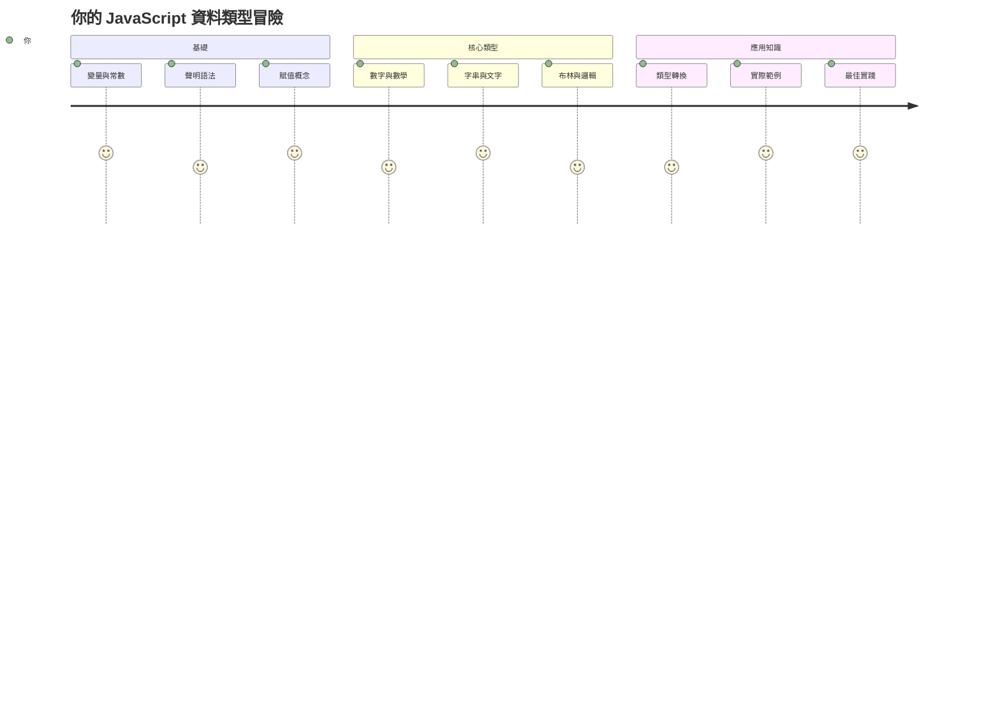
資料類型是你在每個編寫的 JavaScript 程式中都會遇到的基本概念之一。想像資料類型就像古代亞歷山卓圖書管理員使用的檔案系統——他們有特定的地方放詩歌、數學和歷史記錄的卷軸。JavaScript 用不同類別的資料來組織資訊，類似這種方法。

在本課中，我們將探討讓 JavaScript 運作的核心資料類型。你會學習如何處理數字、文字、真/假值，並了解選擇正確類型為何對你的程式至關重要。這些概念一開始可能看起來抽象，但透過練習，它們將變成你的第二天性。

理解資料類型會讓 JavaScript 其他部分變得更加清晰。正如建築師在建造大教堂之前需要了解不同的建材，這些基礎會支撐你日後所建構的所有東西。

## 課前測驗
[課前測驗](https://ff-quizzes.netlify.app/web/)

本課涵蓋 JavaScript 的基礎，這是為網頁提供互動性的語言。

> 你可以在 [Microsoft Learn](https://docs.microsoft.com/learn/modules/web-development-101-variables/?WT.mc_id=academic-77807-sagibbon) 上學習這課！

[](https://youtube.com/watch?v=JNIXfGiDWM8 "Variables in JavaScript")

[](https://youtube.com/watch?v=AWfA95eLdq8 "Data Types in JavaScript")

> 🎥 點擊上方圖片觀看有關變數與資料類型的影片

讓我們先從變數和用來裝載它們的資料類型開始！

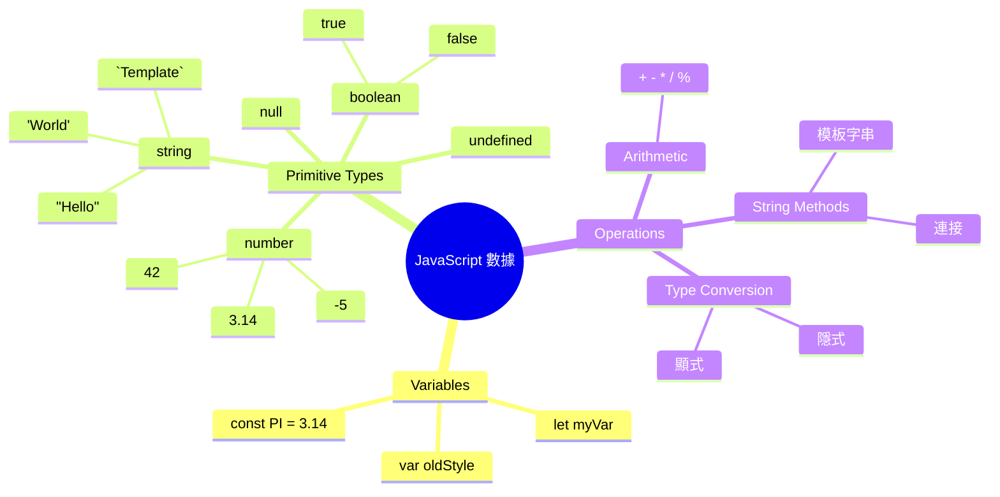
## 變數

變數是程式設計中的基本組成元素。就像中世紀煉金術士用來儲存不同物質的標記瓶子，變數讓你能儲存資訊，並給它一個描述性的名稱，方便日後引用。需要記錄某人的年齡嗎？就存入名為 `age` 的變數。想追蹤使用者名稱？就存在 `userName` 變數中。

我們會專注於 JavaScript 中建立變數的現代方法。你在這裡學到的技術代表了語言演進多年來程式社群所發展的最佳實踐。

建立並**宣告**變數的語法是 **[關鍵字] [名稱]**，由兩部分組成：

- **關鍵字**。使用 `let` 表示可變變數，或 `const` 表示不變值。
- **變數名稱**，這是你自行選擇的描述性名稱。

✅ `let` 是 ES6 引入的關鍵字，賦予你的變數所謂的 _區塊作用域_。建議你用 `let` 或 `const` 取代舊的 `var` 關鍵字。我們將在後續章節更深入講解區塊作用域。

### 任務 - 使用變數

1. **宣告變數**。我們先來建立第一個變數：

    ```javascript
    let myVariable;
    ```

   **這樣做的效果：**
   - 這告訴 JavaScript 建立一個名為 `myVariable` 的儲存空間
   - JavaScript 在記憶體中分配空間給此變數
   - 變數目前沒有值（undefined）

2. **賦予它一個值**。現在給變數放入一個值：

    ```javascript
    myVariable = 123;
    ```

   **指派的工作原理：**
   - `=` 運算子將值 123 指派給變數
   - 變數現在包含這個值，不再是 undefined
   - 你可以在程式中用 `myVariable` 參考這個值

   > 注意：本課中使用的 `=` 是「指派運算子」，用於設定變數值，並非等號。

3. **智慧地合併步驟**。實際上，我們可以將兩步合成一步：

    ```javascript
    let myVariable = 123;
    ```

    **此方式較有效率：**
    - 你同時宣告變數並賦值，一行搞定
    - 這是開發者的標準作法
    - 減少程式碼長度，同時保持清晰易懂

4. **改變值**。若想儲存不同的數字怎麼辦？

   ```javascript
   myVariable = 321;
   ```

   **了解重新指派：**
   - 變數現在包含 321，取代了之前的 123
   - 先前的值被覆蓋——變數一次只存一個值
   - 此可變性是用 `let` 宣告變數的主要特性

   ✅ 試試看！你可以直接在瀏覽器中寫 JavaScript。打開瀏覽器開發者工具，進入控制台（console），輸入 `let myVariable = 123`，按下 Enter，再輸入 `myVariable`。會發生什麼事情？後續課程還會學到更多這些概念。

### 🧠 **變數掌握檢測：熟悉度測驗**

**來測試你對變數的理解：**
- 你能解釋宣告和賦值變數的差別嗎？
- 如果你在宣告之前使用變數，會發生什麼？
- 什麼情況下會選擇用 `let` 而不是 `const` 宣告變數？

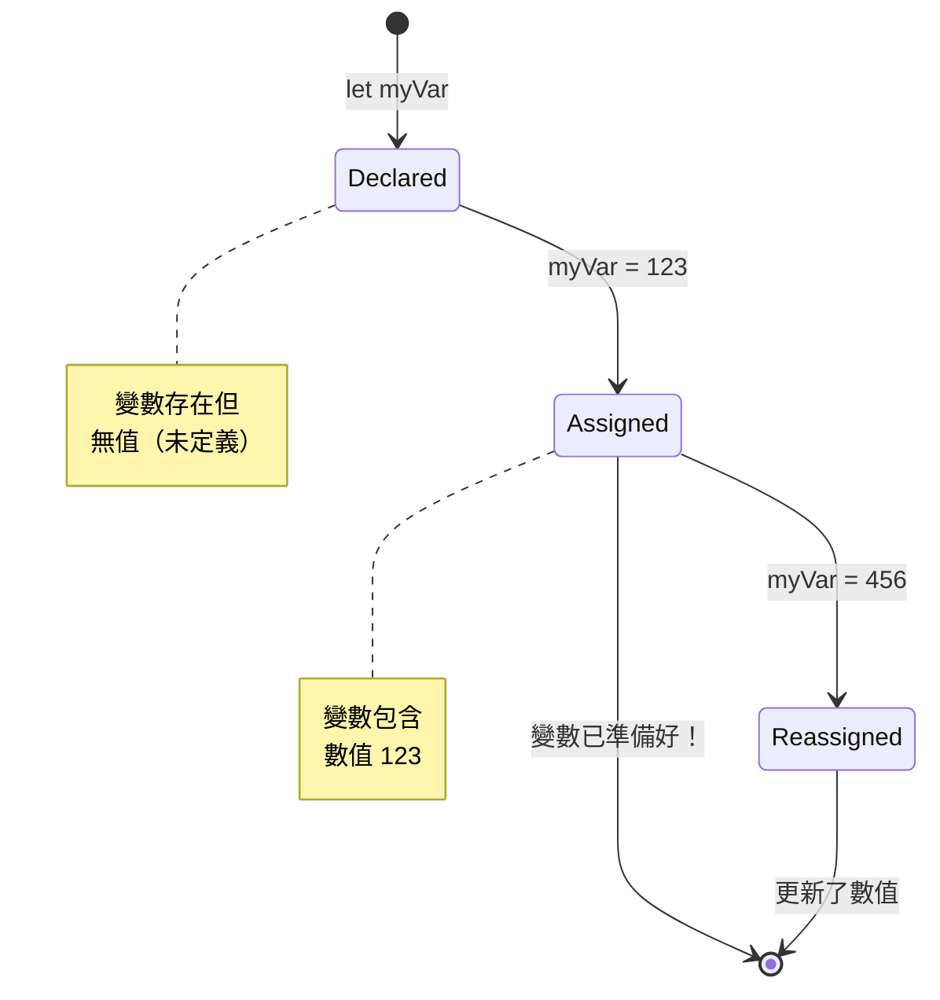
> **快速提示**：把變數想成有標籤的儲存盒。你先建立盒子（`let`），放入東西（`=`），然後可以在需要時替換內容！

## 常數

有時你需要儲存一個在程式執行期間永遠不會改變的資訊。想像常數就像歐幾里得在古希臘建立的數學原則——一旦被證明並記錄下來，它們就固定不變，供未來所有參考。

常數類似於變數，但有一個重要限制：一旦你給它們值，就不能改變。這種不可變性防止程式中關鍵值被意外修改。

宣告和初始化常數的概念與變數相同，除了使用 `const` 關鍵字。常數通常採用大寫字母命名。

```javascript
const MY_VARIABLE = 123;
```

**此程式碼做了什麼：**
- **建立** 名為 `MY_VARIABLE` 的常數，值為 123
- **使用** 大寫的命名慣例
- **防止** 未來更改該值

常數有兩個主要規則：

- **必須立即給它一個值** — 不允許空白常數！
- **永遠不能更改該值** — 嘗試改變會導致錯誤。來看範例：

   **簡單值** - 以下是不允許的：
   
      ```javascript
      const PI = 3;
      PI = 4; // 不允許
      ```

   **需要記住的是：**
   - **嘗試** 重新指派常數會造成錯誤
   - **保護** 重要值免於意外變更
   - **確保** 值在程式中保持一致
 
   **物件參考被保護** - 以下是不允許的：
   
      ```javascript
      const obj = { a: 3 };
      obj = { b: 5 } // 不允許
      ```

   **了解這些概念：**
   - **阻止** 用新物件取代整個物件
   - **保護** 原始物件的參考不變
   - **維持** 記憶體中物件的一致身份

    **物件內容不被保護** - 以下是允許的：
    
      ```javascript
      const obj = { a: 3 };
      obj.a = 5;  // 允許
      ```

      **解析發生了什麼：**
      - **修改** 物件內部屬性值
      - **保留** 相同的物件參考
      - **顯示** 物件內容可以更改，而參考保持不變

   > 注意，`const` 意味著參考受保護免於重新指派，但該值本身並不 _不可變_，特別是當它是物件等複雜結構時，內容可以更改。

## 資料類型

JavaScript 將資訊組織成不同類別，稱為資料類型。這個概念類似古代學者分類知識的方式——亞里斯多德區分不同的推理類型，知道邏輯原則不能同樣套用於詩歌、數學和自然哲學。

資料類型很重要，因為不同的運算需對應不同的資訊類型。就像你不能在人的名字上做數學運算或對數學公式做字母排序一樣，JavaScript 也需要適合的資料類型以避免錯誤並提升可靠度。

變數可以存儲許多不同類型的值，比如數字和文字。這些不同類型的值稱為**資料類型**。資料類型在軟體開發中非常重要，幫助開發者決定如何撰寫程式碼和軟體的運作方式。此外，有些資料類型具有獨特的功能，幫助轉換或提取額外資訊。

✅ 資料類型亦稱為 JavaScript 原始資料類型，因為它們是語言提供的最低階資料類型。共有 7 種原始類型：string、number、bigint、boolean、undefined、null 與 symbol。花點時間想像這些原始類型各代表什麼。`zebra` 是什麼？`0` 呢？`true` 又是什麼？

### 數字（Numbers）

數字是 JavaScript 最直觀的資料類型。無論你處理的是整數例如 42、小數例如 3.14，或是負數例如 -5，JavaScript 都能統一處理。

還記得前面存入的 123 嗎？那實際上是數字資料類型：

```javascript
let myVariable = 123;
```

**主要特徵：**
- JavaScript 自動辨識數字值
- 可用變數執行數學運算
- 不需明確宣告資料類型

變數可以存所有類型數字，包括小數和負數。數字也能跟數學運算子搭配使用，後面[數學運算子章節](../../../../2-js-basics/1-data-types)會介紹。

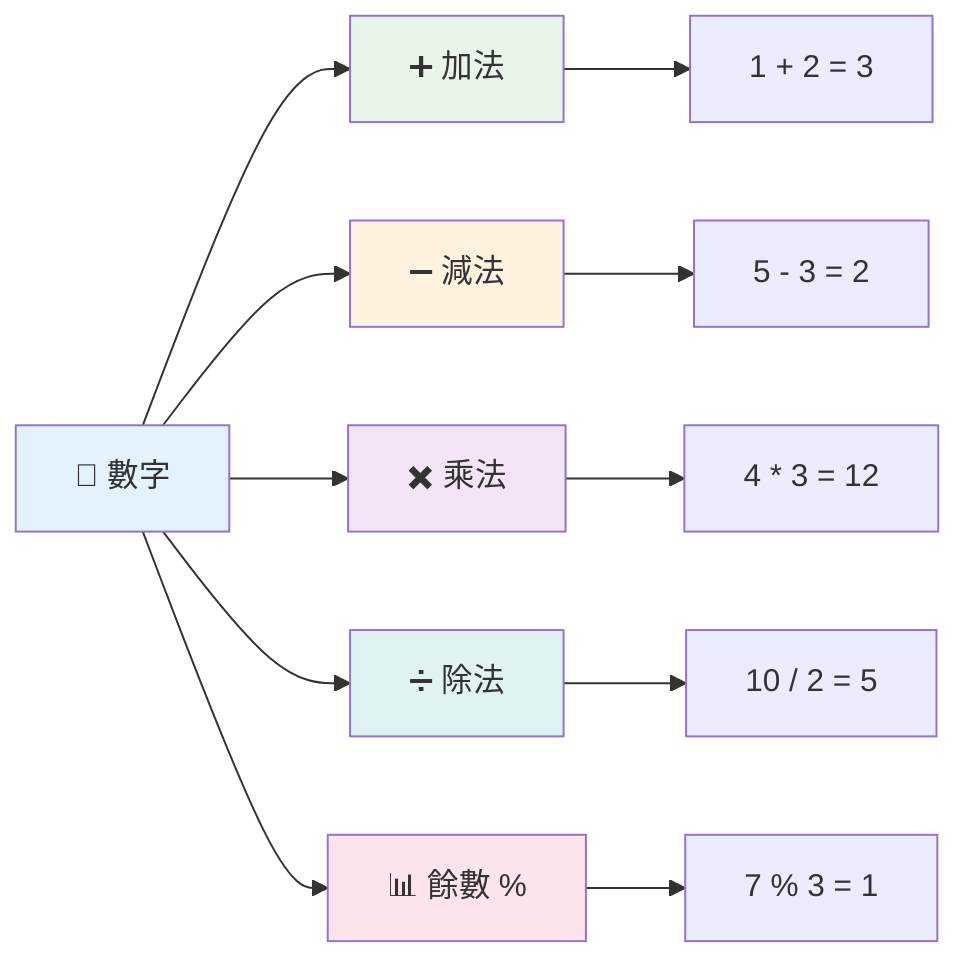
### 數學運算子

數學運算子讓你在 JavaScript 中執行算術計算。這些運算子遵循數學家數百年來的慣例——正如發展代數符號的作家如 Al-Khwarizmi 所使用的符號。

這些運算子跟傳統數學相同：加號作加法，減號作減法，依此類推。

以下是部分可用運算子：

| 符號   | 說明                                                                | 範例                             |
| ------ | ------------------------------------------------------------------- | ------------------------------- |
| `+`    | **加法**：計算兩數之和                                              | `1 + 2 // 預期結果是 3`         |
| `-`    | **減法**：計算兩數之差                                              | `1 - 2 // 預期結果是 -1`        |
| `*`    | **乘法**：計算兩數之積                                              | `1 * 2 // 預期結果是 2`         |
| `/`    | **除法**：計算兩數之商                                              | `1 / 2 // 預期結果是 0.5`       |
| `%`    | **餘數**：計算兩數相除的餘數                                        | `1 % 2 // 預期結果是 1`         |

✅ 試試看吧！在瀏覽器控制台中嘗試一個數學運算。結果會不會讓你驚訝？

### 🧮 **數學技能檢測：自信計算**

**測試你對算術的理解：**
- `/`（除法）和 `%`（餘數）有什麼差別？
- 你能預測 `10 % 3` 的值嗎？（提示：不是 3.33…）
- 程式中為什麼會需要餘數運算子？

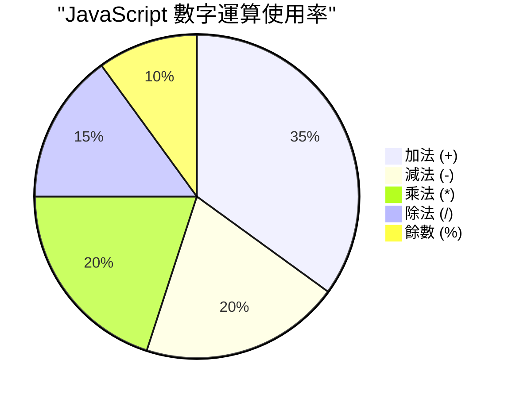
> **實務小知識**：餘數運算子（%）非常適合用來檢查數字是奇數或偶數、創造模式，或在陣列中循環使用！

### 字串（Strings）

在 JavaScript 中，文字資料用字串表示。字串一詞來自把多個字元串連起來的概念，就如同中世紀修道院的抄寫員將字母連成詞句一樣。

字串是網頁開發的基礎。網頁上所有顯示的文字——使用者名稱、按鈕標籤、錯誤訊息、內容——都是字串資料。理解字串對於建立功能性使用者介面至關重要。

字串是由位於單引號或雙引號之間的字元組成。

```javascript
'This is a string'
"This is also a string"
let myString = 'This is a string value stored in a variable';
```

**理解這些概念：**
- **使用** 單引號 `'` 或雙引號 `"` 來定義字串
- **儲存** 可包含字母、數字及符號的文字資料
- **賦值** 給變數以供後續使用
- **需要** 引號以區分文字與變數名稱

寫字串時記得使用引號，否則 JavaScript 會把它當成變數名。

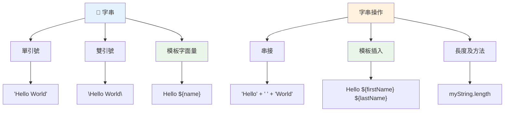
### 字串格式化

字串操作讓你可以結合文字元素、插入變數，並建立能依程式狀態動態變化的內容。此技巧使你能用程式方式組成文字。

常常你需要將多個字串串接起來——這稱為字串串接（concatenation）。
要**串接**兩個或多個字串，或將它們連接在一起，請使用 `+` 運算子。

```javascript
let myString1 = "Hello";
let myString2 = "World";

myString1 + myString2 + "!"; //哈囉世界！
myString1 + " " + myString2 + "!"; //哈囉 世界！
myString1 + ", " + myString2 + "!"; //哈囉，世界！
```

**逐步說明，發生了什麼：**
- **使用** `+` 運算子結合多個字串
- **直接** 將字串連接在一起，第一個範例中不加空格
- **加入** 字串間的空格字元 `" "` 以提升可讀性
- **插入** 標點符號如逗號，讓格式正確

✅ 為什麼在 JavaScript 中 `1 + 1 = 2`，但 `'1' + '1' = 11`？想想看。那 `'1' + 1` 又是什麼呢？

**模板字面量**是格式化字串的另一種方式，不過不是用引號，而是用反引號。任何非純文字的東西必須放入佔位符 `${}` 內，包括可能是字串的變數。

```javascript
let myString1 = "Hello";
let myString2 = "World";

`${myString1} ${myString2}!` //哈囉，世界！
`${myString1}, ${myString2}!` //哈囉，世界！
```

**來了解每個部分：**
- **使用** 反引號 `` ` `` 來建立模板字面量，而非一般引號
- **直接嵌入** 變數，使用 `${}` 佔位符語法
- **完全保留** 空格和格式
- **提供** 更乾淨的方式來建立含有變數的複雜字串

你可以用任一方法達到格式需求，但模板字面量會尊重所有空格和斷行。

✅ 你何時會使用模板字面量而非普通字串？

### 🔤 **字串掌握檢測：文字操作信心**

**評估你的字串技巧：**
- 你能解釋為什麼 `'1' + '1'` 是 `'11'` 而非 `2` 嗎？
- 哪種字串方法你覺得較易閱讀：串接還是模板字面量？
- 如果忘記在字串周圍加引號會怎樣？

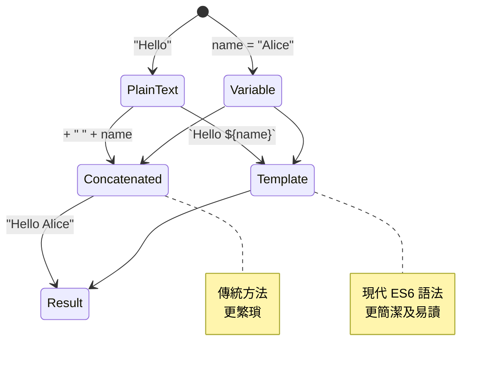
> **專家小提示**：模板字面量通常更適合複雜的字串構建，因為它們更易讀，且能漂亮地處理多行字串！

### 布林值 (Booleans)

布林值代表最簡單的資料型態：它只能有兩個值之一——`true` 或 `false`。這個二元邏輯系統可追溯到十九世紀數學家 George Boole 的布林代數。

雖然簡單，布林值對程式邏輯非常重要。它們讓你的程式根據條件做決策——例如使用者是否已登入，按鈕是否被點擊，或者是否符合某些條件。

布林值只能是兩種：`true` 或 `false`。布林值有助於決定在特定條件下哪些程式碼應該執行。在多數情況下，[運算子](../../../../2-js-basics/1-data-types)會協助設定布林值，你也會經常看到使用運算子來初始化或更新變數值。

```javascript
let myTrueBool = true;
let myFalseBool = false;
```

**以上範例中，我們：**
- **建立** 一個儲存布林值 `true` 的變數
- **展示** 如何儲存布林值 `false`
- **使用** 精確的關鍵字 `true` 和 `false` (不需要加引號)
- **準備** 這些變數在條件語句中使用

✅ 變數若評估結果為布林 `true`，即可視為「truthy」。有趣的是，在 JavaScript 中，[所有值除了被定義為 falsy 外都是 truthy](https://developer.mozilla.org/docs/Glossary/Truthy)。

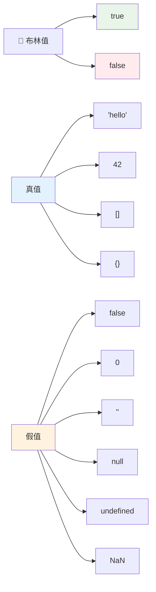
### 🎯 **布林邏輯檢測：決策技能**

**測試你的布林理解：**
- 你為什麼認為 JavaScript 除了 `true` 和 `false`，還有「truthy」和「falsy」值？
- 你能預測以下哪項是 falsy 嗎：`0`、`"0"`、`[]`、`"false"`？
- 布林值在控制程式流程方面有什麼用處？

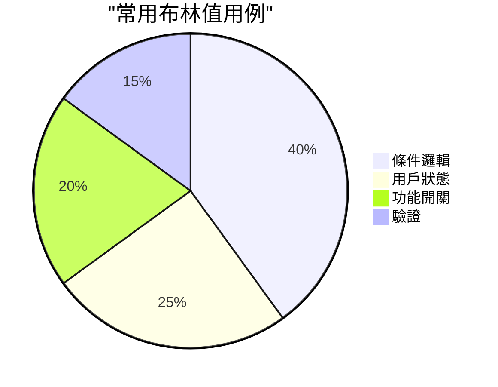
> **記住**：在 JavaScript 中，只有6個值是 falsy：`false`、`0`、`""`、`null`、`undefined` 和 `NaN`。其餘都是 truthy！

---

## 📊 **你的資料型別工具包總結**

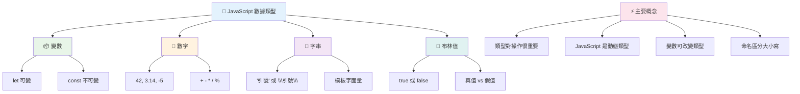
## GitHub Copilot Agent 挑戰 🚀

使用 Agent 模式完成以下挑戰：

**說明：** 建立一個個人資訊管理器，展示你課程中學到的所有 JavaScript 資料型別，並處理實際生活中的資料場景。

**命題：** 建立一個 JavaScript 程式，創建一個包含以下內容的使用者個人資料物件：姓名 (字串)、年齡 (數字)、是否為學生狀態 (布林值)、最愛顏色陣列，以及含有街道、城市和郵遞區號屬性的地址物件。包括顯示個人資料與更新各欄位的函式。務必展示字串串接、模板字面量、年齡的算術運算、和學生狀態的布林邏輯。

瞭解更多 [agent 模式](https://code.visualstudio.com/blogs/2025/02/24/introducing-copilot-agent-mode)。

## 🚀 挑戰

JavaScript 有些行為容易讓開發者措手不及。這是一個經典範例：在瀏覽器主控台輸入 `let age = 1; let Age = 2; age == Age`，並觀察結果。它回傳 `false` — 你能判斷原因嗎？

這只是眾多 JavaScript 行為之一。熟悉這些特性將幫助你寫出更可靠的程式，並更有效地除錯。

## 課後測驗
[課後測驗](https://ff-quizzes.netlify.app)

## 複習與自學

看看[這份 JavaScript 練習清單](https://css-tricks.com/snippets/javascript/)，試試其中一個。你學到了什麼？

## 作業

[資料型別練習](assignment.md)

## 🚀 你的 JavaScript 資料型別精通時間表

### ⚡ **未來 5 分鐘可做到的事**
- [ ] 開啟瀏覽器主控台並建立3個不同資料型別的變數
- [ ] 嘗試挑戰：`let age = 1; let Age = 2; age == Age`，想清楚為什麼結果是 false
- [ ] 練習使用你的名字和喜歡的數字進行字串串接
- [ ] 測試將數字加到字串上會發生什麼

### 🎯 **本小時可完成的目標**
- [ ] 完成課後測驗並回顧任何困惑的概念
- [ ] 建立一個簡易計算機，能加減乘除兩個數字
- [ ] 使用模板字面量建立簡單的名字格式化程式
- [ ] 探索 `==` 與 `===` 比較運算子的差異
- [ ] 練習不同資料型別間的轉換

### 📅 **你這週的 JavaScript 基礎內容**
- [ ] 有信心且有創意地完成作業
- [ ] 建立一個包含所有學習過資料型別的個人資料物件
- [ ] 練習 [CSS-Tricks 的 JavaScript 練習](https://css-tricks.com/snippets/javascript/)
- [ ] 使用布林邏輯建立簡單表單驗證器
- [ ] 試玩陣列和物件資料型別（後續課程預告）
- [ ] 加入 JavaScript 社群，並詢問關於資料型別的問題

### 🌟 **你的月度轉變計劃**
- [ ] 將資料型別知識整合至較大型的程式專案
- [ ] 瞭解何時以及為何在實際應用中使用各種資料型別
- [ ] 幫助其他初學者理解 JavaScript 基礎
- [ ] 建置管理不同用戶資料類型的小型應用
- [ ] 探索進階資料型別概念，如型態強制轉換與嚴格相等
- [ ] 為開源 JavaScript 專案貢獻文件改進

### 🧠 **最終資料型別精通檢測**

**慶祝你的 JavaScript 基礎：**
- 哪種資料型別的行為最讓你驚訝？
- 你解釋變數與常數的能力有多自在？
- 關於 JavaScript 的型別系統，你發現最有趣的是什麼？
- 你想像用這些基礎可以建立什麼現實世界的應用？

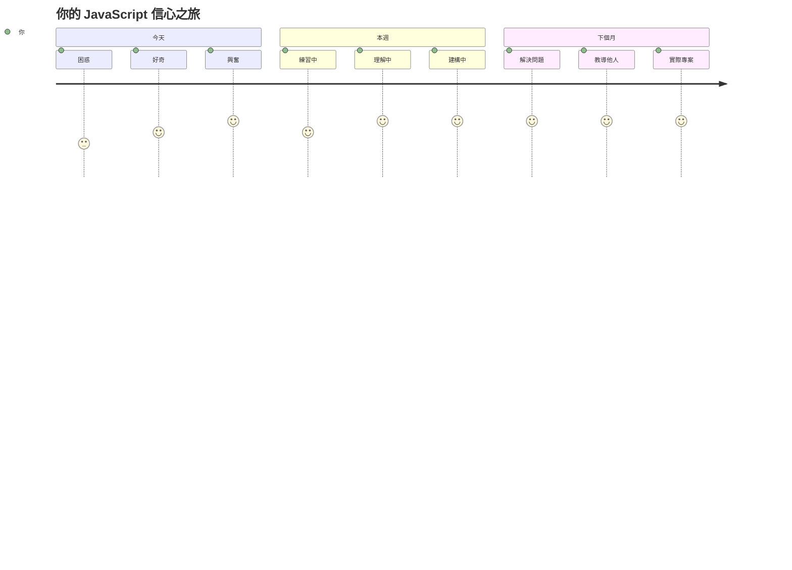
> 💡 **你已建立基礎！** 理解資料型別就像學習字母表，為寫故事打下基礎。你未來寫的每個 JavaScript 程式都會用到這些基本概念。你現在擁有了創建互動網站、動態應用程式，以及以程式碼解決現實問題的基石。歡迎來到 JavaScript 的奇妙世界！ 🎉

---

<!-- CO-OP TRANSLATOR DISCLAIMER START -->
**免責聲明**：
本文件係使用人工智能翻譯服務 [Co-op Translator](https://github.com/Azure/co-op-translator) 所翻譯。雖然我們致力於準確性，但請注意，自動翻譯可能包含錯誤或不準確之處。原始文件的母語版本應視為權威來源。對於重要資訊，建議使用專業人工翻譯。我們不對因使用此翻譯而產生的任何誤解或誤釋承擔責任。
<!-- CO-OP TRANSLATOR DISCLAIMER END -->