# JavaScript 基礎：方法與函數

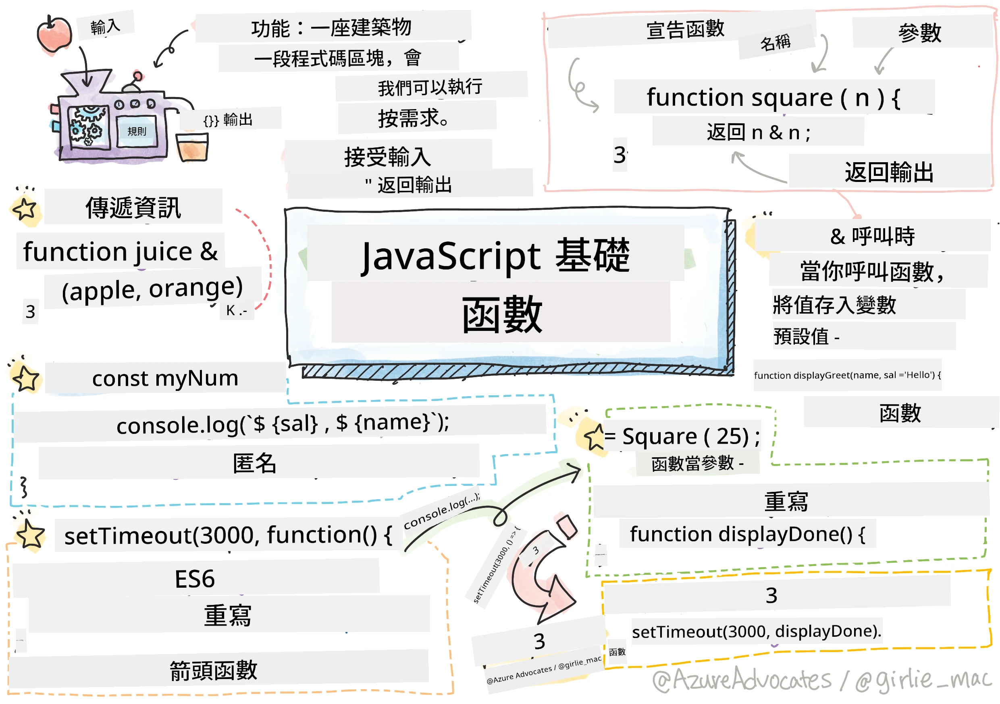
> 繪圖筆記由 [Tomomi Imura](https://twitter.com/girlie_mac) 製作

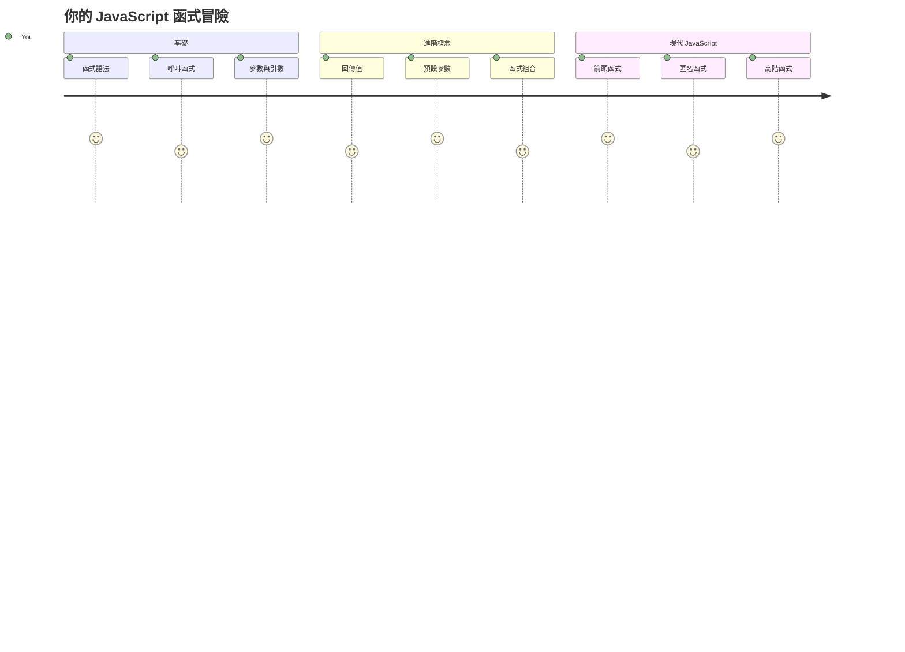
## 課前小測驗
[課前小測驗](https://ff-quizzes.netlify.app)

反覆撰寫相同程式碼是程式設計中最常見的挫折之一。函數解決此問題，讓你可以將程式碼封裝成可重複使用的區塊。你可以將函數視為讓亨利福特的組裝生產線變革性的標準化零件——一旦你建立了可靠的元件，就可以在需要的地方使用它，而無需重新從零開始構建。

函數允許你將程式碼片段打包，並在程式中多次重用。與其到處複製貼上相同邏輯，不如建立函數並在需要時呼叫。這種方法能保持程式碼整潔，也更容易做出更新。

在本課程中，你將學習如何創建自己的函數、將資訊傳遞給函數並取得有用的回傳結果。你將發現函數和方法的差異，學習現代語法用法，並了解函數如何與其他函數搭配使用。我們將一步步建立這些概念。

[](https://youtube.com/watch?v=XgKsD6Zwvlc "Methods and Functions")

> 🎥 點擊上方圖片可以觀看關於方法與函數的教學影片。

> 你也可以在 [Microsoft Learn](https://docs.microsoft.com/learn/modules/web-development-101-functions/?WT.mc_id=academic-77807-sagibbon) 上參加這堂課！

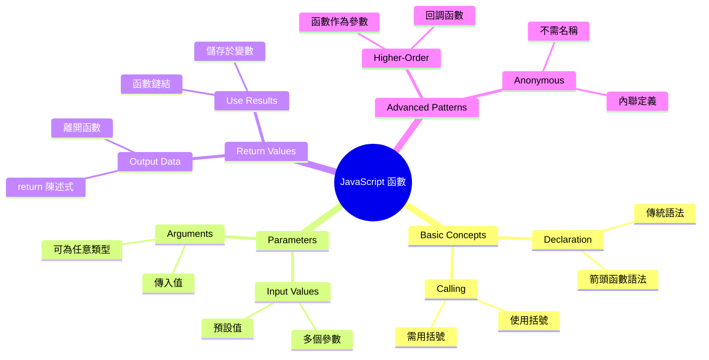
## 函數

函數是一段自包含的程式碼區塊，用來完成特定任務。它封裝你需要執行的邏輯，隨時可以執行。

與其在程式中重複書寫相同的程式碼，不如將它封裝成函數，並在需要時呼叫。此作法讓你的程式碼保持乾淨，也能更輕鬆維護。試想，如果你需要改變散佈於 20 個不同位置的邏輯，會有多困難。

為函數取有描述性的名稱非常重要。命名良好的函數能清楚傳達其目的——看到 `cancelTimer()` 就馬上知道它的功能，就像標示清楚的按鈕可以告訴你點擊後會發生什麼一樣。

## 建立與呼叫函數

讓我們看看如何建立函數。語法遵循固定的模式：

```javascript
function nameOfFunction() { // 函數定義
 // 函數定義/函數體
}
```

拆解說明：
- `function` 關鍵字告訴 JavaScript「嘿，我正在創建一個函數！」
- `nameOfFunction` 是你為函數取的描述性名稱
- 括號 `()` 可放入參數（稍後會講）
- 花括號 `{}` 裡包含你在呼叫函數時要執行的程式碼

讓我們來寫個簡單的問候函數，看看範例：

```javascript
function displayGreeting() {
  console.log('Hello, world!');
}
```

此函數將在控制台列印 "Hello, world!"。定義完成後，你可以重複多次呼叫它。

執行（或「呼叫」）函數的方法是寫函數名稱，加上括號。JavaScript 允許你在呼叫前或後定義函數——它的執行順序會自動處理。

```javascript
// 呼叫我們的函數
displayGreeting();
```

執行此行程式碼，即會執行 `displayGreeting` 函數內所有程式碼，並在瀏覽器控制台顯示 "Hello, world!"。你可以多次呼叫此函數。

### 🧠 **函數基礎檢測：建立你的第一個函數**

**讓我們檢查你對基礎函數的理解：**
- 你能解釋為何在函數定義要使用花括號 `{}` 嗎？
- 如果寫 `displayGreeting` 而不加括號會怎樣？
- 為什麼有時候要多次呼叫同一個函數？

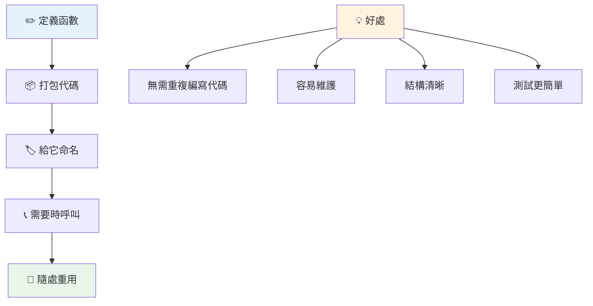
> **注意：** 在這些課程中，你一直在使用 **方法**。`console.log()` 是一個方法——基本上是屬於 `console` 物件的函數。關鍵差異在於方法綁定於物件，而函數是獨立存在。許多開發者在日常對話中常互用這兩個詞。

### 函數最佳實踐

以下是寫出優秀函數的小技巧：

- 給函數取清晰且描述性名稱——未來的自己會感謝你！
- 使用 **camelCase** 命名多字函數（例如 `calculateTotal`，而非 `calculate_total`）
- 保持每個函數專注完成一件事

## 傳遞資訊給函數

我們剛剛的 `displayGreeting` 函數很有限——它只能對所有人顯示 "Hello, world!"。參數使函數變得更靈活有用。

**參數** 就像佔位符，每次使用函數時你可填入不同數值。如此一來，同一函數可針對不同資訊運作。

當你定義函數時，將參數列在括號中，多個參數用逗號分隔：

```javascript
function name(param, param2, param3) {

}
```

每個參數就像佔位符，當呼叫函數時會提供實際值，填入這些位置。

讓我們改寫問候函數，接受一個名字參數：

```javascript
function displayGreeting(name) {
  const message = `Hello, ${name}!`;
  console.log(message);
}
```

注意我們使用反引號（`` ` ``）和 `${}` 直接將 `name` 插入訊息中——這種方式叫做模板字串，是建立帶有變數字串的好工具。

呼叫函數時，我們可以傳入任何名字：

```javascript
displayGreeting('Christopher');
// 執行時顯示「Hello, Christopher!」
```

JavaScript 將字串 `'Christopher'` 指派給 `name` 參數，並建立個人化訊息 "Hello, Christopher!"

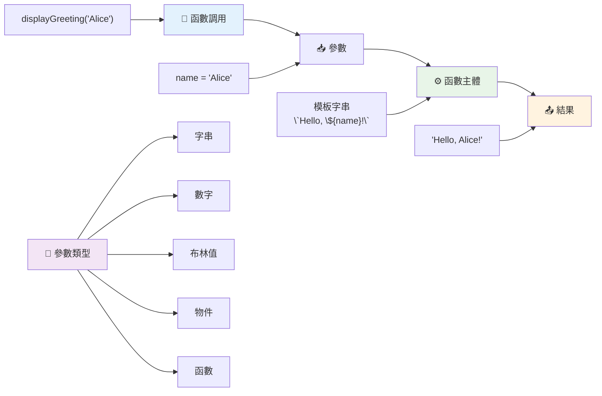
## 預設值

如果我們想讓參數可選怎麼辦？這時預設值非常有用！

假設我們想讓使用者能自訂問候語，但若沒指定，就使用 "Hello" 這個備用詞彙。你可用等號設定預設值，就像設定變數一樣：

```javascript
function displayGreeting(name, salutation='Hello') {
  console.log(`${salutation}, ${name}`);
}
```

這裡 `name` 仍是必填，`salutation` 如果沒給值則默認為 `'Hello'`。

現在我們可用兩種方式呼叫這個函數：

```javascript
displayGreeting('Christopher');
// 顯示「Hello, Christopher」

displayGreeting('Christopher', 'Hi');
// 顯示「Hi, Christopher」
```

第一次呼叫未指定問候詞，JavaScript 使用預設的 "Hello"。第二次呼叫提供自訂的 "Hi"。這種彈性使函數適應不同場景。

### 🎛️ **參數掌握檢測：讓函數靈活運用**

**測試你對參數的理解：**
- 參數與引數有什麼差異？
- 為什麼預設值在實務編程中很有用？
- 如果傳入比參數多的引數，會發生什麼？

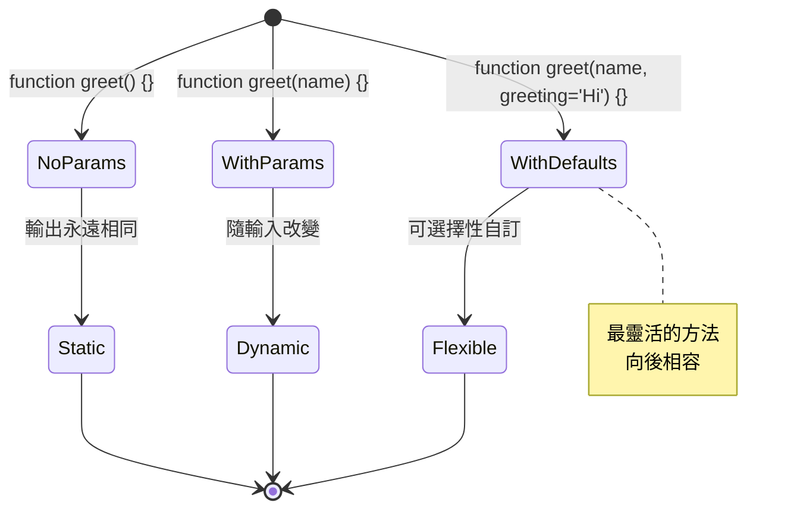
> **專家提示**：預設參數讓函數更友善。使用者可以用合理預設值快速上手，仍可依需求自訂！

## 回傳值

到目前為止，我們的函數只在控制台輸出訊息，但如果你想讓函數計算結果並回傳呢？

這就是**回傳值**的用處。函數不只是輸出，也能把值回傳給呼叫它的程式，你可以存進變數或在其他地方使用。

回傳值用 `return` 關鍵字，後面接你想回傳的內容：

```javascript
return myVariable;
```

重要一點：當函數執行到 `return`，會立刻停止並把該值送回呼叫者。

改寫問候函數，讓它回傳訊息而非直接列印：

```javascript
function createGreetingMessage(name) {
  const message = `Hello, ${name}`;
  return message;
}
```

現在函數不列印，只建立訊息並回傳。

使用回傳值，就像其他值一樣存入變數：

```javascript
const greetingMessage = createGreetingMessage('Christopher');
```

`greetingMessage` 現在包含 "Hello, Christopher"，你可用它顯示在網頁、寄信，或者傳給其他函數。

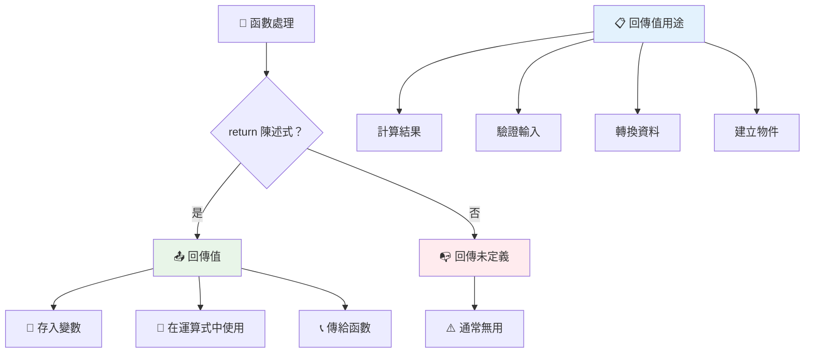
### 🔄 **回傳值檢測：取得結果**

**評估你對回傳值的理解：**
- 函數執行到 `return` 後，後面的程式會怎樣？
- 為什麼回傳值比只列印控制台更好？
- 函數可以回傳不同型態的值（字串、數字、布林）嗎？

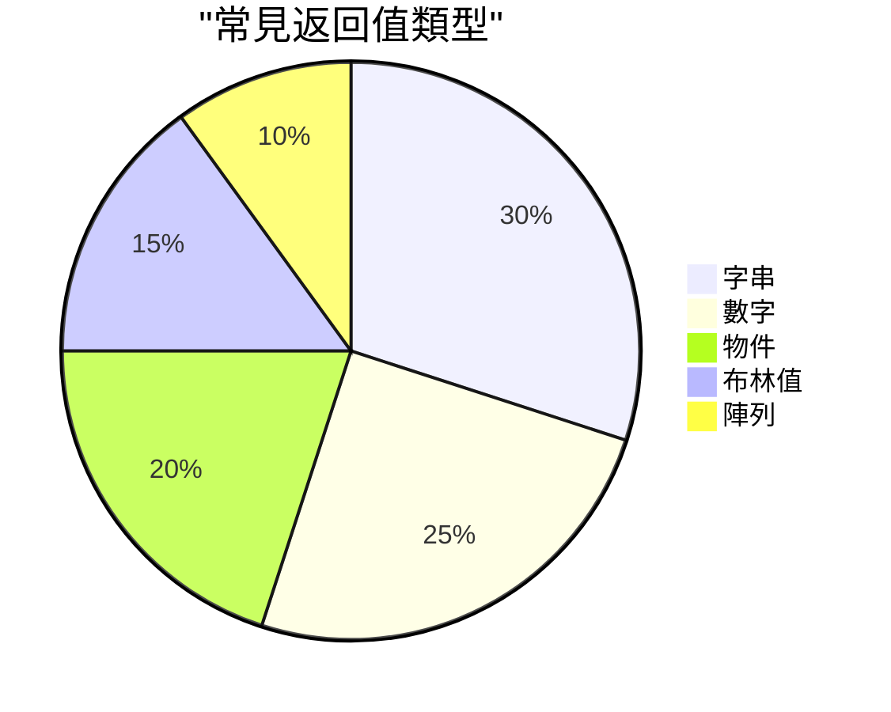
> **關鍵洞察**：回傳值使函數更靈活，因為呼叫者決定如何使用結果。這讓程式更模組化、重複使用更方便！

## 函數作為參數傳入函數

函數可以當作參數傳給其他函數。雖然這聽起來複雜，但這是一個強大的特性，可實現靈活程式設計模式。

這種用法非常常見，當你想說「當某事發生，做[另一件事]」時。譬如「計時結束時，執行這段程式碼」或「使用者點按鈕時，呼叫此函數」。

看看 `setTimeout`，它是內建函數，會等待一段時間後執行程式碼。我們需要告訴它要執行什麼程式碼——這正是傳入函數的好例子！

試試看這段程式碼——3 秒後會看到訊息：

```javascript
function displayDone() {
  console.log('3 seconds has elapsed');
}
// 計時器數值以毫秒為單位
setTimeout(displayDone, 3000);
```

注意我們傳入 `displayDone`（沒有括號）給 `setTimeout`。我們不是自己呼叫函數，而是把函數交給 `setTimeout`，告訴它：「3 秒後呼叫它。」

### 匿名函數

有時你只需要一個函數做一件事，不想特別命名。想想看——如果只用一次，為什麼要多個名稱搞亂程式碼？

JavaScript 允許你創建 **匿名函數**——沒有名字的函數，直接寫在需要它的地方。

下面是用匿名函數改寫計時例子：

```javascript
setTimeout(function() {
  console.log('3 seconds has elapsed');
}, 3000);
```

效果相同，但函數直接定義在 `setTimeout` 裡，省掉了另写一個函數宣告。

### 箭頭函數

現代 JavaScript 有更精簡寫函數的方法，稱為 **箭頭函數**。符號是 `=>`（像個箭頭，你懂的），非常受開發者歡迎。

箭頭函數省略了 `function` 關鍵字，寫起來更簡潔。

這是我們計時例子改用箭頭函數寫法：

```javascript
setTimeout(() => {
  console.log('3 seconds has elapsed');
}, 3000);
```

`()` 是放參數的地方（這例子是空的），接著是箭頭 `=>`，最後是用花括號包住的函數內容。兩者功能相同，但語法更簡潔。

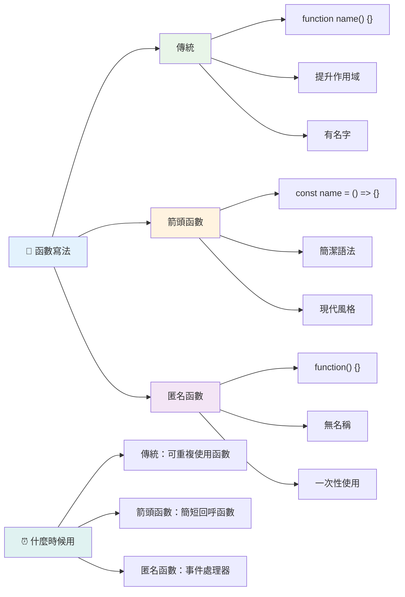
### 何時使用哪種寫法

什麼時候該用哪種方法呢？實用指南是：若需多次使用函數，給它命名並獨立定義；若只用一次，可考慮匿名函數。箭頭函數和傳統語法都是可行選擇，但箭頭函數已成現代 JavaScript 代碼庫的主流。

### 🎨 **函數風格掌握檢測：挑選適合語法**

**測試你的語法理解：**
- 何時你會偏好箭頭函數而非傳統函數語法？
- 匿名函數的主要優勢是什麼？
- 你能想出命名函數比匿名函數更好的情境嗎？

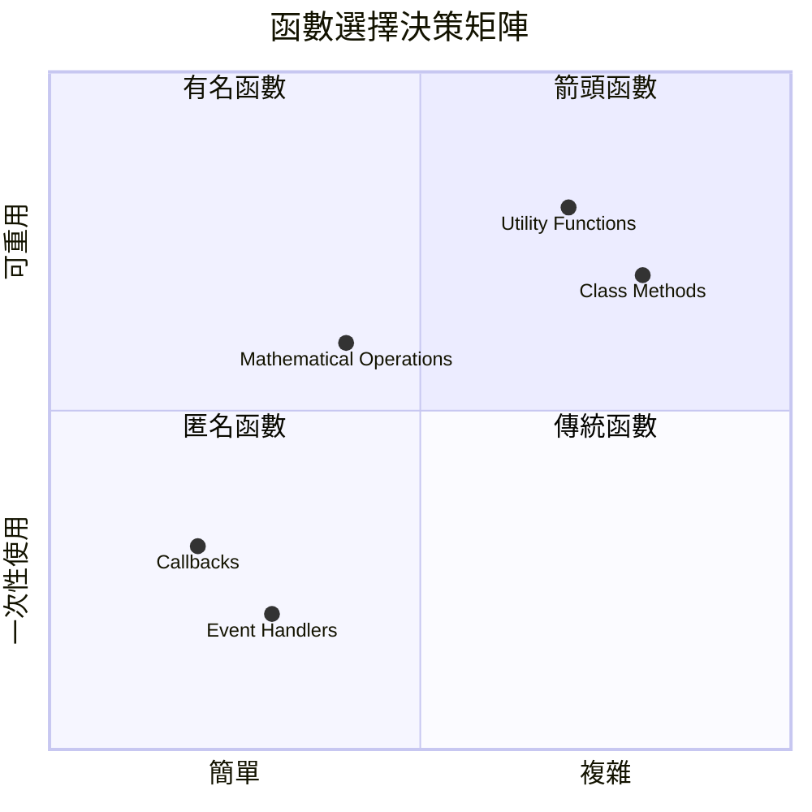
> **現代趨勢**：箭頭函數因為語法簡潔，逐漸成為許多開發者的首選，但傳統函數依然有其存在價值！

---


## 🚀 挑戰

你能用一句話說明函數與方法的差異嗎？試試看！

## GitHub Copilot Agent 挑戰 🚀

使用 Agent 模式完成以下挑戰：

**說明：** 建立一個數學函數的工具庫，示範本課涵蓋的不同函數概念，包括參數、預設值、回傳值與箭頭函數。

**提示：** 建立一個名為 `mathUtils.js` 的 JavaScript 檔案，包含以下函數：
1. 一個函數 `add`，接收兩個參數並回傳它們的和
2. 一個帶有預設參數值的 `multiply` 函數（第二個參數預設為 1）
3. 一個箭頭函數 `square`，接收一個數字並回傳其平方
4. 一個函數 `calculate`，接收另一個函數參數與兩個數字，將函數套用到兩數字上
5. 展示呼叫每個函數的適當測試案例

在此處了解更多有關 [agent 模式](https://code.visualstudio.com/blogs/2025/02/24/introducing-copilot-agent-mode) 。

## 課後小測驗
[課後小測驗](https://ff-quizzes.netlify.app)

## 複習與自學

值得[多讀一些關於箭頭函數](https://developer.mozilla.org/docs/Web/JavaScript/Reference/Functions/Arrow_functions)，因為它們越來越多於程式碼中使用。練習編寫一個函數，然後用這語法重寫。

## 作業

[Fun with Functions](assignment.md)

---

## 🧰 **你的 JavaScript 函數工具箱總結**

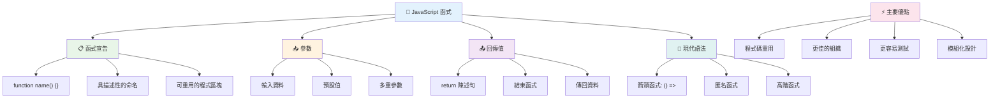
---

## 🚀 你的 JavaScript 函數掌握時間軸

### ⚡ **接下來 5 分鐘你可以做到**
- [ ] 寫一個簡單函數回傳你最喜歡的數字
- [ ] 建立一個有兩個參數回傳相加結果的函數
- [ ] 嘗試將傳統函數轉換為箭頭函數語法  
- [ ] 練習挑戰：解釋函數與方法的不同  

### 🎯 **你今小時可以完成的事**  
- [ ] 完成課後小測驗並複習任何令人困惑的概念  
- [ ] 建立 GitHub Copilot 挑戰中的數學公用程式庫  
- [ ] 創建一個使用另一個函數作為參數的函數  
- [ ] 練習撰寫帶有預設參數的函數  
- [ ] 嘗試函數回傳值中使用模板字串  

### 📅 **你為期一週的函數精通計劃**  
- [ ] 以創意完成「Fun with Functions」作業  
- [ ] 將一些你已有的重複程式碼重構成可重用函數  
- [ ] 僅使用函數(不使用全局變數)建置一個簡易計算器  
- [ ] 練習使用箭頭函數搭配陣列方法如 `map()` 和 `filter()`  
- [ ] 建立一組用於常見任務的工具函數集合  
- [ ] 研習高階函數與函數式程式設計觀念  

### 🌟 **你為期一個月的轉變規劃**  
- [ ] 精通進階函數概念如閉包與作用域  
- [ ] 建立一個嚴重使用函數組合的專案  
- [ ] 透過改進函數文件來貢獻開源  
- [ ] 教導他人函數與不同語法風格  
- [ ] 探索 JavaScript 的函數式程式設計範式  
- [ ] 建立一個個人可重用函數庫以用於未來專案  

### 🏆 **最終函數冠軍檢閱**  

**慶祝你對函數的精通：**  
- 到目前為止，哪個函數是你創建得最有用的？  
- 學習函數如何改變你對程式碼組織的想法？  
- 你偏好哪種函數語法？為什麼？  
- 你會寫函數解決什麼真實世界的問題？  

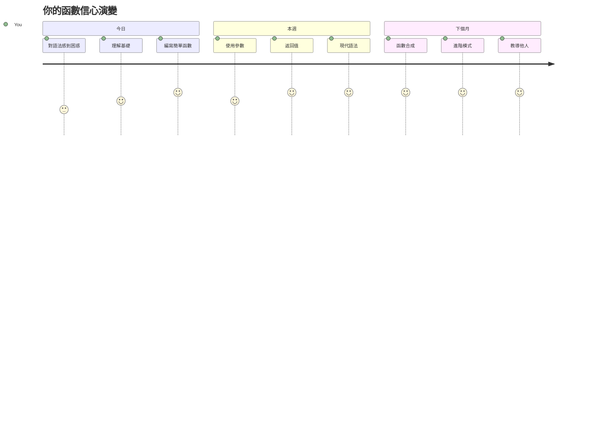
> 🎉 **你已經精通了程式設計中最強大的概念之一！** 函數是大型程式的基礎組件。你將會建立的每個應用程式都會使用函數來組織、重用和架構程式碼。你現在了解如何將邏輯包裝成可重用的組件，讓你成為更有效率和更具生產力的程式設計師。歡迎來到模組化程式設計的世界！ 🚀

---

<!-- CO-OP TRANSLATOR DISCLAIMER START -->
**免責聲明**：
本文件由 AI 翻譯服務 [Co-op Translator](https://github.com/Azure/co-op-translator) 進行翻譯。雖然我們致力於確保翻譯的準確性，但請注意自動翻譯可能存在錯誤或不準確之處。原始文件的母語版本應被視為權威來源。對於重要資訊，建議採用專業人工翻譯。我們對因使用本翻譯而產生的任何誤解或誤譯概不負責。
<!-- CO-OP TRANSLATOR DISCLAIMER END -->