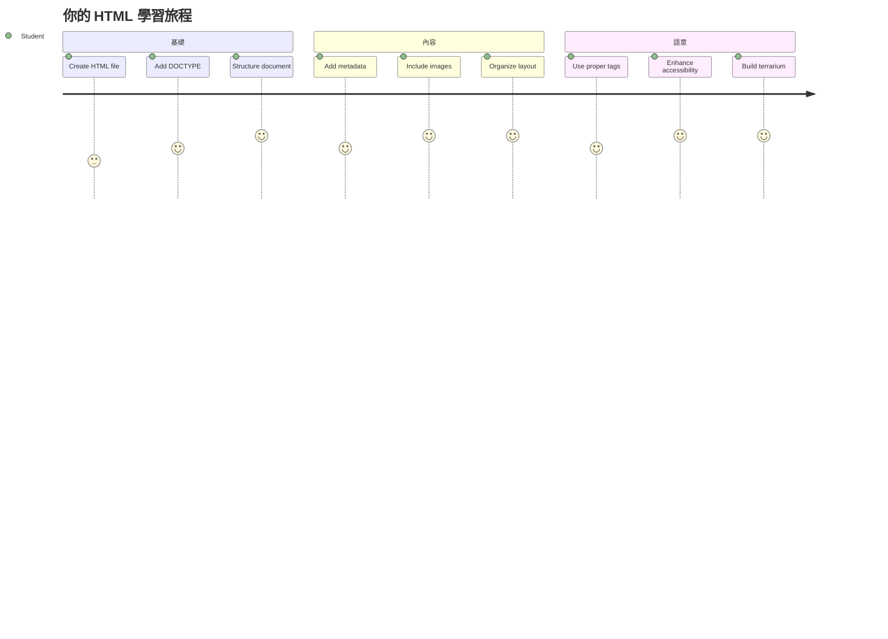
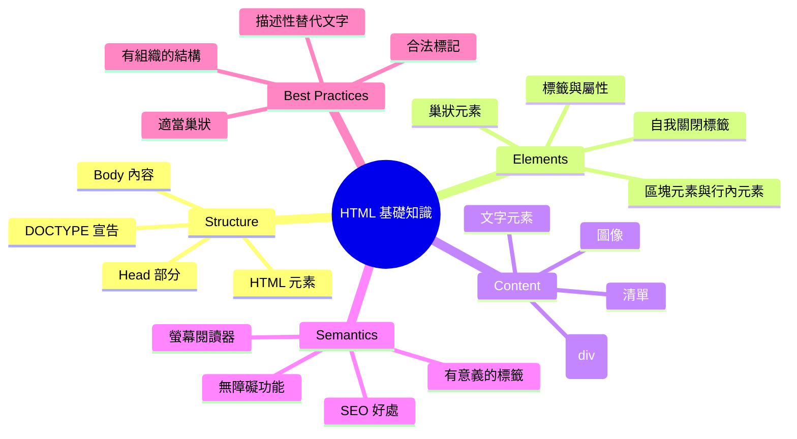
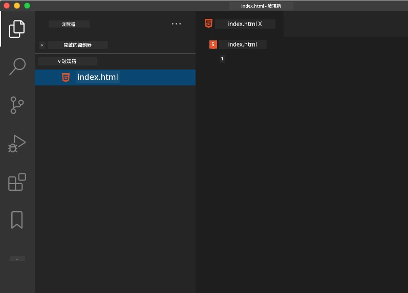
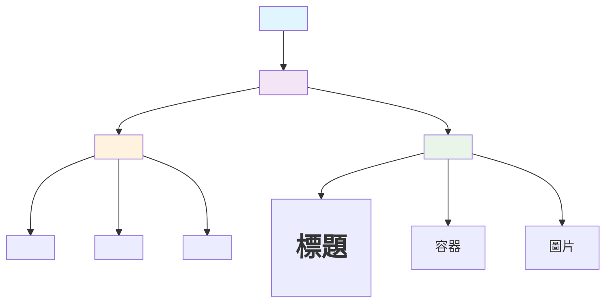
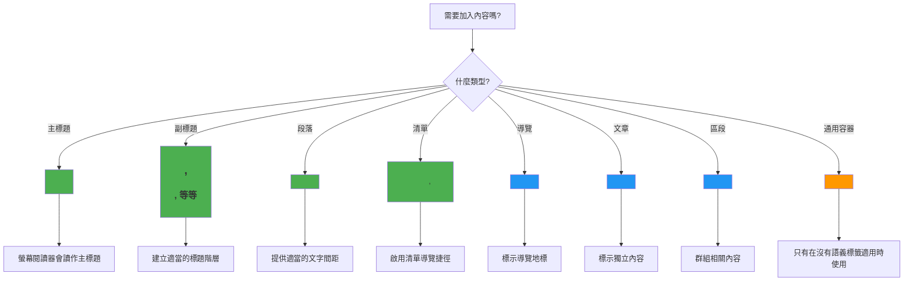
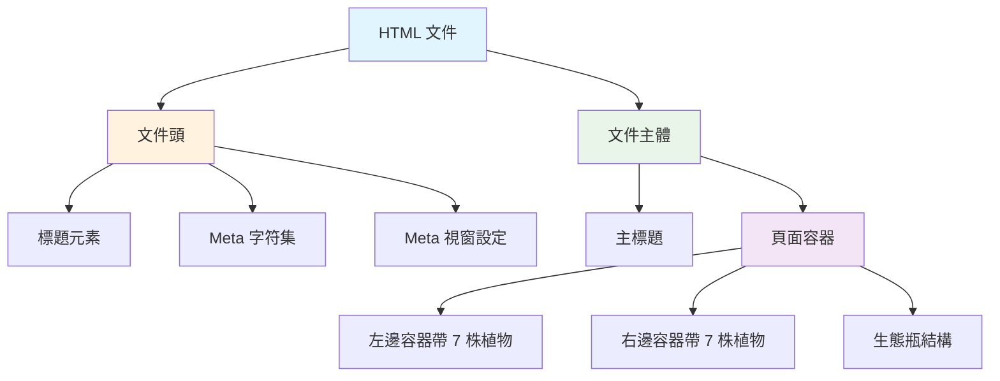
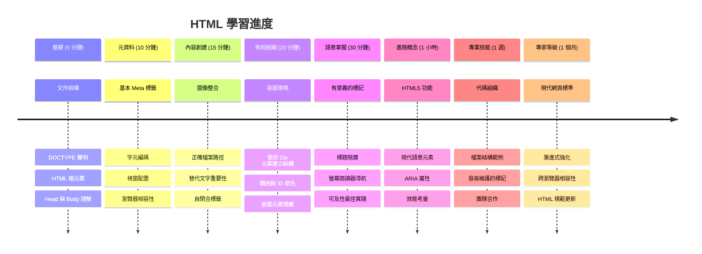

# Terrarium Project Part 1: 介紹 HTML



> Sketchnote 由 [Tomomi Imura](https://twitter.com/girlie_mac) 製作

HTML，或稱超文字標記語言，是你曾造訪過的每個網站的基礎。將 HTML 想像成提供網頁結構的骨架——它定義內容的位置、組織方式以及每個部分的意義。雖然稍後 CSS 會為你的 HTML 加上顏色與版面配置，JavaScript 則會讓它具有互動性，但 HTML 提供了讓一切成為可能的必要結構。

在這堂課中，你將為虛擬的玻璃花房介面建立 HTML 結構。這個實作專案會教你基本的 HTML 概念，同時打造出視覺吸引人的內容。你將學到如何使用語義化元素整理內容、操作圖片，並為互動式網頁應用程式奠定基礎。

完成本課程後，你會有一個能在有組織的欄位中顯示植物圖片的 HTML 頁面，並準備好在下一課進行樣式設計。別擔心它一開始看起來很簡單——這正是 HTML 在 CSS 加入視覺裝飾前該有的樣子。


## 課前小測驗

[課前小測驗](https://ff-quizzes.netlify.app/web/quiz/15)

> 📺 **觀看學習**：看看這支有用的影片概覽
> 
> [](https://www.youtube.com/watch?v=1TvxJKBzhyQ)

## 設定你的專案

在深入 HTML 程式碼之前，讓我們先為你的玻璃花房專案建立一個適當的工作空間。從一開始就建立有條理的檔案結構，是個非常重要的習慣，對你的整個網頁開發旅程都會有幫助。

### 任務：建立你的專案結構

你將為玻璃花房專案建立一個專用資料夾，並加入你的第一個 HTML 檔案。以下是兩種可採用的方法：

**方案一：使用 Visual Studio Code**
1. 開啟 Visual Studio Code
2. 點擊「檔案」→「開啟資料夾」，或使用 `Ctrl+K, Ctrl+O`（Windows/Linux）或 `Cmd+K, Cmd+O`（Mac）
3. 建立一個名為 `terrarium` 的新資料夾並選取它
4. 在檔案總管側邊欄，點擊「新增檔案」圖示
5. 將檔案命名為 `index.html`



**方案二：使用終端機指令**
```bash
mkdir terrarium
cd terrarium
touch index.html
code index.html
```

**這些指令的作用如下：**
- **建立** 一個名為 `terrarium` 的新資料夾作為你的專案
- **切換** 到 terrarium 目錄
- **建立** 一個空的 `index.html` 檔案
- **在 Visual Studio Code 開啟** 該檔案以進行編輯

> 💡 **小秘訣**：檔案名稱 `index.html` 在網頁開發中非常特別。當有人訪問一個網站時，瀏覽器會自動尋找並顯示 `index.html` 作為預設頁面。這意味著像 `https://mysite.com/projects/` 的網址會自動呈現 `projects` 資料夾內的 `index.html`，無需在網址中指定檔案名稱。

## 理解 HTML 文件結構

每個 HTML 文件都遵循特定的結構，瀏覽器需要理解這個結構才能正確顯示網頁。將此結構想像為正式信件——它包含必要的元素且按照特定順序排列，有助於收件者（在這裡是瀏覽器）正確處理內容。


讓我們先加上每個 HTML 文件都需要的基本基礎。

### DOCTYPE 宣告與根元素

任何 HTML 檔案的前兩行，就像是文件對瀏覽器的「介紹」：

```html
<!DOCTYPE html>
<html></html>
```

**這段程式碼的作用是：**
- **宣告** 文件型態為 HTML5，透過 `<!DOCTYPE html>`
- **建立** 根 `<html>` 元素包裹所有頁面內容
- **確立** 現代網頁標準，確保瀏覽器正確呈現
- **保證** 不同瀏覽器和裝置顯示一致

> 💡 **VS Code 小貼士**：在 VS Code 中將滑鼠移到任何 HTML 標籤上，即可看到 MDN Web Docs 提供的相關資訊，包括使用範例和瀏覽器支援狀況。

> 📚 **深入了解**：DOCTYPE 宣告能防止瀏覽器進入「怪異模式」（quirks mode），該模式是為了支援非常古老的網站。現代網頁開發使用簡單的 `<!DOCTYPE html>` 宣告來確保[符合標準的呈現](https://developer.mozilla.org/docs/Web/HTML/Quirks_Mode_and_Standards_Mode)。

### 🔄 **教學檢視點**
**暫停思考**：繼續之前，請確保你理解：
- ✅ 為什麼每個 HTML 文件需要 DOCTYPE 宣告
- ✅ `<html>` 根元素包含什麼
- ✅ 這種結構如何幫助瀏覽器正確呈現頁面

**快速自我檢測**：你能用自己的話說明「符合標準的呈現」是什麼意思嗎？

## 新增必要的文件 Metadata

HTML 文件的 `<head>` 部分包含瀏覽器和搜尋引擎需要的重要資訊，但訪客不會直接在頁面上看到。可以把它想成「幕後」資料，幫助你的網頁運作正常，並在不同裝置和平台上正確顯示。

這些 Metadata 告訴瀏覽器如何呈現頁面、要使用哪種字元編碼、以及如何處理不同螢幕尺寸——這些都是打造專業且無障礙網頁的關鍵。

### 任務：新增文件 Head

在你的 `<html>` 開始和結束標籤之間，插入這段 `<head>`：

```html
<head>
	<title>Welcome to my Virtual Terrarium</title>
	<meta charset="utf-8" />
	<meta http-equiv="X-UA-Compatible" content="IE=edge" />
	<meta name="viewport" content="width=device-width, initial-scale=1" />
</head>
```

**解釋每個元素的作用：**
- **設定** 頁面標題，會顯示在瀏覽器分頁標籤和搜尋結果中
- **指定** UTF-8 字元編碼，確保文字在全球各地正確顯示
- **確保** 支援現代版 Internet Explorer
- **設定** 響應式設計的 viewport，符合裝置寬度
- **控制** 初始縮放比例，使內容以自然大小呈現

> 🤔 **思考**：如果你設定一個 viewport meta 標籤像 `<meta name="viewport" content="width=600">`，會發生什麼事？這會強制頁面寬度永遠是 600 像素，破壞響應式設計！想了解更多關於[正確設定 viewport](https://developer.mozilla.org/docs/Web/HTML/Viewport_meta_tag)的內容。

## 建立文件主體

`<body>` 元素包含所有你網頁中可見的內容——使用者會看到和互動的所有東西。雖然 `<head>` 是給瀏覽器的指令，`<body>` 是實際內容：文字、圖片、按鈕和其他組成使用者介面的元素。

讓我們加上 `body` 結構，並了解 HTML 標籤如何合作，創造有意義的內容。

### 理解 HTML 標籤結構

HTML 使用成對標籤來定義元素。大部分標籤有開始標籤例如 `<p>`，和結束標籤例如 `</p>`，中間夾帶內容：`<p>Hello, world!</p>`。這會建立一個包含「Hello, world!」文字的段落元素。

### 任務：新增 Body 元素

更新你的 HTML 檔案，加入 `<body>` 元素：

```html
<!DOCTYPE html>
<html>
	<head>
		<title>Welcome to my Virtual Terrarium</title>
		<meta charset="utf-8" />
		<meta http-equiv="X-UA-Compatible" content="IE=edge" />
		<meta name="viewport" content="width=device-width, initial-scale=1" />
	</head>
	<body></body>
</html>
```

**完整結構提供：**
- **建立** 基本的 HTML5 文件框架
- **包含** 必要的 Metadata 以供瀏覽器正確呈現
- **創造** 空白的 body 以容納可見內容
- **採用** 現代網頁開發最佳實務

現在，你準備好加入玻璃花房的可見元素了。我們將使用 `<div>` 元素作為容器，組織不同區塊的內容，並使用 `` 元素來顯示植物圖片。

### 操作圖片與版面容器

圖片在 HTML 中是特別的，使用「自我封閉」標籤。與像 `<p></p>` 這類包裹內容的元素不同，`` 標籤本身帶有所需的所有資訊，用屬性如 `src` 指定圖片路徑，`alt` 屬性做無障礙使用說明。

在加入圖片到 HTML 之前，你需要先透過建立 images 資料夾並放入植物圖像，整理專案檔案。

**首先，準備你的圖片：**
1. 在你的玻璃花房專案資料夾中建立一個叫 `images` 的資料夾
2. 從[解答資料夾](../../../../3-terrarium/solution/images)下載植物圖片（共 14 張）
3. 將所有植物圖片複製到你新建立的 `images` 資料夾

### 任務：建立植物顯示版面

現在在你的 `<body></body>` 標籤之間，加入兩欄排列的植物圖片：

```html
<div id="page">
	<div id="left-container" class="container">
		<div class="plant-holder">
			
		</div>
		<div class="plant-holder">
			
		</div>
		<div class="plant-holder">
			
		</div>
		<div class="plant-holder">
			
		</div>
		<div class="plant-holder">
			
		</div>
		<div class="plant-holder">
			
		</div>
		<div class="plant-holder">
			
		</div>
	</div>
	<div id="right-container" class="container">
		<div class="plant-holder">
			
		</div>
		<div class="plant-holder">
			
		</div>
		<div class="plant-holder">
			
		</div>
		<div class="plant-holder">
			
		</div>
		<div class="plant-holder">
			
		</div>
		<div class="plant-holder">
			
		</div>
		<div class="plant-holder">
			
		</div>
	</div>
</div>
```

**一步步來看這段程式碼的作用：**
- **建立** 一個主頁面容器，`id="page"`，包裹所有內容
- **設置** 兩個欄位容器：`left-container` 和 `right-container`
- **將 7 個植物放在左欄，7 個植物放在右欄**
- **將每張植物圖片放入 `plant-holder` div 以便個別定位**
- **套用一致的 class 名稱，方便下一課的 CSS 樣式設計**
- **為每張植物圖片指定獨特的 ID，方便日後 JavaScript 互動**
- **正確指向 images 資料夾中的檔案路徑**

> 🤔 **思考**：你會注意到所有圖片的 alt 屬性都是「plant」，這對無障礙使用不是理想的做法。螢幕閱讀器使用者會聽到「plant」重複 14 次，卻不知道每張圖片是什麼特定植物。你能想出更好、更加描述性的 alt 文字嗎？

> 📝 **HTML 元素類型**：`<div>` 元素屬於「區塊級」元素，佔滿整行寬度，而 `<span>` 是「內嵌」元素，只佔必要寬度。你覺得如果將這些 `<div>` 改成 `<span>` 會發生什麼事？

### 🔄 **教學檢視點**
**結構理解**：花點時間檢視你的 HTML 結構：
- ✅ 你能辨識版面中的主要容器嗎？
- ✅ 是否理解為什麼每張圖片需要獨特的 ID？
- ✅ 你會如何描述 `plant-holder` div 的用途？

**視覺檢查**：開啟你的 HTML 檔案於瀏覽器中，你應該會看到：
- 簡單的植物圖片清單
- 兩欄排列顯示圖片
- 簡約，未經樣式設計的版面

**請記得**：這種樸素外觀正是 HTML 在加入 CSS 樣式前應該的樣子！

加入這些標記後，植物會呈現在螢幕上，雖然還未經修飾，這正是下一課 CSS 將要處理的。現在你擁有堅實的 HTML 基礎，正確組織內容並符合無障礙最佳實務。

## 使用語義化 HTML 提升無障礙

語義化 HTML 是根據元素的意義和用途挑選 HTML 標籤，而不只是依外觀。當你選用語義化標記時，你是在向瀏覽器、搜尋引擎和輔助技術（例如螢幕閱讀器）傳達內容的結構與意涵。


這個作法讓你網站對有障礙的使用者更友善，也幫助搜尋引擎更好理解你的內容。這是現代網頁開發的基本原則，為所有人創造更佳體驗。

### 新增語義化頁面標題

讓我們為玻璃花房頁面加上一個適當標題。將此行插入在你的開頭 `<body>` 標籤後：

```html
<h1>My Terrarium</h1>
```

**為何語義化標記很重要：**
- **幫助** 螢幕閱讀器使用者導航和理解頁面結構
- **提升** 搜尋引擎排名（SEO），明確內容階層
- **加強** 視障或認知障礙使用者的無障礙體驗
- **創造** 跨所有裝置與平台更佳的使用者體驗
- **遵循** 網頁標準和專業開發最佳實務

**語義化與非語義化選擇範例：**

| 目的     | ✅ 語義化選擇                | ❌ 非語義化選擇                 |
|---------|----------------------------|-------------------------------|
| 主標題   | `<h1>Title</h1>`           | `<div class="big-text">Title</div>` |
| 導航欄   | `<nav><ul><li></li></ul></nav>` | `<div class="menu"><div></div></div>` |
| 按鈕     | `<button>Click me</button>` | `<span onclick="...">Click me</span>` |
| 文章內容 | `<article><p></p></article>` | `<div class="content"><div></div></div>` |

> 🎥 **現場示範**：觀看[螢幕閱讀器如何與網頁互動](https://www.youtube.com/watch?v=OUDV1gqs9GA)以理解語義化標記對無障礙的重要性。注意正確的 HTML 結構如何幫助使用者有效導航。

## 建立玻璃花房容器

現在讓我們新增玻璃花房本身的 HTML 結構——那個將用來放置植物的玻璃容器。這部分示範一個重要概念：HTML 提供結構，但沒有 CSS 樣式，這些元素暫時不會可見。

玻璃花房標記使用描述性的 class 名稱，方便下一課的 CSS 樣式設計既直覺又易維護。

### 任務：新增玻璃花房結構

將此標記插入在最後一個 `</div>` 標籤之前（即頁面容器關閉標籤前）：

```html
<div id="terrarium">
	<div class="jar-top"></div>
	<div class="jar-walls">
		<div class="jar-glossy-long"></div>
		<div class="jar-glossy-short"></div>
	</div>
	<div class="dirt"></div>
	<div class="jar-bottom"></div>
</div>
```

**了解這個玻璃花房結構的含義：**
- **建立** 一個主要的玻璃花房容器，並附加獨特 ID 以便樣式設計
- **定義**每個視覺組件的獨立元素（頂部、牆壁、土壤、底部）
- **包含**用於玻璃反射效果（光澤元素）的嵌套元素
- **使用**清晰指出每個元素用途的描述性類名
- **準備**結構以便 CSS 造出玻璃植物箱的外觀

> 🤔 **注意到了嗎？**：即使你已加入這些標記，頁面上卻看不到任何新東西！這正好說明了 HTML 提供結構，而 CSS 提供外觀。這些 `<div>` 元素存在，但還沒有視覺樣式——下一課會教你如何加上！


### 🔄 **教學檢視**
**掌握 HTML 結構**：在繼續進行前，請確保你能：
- ✅ 解釋 HTML 結構與視覺外觀的差異
- ✅ 識別語意與非語意的 HTML 元素
- ✅ 描述正確標記如何提升無障礙使用
- ✅ 認識完整文件樹狀結構

**測試你的理解**：嘗試在瀏覽器中禁用 JavaScript 並移除 CSS，開啟你的 HTML 檔案。這能讓你看到純粹的語意結構。

---

## GitHub Copilot Agent 挑戰

使用 Agent 模式完成以下挑戰：

**描述：** 創建一個語意化的 HTML 結構，用於可加入植物箱專案的植物護理指南部分。

**提示：** 建立一個語意化 HTML 區塊，包含主標題「Plant Care Guide」及三個子區塊，標題分別是「Watering」、「Light Requirements」和「Soil Care」，每個子區塊包含一段植物護理資訊。使用適當的語意 HTML 標籤如 `<section>`、`<h2>`、`<h3>` 和 `<p>`，妥善組織內容。

進一步了解 [agent mode](https://code.visualstudio.com/blogs/2025/02/24/introducing-copilot-agent-mode)。

## 探索 HTML 歷史挑戰

**學習網頁演變**

自 1990 年 Tim Berners-Lee 在 CERN 創造首個網頁瀏覽器後，HTML 已大幅演進。部分舊標籤如 `<marquee>` 目前已被淘汰，因為它們與現代無障礙標準及響應式設計不兼容。

**嘗試這個實驗：**
1. 臨時用 `<marquee>` 標籤包裹 `<h1>` 標題：`<marquee><h1>My Terrarium</h1></marquee>`
2. 在瀏覽器打開頁面，觀察滾動效果
3. 思考這個標籤被淘汰的原因（提示：考慮用戶體驗與無障礙）
4. 移除 `<marquee>`，恢復語意標記

**反思問題：**
- 滾動標題可能如何影響視力障礙或對動態影響敏感的用戶？
- 有哪些現代 CSS 技巧能更無障礙地實現類似視覺效果？
- 為什麼使用當代網頁標準比使用淘汰元素更重要？

深入了解更多關於[過時及淘汰的 HTML 元素](https://developer.mozilla.org/docs/Web/HTML/Element#Obsolete_and_deprecated_elements)，理解網頁標準如何演進改善用戶體驗。

## 課後測驗

[課後測驗](https://ff-quizzes.netlify.app/web/quiz/16)

## 複習與自學

**深化你的 HTML 知識**

HTML 作為網頁基礎超過 30 年，從簡單的文件標記語言發展成為構建互動應用的複雜平台。理解這演變能幫助你欣賞現代網頁標準並做出更好的開發決策。

**推薦學習路徑：**

1. **HTML 歷史與演變**
   - 研究從 HTML 1.0 到 HTML5 的時間軸
   - 探究某些標籤為何被淘汰（無障礙、行動友善、維護性）
   - 研究新興 HTML 功能與提案

2. **語意化 HTML 深入**
   - 學習完整的[HTML5 語意元素清單](https://developer.mozilla.org/docs/Web/HTML/Element)
   - 練習判斷何時使用 `<article>`、`<section>`、`<aside>` 和 `<main>`
   - 瞭解提升無障礙的 ARIA 屬性

3. **現代網頁開發**
   - 探索 [建立響應式網站](https://docs.microsoft.com/learn/modules/build-simple-website/?WT.mc_id=academic-77807-sagibbon)（Microsoft Learn）
   - 理解 HTML 如何與 CSS 及 JavaScript 整合
   - 學習網頁效能與 SEO 最佳實踐

**反思問題：**
- 你發現了哪些已被淘汰的 HTML 標籤，為什麼它們被移除？
- 未來 HTML 版本有哪些新功能被提議？
- 語意化 HTML 如何促進無障礙與 SEO？

### ⚡ **接下來 5 分鐘可做的事**
- [ ] 開啟 DevTools（F12）並檢查你喜愛網站的 HTML 結構
- [ ] 建立簡單 HTML 檔案，包含基本標籤：`<h1>`、`<p>` 和 ``
- [ ] 使用 W3C HTML 校驗器驗證你的 HTML
- [ ] 嘗試在 HTML 中加入註解 `<!-- comment -->`

### 🎯 **這小時可完成的目標**
- [ ] 完成課後測驗並複習語意 HTML 概念
- [ ] 用正確 HTML 結構建立關於你的簡單網頁
- [ ] 試驗不同標題層級與文字格式標籤
- [ ] 加入圖片與連結練習多媒體整合
- [ ] 研究你尚未嘗試的 HTML5 功能

### 📅 **你的週度 HTML 進階之路**
- [ ] 使用語意標記完成植物箱專案練習
- [ ] 建立使用 ARIA 標籤與角色的無障礙網頁
- [ ] 練習建立含多種輸入類型的表單
- [ ] 探索 HTML5 API，如 localStorage 或地理定位
- [ ] 研讀響應式 HTML 範式與行動優先設計
- [ ] 複習其他開發者的 HTML 程式碼與最佳實踐

### 🌟 **你這月的網頁基礎進程**
- [ ] 建立展示 HTML 能力的作品集網站
- [ ] 學習使用如 Handlebars 的 HTML 模板技術
- [ ] 透過改善 HTML 文件為開源專案貢獻
- [ ] 精通進階 HTML 概念如自訂元素
- [ ] 整合 HTML 與 CSS 框架及 JavaScript 函式庫
- [ ] 指導其他學習 HTML 基礎的人

## 🎯 你的 HTML 精通時間線


### 🛠️ 你的 HTML 工具包總結

完成本課程後，你已具備：
- **文件結構**：完整的 HTML5 基礎和正確 DOCTYPE
- **語意標記**：增強無障礙與 SEO 的意義明確標籤
- **圖片整合**：妥善組織文件與替代文字使用
- **版面容器**：策略性利用帶描述性類名的 div
- **無障礙意識**：理解螢幕閱讀器導航原理
- **現代標準**：掌握目前 HTML5 實務與被淘汰標籤知識
- **專案基礎**：為 CSS 樣式與 JavaScript 互動打下堅實基礎

**下一步**：你的 HTML 結構已準備好進行 CSS 樣式設計！你建立的語意基礎會讓下一課更容易理解。

## 作業

[練習你的 HTML：建立一個部落格範本](assignment.md)

---

<!-- CO-OP TRANSLATOR DISCLAIMER START -->
**免責聲明**：  
本文件是使用 AI 翻譯服務 [Co-op Translator](https://github.com/Azure/co-op-translator) 進行翻譯。雖然我們盡力確保準確性，但請注意自動翻譯可能包含錯誤或不準確之處。原始文件的母語版本應被視為權威來源。對於重要資料，建議採用專業人工翻譯。我們對因使用本翻譯所引致的任何誤解或誤釋概不負責。
<!-- CO-OP TRANSLATOR DISCLAIMER END -->