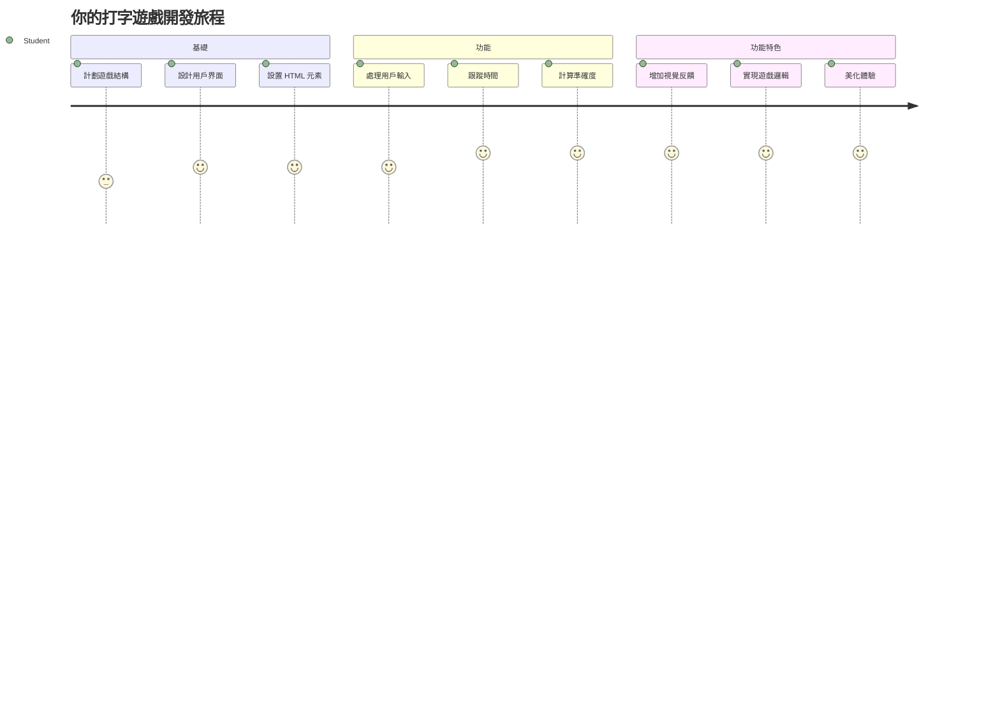
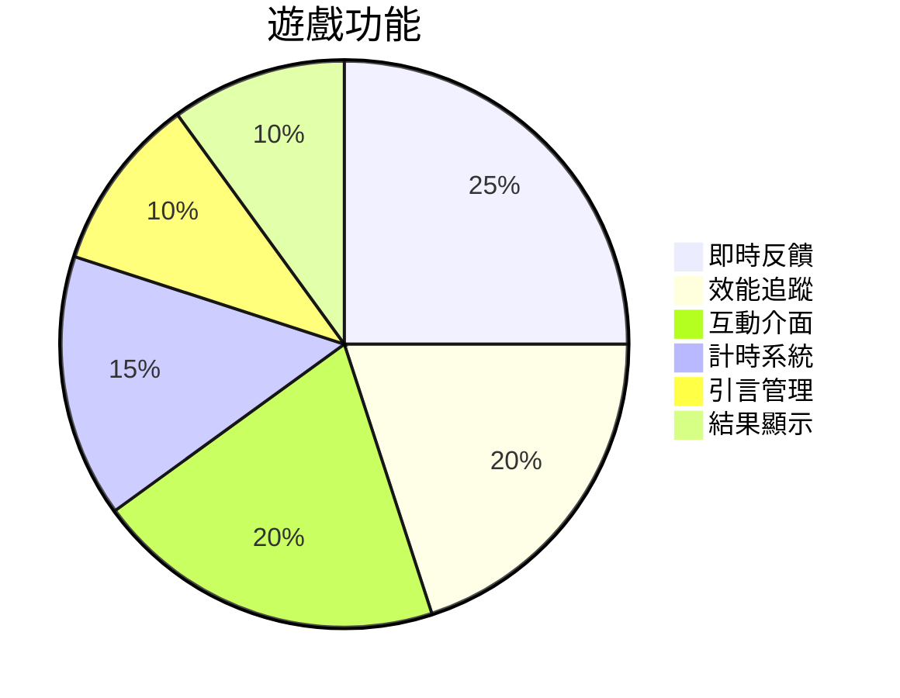
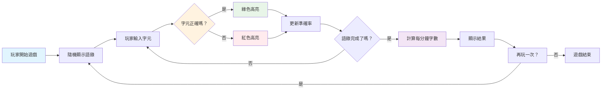
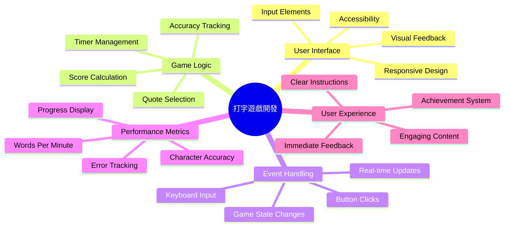
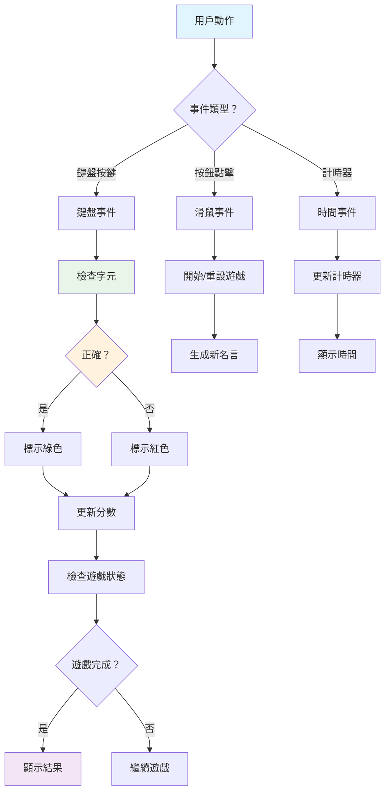
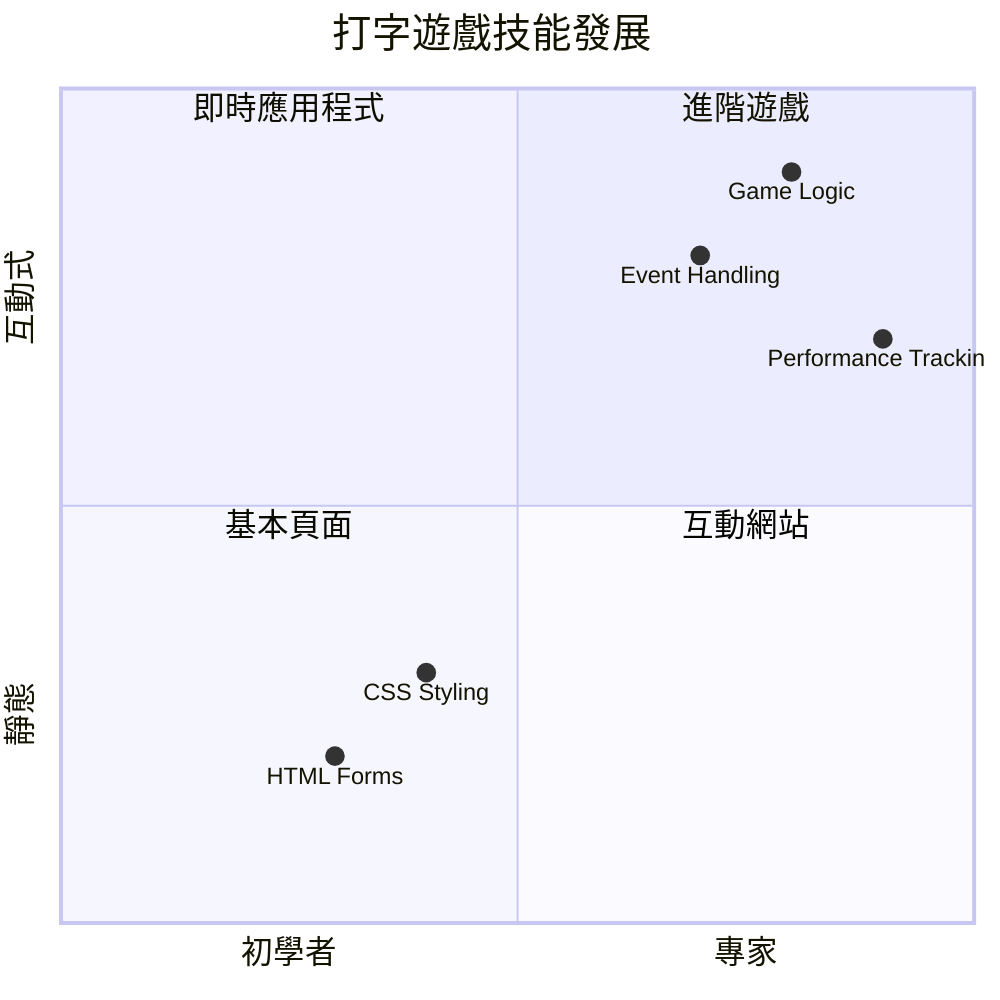
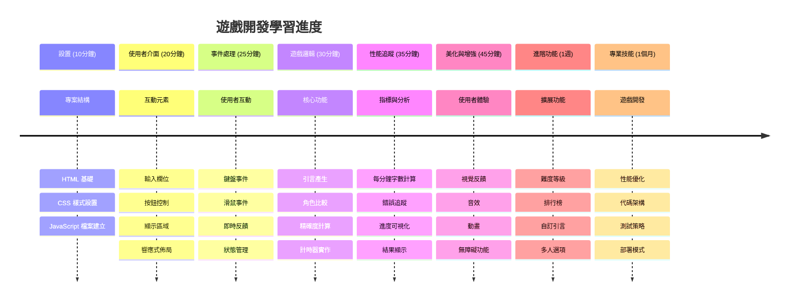

# 事件驅動程式設計 - 建立一個打字遊戲

## 介紹

有一件每個開發者都知道但很少談論的事：打字快是超能力！🚀 想想看——你越快把腦中的想法輸入到程式編輯器，創造力就能流動得越順暢。就像你的思緒和螢幕之間有條直接的管道。

想知道提升這項技能的最佳方法之一嗎？你猜對了——我們要做一款遊戲！

> 讓我們一起創造一款超棒的打字遊戲吧！

準備好運用你學習的 JavaScript、HTML 和 CSS 技能了嗎？我們要建立一個打字遊戲，遊戲內容會挑戰你打出來自傳奇偵探 [Sherlock Holmes](https://en.wikipedia.org/wiki/Sherlock_Holmes) 的隨機名言。遊戲會追蹤你打字的速度和準確性——相信我，這比你想像中還要令人上癮！

## 你需要知道的

在深入之前，請確保你熟悉以下概念（如果需要快速複習也沒關係——我們都經歷過！）：

- 建立文字輸入和按鈕控件
- CSS 與使用類別設定樣式  
- JavaScript 基礎
  - 建立陣列
  - 產生隨機數字
  - 取得目前時間

如果有任何部分感覺有點生疏，也完全沒問題！有時候鞏固知識的最好方式就是開始實作，邊做邊學。

### 🔄 **教學確認**
**基礎評估**：開始開發前，確保你了解：
- ✅ HTML 表單與輸入元素的工作原理
- ✅ CSS 類別與動態樣式設定
- ✅ JavaScript 事件監聽器與處理程序
- ✅ 陣列操作與隨機選擇
- ✅ 時間測量與計算

**快速自我測驗**：你能解釋這些概念如何在互動遊戲中協同運作嗎？
- **事件** 在使用者與元素互動時觸發
- **處理程序** 負責處理事件並更新遊戲狀態
- **CSS** 提供使用者行為的視覺反饋
- **計時** 使得效能測量和遊戲進展成為可能

## 開工吧！

[利用事件驅動程式設計創建打字遊戲](./typing-game/README.md)

### ⚡ **接下來 5 分鐘你可以做什麼**
- [ ] 開啟瀏覽器主控台，試試用 `addEventListener` 監聽鍵盤事件
- [ ] 建立一個簡單 HTML 頁面，有輸入欄並測試打字偵測
- [ ] 練習字串操作，將輸入文字與目標文字比對
- [ ] 嘗試使用 `setTimeout` 理解定時功能

### 🎯 **這一小時你可以完成什麼**
- [ ] 完成課後小測，理解事件驅動程式設計
- [ ] 建立打字遊戲的基本版本並驗證字詞
- [ ] 新增正確與錯誤打字的視覺反饋
- [ ] 實作基於速度與準確性的簡單計分系統
- [ ] 用 CSS 美化遊戲介面，使之更吸引人

### 📅 **這一週你的遊戲開發路線**
- [ ] 完成具備所有功能與細節的完整打字遊戲
- [ ] 新增難度等級，包含不同複雜度的字詞
- [ ] 實作用戶統計追蹤（WPM、準確率變化）
- [ ] 添加音效與動畫，提升使用體驗
- [ ] 讓遊戲響應式適用於觸控裝置
- [ ] 將遊戲分享線上並收集用戶回饋

### 🌟 **這一個月你的互動開發計畫**
- [ ] 開發多款遊戲，探索不同互動模式
- [ ] 學習遊戲循環、狀態管理與效能優化
- [ ] 貢獻開源遊戲開發專案
- [ ] 精通高階計時概念與流暢動畫
- [ ] 建立展示各式互動應用的作品集
- [ ] 指導其他對遊戲開發與用戶互動有興趣的人

## 🎯 你的打字遊戲精通時間表

### 🛠️ 你的遊戲開發工具包總結

完成這個專案後，你將掌握：
- **事件驅動程式設計**：對輸入反應的互動界面
- **即時反饋**：快速視覺與效能更新
- **效能測量**：精確的計時與計分系統
- **遊戲狀態管理**：控制應用流程與用戶體驗
- **互動設計**：創造引人入勝、令人上癮的使用體驗
- **現代網頁 API**：利用瀏覽器能力實現豐富互動
- **無障礙模式**：為所有使用者打造包容性設計

**實際應用場景**：這些技能適用於：
- **網頁應用程式**：任何互動界面或儀表板
- **教育軟體**：學習平台與技能評估工具
- **生產力工具**：文字編輯器、整合開發環境、協作軟體
- **遊戲產業**：瀏覽器遊戲與互動娛樂
- **行動開發**：觸控介面與手勢處理

**下一階段**：準備探索進階遊戲框架、即時多人系統或複雜的互動應用！

## 致謝

由 [Christopher Harrison](http://www.twitter.com/geektrainer) 以 ♥️ 撰寫

---

<!-- CO-OP TRANSLATOR DISCLAIMER START -->
**免責聲明**：  
本文件乃使用人工智能翻譯服務【Co-op Translator】(https://github.com/Azure/co-op-translator) 翻譯而成。雖然我們致力於確保準確性，但請注意，自動翻譯可能包含錯誤或不準確之處。原始文件的母語版本應被視為權威資料。對於重要資訊，建議使用專業人工翻譯。對於因使用本翻譯而引致的任何誤解或誤釋，我們概不負責。
<!-- CO-OP TRANSLATOR DISCLAIMER END -->