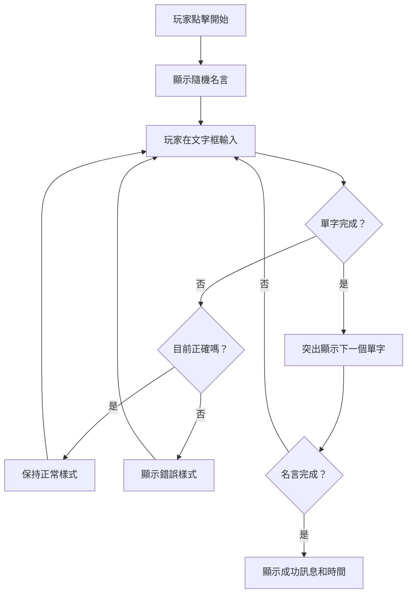
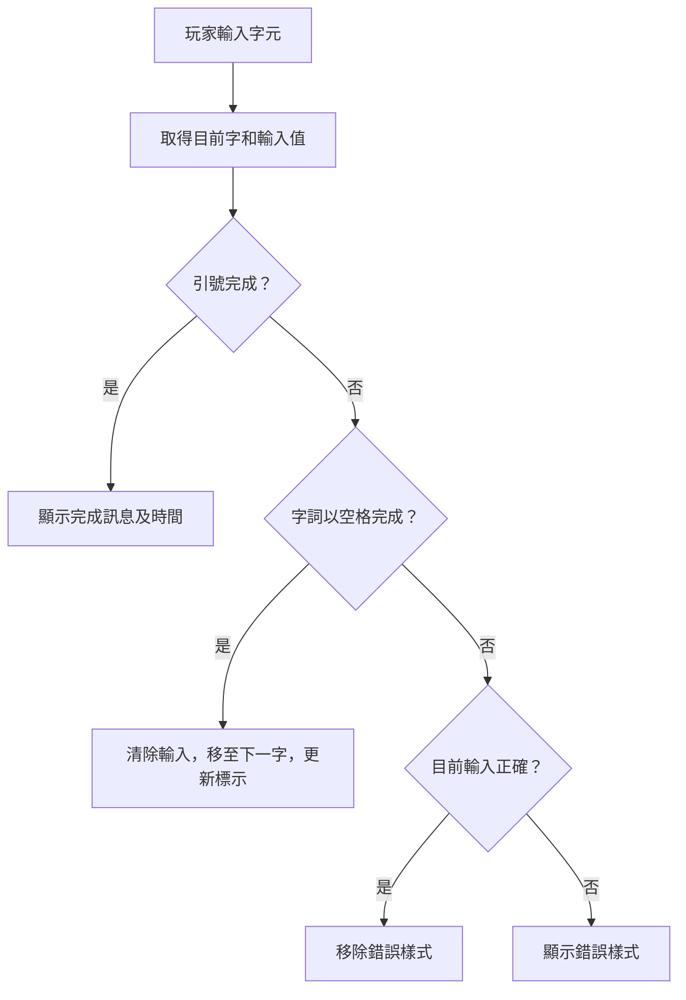
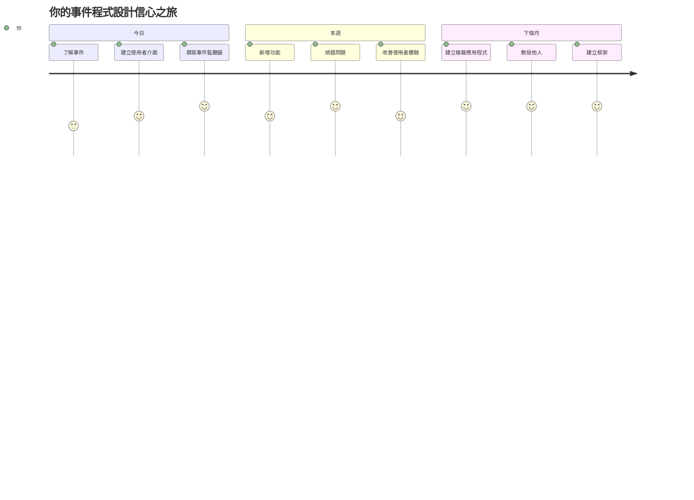

# 使用事件創建一個遊戲

你是否曾經想過網站如何知道你何時點按按鈕或在文字框中輸入？這就是事件驅動程式設計的魔力！有什麼比構建一個有用的東西更好的方式來學習這項基本技能呢——一個會對你每次敲打的按鍵作出反應的打字速度遊戲。

你將親身看到網頁瀏覽器如何「與」你的 JavaScript 代碼「對話」。每次你點按、輸入或移動滑鼠時，瀏覽器都會向你的代碼發送小訊息（我們稱之為事件），而你則決定如何回應！

到本文結束時，你將建立一個真實的打字遊戲，追蹤你的速度和準確度。更重要的是，你將理解驅動每一個你曾使用過的互動網站的基本概念。讓我們開始吧！

## 課前測驗

[Pre-lecture quiz](https://ff-quizzes.netlify.app/web/quiz/21)

## 事件驅動程式設計

想想你最喜歡的應用程式或網站——是什麼令它感覺生動且反應靈敏？全在於它如何回應你的操作！每一次點按、點擊、滑動或鍵入都會創造一個我們稱之為「事件」的東西，而這正是網頁開發中真正的魔法所在。

這就是為什麼針對網頁編程如此有趣的原因：我們永遠不知道何時有人會點擊按鈕或開始輸入文字。他們可能立即點擊，也可能等待五分鐘，或者可能根本不點擊！這種不可預測性意味著我們需要用不同的方法來撰寫代碼。

我們不是寫一段從上到下運行的程式碼（就像食譜一樣），而是寫程式碼耐心地等待事情發生。這就像 1800 年代的電報操作員守候在他們的機器旁，準備在訊息通過電線時立即回應一樣。

那麼，「事件」究竟是什麼？簡單地說，它是發生的事情！你點擊一個按鈕——這就是一個事件。你輸入一個字母——這是另一個事件。你移動滑鼠——還有另一個事件。

事件驅動程式設計讓我們能夠設定代碼來聆聽和回應。我們創建特殊函數稱為**事件監聽器（event listeners）**，它們耐心等待特定事件發生，然後在事件發生時立即執行。

把事件監聽器想像成你的代碼的門鈴。你安裝門鈴 (`addEventListener()`)，告訴它要聽哪種聲音（如「click」或「keypress」），然後指定誰按鐘時該做什麼（你的自訂函數）。

**事件監聽器的工作原理：**
- **監聽**特定的用戶操作，如點擊、鍵擊或滑鼠移動
- **執行**指定事件發生時的自訂代碼
- **立即回應**用戶互動，創造無縫體驗
- **可處理**同一元素上的多個不同事件監聽器

> **NOTE:** 值得一提的是，創建事件監聽器的方法有很多。你可以使用匿名函數，或者建立有名稱的函數。你也可以用各種快捷方式，比如設定 `click` 屬性，或者使用 `addEventListener()`。在我們的練習中，我們將專注於 `addEventListener()` 和匿名函數，因為這可能是網頁開發者最常用的技術。它也是最靈活的，因為 `addEventListener()` 適用於所有事件，且事件名稱可作為參數傳入。

### 常見事件

雖然網頁瀏覽器提供數十種不同的事件可供監聽，但大多數互動應用程式只依賴幾個基本事件。理解這些核心事件將為你建立複雜的用戶互動奠定基礎。

有[數十種事件](https://developer.mozilla.org/docs/Web/Events)可供你監聽，幾乎用戶在頁面上做的任何事情都可以引發事件，這讓你能夠掌控用戶體驗。幸運的是，你通常只需要少數幾種事件。以下是一些常見的（包括我們創建遊戲時將使用的兩種）：

| Event | 說明 | 常見用例 |
|-------|-------|---------|
| `click` | 用戶點擊了某些東西 | 按鈕、鏈結、互動元素 |
| `contextmenu` | 用戶點擊了滑鼠右鍵 | 自訂右鍵選單 |
| `select` | 用戶選取了部分文字 | 文字編輯、複製操作 |
| `input` | 用戶輸入了文字 | 表單驗證、即時搜尋 |

**理解這些事件類型：**
- **觸發**用戶與頁面上特定元素互動
- **提供**關於用戶操作的詳細事件對象資訊
- **啟用**你創造反應迅速、互動性強的網頁應用程式
- **跨瀏覽器裝置**皆可一致運作

## 創建遊戲

既然你了解事件如何運作，讓我們將這些知識付諸實踐，做一些有用的東西。我們將建立一個打字速度遊戲，演示事件處理的同時幫助你培養重要的開發技能。

我們要創建一個遊戲來探索 JavaScript 中事件的運作。遊戲將測試玩家的打字技能，這是每個開發者都應該擁有且被低估的技能。趣聞：我們如今使用的 QWERTY 鍵盤布局其實是在 1870 年代為打字機設計的——而良好的打字技能對程式設計師來說依然十分有價值！遊戲的一般流程如下：


**遊戲流程：**
- **開始**：玩家按下開始按鈕，顯示一段隨機引言
- **追蹤**：即時追蹤玩家的逐字輸入進度
- **標示**：高亮顯示當前字詞，引導玩家專注
- **回饋**：立即以視覺效果提示輸入錯誤
- **計算**：完成全部引言時顯示花費的總時間

讓我們一起開發遊戲，並了解事件！

### 檔案結構

在撰寫代碼前，讓我們做好組織！有一個整潔的檔案結構能避免日後的麻煩，讓你的專案看起來更專業。😊

我們將保持簡單，只使用三個檔案：`index.html` 放我們的頁面結構，`script.js` 包含遊戲的邏輯，還有 `style.css` 讓頁面美觀。這是網頁開發最經典的三劍客！

**打開命令列或終端機視窗，輸入以下指令，來為你的工作建立一個新資料夾：**

```bash
# Linux 或 macOS
mkdir typing-game && cd typing-game

# Windows
md typing-game && cd typing-game
```

**這些指令做了什麼：**
- **創建**一個名為 `typing-game` 的新目錄，用來存放你的專案檔案
- **自動切換到**新建的目錄中
- **為你的遊戲開發搭建了**一個乾淨的工作環境

**打開 Visual Studio Code：**

```bash
code .
```

**此指令作用：**
- **在目前目錄啟動** Visual Studio Code
- **打開**你的專案資料夾到編輯器中
- **提供**所有你需要的開發工具

**在 Visual Studio Code 中新增三個檔案，命名如下：**
- `index.html` - 包含遊戲的結構和內容
- `script.js` - 處理所有遊戲邏輯和事件監聽器
- `style.css` - 定義視覺外觀和樣式

## 創建使用者介面

現在讓我們搭建實際進行遊戲操作的舞台！把它想成為飛船設計控制面板——我們要確保玩家需要的所有東西都在他們預期的位置。

先想想遊戲需要些什麼。如果你在玩打字遊戲，你希望畫面上看到什麼？這裡是我們需要的：

| UI 元素 | 用途 | HTML 元素 |
|---------|-------|-----------|
| 引言顯示區 | 顯示要輸入的文字 | `<p>`，具有 `id="quote"` |
| 訊息區域 | 顯示狀態及成功訊息 | `<p>`，具有 `id="message"` |
| 文字輸入框 | 玩家輸入引言 | `<input>`，具有 `id="typed-value"` |
| 開始按鈕 | 開始遊戲 | `<button>`，具有 `id="start"` |

**UI 結構理解：**
- **內容**從上到下有邏輯地組織
- **元素**有唯一 ID，方便 JavaScript 操作
- **提供**清晰的視覺階層，提升用戶體驗
- **使用**語意化 HTML，增強輔助功能支援

這些元素都需要 ID，方便我們在 JavaScript 中操作。我們也會在這裡加入 CSS 和 JavaScript 檔案的連結。

建立新檔案命名為 `index.html`，加入以下 HTML：

```html
<!-- inside index.html -->
<html>
<head>
  <title>Typing game</title>
  <link rel="stylesheet" href="style.css">
</head>
<body>
  <h1>Typing game!</h1>
  <p>Practice your typing skills with a quote from Sherlock Holmes. Click **start** to begin!</p>
  <p id="quote"></p> <!-- This will display our quote -->
  <p id="message"></p> <!-- This will display any status messages -->
  <div>
    <input type="text" aria-label="current word" id="typed-value" /> <!-- The textbox for typing -->
    <button type="button" id="start">Start</button> <!-- To start the game -->
  </div>
  <script src="script.js"></script>
</body>
</html>
```

**這段 HTML 結構做了這些事：**
- **在 `<head>` 連結** CSS 樣式表，提供樣式
- **建立**明確標題和說明，方便使用者理解
- **設置**具有特定 ID 的佔位段落，用於動態內容
- **包含**具無障礙特性的輸入欄位
- **提供**一個開始按鈕來觸發遊戲
- **在末尾載入** JavaScript 檔案，達到最佳載入效能

### 啟動應用程式

在開發過程中經常測試應用程式能幫助你早期發現問題並且即時看到成果。Live Server 是一個無價的工具，當你儲存檔案時能自動刷新瀏覽器，讓開發更有效率。

最好以迭代方式開發，隨時看看變化。讓我們啟動應用程式。有一款 Visual Studio Code 套件叫做 [Live Server](https://marketplace.visualstudio.com/items?itemName=ritwickdey.LiveServer&WT.mc_id=academic-77807-sagibbon)，它可以本地架設伺服器並在檔案儲存時自動刷新瀏覽器。

**安裝 [Live Server](https://marketplace.visualstudio.com/items?itemName=ritwickdey.LiveServer&WT.mc_id=academic-77807-sagibbon)，點擊安裝：**

**安裝過程中發生的事情：**
- **會提示**你的瀏覽器打開 Visual Studio Code
- **引導你完成**擴充套件的安裝
- **可能需要**重新啟動 Visual Studio Code 以完成設置

**安裝後，在 Visual Studio Code 中按 Ctrl-Shift-P（或 Cmd-Shift-P）打開命令面板：**

**命令面板的功能：**
- **快速存取** VS Code 的所有命令
- **可輸入關鍵字**快速尋找命令
- **提供**鍵盤快捷鍵加快開發速度

**輸入「Live Server: Open with Live Server」：**

**Live Server 會做什麼：**
- **啟動**本地開發伺服器服務你的專案
- **你儲存檔案時**自動刷新瀏覽器頁面
- **從本地網址**（通常是 `localhost:5500`）提供服務

**打開瀏覽器並造訪 `https://localhost:5500`：**

你應該會看到剛才建立的頁面！現在讓我們新增功能。

## 新增 CSS

接下來讓畫面好看一些！視覺回饋自計算機早期時代起就是用戶介面的關鍵。在1980年代，研究者發現即時的視覺回饋大幅提升使用者效能並且減少錯誤。這正是我們要創建的效果。

我們的遊戲需要清晰明確地呈現目前狀況。玩家應立即知道該輸入哪個字詞，若出錯也應見到即時提示。我們來做一些簡單有效的樣式：

建立新檔案命名為 `style.css`，加入以下語法。

```css
/* inside style.css */
.highlight {
  background-color: yellow;
}

.error {
  background-color: lightcoral;
  border: red;
}
```

**這些 CSS 類別的作用：**
- **以黃色背景**標示當前字詞，提供清楚視覺引導
- **用淡珊瑚色背景**提示輸入錯誤
- **提供**即時回饋而不干擾輸入流程
- **使用**對比鮮明的顏色提升無障礙性與可讀性

✅ CSS 部分你可以自由調整頁面佈局。花點時間讓頁面更吸引人：

- 選用不同字體
- 為標題增添顏色
- 調整元素大小

## JavaScript

現在開始有趣了！🎉 我們已建立 HTML 結構和 CSS 樣式，但遊戲目前如同漂亮的汽車卻沒有引擎。JavaScript 就是這個引擎——它讓一切實際運作並對玩家操作產生反應。

這是你將看到你的創作活起來的地方。我們會按步驟進行，讓一切不感到繁雜：

| 步驟 | 目的 | 你將學習什麼 |
|------|-------|----------------|
| [新增常數](../../../../4-typing-game/typing-game) | 設定引言與 DOM 參考 | 變數管理與 DOM 選取 |
| [新增開始遊戲的事件監聽器](../../../../4-typing-game/typing-game) | 處理遊戲初始化 | 事件處理與 UI 更新 |
| [新增輸入事件監聽器](../../../../4-typing-game/typing-game) | 實時處理使用者輸入 | 輸入驗證與動態回饋 |

**這種結構化方法幫助你：**
- **把程式碼**組織成合乎邏輯、可管理的部分
- **逐步構建**功能，便於除錯
- **理解**應用各部分如何協同工作
- **創造**未來專案可重用模式

但首先，建立新檔案命名為 `script.js`。

### 新增常數

在開始動手前，先整理所有資源！就像 NASA 任務控制中心會在發射前設置所有監控系統一樣，事先準備整齊省事很多，也避免後續找資料時東翻西找、打錯字。

以下是我們要先設定的：

| 資料類型 | 用途 | 例子 |
|-----------|-------|-----|
| Array of quotes | 儲存所有遊戲可能的引用語 | `['Quote 1', 'Quote 2', ...]` |
| Word array | 將當前引用分解成單字陣列 | `['When', 'you', 'have', ...]` |
| Word index | 追蹤玩家正在輸入的單字位置 | `0, 1, 2, 3...` |
| Start time | 計算得分的已用時間 | `Date.now()` |

**我們還需要引用 UI 元素：**
| Element | ID | Purpose |
|---------|----|---------|
| Text input | `typed-value` | 玩家輸入的地方 |
| Quote display | `quote` | 顯示要輸入的引用語 |
| Message area | `message` | 顯示狀態更新 |

```javascript
// 在 script.js 裡面
// 我哋所有嘅引述
const quotes = [
    'When you have eliminated the impossible, whatever remains, however improbable, must be the truth.',
    'There is nothing more deceptive than an obvious fact.',
    'I ought to know by this time that when a fact appears to be opposed to a long train of deductions it invariably proves to be capable of bearing some other interpretation.',
    'I never make exceptions. An exception disproves the rule.',
    'What one man can invent another can discover.',
    'Nothing clears up a case so much as stating it to another person.',
    'Education never ends, Watson. It is a series of lessons, with the greatest for the last.',
];
// 儲存詞彙列表同玩家而家打緊嘅詞彙索引
let words = [];
let wordIndex = 0;
// 開始時間
let startTime = Date.now();
// 頁面元素
const quoteElement = document.getElementById('quote');
const messageElement = document.getElementById('message');
const typedValueElement = document.getElementById('typed-value');
```

**拆解這段設置程式碼的功用：**
- **使用 `const` 儲存** 一組 Sherlock Holmes 的引用語，因為引用語不會改變
- **使用 `let` 初始化** 追蹤變數，因為這些值在遊戲進行時會更新
- **透過 `document.getElementById()` 抓取** DOM 元素的引用以提升存取效率
- **建立遊戲功能基礎**，使用清晰且描述性變數名稱
- **將相關資料與元素組織** 起來便於後續維護程式碼

✅ 馬上為你的遊戲加入更多引用語吧

> 💡 **專家小提示**：我們可以在程式碼中隨時用 `document.getElementById()` 取得元素。因為會經常用到這些元素，我們會用常數避免字串拼寫錯誤。像是 [Vue.js](https://vuejs.org/) 或 [React](https://reactjs.org/) 這類框架能幫你更好管理及集中你的程式碼。
>
**這種作法為什麼這麼好：**
- **防止** 多次引用元素時拼寫錯誤
- **提升** 程式碼可讀性，使用描述性常數名稱
- **啟用** IDE 的自動完成與錯誤檢查功能
- **未來** 元素 ID 改變時更易重構程式碼

花一點時間觀看有關使用 `const`、`let` 與 `var` 的影片

[](https://youtube.com/watch?v=JNIXfGiDWM8 "Types of variables")

> 🎥 點擊上方圖片觀看變數相關教學影片。

### 新增開始邏輯

這是全部運作的關鍵時刻！🚀 你即將寫出第一個真正的事件監聽器，看到你的程式碼回應按鈕點擊會非常有成就感。

想想看：某處某人會按下「Start」按鈕，程式必須準備好因應。我們不知道他什麼時候按 — 可能立刻，也可能喝完咖啡才按 — 但當按下去時，你的遊戲就啟動了。

當使用者點擊 `start`，我們需要選擇一段引用，設置界面，並追蹤目前輸入的字與計時。以下是你需要加入的 JavaScript，後面會解釋。

```javascript
// 在 script.js 的末尾
document.getElementById('start').addEventListener('click', () => {
  // 獲取一個引言
  const quoteIndex = Math.floor(Math.random() * quotes.length);
  const quote = quotes[quoteIndex];
  // 將引言放入字詞陣列中
  words = quote.split(' ');
  // 重置字詞索引以便追蹤
  wordIndex = 0;

  // 使用者界面更新
  // 建立一個 span 元素陣列，以便設定類別
  const spanWords = words.map(function(word) { return `<span>${word} </span>`});
  // 轉換為字串並設為引言顯示的 innerHTML
  quoteElement.innerHTML = spanWords.join('');
  // 強調第一個字詞
  quoteElement.childNodes[0].className = 'highlight';
  // 清除所有先前訊息
  messageElement.innerText = '';

  // 設置文字框
  // 清空文字框
  typedValueElement.value = '';
  // 設置焦點
  typedValueElement.focus();
  // 設置事件處理函式

  // 啟動計時器
  startTime = new Date().getTime();
});
```

**解構這段程式碼成合理的區塊：**

**📊 單字追蹤設定：**
- **隨機選擇** 一段引用，利用 `Math.floor()` 和 `Math.random()` 增加變化度
- **利用 `split(' ')`** 將引用切割成單字陣列
- **重置 `wordIndex`** 為 0，讓玩家從第一個單字開始
- **準備** 遊戲狀態為全新的一回合

**🎨 使用者介面設定與顯示：**
- **攏成 `<span>` 元素陣列包住每個單字，方便個別樣式設定**
- **將這些 span 合併成單一字串以便快速更新 DOM**
- **透過加上 `highlight` CSS 類，標示第一個單字**
- **清空之前的遊戲訊息，保持畫面清爽**

**⌨️ 文字框準備：**
- **清除輸入欄現有文字**
- **聚焦文字框使玩家能立即開始輸入**
- **為新一場遊戲做好輸入區準備**

**⏱️ 計時器初始化：**
- **使用 `new Date().getTime()` 記錄當前時間戳**
- **能精準計算輸入速度及完成時間**
- **開始追蹤這回合的遊戲時間**

### 新增輸入邏輯

現在要開始進入遊戲的核心！別擔心，開始看似複雜，我們一步步拆解，最後你會發現邏輯非常合理。

我們建立的邏輯是：每當有人輸入字母，我們的程式都會檢查他輸入了什麼，給予回饋，並判斷下一步要做什麼。這有點像 1970 年代早期的文字處理器 WordStar，在輸入時即時提供回饋。

```javascript
// 在 script.js 的結尾
typedValueElement.addEventListener('input', () => {
  // 取得目前的字詞
  const currentWord = words[wordIndex];
  // 取得目前的數值
  const typedValue = typedValueElement.value;

  if (typedValue === currentWord && wordIndex === words.length - 1) {
    // 句子結束
    // 顯示成功
    const elapsedTime = new Date().getTime() - startTime;
    const message = `CONGRATULATIONS! You finished in ${elapsedTime / 1000} seconds.`;
    messageElement.innerText = message;
  } else if (typedValue.endsWith(' ') && typedValue.trim() === currentWord) {
    // 字詞結束
    // 為新字詞清除 typedValueElement
    typedValueElement.value = '';
    // 移至下一個字詞
    wordIndex++;
    // 重設 quote 中所有元素的類別名稱
    for (const wordElement of quoteElement.childNodes) {
      wordElement.className = '';
    }
    // 高亮新字詞
    quoteElement.childNodes[wordIndex].className = 'highlight';
  } else if (currentWord.startsWith(typedValue)) {
    // 目前正確
    // 高亮下一個字詞
    typedValueElement.className = '';
  } else {
    // 錯誤狀態
    typedValueElement.className = 'error';
  }
});
```

**理解輸入邏輯流程：**

此函式採用瀑布式檢查，從最特定條件到最普遍的來判斷。逐項說明：


**🏁 完成整句引用（情境一）：**
- **檢查** 輸入的字串是否等於目前單字且已是最後一個字
- **計算** 從開始到現在的時間差
- **將** 毫秒轉換成秒，除以 1,000
- **顯示** 恭喜完成消息與所用時間

**✅ 完成單字（情境二）：**
- **偵測** 輸入結尾為空白表示完成該字
- **驗證** 去除空白後輸入與當前單字完全相符
- **清除** 輸入框準備下一個單字
- **前進** 單字索引 `wordIndex` 到下一個字
- **更新** 標示樣式，移除所有類別並標亮新單字

**📝 輸入進行中（情境三）：**
- **確認** 當前單字以已輸入字串開頭
- **移除** 錯誤樣式以顯示輸入正確
- **允許** 玩家持續輸入不做中斷

**❌ 錯誤狀態（情境四）：**
- **觸發** 輸入不符合當前單字前綴
- **加上** 錯誤 CSS 類別，立刻給視覺反饋
- **幫助** 玩家快速察覺並修正錯誤

## 測試你的應用程式

看看你做了什麼！🎉 你從零打造出真正可用的打字遊戲，用事件驅動程式設計。花點時間欣賞你的成果 — 這可不是件小事！

現在是測試時間！它會按預期運作嗎？我們是不是漏了什麼？事情如果沒立刻完美正常也很正常。連經驗豐富的開發者都常常找到 bug，這是開發流程的一部分！

點擊 `start`，開始打字！應該跟之前看到的動畫類似。


**測試內容建議：**
- **確認** 點擊開始時隨機顯示引用語
- **確認** 輸入時正確標示出目前單字
- **檢查** 輸入錯誤時出現錯誤樣式
- **確定** 詞語完成後標示正確前進
- **測試** 完成整句後顯示完成訊息與計時

**常見除錯建議：**
- **查看** 瀏覽器控制台 (F12) 是否有 JavaScript 錯誤
- **確認** 所有檔名大小寫完全正確
- **確保** Live Server 正在正常運作與刷新
- **測試** 多段不同引用，確認隨機選擇有效

---

## GitHub Copilot Agent 挑戰 🎮

使用 Agent 模式完成以下挑戰：

**描述：** 擴充打字遊戲，實作難度系統，根據玩家表現調整遊戲難度。此挑戰將幫助你練習進階事件處理、資料分析與動態 UI 更新。

**提示：** 建立一套難度調整系統，要求：
1. 追蹤玩家打字速度（每分鐘字數）與準確率百分比
2. 自動調整三種難度：簡單（簡單引用）、中等（目前引用）、困難（帶標點符號複雜引用）
3. 在 UI 顯示目前難度等級與玩家統計數據
4. 實作連續三次好表現後提升難度的連勝計數器
5. 加入視覺回饋（顏色、動畫）提示難度變化

新增所需的 HTML 元素、CSS 樣式與 JavaScript 函式實現此功能。包含適當的錯誤處理並確保遊戲無障礙，使用合適的 ARIA 標籤。

更多 agent 模式資訊可見 [agent mode](https://code.visualstudio.com/blogs/2025/02/24/introducing-copilot-agent-mode) 。

## 🚀 挑戰

準備好讓你的打字遊戲更進階了嗎？嘗試實作以下功能，加深你對事件處理與 DOM 操作的理解：

**添加更多功能：**

| 功能 | 描述 | 練習技能 |
|---------|-------------|------------------------|
| **輸入控管** | 完成後禁用輸入事件監聽器，點擊按鈕時重新啟用 | 事件管理與狀態控制 |
| **UI 狀態管理** | 玩家完成引用後禁用文字框 | DOM 屬性操作 |
| **模態對話框** | 顯示成功訊息的模態對話框 | 進階 UI 模式和輔助功能 |
| **最高分系統** | 使用 `localStorage` 儲存最高分數 | 瀏覽器儲存 API 與資料持久化 |

**實作提示：**
- **研究** `localStorage.setItem()` 和 `localStorage.getItem()` 實作持久保存
- **練習** 動態新增和移除事件監聽器
- **探索** HTML 對話框元素或 CSS 模態視窗範例
- **考慮** 在禁用和啟用表單控件時保持無障礙

## 課後測驗

[課後測驗](https://ff-quizzes.netlify.app/web/quiz/22)

---

## 🚀 你的打字遊戲精通時間軸

### ⚡ **未來五分鐘能做到的事**
- [ ] 嘗試不同引用語確保遊戲順暢
- [ ] 試著修改 CSS，改變標記和錯誤顏色
- [ ] 開啟瀏覽器 DevTools (F12)，玩遊戲時觀察 Console
- [ ] 挑戰自己盡快完成一段引用

### ⏰ **一小時內能完成的事**
- [ ] 為陣列新增更多引用（如你喜歡的書本或電影）
- [ ] 實作挑戰區的 localStorage 最高分系統
- [ ] 製作每場遊戲後顯示的每分鐘字數計算器
- [ ] 加入正確輸入、錯誤和完成的聲音效果

### 📅 **你的七天冒險**
- [ ] 打造多人對戰功能，讓朋友並排比賽
- [ ] 建立不同難度等級，引用複雜度分級
- [ ] 新增進度條顯示已完成引用比例
- [ ] 實作使用者帳號與個人統計追蹤
- [ ] 設計自訂主題並讓使用者選擇喜愛的樣式

### 🗓️ **你的三十天蛻變**
- [ ] 建立打字課程，逐步教導正確手指位置
- [ ] 建立錯誤分析，找出最多錯誤的字母或單字
- [ ] 支援不同語言及鍵盤配置
- [ ] 整合教育用 API，從文學資料庫取得引用
- [ ] 發佈強化版打字遊戲供其他人使用與享受

### 🎯 **最終反思檢視**

**繼續前，花點時間慶祝：**
- 在製作此遊戲過程中，最令人滿足的時刻是什麼？
- 現在你對事件驅動程式設計的看法如何，和剛開始時相比？
- 有哪個功能讓你期待加入，讓遊戲獨一無二？
- 你會怎麼將事件處理概念應用到其他專案？


> 🌟 **記得**：你剛剛掌握了讓每個互動網站與應用程式運作的核心概念。事件驅動程式設計讓網路維持活躍且貼近使用者。每次看到下拉選單、輸入時即時驗證、或遊戲回應點擊，你現在懂背後的魔法。你不只是學寫程式，你是學著創造直覺且吸引人的體驗！🎉

---

## 複習與自學

閱讀[瀏覽器提供的所有事件](https://developer.mozilla.org/docs/Web/Events)文件，並思考你會在什麼情況下使用它們。

## 作業

[建立一個新的鍵盤遊戲](assignment.md)

---

<!-- CO-OP TRANSLATOR DISCLAIMER START -->
**免責聲明**：  
本文件乃使用 AI 翻譯服務 [Co-op Translator](https://github.com/Azure/co-op-translator) 所翻譯。儘管我們致力確保翻譯準確，但請注意自動翻譯可能包含錯誤或不準確之處。原始文件的母語版本應被視為權威來源。對於重要資訊，建議尋求專業人工翻譯。本公司對因使用本翻譯而導致的任何誤解或誤譯概不負責。
<!-- CO-OP TRANSLATOR DISCLAIMER END -->