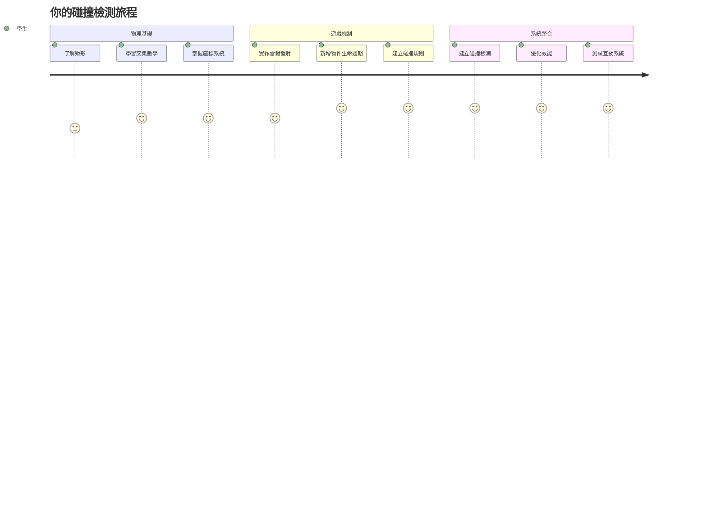
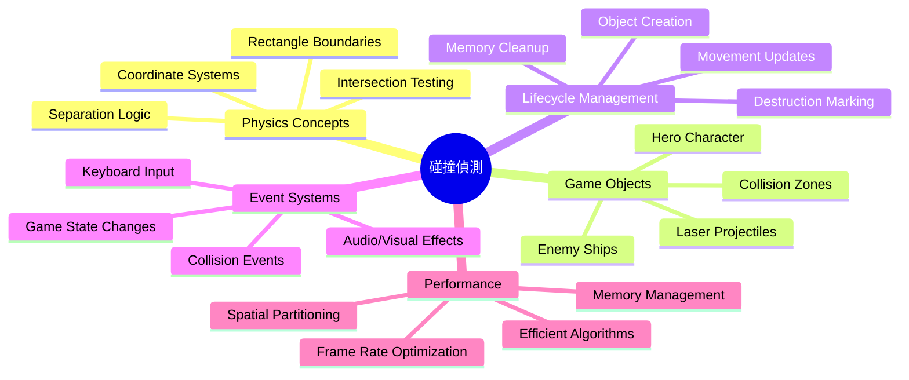
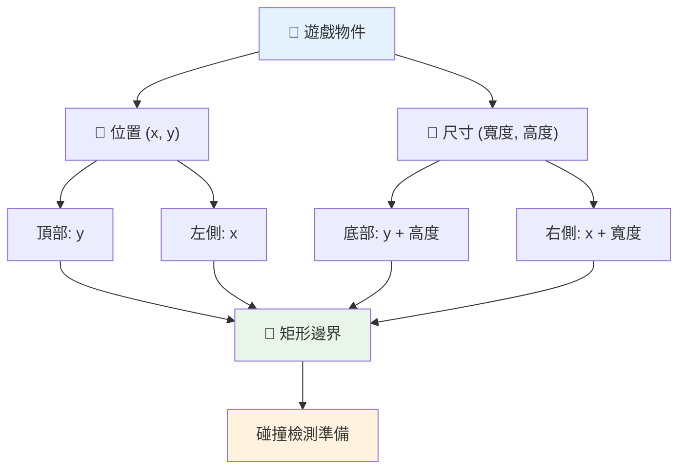
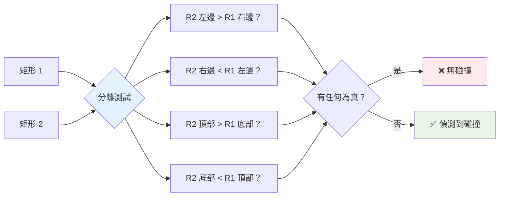
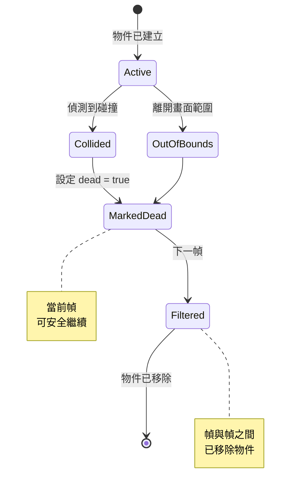
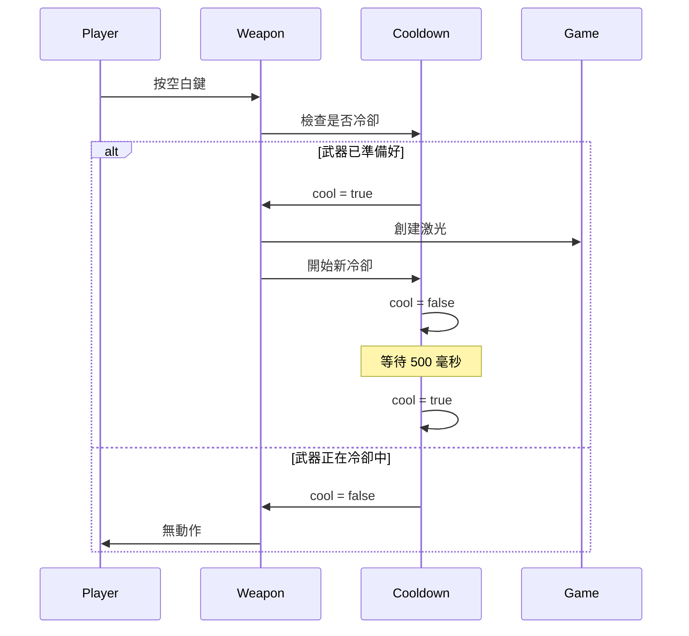
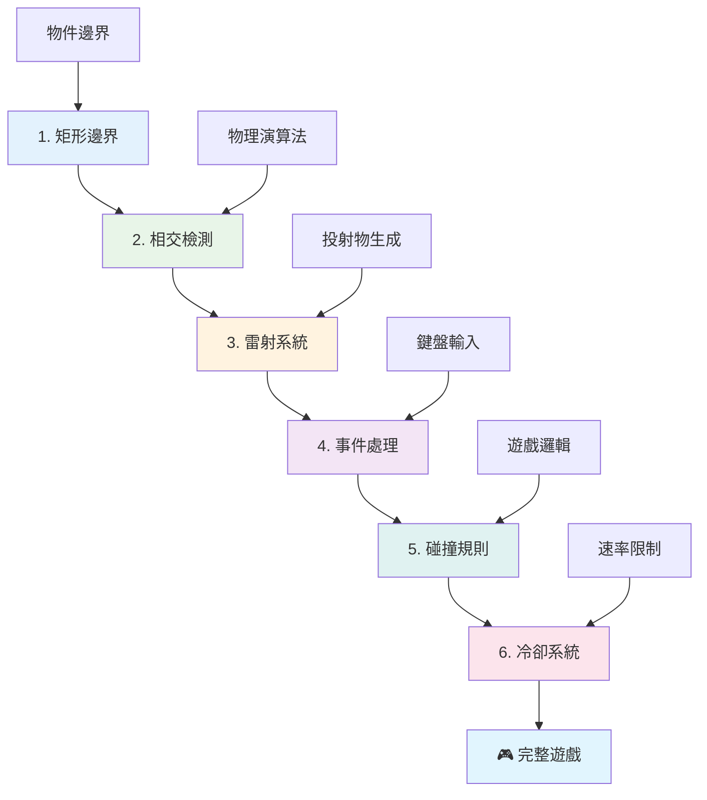
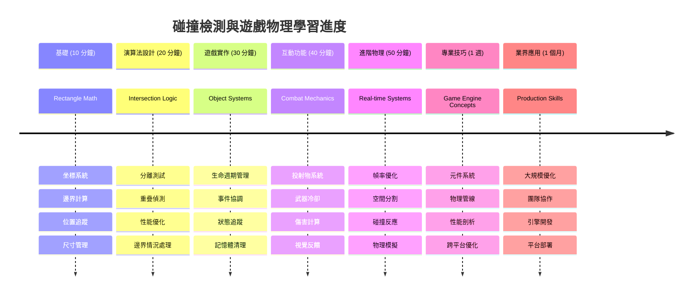

# 建立太空遊戲第4部分：加入雷射與碰撞偵測


## 講義前測驗

[講義前測驗](https://ff-quizzes.netlify.app/web/quiz/35)

想像一下星球大戰中路克的質子魚雷擊中死星排氣孔的那一刻。那精準的碰撞偵測改變了整個銀河的命運！在遊戲中，碰撞偵測也是如此運作——判斷物件何時互動以及接下來會發生什麼事。

這堂課中，你將會加入雷射武器到太空遊戲中並實作碰撞偵測。就像NASA任務規劃者計算太空船軌跡以避開碎片，你將學習如何偵測遊戲物件的交錯狀況。我們會拆解成易於管理、層層堆疊的步驟。

完成後，你會有一套運作正常的戰鬥系統，雷射會消滅敵人，碰撞會觸發遊戲事件。這些相同的碰撞原理被應用在從物理模擬到互動網頁介面的一切中。


✅ 做些小研究，了解最早的電腦遊戲是什麼。它的功能是什麼？

## 碰撞偵測

碰撞偵測的運作就像阿波羅月球登陸器上的接近感測器——不斷檢查距離，當物體靠得太近時就觸發警報。在遊戲裡，這系統決定物件何時互動以及接下來要發生什麼。

我們使用的做法是將每個遊戲物件視為長方形，類似航空管制系統用簡化的幾何圖形來追蹤飛機。這種長方形方法可能看起來很基本，但運算效率高，且適用於大多數遊戲情境。

### 長方形表示法

每個遊戲物件都需要座標邊界，就像火星探路者車輛繪製在火星表面的位置一樣。以下定義這些邊界座標的方法：


```javascript
rectFromGameObject() {
  return {
    top: this.y,
    left: this.x,
    bottom: this.y + this.height,
    right: this.x + this.width
  }
}
```

**讓我們拆解說明：**
- **上邊緣**：物件垂直起始位置（y座標）
- **左邊緣**：物件水平起始位置（x座標）
- **下邊緣**：將高度加到y座標，就知道物件的底部位置
- **右邊緣**：將寬度加到x座標，即得完整邊界

### 交集演算法

偵測長方形交集的邏輯與哈伯太空望遠鏡判斷天體是否重疊視野類似。演算法會檢查分離情況：


```javascript
function intersectRect(r1, r2) {
  return !(r2.left > r1.right ||
    r2.right < r1.left ||
    r2.top > r1.bottom ||
    r2.bottom < r1.top);
}
```

**分離檢驗就像雷達系統：**
- 長方形2是否完全在長方形1的右邊？
- 長方形2是否完全在長方形1的左邊？
- 長方形2是否完全在長方形1的下面？
- 長方形2是否完全在長方形1的上面？

若上述條件都不成立，兩長方形必定重疊。這種做法與雷達操作員判斷兩飛機是否安全距離的方法相似。

## 管理物件生命週期

當雷射擊中敵人，兩者物件皆須從遊戲中移除。然而，中途刪除物件可能造成程式崩潰——這是阿波羅導航電腦早期系統中慘痛的教訓。取而代之，我們使用「標記刪除」的方式，安全地在畫面更新間隔移除物件。


以下示範如何標記要移除的物件：

```javascript
// 標記物件以便移除
enemy.dead = true;
```

**這種做法的好處：**
- 將物件標示為「已死」但不立即刪除
- 等待目前遊戲幀數安全結束
- 避免嘗試使用已消失的物件導致崩潰！

接著，在下一次渲染循環之前過濾標記物件：

```javascript
gameObjects = gameObjects.filter(go => !go.dead);
```

**這個過濾動作：**
- 產生只包含「活著」物件的新清單
- 丟棄被標記為死的物件
- 保持遊戲流暢執行
- 避免累積已摧毀物件造成記憶體膨脹

## 實作雷射機制

遊戲中的雷射投射物原理與星艦迷航記中的光子魚雷相同——它們是獨立的物件，沿直線移動直到擊中目標。每次按空白鍵都會產生一個新的雷射物件，並在螢幕上移動。

為了實現，我們需要協調幾個部分：

**主要元件包括：**
- **建立** 從英雄位置生成的雷射物件
- **處理** 鍵盤輸入以觸發雷射生成
- **管理** 雷射的移動與生命週期
- **實作** 雷射投射物的視覺呈現

## 實作射擊速率控制

無限制射擊會讓遊戲引擎不堪負荷，也讓遊戲過於簡單。真實武器系統也有類似限制——即使是USS Enterprise的光束炮也需要時間充能才能連發。

我們將實作冷卻系統來防止連點同時保持操作反應靈敏：


```javascript
class Cooldown {
  constructor(time) {
    this.cool = false;
    setTimeout(() => {
      this.cool = true;
    }, time);
  }
}

class Weapon {
  constructor() {
    this.cooldown = null;
  }
  
  fire() {
    if (!this.cooldown || this.cooldown.cool) {
      // 建立激光射彈
      this.cooldown = new Cooldown(500);
    } else {
      // 武器仍在冷卻中
    }
  }
}
```

**冷卻原理說明：**
- 生成時武器處於「過熱」（還不能射擊）
- 經過等待時間變成「冷卻完畢」（可射擊）
- 射擊前先檢查：「武器是否冷卻完畢？」
- 防止無節制連射，且保持控制反應迅速

✅ 參考太空遊戲系列的第一課，提醒自己冷卻機制細節。

## 建立碰撞系統

你將擴充現有太空遊戲程式碼，創建碰撞偵測系統。這就像國際太空站的自動避撞系統，你的遊戲會持續監測物件位置並回應交錯狀況。

從之前課程的程式碼出發，加入碰撞偵測和特定規則，來決定物件互動。

> 💡 **專家小建議**：你的資產資料夾中已包含雷射精靈圖片，程式碼中也已引用，準備實作。

### 要實作的碰撞規則

**遊戲機制的新增項目：**
1. **雷射擊中敵人**：被雷射擊中時，敵人物件會被摧毀
2. **雷射撞到螢幕邊界**：雷射碰到螢幕上方邊緣會被移除
3. **敵人與英雄碰撞**：雙方相撞時都被摧毀
4. **敵人到底部**：敵人抵達螢幕底部時，遊戲結束

### 🔄 **教學檢核**
**碰撞偵測基礎**：實作前請確保你懂得：
- ✅ 長方形邊界如何定義碰撞區域
- ✅ 為何分離檢測比直接交集計算更有效率
- ✅ 遊戲循環中物件生命週期管理的重要性
- ✅ 事件驅動系統如何協調碰撞回應

**簡易自我測驗**：如果你立刻刪除物件而非先標記，會發生什麼？
*答案：迴圈中刪除物件可能導致程式崩潰或遺漏物件處理*

**物理理解**：你現在已掌握：
- **座標系統**：位置與尺寸如何構成邊界
- **交集邏輯**：碰撞偵測背後的數學原理
- **效能優化**：為何即時系統需要高效算法
- **記憶體管理**：安全的物件生命週期控管方式

## 設定你的開發環境

好消息——我們已經幫你準備好大部分基礎！所有遊戲素材和基本架構皆在 `your-work` 子資料夾中，等待你加入酷炫的碰撞功能。

### 專案架構

```bash
-| assets
  -| enemyShip.png
  -| player.png
  -| laserRed.png
-| index.html
-| app.js
-| package.json
```

**理解檔案結構：**
- **包含** 遊戲物件所需的所有精靈圖
- **含有** 主要HTML文件和JavaScript應用程式檔
- **提供** 用於本地開發伺服器的套件設定

### 啟動開發伺服器

切換到你的專案資料夾並啟動本地開發伺服器：

```bash
cd your-work
npm start
```

**這組指令的作用：**
- **切換** 目錄至工作專案資料夾
- **啟動** 本地HTTP伺服器於 `http://localhost:5000`
- **提供** 測試與開發遊戲檔案
- **支援** 自動重新載入以便即時開發

用瀏覽器打開 `http://localhost:5000`，你就能看到當前遊戲狀態，包括英雄和敵人已經呈現。

### 一步步實作

就像NASA系統性的設計旅行者太空船程式，我們會系統化一步步構建碰撞偵測元件。


#### 1. 加入長方形碰撞邊界

首先，教會遊戲物件如何描述自己的邊界。在你的 `GameObject` 類別中加入這個方法：

```javascript
rectFromGameObject() {
    return {
      top: this.y,
      left: this.x,
      bottom: this.y + this.height,
      right: this.x + this.width,
    };
  }
```

**這個方法能完成：**
- **建立** 一個帶有精確邊界座標的長方形物件
- **計算** 下邊緣和右邊緣（位置加上尺寸）
- **回傳** 適用於碰撞演算法的物件
- **提供** 統一介面給所有遊戲物件使用

#### 2. 實作交集偵測

接著建立碰撞警探功能——用來判別兩個長方形是否重疊的函式：

```javascript
function intersectRect(r1, r2) {
  return !(
    r2.left > r1.right ||
    r2.right < r1.left ||
    r2.top > r1.bottom ||
    r2.bottom < r1.top
  );
}
```

**此演算法原理：**
- **測試** 四種長方形分離條件
- **返回** `false` 若任一分離條件成立
- **表示** 交集存在時回傳true
- **使用** 否定邏輯提高交集測試效率

#### 3. 實作雷射射擊系統

接下來有趣的部分！我們要設置雷射射擊系統。

##### 訊息常數

先定義一些訊息型態，方便遊戲系統之間溝通：

```javascript
KEY_EVENT_SPACE: "KEY_EVENT_SPACE",
COLLISION_ENEMY_LASER: "COLLISION_ENEMY_LASER",
COLLISION_ENEMY_HERO: "COLLISION_ENEMY_HERO",
```

**這些常數帶來的效用：**
- **標準化** 全程使用的事件名稱
- **讓** 系統間溝通更一致
- **避免** 註冊事件處理器時犯錯誤

##### 鍵盤輸入處理

在鍵盤事件監聽中加入空白鍵偵測：

```javascript
} else if(evt.keyCode === 32) {
  eventEmitter.emit(Messages.KEY_EVENT_SPACE);
}
```

**這個輸入處理器：**
- **偵測** 空白鍵（keyCode 32）按下
- **發出** 標準化事件訊息
- **促成** 射擊邏輯與輸入的解耦

##### 事件監聽註冊

在你的 `initGame()` 函數中註冊射擊行為：

```javascript
eventEmitter.on(Messages.KEY_EVENT_SPACE, () => {
 if (hero.canFire()) {
   hero.fire();
 }
});
```

**這個監聽器：**
- **回應** 空白鍵事件
- **檢查** 射擊冷卻狀態
- **允許** 符合條件時創建雷射

加入雷射與敵人碰撞處理：

```javascript
eventEmitter.on(Messages.COLLISION_ENEMY_LASER, (_, { first, second }) => {
  first.dead = true;
  second.dead = true;
});
```

**這個碰撞處理：**
- **接收** 包含兩個物件的碰撞事件數據
- **標記** 兩物件為待刪除
- **確保** 碰撞後適當清理

#### 4. 創建雷射類別

實作一個往上移動並管理自身生命週期的雷射投射物：

```javascript
class Laser extends GameObject {
  constructor(x, y) {
    super(x, y);
    this.width = 9;
    this.height = 33;
    this.type = 'Laser';
    this.img = laserImg;
    
    let id = setInterval(() => {
      if (this.y > 0) {
        this.y -= 15;
      } else {
        this.dead = true;
        clearInterval(id);
      }
    }, 100);
  }
}
```

**這個類別實作：**
- **繼承** 自GameObject取得基本功能
- **設定** 雷射精靈合適尺寸
- **利用** `setInterval()` 自動向上移動
- **自己** 在觸頂時處理銷毀
- **管理** 自身動畫時序及清理

#### 5. 實作碰撞偵測系統

建立完整的碰撞偵測函式：

```javascript
function updateGameObjects() {
  const enemies = gameObjects.filter(go => go.type === 'Enemy');
  const lasers = gameObjects.filter(go => go.type === "Laser");
  
  // 測試激光與敵人碰撞
  lasers.forEach((laser) => {
    enemies.forEach((enemy) => {
      if (intersectRect(laser.rectFromGameObject(), enemy.rectFromGameObject())) {
        eventEmitter.emit(Messages.COLLISION_ENEMY_LASER, {
          first: laser,
          second: enemy,
        });
      }
    });
  });

  // 移除被摧毀的物件
  gameObjects = gameObjects.filter(go => !go.dead);
}
```

**碰撞系統做了什麼：**
- **依類別** 過濾遊戲物件，提升測試效率
- **逐一** 測試所有雷射與敵人是否交疊
- **發出** 碰撞事件於交錯時
- **移除** 碰撞後被摧毀的物件

> ⚠️ **重要**：請於 `window.onload` 主遊戲迴圈中加入 `updateGameObjects()` ，啟用碰撞偵測。

#### 6. 在Hero類別中加入冷卻系統

為Hero類別增強射擊機制與射擊速率限制：

```javascript
class Hero extends GameObject {
  constructor(x, y) {
    super(x, y);
    this.width = 99;
    this.height = 75;
    this.type = "Hero";
    this.speed = { x: 0, y: 0 };
    this.cooldown = 0;
  }
  
  fire() {
    gameObjects.push(new Laser(this.x + 45, this.y - 10));
    this.cooldown = 500;

    let id = setInterval(() => {
      if (this.cooldown > 0) {
        this.cooldown -= 100;
      } else {
        clearInterval(id);
      }
    }, 200);
  }
  
  canFire() {
    return this.cooldown === 0;
  }
}
```

**這強化版Hero類包括：**
- **初始化** 冷卻計時器為零（準備射擊）
- **建立** 生成在英雄飛船上方的雷射物件
- **設定** 冷卻時間防止快速連射
- **用** 基於時間間隔的更新遞減冷卻計時器
- **提供** `canFire()` 方法回報能否射擊

### 🔄 **教學檢核**
**系統理解完成**：檢視自己對碰撞系統是否掌握良好：
- ✅ 長方形邊界如何促成高效碰撞偵測？
- ✅ 為何物件生命週期管理是遊戲穩定性的關鍵？
- ✅ 冷卻機制如何避免效能問題？
- ✅ 事件驅動架構在碰撞處理上扮演什麼角色？

**系統整合性**：你的碰撞偵測展現：
- **數學精確**：長方形交集演算法
- **效能優化**：高效碰撞測試模式
- **記憶體管理**：安全的物件建立與銷毀
- **事件協調**：鬆耦合系統溝通
- **即時處理**：frame-based更新流程

**專業模式**：你已實作：
- **關注點分離**：物理、渲染、輸入分工清楚
- **物件導向設計**：繼承與多型
- **狀態管理**：物件生命週期和遊戲狀態追蹤
- **效能優化**：即時運算的高效演算法

### 測試你的實作

你的太空遊戲現在具備完整碰撞偵測和戰鬥機制。🚀 測試新功能：
- **用箭頭鍵** 移動看操作是否順暢
- **用空白鍵射擊** 注意冷卻阻止連點濫射
- **觀察碰撞** 雷射擊中敵人觸發移除
- **驗證清理** 被消滅的物件消失不再畫面

你已成功實作一套依靠導引太空船和機器人導航相同數學原理的碰撞偵測系統。

### ⚡ **接下來5分鐘你可以做什麼**
- [ ] 開啟瀏覽器開發者工具，在碰撞偵測函式設置斷點
- [ ] 嘗試修改雷射速度或敵人移動速度，觀察碰撞行為
- [ ] 調整冷卻數值，測試不同射擊速率的效果
- [ ] 加入 `console.log` 陳述式以實時追蹤碰撞事件

### 🎯 **這小時你可以完成的目標**
- [ ] 完成課後測驗並瞭解碰撞偵測算法
- [ ] 碰撞發生時加入爆炸等視覺效果
- [ ] 實作不同特性的投射物類型
- [ ] 建立暫時提升玩家能力的增益道具
- [ ] 新增碰撞時更具滿足感的音效效果

### 📅 **你的一週物理程式設計計劃**
- [ ] 完成具完善碰撞系統的完整太空遊戲
- [ ] 實作除了矩形以外的進階碰撞形狀（圓形、多邊形）
- [ ] 新增粒子系統以呈現真實爆炸效果
- [ ] 創造具碰撞迴避行為的複雜敵人AI
- [ ] 優化碰撞偵測以支援大量物件的效能
- [ ] 加入物理模擬，例如動量與真實移動

### 🌟 **你的一個月遊戲物理精通計劃**
- [ ] 使用先進物理引擎與真實模擬建構遊戲
- [ ] 學習 3D 碰撞偵測和空間分割算法
- [ ] 貢獻開源物理函式庫與遊戲引擎
- [ ] 掌握圖形密集應用的效能優化
- [ ] 創作關於遊戲物理與碰撞偵測的教學內容
- [ ] 建構展示進階物理程式技能的作品集

## 🎯 你的碰撞偵測精通時間表


### 🛠️ 你的遊戲物理工具箱總結

完成本課程後，你已掌握：
- **碰撞數學**：矩形交集算法與座標系統
- **效能優化**：即時應用的高效碰撞偵測
- **物件生命週期管理**：安全的物件建立、更新與銷毀模式
- **事件驅動架構**：解耦系統以響應碰撞事件
- **遊戲迴圈整合**：基於幀的物理更新與渲染協調
- **輸入系統**：具有速率限制與反饋的響應式控制
- **記憶體管理**：高效的物件池與清理策略

**實際應用**：你的碰撞偵測技能直接適用於：
- **互動模擬**：科學模型與教育工具
- **使用者介面設計**：拖放互動與觸控偵測
- **資料視覺化**：互動圖表與可點擊元件
- **行動開發**：觸控手勢辨識與碰撞處理
- **機器人程式設計**：路徑規劃與障礙迴避
- **電腦圖形學**：光線追蹤與空間演算法

**專業技能獲得**：你現在能夠：
- **設計** 用於即時碰撞偵測的高效算法
- **實作** 適應物件複雜度擴展的物理系統
- **除錯** 使用數學原理診斷複雜交互系統
- **優化** 適用於不同硬體與瀏覽器的效能
- **架構** 使用成熟設計模式建立可維護的遊戲系統

**遊戲開發概念掌握**：
- **物理模擬**：即時碰撞偵測與回應
- **效能工程**：互動應用的優化算法
- **事件系統**：遊戲元件間解耦通訊
- **物件管理**：動態內容的高效生命週期模式
- **輸入處理**：適時反饋的響應式控制

**下一階段**：你已準備好探索 Matter.js 等進階物理引擎、實作 3D 碰撞偵測，或建立複雜粒子系統！

🌟 **成就解鎖**：你已建構出具專業級碰撞偵測的完整物理互動系統！

## GitHub Copilot Agent 挑戰 🚀

使用 Agent 模式完成以下挑戰：

**說明：** 加強碰撞偵測系統，實作能隨機生成並被英雄飛船收集後提供暫時能力的增益道具。

**提示：** 建立一個繼承 GameObject 的 PowerUp 類別，並實現英雄與增益道具間的碰撞偵測。新增至少兩種增益道具：一種增加射速（減少冷卻時間）、另一種產生暫時護盾。包含隨機時間與位置產生增益道具的邏輯。

---


## 🚀 挑戰

新增爆炸效果！查看 [Space Art repo](../../../../6-space-game/solution/spaceArt/readme.txt) 的遊戲素材，嘗試在雷射射中外星人時加入爆炸

## 課後測驗

[課後測驗](https://ff-quizzes.netlify.app/web/quiz/36)

## 複習與自我學習

嘗試調整目前遊戲中的間隔時間。改變它們會發生什麼？閱讀更多 [JavaScript 計時事件](https://www.freecodecamp.org/news/javascript-timing-events-settimeout-and-setinterval/)。

## 作業

[探索碰撞](assignment.md)

---

<!-- CO-OP TRANSLATOR DISCLAIMER START -->
**免責聲明**：  
本文件使用 AI 翻譯服務 [Co-op Translator](https://github.com/Azure/co-op-translator) 進行翻譯。雖然我們努力確保準確性，但請注意，自動翻譯可能包含錯誤或不準確之處。原始文件的母語版本應被視為權威來源。對於關鍵信息，建議採用專業人工翻譯。我們對因使用此翻譯所導致的任何誤解或誤釋概不負責。
<!-- CO-OP TRANSLATOR DISCLAIMER END -->