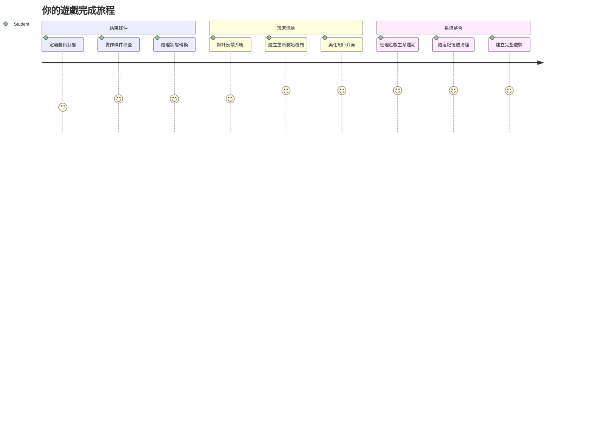
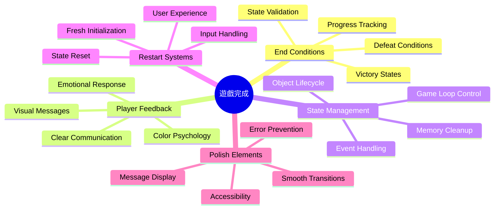
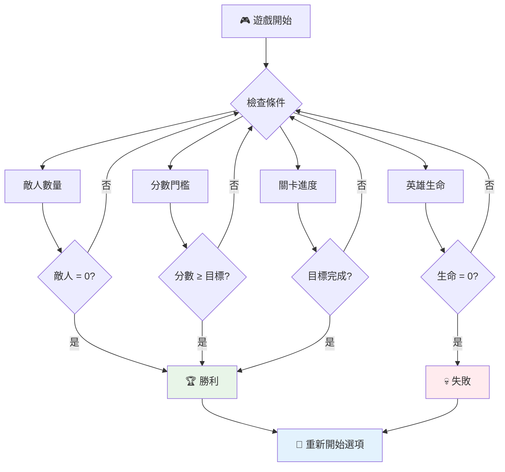
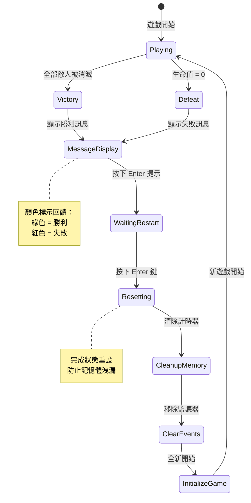
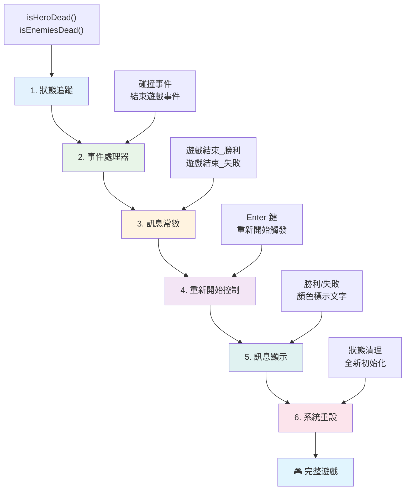
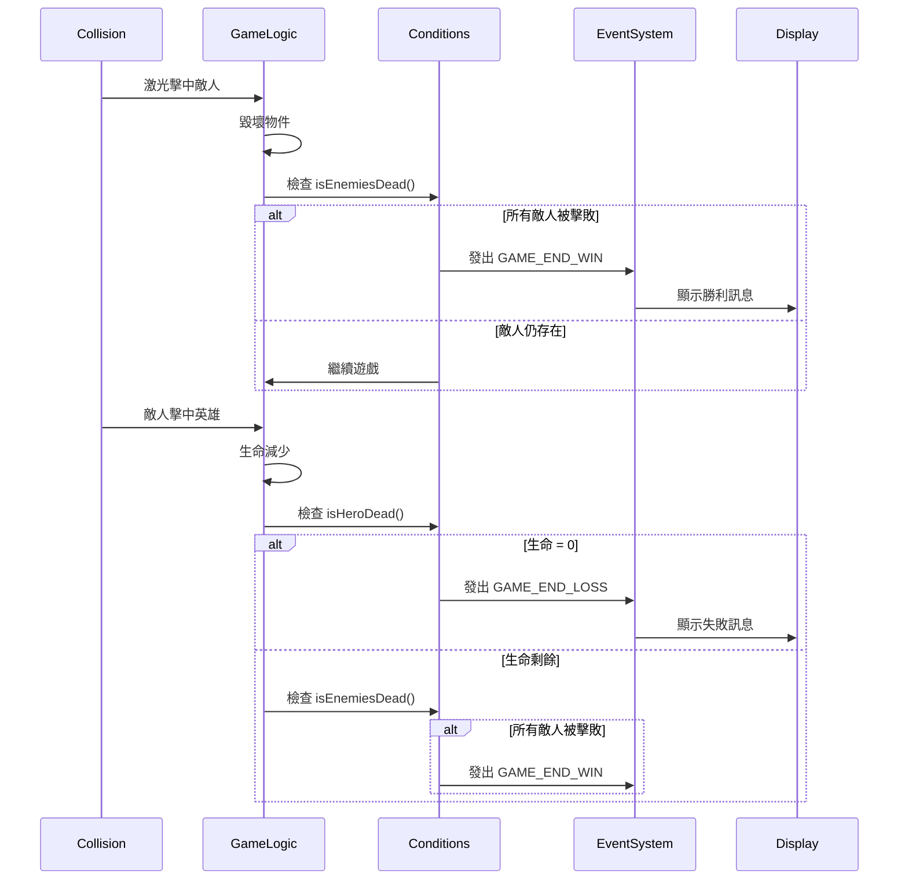
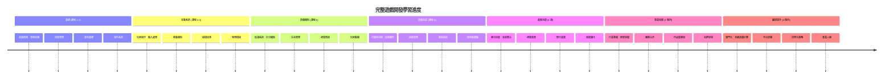

# 建立太空遊戲第6部分：結束與重新開始


每一款偉大的遊戲都需要明確的結束條件和流暢的重新開始機制。你已經建立了一款令人印象深刻的太空遊戲，有移動、戰鬥和計分——現在是時候加入最後的元素，讓它感覺完整了。

你的遊戲目前無限運行，就像1977年NASA發射的旅行者探測器——數十年後仍在太空中旅行。雖然這對太空探索來說沒問題，但遊戲需要明確的終點來創造令人滿意的體驗。

今天，我們將實現正確的勝利/失敗條件和重新開始系統。課程結束時，你會擁有一款經過精緻打磨，玩家可以完成並重玩，就像定義了媒介的經典街機遊戲一樣的遊戲。


## 課前小測

[課前小測](https://ff-quizzes.netlify.app/web/quiz/39)

## 理解遊戲結束條件

你的遊戲應該何時結束？這個基本問題自早期街機時代以來一直塑造著遊戲設計。吃豆人當你被鬼抓住或吃完所有豆子時結束，而太空侵略者當外星人到達底部或你消滅所有外星人時結束。

作為遊戲創作者，你定義勝利和失敗條件。對於我們的太空遊戲，以下是經證明能創造吸引人玩法的做法：


- **已摧毀 `N` 艘敵方飛船**：如果你將遊戲分成不同關卡，需要摧毀 `N` 艘敵方飛船才能完成該關是相當常見的  
- **你的飛船被摧毀**：確實有遊戲是飛船被摧毀就輸。另一個常見方式是有生命值概念。每次飛船被摧毀會扣一條命，當所有命都用完後你就輸了  
- **你已收集 `N` 分數**：另一個常見結束條件是你收集分數。你怎麼獲得分數取決於你，但通常會對摧毀敵人或收集被摧毀敵人掉落的物品給予分數  
- **完成一個關卡**：這可能包含多個條件，例如摧毀 `X` 艘敵人、收集 `Y` 分數或收集特定物品

## 實現遊戲重新開始功能

好的遊戲通過流暢的重新開始機制鼓勵重玩。當玩家結束遊戲（或失敗）時，他們通常想立即再試一次——無論是為了打破自己的紀錄還是提升表現。


俄羅斯方塊完美詮釋了這一點：當方塊堆到頂端，你可以立即開始新遊戲，無需瀏覽複雜的選單。我們將建立類似的重新開始系統，乾淨地重置遊戲狀態，讓玩家迅速回到遊戲中。

✅ **思考點**：想想你玩過的遊戲。它們在什麼條件下結束，並且如何提示你重新開始？什麼讓重新開始的體驗感覺流暢而不是令人沮喪？

## 你將建立什麼

你將實作最終功能，讓專案轉變為完整的遊戲體驗。這些元素讓精緻遊戲有別於基本原型。

**我們今天要加的東西：**

1. **勝利條件**：消滅所有敵人並有適當的慶祝（你應得的！）  
2. **失敗條件**：命盡時出現失敗畫面接受結果  
3. **重新開始機制**：按 Enter 立即重新開始—因為玩一次永遠不夠  
4. **狀態管理**：每次都是乾淨的起點——沒有殘留敵人或上局的怪異錯誤  

## 開始吧

讓我們準備你的開發環境。你應該已擁有前幾課的太空遊戲所有檔案。

**你的專案應該長這樣：**

```bash
-| assets
  -| enemyShip.png
  -| player.png
  -| laserRed.png
  -| life.png
-| index.html
-| app.js
-| package.json
```
  
**啟動開發伺服器：**

```bash
cd your-work
npm start
```
  
**這個指令會：**  
- 啟動本地伺服器於 `http://localhost:5000`  
- 正確提供你的檔案  
- 讓你更改時自動重新整理  

打開瀏覽器進入 `http://localhost:5000`，確認遊戲在運行。你應該能移動、射擊及與敵人互動。確認後，我們就能進行實作了。

> 💡 **專家提示**：為避免 Visual Studio Code 警告，建議在檔案頂部宣告 `let gameLoopId;`，而非在 `window.onload` 函數內宣告。這符合現代JavaScript變數宣告最佳實踐。


## 實作步驟

### 步驟1：建立結束條件追蹤函數

我們需要函數監控遊戲何時結束。就像國際太空站經常監控關鍵系統一樣，這些函數會不斷檢查遊戲狀態。

```javascript
function isHeroDead() {
  return hero.life <= 0;
}

function isEnemiesDead() {
  const enemies = gameObjects.filter((go) => go.type === "Enemy" && !go.dead);
  return enemies.length === 0;
}
```
  
**幕後發生的事：**  
- **檢查**我們的主角是否已無命（好痛！）  
- **統計**還有多少敵人活著努力抵抗  
- **回傳**當戰場清空敵人時返回 `true`  
- **使用**簡單的真/假邏輯讓流程簡潔明瞭  
- **篩選**過所有遊戲物件尋找存活者  

### 步驟2：更新事件處理程序連結結束條件

現在將這些條件檢查連結到遊戲事件系統。每次發生碰撞時，遊戲會評估是否觸發結束條件。這會讓重要事件有即時反饋。


```javascript
eventEmitter.on(Messages.COLLISION_ENEMY_LASER, (_, { first, second }) => {
    first.dead = true;
    second.dead = true;
    hero.incrementPoints();

    if (isEnemiesDead()) {
      eventEmitter.emit(Messages.GAME_END_WIN);
    }
});

eventEmitter.on(Messages.COLLISION_ENEMY_HERO, (_, { enemy }) => {
    enemy.dead = true;
    hero.decrementLife();
    if (isHeroDead())  {
      eventEmitter.emit(Messages.GAME_END_LOSS);
      return; // 凱旋之前的損失
    }
    if (isEnemiesDead()) {
      eventEmitter.emit(Messages.GAME_END_WIN);
    }
});

eventEmitter.on(Messages.GAME_END_WIN, () => {
    endGame(true);
});
  
eventEmitter.on(Messages.GAME_END_LOSS, () => {
  endGame(false);
});
```
  
**發生了什麼事：**  
- **雷射射中敵人**：雙方消失，你獲得分數並檢查是否勝利  
- **敵人碰撞你**：你損失一條命，然後檢查是否還活著  
- **聰明排序**：先檢查失敗（沒有人想又贏又輸！）  
- **即時反應**：重要事件一發生，遊戲立刻知道  

### 步驟3：新增訊息常數

你需要為`Messages`常數物件新增訊息類型。這些常數有助於保持一致性並防止事件系統中打錯字。

```javascript
GAME_END_LOSS: "GAME_END_LOSS",
GAME_END_WIN: "GAME_END_WIN",
```
  
**於上文中我們：**  
- **新增**遊戲結束事件的常數以維持一致  
- **使用**清晰說明事件用途的名稱  
- **遵循**既有訊息類型命名慣例  

### 步驟4：實作重新開始控制

現在你將新增鍵盤控制，允許玩家重新開始遊戲。Enter 鍵是自然選擇，因為它通常與確認操作和開始新遊戲相關。

**將 Enter 鍵偵測加入現有 keydown 事件監聽器：**

```javascript
else if(evt.key === "Enter") {
   eventEmitter.emit(Messages.KEY_EVENT_ENTER);
}
```
  
**新增訊息常數：**

```javascript
KEY_EVENT_ENTER: "KEY_EVENT_ENTER",
```
  
**你需要知道的：**  
- **擴充**現有鍵盤事件處理系統  
- **使用**Enter 鍵作為重新開始觸發器，提供直覺使用體驗  
- **發出**自訂事件供遊戲其他部分監聽  
- **維持**與其他鍵盤控制相同的模式  

### 步驟5：建立訊息顯示系統

你的遊戲需要清晰地傳達結果給玩家。我們將建立訊息系統，用顏色區分勝敗狀態，類似早期電腦系統終端，綠色表示成功，紅色代表錯誤。

**建立 `displayMessage()` 函式：**

```javascript
function displayMessage(message, color = "red") {
  ctx.font = "30px Arial";
  ctx.fillStyle = color;
  ctx.textAlign = "center";
  ctx.fillText(message, canvas.width / 2, canvas.height / 2);
}
```
  
**步驟解析：**  
- **設定**字型大小及字體以利清楚閱讀  
- **應用**顏色參數，預設為紅色警告色  
- **將**文本在畫布中水平與垂直置中  
- **採用**現代JavaScript預設參數提供彈性調色  
- **利用**畫布2D上下文直接渲染文字  

**建立 `endGame()` 函式：**

```javascript
function endGame(win) {
  clearInterval(gameLoopId);

  // 設定延遲以確保任何待處理的渲染完成
  setTimeout(() => {
    ctx.clearRect(0, 0, canvas.width, canvas.height);
    ctx.fillStyle = "black";
    ctx.fillRect(0, 0, canvas.width, canvas.height);
    if (win) {
      displayMessage(
        "Victory!!! Pew Pew... - Press [Enter] to start a new game Captain Pew Pew",
        "green"
      );
    } else {
      displayMessage(
        "You died !!! Press [Enter] to start a new game Captain Pew Pew"
      );
    }
  }, 200)  
}
```
  
**此函式的功能：**  
- **凍結**所有動作——不再有移動的飛船或雷射  
- **暫停**200毫秒讓最後一幀完成繪製  
- **清空**畫面並用黑色繪底，營造戲劇效果  
- **依勝負顯示**不同訊息  
- **用顏色區分**好消息為綠色，壞消息為紅色  
- **指示**玩家如何重新開始  

### 🔄 **教學檢核點**  
**遊戲狀態管理**：在實作重置功能前，請確保你了解：  
- ✅ 結束條件如何創造明確的遊戲目標  
- ✅ 視覺回饋為何對玩家理解至關重要  
- ✅ 適當清理防止記憶體洩漏的重要性  
- ✅ 事件驅動架構如何實現乾淨的狀態轉換  

**快速自測**：如果重置時不清除事件監聽器會發生什麼？  
*答：記憶體洩漏及事件處理器重複導致不可預期行為*  

**遊戲設計原則**：你現在實作的包括：  
- **清晰目標**：玩家知道成功與失敗的定義  
- **即時反饋**：遊戲狀態變化即時傳遞  
- **使用者控制**：玩家準備好時能重新開始  
- **系統可靠性**：適當清理避免錯誤和效能問題  

### 步驟6：實作遊戲重置功能

重置系統需要完整清理當前遊戲狀態並初始化新遊戲。這確保玩家有乾淨起點，不會帶有上回遊戲的殘留資料。

**建立 `resetGame()` 函式：**

```javascript
function resetGame() {
  if (gameLoopId) {
    clearInterval(gameLoopId);
    eventEmitter.clear();
    initGame();
    gameLoopId = setInterval(() => {
      ctx.clearRect(0, 0, canvas.width, canvas.height);
      ctx.fillStyle = "black";
      ctx.fillRect(0, 0, canvas.width, canvas.height);
      drawPoints();
      drawLife();
      updateGameObjects();
      drawGameObjects(ctx);
    }, 100);
  }
}
```
  
**逐項解析：**  
- **確認**是否已有遊戲循環在執行，才進行重置  
- **清除**現有遊戲循環停止所有遊戲活動  
- **移除**所有事件監聽器以防記憶體洩漏  
- **重新初始化**遊戲狀態及相關物件變數  
- **啟動**新遊戲循環包含全部必要功能  
- **維持**每100毫秒一次的固定間隔，保證一致效能  

**將 Enter 鍵事件處理器加入你的 `initGame()` 函式：**

```javascript
eventEmitter.on(Messages.KEY_EVENT_ENTER, () => {
  resetGame();
});
```
  
**新增 `clear()` 方法到你的 EventEmitter 類別：**

```javascript
clear() {
  this.listeners = {};
}
```
  
**重點提醒：**  
- **連結**Enter鍵按下與遊戲重置功能  
- **在遊戲初始化時**註冊此事件監聽器  
- **提供**清理所有事件監聽器的乾淨方法  
- **防止**記憶體洩漏，重新遊戲間清空事件處理器  
- **將**監聽器物件重置成空狀態，利於後續初始化  

## 恭喜你！🎉

👽 💥 🚀 你成功從零建構一款完整遊戲。就像1970年代第一批電玩開發者一樣，你將一行行程式碼轉化為擁有正確遊戲機制與用戶回饋的互動體驗。🚀 💥 👽

**你已達成：**  
- **實作**完整的勝利與失敗條件並有使用者反饋  
- **建立**無縫的重新開始系統，支持持續遊玩  
- **設計**清晰視覺溝通呈現遊戲狀態  
- **管理**複雜的遊戲狀態轉換與清理  
- **組裝**所有組件成為一款可玩且流暢的遊戲  

### 🔄 **教學檢核點**  
**完整遊戲開發系統**：慶祝你掌握整個遊戲開發流程：  
- ✅ 結束條件如何創造令人滿意的玩家體驗？  
- ✅ 為何適當的狀態管理對遊戲穩定性至關重要？  
- ✅ 視覺回饋如何提升玩家理解？  
- ✅ 重新開始系統對玩家留存起什麼作用？  

**系統熟練**：你的完整遊戲展現了：  
- **全端遊戲開發**：從圖像到輸入到狀態管理  
- **專業架構**：事件驅動系統並有妥善清理  
- **使用者體驗設計**：清晰回饋和直覺控制  
- **效能優化**：高效率渲染與記憶體管理  
- **精緻與完整**：所有讓遊戲感覺完成的細節  

**業界技能**：你已實作：  
- **遊戲循環架構**：即時系統具持續穩定性  
- **事件驅動程式設計**：解耦能有效擴展系統  
- **狀態管理**：複雜資料處理與生命週期管理  
- **使用者介面設計**：清晰溝通與流暢操作  
- **測試與除錯**：反覆開發與問題解決  

### ⚡ **你接下來5分鐘能做的事**  
- [ ] 玩完整遊戲並測試所有勝利與失敗條件  
- [ ] 嘗試不同的結束條件參數  
- [ ] 加入 console.log 語句追蹤遊戲狀態變化  
- [ ] 與朋友分享遊戲，蒐集回饋  

### 🎯 **你這小時能完成的目標**  
- [ ] 完成課後測驗並反思你的遊戲開發歷程  
- [ ] 加入勝利與失敗狀態的音效效果  
- [ ] 實作額外結束條件，例如限時或獎勵目標  
- [ ] 創建不同難度關卡與不同敵人數量  
- [ ] 美化視覺呈現，改善字體與色彩  

### 📅 **你一週內的遊戲開發精修計畫**  
- [ ] 完成擴充版太空遊戲，有多重關卡與進度追蹤  
- [ ] 新增強化道具、不同敵人類型及特殊武器  
- [ ] 建立高分系統與持久化存儲  
- [ ] 設計使用者介面包含選單、設定及遊戲選項  
- [ ] 優化不同裝置和瀏覽器的效能  
- [ ] 將遊戲部署至網路並與社群分享  

### 🌟 **你的一個月遊戲開發職業路線**
- [ ] 製作多款完整遊戲，探索不同類型與機制
- [ ] 學習進階遊戲開發框架，如 Phaser 或 Three.js
- [ ] 參與開源遊戲開發專案
- [ ] 研讀遊戲設計原理與玩家心理學
- [ ] 建立展示你遊戲開發技能的作品集
- [ ] 與遊戲開發社群連結，持續學習

## 🎯 你的完整遊戲開發精通時間表


### 🛠️ 你的完整遊戲開發工具總結

完成這整個太空遊戲系列後，你已掌握：
- **遊戲架構**：事件驅動系統、遊戲循環與狀態管理
- **圖形程式設計**：Canvas API、精靈渲染與視覺特效
- **輸入系統**：鍵盤處理、碰撞偵測與回應式控制
- **遊戲設計**：玩家反饋、進程系統與吸引力機制
- **效能優化**：高效渲染、記憶體管理與幀率控制
- **使用者體驗**：清晰溝通、直覺控制與細節打磨
- **專業模式**：乾淨程式碼、除錯技巧與專案組織

**實務運用**：你的遊戲開發技能直接適用於：
- **互動網頁應用程式**：動態介面與即時系統
- **資料視覺化**：動畫圖表與互動圖形
- **教育科技**：遊戲化與引人入勝的學習體驗
- **行動開發**：觸控互動與效能優化
- **模擬軟體**：物理引擎與即時建模
- **創意產業**：互動藝術、娛樂與數位體驗

**獲得的專業技能**：你現在可以：
- **架構** 複雜互動系統從零開始
- **除錯** 使用系統性方法處理即時應用程式
- **優化** 效能，提供順暢用戶體驗
- **設計** 吸引人的使用者介面與互動模式
- **協作** 透過良好程式碼組織，有效參與技術專案

**掌握的遊戲開發概念**：
- **即時系統**：遊戲循環、幀率管理與效能
- **事件驅動架構**：解耦系統與訊息傳遞
- **狀態管理**：複雜資料處理和生命週期管理
- **使用者介面程式設計**：Canvas 圖形與響應式設計
- **遊戲設計理論**：玩家心理與吸引力機制

**下一階段**：你已準備好探索進階遊戲框架、3D 圖像、多玩家系統，或轉向專業遊戲開發職涯！

🌟 **成就解鎖**：你完成了一整趟遊戲開發旅程，並從零打造出專業品質的互動體驗！

**歡迎加入遊戲開發社群！** 🎮✨

## GitHub Copilot Agent 挑戰 🚀

使用 Agent 模式完成以下挑戰：

**說明：** 強化太空遊戲，實作關卡進程系統，難度逐級提升並有獎勵功能。

**提示：** 創建一個多關卡太空遊戲系統，每關有更多敵機且速度與血量提升。增加隨關數增加的分數倍率，並實現當敵機被摧毀時隨機出現的能力提升（如連發射擊或護盾）。加入關卡完成獎勵，並在螢幕上同時顯示當前關卡、現有分數與生命數。

在此了解更多關於 [agent 模式](https://code.visualstudio.com/blogs/2025/02/24/introducing-copilot-agent-mode)。

## 🚀 選擇性強化挑戰

**為你的遊戲加入音效**：透過音效提升遊戲體驗！可考慮新增：

- **玩家射擊時**的雷射聲
- **敵機被摧毀時**的爆炸聲
- **主角受傷時**的受擊聲
- **勝利時**的勝利音樂
- **失敗時**的失敗音效

**音效實作範例：**

```javascript
// 建立音訊物件
const laserSound = new Audio('assets/laser.wav');
const explosionSound = new Audio('assets/explosion.wav');

// 在遊戲事件期間播放聲音
function playLaserSound() {
  laserSound.currentTime = 0; // 重設到開始位置
  laserSound.play();
}
```

**你需要知道：**
- **建立** 不同音效的 Audio 物件
- **重置** `currentTime` 以允許快速連續播放聲音
- **處理** 瀏覽器自動播放政策，靠用戶互動觸發音效
- **管理** 音量與時間安排，提升遊戲體驗

> 💡 **學習資源**：探索此 [音效沙盒](https://www.w3schools.com/jsref/tryit.asp?filename=tryjsref_audio_play)，了解更多如何在 JavaScript 遊戲中實作音效。

## 課堂後小測驗

[課堂後小測驗](https://ff-quizzes.netlify.app/web/quiz/40)

## 複習與自學

你的任務是創作一款新的樣本遊戲，可以瀏覽一些有趣的遊戲，看看你想製作什麼類型的遊戲。

## 作業

[製作一款樣本遊戲](assignment.md)

---

<!-- CO-OP TRANSLATOR DISCLAIMER START -->
**免責聲明**：  
本文件乃使用 AI 翻譯服務 [Co-op Translator](https://github.com/Azure/co-op-translator) 進行翻譯。雖然我們致力於確保準確性，但請注意，自動翻譯可能包含錯誤或不準確之處。原始文件之母語版本應被視為權威來源。對於重要資訊，建議採用專業人工翻譯。本公司不對因使用此翻譯而引起之任何誤解或誤釋承擔責任。
<!-- CO-OP TRANSLATOR DISCLAIMER END -->