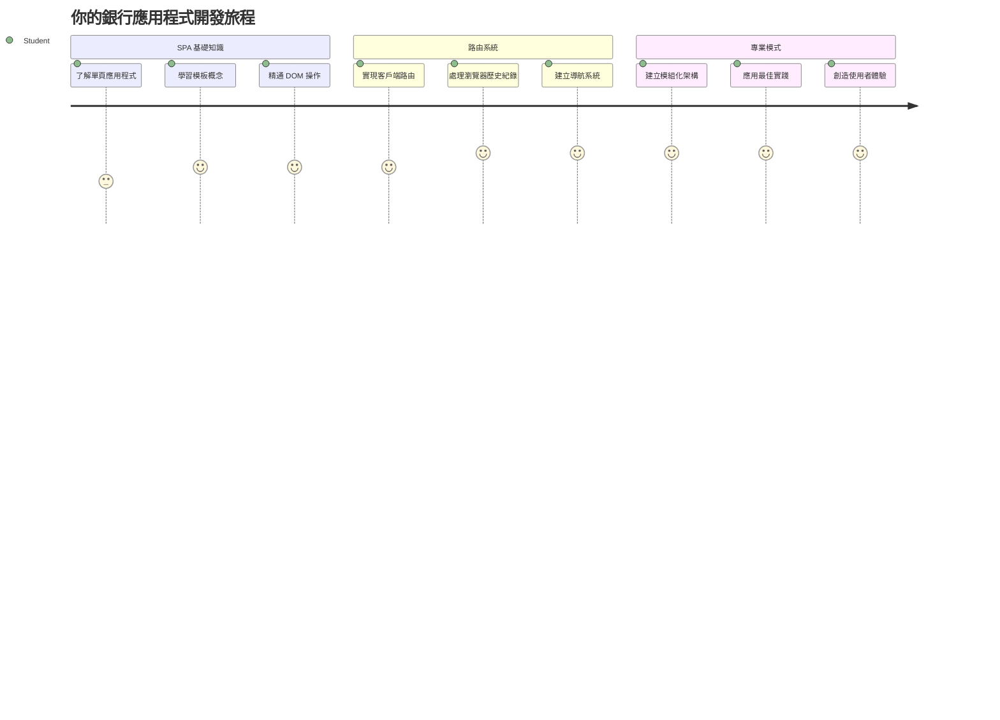
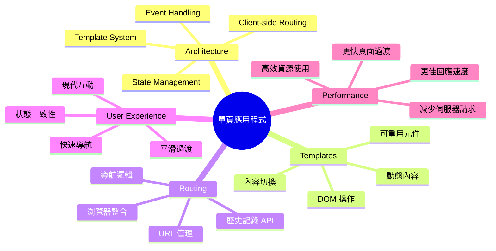
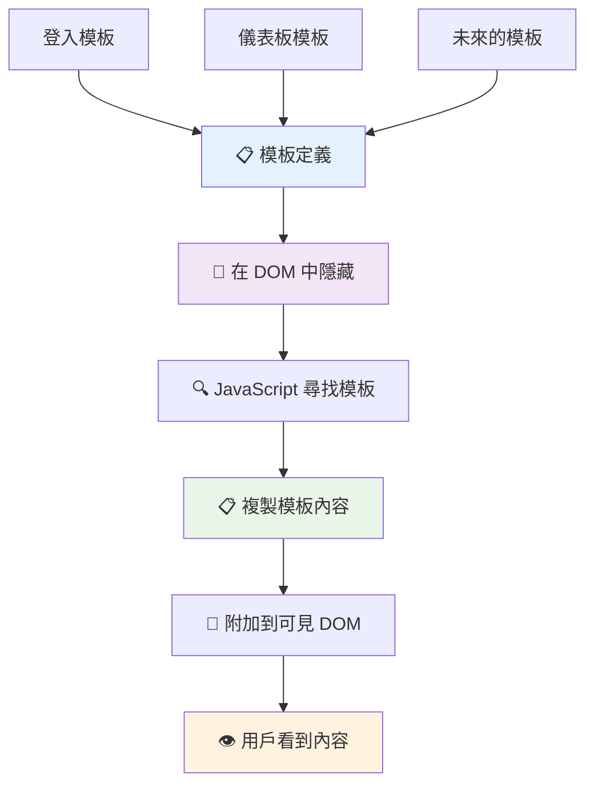
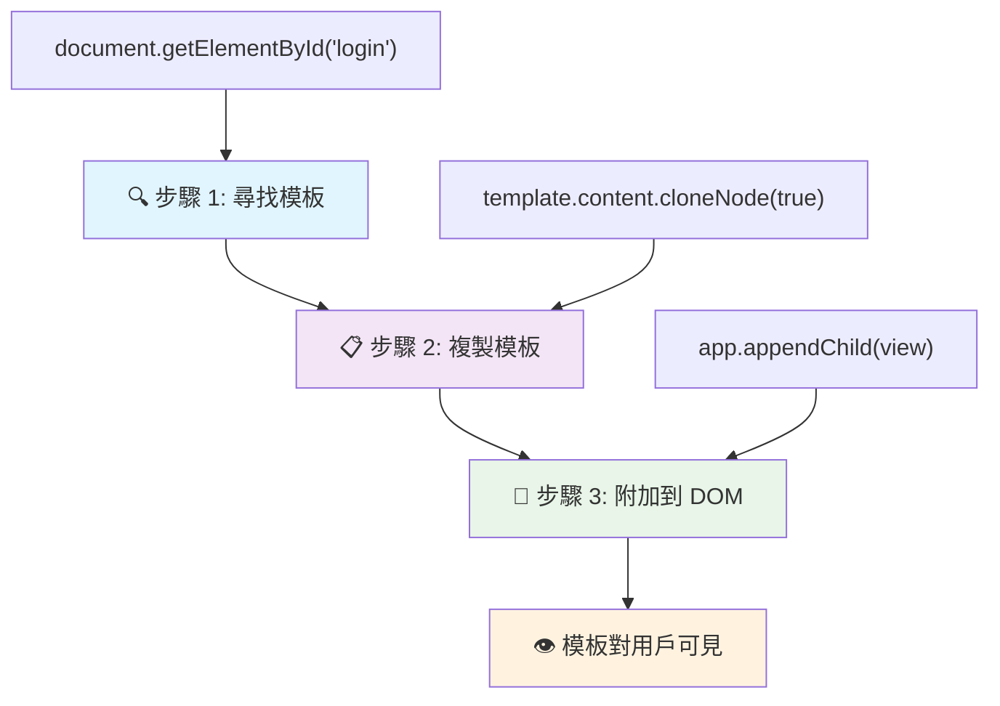
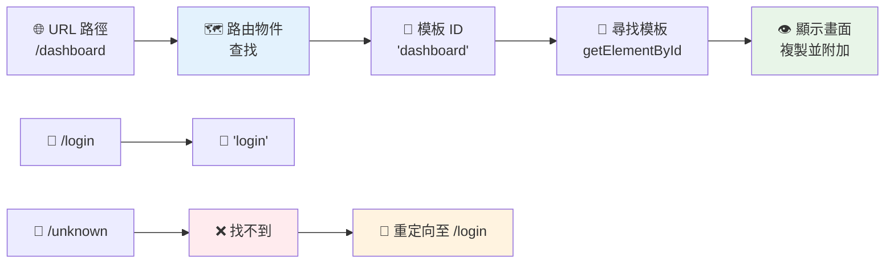
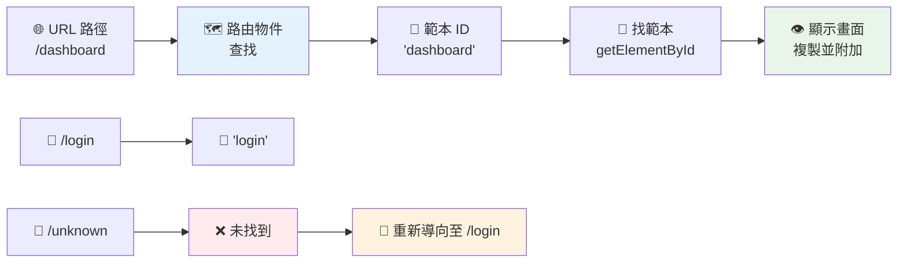
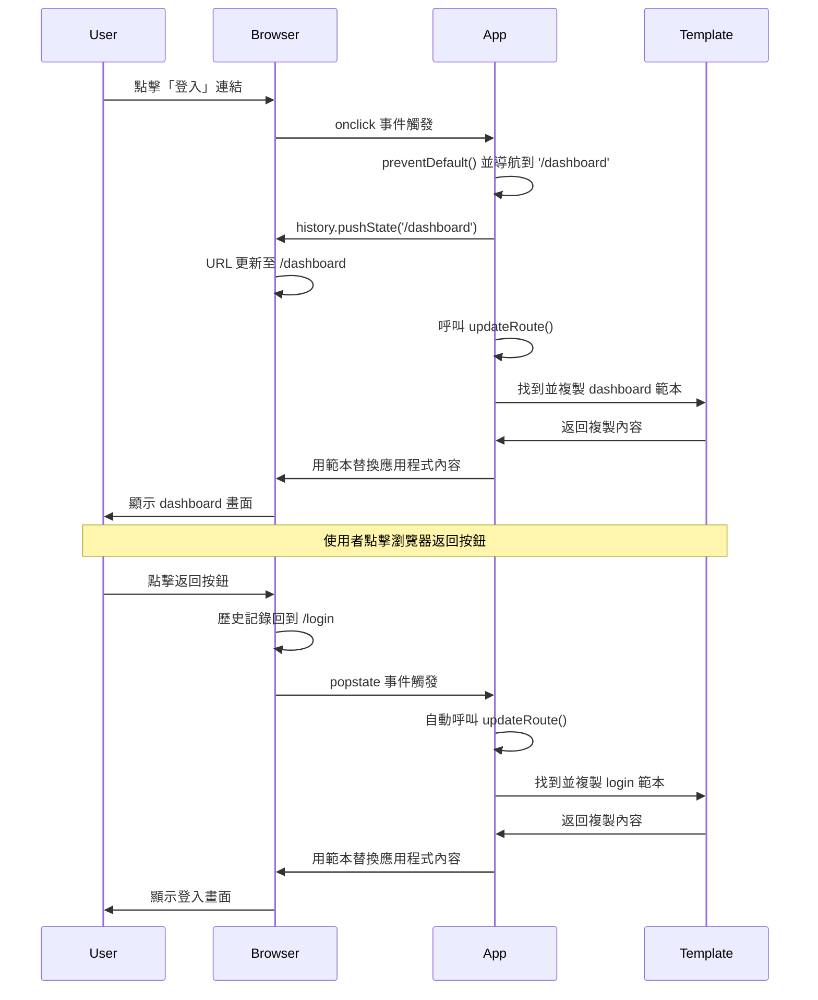
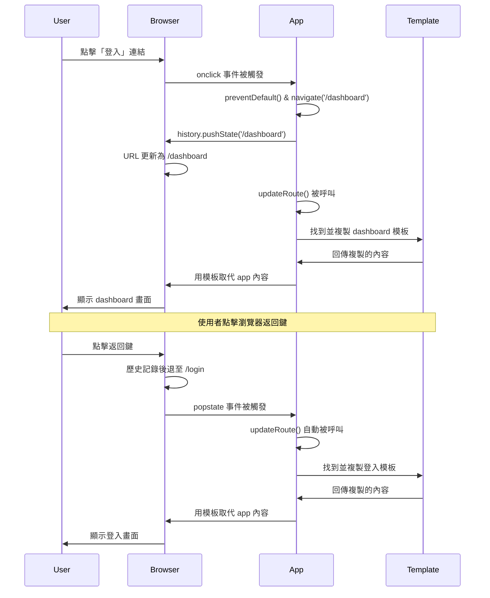
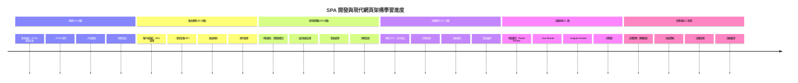

# 建構銀行應用程式第一部分：Web 應用程式中的 HTML 模板與路由


當阿波羅 11 號的導航電腦在 1969 年登月時，它必須在不同的程式間切換，而不重新啟動整個系統。現代的 Web 應用程式也是如此——在不重新載入整個頁面的情況下改變你所看到的內容。這便造就了使用者今天所期望的順暢且反應靈敏的體驗。

與傳統網站為每次互動重新載入整個頁面不同，現代 Web 應用程式只更新需要變更的部分。這種方法，就像任務控制中心在維持恆定通訊的同時切換不同的顯示內容一樣，創造出我們所期待的流暢體驗。

以下對比展示了差異的戲劇性：

| 傳統多頁應用程式 | 現代單頁應用程式 |
|----------------------------|-------------------------|
| **導覽** | 每個畫面均重新載入整頁 | 內容即時切換 |
| **效能** | 需完整下載 HTML，較慢 | 部分更新，較快 |
| **使用者體驗** | 頁面閃爍突兀 | 流暢、類似應用程式過渡效果 |
| **資料共享** | 不同頁面間困難 | 狀態管理容易 |
| **開發** | 需維護多個 HTML 檔案 | 單一 HTML 搭配動態模板 |

**了解演進：**
- **傳統應用程式** 每次切換頁面都需向伺服器發送請求
- **現代單頁應用(SPA)** 載入一次後用 JavaScript 動態更新內容
- **使用者期望** 是即時且無縫的互動體驗
- **效能優勢** 包括帶寬節省和更快速回應

在本課程中，我們將建構一個多畫面且流暢銜接的銀行應用程式。就像科學家使用可模組化的儀器，根據不同實驗重新配置一樣，我們將以 HTML 模板作為可重複使用的元件按需顯示。

你將使用 HTML 模板（不同畫面的可重複藍圖）、JavaScript 路由系統（切換畫面的機制），以及瀏覽器的歷史 API（保持返回按鍵正常運作）。這些是 React、Vue 和 Angular 等框架所用的基礎技術。

課程結束時，你將擁有一個示範專業單頁應用原則的工作銀行應用。


## 課前測驗

[課前測驗](https://ff-quizzes.netlify.app/web/quiz/41)

### 你需要準備的東西

我們需要一個本地 Web 伺服器來測試銀行應用程式——別擔心，這比聽起來簡單！如果你尚未設置，只要安裝 [Node.js](https://nodejs.org) 並在專案資料夾中執行 `npx lite-server` 指令。這條方便的指令會啟動一個本地伺服器並自動在瀏覽器打開你的應用程式。

### 預備工作

在你的電腦上，建立一個名為 `bank` 的資料夾，並在此資料夾內放入一個 `index.html` 檔案。我們會從這個 HTML [樣板](https://en.wikipedia.org/wiki/Boilerplate_code)開始：

```html
<!DOCTYPE html>
<html lang="en">
  <head>
    <meta charset="UTF-8">
    <meta name="viewport" content="width=device-width, initial-scale=1.0">
    <title>Bank App</title>
  </head>
  <body>
    <!-- This is where you'll work -->
  </body>
</html>
```

**這個樣板包含的內容說明：**
- **建立** HTML5 文件結構，並正確宣告 DOCTYPE
- **設定** 字元編碼為 UTF-8以支援國際文字
- **啟用** 透過 viewport meta 標籤實現響應式設計以兼容行動裝置
- **設定** 一個描述性標題，會顯示在瀏覽器頁籤上
- **建立** 一個乾淨的 <body> 區域作為我們應用程式的基礎

> 📁 **專案結構預覽**
> 
> **完成本課程後，你的專案會包含：**
> ```
> bank/
> ├── index.html      <!-- Main HTML with templates -->
> ├── app.js          <!-- Routing and navigation logic -->
> └── style.css       <!-- (Optional for future lessons) -->
> ```
> 
> **檔案功能說明：**
> - **index.html**：包含所有模板並建構應用架構
> - **app.js**：處理路由、導覽與模板管理
> - **Templates**：定義登入、儀表板及其他畫面的 UI

---

## HTML 模板

模板解決了 Web 開發中的一個基本問題。當 Gutenberg 在 1440 年代發明可動式活字印刷時，他發現不用刻整頁，而是可以製作可重用的字母字塊，並根據需要排列。HTML 模板也是同樣的原理——不用為每個畫面建立獨立的 HTML 檔，而是定義可重用結構，再在需要時顯示。


將模板想像成應用程式不同部分的藍圖。就像建築師繪製一個藍圖並多次使用，而不是重畫相同房間一樣，我們建立模板一次，需用時實例化。瀏覽器會將這些模板隱藏，直到 JavaScript 啟動它們。

如果你想為網頁建立多個畫面，一種解決方案是為每個畫面建立一個 HTML 檔。然而，這種做法有些不便：

- 切換畫面時必須重新載入整個 HTML，速度較慢。
- 不同畫面間共享資料困難。

另一種方法是只用一個 HTML 檔，並使用 `<template>` 元素定義多個 [HTML 模板](https://developer.mozilla.org/docs/Web/HTML/Element/template)。模板是瀏覽器不會直接顯示的可重用 HTML 區塊，需要用 JavaScript 在執行時實例化。

### 讓我們來建構

我們將建置一個銀行應用程式，有兩個主要畫面：登入頁與儀表板。先在 HTML 的 body 裡加入一個佔位元素——各種畫面會在此呈現：

```html
<div id="app">Loading...</div>
```

**說明這個佔位元素：**
- **建立** 一個 ID 為 "app" 的容器，用來顯示所有畫面
- **顯示** 載入中的訊息，直到 JavaScript 初始化第一個畫面
- **提供** 動態內容的單一掛載點
- **方便** JavaScript 透過 `document.getElementById()` 目標定位

> 💡 **小技巧**：因為這個元素的內容會被替換，我們可以放入載入訊息或指示器，在應用載入時顯示。

接著，在 HTML 裡添加一個登入頁的模板。暫時只放一個標題與一個包含連結的區段，連結用來切換畫面。

```html
<template id="login">
  <h1>Bank App</h1>
  <section>
    <a href="/dashboard">Login</a>
  </section>
</template>
```

**解析這個登入模板內容：**
- **定義** 一個具唯一標識 ID 「login」的模板，供 JavaScript 選取
- **包含** 主要標題，確立應用品牌形象
- **使用** 語義化的 `<section>` 元素將相關內容分組
- **提供** 一個導向儀表板的導覽連結

然後我們新增另一個儀表板頁模板，包含下列不同區域：

- 標頭有標題與登出連結
- 顯示銀行帳戶當前餘額
- 以表格呈現交易清單

```html
<template id="dashboard">
  <header>
    <h1>Bank App</h1>
    <a href="/login">Logout</a>
  </header>
  <section>
    Balance: 100$
  </section>
  <section>
    <h2>Transactions</h2>
    <table>
      <thead>
        <tr>
          <th>Date</th>
          <th>Object</th>
          <th>Amount</th>
        </tr>
      </thead>
      <tbody></tbody>
    </table>
  </section>
</template>
```

**解析此儀表板各部分：**
- **使用** 語義化 `<header>` 元素結構頁面及導覽
- **在各畫面** 一致顯示應用標題以維持品牌識別
- **提供** 連結導回登入頁
- **顯示** 專門區域呈現帳戶餘額
- **運用** HTML 表格組織交易資料
- **定義** 表頭為日期、對象及金額欄位
- **表格主體** 保留空白，後續動態插入內容

> 💡 **小技巧**：製作 HTML 模板時，若想查看其呈現，可用 `<!-- -->` 將 `<template>` 和 `</template>` 標籤註解起來。

### 🔄 **教學檢測**
**模板系統理解**：在寫 JavaScript 前，確保你知道：
- ✅ 模板與一般 HTML 元素的不同
- ✅ 模板會被瀏覽器隱藏，直到 JavaScript 啟動
- ✅ 模板內使用語義化 HTML 結構的重要性
- ✅ 模板如何使 UI 元件可重用

**快速自測**：如果將 HTML 內容的 `<template>` 標籤移除會發生什麼？
*答：內容會立即顯示，失去模板功能*

**架構好處**：模板提供：
- **可重用性**：一次定義，多次實例
- **效能**：避免重複 HTML 解析
- **維護性**：集中管理 UI 結構
- **彈性**：動態內容切換

✅ 你認為為什麼模板用 `id` 屬性？可否用 class 代替？

## 用 JavaScript 讓模板活起來

現在我們要讓模板運作。就如 3D 印表機將數位藍圖打造出實體物品般，JavaScript 將我們隱藏的模板產生成可見且可互動的元素。

這個流程遵循三個固定步驟，是現代 Web 開發的基礎。理解這種模式後，你會在許多框架和程式庫中看到。

在瀏覽器嘗試目前 HTML 檔時，你會看到 `Loading...` 長時間停住，因為我們還沒加 JavaScript 來實例化並顯示 HTML 模板。

實例化模板一般三步：

1. 透過[`document.getElementById`](https://developer.mozilla.org/docs/Web/API/Document/getElementById) 取得 DOM 內模板元素。
2. 用 [`cloneNode`](https://developer.mozilla.org/docs/Web/API/Node/cloneNode) 複製模板內容。
3. 用 [`appendChild`](https://developer.mozilla.org/docs/Web/API/Node/appendChild) 將複製內容掛載到頁面中的可見元素下。


**步驟視覺解析：**
- **第 1 步** 找到隱藏的模板元素
- **第 2 步** 複製一份可以任意編輯的副本
- **第 3 步** 將副本插入可見頁面區域
- **結果** 是一個可互動的畫面呈現給使用者

✅ 為何要先複製再掛載？如果跳過這步驟會怎樣？

### 任務

在專案資料夾新建 `app.js`，並在 HTML `<head>` 區段引入：

```html
<script src="app.js" defer></script>
```

**理解這段 script 引入的重點：**
- **連結** JavaScript 檔與 HTML 文件
- **使用** `defer` 屬性確保腳本在 HTML 解析後執行
- **確保** DOM 元素完全載入後才能使用
- **符合** 現代腳本載入與效能最佳實踐

接著在 `app.js` 中創建一個 `updateRoute` 函式：

```js
function updateRoute(templateId) {
  const template = document.getElementById(templateId);
  const view = template.content.cloneNode(true);
  const app = document.getElementById('app');
  app.innerHTML = '';
  app.appendChild(view);
}
```

**一步步解釋：**
- **查找** 具有指定 ID 的模板元素
- **用** `cloneNode(true)` 建立該模板內容的深複製
- **尋找** 容器元素以顯示內容
- **清空** 容器中現有內容
- **插入** 複製的模板內容到可見的 DOM

接著用其中一個模板 ID 呼叫函式，看看結果。

```js
updateRoute('login');
```

**此函式呼叫達成：**
- **啟用** 傳入的登入模板 ID
- **展示** 如何以程式方式切換不同畫面
- **取代** 「Loading...」訊息呈現登入頁面

✅ 這段 `app.innerHTML = '';` 的目的為何？刪除後會如何？

## 建立路由

路由本質是將網址連結到正確內容。想像早期電話接線生使用交換台接通電話，他們接受來電請求並轉接到目的地。Web 路由類似，依 URL 請求決定該顯示什麼內容。


傳統上，Web 伺服器依不同 URL 傳回不同 HTML 檔案。由於我們建置單頁應用，需要用 JavaScript 自行管理路由。這讓我們能更好控制使用者體驗與效能。


**路由流程說明：**
- **URL 改變** 觸發查詢路由對應表
- **有效路由** 映射到特定模板 ID 以渲染畫面
- **無效路由** 採取後備行為避免破壞狀態
- **渲染模板** 依先前學習三步驟進行

Web 應用路由是指映射 **網址** 至應顯示的指定畫面。多頁網站由於檔案路徑反映在 URL 上，因此自動完成。例如，下列專案中的檔案：

```
mywebsite/index.html
mywebsite/login.html
mywebsite/admin/index.html
```

如果建立以 `mywebsite` 為根的 Web 伺服器，URL 映射會是：

```
https://site.com            --> mywebsite/index.html
https://site.com/login.html --> mywebsite/login.html
https://site.com/admin/     --> mywebsite/admin/index.html
```

但我們的 Web 應用使用單一 HTML 檔案包含所有畫面，故無法使用預設行為。必須手動建立此對照表，並用 JavaScript 更新顯示的模板。

### 任務

我們將用一個簡單物件實作 URL 路徑與模板間的 [映射](https://en.wikipedia.org/wiki/Associative_array)。在 `app.js` 頂部新增此物件。

```js
const routes = {
  '/login': { templateId: 'login' },
  '/dashboard': { templateId: 'dashboard' },
};
```

**解讀此路由設定：**
- **定義** URL 路徑與模板識別 ID 的映射
- **用** 物件鍵值對，鍵為路徑，值包含模板資訊
- **方便** 查詢指定 URL 應使用何模板
- **提供** 擴充路由的彈性結構
現在讓我們稍微修改一下 `updateRoute` 函數。我們不會直接傳遞 `templateId` 作為參數，而是先從目前的 URL 中取出它，然後使用我們的映射來取得對應的 template ID 值。我們可以使用 [`window.location.pathname`](https://developer.mozilla.org/docs/Web/API/Location/pathname) 只取得 URL 中的路徑部分。

```js
function updateRoute() {
  const path = window.location.pathname;
  const route = routes[path];

  const template = document.getElementById(route.templateId);
  const view = template.content.cloneNode(true);
  const app = document.getElementById('app');
  app.innerHTML = '';
  app.appendChild(view);
}
```

**拆解這裡發生的事情：**
- **擷取** 瀏覽器 URL 中的當前路徑，使用 `window.location.pathname`
- **查找** 在我們的 routes 物件中對應的路由配置
- **取得** 路由配置中的 template ID
- **按照** 之前相同的模板渲染流程進行
- **創建** 一個能響應 URL 變化的動態系統

這裡我們將宣告的路由映射到對應的模板。你可以試著在瀏覽器手動更改 URL，看看它是否能正常工作。

✅ 輸入一個未知路徑到 URL 中會發生什麼？我們該怎麼解決這個問題？

## 新增導覽功能

建立路由後，用戶需要一種方式在應用程式中導航。傳統網站點擊連結會重新載入整個頁面，但我們想在不刷新頁面的情況下同時更新 URL 和內容。這樣會帶來更流暢的體驗，類似桌面應用程式在不同視圖間切換。

我們需要協調兩件事：更新瀏覽器的 URL，讓用戶能書籤頁面並分享連結，以及顯示適當的內容。正確實作時，這能創造出用戶對現代應用程式所期待的無縫導航體驗。


### 🔄 **學習自我檢視**
**單頁應用架構**：驗證你對完整系統的理解：
- ✅ 用戶端路由與傳統伺服器端路由有什麼不同？
- ✅ 為什麼 History API 對於正確的 SPA 導航至關重要？
- ✅ 模板如何在不重新載入頁面下實現動態內容？
- ✅ 事件處理在攔截導航中扮演什麼角色？

**系統整合**：你的 SPA 展示了：
- **模板管理**：可重用的 UI 元件與動態內容
- **用戶端路由**：不用伺服器請求進行 URL 管理
- **事件驅動架構**：響應式導航和用戶互動
- **瀏覽器整合**：正確支持歷史和前進/返回按鈕
- **效能優化**：快速切換與降低伺服器負擔

**專業模式**：你已實作：
- **模型-視圖分離**：模板與應用邏輯分開
- **狀態管理**：URL 狀態與顯示內容同步
- **漸進增強**：JavaScript 強化基本 HTML 功能
- **用戶體驗**：沒有頁面重新載入的流暢應用導航

> � **架構見解**：導航系統組件
>
> **你正在建立的：**
> - **🔄 URL 管理**：更新瀏覽器地址欄且無須重新載入頁面
> - **📋 模板系統**：根據當前路由動態切換內容  
> - **📚 歷史紀錄整合**：維持瀏覽器前進/返回按鈕功能
> - **🛡️ 錯誤處理**：無效或缺失路由的優雅回退
>
> **組件如何協同工作：**
> - **監聽** 導航事件（點擊、歷史變更）
> - **使用** History API 更新 URL
> - **渲染** 新路由的對應模板
> - **維持** 用戶體驗的流暢性

下一步，我們的應用程式要新增能自動切換頁面而不用手動更改 URL 的能力。這包含兩件事：

  1. 更新目前的 URL
  2. 根據新 URL 更新呈現的模板

第二點我們已用 `updateRoute` 函式處理完了，現在要想想怎麼更新目前的 URL。

我們需要用 JavaScript，特別是 [`history.pushState`](https://developer.mozilla.org/docs/Web/API/History/pushState)，它允許更新 URL 並在瀏覽歷史中創建新條目，而不重新載入 HTML。

> ⚠️ **重要提示**：雖然 HTML 超連結元素 [`<a href>`](https://developer.mozilla.org/docs/Web/HTML/Element/a) 可獨立用來建立指向不同 URL 的鏈結，但預設會讓瀏覽器重新載入 HTML。用自訂 JavaScript 處理路由時，必須用點擊事件的 preventDefault() 方法阻止此行為。

### 任務

我們來建立一個可以在應用中導航的新函式：

```js
function navigate(path) {
  window.history.pushState({}, path, path);
  updateRoute();
}
```

**理解這個導航函式：**
- **更新** 瀏覽器 URL 至新路徑，使用 `history.pushState`
- **新增** 條目到瀏覽器歷史堆疊，支援前進/返回按鈕
- **觸發** `updateRoute()` 函式來呈現對應模板
- **維持** 單頁應用體驗，不重新載入頁面

此方法會先根據給定路徑更新目前 URL，再更新模板。`window.location.origin` 屬性返回 URL 根部，讓我們能從路徑重建完整 URL。

現在我們有這個函式了，可以解決路徑找不到匹配時的問題。我們會修改 `updateRoute` 函式，在找不到路由時回退到某個現有路由。

```js
function updateRoute() {
  const path = window.location.pathname;
  const route = routes[path];

  if (!route) {
    return navigate('/login');
  }

  const template = document.getElementById(route.templateId);
  const view = template.content.cloneNode(true);
  const app = document.getElementById('app');
  app.innerHTML = '';
  app.appendChild(view);
}
```

**重點回顧：**
- **檢查** 當前路徑是否有對應路由
- **無效路由時** 重定向到登入頁面
- **提供** 回退機制防止導航錯誤
- **確保** 用戶即使 URL 錯誤仍看到有效畫面

找不到路由時，我們現在會導向 `login` 頁面。

接著建立一個函式，當點擊連結時取得 URL，並阻止瀏覽器的預設跳轉行為：

```js
function onLinkClick(event) {
  event.preventDefault();
  navigate(event.target.href);
}
```

**拆解這個點擊處理器：**
- **用** `preventDefault()` 阻止瀏覽器預設連結行為
- **從** 被點擊連結元素取出目標 URL
- **調用** 自訂的導航函式，而非重新載入頁面
- **維持** 平滑的單頁應用體驗

```html
<a href="/dashboard" onclick="onLinkClick(event)">Login</a>
...
<a href="/login" onclick="onLinkClick(event)">Logout</a>
```

**這個 onclick 綁定的效果：**
- **將** 每個連結與自訂導航系統連結起來
- **將** 點擊事件傳給 `onLinkClick` 函式處理
- **實現** 無頁面重新載入的平滑導航
- **保持** 適當的 URL 結構，方便用戶書籤或分享

[`onclick`](https://developer.mozilla.org/docs/Web/API/GlobalEventHandlers/onclick) 屬性綁定 `click` 事件到 JavaScript 程式碼，這裡是呼叫 `navigate()` 函式。

試點擊這些連結，你應該能順利切換應用中不同頁面。

✅ `history.pushState` 方法屬於 HTML5 標準，在[所有現代瀏覽器](https://caniuse.com/?search=pushState)都有實作。如果你開發面向舊瀏覽器的網頁應用，有個技巧是用 [hash (`#`)](https://en.wikipedia.org/wiki/URI_fragment) 放在路徑前頭，能用普通超連結實現不重新載入頁面的路由，因為它本來用來做頁面內部連結。

## 讓前進和返回按鈕正常運作

前進和返回按鈕是瀏覽網頁的基礎，就像 NASA 任務控制員可以查看過去系統狀態一樣。用戶期望這些按鈕能正常運作，不然上下瀏覽體驗就會大亂。

我們的單頁應用需要額外設定才能支援這點。瀏覽器維護有歷史堆疊（我們一直在用 `history.pushState` 新增），但當用戶利用歷史導覽時，我們必須回應並更新顯示內容。


**重要互動點：**
- **用戶行為** 透過點擊或瀏覽器按鈕觸發導航
- **應用攔截** 超連結點擊防止頁面重載
- **History API** 管理 URL 變更與瀏覽歷史堆疊
- **模板** 提供每個畫面內容架構
- **事件監聽** 確保 app 回應所有導航類型

使用 `history.pushState` 會在瀏覽器導航歷史中新增條目。你可按住瀏覽器「返回按鈕」，會看到類似這樣的視窗：


若連按幾次返回按鈕，你會發現目前 URL 改變、歷史更新，但模板不斷顯示相同內容。

原因是應用程式不知道每次歷史變動時都該呼叫 `updateRoute()`。查看 [`history.pushState` 文件](https://developer.mozilla.org/docs/Web/API/History/pushState) 可知，若狀態改變－也就是換成另一 URL －會觸發 [`popstate`](https://developer.mozilla.org/docs/Web/API/Window/popstate_event) 事件。我們將用它來解決問題。

### 任務

為確保瀏覽器歷史變動時模板也跟著更新，我們要附加一個函式呼叫 `updateRoute()`。把它放在 `app.js` 檔案的底部：

```js
window.onpopstate = () => updateRoute();
updateRoute();
```

**理解這個歷史狀態整合：**
- **監聽** 使用者用瀏覽器按鈕導航時發生的 `popstate` 事件
- **使用** 箭頭函式簡潔寫法作為事件處理器
- **自動** 在歷史狀態變更時呼叫 `updateRoute()`
- **初始化** 頁面一載入就呼叫 `updateRoute()`
- **確保** 無論如何導航都呈現正確模板

> 💡 **專家提示**：我們這裡用 [箭頭函式](https://developer.mozilla.org/docs/Web/JavaScript/Reference/Functions/Arrow_functions)來宣告 `popstate` 事件處理函式，簡潔明瞭，但普通函式效果相同。

這裡有段箭頭函式的教學影片回顧：

[](https://youtube.com/watch?v=OP6eEbOj2sc "Arrow Functions")

> 🎥 點擊上方圖片觀看箭頭函式教學影片。

現在試著使用瀏覽器的返回與前進按鈕，檢查看看此次呈現的路由是否正確更新。

### ⚡ **接下來 5 分鐘你可以做**
- [ ] 使用瀏覽器返回/前進按鈕測試你的銀行應用導航
- [ ] 嘗試在位址欄手動輸入不同 URL 測試路由
- [ ] 開啟瀏覽器 DevTools，檢視模板如何被複製加入 DOM
- [ ] 嘗試加上 console.log 追蹤路由流程

### 🎯 **這小時能完成的事**
- [ ] 完成課後小測驗，理解 SPA 架構概念
- [ ] 加 CSS 美化銀行應用模板外觀
- [ ] 完成 404 頁面錯誤處理挑戰
- [ ] 實作附加路由功能的信用頁面挑戰
- [ ] 加入載入狀態與模板切換過場動畫

### 📅 **你的週長 SPA 開發旅程**
- [ ] 完成具表單、資料管理與持久化功能的完整銀行應用
- [ ] 增加高階路由功能，如路由參數、巢狀路由
- [ ] 實作導航守衛與基於身份驗證的路由
- [ ] 建立可重複使用的模板元件與元件庫
- [ ] 加動畫與過場提升使用體驗流暢度
- [ ] 部署 SPA 至托管平台並妥善設定路由

### 🌟 **你的月長前端架構高手養成**
- [ ] 使用 React、Vue 或 Angular 等現代框架構建複雜 SPA
- [ ] 學習高階狀態管理模式與函式庫
- [ ] 精通 SPA 開發的建構工具與開發流程
- [ ] 實作進階網頁應用 (PWA) 功能及離線支援
- [ ] 研習大型 SPA 的效能優化技巧
- [ ] 參與開源 SPA 專案並分享知識

## 🎯 你的單頁應用精通時間軸


### 🛠️ 你的 SPA 開發工具箱總結

完成本課程後，你已精通：
- **模板架構**：可重複使用的 HTML 元件與動態內容渲染
- **用戶端路由**：無需頁面重新載入的 URL 管理與導航
- **瀏覽器整合**：使用 History API 並支援返回／前進按鈕
- **事件驅動系統**：導航處理與用戶互動管理
- **DOM 操作**：模板複製、內容切換及元素管理
- **錯誤處理**：無效路由與缺失內容的優雅回退
- **效能模式**：高效的內容載入與渲染策略

**實務應用**：你的 SPA 開發技能直接適用於：
- **現代網頁應用**：React、Vue、Angular 等框架開發
- **進階網頁應用 (PWA)**：具離線能力與應用程式體驗
- **企業儀表板**：多視圖的複雜商業應用
- **電子商務平台**：商品目錄、購物車及結帳流程
- **內容管理**：動態內容建立與編輯介面
- **行動端開發**：使用網頁技術的混合應用

**專業技能掌握**：你現在可以：
- **架構** 單頁應用程式，並實現適當的關注點分離
- **實作** 可隨應用程式複雜度擴展的客戶端路由系統
- **除錯** 使用瀏覽器開發者工具偵錯複雜的導航流程
- **優化** 透過高效的模板管理提升應用程式效能
- **設計** 感覺原生且反應靈敏的使用者體驗

**掌握的前端開發概念**：
- **元件架構**：可重複使用的 UI 範式和模板系統
- **狀態同步**：URL 狀態管理與瀏覽器歷史紀錄
- **事件驅動程式設計**：使用者互動處理與導航
- **效能優化**：高效的 DOM 操作與內容載入
- **使用者體驗設計**：流暢過渡與直覺導航

**下一階段**：你已經準備好探索現代前端框架、高級狀態管理，或打造複雜的企業應用程式！

🌟 **成就解鎖**：你已建立專業的單頁應用程式基礎，採用現代網路架構模式！

---

## GitHub Copilot Agent 挑戰 🚀

使用 Agent 模式完成以下挑戰：

**描述：** 強化銀行應用程式，實作錯誤處理及 404 頁面模板，提升使用者瀏覽不存在頁面時的體驗。

**提示：** 建立一個 id 為 "not-found" 的新 HTML 模板，展示友善的 404 錯誤頁面並帶有樣式。接著修改 JavaScript 路由邏輯，在用戶瀏覽無效 URL 時顯示該模板，並新增一個「返回首頁」按鈕，點擊後導回登入頁面。

在此了解更多有關 [agent 模式](https://code.visualstudio.com/blogs/2025/02/24/introducing-copilot-agent-mode)。

## 🚀 挑戰

為第三個頁面新增一個模板與路由，該頁面用於顯示此應用程式的製作名單。

**挑戰目標：**
- **建立** 一個擁有適當內容架構的新 HTML 模板
- **將** 新路由加入你的路由設定物件
- **包含** 從及前往製作名單頁面的導航連結
- **測試** 確認所有導航與瀏覽器歷史操作正常

## 課後小測驗

[課後小測驗](https://ff-quizzes.netlify.app/web/quiz/42)

## 複習與自學

路由是 Web 開發中意外棘手的部分之一，尤其隨著網頁從頁面重新整理行為轉向單頁應用程式頁面更新。閱讀一下 [Azure 靜態 Web 應用服務](https://docs.microsoft.com/azure/static-web-apps/routes/?WT.mc_id=academic-77807-sagibbon) 如何處理路由。你能解釋為何該文件中描述的一些決策是必要的嗎？

**附加學習資源：**
- **探索** 流行框架如 React Router 與 Vue Router 如何實作客戶端路由
- **研究** hash 路由與 history API 路由的差異
- **了解** 伺服器端渲染 (SSR) 及其對路由策略的影響
- **調查** 進階網頁應用程式 (PWA) 如何處理路由與導航

## 作業

[改進路由](assignment.md)

---

<!-- CO-OP TRANSLATOR DISCLAIMER START -->
**免責聲明**：
本文件由人工智能翻譯服務 [Co-op Translator](https://github.com/Azure/co-op-translator) 所翻譯。雖然我們致力於提供準確的翻譯，請注意自動翻譯可能包含錯誤或不準確之處。原始文件的原文版本應被視為權威來源。對於關鍵資訊，建議尋求專業人工翻譯。我們不對使用本翻譯所引起的任何誤解或誤譯承擔責任。
<!-- CO-OP TRANSLATOR DISCLAIMER END -->