# 建立銀行應用程式 第3部分：擷取及使用資料的方法

想像《星艦迷航記》裡的星際企業號電腦——當皮卡爾艦長查詢船隻狀態時，資訊即時顯示，整個介面不會停頓或重新載入。我們要打造的，正是這種動態資料擷取的無縫資訊流。

目前你的銀行應用程式就像一份印刷報紙——資訊豐富但靜態。我們將其轉變成類似 NASA 任務控制中心，資料持續流動並即時更新，且不會打斷使用者的工作流程。

你將學習如何非同步與伺服器溝通，處理在不同時間到達的資料，並將原始資訊轉換為對用戶有意義的內容。這正是從示範軟體進入生產級軟體的關鍵差異。

## ⚡ 下一五分鐘你能做到什麼

**忙碌開發者的快速啟動路徑**

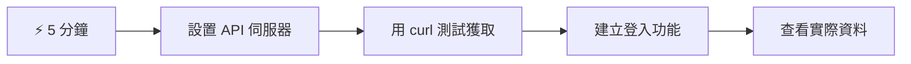
- **第1-2分鐘**：啟動你的 API 伺服器（`cd api && npm start`）並測試連線
- **第3分鐘**：使用 fetch 建立基本的 `getAccount()` 函數
- **第4分鐘**：使用 `action="javascript:login()"` 連接登入表單
- **第5分鐘**：測試登入，觀察帳戶資料在控制台顯示

**快速測試指令**：
```bash
# 驗證 API 是否正在運行
curl http://localhost:5000/api

# 測試帳戶資料擷取
curl http://localhost:5000/api/accounts/test
```

**重要原因**：五分鐘內你會見識到非同步資料擷取的魔力，這是現代所有網頁應用程式的核心。它是讓應用程式感覺迅速且生動的基石。

## 🗺️ 你的資料驅動網頁應用程式學習之旅

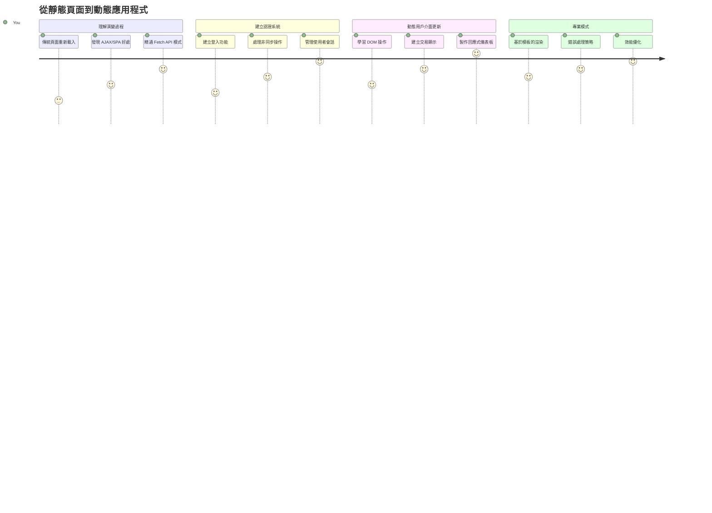
**旅程終點**：課程結束後，你將理解現代網頁應用如何動態擷取、處理並顯示資料，打造專業級軟體所期望的順暢用戶體驗。

## 課前測驗

[課前測驗](https://ff-quizzes.netlify.app/web/quiz/45)

### 先備條件

在深入資料擷取前，請確保具備以下元件：

- **上一課**：完成[登入與註冊表單](../2-forms/README.md)——我們將在此基礎上繼續擴充
- **本地伺服器**：安裝 [Node.js](https://nodejs.org) 並[啟動 API 伺服器](../api/README.md)，以提供帳戶資料
- **API 連線**：用以下指令測試伺服器連線：

```bash
curl http://localhost:5000/api
# 預期回應: "Bank API v1.0.0"
```

這個快速測試能確保各元件正常通訊：
- 確認 Node.js 在系統中正確運作
- 確認 API 伺服器活躍並有回應
- 驗證你的應用程式能連線到伺服器（就像任務前確保無線電聯繫）

## 🧠 資料管理生態系統概覽

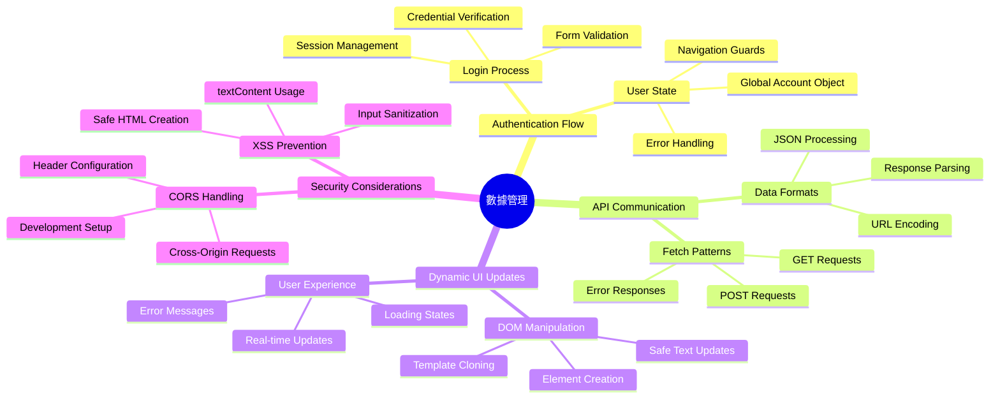
**核心原則**：現代網頁應用是資料協調系統——它協調使用者介面、伺服器 API 與瀏覽器安全模型，創造順暢且回應迅速的體驗。

---

## 了解現代網頁應用的資料擷取

網頁應用處理資料的方式在過去二十年大幅演進。了解這個演變有助於你體會為什麼 AJAX 與 Fetch API 如此強大，並成為網頁開發必備工具。

讓我們來探索傳統網站與現代動態、反應式應用的不同。

### 傳統多頁面應用 (Multi-Page Applications, MPA)

早期網頁時代，每次點擊就像換電視台頻道——畫面會變空白，然後慢慢載入新內容。這是早期網頁應用的現實：每次操作都要重建整個頁面。

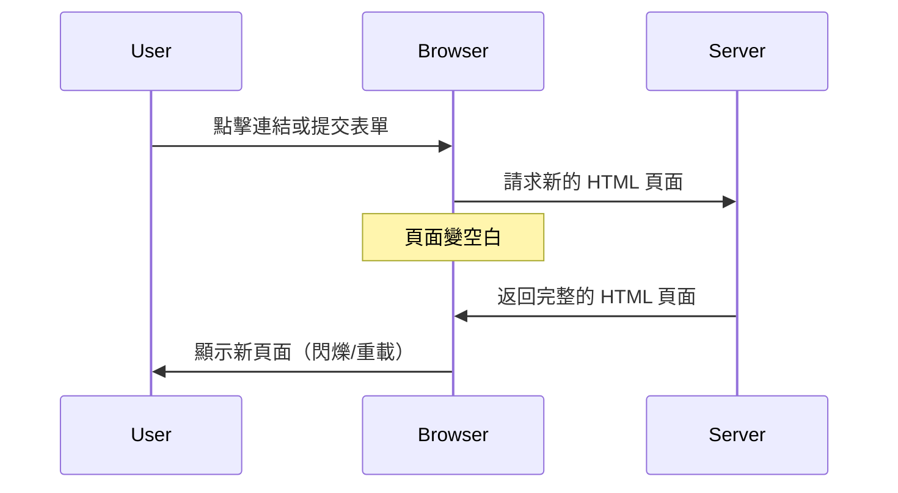


**這方法令人覺得笨拙的原因：**
- 每次點擊都重建整個頁面
- 使用者在操作過程中會被刺眼的頁面閃爍打斷
- 網路頻寬無謂地重複下載相同標頭與頁腳
- 應用程式感覺像是在翻閱資料櫃，而非使用軟體

### 現代單頁應用 (Single-Page Applications, SPA)

AJAX（非同步 JavaScript 與 XML）完全改變了這個模式。就像國際太空站的模組化設計，太空人可以更換單一組件而不用重建整個結構，AJAX 允許我們只更新頁面特定部分，而不重新載入全部。雖然名字包含 XML，但現在我們多用 JSON，核心概念是不變的：只更新需要更改的部分。

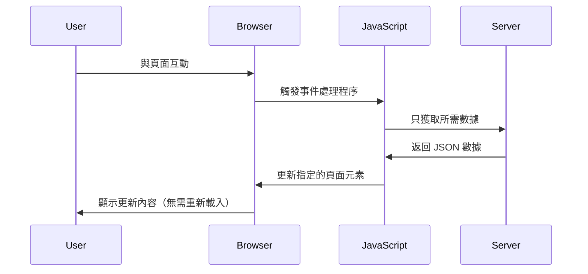
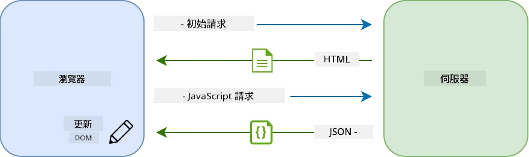

**SPA 感覺更好的原因：**
- 只更新實際改變的部分（很聰明吧？）
- 不會有突兀的中斷，使用者流程順暢
- 傳輸資料量降低，載入更快
- 互動回應迅速，彷彿手機應用程式一般

### 演進至現代 Fetch API

現代瀏覽器提供了 [`Fetch` API](https://developer.mozilla.org/docs/Web/API/Fetch_API)，取代舊有的 [`XMLHttpRequest`](https://developer.mozilla.org/docs/Web/API/XMLHttpRequest/Using_XMLHttpRequest)。像用電報到電子郵件的差異，Fetch API 使用 promises提供更乾淨的非同步程式碼，且天然支援 JSON。

| 功能 | XMLHttpRequest | Fetch API |
|---------|----------------|----------|
| **語法** | 複雜的回呼函式 | 簡潔的 promise 用法 |
| **JSON 處理** | 需手動解析 | 內建 `.json()` 方法 |
| **錯誤處理** | 錯誤訊息有限 | 詳盡的錯誤資訊 |
| **現代支援** | 舊版相容性 | ES6+ promises 與 async/await |

> 💡 **瀏覽器相容性**：好消息是 Fetch API 支援所有現代瀏覽器！若想了解詳細版本支援，[caniuse.com](https://caniuse.com/fetch) 有完整資料。
> 
**總結：**
- 在 Chrome、Firefox、Safari 及 Edge 運作良好（基本涵蓋所有用戶）
- 只有 Internet Explorer 需要額外處理（坦白說，該淘汰 IE 了）
- 完美支持我們稍後會用的 async/await 非同步語法模式

### 實作使用者登入及資料擷取

現在來實作登入系統，將你的銀行應用從靜態顯示轉為功能完整的應用。就像軍事安全設施使用的驗證協定，我們會檢查使用者資格，然後提供專屬資料。

我們會逐步建立，從基本身份驗證開始，接著加入資料擷取功能。

#### 步驟1：建立登入函數基礎

開啟你的 `app.js`，新增 `login` 函數，處理使用者驗證流程：

```javascript
async function login() {
  const loginForm = document.getElementById('loginForm');
  const user = loginForm.user.value;
}
```

**解析說明：**
- `async` 關鍵字表示這函式可能需要等待非同步操作結束
- 我們從頁面抓取登入表單（簡單，直接用 ID 找）
- 擷取使用者輸入的帳號名稱
- 小技巧：可以用表單控制元件的 `name` 屬性直接存取輸入欄位，不用頻繁用 getElementById！

> 💡 **表單存取模式**：每個表單控制元件都能用 HTML 中 `name` 屬性作為表單物件的屬性取得，讓讀取表單資料簡潔易懂。

#### 步驟2：建立帳戶資料擷取函數

接著我們建立專門的函數從伺服器取回帳戶資料。這和你的註冊函數類似，但重點放在取得資料：

```javascript
async function getAccount(user) {
  try {
    const response = await fetch('//localhost:5000/api/accounts/' + encodeURIComponent(user));
    return await response.json();
  } catch (error) {
    return { error: error.message || 'Unknown error' };
  }
}
```

**這段程式碼做了什麼：**
- **使用** 現代 `fetch` API 進行非同步資料請求
- **組裝** GET 請求 URL 並帶入帳號參數
- **套用** `encodeURIComponent()` 確保網址安全處理特殊字元
- **轉換** 回應為 JSON 格式方便操作
- **妥善** 處理錯誤，回傳錯誤物件而非崩潰

> ⚠️ **安全提示**：`encodeURIComponent()` 函數會處理網址中特殊字元。像海軍通訊的編碼系統，確保訊息準確無誤地傳達，避免 "#" 或 "&" 等字元被誤解。
> 
**重要性：**
- 避免特殊字元破壞 URL 格式
- 防止網址遭竄改攻擊
- 確保伺服器接收正確資料
- 遵循安全編碼最佳實踐

#### 了解 HTTP GET 請求

這裡有個可能令你驚訝的事：當你使用 `fetch` 而沒有傳入特別設定，預設會是 [`GET`](https://developer.mozilla.org/docs/Web/HTTP/Methods/GET) 請求。非常適合我們的需求——向伺服器請求看某使用者帳戶資料。

想像 GET 請求像是禮貌地向圖書館借書——請求檢視已存在資料。而 POST 請求（註冊時用的）則像送新書加入館藏。

| GET 請求 | POST 請求 |
|-------------|-------------|
| **目的** | 取得現有資料 | 傳送新資料到伺服器 |
| **參數** | 在網址路徑/查詢字串 | 在請求主體中 |
| **快取** | 可被瀏覽器快取 | 通常不快取 |
| **安全性** | 顯示於網址/紀錄中 | 隱藏在請求主體 |

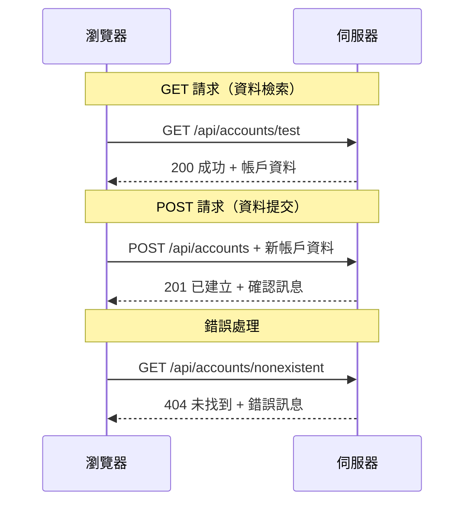
#### 步驟3：彙整整合

現在來一段令人滿意的串連程式，將帳戶擷取函數接入登入流程：

```javascript
async function login() {
  const loginForm = document.getElementById('loginForm');
  const user = loginForm.user.value;
  const data = await getAccount(user);

  if (data.error) {
    return console.log('loginError', data.error);
  }

  account = data;
  navigate('/dashboard');
}
```

這個函數依序執行：
- 從表單取得使用者帳號
- 向伺服器索取該帳號的資料
- 處理過程中可能出現的錯誤
- 成功時存儲帳戶資料並跳轉至儀表板

> 🎯 **Async/Await 範式**：因為 `getAccount` 是非同步函式，我們用 `await` 暫停程式執行，直到伺服器有回應，避免後續使用未定義資料。

#### 步驟4：為資料打造存放處

應用程式需要記憶讀入的帳戶資訊，像短期記憶一樣，保持目前登入用戶資料隨時可用。在 `app.js` 檔案上方加這行：

```javascript
// 儲存當前用戶的帳戶資料
let account = null;
```

**為什麼需要它：**
- 讓整個應用程式能隨時存取帳戶資料
- 初始設為 `null` 表示「尚未有人登入」
- 當有人成功登入或註冊時更新其內容
- 作為唯一資料來源，避免登入狀態混淆

#### 步驟5：連接表單與功能

接著將你的登入新功能連結到 HTML 表單，修改表單標籤如下：

```html
<form id="loginForm" action="javascript:login()">
  <!-- Your existing form inputs -->
</form>
```

**這個小改動帶來的效果：**
- 阻止表單預設的「整頁重新載入」動作
- 改由自訂的 JavaScript 函數處理
- 保持單頁應用的平滑體驗
- 完全控制使用者按下「登入」的行為

#### 步驟6：增強註冊功能

為保持一致性，更新你的 `register` 函式，也讓它存取帳戶資料並跳轉到儀表板：

```javascript
// 將這些行添加到您的註冊功能的末尾
account = result;
navigate('/dashboard');
```

**這項優化帶來：**
- 註冊完成無縫轉到儀表板
- 登入與註冊流程體驗一致
- 成功註冊後立即取得帳戶資料

#### 測試你的實作

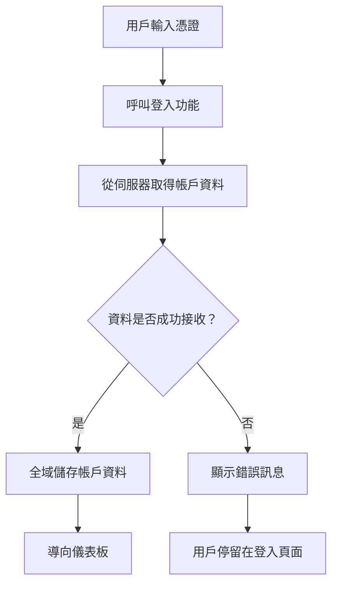
**現在試運行：**
1. 建立新帳戶，確認流程正常
2. 使用同樣的憑證嘗試登入
3. 如有異常，打開瀏覽器控制台（F12）檢查
4. 確認成功登入後進入儀表板頁面

遇到問題別慌，多數情況下是簡單錯誤或忘了啟動 API 伺服器。

#### 跨來源通訊的小秘密

你可能會想：「我的網頁應用跟 API 伺服器分別跑在不同埠口，怎能互通？」好問題！這是所有網頁開發者都會遇到的話題。

> 🔒 **跨來源安全政策**：瀏覽器強制執行「同源政策」以防止未授權跨域通訊，就像五角大廈的檢查站，核對通訊是否授權後才允許資料傳送。
> 
**本示範設定：**
- 你的網頁應用運行於 `localhost:3000`（開發伺服器）
- API 伺服器運行於 `localhost:5000`（後端伺服器）
- API 伺服器包含 [CORS 標頭](https://developer.mozilla.org/docs/Web/HTTP/CORS) 明確授權來自網頁應用的通訊

這種架構與實務開發情境相符，前後端通常分別部署於不同伺服器。

> 📚 **擴充學習**：深入瞭解 API 與資料擷取，請參考 Microsoft Learn 的完整 [API 課程](https://docs.microsoft.com/learn/modules/use-apis-discover-museum-art/?WT.mc_id=academic-77807-sagibbon)。

## 將資料動態呈現在 HTML 中

現在我們透過 DOM 操控將擷取的資料呈現給使用者。就像洗相片暗房的過程，我們將看不見的資料轉成使用者可見且可互動的內容。
DOM 操作是將靜態網頁轉換成動態應用程式的技術，能根據用戶互動和伺服器回應更新內容。

### 選擇合適的工具完成工作

在使用 JavaScript 更新 HTML 時，你有幾個選擇。把它們想成工具箱中的不同工具—每一個都適合特定工作：

| 方法 | 適合用途 | 何時使用 | 安全程度 |
|--------|---------------------|----------------|--------------|
| `textContent` | 安全顯示用戶資料 | 任何顯示文字時 | ✅ 非常穩固 |
| `createElement()` + `append()` | 建立複雜排版 | 新增區域/清單時 | ✅ 可靠無虞 |
| `innerHTML` | 設定 HTML 內容 | ⚠️ 建議盡量避免 | ❌ 有風險 |

#### 安全顯示文字：textContent

[`textContent`](https://developer.mozilla.org/docs/Web/API/Node/textContent) 屬性是顯示用戶資料的好幫手。就像網頁的保鏢—避免任何有害的內容通過：

```javascript
// 安全、可靠的文本更新方式
const balanceElement = document.getElementById('balance');
balanceElement.textContent = account.balance;
```

**textContent 的好處：**
- 將所有內容當成純文字處理（防止執行腳本）
- 自動清除已有內容
- 簡單文字更新效率高
- 內建防止惡意內容的安全機制

#### 建立動態 HTML 元素

對於更複雜的內容，結合 [`document.createElement()`](https://developer.mozilla.org/docs/Web/API/Document/createElement) 與 [`append()`](https://developer.mozilla.org/docs/Web/API/ParentNode/append) 方法：

```javascript
// 創建新元素的安全方法
const transactionItem = document.createElement('div');
transactionItem.className = 'transaction-item';
transactionItem.textContent = `${transaction.date}: ${transaction.description}`;
container.append(transactionItem);
```

**這種做法的理解：**
- **程式化**建立新的 DOM 元素
- **完整控制**元素屬性與內容
- **允許**複雜且巢狀的元素結構
- **維持安全**，透過分離結構和內容

> ⚠️ **安全考量**：雖然 [`innerHTML`](https://developer.mozilla.org/docs/Web/API/Element/innerHTML) 在許多教學中出現，但它會執行嵌入的腳本。就像歐洲核子研究組織(CERN)的安全規定防止未經授權的程式碼執行，使用 `textContent` 和 `createElement` 是更安全的選擇。
> 
**innerHTML 的風險：**
- 會執行用戶資料中的 `<script>` 標籤
- 容易遭受程式碼注入攻擊
- 造成潛在安全漏洞
- 我們使用的安全替代方案功能相同

### 讓錯誤訊息對用戶友善

目前登入錯誤只會在瀏覽器控制台顯示，用戶無法看到。就像飛行員的內部診斷與乘客資訊系統的差別，我們需要透過適當管道告知重要資訊。

實作可見錯誤訊息讓用戶立即知道發生什麼錯誤，接下來該怎麼做。

#### 第一步：新增錯誤訊息顯示區

先在你的 HTML 中新增錯誤訊息的容器，放在登入按鈕前使用戶很自然看見：

```html
<!-- This is where error messages will appear -->
<div id="loginError" role="alert"></div>
<button>Login</button>
```

**這裡發生的事：**
- 建立空容器，預設隱藏
- 放在點擊「登入」後用戶自然會看的位置
- `role="alert"` 為輔助讀屏軟件提供訊息—告訴它「這很重要！」
- 唯一的 `id` 讓 JavaScript 容易找到目標

#### 第二步：建立便利的輔助函式

寫一個小工具函式，能更新任何元素的文字。這是種「寫一次，到處用」的函式，省時又方便：

```javascript
function updateElement(id, text) {
  const element = document.getElementById(id);
  element.textContent = text;
}
```

**函式優點：**
- 介面簡單，只需元素ID和文字
- 安全地定位並更新 DOM 元素
- 可重複使用，減少程式碼重複
- 保持全應用程式一致的更新行為

#### 第三步：讓用戶看見錯誤

現在把隱藏的控制台訊息換成用戶可見的，更新你的登入函式：

```javascript
// 不只是記錄到控制台，要向用戶顯示錯誤原因
if (data.error) {
  return updateElement('loginError', data.error);
}
```

**這小變動影響大：**
- 錯誤訊息直接顯示在用戶注視處
- 不再有神祕且無聲的失敗
- 用戶得到即時且有用的回饋
- 讓你的應用感覺更專業而且貼心

以後測試錯誤帳號，你會立刻在頁面看到有幫助的錯誤訊息！


#### 第四步：考慮無障礙使用

剛才加入的 `role="alert"` 很酷，不只是裝飾！它建立了一個稱為[即時區域](https://developer.mozilla.org/docs/Web/Accessibility/ARIA/ARIA_Live_Regions)的特性，螢幕閱讀器會即刻朗讀變更：

```html
<div id="loginError" role="alert"></div>
```

**原因如下：**
- 螢幕閱讀使用者在錯誤訊息出現時立刻聽到
- 不論如何瀏覽，人人都能獲得重要資訊
- 簡單方式讓你的應用支援更多使用者
- 展示你對包容性體驗的用心

這種小細節能區分好開發者與頂尖開發者！

### 🎯 教學檢視：認證模式

**暫停思考**：你剛完成一個完整的認證流程。這是網頁開發的基礎範型。

**自我評估小測驗**：
- 能解釋為何使用 async/await 進行 API 呼叫嗎？
- 若忘了 `encodeURIComponent()` 會怎樣？
- 我們的錯誤處理怎麼改善用戶體驗？

**實戰連結**：你學到的模式（非同步資料抓取、錯誤處理、用戶回饋）是所有主流網應用（社交媒體到電子商務）必備的。你正在打造生產等級的技能！

**挑戰問題**：如何修改這套認證系統支援多種用戶角色（顧客、管理員、出納員）？想想資料結構和 UI 需做哪些改變。

#### 第五步：將相同步驟應用於註冊

為保持一致，註冊表單也加入同樣的錯誤處理：

1. **新增**錯誤顯示元素到註冊 HTML：
```html
<div id="registerError" role="alert"></div>
```

2. **更新**你的 register 函式使用相同的錯誤顯示方式：
```javascript
if (data.error) {
  return updateElement('registerError', data.error);
}
```

**一致錯誤處理的好處：**
- **提供**整體一致的用戶體驗
- **降低**用戶心理負擔，熟悉模式易操作
- **簡化**維護，重用程式碼
- **確保**整個應用符合無障礙標準

## 建立動態儀表板

現在將靜態儀表板變成動態介面，呈現真實帳戶資料。就像印刷的航班表與機場實時出發資訊板的差異，我們從靜態訊息轉向即時、反應迅速的顯示。

利用已學的 DOM 操作技術，打造會隨著當前帳戶資訊自動更新的儀表板。

### 認識你的資料

開始建置前，先瞧瞧伺服器成功登入後傳回的資料長什麼樣：

```json
{
  "user": "test",
  "currency": "$",
  "description": "Test account",
  "balance": 75,
  "transactions": [
    { "id": "1", "date": "2020-10-01", "object": "Pocket money", "amount": 50 },
    { "id": "2", "date": "2020-10-03", "object": "Book", "amount": -10 },
    { "id": "3", "date": "2020-10-04", "object": "Sandwich", "amount": -5 }
  ]
}
```

**這個資料結構提供：**
- **`user`**：用來客製化體驗（「歡迎回來，Sarah！」）
- **`currency`**：確保貨幣金額顯示正確
- **`description`**：帳戶友好名稱
- **`balance`**：重要的當前餘額
- **`transactions`**：完整交易歷史詳情

所有你需要的專業銀行儀表板資訊！

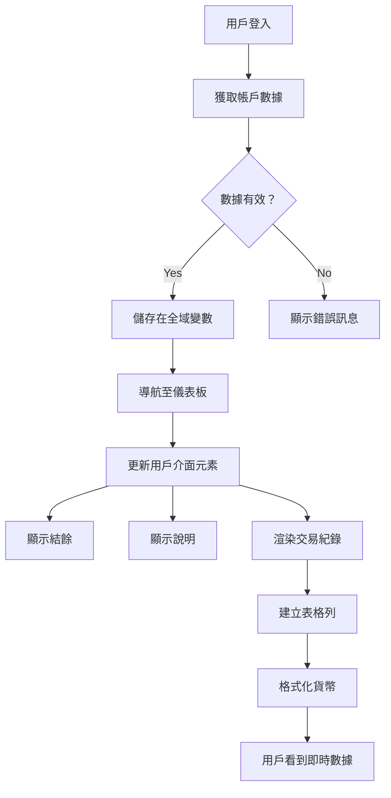
> 💡 **小貼士**：想立刻看到儀表板效果？登入時輸入用戶名 `test`，裡面內建範例資料，能直接看到各項功能，不需自己建立交易。
> 
**為何測試帳戶很方便：**
- 內建真實感範例資料
- 方便觀察交易顯示
- 適合測試儀表板功能
- 免去手動建立假資料的麻煩

### 建立儀表板顯示元件

我們一步步建立介面，先從帳戶摘要資訊開始，接著建置更複雜的交易列。

#### 第一步：更新 HTML 結構

先用動態佔位元素替換靜態的「餘額」區塊，讓 JavaScript 可以填入資料：

```html
<section>
  Balance: <span id="balance"></span><span id="currency"></span>
</section>
```

接著加入帳戶描述區。由於它是儀表板內容的標題，請使用語意標籤：

```html
<h2 id="description"></h2>
```

**HTML 結構說明：**
- **分別使用**`<span>`標籤顯示餘額與貨幣符號，以獨立控制
- **給予**各元素唯一 ID，方便 JavaScript 操控
- **使用**`<h2>`標籤標示帳戶描述，符合語意
- **建立**螢幕閱讀器和搜尋引擎的邏輯層級

> ✅ **無障礙提示**：帳戶描述被視為儀表板內容的標題，故用語意標題標示。了解更多關於[標題結構如何影響無障礙](https://www.nomensa.com/blog/2017/how-structure-headings-web-accessibility)。試想頁面中還有其他哪裡適合加入標題標籤？

#### 第二步：建立 Dashboard 更新函式

接著寫一個函式，填入實際帳戶資料：

```javascript
function updateDashboard() {
  if (!account) {
    return navigate('/login');
  }

  updateElement('description', account.description);
  updateElement('balance', account.balance.toFixed(2));
  updateElement('currency', account.currency);
}
```

**函式逐步說明：**
- **先確認**帳戶資料存在才繼續
- **未登入者**導向登入頁
- **用**可重複使用的 updateElement 函式更新帳戶描述
- **格式化**餘額，確保小數點顯示兩位
- **顯示**正確的貨幣符號

> 💰 **貨幣格式化小撇步**：[`toFixed(2)`](https://developer.mozilla.org/docs/Web/JavaScript/Reference/Global_Objects/Number/toFixed) 是存活救星！能讓餘額看起來像真實的貨幣—「75.00」而不是「75」。用戶會喜歡這種熟悉的貨幣格式。

#### 第三步：確保 Dashboard 會更新

要讓儀表板每次訪問都刷新資料，我們必須在路由系統掛鉤。這部分如果有完成[課程第一單元](../1-template-route/assignment.md)，應該不陌生。沒做過也沒關係—這是你要加的：

在 `updateRoute()` 函式末尾加入：

```javascript
if (typeof route.init === 'function') {
  route.init();
}
```

然後更新路由設定，包含儀表板初始化：

```javascript
const routes = {
  '/login': { templateId: 'login' },
  '/dashboard': { templateId: 'dashboard', init: updateDashboard }
};
```

**這樣聰明的配置做了什麼：**
- 檢查路由是否有初始化程式碼
- 當路由讀取時自動執行它
- 確保你的儀表板隨時顯示最新資料
- 讓路由邏輯保持乾淨組織

#### 測試你的儀表板

完成後測試：

1. **使用測試帳號登入**
2. **確認被導往儀表板**
3. **檢查帳戶描述、餘額和貨幣是否正確顯示**
4. **嘗試登出後再登入**，確保資料正確更新

你的儀表板現在應該能動態呈現根據使用者登入資料更新的帳戶資訊！

## 用範本建立智慧交易列表

我們不再手動產生每筆交易的 HTML，用範本自動生成一致且規範的格式。就像航太器製造用標準化元件，範本確保每列交易都有相同結構和外觀。

此技巧從少筆交易到成千上萬筆都能有效擴充，維持表現與呈現一致。

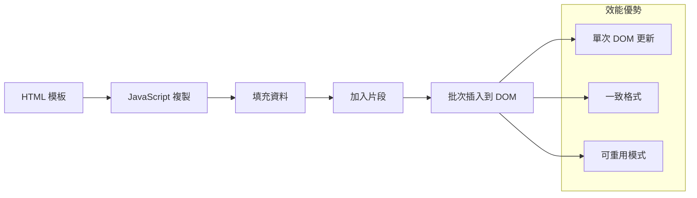
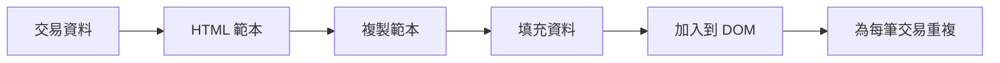
### 第一步：建立交易範本

在 HTML `<body>` 內新增可重複使用的交易列範本：

```html
<template id="transaction">
  <tr>
    <td></td>
    <td></td>
    <td></td>
  </tr>
</template>
```

**HTML 範本理解：**
- **定義**單一表格列結構
- **保持**隱藏，待複製並由 JavaScript 填入
- **包含**三個儲存格：日期、描述與金額
- **提供**一致格式的重用模式

### 第二步：準備可放動態內容的表格

接著在 `<tbody>` 加入 `id`，方便 JavaScript 找到插入位置：

```html
<tbody id="transactions"></tbody>
```

**這麼做的目的：**
- **建立**明確目標位置插入交易列
- **分離**表格結構與動態內容
- **方便**清空與重新填入交易資料

### 第三步：建立交易列工廠函式

寫個函式將交易資料轉換成 HTML 元素：

```javascript
function createTransactionRow(transaction) {
  const template = document.getElementById('transaction');
  const transactionRow = template.content.cloneNode(true);
  const tr = transactionRow.querySelector('tr');
  tr.children[0].textContent = transaction.date;
  tr.children[1].textContent = transaction.object;
  tr.children[2].textContent = transaction.amount.toFixed(2);
  return transactionRow;
}
```

**這個工廠函式解析：**
- **以 ID 找到**範本元素
- **複製**範本內容以便安全操作
- **選擇**複製後內容內的表格列
- **填入**每個儲存格交易資料
- **格式化**金額顯示正確小數位數
- **回傳**完成的列，準備插入表格中

### 第四步：高效產生多筆交易列

將此程式碼加入 `updateDashboard()` 函式呈現全部交易：

```javascript
const transactionsRows = document.createDocumentFragment();
for (const transaction of account.transactions) {
  const transactionRow = createTransactionRow(transaction);
  transactionsRows.appendChild(transactionRow);
}
updateElement('transactions', transactionsRows);
```

**這種高效作法說明：**
- **建立**文件片段，批次操作 DOM
- **遍歷**帳戶所有交易
- **運用**工廠函式為每筆交易生成列
- **將所有列聚集**在文件片段中
- **一次性**將所有列加入 DOM，避免多次個別插入造成效能問題
> ⚡ **性能優化**: [`document.createDocumentFragment()`](https://developer.mozilla.org/docs/Web/API/Document/createDocumentFragment) 就好似波音嘅組裝過程 — 零件係主生產線之外準備好，之後一次過裝好成件貨。呢種批量處理方法通過一次插入代替多次單獨操作，最大限度減少 DOM 重排。

### 第 5 步：增強混合內容嘅更新函數

你嘅 `updateElement()` 函數而家淨係處理純文字內容。更新佢，使佢可以處理文字同 DOM 節點嘅混合內容：

```javascript
function updateElement(id, textOrNode) {
  const element = document.getElementById(id);
  element.textContent = ''; // 移除所有子元素
  element.append(textOrNode);
}
```

**此次更新嘅關鍵改進：**
- **清除**現有內容後再添加新內容
- **接收**文字字串或 DOM 節點作為參數
- **使用**[`append()`](https://developer.mozilla.org/docs/Web/API/ParentNode/append) 方法以增強靈活性
- **保持**與現有基於文字嘅用法向後兼容

### 嘗試下你嘅儀表板

到體驗嘅時刻啦！即刻睇下你嘅動態儀表板點樣運作：

1. 用 `test` 帳號登入（入面有準備好嘅樣本數據）
2. 進入你嘅儀表板
3. 確認交易行正確顯示格式
4. 確保日期、描述同金額都睇落正確

如果一切正常，你就會見到一個功能齊全嘅交易清單喺儀表板度！🎉

**你完成嘅事：**
- 建立可擴展至任意數據量嘅儀表板
- 創建可重用嘅模板以統一格式
- 實施高效嘅 DOM 操作技巧
- 開發出媲美生產級銀行應用嘅功能

你已成功將靜態網頁轉化為動態網頁應用。

### 🎯 教學檢視：動態內容生成

**架構理解**：你已實作一條複雜嘅數據到 UI 流程，與 React、Vue、Angular 等框架所用模式相似。

**掌握嘅關鍵概念**：
- **基於模板嘅渲染**：創建可重用UI元件
- **文檔片段**：優化 DOM 性能
- **安全 DOM 操作**：防止安全漏洞
- **數據轉換**：將伺服器數據轉為用戶界面

**行業關聯**：呢啲技巧係現代前端框架嘅基礎。React 嘅虛擬 DOM、Vue 嘅模板系統，以及 Angular 嘅元件架構全部建立於呢啲核心理念。

**反思問題**：你會點樣擴展呢套系統，以支援即時更新（例如新交易自動出現）？可以考慮使用 WebSockets 或 Server-Sent Events。

---

## 📈 你嘅資料管理精通時程

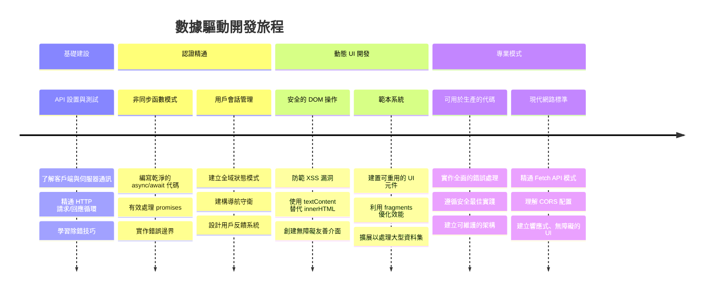
**🎓 畢業里程碑**：你已成功利用現代 JavaScript 模式打造完整嘅資料驅動網頁應用。呢啲技能可直接轉用於 React、Vue 或 Angular 等框架。

**🔄 下一階段能力**：
- 準備探索以呢啲概念為基礎嘅前端框架
- 能實現基於 WebSockets 嘅實時功能
- 可構建具備離線能力嘅進階網頁應用（PWA）
- 為進階狀態管理模式學習奠定基礎

## GitHub Copilot Agent 挑戰 🚀

使用 Agent 模式完成以下挑戰：

**描述：** 增強銀行應用，實現交易搜尋和過濾功能，讓用戶可以按日期區間、金額或描述搜尋特定交易。

**提示：** 為銀行應用建立搜尋功能，包含：1）一個包含日期區間（從／至）、最小／最大金額及交易描述關鍵字輸入框嘅搜尋表單；2）一個 `filterTransactions()` 函數，按搜尋條件對 account.transactions 陣列進行過濾；3）更新 `updateDashboard()` 函數以顯示過濾後嘅結果；4）增加「清除過濾器」按鈕重設視圖。使用現代 JavaScript 陣列方法 `filter()`，並妥善處理空搜尋條件嘅邊界情況。

了解更多關於 [agent mode](https://code.visualstudio.com/blogs/2025/02/24/introducing-copilot-agent-mode)。

## 🚀 挑戰

準備將你嘅銀行應用提升到新層次？一齊打造一個你真心想用嘅介面。以下係啲靈感：

**美化界面**：加啲 CSS 令你嘅功能性儀表板變得美觀，諗啲乾淨嘅線條、合理嘅間距，甚至輕微動畫。

**響應式設計**：試下用 [媒體查詢](https://developer.mozilla.org/docs/Web/CSS/Media_Queries) 建立[響應式設計](https://developer.mozilla.org/docs/Web/Progressive_web_apps/Responsive/responsive_design_building_blocks)，喺手機、平板同桌上裝置都好好睇。用家肯定感激！

**添增趣味**：諗下用顏色區分交易（收入用綠，支出用紅），加圖示，或者加入滑鼠懸停效果，令介面感覺更互動。

呢度係一個經過樣式化嘅儀表板嘅示例：

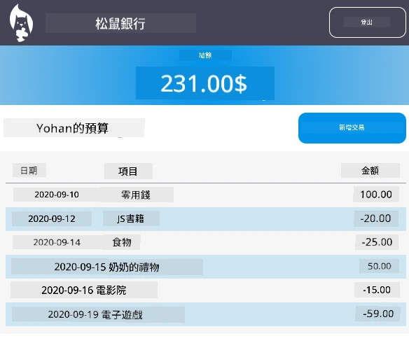

唔使死乞白賴要完全一樣，用嚟做靈感，打造屬於你嘅風格！

## 課後小測

[課後小測](https://ff-quizzes.netlify.app/web/quiz/46)

## 作業

[重構並添加註釋你嘅代碼](assignment.md)

---

<!-- CO-OP TRANSLATOR DISCLAIMER START -->
**免責聲明**：
本文件由 AI 翻譯服務 [Co-op Translator](https://github.com/Azure/co-op-translator) 翻譯而成。雖然我們致力於達到準確度，但請注意，自動翻譯可能包含錯誤或不準確之處。原始文件的本地語言版本應視為權威來源。對於重要資訊，建議採用專業人工翻譯。我們對因使用此翻譯而引起的任何誤解或錯誤詮釋概不負責。
<!-- CO-OP TRANSLATOR DISCLAIMER END -->