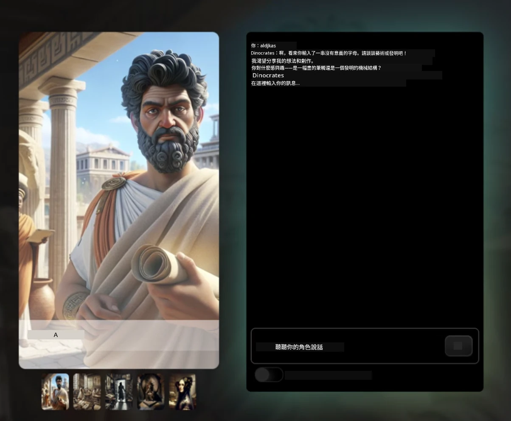
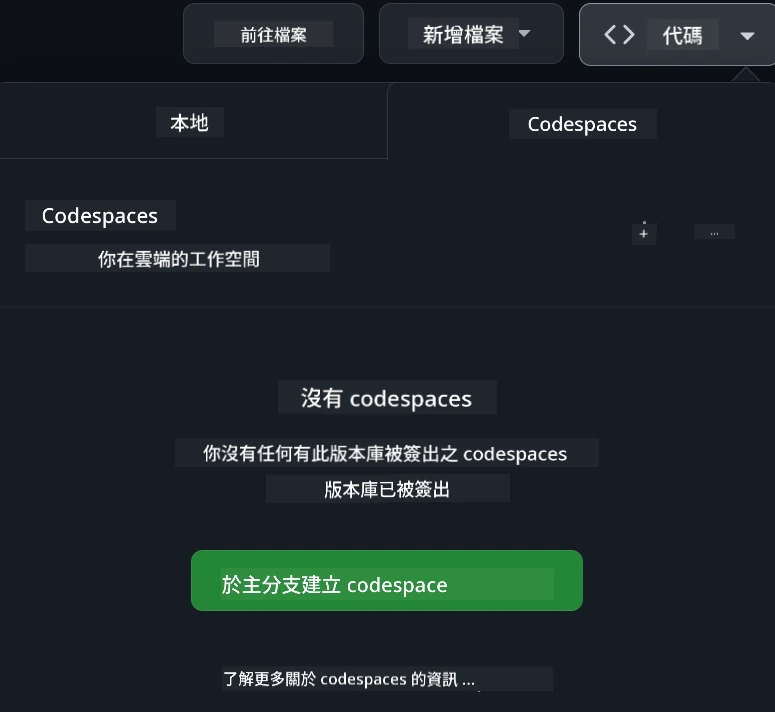

[](https://github.com/microsoft/Web-Dev-For-Beginners/blob/master/LICENSE)
[](https://GitHub.com/microsoft/Web-Dev-For-Beginners/graphs/contributors/)
[](https://GitHub.com/microsoft/Web-Dev-For-Beginners/issues/)
[](https://GitHub.com/microsoft/Web-Dev-For-Beginners/pulls/)
[](http://makeapullrequest.com) 

[](https://GitHub.com/microsoft/Web-Dev-For-Beginners/watchers/)
[](https://GitHub.com/microsoft/Web-Dev-For-Beginners/network/)
[](https://GitHub.com/microsoft/Web-Dev-For-Beginners/stargazers/)

[](https://discord.gg/nTYy5BXMWG)

# 初學者網頁開發課程

與微軟雲端推廣者一起學習網頁開發的基礎知識，參加我們為期 12 週的完整課程。24 堂課涵蓋 JavaScript、CSS 和 HTML，透過動手實作的專案，如玻璃庭園、瀏覽器擴充功能及太空遊戲。參與小測驗、討論與實務作業。利用我們有效的專案式教學，提升你的技能及加強知識吸收。今天就開始你的程式設計之旅吧！

加入 Azure AI Foundry Discord 社群

[](https://discord.gg/nTYy5BXMWG)

按照以下步驟使用這些資源開始你的學習：
1. <strong>分叉這個倉庫</strong>：按一下[](https://GitHub.com/microsoft/Web-Dev-For-Beginners/fork)
2. <strong>克隆倉庫</strong>：   `git clone https://github.com/microsoft/Web-Dev-For-Beginners.git`
3. [**加入 Azure AI Foundry Discord，結識專家與開發者夥伴**](https://discord.com/invite/ByRwuEEgH4)

### 🌐 多語言支援

#### 透過 GitHub Action 支援（自動且隨時更新）

<!-- CO-OP TRANSLATOR LANGUAGES TABLE START -->
[阿拉伯文](../ar/README.md) | [孟加拉文](../bn/README.md) | [保加利亞文](../bg/README.md) | [緬甸文](../my/README.md) | [中文 (簡體)](../zh-CN/README.md) | [中文 (繁體，香港)](./README.md) | [中文 (繁體，澳門)](../zh-MO/README.md) | [中文 (繁體，台灣)](../zh-TW/README.md) | [克羅地亞文](../hr/README.md) | [捷克文](../cs/README.md) | [丹麥文](../da/README.md) | [荷蘭文](../nl/README.md) | [愛沙尼亞文](../et/README.md) | [芬蘭文](../fi/README.md) | [法文](../fr/README.md) | [德文](../de/README.md) | [希臘文](../el/README.md) | [希伯來文](../he/README.md) | [印地文](../hi/README.md) | [匈牙利文](../hu/README.md) | [印尼文](../id/README.md) | [義大利文](../it/README.md) | [日文](../ja/README.md) | [坎那達文](../kn/README.md) | [高棉文](../km/README.md) | [韓文](../ko/README.md) | [立陶宛文](../lt/README.md) | [馬來文](../ms/README.md) | [馬拉雅拉姆文](../ml/README.md) | [馬拉地文](../mr/README.md) | [尼泊爾文](../ne/README.md) | [尼日利亞皮欽語](../pcm/README.md) | [挪威文](../no/README.md) | [波斯文 (法爾西)](../fa/README.md) | [波蘭文](../pl/README.md) | [葡萄牙文 (巴西)](../pt-BR/README.md) | [葡萄牙文 (葡萄牙)](../pt-PT/README.md) | [旁遮普文 (古魯穆奇)](../pa/README.md) | [羅馬尼亞文](../ro/README.md) | [俄文](../ru/README.md) | [塞爾維亞文 (西里爾)](../sr/README.md) | [斯洛伐克文](../sk/README.md) | [斯洛維尼亞文](../sl/README.md) | [西班牙文](../es/README.md) | [斯瓦希里文](../sw/README.md) | [瑞典文](../sv/README.md) | [他加祿文 (菲律賓語)](../tl/README.md) | [泰米爾文](../ta/README.md) | [泰盧固文](../te/README.md) | [泰文](../th/README.md) | [土耳其文](../tr/README.md) | [烏克蘭文](../uk/README.md) | [烏爾都文](../ur/README.md) | [越南文](../vi/README.md)

> **較喜歡本地端克隆嗎？**
>
> 此倉庫包含 50+ 種語言的翻譯，會顯著增加下載大小。若想要不含翻譯版，請使用稀疏檢出：
>
> **Bash / macOS / Linux:**
> ```bash
> git clone --filter=blob:none --sparse https://github.com/microsoft/Web-Dev-For-Beginners.git
> cd Web-Dev-For-Beginners
> git sparse-checkout set --no-cone '/*' '!translations' '!translated_images'
> ```
>
> **CMD (Windows):**
> ```cmd
> git clone --filter=blob:none --sparse https://github.com/microsoft/Web-Dev-For-Beginners.git
> cd Web-Dev-For-Beginners
> git sparse-checkout set --no-cone "/*" "!translations" "!translated_images"
> ```
>
> 這樣會讓你以更快的速度下載所有完成課程所需的內容。
<!-- CO-OP TRANSLATOR LANGUAGES TABLE END -->

**若你希望支援更多翻譯語言，請參考[此處](https://github.com/Azure/co-op-translator/blob/main/getting_started/supported-languages.md)**

[](https://open.vscode.dev/microsoft/Web-Dev-For-Beginners)

#### 🧑‍🎓 _你是學生嗎？_

請造訪[<strong>學生中心頁面</strong>](https://docs.microsoft.com/learn/student-hub/?WT.mc_id=academic-77807-sagibbon)，這裡有初學者資源、學生套件，甚至免費證書兌換券的方式。這個頁面值得你加入書籤並定期查看，因為我們每個月都會更新內容。

### 📣 新通知 - 新增 GitHub Copilot Agent 模式的挑戰任務！

新增挑戰，請在大部分章節尋找 “GitHub Copilot Agent Challenge 🚀” 。這是運用 GitHub Copilot 及 Agent 模式完成的新挑戰。如果你之前沒使用過 Agent 模式，它不只會生成文字，還能建立與編輯檔案、執行指令等等。

### 📣 新通知 - _新增使用生成式 AI 的專案_

剛新增 AI 助手專案，快來查看[專案](./9-chat-project/README.md)

### 📣 新通知 - _針對 JavaScript 發布的生成式 AI 新課程_

千萬別錯過我們的生成式 AI 新課程！

請訪問 [https://aka.ms/genai-js-course](https://aka.ms/genai-js-course) 開始！


- 課程涵蓋從基礎到 RAG。
- 使用生成式 AI 和配套應用程式與歷史人物互動。
- 有趣且吸引人的劇情，你將展開時光旅行！



每堂課都包含作業、知識檢測和挑戰，引導你學習以下主題：
- 提示與提示工程
- 文字及影像應用程式生成
- 搜索應用程式

請訪問 [https://aka.ms/genai-js-course](https://aka.ms/genai-js-course) 開始！

## 🌱 開始之前

> <strong>老師們</strong>，我們已在 [included some suggestions](for-teachers.md) 提供一些使用此課程的建議。我們也歡迎你在[討論區](https://github.com/microsoft/Web-Dev-For-Beginners/discussions/categories/teacher-corner)留下回饋！

**[學員們](https://aka.ms/student-page/?WT.mc_id=academic-77807-sagibbon)**，每堂課請先從課前測驗開始，接著閱讀講義內容，完成各種活動，並透過課後測驗檢查理解。

為了提升學習效果，建議與同儕一起合作完成專案！鼓勵在我們的[討論區](https://github.com/microsoft/Web-Dev-For-Beginners/discussions)進行交流，我們的管理團隊會隨時回答你的問題。

若要更深入學習，強烈建議探索 [Microsoft Learn](https://learn.microsoft.com/users/wirelesslife/collections/p1ddcy5jwy0jkm?WT.mc_id=academic-77807-sagibbon) 取得更多學習資源。

### 📋 設置你的開發環境

此課程已準備好開發環境！開始時你可以選擇在[Codespace](https://github.com/features/codespaces/)（瀏覽器環境，無需安裝）執行課程，或在電腦本機使用文字編輯器，例如 [Visual Studio Code](https://code.visualstudio.com/?WT.mc_id=academic-77807-sagibbon)。

#### 建立你的倉庫
為方便保存作品，建議你建立自己的此倉庫副本。點擊頁頂的 **Use this template** 按鈕，即可在你的 GitHub 帳戶建立新倉庫並複製課程內容。

請依序執行：
1. <strong>分叉倉庫</strong>：點擊本頁右上角的 “Fork” 按鈕。
2. <strong>克隆倉庫</strong>：   `git clone https://github.com/microsoft/Web-Dev-For-Beginners.git`

#### 在 Codespace 執行課程

在你建立的倉庫副本中，點擊 **Code** 按鈕，選擇 **Open with Codespaces**。這會建立一個新的 Codespace 讓你使用。



#### 在本機電腦執行課程

想在本機執行此課程，需要一個文字編輯器、瀏覽器與命令列工具。第一課 [程式語言與工具介紹](../../1-getting-started-lessons/1-intro-to-programming-languages) 會帶你了解各種工具選項，幫你挑選合適的開發環境。

我們推薦使用 [Visual Studio Code](https://code.visualstudio.com/?WT.mc_id=academic-77807-sagibbon) 作為編輯器，它還內建了[終端機](https://code.visualstudio.com/docs/terminal/basics/?WT.mc_id=academic-77807-sagibbon)。你可以從[這裡](https://code.visualstudio.com/?WT.mc_id=academic-77807-sagibbon)下載 Visual Studio Code。
1. 將您的倉庫克隆到您的電腦。您可以點擊 **Code** 按鈕並複製 URL：

    [CodeSpace](./images/createcodespace.png)

    然後，在 [Visual Studio Code](https://code.visualstudio.com/?WT.mc_id=academic-77807-sagibbon) 中打開 [Terminal](https://code.visualstudio.com/docs/terminal/basics/?WT.mc_id=academic-77807-sagibbon)，並運行以下命令，將 `<your-repository-url>` 替換為剛才複製的 URL：

    ```bash 
    git clone <your-repository-url>
    ```

2. 在 Visual Studio Code 中打開該資料夾。您可以點擊 **File** > **Open Folder** 並選擇剛才克隆的資料夾。


>  推薦的 Visual Studio Code 擴展：
>
> * [Live Server](https://marketplace.visualstudio.com/items?itemName=ritwickdey.LiveServer&WT.mc_id=academic-77807-sagibbon) - 在 Visual Studio Code 中預覽 HTML 頁面
> * [Copilot](https://marketplace.visualstudio.com/items?itemName=GitHub.copilot&WT.mc_id=academic-77807-sagibbon) - 幫助您更快編寫代碼

## 📂 每一課包含：

- 選擇性手繪筆記
- 選擇性補充視頻
- 課前熱身小測驗
- 書面課程內容
- 對於基於專案的課程，有逐步指導如何構建專案
- 知識檢測
- 一個挑戰
- 補充閱讀
- 作業
- [課後測驗](https://ff-quizzes.netlify.app/web/)

> <strong>關於測驗的小提示</strong>：所有測驗均包含在 Quiz-app 資料夾中，共 48 個測驗，每個測驗包含三個問題。它們可在[這裡](https://ff-quizzes.netlify.app/web/)使用，測驗應用程式可以本地運行或部署至 Azure；請遵循 `quiz-app` 資料夾中的指示。

## 🗃️ 課程列表

|     |                       專案名稱                       |                            教授概念                             | 學習目標                                                                                                                 |                                                         相關課程                                                          |         作者          |
| :-: | :------------------------------------------------------: | :--------------------------------------------------------------------: | ----------------------------------------------------------------------------------------------------------------------------------- | :----------------------------------------------------------------------------------------------------------------------------: | :---------------------: |
| 01  |                     入門篇                      |           程式設計介紹與開發工具           | 學習大多數程式語言的基本基礎以及幫助專業開發者工作的軟件工具 | [程式語言與開發工具簡介](./1-getting-started-lessons/1-intro-to-programming-languages/README.md) |         Jasmine         |
| 02  |                     入門篇                      |             GitHub 基礎與團隊協作             | 如何在專案中使用 GitHub，如何與他人協作管理代碼                                                    |                            [GitHub 入門](./1-getting-started-lessons/2-github-basics/README.md)                             |          Floor          |
| 03  |                     入門篇                      |                             無障礙設計                              | 學習網頁無障礙設計的基礎                                                                                               |                       [無障礙設計基礎](./1-getting-started-lessons/3-accessibility/README.md)                       |       Christopher       |
| 04  |                        JS 基礎                         |                         JavaScript 資料型別                          | JavaScript 資料型別的基礎                                                                                                 |                                       [資料型別](./2-js-basics/1-data-types/README.md)                                        |         Jasmine         |
| 05  |                        JS 基礎                         |                         函數與方法                          | 學習使用函數和方法管理應用程式的邏輯流程                                                             |                              [函數與方法](./2-js-basics/2-functions-methods/README.md)                               | Jasmine 和 Christopher |
| 06  |                        JS 基礎                         |                        使用 JS 做決策                        | 學習如何使用決策結構在程式中建立條件                                                           |                                 [決策制定](./2-js-basics/3-making-decisions/README.md)                                  |         Jasmine         |
| 07  |                        JS 基礎                         |                            陣列與迴圈                            | 使用 JavaScript 陣列與迴圈操作資料                                                                                 |                                   [陣列與迴圈](./2-js-basics/4-arrays-loops/README.md)                                    |         Jasmine         |
| 08  |       [Terrarium](./3-terrarium/solution/README.md)       |                            HTML 實作                            | 建立 HTML 來創建線上生態瓶，重點是建立布局                                                         |                                 [HTML 入門](./3-terrarium/1-intro-to-html/README.md)                                 |           Jen           |
| 09  |       [Terrarium](./3-terrarium/solution/README.md)       |                            CSS 實作                             | 建立 CSS 來為線上生態瓶設計樣式，重點是 CSS 基礎及響應式設計                     |                                  [CSS 入門](./3-terrarium/2-intro-to-css/README.md)                                  |           Jen           |
| 10  |            [Terrarium](./3-terrarium/solution/README.md)            |                 JavaScript 閉包與 DOM 操作                  | 編寫 JavaScript 使生態瓶具備拖放功能，著重於閉包與 DOM 操作             |                  [JavaScript 閉包與 DOM 操作](./3-terrarium/3-intro-to-DOM-and-closures/README.md)                   |           Jen           |
| 11  |          [打字遊戲](./4-typing-game/solution/README.md)          |                          製作一個打字遊戲                           | 學習使用鍵盤事件驅動 JavaScript 應用邏輯                                                          |                                [事件驅動程式設計](./4-typing-game/typing-game/README.md)                                |       Christopher       |
| 12  | [綠色瀏覽器擴展](./5-browser-extension/solution/README.md) |                         瀏覽器運作                          | 了解瀏覽器運作原理、歷史及構建首個瀏覽器擴展元素                               |                               [關於瀏覽器](./5-browser-extension/1-about-browsers/README.md)                                |           Jen           |
| 13  | [綠色瀏覽器擴展](./5-browser-extension/solution/README.md) | 建立表單、調用 API 及本地存儲變數 | 編寫瀏覽器擴展的 JavaScript 元素，使用本地存儲變數調用 API                      |                [API、表單與本地存儲](./5-browser-extension/2-forms-browsers-local-storage/README.md)                 |           Jen           |
| 14  | [綠色瀏覽器擴展](./5-browser-extension/solution/README.md) |          瀏覽器背景進程與網頁效能          | 使用瀏覽器背景進程管理擴展圖標；學習網頁效能及優化技巧   |             [背景任務與效能](./5-browser-extension/3-background-tasks-and-performance/README.md)              |           Jen           |
| 15  |           [太空遊戲](./6-space-game/solution/README.md)           |             使用 JavaScript 進階遊戲開發             | 學習繼承（使用類和組合）與發布/訂閱模式，為構建遊戲做準備              |                      [進階遊戲開發簡介](./6-space-game/1-introduction/README.md)                       |          Chris          |
| 16  |           [太空遊戲](./6-space-game/solution/README.md)           |                           畫布繪圖                            | 了解 Canvas API，用於在螢幕繪製元素                                                                       |                                [繪製到畫布](./6-space-game/2-drawing-to-canvas/README.md)                                |          Chris          |
| 17  |           [太空遊戲](./6-space-game/solution/README.md)           |                   元素移動                    | 發現如何使用笛卡爾座標和 Canvas API 為元素賦予動態                                            |                           [移動元素](./6-space-game/3-moving-elements-around/README.md)                           |          Chris          |
| 18  |           [太空遊戲](./6-space-game/solution/README.md)           |                          碰撞偵測                           | 使元素相互碰撞並反應，並使用冷卻時間功能確保遊戲效能    |                              [碰撞偵測](./6-space-game/4-collision-detection/README.md)                              |          Chris          |
| 19  |           [太空遊戲](./6-space-game/solution/README.md)           |                             計分                              | 根據遊戲狀態和表現進行數學計算                                                                |                                    [計分](./6-space-game/5-keeping-score/README.md)                                    |          Chris          |
| 20  |           [太空遊戲](./6-space-game/solution/README.md)           |                     結束與重新開始遊戲                     | 瞭解結束與重新開始遊戲，包括資源清理和變數重置                              |                                [結束條件](./6-space-game/6-end-condition/README.md)                                 |          Chris          |
| 21  |         [銀行應用程式](./7-bank-project/solution/README.md)          |                 網頁應用中的 HTML 範本與路由                 | 學習如何使用路由和 HTML 範本架構多頁面網站                             |                            [HTML 範本與路由](./7-bank-project/1-template-route/README.md)                             |          Yohan          |
| 22  |         [銀行應用程式](./7-bank-project/solution/README.md)          |                  建立登入與註冊表單                   | 了解如何構建表單與處理驗證程序                                                                          |                                           [表單](./7-bank-project/2-forms/README.md)                                           |          Yohan          |
| 23  |         [銀行應用程式](./7-bank-project/solution/README.md)          |                   取得與使用數據的方式                   | 資料在應用程式中如何流動，如何取得、存儲及處理                                                 |                                            [數據](./7-bank-project/3-data/README.md)                                            |          Yohan          |
| 24  |         [銀行應用程式](./7-bank-project/solution/README.md)          |                      狀態管理概念                      | 學習您的應用如何保留狀態以及如何透過程式管理狀態                                                              |                                [狀態管理](./7-bank-project/4-state-management/README.md)                                |          Yohan          |
| 25 | [Browser/VScode Code](../../8-code-editor) | 使用 VScode | 學習如何使用程式碼編輯器 | [使用 VScode 編輯器](./8-code-editor/1-using-a-code-editor/README.md) | Chris |
| 26 | [AI 助理](./9-chat-project/README.md) | 與 AI 合作 | 學習如何建立您的 AI 助理 | [AI 助理專案](./9-chat-project/README.md) | Chris |

## 🏫 教學法

我們的課程設計基於兩個主要教學原則：
* 專案式學習
* 頻繁測驗

該計劃教授 JavaScript、HTML 和 CSS 的基礎知識，以及當今網頁開發者使用的最新工具和技術。學生將有機會通過構建一個打字遊戲、虛擬生態瓶、環保瀏覽器擴展、太空入侵者風格遊戲和企業銀行應用程式來獲得實際操作經驗。系列結束時，學生將對網頁開發有堅實的理解。

> 🎓 您可以先上本課程中幾個初級課程，作為 Microsoft Learn 上的 [學習路徑](https://docs.microsoft.com/learn/paths/web-development-101/?WT.mc_id=academic-77807-sagibbon)！

通過確保內容與專案一致，使學習過程更具吸引力並能增強概念記憶。我們還編寫了幾個 JavaScript 基礎入門課程，搭配來自 "[JavaScript 初學者系列](https://channel9.msdn.com/Series/Beginners-Series-to-JavaScript/?WT.mc_id=academic-77807-sagibbon)" 影片教程集的一些視頻，該系列的部分作者也參與了本課程編寫。

此外，課前的低風險測驗設定學生的學習意圖，而課後的第二次測驗則確保進一步的記憶。本課程設計靈活且有趣，可以整體或部分學習。專案從簡單開始，並在 12 週的週期結束時變得越來越複雜。

儘管我們有意避免引入 JavaScript 框架，專注於在採用框架前培養作為網頁開發者所需的基本技能，完成本課程的下一個良好步驟是通過另一組視頻學習 Node.js：「[Node.js 初學者系列](https://channel9.msdn.com/Series/Beginners-Series-to-Nodejs/?WT.mc_id=academic-77807-sagibbon)」。

> 請參閱我們的 [行為守則](CODE_OF_CONDUCT.md) 和 [貢獻指南](CONTRIBUTING.md)。我們歡迎您的建設性反饋！


## 🧭 離線存取

您可以使用 [Docsify](https://docsify.js.org/#/) 離線瀏覽本文件。Fork 此倉庫，在您的本機安裝 [Docsify](https://docsify.js.org/#/quickstart)，然後在此倉庫的根目錄輸入 `docsify serve`。網站將在本地端口 3000 提供服務：`localhost:3000`。

## 📘 PDF
所有課堂的 PDF 檔案可在 [此處](https://microsoft.github.io/Web-Dev-For-Beginners/pdf/readme.pdf) 下載。


## 🎒 其他課程

我們團隊還製作了其他課程！請參考：

<!-- CO-OP TRANSLATOR OTHER COURSES START -->
### LangChain
[](https://aka.ms/langchain4j-for-beginners)
[](https://aka.ms/langchainjs-for-beginners?WT.mc_id=m365-94501-dwahlin)
[](https://github.com/microsoft/langchain-for-beginners?WT.mc_id=m365-94501-dwahlin)
---

### Azure / Edge / MCP / Agents
[](https://github.com/microsoft/AZD-for-beginners?WT.mc_id=academic-105485-koreyst)
[](https://github.com/microsoft/edgeai-for-beginners?WT.mc_id=academic-105485-koreyst)
[](https://github.com/microsoft/mcp-for-beginners?WT.mc_id=academic-105485-koreyst)
[](https://github.com/microsoft/ai-agents-for-beginners?WT.mc_id=academic-105485-koreyst)

---
 
### 生成式 AI 系列
[](https://github.com/microsoft/generative-ai-for-beginners?WT.mc_id=academic-105485-koreyst)
[-9333EA?style=for-the-badge&labelColor=E5E7EB&color=9333EA)](https://github.com/microsoft/Generative-AI-for-beginners-dotnet?WT.mc_id=academic-105485-koreyst)
[-C084FC?style=for-the-badge&labelColor=E5E7EB&color=C084FC)](https://github.com/microsoft/generative-ai-for-beginners-java?WT.mc_id=academic-105485-koreyst)
[-E879F9?style=for-the-badge&labelColor=E5E7EB&color=E879F9)](https://github.com/microsoft/generative-ai-with-javascript?WT.mc_id=academic-105485-koreyst)

---
 
### 核心學習
[](https://aka.ms/ml-beginners?WT.mc_id=academic-105485-koreyst)
[](https://aka.ms/datascience-beginners?WT.mc_id=academic-105485-koreyst)
[](https://aka.ms/ai-beginners?WT.mc_id=academic-105485-koreyst)
[](https://github.com/microsoft/Security-101?WT.mc_id=academic-96948-sayoung)
[](https://aka.ms/webdev-beginners?WT.mc_id=academic-105485-koreyst)
[](https://aka.ms/iot-beginners?WT.mc_id=academic-105485-koreyst)
[](https://github.com/microsoft/xr-development-for-beginners?WT.mc_id=academic-105485-koreyst)

---
 
### Copilot 系列
[](https://aka.ms/GitHubCopilotAI?WT.mc_id=academic-105485-koreyst)
[](https://github.com/microsoft/mastering-github-copilot-for-dotnet-csharp-developers?WT.mc_id=academic-105485-koreyst)
[](https://github.com/microsoft/CopilotAdventures?WT.mc_id=academic-105485-koreyst)
<!-- CO-OP TRANSLATOR OTHER COURSES END -->

## 尋求協助

如果你遇到困難或有任何關於構建 AI 應用程式的問題，歡迎加入和其他學習者與經驗豐富的開發者一起討論 MCP。這是一個支持性的社區，歡迎提出問題並自由分享知識。

[](https://discord.gg/nTYy5BXMWG)

如果你在建置過程中有產品反饋或錯誤，請造訪：

[](https://aka.ms/foundry/forum)

## 授權條款

本專案庫使用 MIT 授權條款。更多資訊請參閱 [LICENSE](../../LICENSE) 檔案。

---

<!-- CO-OP TRANSLATOR DISCLAIMER START -->
**免責聲明**：  
本文件是使用 AI 翻譯服務 [Co-op Translator](https://github.com/Azure/co-op-translator) 進行翻譯。雖然我們致力於準確性，但請注意，自動翻譯可能包含錯誤或不準確之處。原文文件的母語版本應視為權威來源。對於重要資訊，建議聘請專業人工翻譯。我們不對因使用本翻譯而產生的任何誤解或誤釋負責。
<!-- CO-OP TRANSLATOR DISCLAIMER END -->