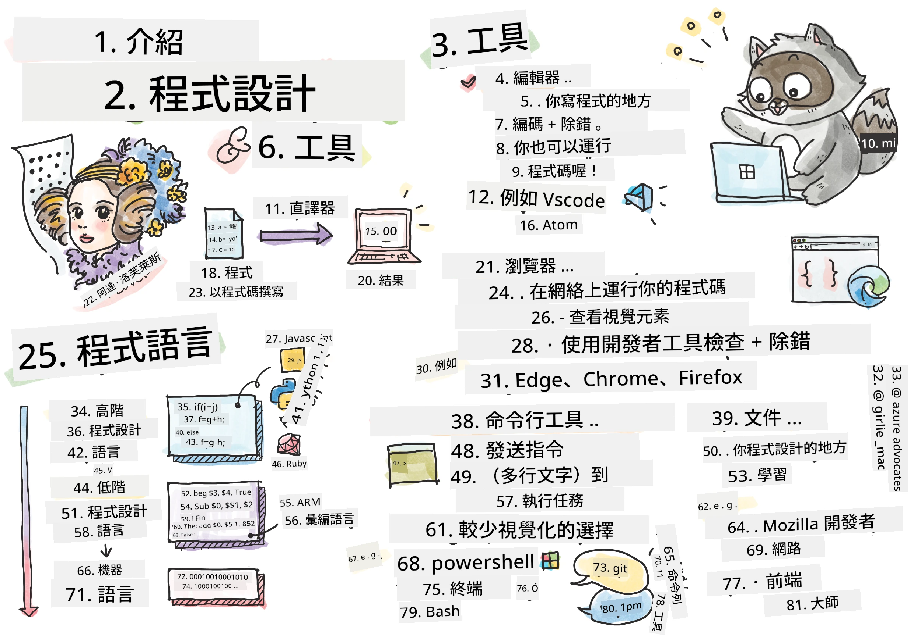
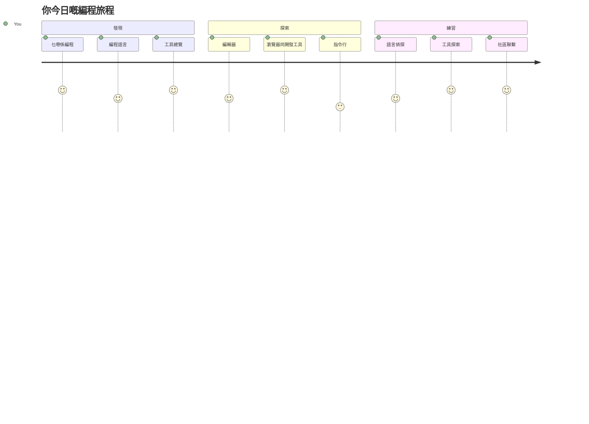
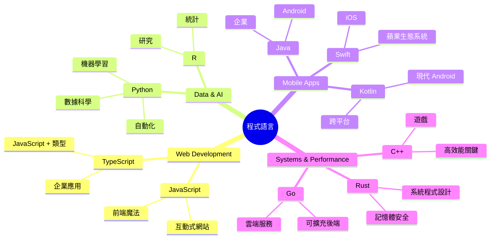
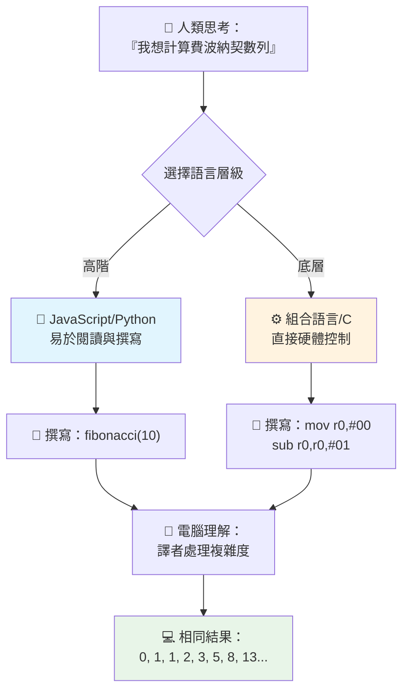
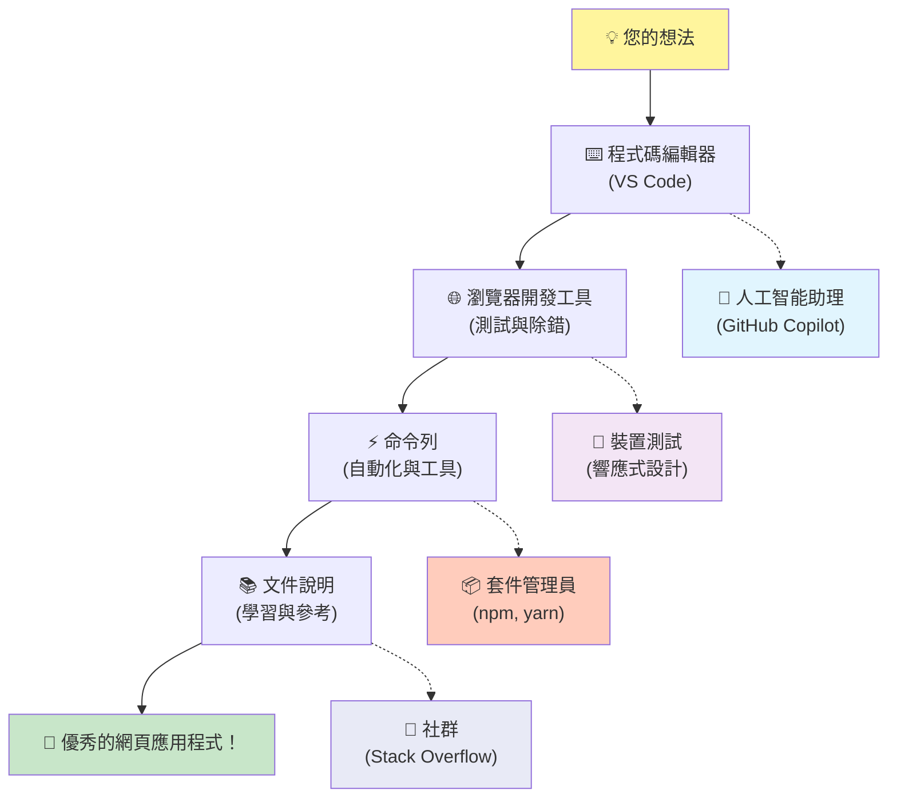
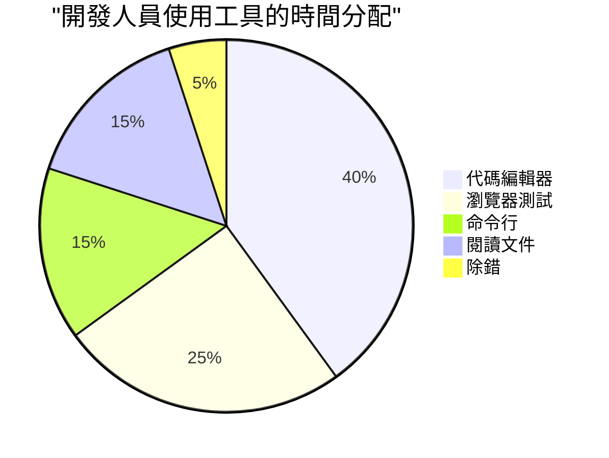

# Introduction to Programming Languages and Modern Developer Tools
 
Hey there, future developer! 👋 Can I tell you something that still gives me chills every single day? You're about to discover that programming isn't just about computers – it's about having actual superpowers to bring your wildest ideas to life!

You know that moment when you're using your favorite app and everything just clicks perfectly? When you tap a button and something absolutely magical happens that makes you go "wow, how did they DO that?" Well, someone just like you – probably sitting in their favorite coffee shop at 2 AM with their third espresso – wrote the code that created that magic. And here's what's going to blow your mind: by the end of this lesson, you'll not only understand how they did it, but you'll be itching to try it yourself!

Look, I totally get it if programming feels intimidating right now. When I first started, I honestly thought you needed to be some kind of math genius or have been coding since you were five years old. But here's what completely changed my perspective: programming is exactly like learning to have conversations in a new language. You start with "hello" and "thank you," then work up to ordering coffee, and before you know it, you're having deep philosophical discussions! Except in this case, you're having conversations with computers, and honestly? They're the most patient conversation partners you'll ever have – they never judge your mistakes and they're always excited to try again!

Today, we're going to explore the incredible tools that make modern web development not just possible, but seriously addictive. I'm talking about the exact same editors, browsers, and workflows that developers at Netflix, Spotify, and your favorite indie app studio use every single day. And here's the part that's going to make you do a happy dance: most of these professional-grade, industry-standard tools are completely free!


> Sketchnote by [Tomomi Imura](https://twitter.com/girlie_mac)


## Let's See What You Already Know!

Before we jump into the fun stuff, I'm curious – what do you already know about this programming world? And listen, if you're looking at these questions thinking "I literally have zero clue about any of this," that's not just okay, it's perfect! That means you're in exactly the right place. Think of this quiz like stretching before a workout – we're just warming up those brain muscles!

[Take the pre-lesson quiz](https://ff-quizzes.netlify.app/web/)


## The Adventure We're About to Go On Together

Okay, I am genuinely bouncing with excitement about what we're going to explore today! Seriously, I wish I could see your face when some of these concepts click. Here's the incredible journey we're taking together:

- **什麼是程式設計（以及它為何是最酷的事物！）** – 我們將發現程式碼其實是讓你周圍一切運作的隱形魔法，從那個神奇地知道是星期一早上的鬧鐘，到幫你精準推薦 Netflix 片單的演算法
- <strong>程式語言及其驚人的個性</strong> – 想像一下參加一個派對，每個人都有完全不同的超能力和解決問題的方式。程式語言世界就是這樣，而你會很喜歡認識它們！
- <strong>數位魔法背後的基本構建積木</strong> – 把這些想成終極創意的 LEGO 積木。一旦你理解這些積木如何拼合起來，你會發現自己能打造出任何想像得到的東西
- <strong>讓你感覺像獲得魔法杖的專業工具</strong> – 我可不是說笑——這些工具真的會讓你感覺擁有超能力，而且它們就是專業開發者用的工具！

> 💡 <strong>小提醒</strong>：今天不要試著把所有東西都記下！現在，我只希望你能感受到關於這個世界的可能性所激起的熱情。細節會隨著我們一起練習自然記住的——這才是真正的學習方式！

> 你可以在 [Microsoft Learn](https://learn.microsoft.com/en-us/learn/modules/web-development-101/introduction-programming/?WT.mc_id=academic-77807-sagibbon) 上參加這堂課！

## 那麼到底什麼是 <em>程式設計</em>？

好，讓我們來解答這個百萬美元問題：到底什麼是程式設計？

我有個故事改變了我對這件事的看法。上週，我試著教媽媽怎麼用我們家的新智能電視遙控器。我發現自己不斷說「按紅色按鈕，但不是大紅色，是左邊那個小紅色……不，是你另一邊的左……好，現在按住兩秒，不是一秒，也不是三秒……」聽起來熟悉嗎？😅

這就是程式設計！它是給一個功能強大但需要非常詳細指令的系統，一步步精確下達命令的藝術。差別在於，妳是在對電腦說，而電腦會完全照你說的做，即使你其實沒表達完全明白。

我第一次知道這點時超級震驚：電腦其實非常簡單。它只懂兩個東西——1 和 0，基本上就是「是」與「否」或「開」與「關」。就這樣！但神奇之處在這裡——我們不必像電影《駭客任務》那樣講 1 和 0。這就是<strong>程式語言</strong>出場的地方。它就像世界上最棒的翻譯家，能把你普通人類的思緒轉換成電腦聽得懂的語言。

每天早上醒來我還是會覺得很震撼的是：你生活中所有數位東西，都是由像你這樣的人創造的，他們可能穿著睡衣，手捧咖啡，敲擊筆記型電腦寫程式碼。那個讓你看起來完美無瑕的 Instagram 濾鏡？有人寫了程式。帶你到新喜歡歌曲的推薦演算法？是開發者建構的。幫你與朋友分帳用的應用程式？有個人想「這真的很麻煩，我一定能解決它」，然後…他做到了！

學程式不只是學一個技能——你將成為問題解決者社群的一員，他們花時間想：「如果我能做一些事情，讓別人一天變得更好一點，該多好！」坦白說，還有什麼比這更酷的呢？

✅ <strong>有趣知識尋寶</strong>：當你有空時，可以查詢世界上第一個電腦程式設計師是誰？我給你提示：可能不是你預期的那個人！那個人的故事非常精彩，證明程式設計從來就是關於創意問題解決與跳脫框架思考。

### 🧠 **情況回顧：你感覺如何？**

**花點時間反思：**
- 「給電腦下指令」的概念你現在感覺理解嗎？
- 你能想到一天中想用程式自動化的工作嗎？
- 你腦海中有關這個程式世界有哪些好奇的問題？

> <strong>記住</strong>：現在覺得某些概念模糊很正常。學程式像學新語言，需要時間讓你的大腦建立神經回路。你做得很好！

## 程式語言就像不同類型的魔法

好，這聽起來可能很怪，但請相信我——程式語言跟音樂類型很像。想一想：你有爵士樂，流暢且即興；搖滾，強烈而直接；古典，優雅且有結構；嘻哈，富創意且富表達力。每種風格都有自己的基調、熱情社群，而且適合不同心情與場合。

程式語言就是這樣！你不會用同一種語言來建造一款有趣的手機遊戲和處理龐大氣候數據，就像你不會在瑜伽課上放死亡金屬一樣（大多數瑜伽課啦！😄）。

但每次想到這點我都覺得很神奇：這些語言就像有個世上最耐心、最傑出的口譯員坐在旁邊。你能用你覺得自然的人類方式表達你的想法，他們處理所有極其複雜的事，把它轉譯成電腦聽得懂的 1 和 0。這就像有個朋友，雙語精通「人類創意」與「電腦邏輯」——而且他永不疲累，不需要咖啡休息，也不會因為你問第二次同個問題而責怪你！

### 流行程式語言與用途


| Language | Best For | Why It's Popular |
|----------|----------|------------------|
| **JavaScript** | Web development, user interfaces | Runs in browsers and powers interactive websites |
| **Python** | Data science, automation, AI | Easy to read and learn, powerful libraries |
| **Java** | Enterprise applications, Android apps | Platform-independent, robust for large systems |
| **C#** | Windows applications, game development | Strong Microsoft ecosystem support |
| **Go** | Cloud services, backend systems | Fast, simple, designed for modern computing |

### 高階語言 vs. 低階語言

好，這其實是我剛開始學習時最讓我頭痛的概念，我要分享一個讓我終於理解的比喻——希望對你也有幫助！

想像你去一個不會當地語言的國家，急需找到廁所（我們都有這經驗，對吧？😅）：

- <strong>低階程式設計</strong> 就像你學會了當地的方言，能跟賣水果的阿婆用文化典故、當地俚語、只有當地人懂的笑話聊天。超厲害還非常有效率……如果你真的很流利！但當你只是想找廁所時，這很讓人不知所措。

- <strong>高階程式設計</strong> 就像有個超棒的當地朋友完全懂你。你可以用很簡單的英文說「我很需要找廁所」，他幫你做文化翻譯並給你方向，讓你的外來腦袋完全理解。

程式設計來說：
- <strong>低階語言</strong>（像組合語言或 C）讓你能與電腦實體硬體進行非常細緻的對話，但你必須用機器思維，非常...我們說，是大腦的顛覆性轉換！
- <strong>高階語言</strong>（像 JavaScript、Python 或 C#）讓你用人類思考，背後他們幫你處理所有機器語音。更棒的是，這些語言通常都有溫暖友善的社群，他們記得自己剛開始的時候，也誠心想幫助你！

猜猜我建議你從哪種語言開始？😉 高階語言就像訓練輪，讓整個學習過程更愉快，你甚至不想摘掉它們！


### 讓我來示範為什麼高階語言友好得多

好，我即將示範一個完美說明我為什麼愛上高階語言的例子，但首先——我需要你答應我一件事。看到第一個代碼範例時不要害怕！它看起來嚇人是故意的。這恰恰是我想說的點！

我們會看同一件工作用兩種完全不同風格寫成的程式碼。它們都創造了所謂的費氏數列——一個漂亮的數學模式，每一個數字都是前面兩個數之和：0, 1, 1, 2, 3, 5, 8, 13…（有趣的是：這個模式幾乎遍布自然界——向日葵種子螺旋、松果紋路，甚至星系形成！）

準備好比較差異了嗎？出發！

**高階語言（JavaScript）– 人類友好：**

```javascript
// 第一步：基本費波那契設置
const fibonacciCount = 10;
let current = 0;
let next = 1;

console.log('Fibonacci sequence:');
```

**這段代碼做了什麼：**
- <strong>宣告</strong> 常數來指定我們想產生多少個費氏數字
- <strong>初始化</strong> 兩個變數來追蹤數列中目前與下一個數
- <strong>設定</strong> 起始值（0 和 1）決定費氏模式
- <strong>顯示</strong> 標題訊息來識別輸出結果

```javascript
// 第 2 步：使用迴圈產生序列
for (let i = 0; i < fibonacciCount; i++) {
  console.log(`Position ${i + 1}: ${current}`);
  
  // 計算序列中的下一個數字
  const sum = current + next;
  current = next;
  next = sum;
}
```

**分解這裡發生了什麼：**
- 用 `for` 迴圈<strong>遍歷</strong> 數列的每個位置
- 用模板字串格式<strong>顯示</strong> 每個數字和它的位置
- <strong>計算</strong> 下一個費氏數字，方法是將目前與下一個數字相加
- <strong>更新</strong> 追蹤變數往下做新一輪計算

```javascript
// 第三步：現代函數式方法
const generateFibonacci = (count) => {
  const sequence = [0, 1];
  
  for (let i = 2; i < count; i++) {
    sequence[i] = sequence[i - 1] + sequence[i - 2];
  }
  
  return sequence;
};

// 使用範例
const fibSequence = generateFibonacci(10);
console.log(fibSequence);
```

**上面我們：**
- 利用現代箭頭函數語法<strong>建立</strong> 可重用函數
- <strong>建立</strong> 陣列來儲存整個序列，而不是逐個顯示
- <strong>用</strong> 陣列索引從前面的數字計算新數字
- <strong>回傳</strong> 整個序列，方便程式其他部分彈性使用

**低階語言（ARM 組合語言）– 電腦友好：**

```assembly
 area ascen,code,readonly
 entry
 code32
 adr r0,thumb+1
 bx r0
 code16
thumb
 mov r0,#00
 sub r0,r0,#01
 mov r1,#01
 mov r4,#10
 ldr r2,=0x40000000
back add r0,r1
 str r0,[r2]
 add r2,#04
 mov r3,r0
 mov r0,r1
 mov r1,r3
 sub r4,#01
 cmp r4,#00
 bne back
 end
```

你會注意到 JavaScript 版本幾乎像英文指令一樣易讀，而組合語言用的是直接控制電腦處理器的晦澀命令。兩者都完成了同樣的工作，但高階語言更容易讓人理解、撰寫和維護。

**你會注意到的主要差異：**
- <strong>可讀性</strong>：JavaScript 使用像 `fibonacciCount` 這樣具描述性的名稱，而 Assembly 則使用像 `r0`、`r1` 這類難懂的標籤
- <strong>註解</strong>：高階語言鼓勵加入解釋性註解，使代碼自我說明
- <strong>結構</strong>：JavaScript 的邏輯流程符合人類逐步思考問題的方式
- <strong>維護性</strong>：針對不同需求更新 JavaScript 版本簡單明瞭

✅ <strong>關於費波那契數列</strong>：這個絕美的數字模式（每個數字等於前兩個數字的和：0, 1, 1, 2, 3, 5, 8...）幾乎在自然界的<em>每個角落</em>都能找到！你會在向日葵的螺旋排列、松果的排列方式、鸚鵡螺的殻捲曲，甚至是樹枝生長的方式中都看見它。令人震撼的是，數學和程式碼竟能幫助我們理解並重現自然界用來創造美麗的模式！

## 讓魔法發生的基本組件

好了，現在你已經看到程式語言的運作方式，讓我們來拆解一下構成所有程式的基礎元素。把它們想像成你最愛食譜的基本材料──一旦你了解每個材料的作用，就能讀寫幾乎任何語言的程式碼了！

這有點像學習程式的文法。還記得在學校時學過名詞、動詞，還有如何組成句子嗎？程式也有自己的文法，說真的，比起英文文法，它更合邏輯也更寬容！😄

### 陳述式：一步步的指令

從<strong>陳述式</strong>開始──它們就像跟電腦對話中的句子。每個陳述式告訴電腦去做一件特定的事情，就像給方向：「這裡左轉」、「紅燈停下」、「停在那個車位」。

我喜歡陳述式的地方是它們通常很易讀。看這個：

```javascript
// 執行單一動作的基本語句
const userName = "Alex";                    
console.log("Hello, world!");              
const sum = 5 + 3;                         
```

**這段程式碼做了什麼：**
- <strong>宣告</strong>一個常數變數來儲存使用者姓名
- <strong>顯示</strong>問候訊息到主控台輸出
- <strong>計算</strong>並儲存數學運算的結果

```javascript
// 與網頁互動的語句
document.title = "My Awesome Website";      
document.body.style.backgroundColor = "lightblue";
```

**一步一步發生了什麼：**
- <strong>修改</strong>瀏覽器分頁上顯示的網頁標題
- <strong>更改</strong>整個頁面正文的背景顏色

### 變數：你程式的記憶系統

好，<strong>變數</strong>說實話是我最喜歡教的概念之一，因為它們跟你每天使用的東西很像！

想想你的手機聯絡人名單。你不會背下每個人電話號碼──你是把「媽媽」、「最好朋友」或「凌晨2點前還有外送的Pizza店」存下來，讓手機記住那串數字。變數也是一樣！它們是有標籤的容器，你程式可以把資料存進去，之後用有意義的名稱拿出來。

超酷的是：變數會隨著程式執行而改變（所以才叫“變數”──你懂的吧？）。就像你發現更好的 Pizza 店會更新聯絡人一樣，變數會隨著程式獲取新資料或情況變化而更新！

讓我示範這有多簡單：

```javascript
// 第一步：建立基本變數
const siteName = "Weather Dashboard";        
let currentWeather = "sunny";               
let temperature = 75;                       
let isRaining = false;                      
```

**理解這些概念：**
- <strong>用</strong> `const` 變數儲存不變的值（例如網站名稱）
- <strong>用</strong> `let` 來儲存程式執行中可變的數值
- <strong>指定</strong>不同資料型態：字串（文字）、數字，和布林值（真/假）
- <strong>選擇</strong>能說明變數內容的描述性名稱

```javascript
// 第 2 步：使用對象來分組相關數據
const weatherData = {                       
  location: "San Francisco",
  humidity: 65,
  windSpeed: 12
};
```

**上面示例中我們：**
- <strong>建立</strong>一個物件，將相關的天氣資訊整合在一起
- <strong>組織</strong>多個資料項目於同一個變數名稱下
- <strong>用</strong>鍵值對明確標示每條資訊

```javascript
// 第3步：使用及更新變數
console.log(`${siteName}: Today is ${currentWeather} and ${temperature}°F`);
console.log(`Wind speed: ${weatherData.windSpeed} mph`);

// 更新可變變數
currentWeather = "cloudy";                  
temperature = 68;                          
```

**細看每個部分：**
- <strong>用</strong>模板字串`${}`語法顯示訊息
- <strong>用</strong>點記法（`weatherData.windSpeed`）存取物件屬性
- <strong>更新</strong>以 `let` 宣告的變數以反映變化狀態
- <strong>合併</strong>多個變數來產生有意義的訊息

```javascript
// 第4步：使用現代解構賦值讓代碼更乾淨
const { location, humidity } = weatherData; 
console.log(`${location} humidity: ${humidity}%`);
```

**你需要知道：**
- <strong>用</strong>解構賦值（destructuring）從物件中取出特定屬性
- <strong>自動</strong>建立同名變數與物件鍵匹配
- <strong>簡化</strong>程式碼避免重複使用點記法

### 控制流程：教你的程式如何思考

好了，這裡程式開始變得超級酷！<strong>控制流程</strong>就是教你的程式如何做聰明的決策，就像你每天根本不用想就知道要怎麼做一樣。

想像這樣：今早你可能經歷了這種流程：「如果下雨，就帶傘。若很冷，就穿夾克。如果要遲到了，就跳過早餐，到路上買咖啡。」你的大腦每天很自然地執行這樣的 if-then 邏輯好幾次！

這就是讓程式感覺聰明又活生生的地方，而不是死板的腳本。它們能夠看情況、評估狀況，並做出適當的回應。就像給你的程式一個能適應並做選擇的大腦！

想看看這有多美妙嗎？我示範給你：

```javascript
// 第一步：基本條件邏輯
const userAge = 17;

if (userAge >= 18) {
  console.log("You can vote!");
} else {
  const yearsToWait = 18 - userAge;
  console.log(`You'll be able to vote in ${yearsToWait} year(s).`);
}
```

**這段程式碼做了什麼：**
- <strong>檢查</strong>使用者是否符合投票年齡
- <strong>根據</strong>條件結果執行不同區塊程式碼
- <strong>計算</strong>並顯示若未滿18歲需等待多久才能投票
- <strong>針對</strong>每種情況提供具體且有用的回饋

```javascript
// 第2步：使用邏輯運算子的多個條件
const userAge = 17;
const hasPermission = true;

if (userAge >= 18 && hasPermission) {
  console.log("Access granted: You can enter the venue.");
} else if (userAge >= 16) {
  console.log("You need parent permission to enter.");
} else {
  console.log("Sorry, you must be at least 16 years old.");
}
```

**解析發生的事情：**
- <strong>運用</strong> `&&`（且）運算符結合多個條件
- <strong>利用</strong> `else if` 建立多種條件層級
- <strong>以</strong> 最終的 `else` 處理其他所有可能情況
- <strong>為</strong> 不同情況提供清楚、可執行的回應

```javascript
// 第三步：使用三元運算子編寫簡潔條件語句
const votingStatus = userAge >= 18 ? "Can vote" : "Cannot vote yet";
console.log(`Status: ${votingStatus}`);
```

**你需要記住：**
- <strong>使用</strong> 三元運算子 (`? :`) 處理簡單的雙選條件
- <strong>先寫</strong>條件，接著 `?`，再寫為真結果，然後 `:`，最後寫為假結果
- <strong>當你需要</strong>根據條件賦值時，採用這種模式

```javascript
// 第4步：處理多個特定情況
const dayOfWeek = "Tuesday";

switch (dayOfWeek) {
  case "Monday":
  case "Tuesday":
  case "Wednesday":
  case "Thursday":
  case "Friday":
    console.log("It's a weekday - time to work!");
    break;
  case "Saturday":
  case "Sunday":
    console.log("It's the weekend - time to relax!");
    break;
  default:
    console.log("Invalid day of the week");
}
```

**這段代碼做到以下幾點：**
- <strong>將</strong>變數值與多個特定案例做匹配
- <strong>將</strong>相似情況分組（工作日對比週末）
- <strong>執行</strong>當匹配到相符案例的程式碼區塊
- <strong>包含</strong>`default` 來處理未預期的值
- <strong>用</strong> `break` 來防止繼續執行下一個案例

> 💡 <strong>現實世界比喻</strong>：想像控制流程就像你身邊最有耐心的 GPS 導航。它可能說「如果主街塞車，就改走高速公路。要是高速公路在施工，就試試風景路線。」程式運用同樣條件邏輯，智慧地回應不同情況，並且一直給使用者最佳體驗。

### 🎯 **概念檢測：基礎組件掌握情況**

**來看看你對基礎的理解：**
- 你能用自己的話解釋變數和陳述式有什麼不同嗎？
- 想想日常中會用到 if-then 決策的情境（像我們的投票範例）
- 關於程式邏輯，有什麼讓你感到驚訝的部分？

**快速提振信心：**

✅ <strong>接下來是什麼</strong>：接下來我們會更深入這些概念，與你一同踏上這趟不可思議的學習旅程！現在就先享受對未來所有可能性感到的興奮吧。具體技能和技術會隨著我們一起練習自然累積──我保證這會比你想像的還有趣！

## 開發必備工具

說實在的，這部分讓我超興奮，幾乎控制不住自己！🚀 我們要聊的是讓你感覺彷彿獲得數位飛船鑰匙的神奇工具。

你知道廚師有那把完美平衡感覺就像手的刀具嗎？音樂家握著彈一下就能唱歌的吉他？我們開發者也有自己的「魔法工具」，而且最讓你震撼的是──大多數都是完全免費的！

我講這些時都忍不住在椅子上來回晃，因為這些工具徹底改變了我們寫軟件的方式。像是 AI 驅動的程式助手可以幫你寫程式（我沒開玩笑！）、雲端環境讓你可以從有 Wi-Fi 的任何地方建構整個應用程式、還有像是程式的 X 光視覺那般高超的除錯工具。

更讓我起雞皮疙瘩的是：這些不是給初學者用來學完就拋棄的工具，它們正是 Google、Netflix，乃至你喜愛的獨立應用工作室正在使用的專業等級工具。使用它們，你會感覺自己像個高手！


### 程式碼編輯器和整合開發環境：你的新數位好友

讓我們來談談程式碼編輯器──它們即將成為你最愛的造訪地點！把它們當成你的程式碼聖地，你會花大多時間在這裡打造和完美化數位作品。

但現代編輯器最神奇的地方是：它們不只是華麗的文字編輯器。就像有最聰明、支持你編碼的導師全天候陪伴。它們能在你還沒注意到前幫你抓出錯字，建議改善方法讓你看起來像個天才，幫你理解每段程式碼的作用，甚至有些甚至能預測你要輸入什麼並主動幫你補完！

我記得剛發現自動補全功能時，覺得自己真是在未來世界活著。開始打字，編輯器就會說：「嘿，你是不是在想這個剛好能幫你完成需求的函式？」感覺就像有個讀心術師做你的程式夥伴！

**這些編輯器有什麼令人驚豔的特色？**

現代程式碼編輯器提供一系列強大功能，提升你的生產力：

| 功能         | 作用                     | 為何有幫助                |
|--------------|--------------------------|---------------------------|
| <strong>語法高亮</strong> | 以顏色區分代碼各部分      | 讓代碼更容易閱讀與錯誤排查|
| <strong>自動補全</strong> | 輸入時給出程式碼建議      | 加快撰寫速度減少錯字      |
| <strong>除錯工具</strong> | 幫助找出並修正錯誤        | 節省大量除錯時間          |
| <strong>擴充功能</strong> | 增加專門的功能            | 可針對任何技術自訂編輯器  |
| **AI 助手** | 建議程式碼和解說          | 加速學習與生產力提升      |

> 🎥 <strong>影片資源</strong>：想看這些工具實際運作？查看這部[開發工具速覽影片](https://youtube.com/watch?v=69WJeXGBdxg)。

#### 推薦的網頁開發編輯器

**[Visual Studio Code](https://code.visualstudio.com/?WT.mc_id=academic-77807-sagibbon)**（免費）
- 網頁開發者最愛
- 卓越的擴充生態系統
- 內建終端機和 Git 整合
- <strong>必裝擴充</strong>：
  - [GitHub Copilot](https://marketplace.visualstudio.com/items?itemName=GitHub.copilot) - AI 驅動的程式碼建議
  - [Live Share](https://marketplace.visualstudio.com/items?itemName=MS-vsliveshare.vsliveshare) - 實時協作
  - [Prettier](https://marketplace.visualstudio.com/items?itemName=esbenp.prettier-vscode) - 自動程式碼格式化
  - [Code Spell Checker](https://marketplace.visualstudio.com/items?itemName=streetsidesoftware.code-spell-checker) - 捕捉代碼中的拼字錯誤

**[JetBrains WebStorm](https://www.jetbrains.com/webstorm/)**（付費，學生免費）
- 先進的除錯和測試工具
- 智能程式碼補完
- 內建版本控制

**雲端 IDE**（各種收費方案）
- [GitHub Codespaces](https://github.com/features/codespaces) - 瀏覽器中的完整 VS Code
- [Replit](https://replit.com/) - 學習與分享程式碼的好地方
- [StackBlitz](https://stackblitz.com/) - 即時全棧網頁開發

> 💡 <strong>入門建議</strong>：先從 Visual Studio Code 開始──它免費、在業界廣泛使用，而且社群龐大，有許多教學與擴充功能。

### 網頁瀏覽器：你的祕密開發實驗室

準備好讓你大開眼界了嗎？你一直用瀏覽器滑社群媒體、看影片──但其實它們一直藏著驚人的秘密開發實驗室，在等你去發現！

每次你右鍵點網頁選「檢查元素」，其實就是打開了一個隱藏世界的開發工具──它們的強大程度遠超我以前花上百元買的昂貴軟件。就像你平凡的廚房背後藏著一座職業主廚的實驗室，有個祕密通道等你開啟！
第一次有人給我看瀏覽器開發工具時，我花了大約三個小時不停地點擊，然後一直在想「等等，它竟然還可以做到這個？！」你真的可以即時編輯任何網站，精確地看到每樣東西加載得有多快，測試你網站在不同裝置上的外觀，甚至像專業人士一樣調試 JavaScript。這真是令人目瞪口呆！

**這就是瀏覽器成為你秘密武器的原因：**

當你創建網站或網頁應用程式時，你需要看到它在現實中的外觀和行為。瀏覽器不僅展示你的作品，還提供關於性能、可訪問性和潛在問題的詳細反饋。

#### 瀏覽器開發者工具 (DevTools)

現代瀏覽器包含全面的開發套件：

| Tool Category | What It Does | Example Use Case |
|---------------|--------------|------------------|
| **Element Inspector** | 即時查看和編輯 HTML/CSS | 調整樣式即刻看到效果 |
| **Console** | 查看錯誤訊息並測試 JavaScript | 調試問題和實驗程式碼 |
| **Network Monitor** | 跟蹤資源加載情況 | 優化性能和加載時間 |
| **Accessibility Checker** | 測試無障礙設計 | 確保網站適合所有用戶 |
| **Device Simulator** | 在不同螢幕尺寸上預覽 | 無需多部裝置即可測試響應式設計 |

#### 推薦用於開發的瀏覽器

- **[Chrome](https://developers.google.com/web/tools/chrome-devtools/)** — 行業標準的 DevTools，附帶廣泛文件
- **[Firefox](https://developer.mozilla.org/docs/Tools)** — 出色的 CSS Grid 和無障礙工具
- **[Edge](https://docs.microsoft.com/microsoft-edge/devtools-guide-chromium/?WT.mc_id=academic-77807-sagibbon)** — 基於 Chromium，結合微軟的開發資源

> ⚠️ <strong>重要測試提示</strong>：務必在多個瀏覽器中測試你的網站！在 Chrome 中運作完美的東西在 Safari 或 Firefox 可能會有所不同。專業開發者會在所有主流瀏覽器中測試以確保用戶體驗一致。


### 命令列工具：開啟開發者超能力的大門

好了，讓我們誠實談談命令列，因為我想讓你聽聽一個真正懂它的人說話。當我第一次看到它——那個帶有閃爍文字的黑色螢幕——我真心覺得：「不，絕對不！這看起來像1980年代駭客電影的東西，我絕對不夠聰明！」😅

但我希望當時有人告訴我這些，而我現在告訴你：命令列並不可怕——它其實就像直接跟你的電腦對話。試想像，用漂亮的圖片和菜單點餐（很好用也容易）和走進你最愛的本地餐館，廚師了解你喜歡什麼，憑你一句「給我驚喜，來點厲害的」就能做出完美餐點的差別。

命令列是開發者感覺自己像絕對巫師的地方。你輸入幾個看似魔法詞彙（好啦，它們只是命令，但感覺超神奇！），按下 Enter，轟！你已創建整個項目結構，從全世界安裝強大工具，或者部署你的應用讓數百萬人看見。一旦你嘗到這種力量，真的會上癮！

**命令列會成為你最愛工具的原因：**

雖然圖形介面適合多數任務，但命令列在自動化、精準度和速度上表現卓越。許多開發工具主要透過命令列介面工作，學會高效使用它們能極大提高你的生產力。

```bash
# 第一步：建立並導航到項目目錄
mkdir my-awesome-website
cd my-awesome-website
```

**這段程式碼做了什麼：**
- <strong>建立</strong> 名為 "my-awesome-website" 的新目錄給你的項目
- <strong>切換</strong> 到新建目錄開始工作

```bash
# 第 2 步：使用 package.json 初始化專案
npm init -y

# 安裝現代開發工具
npm install --save-dev vite prettier eslint
npm install --save-dev @eslint/js
```

**逐步說明：**
- 使用 `npm init -y` <strong>初始化</strong> 一個預設設定的 Node.js 新項目
- <strong>安裝</strong> Vite 作為現代開發及生產建置的快速工具
- <strong>加入</strong> Prettier 進行自動代碼格式化，ESLint 做代碼質量檢查
- 用 `--save-dev` 標記這些為開發依賴項

```bash
# 第三步：建立專案結構和檔案
mkdir src assets
echo '<!DOCTYPE html><html><head><title>My Site</title></head><body><h1>Hello World</h1></body></html>' > index.html

# 開始開發伺服器
npx vite
```

**以上我們已經：**
- <strong>組織</strong> 項目，用不同資料夾區分源代碼和資產
- <strong>產生</strong> 一個基本的 HTML 文件，包含正確的文檔架構
- <strong>啟動</strong> Vite 開發伺服器以支持即時重新加載和熱模組替換

#### 網頁開發必備命令列工具

| Tool | Purpose | Why You Need It |
|------|---------|-----------------|
| **[Git](https://git-scm.com/)** | 版本控制 | 跟蹤改動，與他人合作，備份你的工作 |
| **[Node.js & npm](https://nodejs.org/)** | JavaScript 執行環境兼套件管理 | 瀏覽器外運行 JavaScript，安裝現代開發工具 |
| **[Vite](https://vitejs.dev/)** | 建構工具與開發伺服器 | 極速開發，支援熱模組替換 |
| **[ESLint](https://eslint.org/)** | 代碼質量 | 自動發現及修正 JavaScript 問題 |
| **[Prettier](https://prettier.io/)** | 代碼格式化 | 保持代碼一致且易讀 |

#### 平台專屬選項

**Windows:**
- **[Windows Terminal](https://docs.microsoft.com/windows/terminal/?WT.mc_id=academic-77807-sagibbon)** — 現代且功能豐富的終端機
- **[PowerShell](https://docs.microsoft.com/powershell/?WT.mc_id=academic-77807-sagibbon)** 💻 — 強大的腳本環境
- **[Command Prompt](https://learn.microsoft.com/windows-server/administration/windows-commands/windows-commands)** 💻 — 傳統 Windows 命令列

**macOS:**
- **[Terminal](https://support.apple.com/guide/terminal/)** 💻 — 內建終端機應用程式
- **[iTerm2](https://iterm2.com/)** — 帶有高級功能的增強終端機

**Linux:**
- **[Bash](https://www.gnu.org/software/bash/)** 💻 — 標準 Linux shell
- **[KDE Konsole](https://docs.kde.org/trunk5/en/konsole/konsole/index.html)** — 高級終端模擬器

> 💻 = 作業系統預載

> 🎯 <strong>學習路線</strong>：從基本命令開始，如 `cd`（切換資料夾）、`ls` 或 `dir`（列出檔案）、`mkdir`（建立資料夾）。練習現代工作流程命令如 `npm install`、`git status` 和 `code .`（在 VS Code 開啟當前資料夾）。隨著熟悉度增加，你會自然掌握更多進階命令和自動化技巧。


### 文件：你隨時可用的學習導師

好，讓我分享一個秘訣，會讓你對初學者身份感覺好很多：即使是最有經驗的開發者，也會花大量時間閱讀文件。這不是因為他們不知道自己在做什麼——這其實是智慧的象徵！

想像文件就是擁有全球最有耐心、最博學老師的隨時支援。凌晨兩點卡關了？文件給你溫暖的虛擬擁抱與精確解答。想學習大家熱議的新功能？文件有逐步範例助你理解。想搞清楚為什麼一件事這樣運作？你猜對了——文件會用讓你恍然大悟的方式說明！

有件事徹底改變了我的觀念：網頁開發變化極快，沒有人（真的沒有人！）能把所有東西都背得滾瓜爛熟。我看過有十五年經驗的資深開發者還查基本語法，你知道嗎？這不丟臉——這是聰明！重點不是記憶完美，而是知道去哪快速找到可靠答案以及如何運用。

**這裡是真正的魔力所在：**

專業開發者花大量時間看文件——不是因為不懂，而是因為網頁開發領域變化快速，持續學習必不可少。優質文件幫助你理解不只是 <em>如何</em> 使用，而是 <em>為什麼</em> 以及 <em>何時</em> 使用。

#### 必備文件資源

**[Mozilla Developer Network (MDN)](https://developer.mozilla.org/docs/Web)**
- 網頁技術文件的黃金標準
- HTML、CSS 和 JavaScript 的完整指南
- 包含瀏覽器相容性資訊
- 提供實用範例與互動演示

**[Web.dev](https://web.dev)**（Google 提供）
- 現代網頁開發最佳實踐
- 性能優化指南
- 無障礙與包容設計原則
- 來自真實案例的研究報告

**[Microsoft Developer Documentation](https://docs.microsoft.com/microsoft-edge/#microsoft-edge-for-developers)**
- Edge 瀏覽器開發資源
- 漸進式網頁應用指南
- 跨平台開發洞察

**[Frontend Masters Learning Paths](https://frontendmasters.com/learn/)**
- 有結構的學習課程
- 業界專家錄製的影片課程
- 實作練習

> 📚 <strong>學習策略</strong>：不要試圖背誦文件內容——學會高效導航才是關鍵。訂閱常用參考並善用搜尋快速找到特定資訊。

### 🔧 **工具精通檢查：哪些最引起你的共鳴？**

**花點時間思考：**
- 你最想先嘗試的是哪個工具？（沒有錯誤答案！）
- 命令列還讓你覺得害怕嗎，還是開始好奇了？
- 你能想像用瀏覽器開發工具窺探你最愛網站的內幕嗎？


> <strong>有趣洞察</strong>：大多數開發者約40%的時間花在程式碼編輯器，但請注意，還有很多時間是用來測試、學習及解決問題。程式設計不僅是寫代碼——更是打造體驗！

✅ <strong>值得深思</strong>：想想看——你認為用來構建網站（開發）的工具，會與用來設計外表（設計）的工具有什麼不同？這就像是建築師設計漂亮的房子和承包商實際蓋房子之間的差別。兩者都重要，但需要不同的工具箱！這種思維會幫助你從更寬廣視角看待網站如何誕生。

## GitHub Copilot Agent 挑戰 🚀

使用 Agent 模式完成以下挑戰：

**說明：** 探索現代程式碼編輯器或整合開發環境 (IDE) 的功能，並展示如何提升你作為網頁開發者的工作流程。

**提示：** 選擇一個程式碼編輯器或 IDE（如 Visual Studio Code、WebStorm 或雲端 IDE）。列出三個幫助你更有效寫程式、偵錯或維護代碼的功能或擴充套件。簡述每個功能如何提升你的工作流程。

---

## 🚀 挑戰

**好了，偵探，準備好接受你的第一個任務了嗎？**

你已經有了很棒的基礎，現在有個冒險要帶你看看程式設計世界多麼多元且迷人。聽著——這還不需要寫程式碼，所以不必有壓力！把自己當成新手程式語言偵探，踏上你的第一個刺激案件！

**你的任務，如果你願意接受：**
1. <strong>成為語言探索者</strong>：從截然不同的三個程式語言中挑選——可能一個專門做網站，一個做移動應用，一個用於科學數據分析。找出相同簡單任務在各語言的範例。我保證你會對它們在功能相同下看起來完全不一樣感到驚訝！

2. <strong>揭開來源故事</strong>：是什麼讓每個語言獨特？很酷的事實是，每個程式語言都是有人想著，「我覺得有更好方法解決這個問題」而創造出來。你能找出它們想解決的問題嗎？這些故事有些真的非常吸引人！

3. <strong>認識社群</strong>：看看每種語言的社群有多熱情和友善。有些有數百萬開發者分享知識、相互幫助，有些比較小但非常緊密和支持。你會喜歡觀察這些社群不同的個性！

4. <strong>依直覺選擇</strong>：現在哪個語言對你最親近？不用擔心選擇是否「完美」——只要跟隨你的直覺！真的沒有錯的答案，以後你還可以探索其他選擇。

<strong>額外偵探小任務</strong>：查查這些主流語言背後搭建了哪些大型網站或應用。我保證你會驚訝於 Instagram、Netflix 或你愛玩的手機遊戲是用什麼語言打造的！

> 💡 <strong>記住</strong>：今天不是要你成為任何語言的專家，而是先認識四周環境，決定想在哪裡開店。慢慢來，玩得開心，讓好奇心帶路！

## 讓我們慶祝你的發現！

哇，你今天吸收了好多超棒的資訊！我真心期待看到這段精彩旅程留下多少印象。記得——這不是考試，不用完美──這更像是慶祝你對這個迷人世界的認識！

[參加課後測驗](https://ff-quizzes.netlify.app/web/)

## 回顧與自學

**慢慢來，盡情探索與享受學習時光！**
你今天已經涵蓋了很多內容，這是一件值得驕傲的事！現在到了最有趣的部分 — 探索那些激發你好奇心的主題。記住，這不是功課 — 這是一場冒險！

**深入探索令你興奮的事物：**

**親手體驗程式語言：**
- 瀏覽你感興趣的 2-3 種語言官方網站。每種語言都有自己的個性和故事！
- 試試一些線上程式碼遊樂場，例如 [CodePen](https://codepen.io/)、[JSFiddle](https://jsfiddle.net/)、或者 [Replit](https://replit.com/)。別害怕嘗試 — 你不會弄壞任何東西的！
- 閱讀你最喜歡的程式語言是如何誕生的。真的，有些起源故事非常有趣，會幫助你理解語言為什麼會這樣設計。

**熟悉你的新工具：**
- 如果還沒有下載 Visual Studio Code，現在就下載吧 — 它是免費的，你一定會喜歡的！
- 花幾分鐘瀏覽擴充功能市集。它就像你的程式編輯器的應用商店！
- 打開瀏覽器的開發者工具，隨意點擊探索。不用擔心全部理解 — 只要熟悉裡面有什麼功能就好。

**加入社群：**
- 追蹤一些開發者社群，如 [Dev.to](https://dev.to/)、[Stack Overflow](https://stackoverflow.com/)、或者 [GitHub](https://github.com/)。程式設計社群對新手非常友善！
- 在 YouTube 上觀看一些適合新手的編程教學影片。有很多優秀的創作者都記得剛入門的感覺。
- 考慮參加本地聚會或線上社群活動。相信我，開發者很樂意幫助剛開始的人！

> 🎯 **聽我說，我希望你記住：** 不指望你一夜之間成為程式高手！現在你只是開始認識這個即將成為你一部分的奇妙新世界。慢慢來，享受這段旅程，並且記得 — 每一位你敬佩的開發者曾經也坐在你現在的位置，感到既興奮又可能有點不知所措。這是完全正常的，這代表你做得對！


## 任務

[Reading the Docs](assignment.md)

> 💡 **給你的作業一點小提示：** 我很想看到你探索一些我們還沒提過的工具！跳過我們已經討論過的編輯器、瀏覽器和指令行工具 — 外面有一整個令人驚奇的開發工具宇宙等你去發掘。找一些正在積極維護並擁有活躍且熱心社群的工具（這些工具通常有最棒的教學資源和最多願意在你遇到問題時伸出援手的人）。

---

## 🚀 你的程式旅程時間軸

### ⚡ **接下來 5 分鐘可以做的事**
- [ ] 收藏 2-3 個吸引你注意的程式語言網站
- [ ] 如果還沒下載，請下載 Visual Studio Code
- [ ] 開啟瀏覽器的開發者工具（F12），隨便點點任何網站
- [ ] 加入一個程式設計社群（Dev.to、Reddit r/webdev 或 Stack Overflow）

### ⏰ <strong>這個小時內可以完成的事</strong>
- [ ] 完成課後測驗並反思你的答案
- [ ] 設定 VS Code，安裝 GitHub Copilot 擴充功能
- [ ] 在線上用兩種不同語言嘗試「Hello World」示例
- [ ] 在 YouTube 上觀看一段「開發者的一天」影片
- [ ] 開始你的程式語言偵探任務（挑戰部分）

### 📅 <strong>你為期一週的冒險</strong>
- [ ] 完成任務並探索 3 個新的開發工具
- [ ] 在社群媒體上追蹤 5 位開發者或程式帳號
- [ ] 嘗試在 CodePen 或 Replit 實作一些小玩意（哪怕只是「Hello, [你的名字]！」）
- [ ] 讀一篇開發者的程式旅程部落格文章
- [ ] 參加線上聚會或觀看程式設計講座
- [ ] 開始用線上教學學習你選擇的語言

### 🗓️ <strong>你一個月的轉變</strong>
- [ ] 建立你的第一個小專案（連簡單的網頁都算！）
- [ ] 為開源專案做出貢獻（可以先從文件修正開始）
- [ ] 指導剛開始程式旅程的新手
- [ ] 建立你的開發者作品集網站
- [ ] 連結本地開發者社群或學習小組
- [ ] 開始規劃下一個學習里程碑

### 🎯 <strong>最終反思檢查</strong>

**在繼續前，花點時間慶祝：**
- 今天程式設計中，有什麼讓你感到興奮的事？
- 你想先探索哪個工具或概念？
- 對開始這段程式旅程你的感受如何？
- 現在最想問開發者的問題是什麼？


> 🌟 <strong>記住</strong>：每個專家都曾是初學者。每位資深開發者都曾經有過跟你現在一樣的感受 — 興奮，可能還有點不知所措，並對未來可能做到的事情充滿好奇。你正處於一個了不起的夥伴中，這段旅程將會非常精彩。歡迎來到精彩的程式世界！ 🎉

---

<!-- CO-OP TRANSLATOR DISCLAIMER START -->
**免責聲明**：  
本文件係使用 AI 翻譯服務 [Co-op Translator](https://github.com/Azure/co-op-translator) 翻譯而成。儘管我們致力於確保準確性，但請注意，自動翻譯可能包含錯誤或不準確之處。原文文件應視為具權威性的資料來源。對於重要資訊，建議採用專業人工翻譯。我們對因使用此翻譯而導致的任何誤解或誤譯概不負責。
<!-- CO-OP TRANSLATOR DISCLAIMER END -->