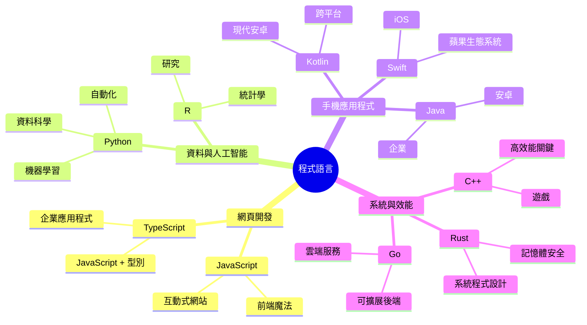
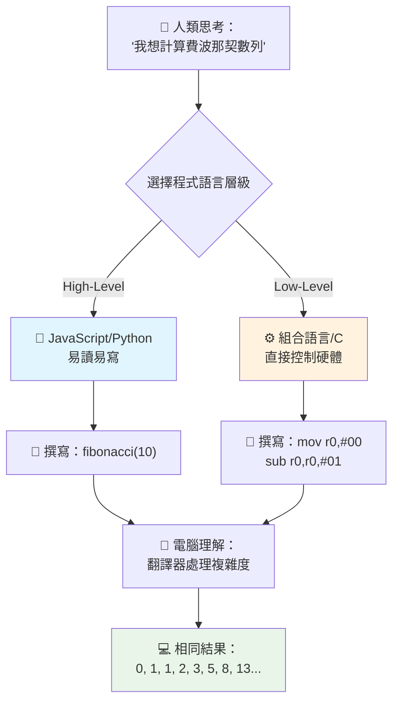
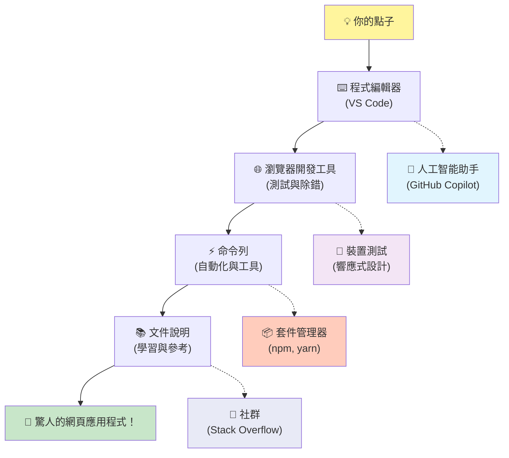
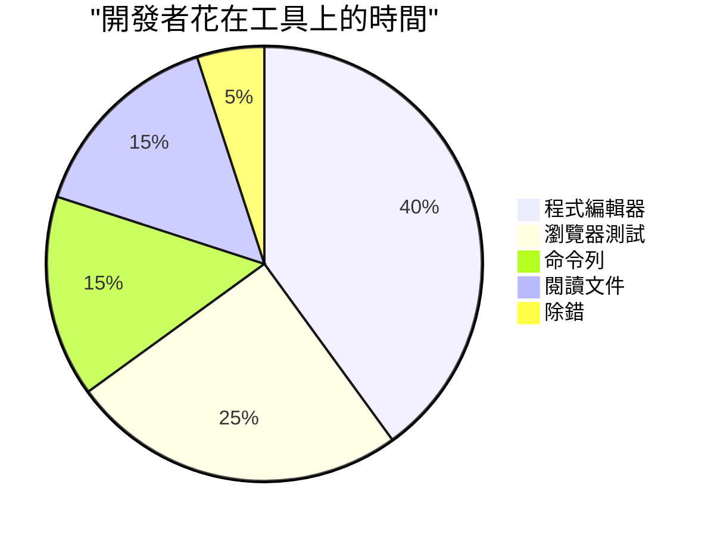
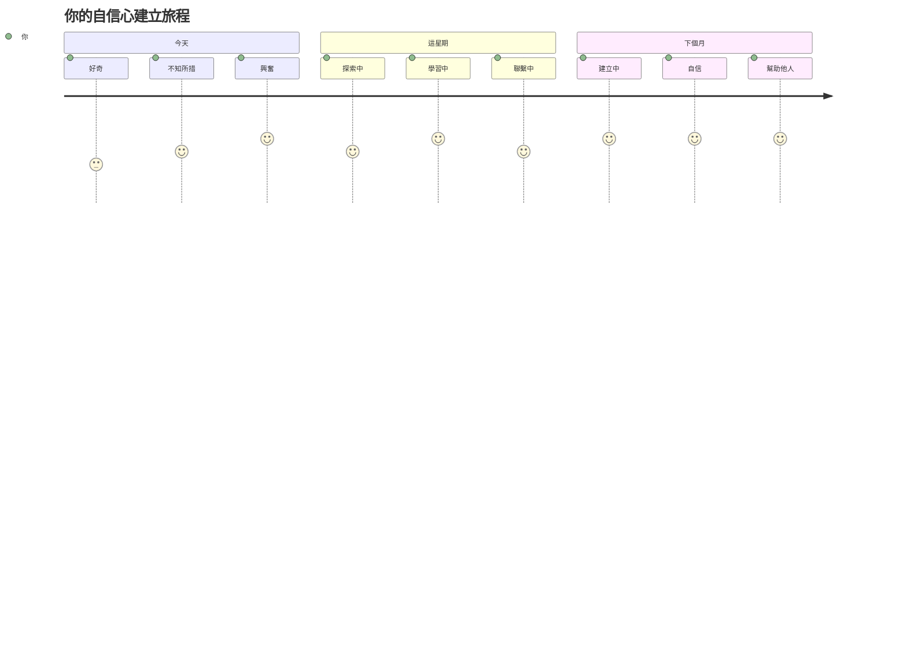

# 程式語言與現代開發工具簡介

嗨，未來的開發者！👋 可以告訴你一件每天都讓我激動不已的事嗎？你即將發現，程式設計不只是電腦的事——它其實是擁有將你最瘋狂的想法實現的超能力！

你知道用你最喜歡的應用程式時，那種一切都完美配合的時刻嗎？你點一下一個按鈕，然後發生了某種絕對神奇的事情，讓你忍不住說「哇，他們到底是怎麼做到的？」其實，那魔法就是被像你這樣的人寫出來的——可能正坐在他們最愛的咖啡店裡凌晨兩點，喝著第三杯濃縮咖啡。讓你驚奇的是：到本課程結束時，你不僅會了解他們怎麼做到的，而且你會迫不及待想自己試試看！

我明白如果現在程式設計讓你覺得害怕也很正常。當我剛開始時，我真的以為你得是數學天才或從五歲就開始寫程式才行。但以下這點完全改變了我的看法：程式設計就像學習一種新語言的溝通方式。你從「你好」和「謝謝」開始，然後學著點咖啡，不知不覺間，你就能有深刻的哲學討論！不過在這案例裡，你是跟電腦對話，而且說真的？它們是你能遇到最有耐心的對話夥伴——永遠不會因為你犯錯而評判你，還永遠樂意再試一次！

今天，我們要探索那些讓現代網頁開發不只是可能，而且令人著迷的工具。我說的就是 Netflix、Spotify 和你最愛的獨立應用程式工作室裡開發者每天都在用的編輯器、瀏覽器和工作流程。而且這會讓你忍不住跳舞的部分是：這些專業級、業界標準的工具大多數都是免費的！


> 速寫筆記由 [Tomomi Imura](https://twitter.com/girlie_mac) 製作


## 先來看看你已經知道什麼吧！

在進入有趣的部分之前，我很好奇——你對這個程式設計世界已經了解多少？聽著，如果你看到這些問題覺得「我真的完全不懂這些東西」，這不僅沒關係，反而非常完美！那代表你來對地方了。把這個小測驗想像成熱身運動——我們只是在讓大腦肌肉熱起來！

[參加課前小測驗](https://ff-quizzes.netlify.app/web/)


## 我們即將一起啟程的冒險

好啦，我真的超興奮要跟你分享今天要探討的東西！說真的，我多希望能看到當你某些概念突然懂了時的表情。這裡是我們要一起走的精彩旅程：

- **程式設計到底是什麼（為什麼它超酷！）**——我們會了解程式碼如何是周遭一切無形魔法的核心，從那鬧鐘怎麼知曉星期一早晨到演算法如何精準推薦你喜歡的 Netflix 節目
- **程式語言及其迷人的個性**——想像走進一場派對，每個人都擁有完全不同的超能力和解決問題的方式。那就是程式語言的世界，你會愛上認識它們！
- **促成數位魔法的基礎構件**——把這當作最強大的創意 LEGO 組合。一旦你懂得這些組件怎麼組合，你會發現幾乎可以搭建你想像中的任何東西
- **專業工具讓你像拿到魔法棒一樣的感覺**——我不是誇張，這些工具真的會讓你覺得自己有超能力，最棒的是？它們是專業人士也在用的！

> 💡 **重點是**：今天別試著硬記一切！我想你現在感受一下對可能性的興奮火花，細節會隨著我們一起實作自然記住——這才是真正的學習！

> 你也可以在 [Microsoft Learn](https://learn.microsoft.com/en-us/learn/modules/web-development-101/introduction-programming/?WT.mc_id=academic-77807-sagibbon) 上進行此課程！

## 所以程式設計究竟是什麼？

好，我們來挑戰這個價值百萬美元的問題：程式設計到底是什麼？

我來講個故事，徹底改變我看法的故事。上周我在跟媽媽解釋怎麼用我們的新智能電視遙控器。我自己講的時候就忍不住說「按那個紅色按鈕，但不是大紅色，是左邊小紅色的……不，你的另一邊左邊……好，現在按住兩秒，不是一秒，也不是三秒……」聽起來熟悉嗎？😅

那就是程式設計！它是給予非常精細、一字一句的指令給一台很強大的東西，但必須每一點都說得非常清楚的藝術。只不過你不是在解釋給媽媽聽（她還會問「哪個紅色按鈕？！」），而是在跟電腦講話（它只照字面執行，即使那可能不是你真正的意思）。

我第一次知道這點的時候超震撼：電腦其實在核心層面非常簡單。它們只懂兩個東西——1 和 0，基本上就是「是」和「否」或「開」和「關」。就這樣！但神奇的是——我們不用像《駭客任務》裡一樣用 1 和 0 說話。這時候 **程式語言** 就派上用場了。它們就好像世界上最棒的翻譯員，把你正常的人類想法翻譯成電腦聽得懂的語言。

每天早上醒來，這點仍然讓我心頭發涼：你生活中數位上的 *一切*，都是由像你一樣的人開始——大概穿著睡衣，手握一杯咖啡，在筆記型電腦上敲著程式碼。那個讓你看起來完美無瑕的 Instagram 濾鏡？有人寫的。帶你發現新最愛歌單的推薦演算法？有開發者建立的。幫你和朋友分攤晚餐帳單的 app？對，某人想著「這真麻煩，我一定能改進它」，然後……他們做到了！

學習程式設計不只是學新技能——你是在加入這個不可思議的解決問題社群，他們每天都在想：「如果我能建構一個讓某人日子更好一點的東西，那會如何？」老實說，有比這更酷的事嗎？

✅ **趣味知識探索**：有空時查查這個超酷小知識——你覺得世界上第一位電腦程式設計師是誰？給你個線索：答案可能不是你想的那個！她/他的故事超級吸引人，也證明程式設計一直都是關於創意解決問題和跳脫框架思考。

### 🧠 **現在心情如何？**

**花點時間想想：**
- 「給電腦指令」的概念現在清楚了嗎？
- 你能想到一個日常任務想用程式自動化嗎？
- 現在對程式設計有哪些問題想問？

> **記得**：如果有些概念現在還模糊，完全正常。學程式就像學新語言一樣——大腦需要時間建立神經連結。你做得很棒！

## 程式語言就像不同口味的魔法

好，這聽起來或許怪怪的，但請跟著我走——程式語言很像不同類型的音樂。想想看：你有爵士樂，順滑隨興；搖滾樂，有力直接；古典音樂，優雅結構化；還有饒舌，創意又有表現力。每種風格都有自己的氛圍、熱情的粉絲社群，而且適合不同心境和場合。

程式語言也是同理！你不會用同一種語言同時打造有趣的手機遊戲，和處理龐大氣候數據，就像你不會在瑜珈課放死亡金屬音樂（至少大多數瑜珈課不會！😄）。

但每次想到這點都讓我驚嘆不已：這些語言就像世界上最有耐心、最聰明的口譯員坐在你旁邊。你用符合人類思考的方式表達想法，它們處理所有極複雜的轉換，變成電腦真正懂的 1 和 0。就像有個朋友同時精通「人類創造力」和「電腦邏輯」——他永不疲倦，從不需要喝咖啡休息，也從不嫌你問同一個問題兩次！

### 熱門程式語言及其用途


| 語言 | 最適合 | 為何流行 |
|----------|----------|------------------|
| **JavaScript** | 網頁開發、使用者介面 | 可在瀏覽器中執行，支援互動網站 |
| **Python** | 資料科學、自動化、人工智慧 | 易讀易學，擁有強大函式庫 |
| **Java** | 企業應用、Android 應用 | 跨平台，穩健適合大型系統 |
| **C#** | Windows 應用、遊戲開發 | 微軟生態系統支援強大 |
| **Go** | 雲端服務、後端系統 | 快速簡單，專為現代運算設計 |

### 高階語言 vs. 低階語言

坦白說，這是我剛學時最大的困惑，所以我要分享那個讓我豁然開朗的比喻——希望對你也有幫助！

想像你到了個不會說當地語言的國家，非常想找廁所（我們都有過吧？😅）：

- **低階程式設計** 就像學會當地方言到能跟街角賣水果的阿嬤用當地的文化典故、俚語和內行笑話聊天。超厲害、高效率……如果你流利的話！但就只是想找廁所的你會覺得很頭大。

- **高階程式設計** 就像有個懂你的人當地朋友陪著你。你說「我真的需要找廁所」，他幫你翻譯文化脈絡，並用你的腦袋能理解的方式給你指路。

在程式語言裡：
- **低階語言**（像組合語言或 C）讓你能跟電腦的硬體層細緻交流，但你必須用機器思維來想，這……嗯，得改變不少思考方式！
- **高階語言**（像 JavaScript、Python 或 C#）讓你以人類思考方式想事，機器語言的部分它們幫你處理。而且它們有一群超熱情的社群，大家記得當新手的困難，真心想幫助你！

猜猜我會建議你從哪裡開始？😉 高階語言就像訓練輪，可能你永遠不想摘掉它，因為它讓整個過程輕鬆太多！


### 讓我示範為什麼高階語言更友善

好，我要秀給你看一段程式碼，完美說明我愛上高階語言的理由，但首先——我需要你跟我保證一件事。看到第一個程式碼範例不要慌！它故意看起來嚇人，這正是我要說的重點！

我們會看同一件事用兩種完全不同風格寫的程式碼。它們都做著同樣的事：創建所謂的費波那契數列——一個美麗的數學模式，每個數字是前兩個數字的和：0、1、1、2、3、5、8、13……（趣味小知識：這個模式自然界無處不在——葵花籽螺旋、松果排列，甚至星系的形成！）

準備好了嗎？出發！

**高階語言（JavaScript）——人類友善：**

```javascript
// 第一步：基本的費波納奇設置
const fibonacciCount = 10;
let current = 0;
let next = 1;

console.log('Fibonacci sequence:');
```

**這段程式碼做了什麼：**
- **宣告**一個常數指定要生產多少個費波那契數字
- **初始化**兩個變數追蹤序列中目前與下一個數字
- **設定**起始值（0 與 1）定義費波那契模式
- **展示**標題訊息來指明輸出內容

```javascript
// 步驟 2：使用迴圈產生序列
for (let i = 0; i < fibonacciCount; i++) {
  console.log(`Position ${i + 1}: ${current}`);
  
  // 計算序列中的下一個數字
  const sum = current + next;
  current = next;
  next = sum;
}
```

**解析發生的事：**
- 用 `for` 迴圈**循環**遍歷序列中每個位置
- 以模板字串格式**顯示**每個數字及其位置
- **計算**下一個費波那契數字，將目前與下一數字相加
- **更新**追蹤變數，準備進入下一次迭代

```javascript
// 第 3 步：現代函數式方法
const generateFibonacci = (count) => {
  const sequence = [0, 1];
  
  for (let i = 2; i < count; i++) {
    sequence[i] = sequence[i - 1] + sequence[i - 2];
  }
  
  return sequence;
};

// 使用範例
const fibSequence = generateFibonacci(10);
console.log(fibSequence);
```

**上方我們已經：**
- 使用現代箭頭函式語法**建立**重複使用的函式
- **建立**陣列存放完整序列，而不是一個一個顯示
- 利用陣列索引**計算**每個新數字由前面計算而來
- **回傳**完整序列方便程式其他地方彈性運用

**低階語言（ARM組合語言）——電腦友善：**

```assembly
 area ascen,code,readonly
 entry
 code32
 adr r0,thumb+1
 bx r0
 code16
thumb
 mov r0,#00
 sub r0,r0,#01
 mov r1,#01
 mov r4,#10
 ldr r2,=0x40000000
back add r0,r1
 str r0,[r2]
 add r2,#04
 mov r3,r0
 mov r0,r1
 mov r1,r3
 sub r4,#01
 cmp r4,#00
 bne back
 end
```

注意 JavaScript 版本幾乎像英語指令，而組合語言則用直接控制電腦處理器的神秘命令。兩者完成的任務完全一樣，但高階語言更容易讓人理解、撰寫與維護。

**你會注意到的重點差異：**
- **可讀性**：JavaScript 使用像 `fibonacciCount` 這樣具描述性的名稱，而 Assembly 使用像 `r0`、`r1` 這樣難以理解的標籤
- **註解**：高階語言鼓勵使用解釋性註解，讓代碼本身具備自我說明的功能
- **結構**：JavaScript 的邏輯流程與人類逐步思考問題的方式相符
- **維護性**：針對不同需求更新 JavaScript 的版本簡單且清晰

✅ **關於斐波那契數列**：這個絕美的數字模式（每個數字等於前兩個數字之和：0、1、1、2、3、5、8……）在自然界中無處不在！你會在向日葵的螺旋、松果的圖案、鸚鵡螺的曲線，甚至樹枝的生長方式中看到它。數學與程式碼幫助我們理解並重現自然創造美麗的模式，真是令人驚嘆！

## 讓魔法發生的基礎組件

好了，現在你已經看到程式語言的實際運作，讓我們來拆解構成所有程式的基礎元素。把它們想像成你最愛食譜中的基本材料——當你明白每一種材料的作用後，你就能讀寫幾乎所有語言的程式碼！

這有點像在學習程式設計語法。還記得學校裡學過的名詞、動詞和如何組句嗎？程式設計也有自己的語法，老實說，比英語語法還要更邏輯且寬容！😄

### 陳述句：逐步指令

先從**陳述句**開始——它們就像你與電腦對話的句子。每個陳述句告訴電腦做一件特定的事，就像給指示：「在這裡左轉」、「紅燈停」、「停在那個位子」。

我喜歡陳述句的原因是它們通常很容易閱讀。看這個範例：

```javascript
// 執行單一動作的基本陳述
const userName = "Alex";                    
console.log("Hello, world!");              
const sum = 5 + 3;                         
```

**這段程式碼的作用是：**
- **宣告**一個常數變數用來保存使用者名稱
- **印出**一段問候訊息到控制台輸出
- **計算**並保存一個數學運算的結果

```javascript
// 與網頁互動的語句
document.title = "My Awesome Website";      
document.body.style.backgroundColor = "lightblue";
```

**一步步來看發生了什麼：**
- **修改**瀏覽器分頁上顯示的網頁標題
- **變更**整個頁面主體的背景顏色

### 變數：程式的記憶系統

好的，**變數**說實話是我最喜歡教的一個概念，因為它們很像你每天使用的東西！

想想你手機上的聯絡人列表。你不會背所有人的電話號碼——你是儲存「媽媽」、「摯友」或「深夜外送披薩店」，讓手機幫你記住數字。變數也是一樣！它們像貼有標籤的容器，你的程式可以用有意義的名字存放資訊，之後再拿出來使用。

很酷的是：變數能在程式執行時改變（所以才叫「變數」——看他們怎麼取名的吧？）。就像當你發現更讚的披薩店時會更新聯絡人，變數也可以隨著程式得到新資訊或情況改變而更新！

讓我示範這有多簡單：

```javascript
// 第一步：建立基本變數
const siteName = "Weather Dashboard";        
let currentWeather = "sunny";               
let temperature = 75;                       
let isRaining = false;                      
```

**了解這些概念：**
- **用** `const` 儲存不變的值（例如網站名稱）
- **用** `let` 存儲整個程式中會變動的值
- **賦值**不同資料型態：字串（文字）、數字、布林值（真/假）
- **選擇**具描述性的變數名稱清楚表達內容

```javascript
// 第 2 步：使用物件來群組相關資料
const weatherData = {                       
  location: "San Francisco",
  humidity: 65,
  windSpeed: 12
};
```

**上面我們做了：**
- **創建**一個物件來將相關的天氣資訊組織在一起
- **將**多條資料歸類在同一個變數名下
- **用**鍵值對清楚標示各資訊

```javascript
// 第三步：使用和更新變數
console.log(`${siteName}: Today is ${currentWeather} and ${temperature}°F`);
console.log(`Wind speed: ${weatherData.windSpeed} mph`);

// 更新可變的變數
currentWeather = "cloudy";                  
temperature = 68;                          
```

**逐部分分析：**
- **用**模板字串 `${}` 語法顯示訊息
- **使用**點號操作符讀取物件屬性（`weatherData.windSpeed`）
- **更新**用 `let` 宣告的變數反映變化的狀況
- **結合**多個變數創造有意義的訊息

```javascript
// 第4步：使用現代解構賦值令代碼更清晰
const { location, humidity } = weatherData; 
console.log(`${location} humidity: ${humidity}%`);
```

**你需要知道的是：**
- **用**解構賦值擷取物件中特定屬性
- **自動**透過物件鍵名建立新變數
- **簡化**程式碼避免重複點號操作

### 控制流程：教你的程式如何思考

好了，這裡程式設計開始真正讓人驚豔！**控制流程**基本上就是教你的程式做出明智選擇，就像你每天不假思索地一樣。

想像這樣：今天早上你可能是這樣想，「如果下雨，我就帶傘；如果冷，我就穿外套；如果要遲到了，就跳過早餐直接買咖啡。」大腦每天自動無數次使用這種「如果…那麼」的邏輯！

這讓程式看起來智能又靈活，而不是只是照著死板無聊的指令執行。它們能觀察情況，評估正在發生什麼，並做出適當反應。就像給你的程式裝了一顆能判斷的腦袋！

想看看這運作有多美妙？讓我給你示範：

```javascript
// 第一步：基本條件邏輯
const userAge = 17;

if (userAge >= 18) {
  console.log("You can vote!");
} else {
  const yearsToWait = 18 - userAge;
  console.log(`You'll be able to vote in ${yearsToWait} year(s).`);
}
```

**這段程式碼做了這些事：**
- **檢查**使用者年齡是否符合投票資格
- **根據**條件結果執行不同程式區塊
- **計算**若未滿18歲，還需多久可投票
- **提供**針對不同情況的具體幫助訊息

```javascript
// 第2步：使用邏輯運算符的多重條件
const userAge = 17;
const hasPermission = true;

if (userAge >= 18 && hasPermission) {
  console.log("Access granted: You can enter the venue.");
} else if (userAge >= 16) {
  console.log("You need parent permission to enter.");
} else {
  console.log("Sorry, you must be at least 16 years old.");
}
```

**細說這裡發生的事：**
- **用** `&&`（且）運算符組合多個條件
- **用** `else if` 建立條件層次處理多種情景
- **用**最後的 `else` 處理所有未涵蓋的情況
- **提供**針對每種情況明確且可實行的回饋

```javascript
// 第3步：用三元運算子寫簡潔嘅條件判斷
const votingStatus = userAge >= 18 ? "Can vote" : "Cannot vote yet";
console.log(`Status: ${votingStatus}`);
```

**你要記住：**
- **用**三元運算子 (`? :`) 處理簡單兩項條件
- **格式**為 先寫條件，再問號，接著是真值結果，再冒號，最後是假值結果
- **適用於**需要根據條件賦值時

```javascript
// 第4步：處理多個特定情況
const dayOfWeek = "Tuesday";

switch (dayOfWeek) {
  case "Monday":
  case "Tuesday":
  case "Wednesday":
  case "Thursday":
  case "Friday":
    console.log("It's a weekday - time to work!");
    break;
  case "Saturday":
  case "Sunday":
    console.log("It's the weekend - time to relax!");
    break;
  default:
    console.log("Invalid day of the week");
}
```

**這段程式完成了：**
- **比對**變數值是否符合特定多個案例
- **集合**類似案例（平日 vs. 週末）
- **執行**找到匹配時的程式區塊
- **包含** `default` 來對付意外數值
- **用** `break` 阻止執行下個案例

> 💡 **現實生活比喻**：把控制流程想成世上最有耐心的 GPS 給你指路。它可能說「如果主街有塞車，就走高速公路。如果高速公路施工，就走風景路線。」程式用這種條件邏輯智慧地回應不同情境，總是給用戶最佳體驗。

### 🎯 **概念測試：組件掌握度**

**來看看你對基礎的掌握：**
- 你能用自己的話解釋變數和陳述句的差別嗎？
- 想個現實生活中用 if-then 決策的例子（像我們的投票範例）
- 程式邏輯中哪件事讓你最驚訝？

**快速自信加強：**

✅ **接下來的內容**：我們將更深入探討這些概念，展開一段令人興奮的程式設計之旅！現在只要感受到對未來無限可能的期待就好。隨著練習，技能和技巧自會自然紮根——我保證這會比你想像中更有趣！

## 開發必備工具

老實說，談到這裡我超級興奮都快按捺不住了！🚀 我們要聊聊能讓你感覺像拿到數碼太空船鑰匙的不可思議工具。

你知道廚師擁有那些像手臂延伸一樣的完美平衡刀具嗎？或者音樂家有一把觸碰就彷彿會歌唱的吉他？程序開發者有自己的魔法工具，而這裡有個絕對讓你驚嘆的秘密——大部分工具都是完全免費的！

我幾乎在椅子上跳起來想跟你分享，因為它們徹底改變了我們開發軟體的方式。我們說的是 AI 助理能幫你寫程式碼（我不是開玩笑！）、雲端環境讓你隨時隨地用 Wi-Fi 打造整個應用程式，以及超級強大的偵錯工具，就像你擁有程式的 X 光視力。

而且讓我起雞皮疙瘩的是：這些工具不是你用完就扔的「入門工具」。它們正是 Google、Netflix，以及你喜愛的獨立應用開發工作室的開發者們現在正在用的專業級工具。你會感覺自己超專業地使用它們！


### 程式碼編輯器和 IDE：你的新數碼摯友

來聊聊程式碼編輯器——它們很快就會成為你最愛待的地方！想像成你專屬的程式碼聖地，你會在這裡花最多時間打造和精進你的數碼創作。

現代編輯器的厲害之處在於：它們不僅是華麗的文字編輯器。它們就像全天候陪在你身邊的最棒程式碼導師。它們在你發現打錯前就幫你抓錯，還建議你讓程式更酷的改進，幫助你理解每行程式碼的意義，有些甚至能預測你下一句想打的內容，並幫你完成它！

我記得第一次發現自動補全功能時，感覺自己活在未來。你開始打字，編輯器馬上跳出說「嘿，你是不是想用這個正好符合作業的函式？」真的是像有個讀心的程式夥伴！

**這些編輯器厲害在哪裡？**

現代程式碼編輯器提供令人印象深刻的功能來提升你的生產力：

| 功能 | 功用 | 為什麼有幫助 |
|---------|--------------|--------------|
| **語法高亮** | 把程式碼部分分色 | 讓程式碼更易讀且容易發現錯誤 |
| **自動補全** | 打字時建議程式碼 | 加快撰寫速度並減少錯字 |
| **偵錯工具** | 幫助找出並修正錯誤 | 節省大量排錯時間 |
| **擴充套件** | 加入專門功能 | 客製化你的編輯器適合任何技術 |
| **AI 助理** | 建議程式碼和解說 | 加速學習與提高效率 |

> 🎥 **影片資源**：想看這些工具如何運作嗎？點此觀看[開發工具影片](https://youtube.com/watch?v=69WJeXGBdxg)做全面了解。

#### 建議的網頁開發編輯器

**[Visual Studio Code](https://code.visualstudio.com/?WT.mc_id=academic-77807-sagibbon)**（免費）
- 網頁開發者最愛
- 優秀的擴充套件生態系
- 內建終端機和 Git 整合
- **必裝擴充套件**：
  - [GitHub Copilot](https://marketplace.visualstudio.com/items?itemName=GitHub.copilot) - AI 程式碼建議
  - [Live Share](https://marketplace.visualstudio.com/items?itemName=MS-vsliveshare.vsliveshare) - 即時協作
  - [Prettier](https://marketplace.visualstudio.com/items?itemName=esbenp.prettier-vscode) - 自動格式化程式碼
  - [Code Spell Checker](https://marketplace.visualstudio.com/items?itemName=streetsidesoftware.code-spell-checker) - 程式碼拼寫檢查

**[JetBrains WebStorm](https://www.jetbrains.com/webstorm/)**（付費，學生免費）
- 進階偵錯和測試功能
- 智能程式碼補全
- 內建版本控制

**雲端 IDE**（多種價格方案）
- [GitHub Codespaces](https://github.com/features/codespaces) - 瀏覽器版完整 VS Code
- [Replit](https://replit.com/) - 學習和分享程式碼的好地方
- [StackBlitz](https://stackblitz.com/) - 即時全端網頁開發

> 💡 **入門建議**：先從 Visual Studio Code 開始——免費，業界廣泛使用，且社群強大，擁有豐富的教學與擴充套件資源。

### 網頁瀏覽器：你的秘密開發實驗室

好了，準備好大開眼界吧！你知道你一直用瀏覽器滑社群媒體和看影片對吧？實際上它們藏著一個超強的秘密開發實驗室，就在隨時待你發現！

每次你在網頁右鍵點選「檢查元素」，就是開啟了一個隱藏的開發者工具世界。這些工具的威力甚至比我以前花大錢買的軟體還強大。這就像發現你普通的廚房，背後竟藏著專業主廚的實驗室秘密通道！
第一次有人向我展示瀏覽器 DevTools 時，我花了大概三個小時一直點來點去，心想「等等，它還能做到這個？！」你真的可以即時編輯任何網站，準確看到所有東西載入的速度，測試網站在不同裝置上的外觀，甚至可以像專業人士一樣調試 JavaScript。這真是令人震驚！

**這就是為何瀏覽器是你秘密武器的原因：**

當你創建網站或網頁應用程式時，你需要看到它在真實世界中的外觀和行為。瀏覽器不僅顯示你的作品，還提供關於效能、可存取性和潛在問題的詳細反饋。

#### 瀏覽器開發者工具 (DevTools)

現代瀏覽器包含全面的開發套件：

| 工具類別 | 功能說明 | 範例用途 |
|----------|----------|----------|
| **元素檢視器** | 即時查看和編輯 HTML/CSS | 調整樣式以立即看到效果 |
| **主控台** | 查看錯誤訊息和測試 JavaScript | 調試問題和試驗程式碼 |
| **網路監控器** | 追蹤資源載入狀況 | 優化效能和載入時間 |
| **可存取性檢查** | 測試無障礙設計 | 確保網站適合所有使用者 |
| **裝置模擬器** | 預覽不同螢幕尺寸 | 測試響應式設計無需多裝置 |

#### 建議開發用瀏覽器

- **[Chrome](https://developers.google.com/web/tools/chrome-devtools/)** - 業界標準 DevTools，有豐富文件資源
- **[Firefox](https://developer.mozilla.org/docs/Tools)** - 出色的 CSS Grid 與可存取性工具
- **[Edge](https://docs.microsoft.com/microsoft-edge/devtools-guide-chromium/?WT.mc_id=academic-77807-sagibbon)** - 基於 Chromium，結合微軟開發者資源

> ⚠️ **重要測試提示**：一定要在多個瀏覽器中測試你的網站！在 Chrome 完美顯示的網站，可能在 Safari 或 Firefox 有不同表現。專業開發者會在所有主要瀏覽器中測試，確保使用者體驗一致。


### 指令行工具：你通往超級開發力的大門

好，讓我們誠實一點談談指令行，因為我希望你聽到的是從真正瞭解它的人那裡來的。剛開始看到那黑乎乎且閃爍著文字的螢幕時，我直覺反應是：「不行，絕對不行！這看起來像1980年代駭客電影裡的東西，我肯定不夠聰明！」😅

但我當時希望有人告訴我，也現在想告訴你的是真相：指令行並不可怕——它其實就像在和你的電腦直接對話。想像一下，用有圖片和菜單的精美App點餐（簡單方便）跟走進你常去的餐廳，廚師準確知道你喜歡什麼且只要你說「給我點驚喜」就能做出完美餐點的差別。

指令行是開發者覺得自己像魔法師的地方。你輸入幾個看似神奇的字（其實只是命令，但感覺就像魔法），按下 Enter，砰——你就創建了整個專案結構，安裝了全球強大的工具，或者將你的應用部署到網路，讓數百萬人看到。當你第一次感受到這種力量，就真的會上癮！

**為何指令行會成為你最喜歡的工具：**

雖然圖形介面適合許多工作，但指令行在自動化、精確度和速度上表現優異。許多開發工具主要透過指令行介面運作，學會有效使用它們能大幅提高工作效率。

```bash
# 第一步：建立並進入項目目錄
mkdir my-awesome-website
cd my-awesome-website
```

**這段程式碼做了什麼：**
- **建立** 一個叫做「my-awesome-website」的新資料夾當專案資料夾
- **進入** 剛建立的資料夾開始工作

```bash
# 第 2 步：使用 package.json 初始化專案
npm init -y

# 安裝現代開發工具
npm install --save-dev vite prettier eslint
npm install --save-dev @eslint/js
```

**一步步執行內容：**
- 使用 `npm init -y` **初始化** 一個預設的 Node.js 專案
- **安裝** Vite 作為快速開發及生產建置的現代化工具
- **新增** Prettier 用來自動格式化程式碼和 ESLint 做程式碼品質檢查
- 以 `--save-dev` 標記為開發時依賴

```bash
# 第三步：建立項目結構和檔案
mkdir src assets
echo '<!DOCTYPE html><html><head><title>My Site</title></head><body><h1>Hello World</h1></body></html>' > index.html

# 啟動開發伺服器
npx vite
```

**以上內容涵蓋了：**
- **組織** 專案架構，建立獨立的原始碼和資源資料夾
- **產生** 一個具有正確文件結構的基本 HTML 檔案
- **啟動** Vite 開發伺服器，提供即時重新載入和模組熱替換

#### 網頁開發必要指令行工具

| 工具 | 用途 | 重要性說明 |
|------|------|------------|
| **[Git](https://git-scm.com/)** | 版本控制 | 追蹤修改、團隊協作、備份作品 |
| **[Node.js & npm](https://nodejs.org/)** | JavaScript 執行環境和套件管理 | 瀏覽器外執行 JavaScript，安裝現代開發工具 |
| **[Vite](https://vitejs.dev/)** | 建置工具與開發伺服器 | 超快開發，支援模組熱替換 |
| **[ESLint](https://eslint.org/)** | 程式碼品質檢查 | 自動發現和修正 JavaScript 問題 |
| **[Prettier](https://prettier.io/)** | 程式碼格式化 | 保持程式碼風格統一且易讀 |

#### 平台對應選項

**Windows:**
- **[Windows Terminal](https://docs.microsoft.com/windows/terminal/?WT.mc_id=academic-77807-sagibbon)** - 現代且功能強大的終端機
- **[PowerShell](https://docs.microsoft.com/powershell/?WT.mc_id=academic-77807-sagibbon)** 💻 - 強大的指令腳本環境
- **[命令提示字元](https://docs.microsoft.com/windows-server/administration/windows-commands/?WT.mc_id=academic-77807-sagibbon)** 💻 - 傳統 Windows 命令行

**macOS:**
- **[Terminal](https://support.apple.com/guide/terminal/)** 💻 - 內建終端機應用程式
- **[iTerm2](https://iterm2.com/)** - 進階功能的終端機軟體

**Linux:**
- **[Bash](https://www.gnu.org/software/bash/)** 💻 - Linux 標準 Shell
- **[KDE Konsole](https://docs.kde.org/trunk5/en/konsole/konsole/index.html)** - 功能強大的終端模擬器

> 💻 = 作業系統預先安裝

> 🎯 **學習路徑**：先從基本指令開始，如 `cd`（切換目錄）、`ls` 或 `dir`（列出檔案）、`mkdir`（建立資料夾）。搭配現代開發流程指令如 `npm install`、`git status`、以及 `code .`（以 VS Code 開啟當前目錄）。隨著熟悉度提升，自然會學會更多進階指令和自動化技巧。


### 文件資料：你永遠取得的學習導師

好了，我要分享一個小秘密，它會讓你對自己是新手的身份感到更安心：即便是最資深的開發者，也花大量時間閱讀文件。這不代表他們不懂事情，而是智慧的象徵！

把文件看作是世界上最有耐心、最博學的老師，全天候隨時待命。凌晨兩點卡關了？文件就像溫暖的虛擬擁抱，給你正確答案。想學習大家都在談論的新功能？文件有逐步範例支援你。想知道為什麼某件事情是這樣運作？沒錯，文件會用淺顯易懂的方式解釋，讓你恍然大悟！

改變我觀點的一件事是：網頁開發世界變化非常快，沒有人（重點是沒有人！）會把所有細節都記牢。我看到有超過 15 年經驗的資深開發者還查語法，沒什麼尷尬的——那很聰明！重點不是記憶完美，而是知道快速找到可靠答案並解決問題。

**真實魔法發生在這裡：**

專業開發者花大部分時間閱讀文件，不是因為不會做，而是因為網頁開發快速演進，要持續學習才能跟上。優秀文件讓你不只懂「怎麼用」，更了解「為什麼要用」和「什麼時候用」。

#### 重要文件資源

**[Mozilla Developer Network (MDN)](https://developer.mozilla.org/docs/Web)**
- 網頁技術文件的黃金標準
- 包羅萬象的 HTML、CSS 和 JavaScript 指南
- 包含瀏覽器相容性資訊
- 實用範例與互動示範

**[Web.dev](https://web.dev)** (Google 出品)
- 現代網頁開發最佳實踐
- 效能優化指南
- 無障礙與包容設計原則
- 真實案例研究

**[Microsoft Developer Documentation](https://docs.microsoft.com/microsoft-edge/#microsoft-edge-for-developers)**
- Edge 瀏覽器開發資源
- 漸進式網頁應用程式指導
- 跨平台開發見解

**[Frontend Masters Learning Paths](https://frontendmasters.com/learn/)**
- 結構化學習課程
- 業界專家影音教學
- 實作練習

> 📚 **學習策略**：不要試著背文件，而是學習如何高效瀏覽。收藏常用參考，練習使用搜尋功能迅速找到所需資訊。

### 🔧 **工具掌握檢核：你對什麼最有共鳴？**

**暫停一下思考：**
- 你最想先嘗試哪個工具？（沒有錯誤答案！）
- 指令行還讓你感到害怕，還是覺得好奇了？
- 你會想用瀏覽器 DevTools 來窺探喜愛網站的運作嗎？


> **有趣洞察**：大部分開發者約 40% 時間待在程式碼編輯器中，但注意測試、學習和解決問題花了多少時間。寫程式不只是寫程式碼，而是在塑造使用者體驗！

✅ **思考題**：這有趣的是，網站「開發」（寫程式碼）工具，和網站「設計」（外觀設計）工具會有什麼差別？就像建築師設計漂亮房子，跟實際承包商蓋房子，兩者都很重要但工具箱不一樣！這種想法會幫你看到網站誕生的全貌。

## GitHub Copilot Agent 挑戰 🚀

使用 Agent 模式完成以下挑戰：

**描述：** 探索一款現代程式碼編輯器或 IDE 的功能，並示範它如何提升你作為網頁開發者的工作流程。

**提示：** 選擇一款程式碼編輯器或 IDE（如 Visual Studio Code、WebStorm、或雲端 IDE）。列出三個功能或擴充套件，說明它們如何幫助你更有效率地撰寫、調試或維護程式碼。並針對每項說明其對工作流程的好處。

---

## 🚀 挑戰

**偵探，你準備好接案了嗎？**

現在你已打下超棒的基礎，我會帶你一趟冒險，看清楚程式世界究竟多麼多元且有趣。聽我說——這還不是寫程式碼的時候，別有壓力！把自己當成程式語言偵探，接受你人生的第一個有趣案件！

**你的任務（如你願意接受）：**
1. **成為語言探險家**：從完全不同領域挑三種程式語言——比方說，一個是用來建網站，一個用來寫手機應用，一個用於科學資料分析。找出同一個簡單任務在每種語言的範例。我保證你會驚訝地發現他們外觀可以完全不同，做出來卻一樣！

2. **挖掘起源故事**：什麼讓每種語言特別？冷知識來了——每種程式語言的誕生都是因為有人想著：「有沒有更好的方法來解決這個特定問題？」你能找出這些問題是什麼嗎？背後故事真心很吸引人！

3. **認識社群**：看看每個語言的社群有多熱情和包容。有些社群有數百萬開發者共享知識助人，有些則是小而緊密支持彼此。你會喜歡看到這些社群的不同個性！

4. **跟隨直覺**：現在哪個語言感覺最親切？別擔心做「完美」選擇——只要聽從你的直覺！這裡沒有錯答案，未來你隨時都能探索其他語言。

**額外偵探工作**：試著發掘每種語言支持開發了哪些大型網站或應用。我敢保證，你會震驚 Instagram、Netflix 或你停不下來玩的手機遊戲是用什麼寫成的！

> 💡 **記住**：你今天不是要成為專家，只是先熟悉這個領域，看看想在哪裡落腳。慢慢來，玩得開心，讓好奇心引領你！

## 來慶祝你發現的新世界！

哇哩咧，你今天吸收了超多精彩資訊！我真心期待知道這趟精彩旅程中，你留下了多少印象。記住——這不是考試，不用全數完美通過。這是一場你對即將進入的奇妙世界認識的慶祝派對！

[前往課後小測驗](https://ff-quizzes.netlify.app/web/)

## 複習與自學

**慢慢探索，玩得開心！**
你今天已經學了好多，值得感到驕傲！現在來到有趣的部分——探索激發你好奇心的主題。記住，這不是功課——而是一場冒險！

**深入探索讓你興奮的事物：**

**親身實踐程式語言：**
- 瀏覽你感興趣的 2-3 種程式語言官方網站。每一種語言都有自己的個性和故事！
- 嘗試一些線上編程遊樂場，例如 [CodePen](https://codepen.io/)、[JSFiddle](https://jsfiddle.net/)、或 [Replit](https://replit.com/)。不要害怕嘗試——你不會壞掉任何東西！
- 閱讀你最喜歡語言的誕生故事。說真的，其中一些起源故事非常有趣，能幫助你理解語言的運作原理。

**熟悉你的新工具：**
- 如果還沒下載 Visual Studio Code，趕快下載——它是免費的，而且你一定會喜歡！
- 花幾分鐘瀏覽擴充套件市場。它就像你編輯器的應用程式商店！
- 打開瀏覽器的開發者工具，隨便點點。別擔心要完全理解，只要熟悉內容即可。

**加入開發者社群：**
- 追蹤一些開發者社群，像是 [Dev.to](https://dev.to/)、[Stack Overflow](https://stackoverflow.com/)，或 [GitHub](https://github.com/)。程式設計社群對新人非常友善！
- 在 YouTube 上看一些適合初學者的編程影片。有許多優秀的創作者記得當初入門時的感受。
- 考慮參加本地聚會或線上社群。相信我，開發者們很樂意幫助新人！

> 🎯 **聽著，這是我希望你記得的**：你不需要一夕之間成為程式高手！現在，你只是在認識即將加入的這個精彩世界。慢慢來，享受過程，並記得——每一個你敬佩的開發者都曾坐在你現在的位置，既興奮又可能有些茫然。這很正常，也代表你做得很對！


## 作業

[Reading the Docs](assignment.md)

> 💡 **作業的小提示**：我非常希望看到你探索我們還沒提過的工具！跳過已講過的編輯器、瀏覽器和指令列工具——有整個令人驚嘆的開發工具世界正等待你發現。挑選那些仍積極維護且擁有活躍、熱心社群的工具（這些通常有最棒的教學，當你卡住需要幫助時也有最支持你的人）。

---

## 🚀 你的程式設計旅程時間表

### ⚡ **接下來 5 分鐘能做的事**
- [ ] 標記 2-3 個你有興趣的程式語言網站
- [ ] 如果還沒下載，趕快下載 Visual Studio Code
- [ ] 打開瀏覽器的開發者工具（F12），並在任一網站隨意點擊
- [ ] 加入一個程式設計社群（Dev.to、Reddit r/webdev 或 Stack Overflow）

### ⏰ **接下來 1 小時可完成的事**
- [ ] 完成課後測驗並反思你的答案
- [ ] 設定 VS Code，安裝 GitHub Copilot 擴充套件
- [ ] 線上嘗試兩種程式語言寫「Hello World」範例
- [ ] 看一部 YouTube 上的「開發者的一天」影片
- [ ] 開始你的程式語言偵探任務（依挑戰內容）

### 📅 **你的一週冒險計畫**
- [ ] 完成作業，探索 3 種全新開發工具
- [ ] 在社群媒體上追蹤 5 位開發者或程式相關帳號
- [ ] 嘗試在 CodePen 或 Replit 製作一些小作品（即使只是「Hello, [你的名字]！」）
- [ ] 閱讀一篇有關開發者程式生涯的部落格文章
- [ ] 參加一次線上聚會或觀看程式設計演講
- [ ] 使用線上教學開始學習你選擇的程式語言

### 🗓️ **你的一個月轉化計畫**
- [ ] 製作你的第一個小專案（即使只是簡單網頁也算！）
- [ ] 為開源專案貢獻（先從文件修正開始）
- [ ] 指導剛開始學程式的人
- [ ] 建立你的開發者個人作品網站
- [ ] 與本地開發者社群或讀書會建立連結
- [ ] 開始規劃你的下一個學習目標

### 🎯 **最後反思檢視**

**在繼續之前，花點時間慶祝：**
- 今天關於程式設計，讓你感到興奮的是什麼？
- 你想先探索哪個工具或概念？
- 你對開始這段程式旅程感覺如何？
- 你現在最想問開發者什麼問題？


> 🌟 **記住**：每個專家都曾是初學者。每位資深開發者都有過和你現在一樣的感受——興奮、可能有點不知所措，並且充滿好奇。你正處於一群了不起的人群中，這趟旅程將十分精彩。歡迎來到美妙的程式世界！ 🎉

---

<!-- CO-OP TRANSLATOR DISCLAIMER START -->
**免責聲明**：  
本文件係使用 AI 翻譯服務 [Co-op Translator](https://github.com/Azure/co-op-translator) 進行翻譯。雖然我哋致力於準確性，但請注意自動翻譯可能包含錯誤或不準確之處。原始文件之母語版本應視為唯一具權威嘅版本。對於重要資料，建議採用專業人工翻譯。我哋對因使用本翻譯而引起嘅任何誤解或誤譯概不負責。
<!-- CO-OP TRANSLATOR DISCLAIMER END -->