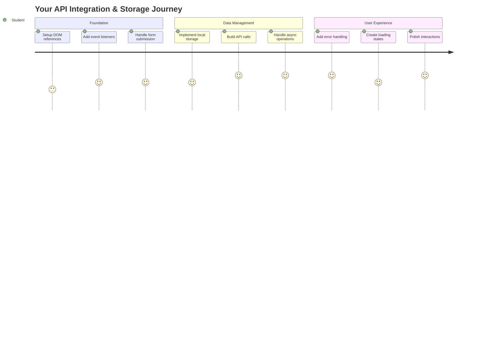
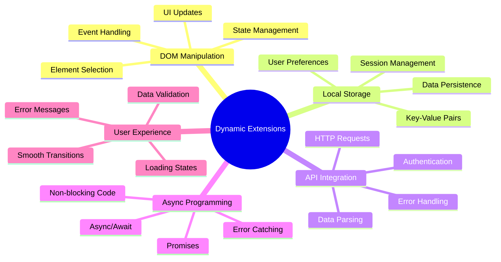
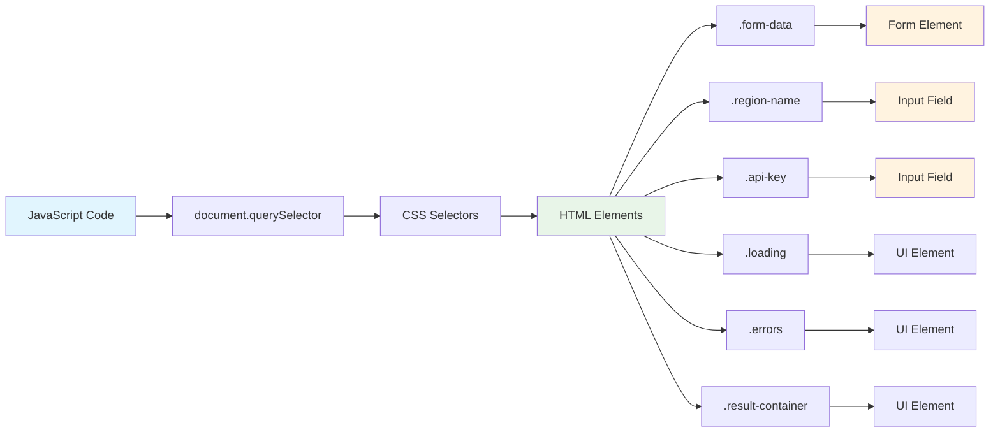
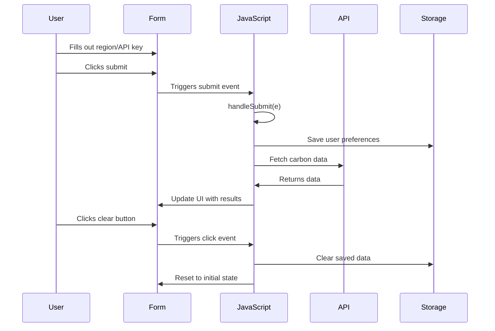
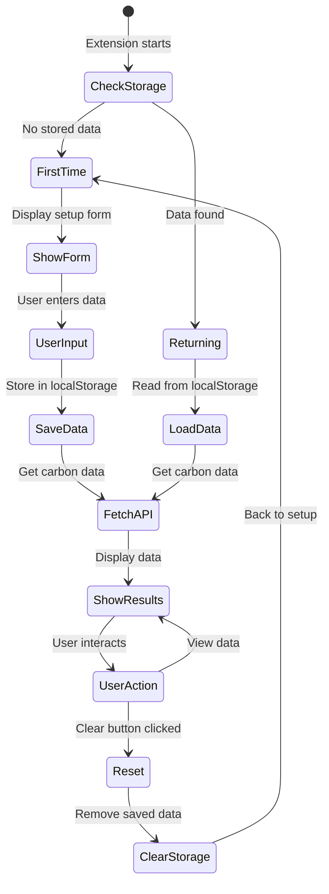
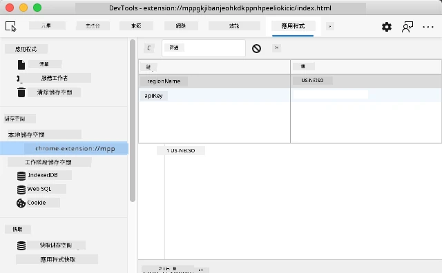
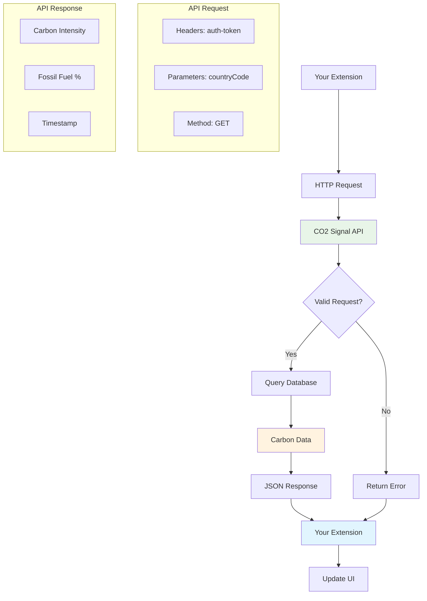
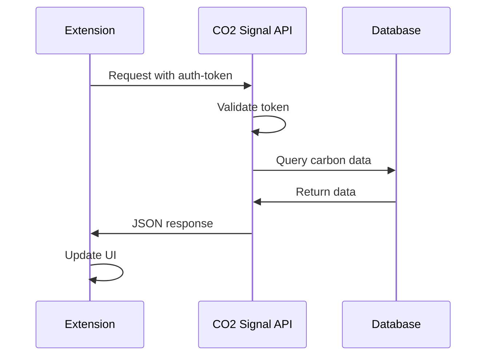
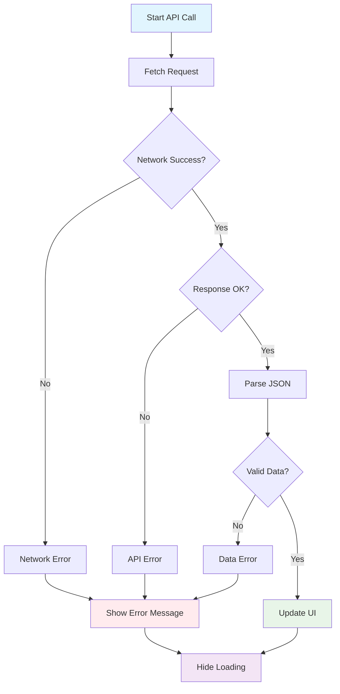
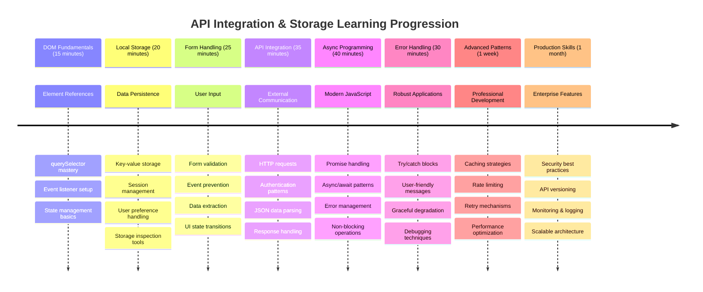

# 瀏覽器擴充功能專案第二部分：呼叫 API，使用本地存儲



## 課前測驗

[課前測驗](https://ff-quizzes.netlify.app/web/quiz/25)

## 簡介

還記得你開始建立的瀏覽器擴充功能嗎？目前你有一個外觀漂亮的表單，但它基本上是靜態的。今天我們將讓它變得更有生命力，透過連接真實數據並賦予它記憶功能。

想想阿波羅任務控制電腦——它們不僅僅顯示固定的信息。它們不斷與航天器通信，更新遙測數據，並記住關鍵的任務參數。這就是我們今天要構建的動態行為。你的擴充功能將連接到互聯網，抓取真實的環境數據，並記住你的設置以供下次使用。

API 整合可能聽起來很複雜，但其實只是教你的程式碼如何與其他服務通信。無論是獲取天氣數據、社交媒體動態，還是像今天我們要做的那樣獲取碳足跡信息，這一切都關於建立這些數字連接。我們還將探索瀏覽器如何持久化信息——類似於圖書館使用卡片目錄來記住書籍的位置。

在本課結束時，你將擁有一個能夠抓取真實數據、存儲用戶偏好並提供流暢體驗的瀏覽器擴充功能。讓我們開始吧！



✅ 按照適當文件中的編號段落，了解應將程式碼放置在哪裡

## 設置擴充功能中需要操作的元素

在你的 JavaScript 可以操作界面之前，它需要引用特定的 HTML 元素。想像一下望遠鏡需要指向特定的星星——在伽利略研究木星的衛星之前，他必須先定位並聚焦在木星本身。

在你的 `index.js` 文件中，我們將創建 `const` 變數來捕捉每個重要表單元素的引用。這類似於科學家標記他們的設備——而不是每次都在整個實驗室中搜索，他們可以直接訪問所需的東西。



```javascript
// form fields
const form = document.querySelector('.form-data');
const region = document.querySelector('.region-name');
const apiKey = document.querySelector('.api-key');

// results
const errors = document.querySelector('.errors');
const loading = document.querySelector('.loading');
const results = document.querySelector('.result-container');
const usage = document.querySelector('.carbon-usage');
const fossilfuel = document.querySelector('.fossil-fuel');
const myregion = document.querySelector('.my-region');
const clearBtn = document.querySelector('.clear-btn');
```

**這段程式碼的作用：**
- **捕捉** 表單元素，使用 `document.querySelector()` 和 CSS 類選擇器
- **創建** 對區域名稱和 API 密鑰輸入字段的引用
- **建立** 與顯示碳使用數據的結果元素的連接
- **設置** 對 UI 元素（如加載指示器和錯誤消息）的訪問
- **存儲** 每個元素引用到 `const` 變數中，以便在程式碼中輕鬆重用

## 添加事件監聽器

現在我們將讓你的擴充功能對用戶操作做出響應。事件監聽器是你的程式碼監控用戶交互的方式。想像它們像早期電話交換所的操作員——他們聆聽來電，並在有人想要建立連接時接通正確的電路。



```javascript
form.addEventListener('submit', (e) => handleSubmit(e));
clearBtn.addEventListener('click', (e) => reset(e));
init();
```

**理解這些概念：**
- **附加** 一個提交監聽器到表單，當用戶按下 Enter 或點擊提交時觸發
- **連接** 一個點擊監聽器到清除按鈕，用於重置表單
- **傳遞** 事件對象 `(e)` 到處理函數以進一步控制
- **立即調用** `init()` 函數以設置擴充功能的初始狀態

✅ 注意這裡使用的簡潔箭頭函數語法。這種現代 JavaScript 方法比傳統函數表達式更簡潔，但兩者都同樣有效！

### 🔄 **教學檢查**
**事件處理理解**：在進入初始化之前，確保你能：
- ✅ 解釋 `addEventListener` 如何將用戶操作連接到 JavaScript 函數
- ✅ 理解為什麼我們將事件對象 `(e)` 傳遞給處理函數
- ✅ 辨別 `submit` 和 `click` 事件的區別
- ✅ 描述 `init()` 函數何時運行以及原因

**快速自測**：如果在表單提交中忘記 `e.preventDefault()` 會發生什麼？
*答案：頁面會重新加載，丟失所有 JavaScript 狀態並中斷用戶體驗*

## 構建初始化和重置函數

讓我們為你的擴充功能創建初始化邏輯。`init()` 函數就像船的導航系統檢查其儀器——它確定當前狀態並相應地調整界面。它檢查是否有人之前使用過你的擴充功能並加載他們的先前設置。

`reset()` 函數為用戶提供一個全新的開始——類似於科學家在實驗之間重置儀器以確保數據乾淨。

```javascript
function init() {
	// Check if user has previously saved API credentials
	const storedApiKey = localStorage.getItem('apiKey');
	const storedRegion = localStorage.getItem('regionName');

	// Set extension icon to generic green (placeholder for future lesson)
	// TODO: Implement icon update in next lesson

	if (storedApiKey === null || storedRegion === null) {
		// First-time user: show the setup form
		form.style.display = 'block';
		results.style.display = 'none';
		loading.style.display = 'none';
		clearBtn.style.display = 'none';
		errors.textContent = '';
	} else {
		// Returning user: load their saved data automatically
		displayCarbonUsage(storedApiKey, storedRegion);
		results.style.display = 'none';
		form.style.display = 'none';
		clearBtn.style.display = 'block';
	}
}

function reset(e) {
	e.preventDefault();
	// Clear stored region to allow user to choose a new location
	localStorage.removeItem('regionName');
	// Restart the initialization process
	init();
}
```

**這裡發生了什麼：**
- **檢索** 瀏覽器本地存儲中的 API 密鑰和區域
- **檢查** 這是第一次使用者（沒有存儲的憑據）還是回訪用戶
- **顯示** 設置表單給新用戶並隱藏其他界面元素
- **自動加載** 保存的數據給回訪用戶並顯示重置選項
- **管理** 根據可用數據的用戶界面狀態

**關於本地存儲的關鍵概念：**
- **持久化** 數據在瀏覽器會話之間（與會話存儲不同）
- **以鍵值對形式存儲** 數據，使用 `getItem()` 和 `setItem()`
- **當某個鍵沒有數據時返回** `null`
- **提供** 一種簡單的方法來記住用戶偏好和設置

> 💡 **理解瀏覽器存儲**：[LocalStorage](https://developer.mozilla.org/docs/Web/API/Window/localStorage) 就像給你的擴充功能持久記憶。想想古代亞歷山大圖書館如何存儲卷軸——即使學者離開後再回來，信息仍然可用。
>
> **關鍵特性：**
> - **持久化** 數據，即使你關閉瀏覽器
> - **存活** 電腦重啟和瀏覽器崩潰
> - **提供** 大量存儲空間用於用戶偏好
> - **提供** 即時訪問，無需網絡延遲

> **重要注意事項**：你的瀏覽器擴充功能有自己的獨立本地存儲，與普通網頁分開。這提供了安全性並防止與其他網站的衝突。

你可以通過打開瀏覽器開發者工具（F12），導航到 **Application** 標籤，並展開 **Local Storage** 部分來查看存儲的數據。





> ⚠️ **安全考量**：在生產應用中，將 API 密鑰存儲在 LocalStorage 中存在安全風險，因為 JavaScript 可以訪問這些數據。作為學習用途，這種方法是可以的，但真正的應用應該使用安全的伺服器端存儲來保存敏感憑據。

## 處理表單提交

現在我們將處理當有人提交你的表單時會發生什麼。默認情況下，瀏覽器在表單提交時會重新加載頁面，但我們將攔截這種行為以創建更流暢的體驗。

這種方法類似於任務控制如何處理航天器通信——而不是每次傳輸都重置整個系統，它們在處理新信息的同時保持連續運行。

創建一個函數來捕捉表單提交事件並提取用戶的輸入：

```javascript
function handleSubmit(e) {
	e.preventDefault();
	setUpUser(apiKey.value, region.value);
}
```

**在上面，我們已經：**
- **防止** 表單提交的默認行為，這會刷新頁面
- **提取** 用戶輸入值，來自 API 密鑰和區域字段
- **將** 表單數據傳遞給 `setUpUser()` 函數進行處理
- **保持** 單頁應用行為，避免頁面重新加載

✅ 記住你的 HTML 表單字段包含 `required` 屬性，因此瀏覽器會自動驗證用戶在此函數運行之前提供了 API 密鑰和區域。

## 設置用戶偏好

`setUpUser` 函數負責保存用戶憑據並啟動第一次 API 調用。這創造了一個從設置到顯示結果的流暢過渡。

```javascript
function setUpUser(apiKey, regionName) {
	// Save user credentials for future sessions
	localStorage.setItem('apiKey', apiKey);
	localStorage.setItem('regionName', regionName);
	
	// Update UI to show loading state
	loading.style.display = 'block';
	errors.textContent = '';
	clearBtn.style.display = 'block';
	
	// Fetch carbon usage data with user's credentials
	displayCarbonUsage(apiKey, regionName);
}
```

**逐步解析，這裡發生了什麼：**
- **保存** API 密鑰和區域名稱到本地存儲以供未來使用
- **顯示** 加載指示器，通知用戶正在抓取數據
- **清除** 顯示中的任何先前錯誤消息
- **顯示** 清除按鈕，供用戶稍後重置設置
- **啟動** API 調用以抓取真實的碳使用數據

此函數通過在一個協調的操作中管理數據持久性和用戶界面更新，創造了流暢的用戶體驗。

## 顯示碳使用數據

現在我們將通過 API 將你的擴充功能連接到外部數據源。這將你的擴充功能從一個獨立工具轉變為可以訪問互聯網實時信息的工具。

**理解 API**

[API](https://www.webopedia.com/TERM/A/API.html) 是不同應用之間通信的方式。想像它們像19世紀連接遙遠城市的電報系統——操作員會向遠方的站點發送請求並接收所需信息的回應。每次你查看社交媒體、向語音助手提問或使用配送應用，API 都在促進這些數據交換。



**關於 REST API 的關鍵概念：**
- **REST** 代表“表述性狀態轉移”
- **使用** 標準 HTTP 方法（GET、POST、PUT、DELETE）與數據交互
- **返回** 可預測格式的數據，通常是 JSON
- **提供** 一致的基於 URL 的端點，用於不同類型的請求

✅ 我們將使用的 [CO2 Signal API](https://www.co2signal.com/) 提供來自全球電網的實時碳強度數據。這有助於用戶了解其電力使用的環境影響！

> 💡 **理解非同步 JavaScript**：[`async` 關鍵字](https://developer.mozilla.org/docs/Web/JavaScript/Reference/Statements/async_function) 使你的程式碼能夠同時處理多個操作。當你向伺服器請求數據時，你不希望整個擴充功能卡住——這就像空中交通管制在等待一架飛機回應時停止所有操作。
>
> **主要優勢：**
> - **保持** 擴充功能的響應性，同時數據加載
> - **允許** 其他程式碼在網絡請求期間繼續執行
> - **提高** 程式碼可讀性，相比傳統回調模式
> - **支持** 網絡問題的優雅錯誤處理

這裡有一段關於 `async` 的快速視頻：

[](https://youtube.com/watch?v=YwmlRkrxvkk "管理 Promise 的 Async 和 Await")

> 🎥 點擊上方圖片觀看有關 async/await 的視頻。

### 🔄 **教學檢查**
**非同步程式設計理解**：在深入 API 函數之前，確認你理解：
- ✅ 為什麼我們使用 `async/await` 而不是阻塞整個擴充功能
- ✅ `try/catch` 塊如何優雅地處理網絡錯誤
- ✅ 同步操作和非同步操作的區別
- ✅ 為什麼 API 調用可能失敗以及如何處理這些失敗

**現實生活中的連接**：考慮以下日常的非同步例子：
- **點餐**：你不會一直站在廚房旁邊等候——你會拿到收據並繼續其他活動
- **發送電子郵件**：你的電子郵件應用在發送時不會卡住——你可以繼續撰寫更多郵件
- **加載網頁**：圖片逐步加載，而你已經可以閱讀文字

**API 驗證流程**：


創建函數以抓取和顯示碳使用數據：

```javascript
// Modern fetch API approach (no external dependencies needed)
async function displayCarbonUsage(apiKey, region) {
	try {
		// Fetch carbon intensity data from CO2 Signal API
		const response = await fetch('https://api.co2signal.com/v1/latest', {
			method: 'GET',
			headers: {
				'auth-token': apiKey,
				'Content-Type': 'application/json'
			},
			// Add query parameters for the specific region
			...new URLSearchParams({ countryCode: region }) && {
				url: `https://api.co2signal.com/v1/latest?countryCode=${region}`
			}
		});

		// Check if the API request was successful
		if (!response.ok) {
			throw new Error(`API request failed: ${response.status}`);
		}

		const data = await response.json();
		const carbonData = data.data;

		// Calculate rounded carbon intensity value
		const carbonIntensity = Math.round(carbonData.carbonIntensity);

		// Update the user interface with fetched data
		loading.style.display = 'none';
		form.style.display = 'none';
		myregion.textContent = region.toUpperCase();
		usage.textContent = `${carbonIntensity} grams (grams CO₂ emitted per kilowatt hour)`;
		fossilfuel.textContent = `${carbonData.fossilFuelPercentage.toFixed(2)}% (percentage of fossil fuels used to generate electricity)`;
		results.style.display = 'block';

		// TODO: calculateColor(carbonIntensity) - implement in next lesson

	} catch (error) {
		console.error('Error fetching carbon data:', error);
		
		// Show user-friendly error message
		loading.style.display = 'none';
		results.style.display = 'none';
		errors.textContent = 'Sorry, we couldn\'t fetch data for that region. Please check your API key and region code.';
	}
}
```

**逐步解析這裡發生了什麼：**
- **使用** 現代的 `fetch()` API，而不是像 Axios 這樣的外部庫，以獲得更簡潔、無依賴的程式碼
- **實現** 使用 `response.ok` 的正確錯誤檢查，及早捕捉 API 失敗
- **處理** 非同步操作，使用 `async/await` 以更可讀的程式碼流程
- **使用** `auth-token` 標頭進行 CO2 Signal API 的身份驗證
- **解析** JSON 回應數據並提取碳強度信息
- **更新** 多個 UI 元素，顯示格式化的環境數據
- **提供** 用戶友好的錯誤消息，當 API 調用失敗時

**展示的現代 JavaScript 關鍵概念：**
- 使用 `${}` 語法的 **模板字面量**，以實現簡潔的字符串格式化
- 使用 `try/catch` 塊進行 **錯誤處理**，以構建穩健的應用
- 使用 **Async/await** 模式，優雅地處理網絡請求
- 使用 **對象解構**，從 API 回應中提取特定數據
- 使用 **方法鏈接**，進行多個 DOM 操作

✅ 此函數展示了幾個重要的網頁開發概念——與外部伺服器通信、處理身份驗證、處理數據、更新界面以及優雅地管理錯誤。這些是專業開發人員經常使用的基本技能。



### 🔄 **教學檢查**
**完整系統理解**：確認你掌握了整個流程：
- ✅ DOM 引用如何使 JavaScript 能夠控制界面
- ✅ 為什麼本地存儲在瀏覽器會話之間創建持久性
- ✅ 非同步操作如何使 API 調用不會卡住擴充功能
- ✅ API 調用失敗時會發生什麼以及如何處理這些錯誤
- ✅ 為什麼用戶體驗包括加載狀態和錯誤消息

🎉 **你已完成的成果：** 你已經創建了一個瀏覽器擴充功能，能夠：
- **連接** 到互聯網並檢索真實的環境數據
- **持久化** 用戶設置於會話之間
- **優雅地處理** 錯誤，而不是崩潰
- **提供** 流暢、專業的用戶體驗

通過運行 `npm run build` 並在瀏覽器中刷新你的擴充功能來測試你的作品。你現在擁有了一個功能齊全的碳足跡追蹤器。下一課將添加動態圖標功能以完成擴充功能。

---

## GitHub Copilot Agent 挑戰 🚀

使用 Agent 模式完成以下挑戰：
**描述：** 增強瀏覽器擴充功能，加入錯誤處理改進及使用者體驗功能。這項挑戰將幫助你練習使用現代 JavaScript 模式進行 API、localStorage 和 DOM 操作。

**提示：** 創建一個增強版的 displayCarbonUsage 函數，需包含以下功能：1) 為失敗的 API 呼叫添加指數回退的重試機制，2) 在進行 API 呼叫之前驗證地區代碼輸入，3) 加入進度指示器的加載動畫，4) 將 API 回應緩存到 localStorage 並設置過期時間戳（緩存 30 分鐘），5) 顯示之前 API 呼叫的歷史數據。此外，使用 TypeScript 風格的 JSDoc 註解來記錄所有函數參數及返回類型。

了解更多關於 [agent mode](https://code.visualstudio.com/blogs/2025/02/24/introducing-copilot-agent-mode) 的資訊。

## 🚀 挑戰

透過探索瀏覽器提供的豐富 API，擴展你對 API 的理解。選擇以下其中一個瀏覽器 API，並建立一個小型演示：

- [Geolocation API](https://developer.mozilla.org/docs/Web/API/Geolocation_API) - 獲取使用者的當前位置
- [Notification API](https://developer.mozilla.org/docs/Web/API/Notifications_API) - 發送桌面通知
- [HTML Drag and Drop API](https://developer.mozilla.org/docs/Web/API/HTML_Drag_and_Drop_API) - 創建互動式拖曳界面
- [Web Storage API](https://developer.mozilla.org/docs/Web/API/Web_Storage_API) - 進階的 localStorage 技術
- [Fetch API](https://developer.mozilla.org/docs/Web/API/Fetch_API) - XMLHttpRequest 的現代替代方案

**研究問題：**
- 此 API 解決了哪些實際問題？
- 該 API 如何處理錯誤及邊界情況？
- 使用此 API 時有哪些安全性考量？
- 此 API 在不同瀏覽器中的支持程度如何？

在研究之後，找出使 API 對開發者友好且可靠的特性。

## 課後測驗

[課後測驗](https://ff-quizzes.netlify.app/web/quiz/26)

## 回顧與自學

在本課程中，你學習了 LocalStorage 和 API，這兩者對專業的網頁開發者非常有用。你能想到這兩者如何協同工作嗎？思考如何架構一個網站，將項目存儲以供 API 使用。

### ⚡ **接下來的五分鐘內可以做的事**
- [ ] 打開 DevTools 的 Application 標籤，探索任意網站的 localStorage
- [ ] 創建一個簡單的 HTML 表單，並在瀏覽器中測試表單驗證
- [ ] 嘗試在瀏覽器控制台中使用 localStorage 存儲及檢索數據
- [ ] 使用 Network 標籤檢查表單提交的數據

### 🎯 **一小時內可以完成的事**
- [ ] 完成課後測驗並理解表單處理概念
- [ ] 建立一個瀏覽器擴充功能表單，保存使用者偏好設定
- [ ] 實現客戶端表單驗證，提供有用的錯誤訊息
- [ ] 練習使用 chrome.storage API 來保存擴充功能數據
- [ ] 創建一個響應使用者設定的界面

### 📅 **一週的擴充功能開發計劃**
- [ ] 完成一個功能齊全的瀏覽器擴充功能，包含表單功能
- [ ] 掌握不同的存儲選項：local、sync 和 session storage
- [ ] 實現進階表單功能，例如自動完成及驗證
- [ ] 添加用戶數據的導入/導出功能
- [ ] 在不同瀏覽器中徹底測試你的擴充功能
- [ ] 改善擴充功能的使用者體驗及錯誤處理

### 🌟 **一個月的 Web API 精通計劃**
- [ ] 使用各種瀏覽器存儲 API 建立複雜應用程式
- [ ] 學習離線優先的開發模式
- [ ] 參與涉及數據持久化的開源項目
- [ ] 精通隱私導向的開發及 GDPR 合規
- [ ] 創建可重用的表單處理及數據管理庫
- [ ] 分享有關 Web API 和擴充功能開發的知識

## 🎯 你的擴充功能開發精通時間表



### 🛠️ 你的全端開發工具包摘要

完成本課程後，你現在擁有：
- **DOM 精通**：精確的元素定位及操作
- **存儲專業知識**：使用 localStorage 進行持久化數據管理
- **API 整合**：即時數據抓取及身份驗證
- **異步編程**：使用現代 JavaScript 進行非阻塞操作
- **錯誤處理**：能夠優雅處理失敗的穩健應用程式
- **使用者體驗**：加載狀態、驗證及流暢的互動
- **現代模式**：fetch API、async/await 及 ES6+ 特性

**專業技能獲得：** 你已實現以下模式：
- **網頁應用程式**：使用外部數據源的單頁應用程式
- **移動開發**：具有離線功能的 API 驅動應用程式
- **桌面軟體**：使用持久化存儲的 Electron 應用程式
- **企業系統**：身份驗證、緩存及錯誤處理
- **現代框架**：React/Vue/Angular 的數據管理模式

**下一步：** 你已準備好探索進階主題，例如緩存策略、即時 WebSocket 連接或複雜的狀態管理！

## 作業

[採用一個 API](assignment.md)

---

**免責聲明**：  
本文件已使用 AI 翻譯服務 [Co-op Translator](https://github.com/Azure/co-op-translator) 進行翻譯。儘管我們努力確保準確性，但請注意，自動翻譯可能包含錯誤或不準確之處。原始文件的母語版本應被視為權威來源。對於關鍵信息，建議使用專業人工翻譯。我們對因使用此翻譯而引起的任何誤解或誤釋不承擔責任。