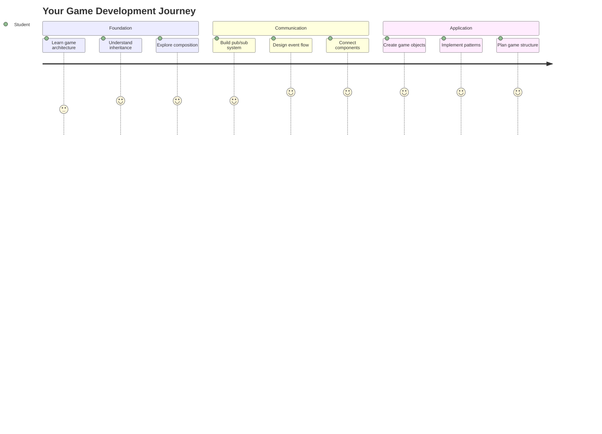
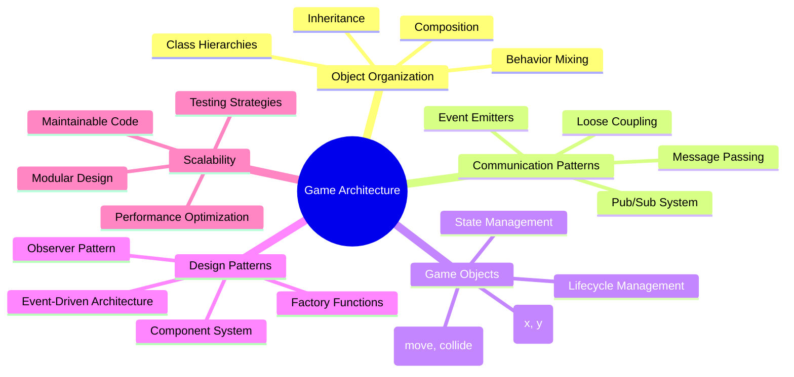
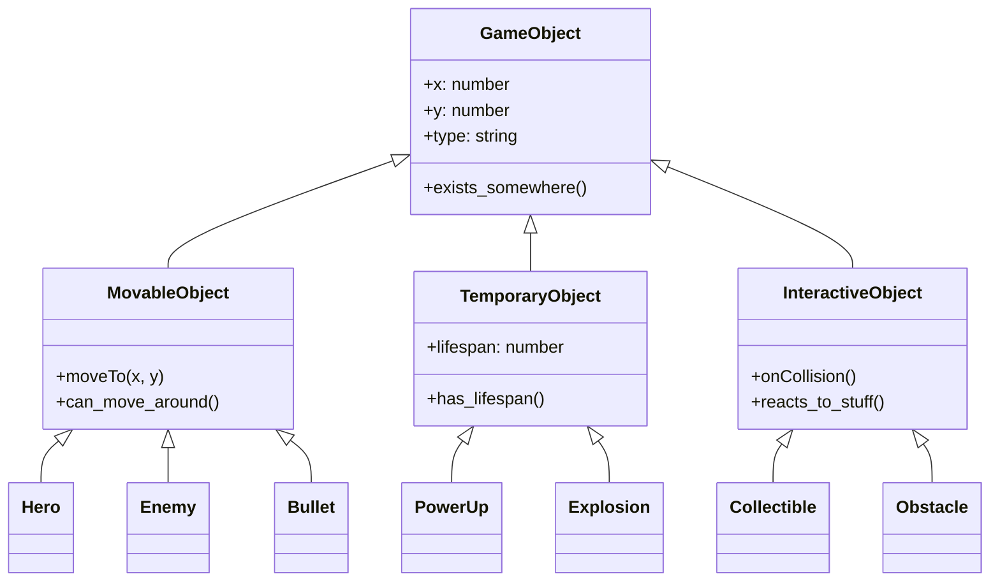
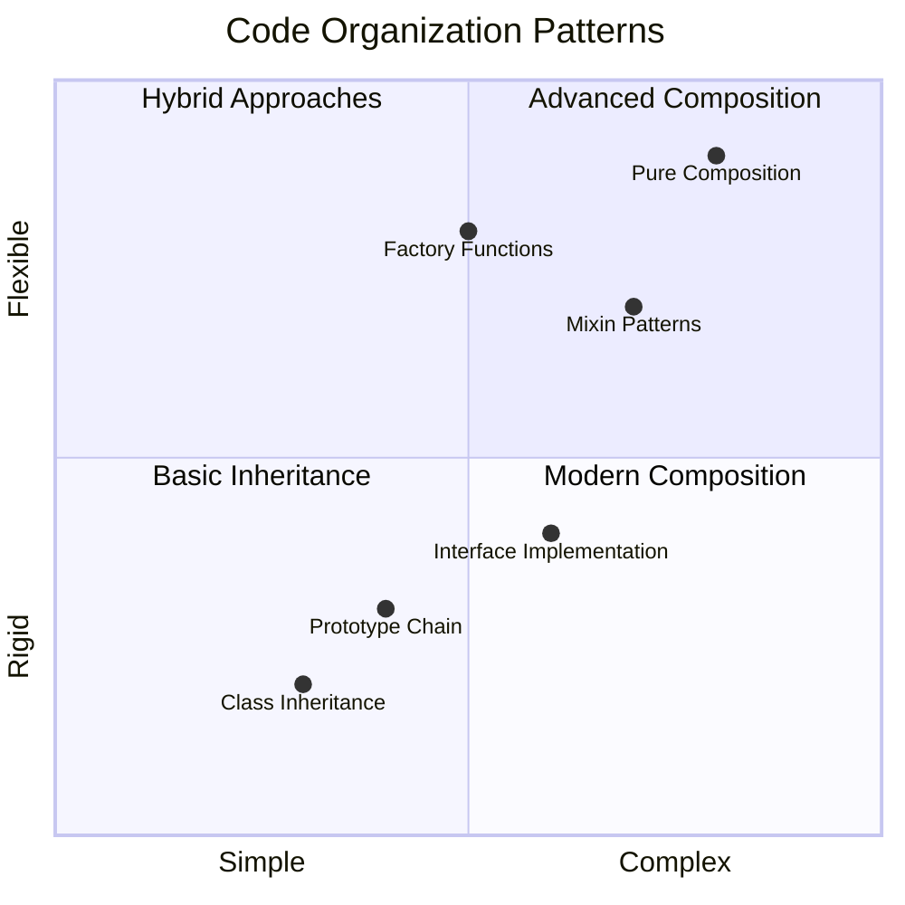
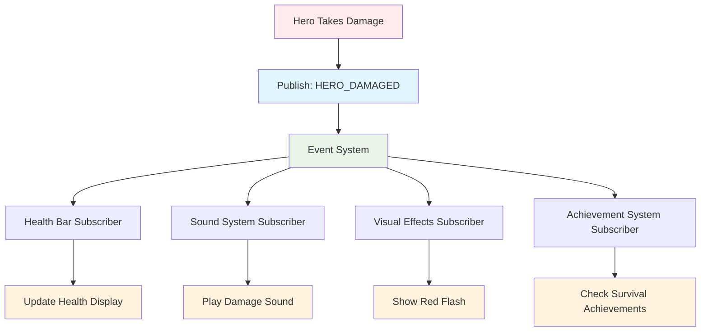
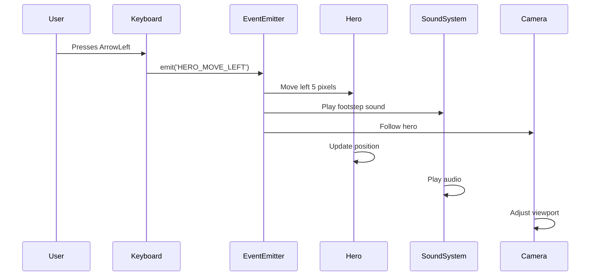
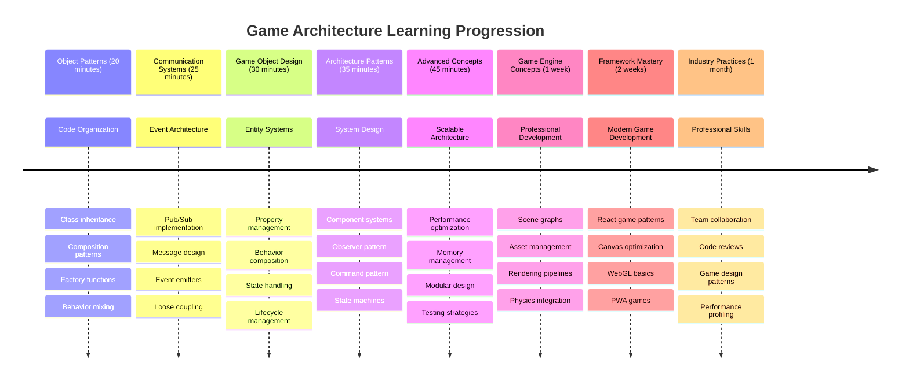

# 建立太空遊戲第一部分：介紹




就像 NASA 的任務控制在太空發射期間協調多個系統一樣，我們將建立一個太空遊戲，展示程式的不同部分如何無縫協作。在創建一個實際可以玩的遊戲的同時，您將學習適用於任何軟體專案的基本程式設計概念。

我們將探討組織程式碼的兩種基本方法：繼承和組合。這些不僅僅是學術概念——它們是從電子遊戲到銀行系統的所有事物的運作模式。我們還將實現一個名為 pub/sub 的通信系統，該系統類似於航天器使用的通信網路，允許不同的組件共享資訊而不產生依賴性。

在本系列結束時，您將了解如何構建可擴展和演化的應用程式——無論您是開發遊戲、網頁應用程式還是其他任何軟體系統。



## 課前測驗

[課前測驗](https://ff-quizzes.netlify.app/web/quiz/29)

## 繼承與組合在遊戲開發中的應用

隨著專案的複雜性增加，程式碼的組織變得至關重要。最初的簡單腳本如果沒有適當的結構，可能會變得難以維護——就像阿波羅任務需要仔細協調數千個組件一樣。

我們將探討組織程式碼的兩種基本方法：繼承和組合。每種方法都有其獨特的優勢，了解這兩者有助於您在不同情況下選擇合適的方法。我們將通過我們的太空遊戲演示這些概念，其中英雄、敵人、增強道具和其他物件必須高效地互動。

✅ 最著名的程式設計書籍之一與[設計模式](https://en.wikipedia.org/wiki/Design_Patterns)有關。

在任何遊戲中，您都會有「遊戲物件」——填充遊戲世界的互動元素。英雄、敵人、增強道具和視覺效果都是遊戲物件。每個物件都使用 `x` 和 `y` 值存在於特定的螢幕座標上，類似於在坐標平面上繪製點。

儘管它們在視覺上有所不同，但這些物件通常共享基本行為：

- **它們存在於某處**——每個物件都有 x 和 y 座標，因此遊戲知道在哪裡繪製它
- **許多物件可以移動**——英雄奔跑，敵人追逐，子彈在螢幕上飛行
- **它們有壽命**——有些物件會永遠存在，其他物件（如爆炸）會短暫出現然後消失
- **它們會對事物做出反應**——當物件碰撞時，增強道具被收集，生命條更新

✅ 想想像吃豆人這樣的遊戲。您能否在這個遊戲中識別出上述四種物件類型？



### 通過程式碼表達行為

現在您已了解遊戲物件共享的常見行為，讓我們來探討如何在 JavaScript 中實現這些行為。您可以通過附加到類或單個物件的方法來表達物件行為，並且有多種方法可供選擇。

**基於類的方式**

類和繼承提供了一種結構化的方法來組織遊戲物件。就像卡爾·林奈斯開發的分類系統一樣，您從包含常見屬性的基類開始，然後創建繼承這些基礎並添加特定功能的專門類。

✅ 繼承是一個重要的概念。了解更多請參考 [MDN 的關於繼承的文章](https://developer.mozilla.org/docs/Web/JavaScript/Inheritance_and_the_prototype_chain)。

以下是如何使用類和繼承來實現遊戲物件：

```javascript
// Step 1: Create the base GameObject class
class GameObject {
  constructor(x, y, type) {
    this.x = x;
    this.y = y;
    this.type = type;
  }
}
```

**讓我們一步步分解：**
- 我們正在創建每個遊戲物件都可以使用的基本模板
- 建構函數保存物件的位置（`x`，`y`）以及物件的類型
- 這成為所有遊戲物件構建的基礎

```javascript
// Step 2: Add movement capability through inheritance
class Movable extends GameObject {
  constructor(x, y, type) {
    super(x, y, type); // Call parent constructor
  }

  // Add the ability to move to a new position
  moveTo(x, y) {
    this.x = x;
    this.y = y;
  }
}
```

**在上面，我們已經：**
- **擴展**了 GameObject 類以添加移動功能
- 使用 `super()` 調用父建構函數以初始化繼承的屬性
- **添加**了一個 `moveTo()` 方法來更新物件的位置

```javascript
// Step 3: Create specific game object types
class Hero extends Movable {
  constructor(x, y) {
    super(x, y, 'Hero'); // Set type automatically
  }
}

class Tree extends GameObject {
  constructor(x, y) {
    super(x, y, 'Tree'); // Trees don't need movement
  }
}

// Step 4: Use your game objects
const hero = new Hero(0, 0);
hero.moveTo(5, 5); // Hero can move!

const tree = new Tree(10, 15);
// tree.moveTo() would cause an error - trees can't move
```

**理解這些概念：**
- **創建**繼承適當行為的專門物件類型
- **展示**了繼承如何允許選擇性地包含功能
- **顯示**英雄可以移動，而樹木保持靜止
- **說明**類層次結構如何防止不適當的操作

✅ 花幾分鐘重新構想吃豆人中的英雄（例如 Inky、Pinky 或 Blinky），並思考如何用 JavaScript 編寫它。

**組合方式**

組合遵循模組化設計哲學，類似於工程師如何設計具有可互換組件的航天器。與其從父類繼承，不如通過組合特定行為來創建具有所需功能的物件。這種方法提供了靈活性，而不受嚴格的層次結構限制。

```javascript
// Step 1: Create base behavior objects
const gameObject = {
  x: 0,
  y: 0,
  type: ''
};

const movable = {
  moveTo(x, y) {
    this.x = x;
    this.y = y;
  }
};
```

**這段程式碼的作用：**
- **定義**了一個基礎 `gameObject`，具有位置和類型屬性
- **創建**了一個單獨的 `movable` 行為物件，具有移動功能
- **分離**關注點，將位置資料和移動邏輯獨立開來

```javascript
// Step 2: Compose objects by combining behaviors
const movableObject = { ...gameObject, ...movable };

// Step 3: Create factory functions for different object types
function createHero(x, y) {
  return {
    ...movableObject,
    x,
    y,
    type: 'Hero'
  };
}

function createStatic(x, y, type) {
  return {
    ...gameObject,
    x,
    y,
    type
  };
}
```

**在上面，我們已經：**
- 使用展開語法 **組合**了基礎物件屬性和移動行為
- **創建**了返回自定義物件的工廠函數
- **啟用**了靈活的物件創建，而不受嚴格的類層次結構限制
- **允許**物件擁有其所需的行為

```javascript
// Step 4: Create and use your composed objects
const hero = createHero(10, 10);
hero.moveTo(5, 5); // Works perfectly!

const tree = createStatic(0, 0, 'Tree');
// tree.moveTo() is undefined - no movement behavior was composed
```

**需要記住的關鍵點：**
- **通過混合行為**來組合物件，而不是繼承它們
- **提供**比嚴格的繼承層次結構更大的靈活性
- **允許**物件擁有其所需的功能
- **使用**現代 JavaScript 展開語法進行乾淨的物件組合
```

**Which Pattern Should You Choose?**

**Which Pattern Should You Choose?**



> 💡 **專業提示**：這兩種模式在現代 JavaScript 開發中都有其位置。類適用於明確定義的層次結構，而組合在需要最大靈活性時表現出色。
> 
**以下是使用每種方法的情況：**
- **選擇**繼承，當您有明確的「是某物」關係時（例如，英雄 *是* 可移動物件）
- **選擇**組合，當您需要「擁有某物」關係時（例如，英雄 *擁有* 移動能力）
- **考慮**您的團隊偏好和專案需求
- **記住**您可以在同一應用程式中混合使用這兩種方法

### 🔄 **教學檢查**
**物件組織理解**：在進入通信模式之前，確保您能夠：
- ✅ 解釋繼承和組合的區別
- ✅ 確定何時使用類與工廠函數
- ✅ 理解 `super()` 關鍵字在繼承中的作用
- ✅ 認識每種方法在遊戲開發中的優勢

**快速自測**：如何創建一個既能移動又能飛行的飛行敵人？
- **繼承方式**：`class FlyingEnemy extends Movable`
- **組合方式**：`{ ...movable, ...flyable, ...gameObject }`

**現實世界的聯繫**：這些模式無處不在：
- **React 元件**：屬性（組合）與類繼承
- **遊戲引擎**：實體-組件系統使用組合
- **移動應用**：UI 框架通常使用繼承層次結構

## 通信模式：Pub/Sub 系統

隨著應用程式變得複雜，管理組件之間的通信變得具有挑戰性。發布-訂閱模式（pub/sub）使用類似於廣播的原則解決了這個問題——一個發射器可以在不知道誰在聽的情況下到達多個接收器。

想像一下當英雄受到傷害時會發生什麼：生命條更新、音效播放、視覺反饋出現。與其將英雄物件直接與這些系統耦合，pub/sub 允許英雄廣播「受到傷害」的消息。任何需要響應的系統都可以訂閱此消息類型並做出相應的反應。

✅ **Pub/Sub** 代表「發布-訂閱」



### 理解 Pub/Sub 架構

Pub/Sub 模式使應用程式的不同部分保持鬆散耦合，這意味著它們可以協同工作而不直接依賴彼此。這種分離使您的程式碼更易於維護、測試和適應變化。

**Pub/Sub 的關鍵角色：**
- **消息**——簡單的文本標籤，例如 `'PLAYER_SCORED'`，描述發生了什麼（加上任何額外資訊）
- **發布者**——喊出「發生了某事！」的物件，通知所有正在聽的人
- **訂閱者**——表示「我關心這個事件」並在事件發生時做出反應的物件
- **事件系統**——確保消息到達正確聽眾的中間人

### 建立事件系統

讓我們創建一個簡單但功能強大的事件系統來演示這些概念：

```javascript
// Step 1: Create the EventEmitter class
class EventEmitter {
  constructor() {
    this.listeners = {}; // Store all event listeners
  }
  
  // Register a listener for a specific message type
  on(message, listener) {
    if (!this.listeners[message]) {
      this.listeners[message] = [];
    }
    this.listeners[message].push(listener);
  }
  
  // Send a message to all registered listeners
  emit(message, payload = null) {
    if (this.listeners[message]) {
      this.listeners[message].forEach(listener => {
        listener(message, payload);
      });
    }
  }
}
```

**分解這裡發生的事情：**
- **創建**一個使用簡單類的中央事件管理系統
- **存儲**按消息類型組織的監聽器
- 使用 `on()` 方法 **註冊**新監聽器
- 使用 `emit()` **廣播**消息給所有感興趣的監聽器
- **支持**可選的數據負載以傳遞相關資訊

### 結合起來：實際示例

好吧，讓我們看看它的實際應用！我們將建立一個簡單的移動系統，展示 pub/sub 的清晰性和靈活性：

```javascript
// Step 1: Define your message types
const Messages = {
  HERO_MOVE_LEFT: 'HERO_MOVE_LEFT',
  HERO_MOVE_RIGHT: 'HERO_MOVE_RIGHT',
  ENEMY_SPOTTED: 'ENEMY_SPOTTED'
};

// Step 2: Create your event system and game objects
const eventEmitter = new EventEmitter();
const hero = createHero(0, 0);
```

**這段程式碼的作用：**
- **定義**了一個常量物件以防止消息名稱中的拼寫錯誤
- **創建**了一個事件發射器實例來處理所有通信
- **初始化**了一個英雄物件在起始位置

```javascript
// Step 3: Set up event listeners (subscribers)
eventEmitter.on(Messages.HERO_MOVE_LEFT, () => {
  hero.moveTo(hero.x - 5, hero.y);
  console.log(`Hero moved to position: ${hero.x}, ${hero.y}`);
});

eventEmitter.on(Messages.HERO_MOVE_RIGHT, () => {
  hero.moveTo(hero.x + 5, hero.y);
  console.log(`Hero moved to position: ${hero.x}, ${hero.y}`);
});
```

**在上面，我們已經：**
- **註冊**了響應移動消息的事件監聽器
- **更新**了英雄的位置，根據移動方向
- **添加**了控制台日誌以跟踪英雄位置的變化
- **分離**了移動邏輯與輸入處理

```javascript
// Step 4: Connect keyboard input to events (publishers)
window.addEventListener('keydown', (event) => {
  switch(event.key) {
    case 'ArrowLeft':
      eventEmitter.emit(Messages.HERO_MOVE_LEFT);
      break;
    case 'ArrowRight':
      eventEmitter.emit(Messages.HERO_MOVE_RIGHT);
      break;
  }
});
```

**理解這些概念：**
- **連接**鍵盤輸入到遊戲事件，而不緊密耦合
- **使**輸入系統能夠間接與遊戲物件通信
- **允許**多個系統響應相同的鍵盤事件
- **使**更改按鍵綁定或添加新輸入方法變得容易



> 💡 **專業提示**：這種模式的美妙之處在於它的靈活性！您可以通過簡單地添加更多事件監聽器來輕鬆添加音效、螢幕震動或粒子效果——無需修改現有的鍵盤或移動程式碼。
> 
**以下是您會喜歡這種方法的原因：**
- 添加新功能變得非常容易——只需監聽您關心的事件
- 多個事物可以對同一事件做出反應，而不會相互干擾
- 測試變得非常簡單，因為每個部分都可以獨立工作
- 當某些東西出現問題時，您可以確切地知道問題出在哪裡

### 為什麼 Pub/Sub 能有效擴展

隨著應用程式的複雜性增加，Pub/Sub 模式保持簡單性。無論是管理數十個敵人、動態 UI 更新還是音效系統，該模式都能在不進行架構更改的情況下處理增加的規模。新功能可以集成到現有事件系統中，而不影響既有功能。

> ⚠️ **常見錯誤**：不要在早期創建太多特定的消息類型。從廣泛的類別開始，隨著遊戲需求的明確化進行細化。
> 
**最佳實踐：**
- **將**相關消息分組到邏輯類別中
- **使用**描述性名稱，清楚地表明發生了什麼
- **保持**消息負載簡單且專注
- **記錄**您的消息類型以便團隊協作

### 🔄 **教學檢查**
**事件驅動架構理解**：驗證您對完整系統的掌握：
- ✅ Pub/Sub 模式如何防止組件之間的緊密耦合？
- ✅ 為什麼使用事件驅動架構更容易添加新功能？
- ✅ EventEmitter 在通信流程中扮演什麼角色？
- ✅ 消息常量如何防止錯誤並提高可維護性？

**設計挑戰**：如何使用 Pub/Sub 處理以下遊戲場景？
1. **敵人死亡**：更新分數、播放音效、生成增強道具、從螢幕移除
2. **關卡完成**：停止音樂、顯示 UI、保存進度、加載下一關
3. **收集增強道具**：增強能力、更新 UI、播放效果、啟動計時器

**專業聯繫**：此模式出現在：
- **前端框架**：React/Vue 的事件系統
- **後端服務**：微服務通信
- **遊戲引擎**：Unity 的事件系統
- **移動開發**：iOS/Android 的通知系統

---

## GitHub Copilot Agent 挑戰 🚀

使用 Agent 模式完成以下挑戰：

**描述：** 使用繼承和 Pub/Sub 模式創建一個簡單的遊戲物件系統。您將實現一個基本遊戲，其中不同的物件可以通過事件進行通信，而不直接了解彼此。

**提示：** 使用以下要求創建一個 JavaScript 遊戲系統：1）創建一個具有 x、y 座標和類型屬性的基礎 GameObject 類。2）創建一個 Hero 類，擴展 GameObject 並可以移動。3）創建一個 Enemy 類，擴展 GameObject 並可以追逐英雄。4）實現一個 EventEmitter 類，用於 Pub/Sub 模式。5）設置事件監聽器，當英雄移動時，附近的敵人接收到 'HERO_MOVED' 事件並更新其位置以追逐英雄。包括 console.log 語句以顯示物件之間的通信。

了解更多關於 [agent 模式](https://code.visualstudio.com/blogs/2025/02/24/introducing-copilot-agent-mode) 的資訊。

## 🚀 挑戰
考慮如何使用發布-訂閱模式來提升遊戲架構。識別哪些元件應該發出事件，以及系統應如何響應。設計一個遊戲概念並繪製其元件之間的通信模式。

## 課後測驗

[課後測驗](https://ff-quizzes.netlify.app/web/quiz/30)

## 回顧與自學

了解更多有關發布/訂閱模式的資訊，請[閱讀相關內容](https://docs.microsoft.com/azure/architecture/patterns/publisher-subscriber/?WT.mc_id=academic-77807-sagibbon)。

### ⚡ **接下來的5分鐘內可以做的事情**
- [ ] 打開任何線上HTML5遊戲，使用開發者工具檢查其代碼
- [ ] 創建一個簡單的HTML5 Canvas元素並繪製基本形狀
- [ ] 嘗試使用`setInterval`創建一個簡單的動畫循環
- [ ] 探索Canvas API文檔並嘗試一個繪圖方法

### 🎯 **一小時內可以完成的目標**
- [ ] 完成課後測驗並理解遊戲開發概念
- [ ] 使用HTML、CSS和JavaScript文件設置遊戲項目結構
- [ ] 創建一個基本的遊戲循環，持續更新和渲染
- [ ] 在Canvas上繪製你的第一個遊戲精靈
- [ ] 實現基本的資產加載功能，包括圖片和聲音

### 📅 **一週內的遊戲創作計劃**
- [ ] 完成具有所有計劃功能的完整太空遊戲
- [ ] 添加精美的圖形、音效和流暢的動畫
- [ ] 實現遊戲狀態（開始畫面、遊戲過程、遊戲結束）
- [ ] 創建計分系統和玩家進度追蹤功能
- [ ] 使遊戲在各種設備上都能響應並易於訪問
- [ ] 將你的遊戲分享至線上並收集玩家的反饋

### 🌟 **一個月的遊戲開發計劃**
- [ ] 創建多款遊戲，探索不同的類型和機制
- [ ] 學習一個遊戲開發框架，例如Phaser或Three.js
- [ ] 參與開源遊戲開發項目
- [ ] 掌握高級遊戲編程模式和優化技術
- [ ] 創建一個展示遊戲開發技能的作品集
- [ ] 指導其他對遊戲開發和互動媒體感興趣的人

## 🎯 遊戲開發精通時間表



### 🛠️ 遊戲架構工具包摘要

完成本課程後，你現在擁有：
- **設計模式精通**：理解繼承與組合的權衡
- **事件驅動架構**：發布/訂閱實現可擴展的通信
- **面向對象設計**：類層次結構和行為組合
- **現代JavaScript**：工廠函數、展開語法和ES6+模式
- **可擴展架構**：鬆耦合和模塊化設計原則
- **遊戲開發基礎**：實體系統和組件模式
- **專業模式**：符合行業標準的代碼組織方法

**實際應用**：這些模式直接適用於：
- **前端框架**：React/Vue的組件架構和狀態管理
- **後端服務**：微服務通信和事件驅動系統
- **移動開發**：iOS/Android應用架構和通知系統
- **遊戲引擎**：Unity、Unreal和基於網頁的遊戲開發
- **企業軟件**：事件溯源和分佈式系統設計
- **API設計**：RESTful服務和實時通信

**專業技能獲得**：你現在可以：
- **設計**使用經驗證模式的可擴展軟件架構
- **實現**處理複雜交互的事件驅動系統
- **選擇**適合不同場景的代碼組織策略
- **調試**並有效維護鬆耦合系統
- **溝通**使用行業標準術語進行技術決策

**下一步**：你已準備好在真實遊戲中實施這些模式，探索高級遊戲開發主題，或將這些架構概念應用於網頁應用程序！

🌟 **成就解鎖**：你已掌握從簡單遊戲到複雜企業系統的基礎軟件架構模式！

## 作業

[設計一款遊戲](assignment.md)

---

**免責聲明**：  
本文件已使用 AI 翻譯服務 [Co-op Translator](https://github.com/Azure/co-op-translator) 進行翻譯。儘管我們努力確保翻譯的準確性，但請注意，自動翻譯可能包含錯誤或不準確之處。原始文件的母語版本應被視為權威來源。對於關鍵信息，建議使用專業人工翻譯。我們對因使用此翻譯而引起的任何誤解或誤釋不承擔責任。