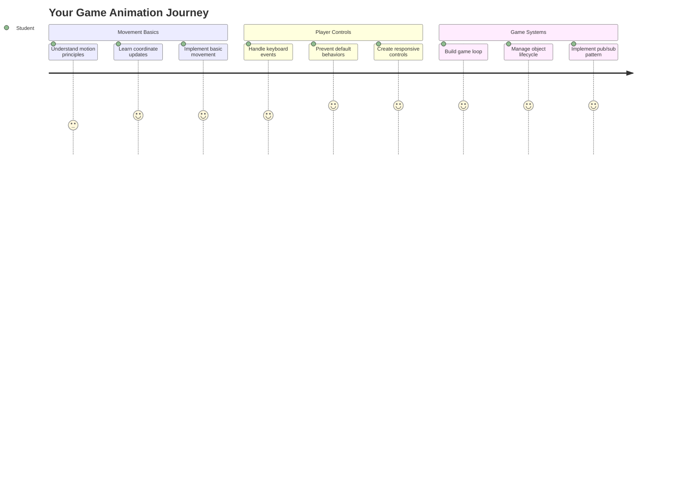
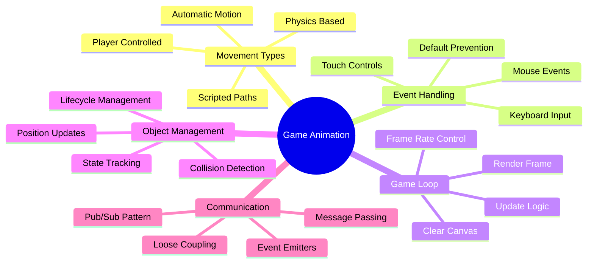
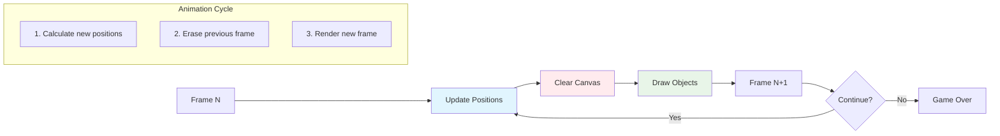
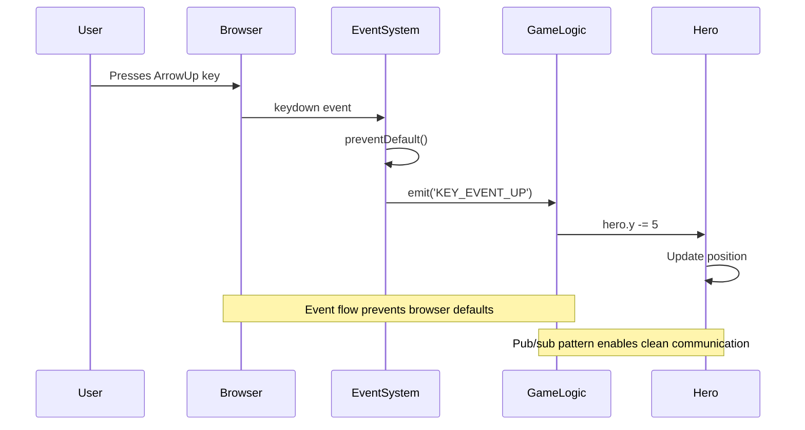
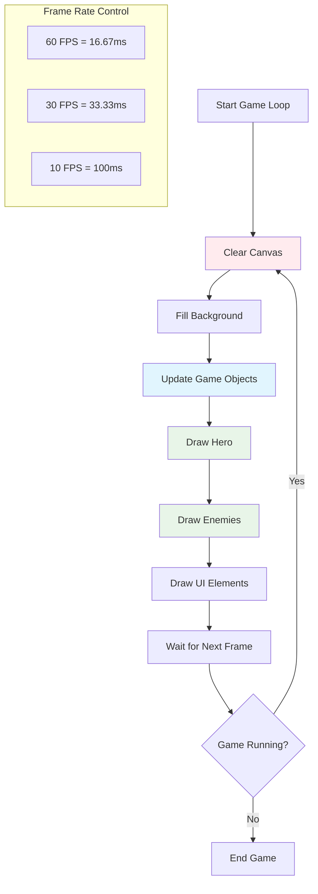
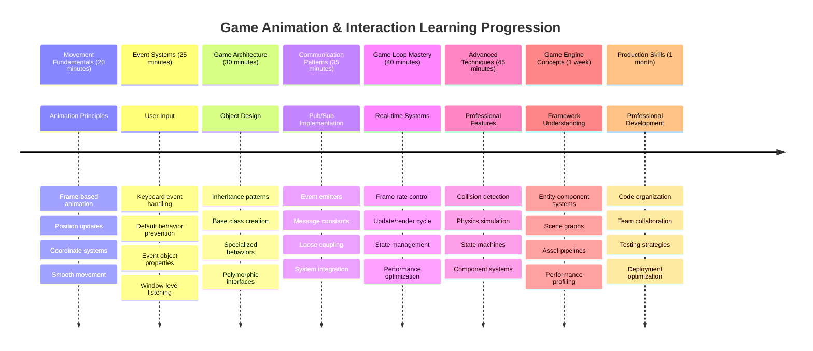

# 建造太空遊戲第三部分：加入動態效果



想想你最喜歡的遊戲——吸引人的不僅僅是漂亮的圖形，而是所有事物如何移動並對你的操作做出反應。目前，你的太空遊戲就像一幅美麗的畫作，但我們即將加入動態效果，讓它栩栩如生。

當 NASA 的工程師為阿波羅任務編寫導航電腦程式時，他們面臨著類似的挑戰：如何讓航天器響應飛行員的操作，同時自動進行航向修正？今天我們要學習的原理與此相似——管理玩家控制的移動以及自動系統行為。

在這節課中，你將學習如何讓太空船在螢幕上滑行、響應玩家指令，並創造流暢的移動模式。我們會將所有內容分解成易於理解的概念，循序漸進。

到最後，玩家將能夠駕駛英雄飛船在螢幕上飛行，而敵方船隻則在上方巡邏。更重要的是，你將理解驅動遊戲移動系統的核心原理。



## 課前測驗

[課前測驗](https://ff-quizzes.netlify.app/web/quiz/33)

## 理解遊戲中的移動

當物體開始移動時，遊戲才真正活了起來，而這基本上有兩種方式：

- **玩家控制的移動**：當你按下按鍵或點擊滑鼠時，某些東西會移動。這是你與遊戲世界之間的直接連接。
- **自動移動**：當遊戲本身決定移動物體——例如那些敵方船隻需要在螢幕上巡邏，無論你是否在操作。

讓物體在電腦螢幕上移動比你想像的要簡單。還記得數學課上的 x 和 y 座標嗎？這正是我們要處理的內容。當伽利略在 1610 年追蹤木星的衛星時，他本質上是在做同樣的事情——通過時間繪製位置來理解運動模式。

在螢幕上移動物體就像創造翻頁動畫——你需要遵循以下三個簡單步驟：



1. **更新位置**——改變物體應該在哪裡（例如向右移動 5 像素）
2. **清除舊畫面**——清除螢幕，避免出現幽靈般的痕跡
3. **繪製新畫面**——將物體放置在新的位置

如果你足夠快地完成這些步驟，效果就出現了！你將擁有流暢的移動，讓玩家感覺自然。

以下是程式碼的示例：

```javascript
// Set the hero's location
hero.x += 5;
// Clear the rectangle that hosts the hero
ctx.clearRect(0, 0, canvas.width, canvas.height);
// Redraw the game background and hero
ctx.fillRect(0, 0, canvas.width, canvas.height);
ctx.fillStyle = "black";
ctx.drawImage(heroImg, hero.x, hero.y);
```

**這段程式碼的作用：**
- **更新**英雄的 x 座標，向右移動 5 像素
- **清除**整個畫布區域，移除之前的畫面
- **填充**畫布背景為黑色
- **重繪**英雄圖像到新的位置

✅ 你能想到為什麼每秒重繪英雄多次可能會導致性能問題嗎？閱讀 [替代模式](https://developer.mozilla.org/en-US/docs/Web/API/Canvas_API/Tutorial/Optimizing_canvas)。

## 處理鍵盤事件

這是將玩家輸入與遊戲動作連接的地方。當有人按下空格鍵發射雷射或點擊方向鍵躲避小行星時，你的遊戲需要檢測並響應這些輸入。

鍵盤事件發生在窗口層級，這意味著整個瀏覽器窗口都在監聽這些按鍵。滑鼠點擊則可以綁定到特定元素（例如點擊按鈕）。對於我們的太空遊戲，我們將專注於鍵盤控制，因為這能給玩家帶來經典的街機感。

這讓我想起 1800 年代的電報操作員如何將摩斯電碼輸入翻譯成有意義的訊息——我們正在做類似的事情，將按鍵轉換為遊戲指令。

要處理事件，你需要使用窗口的 `addEventListener()` 方法，並提供兩個輸入參數。第一個參數是事件的名稱，例如 `keyup`。第二個參數是事件發生時應該調用的函數。

以下是一個示例：

```javascript
window.addEventListener('keyup', (evt) => {
  // evt.key = string representation of the key
  if (evt.key === 'ArrowUp') {
    // do something
  }
});
```

**這段程式碼的作用：**
- **監聽**整個窗口的鍵盤事件
- **捕獲**事件物件，其中包含按下的按鍵資訊
- **檢查**按下的按鍵是否與特定按鍵匹配（此處為向上箭頭）
- **執行**條件滿足時的程式碼

對於鍵盤事件，你可以使用事件上的兩個屬性來查看按下了哪個按鍵：

- `key` - 這是按下的按鍵的字串表示，例如 `'ArrowUp'`
- `keyCode` - 這是數字表示，例如 `37`，對應於 `ArrowLeft`

✅ 鍵盤事件操作在遊戲開發之外也很有用。你能想到這種技術的其他用途嗎？



### 特殊按鍵：注意！

某些按鍵具有內建的瀏覽器行為，可能會干擾你的遊戲。方向鍵會滾動頁面，空格鍵會向下跳——當有人試圖駕駛他們的太空船時，你不希望出現這些行為。

我們可以阻止這些預設行為，讓遊戲來處理輸入。這類似於早期的電腦程式員如何覆蓋系統中斷以創建自定義行為——我們只是在瀏覽器層級進行操作。以下是方法：

```javascript
const onKeyDown = function (e) {
  console.log(e.keyCode);
  switch (e.keyCode) {
    case 37:
    case 39:
    case 38:
    case 40: // Arrow keys
    case 32:
      e.preventDefault();
      break; // Space
    default:
      break; // do not block other keys
  }
};

window.addEventListener('keydown', onKeyDown);
```

**理解這段阻止程式碼：**
- **檢查**可能導致不必要瀏覽器行為的特定按鍵代碼
- **阻止**方向鍵和空格鍵的預設瀏覽器行為
- **允許**其他按鍵正常運作
- **使用** `e.preventDefault()` 來停止瀏覽器的內建行為

### 🔄 **教學檢查**
**事件處理理解**：在進入自動移動之前，確保你能夠：
- ✅ 解釋 `keydown` 和 `keyup` 事件的區別
- ✅ 理解為什麼我們要阻止預設瀏覽器行為
- ✅ 描述事件監聽器如何將用戶輸入連接到遊戲邏輯
- ✅ 確定哪些按鍵可能干擾遊戲控制

**快速自測**：如果你不阻止方向鍵的預設行為會發生什麼？
*答案：瀏覽器會滾動頁面，干擾遊戲移動*

**事件系統架構**：你現在理解：
- **窗口層級監聽**：在瀏覽器層級捕捉事件
- **事件物件屬性**：`key` 字串與 `keyCode` 數字
- **阻止預設行為**：停止不必要的瀏覽器行為
- **條件邏輯**：響應特定的按鍵組合

## 遊戲自動移動

現在我們來談談不需要玩家輸入的物體移動。想想敵方船隻在螢幕上巡航、子彈沿直線飛行，或者背景中的雲朵漂移。這種自動移動讓你的遊戲世界即使在沒有人操作時也充滿活力。

我們使用 JavaScript 的內建計時器來定期更新位置。這個概念類似於擺鐘的工作原理——一個定期觸發一致、定時動作的機制。以下是簡單的示例：

```javascript
const id = setInterval(() => {
  // Move the enemy on the y axis
  enemy.y += 10;
}, 100);
```

**這段移動程式碼的作用：**
- **創建**一個每 100 毫秒運行一次的計時器
- **更新**敵方的 y 座標，每次移動 10 像素
- **存儲**間隔 ID，以便稍後需要時停止它
- **自動移動**敵方船隻向下

## 遊戲循環

這是將所有內容連接在一起的概念——遊戲循環。如果你的遊戲是一部電影，那麼遊戲循環就是電影放映機，以極快的速度展示一幀幀畫面，使一切看起來流暢移動。

每個遊戲背後都有一個這樣的循環在運行。它是一個函數，更新所有遊戲物體，重繪螢幕，並不斷重複這個過程。它跟蹤你的英雄、所有敵人、任何飛行中的雷射——整個遊戲狀態。

這讓我想起早期的動畫師如華特·迪士尼如何逐幀重繪角色以創造移動的幻覺。我們正在做同樣的事情，只是用程式碼代替鉛筆。

以下是遊戲循環的典型程式碼示例：



```javascript
const gameLoopId = setInterval(() => {
  function gameLoop() {
    ctx.clearRect(0, 0, canvas.width, canvas.height);
    ctx.fillStyle = "black";
    ctx.fillRect(0, 0, canvas.width, canvas.height);
    drawHero();
    drawEnemies();
    drawStaticObjects();
  }
  gameLoop();
}, 200);
```

**理解遊戲循環結構：**
- **清除**整個畫布，移除之前的畫面
- **填充**背景為實色
- **繪製**所有遊戲物體到它們當前的位置
- **重複**每 200 毫秒執行一次，創造流暢的動畫效果
- **管理**幀率，通過控制間隔時間

## 繼續開發太空遊戲

現在我們將為你之前建造的靜態場景加入動態效果。我們將把它從一個截圖轉變為一個互動體驗。我們會一步步完成這些功能，確保每個部分都能自然地構建。

從我們上一課的程式碼開始（或者如果需要重新開始，可以使用 [第二部分-起始](../../../../6-space-game/3-moving-elements-around/your-work) 資料夾中的程式碼）。

**今天我們要完成的內容：**
- **英雄控制**：使用方向鍵駕駛你的太空船在螢幕上移動
- **敵方移動**：那些外星船隻將開始進攻

讓我們開始實現這些功能。

## 推薦步驟

找到在 `your-work` 子資料夾中為你創建的檔案。它應該包含以下內容：

```bash
-| assets
  -| enemyShip.png
  -| player.png
-| index.html
-| app.js
-| package.json
```

你可以通過輸入以下指令在 `your-work` 資料夾中啟動你的專案：

```bash
cd your-work
npm start
```

**這個指令的作用：**
- **導航**到你的專案目錄
- **啟動**一個 HTTP 伺服器，地址為 `http://localhost:5000`
- **提供**你的遊戲檔案，讓你可以在瀏覽器中測試它們

上述指令將在地址 `http://localhost:5000` 啟動一個 HTTP 伺服器。打開瀏覽器並輸入該地址，現在應該能渲染出英雄和所有敵人；但目前還沒有任何移動！

### 添加程式碼

1. **添加專用物件**，包括 `hero`、`enemy` 和 `game object`，它們應該具有 `x` 和 `y` 屬性。（記住 [繼承或組合](../README.md) 的部分）。

   *提示* `game object` 應該是具有 `x` 和 `y` 屬性並能夠將自己繪製到畫布上的物件。

   > **提示**：從添加一個新的 `GameObject` 類開始，並按照以下構造函數進行劃分，然後將其繪製到畫布上：

    ```javascript
    class GameObject {
      constructor(x, y) {
        this.x = x;
        this.y = y;
        this.dead = false;
        this.type = "";
        this.width = 0;
        this.height = 0;
        this.img = undefined;
      }
    
      draw(ctx) {
        ctx.drawImage(this.img, this.x, this.y, this.width, this.height);
      }
    }
    ```

    **理解這個基礎類別：**
    - **定義**所有遊戲物件共享的通用屬性（位置、大小、圖像）
    - **包含**一個 `dead` 標誌，用於追蹤物件是否應被移除
    - **提供**一個 `draw()` 方法，用於將物件渲染到畫布上
    - **設置**所有屬性的預設值，子類別可以覆蓋

    ```mermaid
    classDiagram
        class GameObject {
            +x: number
            +y: number
            +dead: boolean
            +type: string
            +width: number
            +height: number
            +img: Image
            +draw(ctx)
        }
        
        class Hero {
            +speed: number
            +type: "Hero"
            +width: 98
            +height: 75
        }
        
        class Enemy {
            +type: "Enemy"
            +width: 98
            +height: 50
            +setInterval()
        }
        
        GameObject <|-- Hero
        GameObject <|-- Enemy
        
        class EventEmitter {
            +listeners: object
            +on(message, listener)
            +emit(message, payload)
        }
    ```

    現在，擴展這個 `GameObject` 來創建 `Hero` 和 `Enemy`：
    
    ```javascript
    class Hero extends GameObject {
      constructor(x, y) {
        super(x, y);
        this.width = 98;
        this.height = 75;
        this.type = "Hero";
        this.speed = 5;
      }
    }
    ```

    ```javascript
    class Enemy extends GameObject {
      constructor(x, y) {
        super(x, y);
        this.width = 98;
        this.height = 50;
        this.type = "Enemy";
        const id = setInterval(() => {
          if (this.y < canvas.height - this.height) {
            this.y += 5;
          } else {
            console.log('Stopped at', this.y);
            clearInterval(id);
          }
        }, 300);
      }
    }
    ```

    **這些類別的關鍵概念：**
    - **繼承**自 `GameObject`，使用 `extends` 關鍵字
    - **調用**父類構造函數，使用 `super(x, y)`
    - **設置**每個物件類型的特定尺寸和屬性
    - **實現**敵人的自動移動，使用 `setInterval()`

2. **添加鍵盤事件處理器**，用於處理鍵盤導航（讓英雄上下左右移動）

   *記住* 這是一個笛卡爾系統，左上角是 `0,0`。還要記得添加程式碼以停止 *預設行為*

   > **提示**：創建你的 `onKeyDown` 函數並將其附加到窗口：

   ```javascript
   const onKeyDown = function (e) {
     console.log(e.keyCode);
     // Add the code from the lesson above to stop default behavior
     switch (e.keyCode) {
       case 37:
       case 39:
       case 38:
       case 40: // Arrow keys
       case 32:
         e.preventDefault();
         break; // Space
       default:
         break; // do not block other keys
     }
   };

   window.addEventListener("keydown", onKeyDown);
   ```
    
   **這個事件處理器的作用：**
   - **監聽**整個窗口的 `keydown` 事件
   - **記錄**按鍵代碼，幫助你調試按下了哪些按鍵
   - **阻止**方向鍵和空格鍵的預設瀏覽器行為
   - **允許**其他按鍵正常運作
   
   此時檢查你的瀏覽器控制台，觀察按鍵被記錄的情況。

3. **實現** [Pub sub 模式](../README.md)，這將使你的程式碼在接下來的部分中保持清晰。

   發布-訂閱模式有助於通過將事件檢測與事件處理分開來組織程式碼。這使得程式碼更加模組化且易於維護。

   要完成這最後部分，你可以：

   1. **在窗口上添加事件監聽器**：

       ```javascript
       window.addEventListener("keyup", (evt) => {
         if (evt.key === "ArrowUp") {
           eventEmitter.emit(Messages.KEY_EVENT_UP);
         } else if (evt.key === "ArrowDown") {
           eventEmitter.emit(Messages.KEY_EVENT_DOWN);
         } else if (evt.key === "ArrowLeft") {
           eventEmitter.emit(Messages.KEY_EVENT_LEFT);
         } else if (evt.key === "ArrowRight") {
           eventEmitter.emit(Messages.KEY_EVENT_RIGHT);
         }
       });
       ```

   **這個事件系統的作用：**
   - **檢測**鍵盤輸入並將其轉換為自定義遊戲事件
   - **分離**輸入檢測與遊戲邏輯
   - **使**更改控制變得容易，而不影響遊戲程式碼
   - **允許**多個系統響應相同的輸入

   ```mermaid
   flowchart TD
       A["Keyboard Input"] --> B["Window Event Listener"]
       B --> C["Event Emitter"]
       C --> D["KEY_EVENT_UP"]
       C --> E["KEY_EVENT_DOWN"]
       C --> F["KEY_EVENT_LEFT"]
       C --> G["KEY_EVENT_RIGHT"]
       
       D --> H["Hero Movement"]
       D --> I["Sound System"]
       D --> J["Visual Effects"]
       
       E --> H
       F --> H
       G --> H
       
       style A fill:#e1f5fe
       style C fill:#e8f5e8
       style H fill:#fff3e0
   ```

   2. **創建一個 EventEmitter 類**，用於發布和訂閱消息：

       ```javascript
       class EventEmitter {
         constructor() {
           this.listeners = {};
         }
       
         on(message, listener) {
           if (!this.listeners[message]) {
             this.listeners[message] = [];
           }
           this.listeners[message].push(listener);
         }
       
   3. **添加常量**並設置 EventEmitter：

       ```javascript
       const Messages = {
         KEY_EVENT_UP: "KEY_EVENT_UP",
         KEY_EVENT_DOWN: "KEY_EVENT_DOWN",
         KEY_EVENT_LEFT: "KEY_EVENT_LEFT",
         KEY_EVENT_RIGHT: "KEY_EVENT_RIGHT",
       };
       
       let heroImg, 
           enemyImg, 
           laserImg,
           canvas, ctx, 
           gameObjects = [], 
           hero, 
           eventEmitter = new EventEmitter();
       ```

   **理解這個設置：**
   - **定義**消息常量，避免拼寫錯誤並使重構更容易
   - **聲明**圖像、畫布上下文和遊戲狀態的變數
   - **創建**一個全局事件發射器，用於發布-訂閱系統
   - **初始化**一個陣列來存放所有遊戲物件

   4. **初始化遊戲**

       ```javascript
       function initGame() {
         gameObjects = [];
         createEnemies();
         createHero();
       
         eventEmitter.on(Messages.KEY_EVENT_UP, () => {
           hero.y -= 5;
         });
       
         eventEmitter.on(Messages.KEY_EVENT_DOWN, () => {
           hero.y += 5;
         });
       
         eventEmitter.on(Messages.KEY_EVENT_LEFT, () => {
           hero.x -= 5;
         });
       
4. **設置遊戲循環**

   重構 `window.onload` 函數以初始化遊戲並在合適的間隔設置遊戲循環。你還需要添加一個雷射光束：

    ```javascript
    window.onload = async () => {
      canvas = document.getElementById("canvas");
      ctx = canvas.getContext("2d");
      heroImg = await loadTexture("assets/player.png");
      enemyImg = await loadTexture("assets/enemyShip.png");
      laserImg = await loadTexture("assets/laserRed.png");
    
      initGame();
      const gameLoopId = setInterval(() => {
        ctx.clearRect(0, 0, canvas.width, canvas.height);
        ctx.fillStyle = "black";
        ctx.fillRect(0, 0, canvas.width, canvas.height);
        drawGameObjects(ctx);
      }, 100);
    };
    ```

   **理解遊戲設置：**
   - **等待**頁面完全加載後開始
   - **獲取**畫布元素及其2D渲染上下文
   - **使用 `await`** 非同步加載所有圖片資源
   - **啟動**以100毫秒間隔（10 FPS）運行的遊戲循環
   - **清除**並重繪整個屏幕每一幀

5. **添加代碼**以在特定間隔移動敵人

    重構 `createEnemies()` 函數以創建敵人並將它們推入新的 gameObjects 類：

    ```javascript
    function createEnemies() {
      const MONSTER_TOTAL = 5;
      const MONSTER_WIDTH = MONSTER_TOTAL * 98;
      const START_X = (canvas.width - MONSTER_WIDTH) / 2;
      const STOP_X = START_X + MONSTER_WIDTH;
    
      for (let x = START_X; x < STOP_X; x += 98) {
        for (let y = 0; y < 50 * 5; y += 50) {
          const enemy = new Enemy(x, y);
          enemy.img = enemyImg;
          gameObjects.push(enemy);
        }
      }
    }
    ```

    **敵人創建的作用：**
    - **計算**位置以使敵人居中於屏幕
    - **使用嵌套循環**創建敵人網格
    - **分配**敵人圖片到每個敵人物件
    - **添加**每個敵人到全局遊戲物件陣列
    
    並添加一個 `createHero()` 函數以對英雄執行類似的過程。
    
    ```javascript
    function createHero() {
      hero = new Hero(
        canvas.width / 2 - 45,
        canvas.height - canvas.height / 4
      );
      hero.img = heroImg;
      gameObjects.push(hero);
    }
    ```

    **英雄創建的作用：**
    - **定位**英雄於屏幕底部中央
    - **分配**英雄圖片到英雄物件
    - **添加**英雄到遊戲物件陣列以進行渲染

    最後，添加一個 `drawGameObjects()` 函數以開始繪製：

    ```javascript
    function drawGameObjects(ctx) {
      gameObjects.forEach(go => go.draw(ctx));
    }
    ```

    **理解繪製函數：**
    - **迭代**陣列中的所有遊戲物件
    - **調用**每個物件的 `draw()` 方法
    - **傳遞**畫布上下文以便物件能自行渲染

    ### 🔄 **教學檢查**
    **完整遊戲系統理解**：驗證你對整個架構的掌握：
    - ✅ 繼承如何讓 Hero 和 Enemy 共享通用的 GameObject 屬性？
    - ✅ 為什麼 pub/sub 模式使你的代碼更易於維護？
    - ✅ 遊戲循環在創造流暢動畫中扮演什麼角色？
    - ✅ 事件監聽器如何將用戶輸入與遊戲物件行為連接？

    **系統整合**：你的遊戲現在展示了：
    - **面向對象設計**：基類及專門的繼承
    - **事件驅動架構**：使用 pub/sub 模式實現鬆耦合
    - **動畫框架**：具有一致幀更新的遊戲循環
    - **輸入處理**：鍵盤事件及預設行為的防止
    - **資源管理**：圖片加載及精靈渲染

    **專業模式**：你已實現：
    - **關注點分離**：輸入、邏輯和渲染分離
    - **多態性**：所有遊戲物件共享通用繪製接口
    - **消息傳遞**：組件之間的清晰通信
    - **資源管理**：高效的精靈和動畫處理

    你的敵人應該開始向你的英雄飛船進攻了！
      }
    }
    ```
    
    and add a `createHero()` function to do a similar process for the hero.
    
    ```javascript
    function createHero() {
      hero = new Hero(
        canvas.width / 2 - 45,
        canvas.height - canvas.height / 4
      );
      hero.img = heroImg;
      gameObjects.push(hero);
    }
    ```

    最後，添加一個 `drawGameObjects()` 函數以開始繪製：

    ```javascript
    function drawGameObjects(ctx) {
      gameObjects.forEach(go => go.draw(ctx));
    }
    ```

    你的敵人應該開始向你的英雄飛船進攻了！

---

## GitHub Copilot Agent 挑戰 🚀

這是一個能提升你遊戲精緻度的挑戰：添加邊界和流暢控制。目前，你的英雄可以飛出屏幕，移動可能感覺不夠流暢。

**你的任務：** 讓你的飛船感覺更真實，通過實現屏幕邊界和流暢的移動。這類似於 NASA 的飛行控制系統防止航天器超出安全操作範圍。

**你需要構建的內容：** 創建一個系統，讓你的英雄飛船保持在屏幕內，並讓控制感覺更流暢。當玩家按住方向鍵時，飛船應該連續滑行，而不是以離散步驟移動。考慮在飛船到達屏幕邊界時添加視覺反饋——例如一個微妙的效果來指示遊戲區域的邊緣。

了解更多關於 [agent mode](https://code.visualstudio.com/blogs/2025/02/24/introducing-copilot-agent-mode) 的信息。

## 🚀 挑戰

隨著項目規模的增長，代碼組織變得越來越重要。你可能已經注意到你的文件充滿了混合在一起的函數、變量和類。這讓我想起了阿波羅任務的工程師們如何創建清晰、可維護的系統，以便多個團隊能夠同時工作。

**你的任務：**
像軟件架構師一樣思考。你如何組織你的代碼，以便六個月後你（或你的隊友）能夠理解正在發生的事情？即使現在所有內容都保留在一個文件中，你也可以創建更好的組織：

- **將相關函數分組**，並添加清晰的註解標題
- **分離關注點** - 將遊戲邏輯與渲染分開
- **使用一致的命名**規範來命名變量和函數
- **創建模塊**或命名空間來組織遊戲的不同方面
- **添加文檔**，解釋每個主要部分的目的

**反思問題：**
- 當你回頭看代碼時，哪些部分最難理解？
- 你如何組織代碼以使其他人更容易貢獻？
- 如果你想添加新功能，比如道具或不同類型的敵人，會發生什麼？

## 課後測驗

[課後測驗](https://ff-quizzes.netlify.app/web/quiz/34)

## 回顧與自學

我們從零開始構建所有內容，這對學習來說非常棒，但這裡有個小秘密——有一些很棒的 JavaScript 框架可以幫助你完成很多繁重的工作。一旦你對我們涵蓋的基礎知識感到熟悉，就值得[探索可用的資源](https://github.com/collections/javascript-game-engines)。

將框架想像成擁有一個設備齊全的工具箱，而不是手工製作每一個工具。它們可以解決我們之前提到的許多代碼組織挑戰，還能提供需要花費數周時間才能自己構建的功能。

**值得探索的內容：**
- 遊戲引擎如何組織代碼——你會驚訝於它們使用的巧妙模式
- 讓畫布遊戲流暢運行的性能技巧  
- 現代 JavaScript 特性，讓你的代碼更簡潔、更易於維護
- 管理遊戲物件及其關係的不同方法

## 🎯 你的遊戲動畫掌握時間表



### 🛠️ 你的遊戲開發工具包摘要

完成本課程後，你已掌握：
- **動畫原理**：基於幀的移動和流暢過渡
- **事件驅動編程**：鍵盤輸入處理及正確的事件管理
- **面向對象設計**：繼承層次結構和多態接口
- **通信模式**：使用 pub/sub 架構實現可維護的代碼
- **遊戲循環架構**：實時更新和渲染周期
- **輸入系統**：用戶控制映射及預設行為防止
- **資源管理**：精靈加載及高效渲染技術

### ⚡ **你可以在接下來的5分鐘內完成的事情**
- [ ] 打開瀏覽器控制台並嘗試 `addEventListener('keydown', console.log)` 查看鍵盤事件
- [ ] 創建一個簡單的 div 元素並使用方向鍵移動它
- [ ] 使用 `setInterval` 嘗試創建連續移動
- [ ] 嘗試使用 `event.preventDefault()` 防止預設行為

### 🎯 **你可以在接下來的一小時內完成的事情**
- [ ] 完成課後測驗並理解事件驅動編程
- [ ] 構建具有完整鍵盤控制的移動英雄飛船
- [ ] 實現流暢的敵人移動模式
- [ ] 添加邊界以防止遊戲物件離開屏幕
- [ ] 創建基本的遊戲物件碰撞檢測

### 📅 **你的週長動畫旅程**
- [ ] 完成具有精緻移動和交互的完整太空遊戲
- [ ] 添加高級移動模式，例如曲線、加速度和物理效果
- [ ] 實現流暢過渡和緩動函數
- [ ] 創建粒子效果和視覺反饋系統
- [ ] 優化遊戲性能以實現流暢的60fps遊戲
- [ ] 添加移動觸控控制和響應式設計

### 🌟 **你的月長互動開發**
- [ ] 構建具有高級動畫系統的複雜交互應用
- [ ] 學習動畫庫如 GSAP 或創建自己的動畫引擎
- [ ] 參與開源遊戲開發和動畫項目
- [ ] 掌握圖形密集型應用的性能優化
- [ ] 創建有關遊戲開發和動畫的教育內容
- [ ] 建立展示高級互動編程技能的作品集

**現實應用**：你的遊戲動畫技能直接適用於：
- **互動式網頁應用**：動態儀表板和實時界面
- **數據可視化**：動畫圖表和交互式圖形
- **教育軟件**：互動模擬和學習工具
- **移動開發**：基於觸控的遊戲和手勢處理
- **桌面應用**：具有流暢動畫的 Electron 應用
- **網頁動畫**：CSS 和 JavaScript 動畫庫

**獲得的專業技能**：你現在可以：
- **架構**可擴展的事件驅動系統
- **實現**基於數學原理的流暢動畫
- **調試**使用瀏覽器開發工具的複雜交互系統
- **優化**遊戲性能以適應不同設備和瀏覽器
- **設計**使用成熟模式的可維護代碼結構

**掌握的遊戲開發概念**：
- **幀率管理**：理解FPS和時間控制
- **輸入處理**：跨平台鍵盤和事件系統
- **物件生命周期**：創建、更新和銷毀模式
- **狀態同步**：保持遊戲狀態在幀之間的一致性
- **事件架構**：遊戲系統之間的解耦通信

**下一步**：你已準備好添加碰撞檢測、計分系統、音效，或探索現代遊戲框架如 Phaser 或 Three.js！

🌟 **成就解鎖**：你已構建了一個完整的互動遊戲系統，並採用了專業的架構模式！

## 作業

[註解你的代碼](assignment.md)

---

**免責聲明**：  
本文件已使用 AI 翻譯服務 [Co-op Translator](https://github.com/Azure/co-op-translator) 進行翻譯。儘管我們努力確保翻譯的準確性，但請注意，自動翻譯可能包含錯誤或不準確之處。原始文件的母語版本應被視為權威來源。對於關鍵信息，建議使用專業人工翻譯。我們對因使用此翻譯而引起的任何誤解或誤釋不承擔責任。