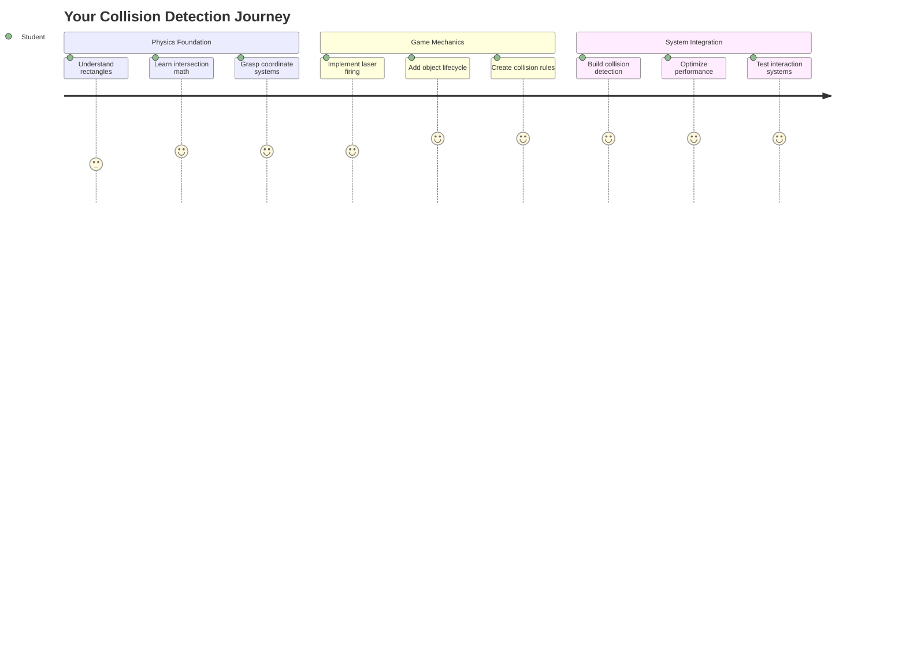
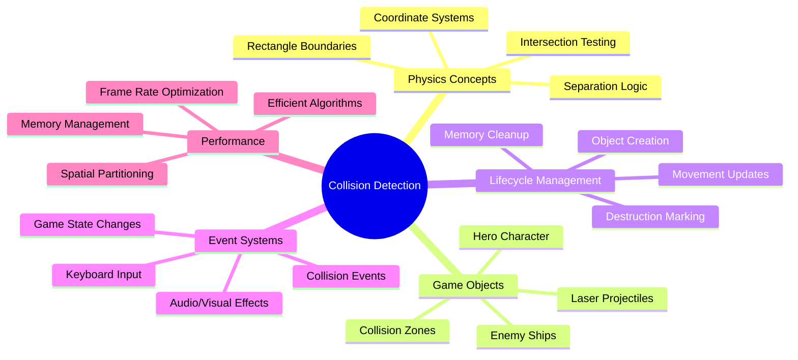
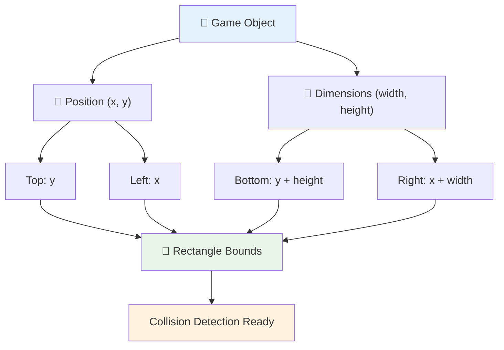
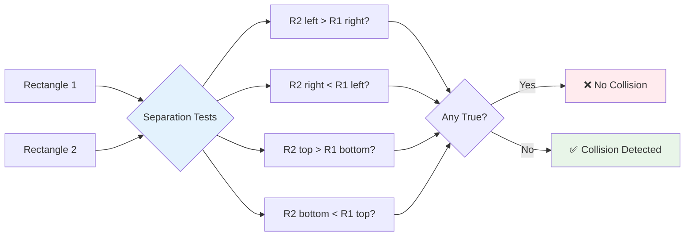
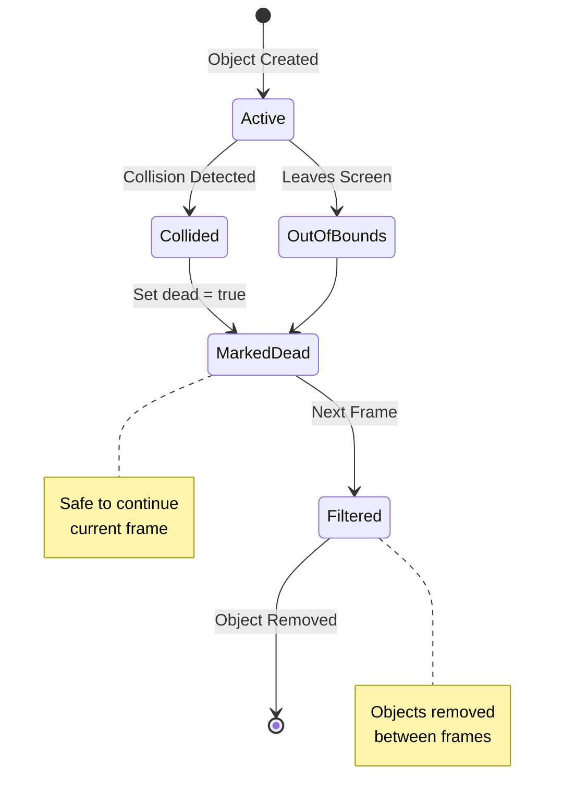
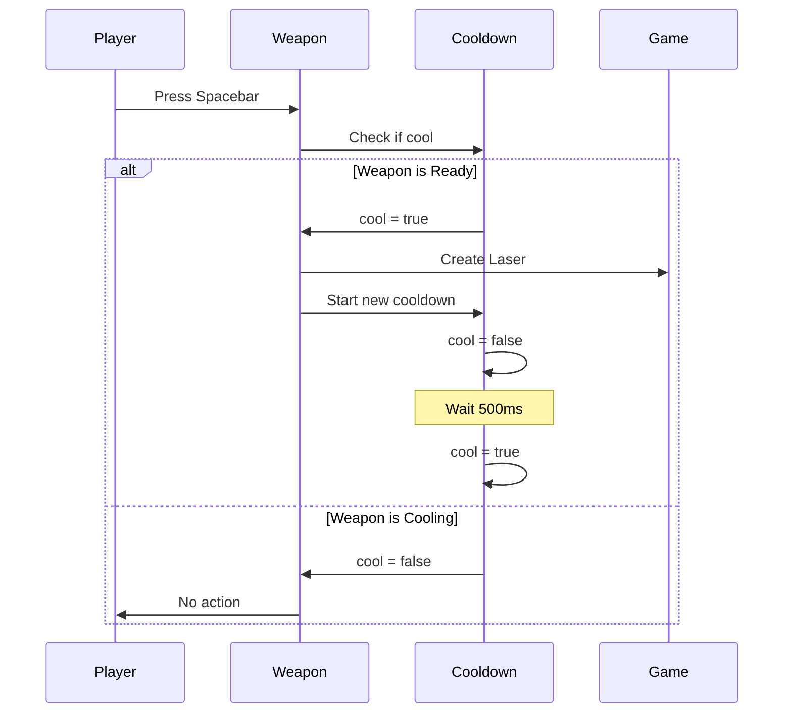
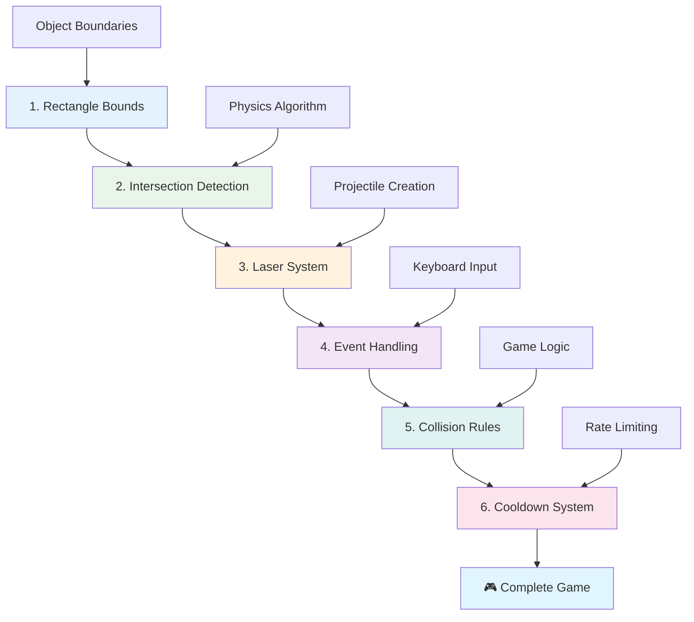
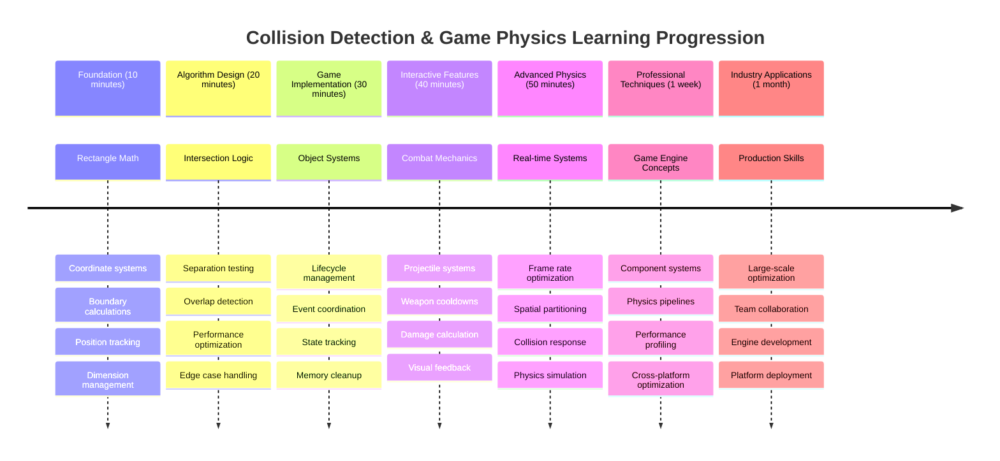

# 建造太空遊戲第四部分：添加雷射和檢測碰撞



## 課前測驗

[課前測驗](https://ff-quizzes.netlify.app/web/quiz/35)

想想《星際大戰》中盧克的質子魚雷擊中死星排氣口的那一刻。那精確的碰撞檢測改變了整個銀河系的命運！在遊戲中，碰撞檢測的原理相同——它決定了物體何時互動以及接下來會發生什麼。

在本課中，你將為你的太空遊戲添加雷射武器並實現碰撞檢測。就像NASA的任務規劃者計算航天器軌跡以避免碎片一樣，你將學習如何檢測遊戲物體何時相交。我們會將這些步驟分解成易於理解的部分。

到課程結束時，你將擁有一個功能完善的戰鬥系統，雷射可以摧毀敵人，碰撞會觸發遊戲事件。這些碰撞原理也被廣泛應用於物理模擬和互動式網頁界面。



✅ 做一些研究，了解第一個電腦遊戲的功能是什麼？

## 碰撞檢測

碰撞檢測的工作原理就像阿波羅登月艙上的接近傳感器——它不斷檢查距離，並在物體過於接近時觸發警報。在遊戲中，這個系統決定了物體何時互動以及接下來應該發生什麼。

我們將使用的方法是將每個遊戲物體視為矩形，類似於航空交通管制系統使用簡化的幾何形狀來追蹤飛機。這種矩形方法看似簡單，但計算效率高，並且適用於大多數遊戲場景。

### 矩形表示法

每個遊戲物體都需要坐標邊界，類似於火星探路者探測器在火星表面上繪製其位置。以下是我們如何定義這些邊界坐標：



```javascript
rectFromGameObject() {
  return {
    top: this.y,
    left: this.x,
    bottom: this.y + this.height,
    right: this.x + this.width
  }
}
```

**讓我們來分解一下：**
- **上邊緣**：這就是物體在垂直方向上的起始位置（它的y坐標）
- **左邊緣**：物體在水平方向上的起始位置（它的x坐標）
- **下邊緣**：將高度加到y坐標——現在你知道它的結束位置！
- **右邊緣**：將寬度加到x坐標——你就得到了完整的邊界。

### 相交算法

檢測矩形相交的邏輯類似於哈勃太空望遠鏡如何判斷天體是否在其視野中重疊。該算法檢查分離情況：



```javascript
function intersectRect(r1, r2) {
  return !(r2.left > r1.right ||
    r2.right < r1.left ||
    r2.top > r1.bottom ||
    r2.bottom < r1.top);
}
```

**分離測試的工作原理類似於雷達系統：**
- 矩形2是否完全在矩形1的右側？
- 矩形2是否完全在矩形1的左側？
- 矩形2是否完全在矩形1的下方？
- 矩形2是否完全在矩形1的上方？

如果這些條件都不成立，那麼矩形必定是重疊的。這種方法類似於雷達操作員如何判斷兩架飛機是否保持安全距離。

## 管理物體生命週期

當雷射擊中敵人時，兩個物體都需要從遊戲中移除。然而，在循環中途刪除物體可能會導致崩潰——這是早期電腦系統（如阿波羅導航電腦）中學到的教訓。因此，我們使用“標記刪除”的方法，在幀之間安全地移除物體。



以下是我們標記某物體為刪除的方法：

```javascript
// Mark object for removal
enemy.dead = true;
```

**為什麼這種方法有效：**
- 我們將物體標記為“死亡”，但不會立即刪除它
- 這樣可以讓當前的遊戲幀安全完成
- 避免因試圖使用已刪除的物體而導致崩潰！

然後在下一個渲染周期之前過濾掉被標記的物體：

```javascript
gameObjects = gameObjects.filter(go => !go.dead);
```

**這種過濾的作用：**
- 創建一個僅包含“活著”物體的新列表
- 丟棄任何被標記為死亡的物體
- 保持遊戲流暢運行
- 防止因累積被摧毀的物體而導致的內存膨脹

## 實現雷射機制

遊戲中的雷射投射物的工作原理與《星際迷航》中的光子魚雷相同——它們是離散的物體，沿直線移動直到撞到某物。每次按下空格鍵都會創建一個新的雷射物體，並在屏幕上移動。

為了實現這一點，我們需要協調幾個不同的部分：

**需要實現的關鍵組件：**
- **創建**從英雄位置生成的雷射物體
- **處理**鍵盤輸入以觸發雷射創建
- **管理**雷射的移動和生命週期
- **實現**雷射投射物的視覺表示

## 實現射擊速率控制

無限制的射擊速率會使遊戲引擎不堪重負，並使遊戲過於簡單。真實的武器系統也面臨類似的限制——即使是《星際迷航》中企業號的相位炮也需要在射擊之間充能。

我們將實現一個冷卻系統，防止快速連射，同時保持響應式控制：



```javascript
class Cooldown {
  constructor(time) {
    this.cool = false;
    setTimeout(() => {
      this.cool = true;
    }, time);
  }
}

class Weapon {
  constructor() {
    this.cooldown = null;
  }
  
  fire() {
    if (!this.cooldown || this.cooldown.cool) {
      // Create laser projectile
      this.cooldown = new Cooldown(500);
    } else {
      // Weapon is still cooling down
    }
  }
}
```

**冷卻系統的工作原理：**
- 創建時，武器處於“熱”狀態（暫時無法射擊）
- 在冷卻時間過後，武器變為“冷”狀態（可以射擊）
- 在射擊之前，我們檢查：“武器是否冷卻？”
- 這防止了快速點擊，同時保持控制的響應性

✅ 回顧太空遊戲系列第一課，回憶冷卻系統的相關內容。

## 構建碰撞系統

你將擴展現有的太空遊戲代碼，創建一個碰撞檢測系統。就像國際空間站的自動碰撞避免系統一樣，你的遊戲將不斷監控物體位置並對相交做出反應。

從上一課的代碼開始，你將添加碰撞檢測，並制定特定規則來管理物體的互動。

> 💡 **專業提示**：雷射精靈已包含在你的資產文件夾中，並在代碼中引用，準備好實現。

### 要實現的碰撞規則

**需要添加的遊戲機制：**
1. **雷射擊中敵人**：當雷射投射物擊中敵人時，敵人物體被摧毀
2. **雷射擊中屏幕邊界**：雷射到達屏幕頂部邊緣時被移除
3. **敵人和英雄碰撞**：當敵人和英雄相交時，兩個物體都被摧毀
4. **敵人到達底部**：當敵人到達屏幕底部時，觸發遊戲結束條件

### 🔄 **教學檢查**
**碰撞檢測基礎**：在實現之前，確保你理解：
- ✅ 矩形邊界如何定義碰撞區域
- ✅ 為什麼分離測試比相交計算更高效
- ✅ 在遊戲循環中管理物體生命週期的重要性
- ✅ 事件驅動系統如何協調碰撞響應

**快速自我測試**：如果你立即刪除物體而不是標記它們，會發生什麼？
*答案：循環中途刪除可能導致崩潰或在迭代中跳過物體*

**物理理解**：你現在掌握了：
- **坐標系統**：位置和尺寸如何創建邊界
- **相交邏輯**：碰撞檢測背後的數學原理
- **性能優化**：即時系統中高效算法的重要性
- **內存管理**：穩定的物體生命週期模式

## 設置開發環境

好消息——我們已經為你設置了大部分基礎工作！所有的遊戲資產和基本結構都在`your-work`子文件夾中，準備好讓你添加酷炫的碰撞功能。

### 項目結構

```bash
-| assets
  -| enemyShip.png
  -| player.png
  -| laserRed.png
-| index.html
-| app.js
-| package.json
```

**理解文件結構：**
- **包含**遊戲物體所需的所有精靈圖像
- **包括**主要HTML文檔和JavaScript應用文件
- **提供**本地開發服務器的包配置

### 啟動開發服務器

導航到你的項目文件夾並啟動本地服務器：

```bash
cd your-work
npm start
```

**這些命令序列：**
- **切換**到你的工作項目文件夾
- **啟動**本地HTTP服務器，地址為`http://localhost:5000`
- **提供**你的遊戲文件以進行測試和開發
- **支持**自動重新加載的即時開發

打開瀏覽器並導航到`http://localhost:5000`，查看你的當前遊戲狀態，英雄和敵人已渲染在屏幕上。

### 分步實現

就像NASA用於編程旅行者號航天器的系統方法一樣，我們將逐步實現碰撞檢測，逐步構建每個組件。



#### 1. 添加矩形碰撞邊界

首先，讓我們教遊戲物體如何描述它們的邊界。將此方法添加到你的`GameObject`類中：

```javascript
rectFromGameObject() {
    return {
      top: this.y,
      left: this.x,
      bottom: this.y + this.height,
      right: this.x + this.width,
    };
  }
```

**此方法的作用：**
- **創建**具有精確邊界坐標的矩形物體
- **計算**底部和右側邊緣，使用位置加上尺寸
- **返回**一個準備好進行碰撞檢測算法的物體
- **提供**所有遊戲物體的標準化接口

#### 2. 實現相交檢測

現在讓我們創建碰撞檢測函數——一個可以判斷兩個矩形是否重疊的函數：

```javascript
function intersectRect(r1, r2) {
  return !(
    r2.left > r1.right ||
    r2.right < r1.left ||
    r2.top > r1.bottom ||
    r2.bottom < r1.top
  );
}
```

**此算法的工作原理：**
- **測試**矩形之間的四個分離條件
- 如果任何分離條件為真，則**返回**`false`
- 如果沒有分離存在，則**表示**碰撞
- **使用**否定邏輯進行高效的相交測試

#### 3. 實現雷射射擊系統

現在到了激動人心的時刻！讓我們設置雷射射擊系統。

##### 消息常量

首先，讓我們定義一些消息類型，以便遊戲的不同部分可以相互通信：

```javascript
KEY_EVENT_SPACE: "KEY_EVENT_SPACE",
COLLISION_ENEMY_LASER: "COLLISION_ENEMY_LASER",
COLLISION_ENEMY_HERO: "COLLISION_ENEMY_HERO",
```

**這些常量提供：**
- **標準化**應用中的事件名稱
- **支持**遊戲系統之間的一致通信
- **防止**事件處理器註冊中的拼寫錯誤

##### 鍵盤輸入處理

將空格鍵檢測添加到你的鍵盤事件監聽器：

```javascript
} else if(evt.keyCode === 32) {
  eventEmitter.emit(Messages.KEY_EVENT_SPACE);
}
```

**此輸入處理器：**
- **檢測**使用keyCode 32的空格鍵按下
- **發送**標準化事件消息
- **支持**解耦的射擊邏輯

##### 事件監聽器設置

在你的`initGame()`函數中註冊射擊行為：

```javascript
eventEmitter.on(Messages.KEY_EVENT_SPACE, () => {
 if (hero.canFire()) {
   hero.fire();
 }
});
```

**此事件監聽器：**
- **響應**空格鍵事件
- **檢查**射擊冷卻狀態
- **觸發**雷射創建（如果允許）

添加雷射與敵人交互的碰撞處理：

```javascript
eventEmitter.on(Messages.COLLISION_ENEMY_LASER, (_, { first, second }) => {
  first.dead = true;
  second.dead = true;
});
```

**此碰撞處理器：**
- **接收**碰撞事件數據，包括兩個物體
- **標記**兩個物體為刪除
- **確保**碰撞後的正確清理

#### 4. 創建雷射類

實現一個向上移動並管理自身生命週期的雷射投射物：

```javascript
class Laser extends GameObject {
  constructor(x, y) {
    super(x, y);
    this.width = 9;
    this.height = 33;
    this.type = 'Laser';
    this.img = laserImg;
    
    let id = setInterval(() => {
      if (this.y > 0) {
        this.y -= 15;
      } else {
        this.dead = true;
        clearInterval(id);
      }
    }, 100);
  }
}
```

**此類的實現：**
- **擴展**GameObject以繼承基本功能
- **設置**雷射精靈的適當尺寸
- **創建**使用`setInterval()`的自動向上移動
- **處理**到達屏幕頂部時的自我銷毀
- **管理**自身的動畫時間和清理

#### 5. 實現碰撞檢測系統

創建一個全面的碰撞檢測函數：

```javascript
function updateGameObjects() {
  const enemies = gameObjects.filter(go => go.type === 'Enemy');
  const lasers = gameObjects.filter(go => go.type === "Laser");
  
  // Test laser-enemy collisions
  lasers.forEach((laser) => {
    enemies.forEach((enemy) => {
      if (intersectRect(laser.rectFromGameObject(), enemy.rectFromGameObject())) {
        eventEmitter.emit(Messages.COLLISION_ENEMY_LASER, {
          first: laser,
          second: enemy,
        });
      }
    });
  });

  // Remove destroyed objects
  gameObjects = gameObjects.filter(go => !go.dead);
}
```

**此碰撞系統：**
- **過濾**遊戲物體類型以提高測試效率
- **測試**每個雷射與每個敵人之間的相交
- **發送**相交事件，當檢測到碰撞時
- **清理**碰撞處理後被摧毀的物體

> ⚠️ **重要**：在`window.onload`的主遊戲循環中添加`updateGameObjects()`以啟用碰撞檢測。

#### 6. 為Hero類添加冷卻系統

使用射擊機制和速率限制增強Hero類：

```javascript
class Hero extends GameObject {
  constructor(x, y) {
    super(x, y);
    this.width = 99;
    this.height = 75;
    this.type = "Hero";
    this.speed = { x: 0, y: 0 };
    this.cooldown = 0;
  }
  
  fire() {
    gameObjects.push(new Laser(this.x + 45, this.y - 10));
    this.cooldown = 500;

    let id = setInterval(() => {
      if (this.cooldown > 0) {
        this.cooldown -= 100;
      } else {
        clearInterval(id);
      }
    }, 200);
  }
  
  canFire() {
    return this.cooldown === 0;
  }
}
```

**理解增強的Hero類：**
- **初始化**冷卻計時器為零（準備射擊）
- **創建**位於英雄飛船上方的雷射物體
- **設置**冷卻時間以防止快速射擊
- **減少**冷卻計時器，使用基於間隔的更新
- **提供**通過`canFire()`方法檢查射擊狀態

### 🔄 **教學檢查**
**完整系統理解**：確認你已掌握碰撞系統：
- ✅ 矩形邊界如何實現高效的碰撞檢測？
- ✅ 為什麼物體生命週期管理對遊戲穩定性至關重要？
- ✅ 冷卻系統如何防止性能問題？
- ✅ 事件驅動架構在碰撞處理中扮演什麼角色？

**系統整合**：你的碰撞檢測展示了：
- **數學精確性**：矩形相交算法
- **性能優化**：高效的碰撞測試模式
- **內存管理**：安全的物體創建和銷毀
- **事件協調**：解耦的系統通信
- **即時處理**：基於幀的更新循環

**專業模式**：你已實現：
- **關注點分離**：物理、渲染和輸入分離
- **面向對象設計**：繼承和多態性
- **狀態管理**：物體生命週期和遊戲狀態跟蹤
- **性能優化**：適用於即時使用的高效算法

### 測試你的實現

你的太空遊戲現在具備完整的碰撞檢測和戰鬥機制。🚀 測試這些新功能：
- **使用方向鍵移動**，驗證移動控制
- **按空格鍵射擊雷射**——注意冷卻系統如何防止快速點擊
- **觀察碰撞**，當雷射擊中敵人時觸發移除
- **驗證清理**，被摧毀的物體從遊戲中消失

你已成功使用指導航天器導航和機器人技術的相同數學原理，實現了一個碰撞檢測系統。

### ⚡ **接下來的5分鐘你可以做什麼**
- [ ] 打開瀏覽器開發工具，在你的碰撞檢測函數中設置斷點
- [ ] 嘗試修改雷射速度或敵人移動，觀察碰撞效果
- [ ] 嘗試不同的冷卻值，測試射擊速率
- [ ] 添加 `console.log` 語句以即時追蹤碰撞事件

### 🎯 **本小時你可以完成的目標**
- [ ] 完成課後測驗並理解碰撞檢測算法
- [ ] 添加碰撞時的視覺效果，例如爆炸
- [ ] 實現不同類型的射彈，並賦予它們不同的屬性
- [ ] 創建能暫時增強玩家能力的增益道具
- [ ] 添加音效，使碰撞更具吸引力

### 📅 **你的一週物理編程計劃**
- [ ] 完成具有精緻碰撞系統的完整太空遊戲
- [ ] 實現超越矩形的高級碰撞形狀（圓形、多邊形）
- [ ] 添加粒子系統以實現逼真的爆炸效果
- [ ] 創建具有碰撞避讓功能的複雜敵人行為
- [ ] 優化碰撞檢測以提升多物件場景的性能
- [ ] 添加物理模擬，例如動量和真實運動

### 🌟 **你的一個月遊戲物理精通計劃**
- [ ] 使用高級物理引擎和真實模擬構建遊戲
- [ ] 學習3D碰撞檢測和空間分割算法
- [ ] 為開源物理庫和遊戲引擎做出貢獻
- [ ] 掌握圖形密集型應用的性能優化
- [ ] 創建有關遊戲物理和碰撞檢測的教育內容
- [ ] 建立展示高級物理編程技能的作品集

## 🎯 你的碰撞檢測精通時間表



### 🛠️ 你的遊戲物理工具包摘要

完成本課程後，你已掌握：
- **碰撞數學**：矩形交集算法和坐標系統
- **性能優化**：針對即時應用的高效碰撞檢測
- **物件生命周期管理**：安全的創建、更新和銷毀模式
- **事件驅動架構**：解耦的碰撞響應系統
- **遊戲循環整合**：基於幀的物理更新和渲染協調
- **輸入系統**：具有速率限制和反饋的響應式控制
- **內存管理**：高效的物件池和清理策略

**實際應用**：你的碰撞檢測技能直接適用於：
- **互動模擬**：科學建模和教育工具
- **用戶界面設計**：拖放交互和觸摸檢測
- **數據可視化**：互動式圖表和可點擊元素
- **移動開發**：觸摸手勢識別和碰撞處理
- **機器人編程**：路徑規劃和障礙物避讓
- **計算機圖形學**：光線追踪和空間算法

**獲得的專業技能**：你現在可以：
- **設計**高效算法以進行即時碰撞檢測
- **實現**可隨物件複雜度擴展的物理系統
- **調試**基於數學原理的複雜交互系統
- **優化**針對不同硬件和瀏覽器能力的性能
- **架構**使用成熟設計模式的可維護遊戲系統

**掌握的遊戲開發概念**：
- **物理模擬**：即時碰撞檢測和響應
- **性能工程**：針對互動應用的優化算法
- **事件系統**：遊戲組件之間的解耦通信
- **物件管理**：動態內容的高效生命周期模式
- **輸入處理**：具有適當反饋的響應式控制

**下一步**：你已準備好探索高級物理引擎如 Matter.js，實現3D碰撞檢測，或構建複雜的粒子系統！

🌟 **成就解鎖**：你已構建了一個完整的基於物理的交互系統，並具備專業級的碰撞檢測能力！

## GitHub Copilot Agent 挑戰 🚀

使用 Agent 模式完成以下挑戰：

**描述**：通過實現隨機生成的增益道具來增強碰撞檢測系統，當英雄飛船收集到增益道具時提供暫時能力。

**提示**：創建一個繼承 GameObject 的 PowerUp 類，並實現英雄與增益道具之間的碰撞檢測。至少添加兩種類型的增益道具：一種增加射擊速率（減少冷卻時間），另一種創建暫時護盾。包括生成邏輯，能在隨機間隔和位置生成增益道具。

---

## 🚀 挑戰

添加爆炸效果！查看 [Space Art repo](../../../../6-space-game/solution/spaceArt/readme.txt) 中的遊戲資源，嘗試在激光擊中外星人時添加爆炸效果。

## 課後測驗

[課後測驗](https://ff-quizzes.netlify.app/web/quiz/36)

## 回顧與自學

試驗你遊戲中的間隔設置。當你改變它們時會發生什麼？閱讀更多有關 [JavaScript 時間事件](https://www.freecodecamp.org/news/javascript-timing-events-settimeout-and-setinterval/) 的內容。

## 作業

[探索碰撞](assignment.md)

---

**免責聲明**：  
本文件已使用 AI 翻譯服務 [Co-op Translator](https://github.com/Azure/co-op-translator) 進行翻譯。儘管我們努力確保準確性，但請注意，自動翻譯可能包含錯誤或不準確之處。原始文件的母語版本應被視為權威來源。對於關鍵信息，建議使用專業人工翻譯。我們對因使用此翻譯而引起的任何誤解或誤釋不承擔責任。