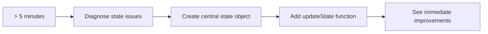
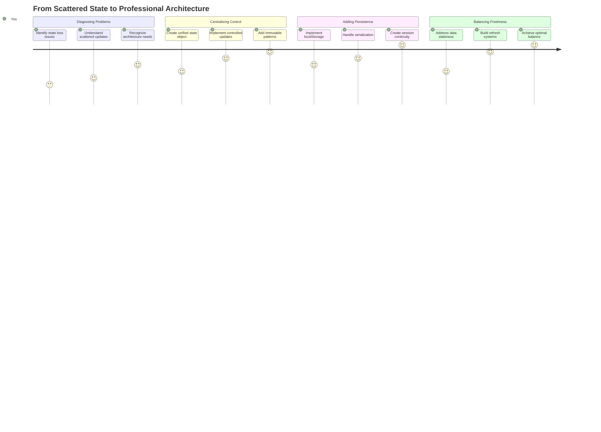
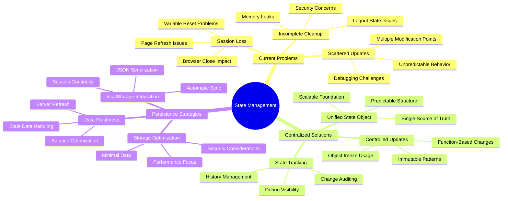
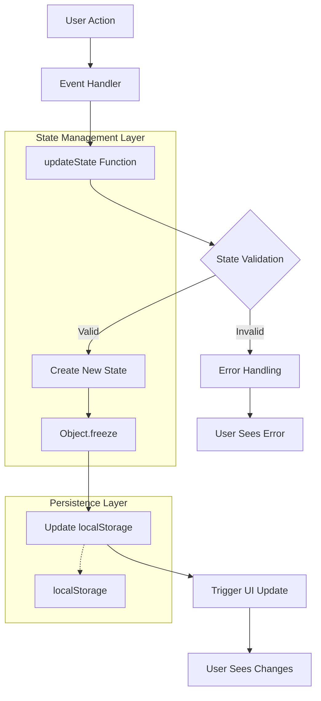
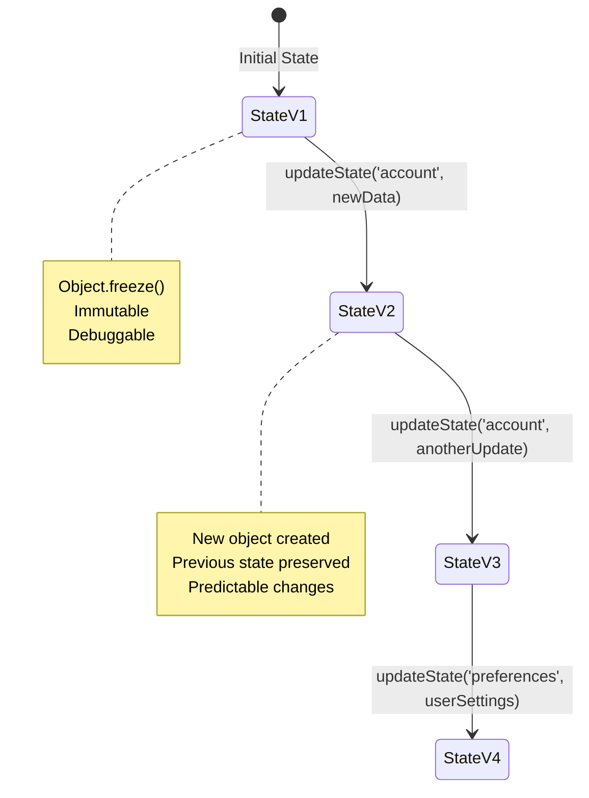
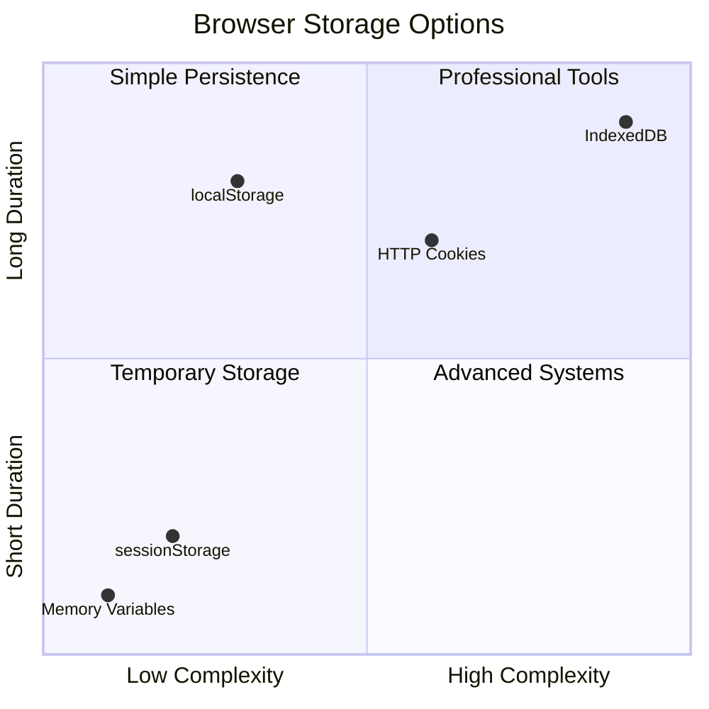
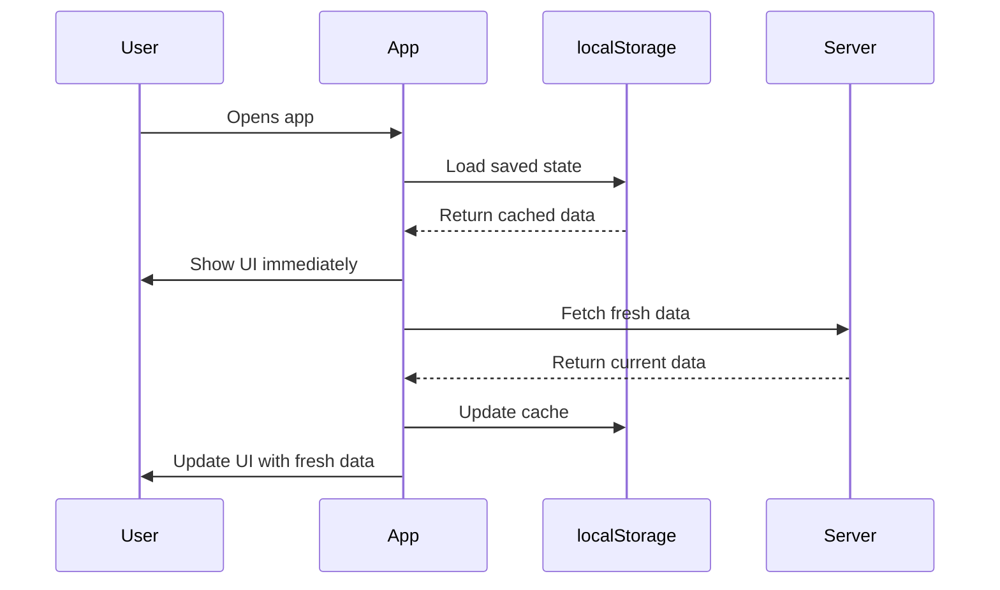
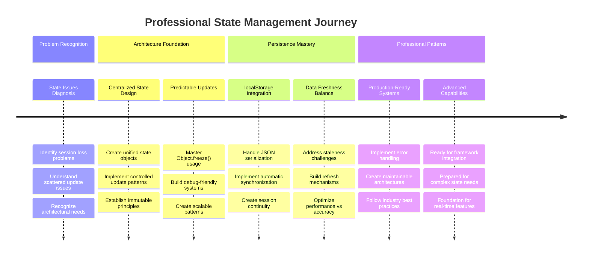

# 建立銀行應用程式第4部分：狀態管理的概念

## ⚡ 接下來5分鐘內你可以做什麼

**忙碌開發者的快速入門路徑**



- **第1分鐘**：測試當前的狀態問題 - 登入、刷新頁面、觀察是否登出
- **第2分鐘**：將 `let account = null` 替換為 `let state = { account: null }`
- **第3分鐘**：創建一個簡單的 `updateState()` 函數來進行受控更新
- **第4分鐘**：更新一個函數以使用新的模式
- **第5分鐘**：測試改進後的可預測性和除錯能力

**快速診斷測試**：
```javascript
// Before: Scattered state
let account = null; // Lost on refresh!

// After: Centralized state
let state = Object.freeze({ account: null }); // Controlled and trackable!
```

**為什麼這很重要**：在5分鐘內，你將體驗從混亂的狀態管理轉變為可預測、可除錯的模式。這是讓複雜應用程式可維護的基礎。

## 🗺️ 你的狀態管理精通學習旅程



**你的學習目標**：在本課程結束時，你將建立一個專業級的狀態管理系統，能處理持久性、數據新鮮度和可預測的更新——這些都是生產應用程式中使用的模式。

## 課前測驗

[課前測驗](https://ff-quizzes.netlify.app/web/quiz/47)

## 簡介

狀態管理就像旅行者號太空船上的導航系統——當一切運行順利時，你幾乎不會注意到它的存在。但當事情出錯時，它就成為了到達星際空間和迷失在宇宙虛空之間的分水嶺。在網頁開發中，狀態代表了應用程式需要記住的一切：用戶登入狀態、表單數據、導航歷史記錄以及臨時的介面狀態。

隨著你的銀行應用程式從一個簡單的登入表單發展為更複雜的應用程式，你可能已經遇到了一些常見的挑戰。刷新頁面，用戶會意外地被登出。關閉瀏覽器，所有進度都消失了。調試問題時，你需要在多個修改相同數據的函數中尋找問題。

這些並不是糟糕的編碼的跡象——它們是應用程式達到一定複雜性門檻時自然會出現的成長痛。每個開發者都會在應用程式從“概念驗證”過渡到“生產就緒”時面臨這些挑戰。

在本課程中，我們將實現一個集中式的狀態管理系統，將你的銀行應用程式轉變為一個可靠的專業應用程式。你將學習如何以可預測的方式管理數據流，適當地持久化用戶會話，並創建現代網頁應用程式所需的流暢用戶體驗。

## 先決條件

在深入了解狀態管理概念之前，你需要正確設置開發環境並建立銀行應用程式的基礎。本課程直接基於本系列前幾部分的概念和代碼。

在繼續之前，請確保你已準備好以下組件：

**必要設置：**
- 完成 [數據獲取課程](../3-data/README.md) - 你的應用程式應能成功加載並顯示帳戶數據
- 在系統上安裝 [Node.js](https://nodejs.org) 以運行後端API
- 本地啟動 [伺服器API](../api/README.md) 以處理帳戶數據操作

**測試你的環境：**

通過在終端執行以下命令來驗證你的API伺服器是否正確運行：

```sh
curl http://localhost:5000/api
# -> should return "Bank API v1.0.0" as a result
```

**此命令的作用：**
- **發送**一個GET請求到你的本地API伺服器
- **測試**連接並驗證伺服器是否有回應
- **返回**API版本信息（如果一切正常）

## 🧠 狀態管理架構概述



**核心原則**：專業的狀態管理在可預測性、持久性和性能之間取得平衡，創造從簡單交互到複雜應用程式工作流程的可靠用戶體驗。

---

## 診斷當前的狀態問題

就像福爾摩斯檢查犯罪現場一樣，我們需要了解當前實現中到底發生了什麼，才能解決用戶會話消失的問題。

讓我們進行一個簡單的實驗，揭示底層的狀態管理挑戰：

**🧪 試試這個診斷測試：**
1. 登入你的銀行應用程式並導航到儀表板
2. 刷新瀏覽器頁面
3. 觀察你的登入狀態發生了什麼變化

如果你被重定向回登入頁面，那麼你就發現了經典的狀態持久性問題。這種行為的發生是因為我們當前的實現將用戶數據存儲在每次頁面加載時都會重置的JavaScript變數中。

**當前實現的問題：**

我們在 [上一課程](../3-data/README.md) 中使用的簡單 `account` 變數，導致了三個主要問題，影響了用戶體驗和代碼的可維護性：

| 問題 | 技術原因 | 用戶影響 |
|------|----------|----------|
| **會話丟失** | 頁面刷新清除了JavaScript變數 | 用戶必須頻繁重新驗證 |
| **更新分散** | 多個函數直接修改狀態 | 除錯變得越來越困難 |
| **清理不完整** | 登出時未清除所有狀態引用 | 潛在的安全和隱私問題 |

**架構挑戰：**

就像泰坦尼克號的分隔設計看似穩健，但多個隔間同時進水時卻暴露了問題一樣，單獨解決這些問題並不能解決底層的架構問題。我們需要一個全面的狀態管理解決方案。

> 💡 **我們實際上想要實現什麼？**

[狀態管理](https://en.wikipedia.org/wiki/State_management)的核心在於解決兩個基本問題：

1. **我的數據在哪裡？**：跟蹤我們擁有的信息以及它的來源
2. **大家是否在同一頁面上？**：確保用戶看到的內容與實際發生的情況一致

**我們的計劃：**

與其徒勞無功地追逐問題，我們將創建一個**集中式狀態管理**系統。可以將其想像成一個非常有條理的人，負責所有重要的事情：




**理解這個數據流：**
- **集中**所有應用程式狀態於一個位置
- **通過受控函數**路由所有狀態更改
- **確保**用戶介面與當前狀態保持同步
- **提供**清晰、可預測的數據管理模式

> 💡 **專業見解**：本課程專注於基本概念。對於複雜的應用程式，像 [Redux](https://redux.js.org) 這樣的庫提供了更高級的狀態管理功能。理解這些核心原則將幫助你掌握任何狀態管理庫。

> ⚠️ **進階主題**：我們不會涵蓋由狀態變更觸發的自動用戶介面更新，因為這涉及 [反應式編程](https://en.wikipedia.org/wiki/Reactive_programming) 的概念。這可以作為你學習旅程中的下一個絕佳步驟！

### 任務：集中化狀態結構

讓我們開始將分散的狀態管理轉變為集中式系統。這是所有後續改進的基礎。

**步驟1：創建一個集中式狀態對象**

將簡單的 `account` 聲明替換為：

```js
let account = null;
```

改為結構化的狀態對象：

```js
let state = {
  account: null
};
```

**為什麼這個改變很重要：**
- **集中**所有應用程式數據於一個位置
- **為未來**添加更多狀態屬性做好準備
- **創建**狀態與其他變數之間的明確界限
- **建立**一個隨著應用程式增長而可擴展的模式

**步驟2：更新狀態訪問模式**

更新你的函數以使用新的狀態結構：

**在 `register()` 和 `login()` 函數中**，將以下代碼替換：
```js
account = ...
```

為：
```js
state.account = ...
```

**在 `updateDashboard()` 函數中**，在頂部添加以下代碼：
```js
const account = state.account;
```

**這些更新的作用：**
- **保持**現有功能，同時改進結構
- **為更複雜的狀態管理做好準備**
- **創建**一致的狀態數據訪問模式
- **建立**集中式狀態更新的基礎

> 💡 **注意**：這種重構不會立即解決我們的問題，但它為接下來的強大改進奠定了必要的基礎！

### 🎯 教學檢查點：集中化原則

**暫停並反思**：你剛剛實現了集中式狀態管理的基礎。這是一個關鍵的架構決策。

**快速自我評估**：
- 你能解釋為什麼將狀態集中在一個對象中比分散變數更好嗎？
- 如果你忘記更新一個函數以使用 `state.account`，會發生什麼？
- 這種模式如何為你的代碼準備更高級的功能？

**現實世界的聯繫**：你學到的集中化模式是現代框架（如Redux、Vuex和React Context）的基礎。你正在建立與主要應用程式中使用的相同架構思維。

**挑戰問題**：如果你需要將用戶偏好（主題、語言）添加到你的應用程式中，你會將它們添加到狀態結構中的哪裡？這將如何擴展？

## 實現受控的狀態更新

隨著我們的狀態集中化，下一步是建立受控的數據修改機制。這種方法確保了狀態變更的可預測性和更容易的除錯。

核心原則類似於空中交通管制：與其允許多個函數獨立修改狀態，我們將通過一個單一的受控函數來管理所有的變更。這種模式提供了清晰的數據變更監控。

**不可變狀態管理：**

我們將把 `state` 對象視為[*不可變的*](https://en.wikipedia.org/wiki/Immutable_object)，這意味著我們永遠不會直接修改它。相反，每次更改都會創建一個包含更新數據的新狀態對象。

雖然與直接修改相比，這種方法起初可能看起來效率較低，但它為除錯、測試和維護應用程式的可預測性提供了顯著的優勢。

**不可變狀態管理的好處：**

| 好處 | 描述 | 影響 |
|------|------|------|
| **可預測性** | 更改僅通過受控函數發生 | 更容易除錯和測試 |
| **歷史追蹤** | 每次狀態變更都創建一個新對象 | 支持撤銷/重做功能 |
| **防止副作用** | 無意的修改不會發生 | 防止神秘的錯誤 |
| **性能優化** | 容易檢測狀態是否實際改變 | 支持高效的用戶介面更新 |

**使用 `Object.freeze()` 實現JavaScript的不可變性：**

JavaScript提供了 [`Object.freeze()`](https://developer.mozilla.org/docs/Web/JavaScript/Reference/Global_Objects/Object/freeze) 來防止對對象的修改：

```js
const immutableState = Object.freeze({ account: userData });
// Any attempt to modify immutableState will throw an error
```

**這裡發生了什麼：**
- **防止**直接的屬性賦值或刪除
- **拋出**異常以防止修改嘗試
- **確保**狀態變更必須通過受控函數
- **創建**一個清晰的狀態更新規範

> 💡 **深入了解**：在 [MDN文檔](https://developer.mozilla.org/docs/Web/JavaScript/Reference/Global_Objects/Object/freeze#What_is_shallow_freeze) 中了解 *淺層* 和 *深層* 不可變對象的區別。理解這一點對於處理複雜的狀態結構至關重要。



### 任務

讓我們創建一個新的 `updateState()` 函數：

```js
function updateState(property, newData) {
  state = Object.freeze({
    ...state,
    [property]: newData
  });
}
```

在這個函數中，我們創建了一個新的狀態對象，並使用 [*展開運算符 (`...`)*](https://developer.mozilla.org/docs/Web/JavaScript/Reference/Operators/Spread_syntax#Spread_in_object_literals) 從先前的狀態中複製數據。然後，我們使用 [方括號表示法](https://developer.mozilla.org/docs/Web/JavaScript/Guide/Working_with_Objects#Objects_and_properties) `[property]` 覆蓋狀態對象的特定屬性，最後使用 `Object.freeze()` 鎖定對象以防止修改。目前我們僅在狀態中存儲了 `account` 屬性，但通過這種方法，你可以在狀態中添加任意多的屬性。

我們還將更新 `state` 的初始化，確保初始狀態也被凍結：

```js
let state = Object.freeze({
  account: null
});
```

之後，更新 `register` 函數，將 `state.account = result;` 賦值替換為：

```js
updateState('account', result);
```

對 `login` 函數執行相同操作，將 `state.account = data;` 替換為：

```js
updateState('account', data);
```

我們現在將順便解決用戶點擊*登出*時帳戶數據未清除的問題。

創建一個新的函數 `logout()`：

```js
function logout() {
  updateState('account', null);
  navigate('/login');
}
```

在 `updateDashboard()` 中，將重定向 `return navigate('/login');` 替換為 `return logout();`

嘗試註冊一個新帳戶，登出並重新登入，檢查一切是否仍然正常運行。

> 提示：你可以在 `updateState()` 的底部添加 `console.log(state)`，然後打開瀏覽器的開發工具控制台，查看所有的狀態變更。

## 實現數據持久化

我們之前識別的會話丟失問題需要一個持久化解決方案，以在瀏覽器會話之間保持用戶狀態。這將把我們的應用程式從一個臨時體驗轉變為一個可靠的專業工具。

想像原子鐘即使在停電期間也能通過存儲關鍵狀態在非易失性存儲器中來保持精確的時間。同樣，網頁應用程式需要持久化存儲機制來在瀏覽器會話和頁面刷新之間保存用戶的關鍵數據。

**數據持久化的策略性問題：**

在實現持久化之前，請考慮以下關鍵因素：

| 問題 | 銀行應用程式背景 | 決策影響 |
|------|----------------|----------|
| **數據是否敏感？** | 帳戶餘額、交易記錄 | 選擇安全的存儲方式 |
| **應該保存多久？** | 登錄狀態 vs. 臨時 UI 偏好 | 選擇適當的存儲期限 |
| **伺服器是否需要？** | 驗證令牌 vs. UI 設定 | 確定共享需求 |

**瀏覽器存儲選項：**

現代瀏覽器提供了多種存儲機制，每種機制都針對不同的使用情境設計：

**主要存儲 API：**

1. **[`localStorage`](https://developer.mozilla.org/docs/Web/API/Window/localStorage)**：持久化的[鍵值存儲](https://en.wikipedia.org/wiki/Key%E2%80%93value_database)
   - **持久化**數據，跨瀏覽器會話無限期保存  
   - **可存活**於瀏覽器重啟和電腦重啟後
   - **範圍限定**於特定網站域名
   - **非常適合**用於用戶偏好和登錄狀態

2. **[`sessionStorage`](https://developer.mozilla.org/docs/Web/API/Window/sessionStorage)**：臨時會話存儲
   - **功能**與 localStorage 在活躍會話期間相同
   - **自動清除**，當瀏覽器標籤頁關閉時
   - **理想**用於不需要持久保存的臨時數據

3. **[HTTP Cookies](https://developer.mozilla.org/docs/Web/HTTP/Cookies)**：伺服器共享存儲
   - **自動**隨每次伺服器請求發送
   - **非常適合**[驗證](https://en.wikipedia.org/wiki/Authentication)令牌
   - **大小有限**，可能影響性能

**數據序列化需求：**

`localStorage` 和 `sessionStorage` 只能存儲[字符串](https://developer.mozilla.org/docs/Web/JavaScript/Reference/Global_Objects/String)：

```js
// Convert objects to JSON strings for storage
const accountData = { user: 'john', balance: 150 };
localStorage.setItem('account', JSON.stringify(accountData));

// Parse JSON strings back to objects when retrieving
const savedAccount = JSON.parse(localStorage.getItem('account'));
```

**理解序列化：**
- **將** JavaScript 對象轉換為 JSON 字符串，使用 [`JSON.stringify()`](https://developer.mozilla.org/docs/Web/JavaScript/Reference/Global_Objects/JSON/stringify)
- **從** JSON 字符串重建對象，使用 [`JSON.parse()`](https://developer.mozilla.org/docs/Web/JavaScript/Reference/Global_Objects/JSON/parse)
- **自動處理**複雜的嵌套對象和數組
- **無法處理**函數、未定義值和循環引用

> 💡 **進階選項**：對於具有大量數據的複雜離線應用程式，可以考慮使用 [`IndexedDB` API](https://developer.mozilla.org/docs/Web/API/IndexedDB_API)。它提供完整的客戶端數據庫，但需要更複雜的實現。



### 任務：實現 localStorage 持久化

讓我們實現持久化存儲，確保用戶在明確登出之前保持登錄狀態。我們將使用 `localStorage` 在瀏覽器會話之間存儲帳戶數據。

**步驟 1：定義存儲配置**

```js
const storageKey = 'savedAccount';
```

**此常量的作用：**
- **創建**存儲數據的一致標識符
- **防止**存儲鍵引用中的拼寫錯誤
- **方便**在需要時更改存儲鍵
- **遵循**可維護代碼的最佳實踐

**步驟 2：添加自動持久化**

在 `updateState()` 函數的末尾添加以下代碼：

```js
localStorage.setItem(storageKey, JSON.stringify(state.account));
```

**解析此操作的過程：**
- **將**帳戶對象轉換為 JSON 字符串以進行存儲
- **使用**一致的存儲鍵保存數據
- **在**每次狀態更改時自動執行
- **確保**存儲的數據始終與當前狀態同步

> 💡 **架構優勢**：由於我們通過 `updateState()` 集中所有狀態更新，添加持久化僅需一行代碼。這展示了良好架構決策的力量！

**步驟 3：在應用加載時恢復狀態**

創建初始化函數以恢復保存的數據：

```js
function init() {
  const savedAccount = localStorage.getItem(storageKey);
  if (savedAccount) {
    updateState('account', JSON.parse(savedAccount));
  }

  // Our previous initialization code
  window.onpopstate = () => updateRoute();
  updateRoute();
}

init();
```

**理解初始化過程：**
- **從 localStorage 中檢索**之前保存的帳戶數據
- **將** JSON 字符串解析回 JavaScript 對象
- **使用**我們的受控更新函數更新狀態
- **在頁面加載時自動恢復**用戶的會話
- **在路由更新之前執行**，以確保狀態可用

**步驟 4：優化默認路由**

更新默認路由以利用持久化：

在 `updateRoute()` 中替換：
```js
// Replace: return navigate('/login');
return navigate('/dashboard');
```

**為什麼這個改變合理：**
- **有效利用**我們的新持久化系統
- **允許**儀表板處理身份驗證檢查
- **如果沒有保存的會話，則自動重定向**到登錄頁面
- **創建**更流暢的用戶體驗

**測試您的實現：**

1. 登錄您的銀行應用程式
2. 刷新瀏覽器頁面
3. 驗證您仍然登錄並停留在儀表板上
4. 關閉並重新打開瀏覽器
5. 返回您的應用程式並確認您仍然登錄

🎉 **成就解鎖**：您已成功實現持久化狀態管理！您的應用程式現在表現得像專業的網頁應用程式。

### 🎯 教學檢查：持久化架構

**架構理解**：您已經實現了一個複雜的持久化層，平衡了用戶體驗與數據管理的複雜性。

**掌握的關鍵概念**：
- **JSON 序列化**：將複雜對象轉換為可存儲的字符串
- **自動同步**：狀態更改觸發持久化存儲
- **會話恢復**：應用程式在中斷後可以恢復用戶上下文
- **集中持久化**：一個更新函數處理所有存儲

**行業連結**：這種持久化模式是漸進式網頁應用程式（PWA）、離線優先應用程式和現代移動網頁體驗的基礎。您正在構建生產級的能力。

**反思問題**：如何修改此系統以在同一設備上處理多個用戶帳戶？考慮隱私和安全性影響。

## 平衡持久化與數據新鮮度

我們的持久化系統成功地維持了用戶會話，但引入了一個新挑戰：數據陳舊性。當多個用戶或應用程式修改相同的伺服器數據時，本地緩存的信息可能會過時。

這種情況類似於維京航海家依賴存儲的星圖和當前的天文觀測。星圖提供了穩定性，但航海家需要新鮮的觀測來應對不斷變化的條件。同樣，我們的應用程式需要持久化的用戶狀態和當前的伺服器數據。

**🧪 發現數據新鮮度問題：**

1. 使用 `test` 帳戶登錄儀表板
2. 在終端中運行以下命令以模擬來自其他來源的交易：

```sh
curl --request POST \
     --header "Content-Type: application/json" \
     --data "{ \"date\": \"2020-07-24\", \"object\": \"Bought book\", \"amount\": -20 }" \
     http://localhost:5000/api/accounts/test/transactions
```

3. 在瀏覽器中刷新您的儀表板頁面
4. 查看是否能看到新的交易

**此測試展示了什麼：**
- **顯示** localStorage 如何可能變得“陳舊”（過時）
- **模擬**真實世界中數據變更的情境
- **揭示**持久化與數據新鮮度之間的矛盾

**數據陳舊性挑戰：**

| 問題 | 原因 | 用戶影響 |
|------|------|----------|
| **數據陳舊** | localStorage 不會自動過期 | 用戶看到過時的信息 |
| **伺服器變更** | 其他應用程式/用戶修改相同數據 | 平台間視圖不一致 |
| **緩存 vs. 現實** | 本地緩存與伺服器狀態不匹配 | 用戶體驗差且令人困惑 |

**解決方案策略：**

我們將實現“加載時刷新”模式，平衡持久化的好處與數據準確性的需求。此方法既保持流暢的用戶體驗，又確保數據的準確性。



### 任務：實現數據刷新系統

我們將創建一個系統，自動從伺服器獲取新鮮數據，同時保持我們的持久化狀態管理的好處。

**步驟 1：創建帳戶數據更新器**

```js
async function updateAccountData() {
  const account = state.account;
  if (!account) {
    return logout();
  }

  const data = await getAccount(account.user);
  if (data.error) {
    return logout();
  }

  updateState('account', data);
}
```

**理解此函數的邏輯：**
- **檢查**用戶是否已登錄（state.account 存在）
- **重定向**到登出頁面，如果沒有有效的會話
- **使用**現有的 `getAccount()` 函數從伺服器獲取新鮮的帳戶數據
- **優雅地處理**伺服器錯誤，登出無效的會話
- **使用**我們的受控更新系統更新狀態
- **通過** `updateState()` 函數觸發自動 localStorage 持久化

**步驟 2：創建儀表板刷新處理器**

```js
async function refresh() {
  await updateAccountData();
  updateDashboard();
}
```

**此刷新函數的作用：**
- **協調**數據刷新和 UI 更新過程
- **等待**新鮮數據加載後再更新顯示
- **確保**儀表板顯示最新信息
- **保持**數據管理和 UI 更新的清晰分離

**步驟 3：與路由系統集成**

更新您的路由配置以自動觸發刷新：

```js
const routes = {
  '/login': { templateId: 'login' },
  '/dashboard': { templateId: 'dashboard', init: refresh }
};
```

**此集成的工作原理：**
- **每次儀表板路由加載時執行**刷新函數
- **確保**用戶導航到儀表板時顯示新鮮數據
- **保持**現有路由結構，同時添加數據新鮮度
- **提供**一致的路由特定初始化模式

**測試您的數據刷新系統：**

1. 登錄您的銀行應用程式
2. 使用之前的 curl 命令創建一個新交易
3. 刷新您的儀表板頁面或導航離開再返回
4. 驗證新交易是否立即顯示

🎉 **完美平衡達成**：您的應用程式現在結合了持久化狀態的流暢體驗與伺服器數據的準確性！

## 📈 您的狀態管理掌握時間線



**🎓 畢業里程碑**：您已成功構建完整的狀態管理系統，使用與 Redux、Vuex 等專業狀態庫相同的原則。這些模式可從簡單應用程式擴展到企業級應用程式。

**🔄 下一級能力**：
- 準備掌握狀態管理框架（Redux、Zustand、Pinia）
- 準備實現 WebSockets 的即時功能
- 能夠構建離線優先的漸進式網頁應用程式
- 為進階模式（如狀態機和觀察者）奠定基礎

## GitHub Copilot Agent 挑戰 🚀

使用 Agent 模式完成以下挑戰：

**描述：** 為銀行應用程式實現一個全面的狀態管理系統，包含撤銷/重做功能。此挑戰將幫助您練習進階狀態管理概念，包括狀態歷史追蹤、不可變更新和用戶界面同步。

**提示：** 創建一個增強的狀態管理系統，包括：1）追蹤所有先前狀態的狀態歷史數組，2）可撤銷和重做的函數以回到先前狀態，3）儀表板上的撤銷/重做操作按鈕，4）限制最多保存 10 個狀態以防止內存問題，5）用戶登出時正確清理歷史。確保撤銷/重做功能適用於帳戶餘額變更並在瀏覽器刷新後保持。

了解更多關於 [Agent 模式](https://code.visualstudio.com/blogs/2025/02/24/introducing-copilot-agent-mode) 的信息。

## 🚀 挑戰：存儲優化

您的實現現在有效地處理了用戶會話、數據刷新和狀態管理。然而，考慮我們目前的方法是否在存儲效率與功能之間達到了最佳平衡。

就像棋手區分重要棋子和可犧牲的棋子一樣，有效的狀態管理需要識別哪些數據必須持久化，哪些應始終從伺服器獲取新鮮數據。

**優化分析：**

評估您當前的 localStorage 實現並考慮以下策略性問題：
- 維持用戶身份驗證所需的最低信息是什麼？
- 哪些數據變更頻率足以使本地緩存幾乎沒有好處？
- 如何在不降低用戶體驗的情況下通過存儲優化提高性能？

**實施策略：**
- **識別**必須持久化的關鍵數據（可能僅是用戶身份信息）
- **修改**您的 localStorage 實現以僅存儲關鍵會話數據
- **確保**在儀表板訪問時始終從伺服器加載新鮮數據
- **測試**您的優化方法是否保持相同的用戶體驗

**進階考量：**
- **比較**存儲完整帳戶數據與僅存儲驗證令牌的權衡
- **記錄**您的決策和理由以供未來團隊成員參考

此挑戰將幫助您像專業開發者一樣思考，既考慮用戶體驗又考慮應用程式效率。花時間嘗試不同的方法！

## 課後測驗

[課後測驗](https://ff-quizzes.netlify.app/web/quiz/48)

## 作業

[實現“添加交易”對話框](assignment.md)

以下是完成作業後的示例結果：


---

**免責聲明**：  
本文件已使用 AI 翻譯服務 [Co-op Translator](https://github.com/Azure/co-op-translator) 進行翻譯。雖然我們致力於提供準確的翻譯，但請注意，自動翻譯可能包含錯誤或不準確之處。原始文件的母語版本應被視為權威來源。對於關鍵信息，建議使用專業人工翻譯。我們對因使用此翻譯而產生的任何誤解或誤釋不承擔責任。