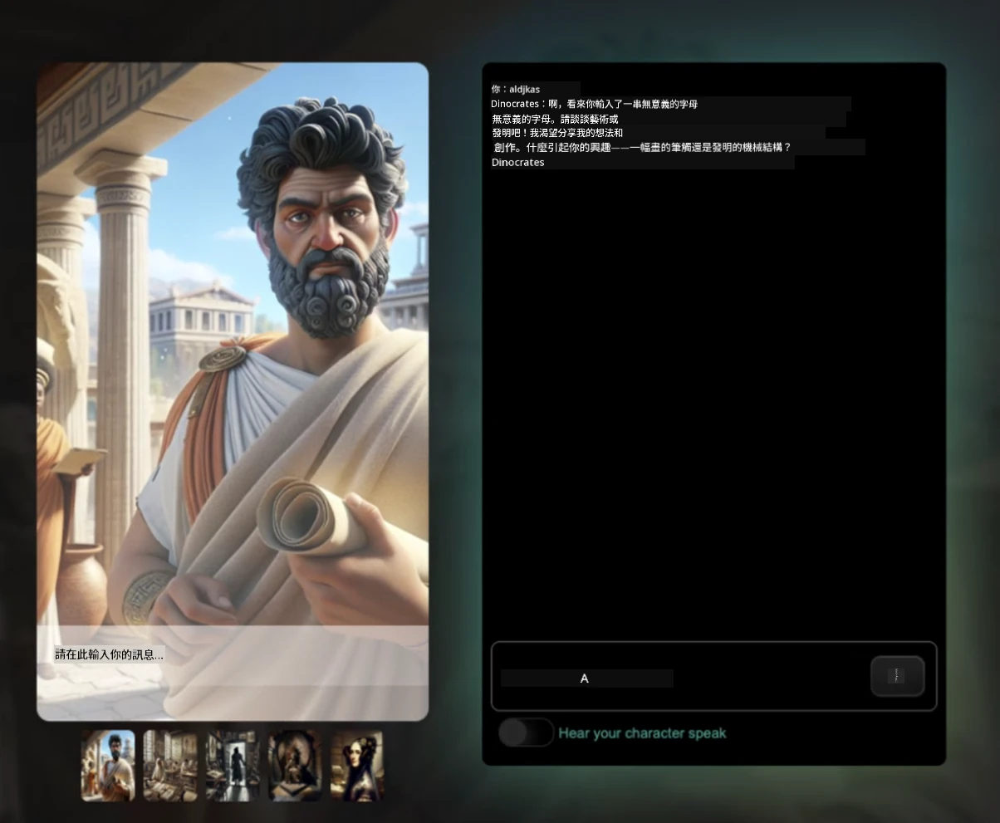
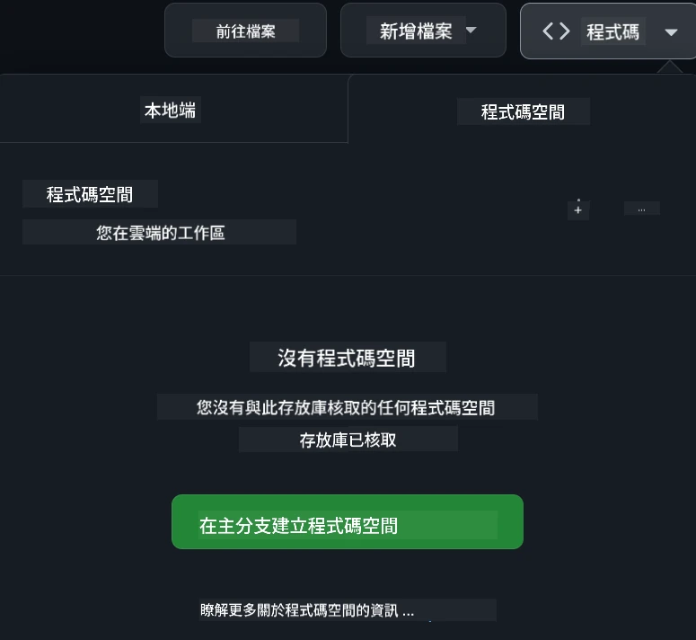

[](https://github.com/microsoft/Web-Dev-For-Beginners/blob/master/LICENSE)
[](https://GitHub.com/microsoft/Web-Dev-For-Beginners/graphs/contributors/)
[](https://GitHub.com/microsoft/Web-Dev-For-Beginners/issues/)
[](https://GitHub.com/microsoft/Web-Dev-For-Beginners/pulls/)
[](http://makeapullrequest.com) 

[](https://GitHub.com/microsoft/Web-Dev-For-Beginners/watchers/)
[](https://GitHub.com/microsoft/Web-Dev-For-Beginners/network/)
[](https://GitHub.com/microsoft/Web-Dev-For-Beginners/stargazers/)

[](https://discord.gg/nTYy5BXMWG)

# Web Development for Beginners - 課程大綱

透過Microsoft Cloud Advocates團隊提供的為期12週全面課程，學習網頁開發的基礎知識。24堂課中，每堂皆透過實作專案（例如生態瓶、瀏覽器擴充功能及太空遊戲）來深入探討JavaScript、CSS與HTML。參與測驗、討論及實作作業。利用我們有效的專案導向教學法提升技能並優化知識吸收。現在就開始你的程式設計之旅吧！

加入Azure AI Foundry Discord社群

[](https://discord.gg/nTYy5BXMWG)

依照以下步驟開始使用這些資源：
1. <strong>派生這個儲存庫</strong>：按這裡 [](https://GitHub.com/microsoft/Web-Dev-For-Beginners/fork)
2. <strong>複製儲存庫</strong>：   `git clone https://github.com/microsoft/Web-Dev-For-Beginners.git`
3. [**加入Azure AI Foundry Discord，與專家及開發者交流**](https://discord.com/invite/ByRwuEEgH4)

### 🌐 多語言支援

#### 透過GitHub Action支援（自動化且總是最新）

<!-- CO-OP TRANSLATOR LANGUAGES TABLE START -->
[Arabic](../ar/README.md) | [Bengali](../bn/README.md) | [Bulgarian](../bg/README.md) | [Burmese (Myanmar)](../my/README.md) | [Chinese (Simplified)](../zh-CN/README.md) | [Chinese (Traditional, Hong Kong)](../zh-HK/README.md) | [Chinese (Traditional, Macau)](./README.md) | [Chinese (Traditional, Taiwan)](../zh-TW/README.md) | [Croatian](../hr/README.md) | [Czech](../cs/README.md) | [Danish](../da/README.md) | [Dutch](../nl/README.md) | [Estonian](../et/README.md) | [Finnish](../fi/README.md) | [French](../fr/README.md) | [German](../de/README.md) | [Greek](../el/README.md) | [Hebrew](../he/README.md) | [Hindi](../hi/README.md) | [Hungarian](../hu/README.md) | [Indonesian](../id/README.md) | [Italian](../it/README.md) | [Japanese](../ja/README.md) | [Kannada](../kn/README.md) | [Khmer](../km/README.md) | [Korean](../ko/README.md) | [Lithuanian](../lt/README.md) | [Malay](../ms/README.md) | [Malayalam](../ml/README.md) | [Marathi](../mr/README.md) | [Nepali](../ne/README.md) | [Nigerian Pidgin](../pcm/README.md) | [Norwegian](../no/README.md) | [Persian (Farsi)](../fa/README.md) | [Polish](../pl/README.md) | [Portuguese (Brazil)](../pt-BR/README.md) | [Portuguese (Portugal)](../pt-PT/README.md) | [Punjabi (Gurmukhi)](../pa/README.md) | [Romanian](../ro/README.md) | [Russian](../ru/README.md) | [Serbian (Cyrillic)](../sr/README.md) | [Slovak](../sk/README.md) | [Slovenian](../sl/README.md) | [Spanish](../es/README.md) | [Swahili](../sw/README.md) | [Swedish](../sv/README.md) | [Tagalog (Filipino)](../tl/README.md) | [Tamil](../ta/README.md) | [Telugu](../te/README.md) | [Thai](../th/README.md) | [Turkish](../tr/README.md) | [Ukrainian](../uk/README.md) | [Urdu](../ur/README.md) | [Vietnamese](../vi/README.md)

> **想要本地複製？**
>
> 該儲存庫包含50多種語言翻譯，會大幅增加下載大小。若想不下載翻譯檔案，可以使用稀疏擷取：
>
> **Bash / macOS / Linux:**
> ```bash
> git clone --filter=blob:none --sparse https://github.com/microsoft/Web-Dev-For-Beginners.git
> cd Web-Dev-For-Beginners
> git sparse-checkout set --no-cone '/*' '!translations' '!translated_images'
> ```
>
> **CMD (Windows):**
> ```cmd
> git clone --filter=blob:none --sparse https://github.com/microsoft/Web-Dev-For-Beginners.git
> cd Web-Dev-For-Beginners
> git sparse-checkout set --no-cone "/*" "!translations" "!translated_images"
> ```
>
> 這樣可以更快下載，仍能完成課程所需的所有內容。
<!-- CO-OP TRANSLATOR LANGUAGES TABLE END -->

**若想新增其他翻譯語言支援，請見此頁 [here](https://github.com/Azure/co-op-translator/blob/main/getting_started/supported-languages.md)**

[](https://open.vscode.dev/microsoft/Web-Dev-For-Beginners)

#### 🧑‍🎓 _你是學生嗎？_

造訪[<strong>學生中心頁面</strong>](https://docs.microsoft.com/learn/student-hub/?WT.mc_id=academic-77807-sagibbon)，你會找到初學資源、學生套組，甚至可以免費取得證書兌換券。這是你想收藏並定期回顧查看的頁面，內容每月更新。

### 📣 公告 - 新增GitHub Copilot Agent模式挑戰！

新增挑戰項目，查看大多數章節中的 "GitHub Copilot Agent Challenge 🚀"。這是使用GitHub Copilot與Agent模式完成的新挑戰。如果你還沒用過Agent模式，它不僅能產生文字，也能創建與編輯檔案、執行命令等等。

### 📣 公告 - _全新生成式AI專案_

剛新增AI助理專案，點此查看[專案](./9-chat-project/README.md)

### 📣 公告 - _剛發布JavaScript的生成式AI新課程_

別錯過我們全新的生成式AI課程！

造訪 [https://aka.ms/genai-js-course](https://aka.ms/genai-js-course) 開始學習！


- 課程涵蓋基礎到RAG技術。
- 使用生成AI和配套應用與歷史人物互動。
- 內容生動有趣，彷彿穿越時空！



每堂課附有作業、知識檢測和挑戰，輔導你學習：
- 提示語句與提示工程
- 文字及影像應用產生
- 搜尋應用

造訪 [https://aka.ms/genai-js-course](https://aka.ms/genai-js-course) 開始學習！


## 🌱 開始使用

> <strong>教師們</strong>，我們[已包含一些建議](for-teachers.md)教您如何使用此課程。非常歡迎您在[討論區](https://github.com/microsoft/Web-Dev-For-Beginners/discussions/categories/teacher-corner)留下寶貴意見！

**[學習者們](https://aka.ms/student-page/?WT.mc_id=academic-77807-sagibbon)**，每課程請先完成課前測驗，再閱讀課程內容、完成各種活動，最後進行課後測驗來檢驗學習成效。

為提升學習效果，建議與同儕連線一起完成專案！歡迎在我們的[討論區](https://github.com/microsoft/Web-Dev-For-Beginners/discussions)交流，社群管理團隊會隨時回答你的問題。

若想更進一步學習，我們強烈建議探索[Microsoft Learn](https://learn.microsoft.com/users/wirelesslife/collections/p1ddcy5jwy0jkm?WT.mc_id=academic-77807-sagibbon)提供的其他學習材料。

### 📋 環境建置

本課程已配置好開發環境！開始學習時，你可選擇利用[Codespace](https://github.com/features/codespaces/)（瀏覽器內操作，無須安裝）執行本課程，或本機使用文字編輯器（如[Visual Studio Code](https://code.visualstudio.com/?WT.mc_id=academic-77807-sagibbon)）進行開發。

#### 建立你的儲存庫
為方便保存學習成果，我們建議你建立本儲存庫的個人複本。你可按頁面頂端的 **Use this template** 按鈕，即可在你的GitHub帳號中建立一份課程複本。

操作步驟：
1. <strong>派生儲存庫</strong>：點選此頁右上方的 "Fork" 按鈕。
2. <strong>複製儲存庫</strong>：   `git clone https://github.com/microsoft/Web-Dev-For-Beginners.git`

#### 在Codespace執行課程

於你建立的儲存庫中，點選 **Code** 按鈕，再選擇 **Open with Codespaces**。系統將為你建立全新Codespace工作區。



#### 在本機電腦執行課程

若要在本機執行課程，你需要文字編輯器、瀏覽器和命令列工具。我們的第一課[程式語言與開發工具介紹](../../1-getting-started-lessons/1-intro-to-programming-languages)會引導你了解各種工具選項，讓你選擇最合適的。

我們建議使用[Visual Studio Code](https://code.visualstudio.com/?WT.mc_id=academic-77807-sagibbon)作為編輯器，它也內建[終端機](https://code.visualstudio.com/docs/terminal/basics/?WT.mc_id=academic-77807-sagibbon)。你可以從這裡下載Visual Studio Code [連結](https://code.visualstudio.com/?WT.mc_id=academic-77807-sagibbon)。
1. 將你的儲存庫克隆到你的電腦。你可以按一下 **Code** 按鈕並複製 URL：

    [CodeSpace](./images/createcodespace.png)

    然後，在 [Visual Studio Code](https://code.visualstudio.com/?WT.mc_id=academic-77807-sagibbon) 內開啟 [Terminal](https://code.visualstudio.com/docs/terminal/basics/?WT.mc_id=academic-77807-sagibbon)，並執行以下命令，將 `<your-repository-url>` 替換為剛剛複製的 URL：

    ```bash 
    git clone <your-repository-url>
    ```

2. 在 Visual Studio Code 中開啟資料夾。你可以透過點擊 **File** > **Open Folder**，然後選擇你剛剛克隆的資料夾來完成。

>  推薦的 Visual Studio Code 擴充功能：
>
> * [Live Server](https://marketplace.visualstudio.com/items?itemName=ritwickdey.LiveServer&WT.mc_id=academic-77807-sagibbon) - 用於在 Visual Studio Code 中預覽 HTML 頁面
> * [Copilot](https://marketplace.visualstudio.com/items?itemName=GitHub.copilot&WT.mc_id=academic-77807-sagibbon) - 幫助你更快編寫程式碼

## 📂 每課程包含：

- 選擇性的手繪筆記
- 選擇性的補充影片
- 課前暖身小測驗
- 書面課程內容
- 針對專案導向課程，包含如何構建專案的逐步指南
- 知識檢測
- 挑戰題
- 補充閱讀材料
- 作業
- [課後小測驗](https://ff-quizzes.netlify.app/web/)

> <strong>關於測驗的說明</strong>：所有測驗均包含在 Quiz-app 資料夾中，共 48 個測驗，每個測驗有三個問題。它們可於[此處](https://ff-quizzes.netlify.app/web/) 使用；測驗應用程式可以本地運行或部署到 Azure；請參照 `quiz-app` 資料夾中的指示。

## 🗃️ 課程列表

|     |                       專案名稱                       |                            教授概念                             | 學習目標                                                                                                                     |                                                         連結課程                                                          |         作者          |
| :-: | :------------------------------------------------------: | :--------------------------------------------------------------------: | ----------------------------------------------------------------------------------------------------------------------------------- | :----------------------------------------------------------------------------------------------------------------------------: | :---------------------: |
| 01  |                     入門篇                      |           程式設計簡介與工作工具           | 學習大多數程式語言背後的基本原理及專業開發者使用的軟件工具                                                | [程式語言與工作工具簡介](./1-getting-started-lessons/1-intro-to-programming-languages/README.md) |         Jasmine         |
| 02  |                     入門篇                      |             GitHub 基礎與協作             | 如何在專案中使用 GitHub，及如何與他人協作編碼                                                    |                            [GitHub 入門](./1-getting-started-lessons/2-github-basics/README.md)                             |          Floor          |
| 03  |                     入門篇                      |                             無障礙性                              | 學習網頁無障礙性的基礎知識                                                                                               |                       [無障礙性基礎](./1-getting-started-lessons/3-accessibility/README.md)                       |       Christopher       |
| 04  |                        JS 基礎                         |                         JavaScript 資料型態                          | 掌握 JavaScript 資料型態的基礎                                                                                                 |                                       [資料型態](./2-js-basics/1-data-types/README.md)                                        |         Jasmine         |
| 05  |                        JS 基礎                         |                         函式與方法                          | 學習函式與方法以管理應用程式的邏輯流程                                                             |                              [函式與方法](./2-js-basics/2-functions-methods/README.md)                               | Jasmine and Christopher |
| 06  |                        JS 基礎                         |                        JavaScript 條件判斷                        | 學習如何在程式碼中使用條件判斷函式                                                           |                                 [條件判斷](./2-js-basics/3-making-decisions/README.md)                                  |         Jasmine         |
| 07  |                        JS 基礎                         |                            陣列與迴圈                            | 使用陣列與迴圈在 JavaScript 中操作資料                                                                                 |                                   [陣列與迴圈](./2-js-basics/4-arrays-loops/README.md)                                    |         Jasmine         |
| 08  |       [室內生態缸](./3-terrarium/solution/README.md)       |                            HTML 實作                            | 建立 HTML 以創建線上生態缸，專注於版面細節                                                         |                                 [HTML 入門](./3-terrarium/1-intro-to-html/README.md)                                 |           Jen           |
| 09  |       [室內生態缸](./3-terrarium/solution/README.md)       |                            CSS 實作                             | 製作 CSS 以美化線上生態缸，專注於 CSS 基礎及頁面響應設計                     |                                  [CSS 入門](./3-terrarium/2-intro-to-css/README.md)                                  |           Jen           |
| 10  |            [室內生態缸](./3-terrarium/solution/README.md)            |                 JavaScript 閉包與 DOM 操作                  | 編寫 JavaScript 使生態缸具備拖放功能，專注閉包與 DOM 操作             |                  [JavaScript 閉包與 DOM 操作](./3-terrarium/3-intro-to-DOM-and-closures/README.md)                   |           Jen           |
| 11  |          [打字遊戲](./4-typing-game/solution/README.md)          |                          建構打字遊戲                           | 學習如何使用鍵盤事件來驅動你的 JavaScript 應用程式邏輯                                                          |                                [事件驅動程式設計](./4-typing-game/typing-game/README.md)                                |       Christopher       |
| 12  | [綠色瀏覽器擴充功能](./5-browser-extension/solution/README.md) |                         瀏覽器運作原理                          | 探討瀏覽器如何運作、歷史，以及如何設計瀏覽器擴充功能最初界面                               |                               [瀏覽器介紹](./5-browser-extension/1-about-browsers/README.md)                                |           Jen           |
| 13  | [綠色瀏覽器擴充功能](./5-browser-extension/solution/README.md) | 製作表單、呼叫 API 及本地儲存變數 | 編寫瀏覽器擴充功能的 JavaScript 元素，透過本地儲存變數呼叫 API                      |                [API、表單與本地儲存](./5-browser-extension/2-forms-browsers-local-storage/README.md)                 |           Jen           |
| 14  | [綠色瀏覽器擴充功能](./5-browser-extension/solution/README.md) |          瀏覽器背景處理與網頁效能優化          | 利用瀏覽器的背景處理來管理擴充功能圖示；了解網頁效能以及一些最佳化作法                                 |             [背景處理與效能](./5-browser-extension/3-background-tasks-and-performance/README.md)              |           Jen           |
| 15  |           [太空遊戲](./6-space-game/solution/README.md)           |             更進階的遊戲開發：繼承與發布/訂閱模式             | 學習使用類別與組合來實作繼承，以及發佈/訂閱設計模式，為建置遊戲做準備              |                      [進階遊戲開發入門](./6-space-game/1-introduction/README.md)                       |          Chris          |
| 16  |           [太空遊戲](./6-space-game/solution/README.md)           |                           畫布繪圖                            | 了解用於畫面繪製的 Canvas API                                                                       |                                [畫布繪圖](./6-space-game/2-drawing-to-canvas/README.md)                                |          Chris          |
| 17  |           [太空遊戲](./6-space-game/solution/README.md)           |                   畫面上元素移動                    | 探索如何使用笛卡兒座標系與 Canvas API 讓元素產生移動                                            |                           [元素移動](./6-space-game/3-moving-elements-around/README.md)                           |          Chris          |
| 18  |           [太空遊戲](./6-space-game/solution/README.md)           |                          碰撞偵測                           | 讓元素能互相碰撞並響應按鍵，並提供冷卻功能以確保遊戲效能                                      |                              [碰撞偵測](./6-space-game/4-collision-detection/README.md)                              |          Chris          |
| 19  |           [太空遊戲](./6-space-game/solution/README.md)           |                             計分                              | 根據遊戲狀態與表現進行數學計算                                                                |                                    [計分](./6-space-game/5-keeping-score/README.md)                                    |          Chris          |
| 20  |           [太空遊戲](./6-space-game/solution/README.md)           |                     遊戲結束與重啟                     | 了解遊戲如何結束與重啟，包括清理資源與重設變數                              |                                [結束條件](./6-space-game/6-end-condition/README.md)                                 |          Chris          |
| 21  |         [銀行應用程式](./7-bank-project/solution/README.md)          |                 網頁應用程式的 HTML 範本與路由                 | 學習如何使用路由與 HTML 範本建立多頁網站的框架                            |                            [HTML 範本與路由](./7-bank-project/1-template-route/README.md)                             |          Yohan          |
| 22  |         [銀行應用程式](./7-bank-project/solution/README.md)          |                  製作登入與註冊表單                   | 瞭解表單建立及驗證流程                                                                          |                                           [表單](./7-bank-project/2-forms/README.md)                                           |          Yohan          |
| 23  |         [銀行應用程式](./7-bank-project/solution/README.md)          |                   資料擷取與運用                   | 介紹資料如何流入與流出應用程式、如何獲取、儲存及處理                                                 |                                            [資料](./7-bank-project/3-data/README.md)                                            |          Yohan          |
| 24  |         [銀行應用程式](./7-bank-project/solution/README.md)          |                      狀態管理概念                      | 學習應用程式保留狀態的方式與程式化管理                                                              |                                [狀態管理](./7-bank-project/4-state-management/README.md)                                |          Yohan          |
| 25 | [Browser/VScode Code](../../8-code-editor) | 使用 VScode 編輯器 | 學習如何使用程式碼編輯器 | [使用 VScode 編輯器](./8-code-editor/1-using-a-code-editor/README.md) | Chris |
| 26 | [AI 助理](./9-chat-project/README.md) | 使用人工智能 | 學習如何建立你的專屬 AI 助理 | [AI 助理專案](./9-chat-project/README.md) | Chris |

## 🏫 教學法

我們的課程設計基於兩項關鍵的教學原則：
* 專案導向學習
* 頻繁測驗

課程傳授 JavaScript、HTML 與 CSS 的基礎知識，以及現今網頁開發者常用的最新工具與技術。學生將有機會透過開發打字遊戲、虛擬生態缸、環保瀏覽器擴充功能、太空侵略者風格遊戲及企業銀行應用程式來累積實務經驗。課程結束時，學生將具備扎實的網頁開發基礎。

> 🎓 你可以將本課程的前幾堂課當作 Microsoft Learn 上的 [學習路徑](https://docs.microsoft.com/learn/paths/web-development-101/?WT.mc_id=academic-77807-sagibbon)！

確保內容與專案一致，讓學習過程更具吸引力，並加強概念的記憶。我們也編寫了數個 JavaScript 基礎入門課程，搭配來自「[初學者系列：JavaScript](https://channel9.msdn.com/Series/Beginners-Series-to-JavaScript/?WT.mc_id=academic-77807-sagibbon)」影片教程，其中部分作者同時參與本課程編寫。

此外，課前的低壓力測驗幫助學生建立學習動機，課後測驗則確保更深層的理解與記憶。本課程設計靈活且有趣，學生可全部修習或部分選讀。專案難度從簡至繁，12 週課程結束時達到較高層次。

雖然我們刻意避開介紹 JavaScript 框架，專注於掌握作為網頁開發者所需的基本技能，接下來的好選擇是透過另一系列影片學習 Node.js：「[初學者系列：Node.js](https://channel9.msdn.com/Series/Beginners-Series-to-Nodejs/?WT.mc_id=academic-77807-sagibbon)」。

> 請參閱我們的 [行為守則](CODE_OF_CONDUCT.md) 與 [貢獻指南](CONTRIBUTING.md)。我們歡迎您的建設性回饋！

## 🧭 離線使用

你可以使用 [Docsify](https://docsify.js.org/#/) 離線執行本說明文件。Fork 此儲存庫，在本地安裝 [Docsify](https://docsify.js.org/#/quickstart)，然後在此儲存庫根目錄下輸入 `docsify serve`。網站會在本地端的 3000 端口運行：`localhost:3000`。

## 📘 PDF
所有課程的 PDF 可從 [這裡](https://microsoft.github.io/Web-Dev-For-Beginners/pdf/readme.pdf) 下載。

## 🎒 其他課程

我們的團隊也製作了其他課程！快來看看：

<!-- CO-OP TRANSLATOR OTHER COURSES START -->
### LangChain
[](https://aka.ms/langchain4j-for-beginners)
[](https://aka.ms/langchainjs-for-beginners?WT.mc_id=m365-94501-dwahlin)
[](https://github.com/microsoft/langchain-for-beginners?WT.mc_id=m365-94501-dwahlin)
---

### Azure / Edge / MCP / Agents
[](https://github.com/microsoft/AZD-for-beginners?WT.mc_id=academic-105485-koreyst)
[](https://github.com/microsoft/edgeai-for-beginners?WT.mc_id=academic-105485-koreyst)
[](https://github.com/microsoft/mcp-for-beginners?WT.mc_id=academic-105485-koreyst)
[](https://github.com/microsoft/ai-agents-for-beginners?WT.mc_id=academic-105485-koreyst)

---

### 生成式 AI 系列
[](https://github.com/microsoft/generative-ai-for-beginners?WT.mc_id=academic-105485-koreyst)
[-9333EA?style=for-the-badge&labelColor=E5E7EB&color=9333EA)](https://github.com/microsoft/Generative-AI-for-beginners-dotnet?WT.mc_id=academic-105485-koreyst)
[-C084FC?style=for-the-badge&labelColor=E5E7EB&color=C084FC)](https://github.com/microsoft/generative-ai-for-beginners-java?WT.mc_id=academic-105485-koreyst)
[-E879F9?style=for-the-badge&labelColor=E5E7EB&color=E879F9)](https://github.com/microsoft/generative-ai-with-javascript?WT.mc_id=academic-105485-koreyst)

---

### 核心學習
[](https://aka.ms/ml-beginners?WT.mc_id=academic-105485-koreyst)
[](https://aka.ms/datascience-beginners?WT.mc_id=academic-105485-koreyst)
[](https://aka.ms/ai-beginners?WT.mc_id=academic-105485-koreyst)
[](https://github.com/microsoft/Security-101?WT.mc_id=academic-96948-sayoung)
[](https://aka.ms/webdev-beginners?WT.mc_id=academic-105485-koreyst)
[](https://aka.ms/iot-beginners?WT.mc_id=academic-105485-koreyst)
[](https://github.com/microsoft/xr-development-for-beginners?WT.mc_id=academic-105485-koreyst)

---

### Copilot 系列
[](https://aka.ms/GitHubCopilotAI?WT.mc_id=academic-105485-koreyst)
[](https://github.com/microsoft/mastering-github-copilot-for-dotnet-csharp-developers?WT.mc_id=academic-105485-koreyst)
[](https://github.com/microsoft/CopilotAdventures?WT.mc_id=academic-105485-koreyst)
<!-- CO-OP TRANSLATOR OTHER COURSES END -->

## 尋求幫助

如果你遇到困難或有任何關於建立 AI 應用程式的問題，加入其他學習者及經驗豐富的開發人員，一起在 MCP 論壇交流吧。這是一個支持性的社群，歡迎提出問題並自由分享知識。

[](https://discord.gg/nTYy5BXMWG)

如果你在開發過程中有產品反饋或錯誤，請造訪：

[](https://aka.ms/foundry/forum)

## 授權聲明

本存儲庫採用 MIT 授權。更多資訊請參閱 [LICENSE](../../LICENSE) 檔案。

---

<!-- CO-OP TRANSLATOR DISCLAIMER START -->
**免責聲明**：
本文件係使用 AI 翻譯服務 [Co-op Translator](https://github.com/Azure/co-op-translator) 翻譯。雖然我們致力於確保準確性，但請注意自動翻譯可能包含錯誤或不準確之處。原始語言文件應被視為權威來源。對於重要資訊，建議採用專業人工翻譯。我們不對因使用此翻譯而產生之任何誤解或誤釋負責。
<!-- CO-OP TRANSLATOR DISCLAIMER END -->