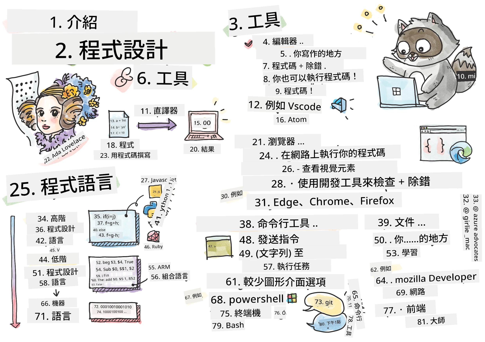
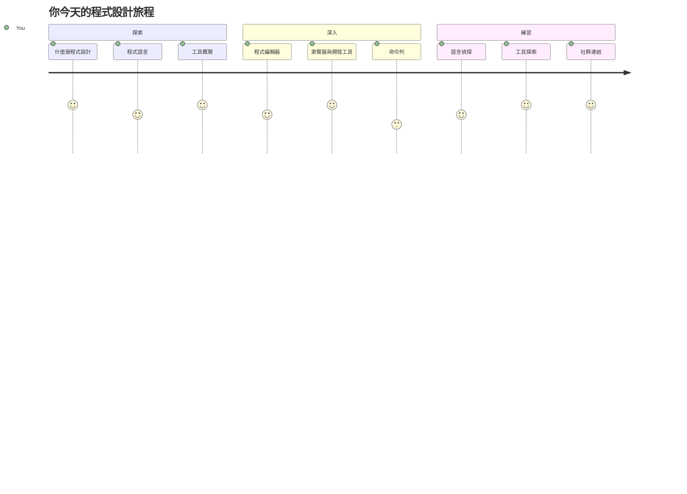
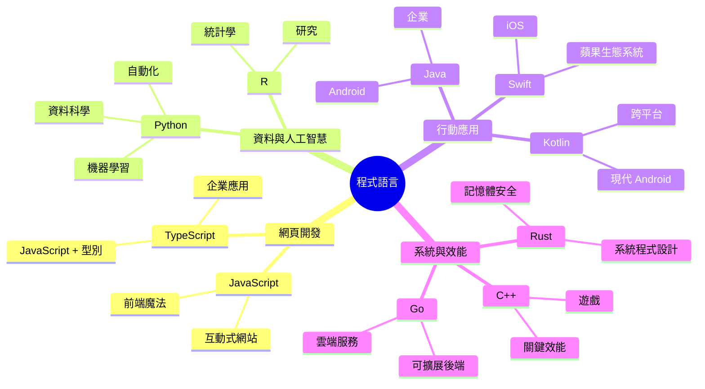
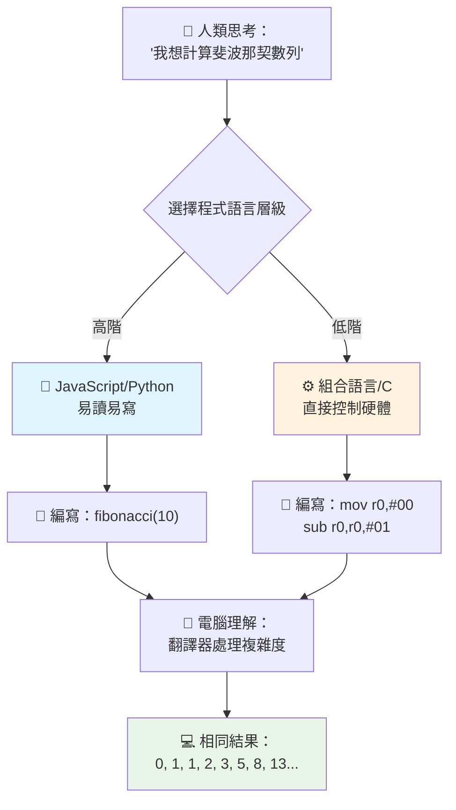
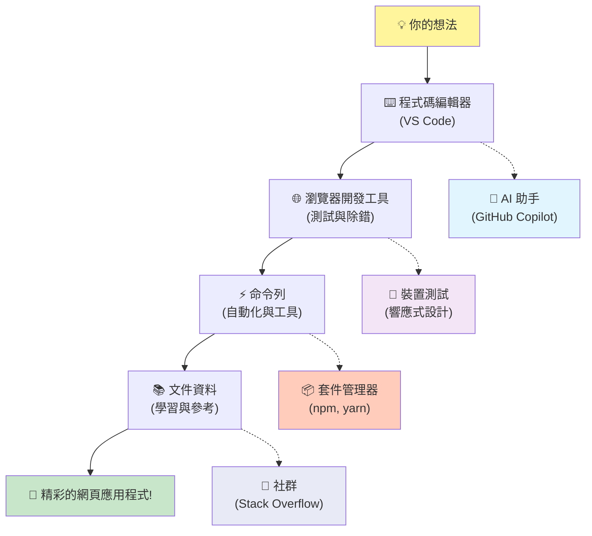
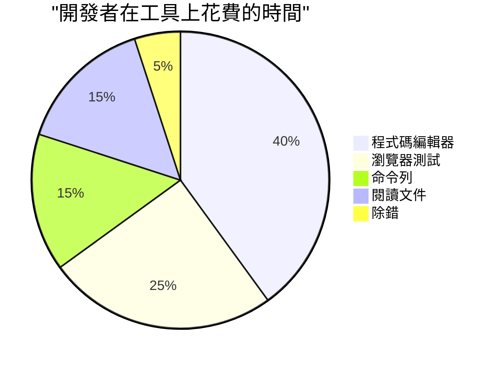
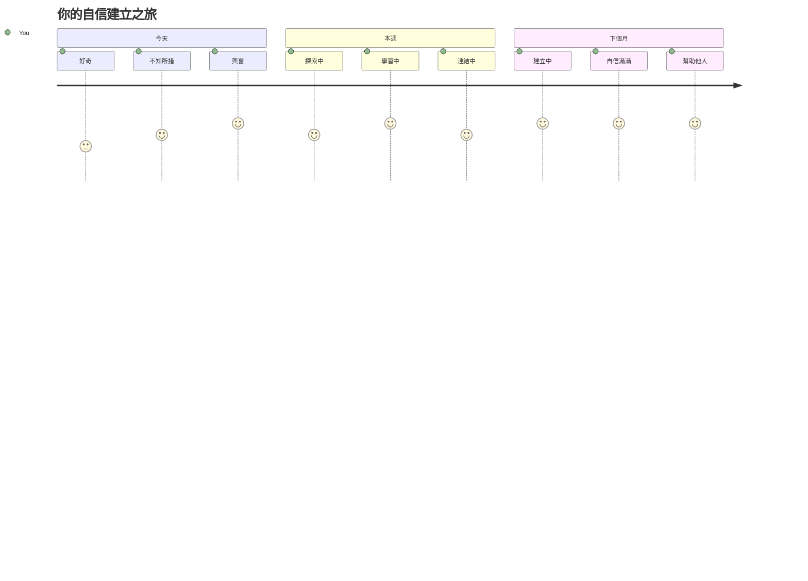

# 程式語言與現代開發工具介紹

嗨，未來的開發者！👋 我可以跟你分享一件每天都讓我起雞皮疙瘩的事嗎？你即將發現，程式設計不只是關於電腦——它是擁有真實超能力，讓你最狂野的點子成真的力量！

你知道那種使用你最愛的 app，所有東西完美契合的瞬間嗎？當你輕觸一個按鈕，神奇的事發生了，讓你驚呼「哇，他們到底怎麼做到的？」其實，正是像你這樣的人——可能坐在最愛的咖啡廳裡凌晨兩點，喝著第三杯濃縮咖啡——寫出讓魔法成真的程式碼。接下來要讓你震撼的是：在這堂課結束時，你不僅會了解他們是怎麼做的，還會迫不及待想自己試試看！

說真的，我完全理解如果你現在覺得程式設計很可怕。剛開始時我也以為你一定要是數學天才，或是從五歲就開始寫程式的人才行。但真正改變我想法的是：寫程式就像學一種新語言的對話技巧。你先從「你好」和「謝謝」開始，再進階到點咖啡，最後你就能展開深度的哲學討論！不過這回你跟的是電腦對話，而說真的？它們是你能遇到最有耐心的對話夥伴——永遠不會因為你的錯誤評判你，且總是願意再嘗試！

今天，我們要探索使現代網頁開發不只是可能，而是令人上癮的強大工具。我說的正是那些 Netflix、Spotify 和你最愛的獨立 app 工作室裡，開發者每天都在用的編輯器、瀏覽器和工作流程。還有這個好消息會讓你忍不住跳起舞來：大多數這些專業級、業界標準的工具都是完全免費的！


> 筆記圖由 [Tomomi Imura](https://twitter.com/girlie_mac) 製作


## 讓我們看看你已經知道什麼！

在開始有趣的部分之前，我很好奇—你對這個程式設計世界已經有什麼了解？如果你一看到這些問題就在想「我一點都不了解啊」，那不只沒問題，反而最好！這代表你來對地方了。把這個小測驗當成運動前的暖身，讓我們先暖暖腦袋！

[做課前測驗](https://ff-quizzes.netlify.app/web/)

## 我們即將共同啟程的冒險

好啦，我對今天要探討的內容真心超興奮！說真的，我好想看到你某些概念「點亮」的表情。這段難以置信的旅程裡，我們將一起探索：

- **什麼是程式設計（為什麼它是最酷的東西！）**— 我們會發現程式碼就是那股看不見的魔力，驅動你周遭的一切，從那個不知怎麼知道是週一早上的鬧鐘，到完美分類你 Netflix 推薦的演算法
- <strong>程式語言與它們的驚人氣質</strong>— 想像你走進一場派對，每個人都擁有完全不同的超能力和解決問題的方式。這就是程式語言的世界，而你會愛上和它們見面！
- <strong>構成數位魔法的基本積木</strong>— 把它們想成終極創意的樂高組合。一旦了解這些零件如何結合，你會發現你可以建造任何你想像中的東西
- <strong>讓你感覺像拿到魔法師魔杖的專業工具</strong>— 我沒誇張，這些工具真的會讓你感覺自己有超能力，最棒的是？這些正是專業人士每天都在用的東西！

> 💡 <strong>重點是</strong>：今天不要試圖把所有東西都背起來！我現在只希望你感受到那種可能性的火花。詳細內容會在我們一起練習過程中自然記得——這才是真正的學習！

> 你也可以在 [Microsoft Learn](https://learn.microsoft.com/en-us/learn/modules/web-development-101/introduction-programming/?WT.mc_id=academic-77807-sagibbon) 上學這堂課！


## 那麼什麼是 <em>程式設計</em> 呢？

好啦，讓我們來討論這個價值千萬的問題：真正的程式設計是什麼？

我分享一個徹底改變我觀念的故事。上週我試著教我媽媽如何操作我們的新智能電視遙控器。我發現自己一直說：「按那個紅色按鈕，但不是大紅按鈕，是左邊的小紅按鈕…不，是你另一邊左邊…好了，現在按住兩秒，不是一秒，也不是三秒…」你有沒有聽過這種情況？😅

那就是程式設計！它是給一個非常強大的東西極度詳細且逐步的指令藝術，但必須完全說明清楚。只是你不是在解釋給媽媽（她還會問「哪個紅色按鈕？！」），而是解釋給電腦（它只會照字面指令去做，即使你說的其實不是你想表達的意思）。

當我第一次學到這點時，我被震驚了：電腦本質上其實很簡單。它只懂兩個東西——1 和 0，基本就是「是」和「不是」，或「開」和「關」而已！但神奇的是——我們不需要像電影《駭客任務》裡那樣講 1 和 0。這就是<strong>程式語言</strong>出場的地方。它們像是擁有世界上最好的一位翻譯官，能把你正常的人類想法轉成電腦能理解的語言。

接下來，每天早上醒來時仍讓我起雞皮疙瘩的是：你生活中幾乎所有數位事物，都是從像你一樣的人開始的，可能穿著睡衣，手握咖啡杯，坐在筆電前敲程式碼。那個讓你看起來完美的 Instagram 濾鏡？有人寫了那段程式。帶你聽到新歡歌曲的推薦演算法？有開發者打造了它。幫你和朋友分帳款的 app？誰想這太麻煩了，他們就想「我來解決它」，就這樣做了！

當你學會程式設計，你不只是學到技能——你加入了一個令人難以置信的社群，他們的日常工作就是思考：「如果我能造出某個東西，讓別人一天過得更好一點，那該多棒？」說實話，還有什麼比這更酷的事嗎？

✅ <strong>趣味小搜尋</strong>：有空時查查，世界上的第一位程式設計師是誰？我給你提示：可能不是你想像中的那個！他/她的故事絕對令人著迷，也展現出程式設計自始至終都是關於創意解決問題與跳脫框架思考。

### 🧠 **檢視時間：你的感受如何？**

**花點時間想一想：**
- 現在「給電腦下指令」的想法是否比較明白了？
- 你能想到日常生活中想用程式自動化的任務是什麼嗎？
- 對於這整個程式設計的世界，你有哪些問題正在浮現？

> <strong>記住</strong>：現在覺得某些概念模糊很正常。學程式就像學外語——你的大腦需要時間建立神經迴路。你做得很好！


## 程式語言就像不同口味的魔法

好，這聽起來怪怪的，但請跟我一起想想——程式語言很像不同類型的音樂。想想看：有爵士樂，流暢且即興；搖滾樂，強而有力且直白；古典樂，優雅且結構嚴謹；還有嘻哈，創意豐富且富表現力。每種風格都有自己的氣氛，自己的熱情粉絲社群，而且各適合不同的心情和場合。

程式語言也是這樣！你不會用同一種語言去寫一款有趣的手機遊戲，又用它來計算龐大的氣候資料，就像你不會在瑜伽課放死亡金屬（好吧，大多數瑜伽課不會 😄）。

但每次想到這點，我都覺得超震撼：這些語言就像有世界上最有耐心、最聰明的口譯員坐在你旁邊。你可以用很自然的人類思維來表達想法，它則會處理所有超複雜的工作，翻譯成電腦能懂的 1 和 0。就像有個朋友，雙語能力超強，既通「人類創意」，又懂「電腦邏輯」——而且他永遠不會累、不需喝咖啡休息，也不會因你問同一個問題兩次而生氣！

### 受歡迎的程式語言與用途


| 語言 | 最適合 | 為什麼受歡迎 |
|----------|----------|------------------|
| **JavaScript** | 網頁開發，使用者介面 | 可在瀏覽器執行，驅動互動式網站 |
| **Python** | 資料科學，自動化，人工智慧 | 容易閱讀學習，擁有強大函式庫 |
| **Java** | 企業應用，Android 應用 | 平台獨立，大型系統強健 |
| **C#** | Windows 應用，遊戲開發 | 微軟生態系統支援強 |
| **Go** | 雲端服務，後端系統 | 速度快、簡單，針對現代運算設計 |

### 高階語言與低階語言差異

說實話，這是我第一次學程式時，最讓我頭痛的概念，所以我想分享一個讓我真正理解的比喻——我也希望對你有幫助！

想像你去一個不會說當地語言的國家，你非常急著找廁所（大家都有這種經驗吧？😅）：

- <strong>低階程式設計</strong> 就像你學會當地方言，連在街角賣水果的老奶奶說的文化典故、俚語和只有當地人懂的笑話都會聊。超厲害又有效率……如果你真的流利啦！但當你只是想找廁所時，這有點太多了。

- <strong>高階程式設計</strong> 就像你有那位超棒的當地朋友幫忙。你用英語說「我需要找廁所」，他幫你處理文化差異，然後用簡單你能理解的方式給方向。

用程式語言說：
- <strong>低階語言</strong>（像組合語言或 C）讓你跟電腦的硬體直接溝通，但你必須用機器式思考……嗯，有點心理轉換大挑戰。
- <strong>高階語言</strong>（像 JavaScript、Python 或 C#）讓你用人類思維寫程式，它們幕後處理所有機器語言。還有，它們擁有非常熱情的社群，大家都記得剛開始學的感覺，且真心樂意幫助新人！

你猜我會建議你從哪種語言開始呢？😉 高階語言就像有訓練輪一樣，讓整個體驗既有趣又順暢，你甚至都不想摘掉它！


### 讓我來示範高階語言為何這麼友善

好，我要示範一個讓我愛上高階語言的程式範例，但首先——你得答應我一件事。當你看到第一個程式碼示範時，別害怕！它故意看起來嚇人。這就是我要說的重點！

我們將看完全相同的任務，用兩種完全不同的風格寫成。任務是用程式產生所謂的費氏數列——這是一個美麗的數學模式，每一個數字都是前兩個數字的和：0、1、1、2、3、5、8、13...(趣味小知識：這個模式會在自然界隨處可見——像是向日葵種子螺旋、松果圖案，甚至星系的形成！)

準備好了嗎？我們開始吧！

**高階語言（JavaScript）—人類友善：**

```javascript
// 第 1 步：基本斐波那契設置
const fibonacciCount = 10;
let current = 0;
let next = 1;

console.log('Fibonacci sequence:');
```

**這段程式碼做了什麼：**
- <strong>宣告</strong>一個常數指定我們要產生多少個費氏數字
- <strong>初始化</strong>兩個變數追蹤目前與下一個數字
- <strong>設定</strong>起始值（0 和 1），這是費氏數列的定義
- <strong>顯示</strong>標題訊息識別輸出結果

```javascript
// 步驟 2：使用迴圈產生序列
for (let i = 0; i < fibonacciCount; i++) {
  console.log(`Position ${i + 1}: ${current}`);
  
  // 計算序列中的下一個數字
  const sum = current + next;
  current = next;
  next = sum;
}
```

**逐步解說：**
- 使用 `for` 迴圈<strong>巡訪</strong>序列中每個位置
- 使用模板字串<strong>顯示</strong>每個數字及其位置
- <strong>計算</strong>下一個費氏數字為目前數字與下一個數字的總和
- <strong>更新</strong>追蹤變數，進到下一次迭代

```javascript
// 步驟3：現代函數式方法
const generateFibonacci = (count) => {
  const sequence = [0, 1];
  
  for (let i = 2; i < count; i++) {
    sequence[i] = sequence[i - 1] + sequence[i - 2];
  }
  
  return sequence;
};

// 使用範例
const fibSequence = generateFibonacci(10);
console.log(fibSequence);
```

**上面，我們：**
- 使用現代箭頭函式語法<strong>建立</strong>可重複使用的函式
- <strong>建立</strong>陣列儲存完整數列，而非逐一輸出
- 透過陣列索引<strong>計算</strong>每個新數字
- 把完整數列<strong>回傳</strong>，方便程式其他地方使用

**低階語言（ARM 組合語言）—電腦友善：**

```assembly
 area ascen,code,readonly
 entry
 code32
 adr r0,thumb+1
 bx r0
 code16
thumb
 mov r0,#00
 sub r0,r0,#01
 mov r1,#01
 mov r4,#10
 ldr r2,=0x40000000
back add r0,r1
 str r0,[r2]
 add r2,#04
 mov r3,r0
 mov r0,r1
 mov r1,r3
 sub r4,#01
 cmp r4,#00
 bne back
 end
```

你可以看到 JavaScript 版本讀起來幾乎像英文指令，而組合語言則用晦澀的命令直接控制電腦的處理器。兩者完成相同任務，但高階語言更容易讓人讀懂、撰寫和維護。

**主要差異你會發現的是：**
- <strong>可讀性</strong>：JavaScript 使用像 `fibonacciCount` 這樣描述性名稱，而組合語言使用像 `r0`、`r1` 這樣的神秘標籤
- <strong>註解</strong>：高階語言鼓勵解釋性註解，使程式碼具備自我說明能力
- <strong>結構</strong>：JavaScript 的邏輯流程符合人類逐步思考問題的方式
- <strong>維護性</strong>：根據不同需求更新 JavaScript 版本既直接又清晰

✅ <strong>關於費波那契數列</strong>：這個絕美的數字排列（每個數字等於前兩個數之和：0、1、1、2、3、5、8……）幾乎在自然界的<em>每個角落</em>都能找到！你會在向日葵的螺旋、松果的排列、鹦鹉螺的螺旋曲線，甚至樹枝的生長方式中看到它。數學與程式碼竟然能幫助我們理解並重現自然創造美的模式，真是令人震撼！


## 創造魔法的基本元素

好啦，現在你已經看到程式語言的實際運作方式，讓我們拆解組成每個程式最基本的元素。把它們想成你最愛食譜中的關鍵材料 — 一旦知道每個材料的用途，你就能閱讀和撰寫任何語言的程式碼了！

這有點像學習程式語言的文法。還記得在學校學過名詞、動詞以及如何組成句子嗎？程式設計也有自己的文法，老實說，它比英文文法還要邏輯且寬容得多！😄

### 陳述句：逐步指令

先從 <strong>陳述句</strong> 開始 — 它們就像你和電腦對話中的獨立句子。每個陳述句告訴電腦做一件特定的事，就像給方向：「這裡左轉」、「紅燈停」、「停在那個位子」。

我喜歡陳述句的地方是它們通常很容易閱讀。看這個範例：

```javascript
// 執行單一步驟的基本敘述
const userName = "Alex";                    
console.log("Hello, world!");              
const sum = 5 + 3;                         
```

**這段程式碼做了什麼：**
- <strong>宣告</strong>一個常數變數存放使用者名稱
- <strong>輸出</strong>一則問候消息到主控台
- <strong>計算</strong>並儲存一個數學運算的結果

```javascript
// 與網頁互動的語句
document.title = "My Awesome Website";      
document.body.style.backgroundColor = "lightblue";
```

**逐步來看這段程式：**
- <strong>修改</strong>瀏覽器分頁中顯示的頁面標題
- <strong>改變</strong>整個頁面主體的背景顏色

### 變數：你的程式記憶系統

好啦，<strong>變數</strong>說實話是我最愛教的概念之一，因為它們實在太像你每天生活中會用到的東西了！

想想你的手機通訊錄，你不會記得每個人的電話號碼 — 你會儲存「媽媽」、「摯友」或「外送到凌晨2點的披薩店」，讓手機記住真實號碼。變數就是一樣的東西！它們就像標籤容器，你的程式可以把資訊存在裡面，再用合理的名稱去取得。

更棒的是：變數可以隨著程式執行而改變（這也是為什麼叫做「變數」——你看到了嗎？）。就好比你發現更棒的披薩店後更新聯絡方式一樣，變數能隨著程式取得新資訊或情況改變而更新！

讓我示範這有多麼簡單：

```javascript
// 第一步：建立基本變數
const siteName = "Weather Dashboard";        
let currentWeather = "sunny";               
let temperature = 75;                       
let isRaining = false;                      
```

**理解這些概念：**
- <strong>用</strong> `const` 變數儲存不變的值（如網站名稱）
- <strong>用</strong> `let` 變數儲存程式中可能會變動的值
- <strong>指派</strong>不同的數據類型：字串（文字）、數字，以及布林值（true/false）
- <strong>選擇</strong>有描述性的名稱，來說明每個變數儲存什麼

```javascript
// 步驟2：使用物件來組合相關的資料
const weatherData = {                       
  location: "San Francisco",
  humidity: 65,
  windSpeed: 12
};
```

**以上我們做了什麼：**
- <strong>建立</strong>一個物件，來把相關的天氣資訊組合在一起
- <strong>將</strong>多筆資料組織於同一個變數名稱下
- <strong>用</strong>鍵值對標籤每筆資訊，使其清晰明瞭

```javascript
// 第三步：使用和更新變數
console.log(`${siteName}: Today is ${currentWeather} and ${temperature}°F`);
console.log(`Wind speed: ${weatherData.windSpeed} mph`);

// 更新可變變數
currentWeather = "cloudy";                  
temperature = 68;                          
```

**來理解每部分：**
- <strong>用</strong>模板字串語法`${}`輸出資訊
- <strong>用</strong>點符號存取物件屬性（`weatherData.windSpeed`）
- <strong>更新</strong>用 `let` 宣告的變數以反映變化的狀況
- <strong>結合</strong>多個變數生成有意義的訊息

```javascript
// 第4步：使用現代解構賦值來讓程式碼更簡潔
const { location, humidity } = weatherData; 
console.log(`${location} humidity: ${humidity}%`);
```

**你需要知道：**
- <strong>用</strong>解構賦值从物件中提取特定屬性
- <strong>自動</strong>依物件鍵名創建同名變數
- <strong>簡化</strong>程式，避免重複使用點符號

### 控制流程：教你的程式如何思考

這部分讓程式設計真的讓人驚嘆不已！<strong>控制流程</strong>基本上就是教你的程式如何做出聰明的決策，就像你每天自然而然做的那樣。

想像一下：今天早上你可能遇過「如果下雨，我會帶傘；如果很冷，我會穿外套；如果遲到，我會跳過早餐並帶杯咖啡」的狀況。你的大腦每天會自動執行好多次這種 if-then（如果-則）邏輯！

這就是讓程式變得智能、活靈活現的關鍵，不只是死板執行固定腳本。它們其實能觀察狀況、評估情況，做出合適反應。就像給程式一個能夠適應和做決策的大腦！

想看看這怎麼完美實現嗎？跟我來：

```javascript
// 第一步：基本條件邏輯
const userAge = 17;

if (userAge >= 18) {
  console.log("You can vote!");
} else {
  const yearsToWait = 18 - userAge;
  console.log(`You'll be able to vote in ${yearsToWait} year(s).`);
}
```

**這段程式碼做了什麼：**
- <strong>檢查</strong>使用者年齡是否達投票資格
- <strong>根據條件</strong>執行不同的程式區塊
- <strong>計算</strong>並顯示還要多久才可投票（如果未滿18）
- <strong>為</strong>每種情況提供具體且有幫助的回饋

```javascript
// 步驟 2：使用邏輯運算子的多重條件
const userAge = 17;
const hasPermission = true;

if (userAge >= 18 && hasPermission) {
  console.log("Access granted: You can enter the venue.");
} else if (userAge >= 16) {
  console.log("You need parent permission to enter.");
} else {
  console.log("Sorry, you must be at least 16 years old.");
}
```

**這裡的結構拆解：**
- <strong>用</strong> `&&`（且）符號結合多個條件
- <strong>用</strong> `else if` 建立多層條件判斷結構
- <strong>用</strong>最後的 `else` 處理所有其他可能情况
- <strong>提供</strong>每種不同狀況清晰且具體的反饋訊息

```javascript
// 第 3 步：使用三元運算符的簡潔條件判斷
const votingStatus = userAge >= 18 ? "Can vote" : "Cannot vote yet";
console.log(`Status: ${votingStatus}`);
```

**你該記住的是：**
- <strong>使用</strong>三元運算子 (`? :`) 處理兩種情況的簡單判斷
- <strong>先寫</strong>判斷條件，接著 `?`，再寫真值結果，最後 `:` 和假值結果
- <strong>當你需要</strong>根據條件賦值時，這個寫法非常實用

```javascript
// 第4步：處理多個特定情況
const dayOfWeek = "Tuesday";

switch (dayOfWeek) {
  case "Monday":
  case "Tuesday":
  case "Wednesday":
  case "Thursday":
  case "Friday":
    console.log("It's a weekday - time to work!");
    break;
  case "Saturday":
  case "Sunday":
    console.log("It's the weekend - time to relax!");
    break;
  default:
    console.log("Invalid day of the week");
}
```

**這段程式實現了：**
- <strong>把</strong>變數的值與多個特定案例比對
- <strong>將</strong>類似案例分組（平日 vs 週末）
- <strong>命中</strong>匹配案例時執行相對應程式區塊
- <strong>用</strong> `default` 處理非預期值
- <strong>使用</strong> `break` 避免程式繼續執行下一案例

> 💡 <strong>現實比喻</strong>：把控制流程想成世界上最有耐心的GPS導航。它會說「如果主街塞車，就走高速公路；如果高速公路施工，試試風景路線。」程式用完全相同的條件邏輯聰明應對不同狀況，永遠給用戶最佳體驗。

### 🎯 **概念檢核：理解基礎元素**

**讓我們看看你對基礎元素的掌握：**
- 你能用自己的話解釋變數與陳述句有何不同嗎？
- 想想你日常生活中會用到 if-then 判斷的例子（像投票資格）
- 有沒有哪個程式邏輯讓你感到特別驚喜？

**小小信心加油站：**

✅ <strong>接下來我們會</strong>：一起深入挖掘這些概念，享受這段難以置信的學習旅程！現在先聚焦於對未來所有精彩可能性感到興奮。具體技能和技巧會隨著實作自然牢固 — 我承諾這過程比你想像中更有趣！

## 不可或缺的工具

老實說，這部分讓我激動得幾乎坐不住了！🚀 我們即將談論那些讓你感覺彷彿拿到數位太空船鑰匙的超讚工具。

你知道廚師為什麼有那種平衡完美的刀，感覺就像他們手的一部分嗎？音樂家為什麼有一把吉他，簡直一碰就能發聲歌唱？開發者也有類似魔法工具，接下來會介紹的這些，絕大多數都是免費的，保證讓你驚掉下巴！

我坐在椅子上都快跳起來了，迫不及待想跟你分享這些，它們徹底改變了我們寫軟體的方式。像是用人工智慧幫你寫程式碼的助理（真的不是開玩笑！）、可以從有無線網路的任何地方建置整套應用程式的雲端環境，以及超高級的除錯工具，彷彿擁有程式的X光視覺。

最酷的是：這些可不只是新手用完就不用的工具，而是 Google、Netflix、你愛的獨立工作室，現今全世界開發者同時在用的專業級利器。用它們你會感覺自己專業度飆升！


### 程式碼編輯器和整合開發環境：你的新數位好伙伴

現在我們談談程式碼編輯器 — 它們即將成為你最喜歡待的地方！想像成你專屬的程式碼聖地，大部分時間都會在這裡創造與雕琢你的數位作品。

現代編輯器的魔力在於：它們絕不只是華麗的文字編輯器，而是像有個才華洋溢、24/7隨時在旁支持你的導師。它們會在你發現錯誤前就捕捉到、建議令你看起來超棒的改善，幫助你掌握每行程式的意義，部分甚至能預測你接下來要輸入什麼，主動幫你完成思緒！

我記得第一次體驗自動完成功能那感覺，簡直像活在未來。你敲字母，它就問：「你是不是想用這函數，它正好能做到你想的事？」感覺像有讀心術的程式碼夥伴！

**這些編輯器有多厲害？**

現代程式碼編輯器擁有提升效率的多種強大功能：

| 功能 | 作用 | 好處 |
|---------|--------------|--------------|
| <strong>語法高亮</strong> | 為程式碼不同部分染色 | 讓程式碼更容易閱讀並發現錯誤 |
| <strong>自動完成</strong> | 輸入時建議代碼 | 加快編碼速度並減少打字錯誤 |
| <strong>除錯工具</strong> | 幫助你找到並修正錯誤 | 節省大量排除問題的時間 |
| <strong>擴充套件</strong> | 新增專門功能 | 任意技術自訂你的編輯器 |
| **AI 助手** | 建議程式碼和解釋 | 加速學習與生產力 |

> 🎥 <strong>影片資源</strong>：想看這些工具如何運作？快看這支 [Tools of the Trade video](https://youtube.com/watch?v=69WJeXGBdxg) 做個全面介紹。

#### 推薦給網頁開發的編輯器

**[Visual Studio Code](https://code.visualstudio.com/?WT.mc_id=academic-77807-sagibbon)**（免費）
- 網頁開發者中最受歡迎
- 擴充套件生態系豐富
- 內建終端與 Git 功能整合
- <strong>必裝擴充套件</strong>：
  - [GitHub Copilot](https://marketplace.visualstudio.com/items?itemName=GitHub.copilot) - AI 智能程式碼建議
  - [Live Share](https://marketplace.visualstudio.com/items?itemName=MS-vsliveshare.vsliveshare) - 實時協作
  - [Prettier](https://marketplace.visualstudio.com/items?itemName=esbenp.prettier-vscode) - 自動格式化程式碼
  - [Code Spell Checker](https://marketplace.visualstudio.com/items?itemName=streetsidesoftware.code-spell-checker) - 偵測拼寫錯誤

**[JetBrains WebStorm](https://www.jetbrains.com/webstorm/)**（付費，學生免費）
- 高級除錯與測試工具
- 智慧型程式碼自動完成
- 內建版本控制

**雲端 IDE**（價格各異）
- [GitHub Codespaces](https://github.com/features/codespaces) - 瀏覽器內完整 VS Code 體驗
- [Replit](https://replit.com/) - 適合學習及分享程式碼
- [StackBlitz](https://stackblitz.com/) - 即時全端網頁開發

> 💡 <strong>入門小建議</strong>：從 Visual Studio Code 開始 — 免費，業界廣泛使用，社群龐大，教學與擴充功能豐富。


### 網頁瀏覽器：你的秘密開發實驗室

準備好讓你的腦袋炸裂吧！你知道你一直用瀏覽器瀏覽社群媒體、看影片吧？其實這些瀏覽器一直藏著一個驚人的秘密開發實驗室，就等你來發現！

每次你在網頁點右鍵選「檢查元素」，你就在打開一個隱藏的開發者工具世界，功能強大到比我以前花大錢買過的專業軟體還強。這就像發現你家的廚房後面竟設有專業大廚實驗室的祕密通道！
第一次有人向我展示瀏覽器 DevTools 時，我花了大約三個小時不停地點擊，驚呼「等等，它竟然還能這樣？！」你真的能即時編輯任何網站，精確看到所有資源載入的速度，測試你網站在不同設備上的顯示效果，甚至像專家一樣除錯 JavaScript。這簡直令人難以置信！

**這就是瀏覽器成為你秘密武器的原因：**

當你建立網站或網頁應用程式時，你需要看到它在現實世界中的呈現與行為。瀏覽器不只展示你的成果，更提供有關效能、無障礙性及潛在問題的詳細反饋。

#### 瀏覽器開發者工具（DevTools）

現代瀏覽器包含完善的開發套件：

| 工具類別 | 功能說明 | 範例應用 |
|----------|----------|----------|
| <strong>元素檢查器</strong> | 即時查看及編輯 HTML/CSS | 調整樣式並立即看到效果 |
| <strong>主控台</strong> | 查看錯誤訊息並測試 JavaScript | 除錯問題及嘗試程式碼 |
| <strong>網路監控</strong> | 追蹤資源載入狀況 | 優化效能和載入速度 |
| <strong>無障礙檢查器</strong> | 測試包容性設計 | 確保網站適用所有使用者 |
| <strong>裝置模擬器</strong> | 預覽不同螢幕尺寸 | 不需多台裝置也能測試響應式設計 |

#### 推薦發展用瀏覽器

- **[Chrome](https://developers.google.com/web/tools/chrome-devtools/)** — 業界標準 DevTools，擁有豐富文件資源
- **[Firefox](https://developer.mozilla.org/docs/Tools)** — 出色的 CSS Grid 與無障礙工具
- **[Edge](https://docs.microsoft.com/microsoft-edge/devtools-guide-chromium/?WT.mc_id=academic-77807-sagibbon)** — 基於 Chromium，搭配微軟專屬開發資源

> ⚠️ <strong>重要測試提示</strong>：請務必在多款瀏覽器中測試你的網站！Chrome 表現完美的內容，在 Safari 或 Firefox 可能會截然不同。專業開發者會跨所有主流瀏覽器測試，以確保使用者體驗一致。


### 命令列工具：開啟開發者超能力的入口

好啦，關於命令列，我想跟你誠實分享一個心聲，來自一位真心了解它的人。當我第一次看到命令列——那黑框閃爍的文字時——我真的想，「不行，完全不行！這活像1980年代駭客電影的場景，我絕對不夠聰明來用這玩意！」😅

但我希望當時有人跟我說，也就是我現在想告訴你的：命令列並不可怕——它其實就像跟你的電腦直接對話。你可以把它想像成，用漂亮介面附帶圖片與選單點餐（很方便）和走進你最愛的在地餐廳，廚師聽你一句「驚喜推薦」就能做出完美料理的差別。

命令列就是讓開發者感覺自己像超級法師的地方。你輸入幾個看起來像魔法的字（好啦，只是指令，但確實感覺超神奇），按下 Enter，砰——你可能創建了整個專案架構，安裝了來自世界各地的強大工具，或將你的應用部署到網路上，讓全世界看到。一旦嘗到這種力量，真的會讓人上癮！

**為什麼命令列會成為你最愛的工具：**

雖然圖形介面很適合多數工作，但命令列在自動化、精準度和速度上表現卓越。很多開發工具主要透過命令列介面運作，學會高效使用它們能大幅提升你的生產力。

```bash
# 第一步：創建並進入專案目錄
mkdir my-awesome-website
cd my-awesome-website
```

**這段程式碼的作用是：**
- <strong>建立</strong> 一個名為 "my-awesome-website" 的新資料夾作為專案目錄
- <strong>進入</strong> 新建的目錄開始工作

```bash
# 第 2 步：使用 package.json 初始化專案
npm init -y

# 安裝現代開發工具
npm install --save-dev vite prettier eslint
npm install --save-dev @eslint/js
```

**逐步說明這裡發生的事：**
- 使用 `npm init -y` <strong>初始化</strong> 新的 Node.js 專案並採用預設設定
- <strong>安裝</strong> Vite 作為快速開發和生產部署的現代建構工具
- <strong>加入</strong> Prettier 自動格式化和 ESLint 程式碼品質檢查
- 使用 `--save-dev` 標記這些套件為開發時依賴

```bash
# 第3步：建立專案結構與檔案
mkdir src assets
echo '<!DOCTYPE html><html><head><title>My Site</title></head><body><h1>Hello World</h1></body></html>' > index.html

# 啟動開發伺服器
npx vite
```

**在上述步驟中，我們：**
- <strong>規劃</strong> 專案結構，分別建立原始碼與資源資料夾
- <strong>產生</strong> 基本的 HTML 檔案，包含完整文件結構
- <strong>啟動</strong> Vite 開發伺服器，實現熱重載和模組熱替換

#### 網頁開發必備命令列工具

| 工具 | 用途 | 你需要它的理由 |
|------|-------|-----------------|
| **[Git](https://git-scm.com/)** | 版本控制 | 追蹤變更、多人協作、備份工作 |
| **[Node.js & npm](https://nodejs.org/)** | JavaScript 執行環境與套件管理 | 在瀏覽器外執行 JavaScript、安裝現代開發工具 |
| **[Vite](https://vitejs.dev/)** | 建構工具與開發伺服器 | 極速開發，支援熱模組替換 |
| **[ESLint](https://eslint.org/)** | 程式碼品質 | 自動找出並修復 JavaScript 問題 |
| **[Prettier](https://prettier.io/)** | 程式碼格式化 | 保持程式碼格式統一與可讀性 |

#### 平台特定選項

**Windows：**
- **[Windows Terminal](https://docs.microsoft.com/windows/terminal/?WT.mc_id=academic-77807-sagibbon)** — 現代且功能豐富的終端機
- **[PowerShell](https://docs.microsoft.com/powershell/?WT.mc_id=academic-77807-sagibbon)** 💻 — 強大腳本環境
- **[Command Prompt](https://learn.microsoft.com/windows-server/administration/windows-commands/windows-commands)** 💻 — 傳統命令提示字元

**macOS：**
- **[Terminal](https://support.apple.com/guide/terminal/)** 💻 — 內建終端機應用程式
- **[iTerm2](https://iterm2.com/)** — 擁有更多進階功能的終端機

**Linux：**
- **[Bash](https://www.gnu.org/software/bash/)** 💻 — 標準 Linux shell
- **[KDE Konsole](https://docs.kde.org/trunk5/en/konsole/konsole/index.html)** — 進階終端機模擬器

> 💻 = 作業系統預裝

> 🎯 <strong>學習路徑</strong>：從基本指令開始，如 `cd`（切換目錄）、`ls` 或 `dir`（列出檔案）、`mkdir`（建立資料夾）。練習現代工作流程常用指令，例如 `npm install`、`git status`、`code .`（在 VS Code 開啟目前資料夾）。隨著熟練度提升，自然會掌握更多高級指令和自動化技巧。


### 文件：隨時待命的學習良師

好吧，讓我分享一個小秘密，它會讓你作為初學者心情好很多：即使是最有經驗的開發者，也花很多時間閱讀文件。這不是因為他們不知道怎麼做，而是智慧的表現！

把文件當作全天候提供指導的最耐心、最博學的老師。凌晨兩點卡關？文件像溫暖的虛擬擁抱，給你準確解答。想了解大家都在討論的酷新功能？文件有逐步說明。試著搞懂為什麼某些東西會這樣運作？沒錯，文件能以讓你終於理解的方式解釋！

改變我觀念的是：網頁開發領域變化極快，沒有人（真的沒有人！）能把所有東西背得滾瓜爛熟。我親眼看過有 15 年資深開發者查語法，你猜怎樣？這不丟臉，反而是聰明！記憶力不是重點，重點是知道去哪找可靠答案，並理解如何運用它們。

**真正的魔力在這裡：**

專業開發者花大量時間看文件，不是因為沒智慧，而是因為網頁開發環境持續演進，保持最新需要不斷學習。優秀文件不只教你「怎麼用」，還告訴你「為什麼用」和「何時用」。

#### 必備文件資源

**[Mozilla Developer Network (MDN)](https://developer.mozilla.org/docs/Web)**
- 網頁技術文件的黃金標準
- HTML、CSS、JavaScript 的詳盡指南
- 包含瀏覽器相容性資訊
- 附帶實用範例與互動示範

**[Web.dev](https://web.dev)**（Google 提供）
- 現代網頁開發最佳實務
- 效能優化指南
- 無障礙與包容設計原則
- 真實專案案例研究

**[Microsoft Developer Documentation](https://docs.microsoft.com/microsoft-edge/#microsoft-edge-for-developers)**
- Edge 瀏覽器開發資源
- 漸進式網頁應用指南
- 跨平台開發見解

**[Frontend Masters Learning Paths](https://frontendmasters.com/learn/)**
- 結構化學習課程
- 業界專家影片教學
- 實戰練習題目

> 📚 <strong>學習策略</strong>：不要死記文件內容，而是學會高效導航。收藏常用參考，練習利用搜尋功能快速找到關鍵資訊。

### 🔧 **工具熟練度檢視：什麼讓你心動？**

**停下來想想：**
- 哪個工具是你最想先嘗試的？（答案沒有對錯！）
- 命令列還感覺令人畏懼，還是你開始好奇了？
- 你能想像用瀏覽器 DevTools 偷偷看你最愛網站的背後祕密嗎？


> <strong>有趣觀察</strong>：大多數開發者約花 40% 時間在程式碼編輯器，卻有相當多時間用在測試、學習和問題解決。程式設計不只是寫程式碼——它是打造體驗！

✅ <strong>思考題</strong>：來思考一個有趣問題——你覺得打造網站功能的工具（開發），跟設計它外觀的工具（設計）有什麼不同？就像建築師設計美麗房屋，和承包商實際蓋出來是一回事。兩者都重要，但各自有不同工具箱！這樣的思考能幫助你看見網站誕生的全貌。

## GitHub Copilot Agent 挑戰 🚀

使用 Agent 模式完成以下挑戰：

**說明：** 探索現代程式碼編輯器或 IDE 的功能，展示它如何提升你作為網頁開發者的工作流程。

**提示：** 選擇一款程式碼編輯器或 IDE（例如 Visual Studio Code、WebStorm、或雲端 IDE）。列出三項能幫助你更有效撰寫、除錯或維護程式碼的功能或擴充套件。並簡短說明每項如何優化你的工作流程。

---

## 🚀 挑戰

**好了，偵探，準備好接你的第一個案件了嗎？**

既然你已打好基礎，我有個冒險能讓你認識程式世界的多樣與迷人。聽著——這階段不必寫程式，別壓力大！把自己想像成一位程式語言偵探，在你人生中第一個刺激的案件現場。

**你的任務，如果願意接受：**
1. <strong>成為語言探索者</strong>：選三種來自完全不同世界的程式語言——也許一種做網站的，一種做手機 App 的，還有一種用來做科學計算的。找出相同的簡單任務用這三種語言寫成的例子。我保證你會驚艷它們做同一件事卻長得多不一樣！

2. <strong>挖掘起源故事</strong>：什麼讓各語言獨特？很酷的是，每種程式語言誕生時，設計師都想著：「我該有更好的方式解決這個特定問題。」你能找出那些問題是什麼嗎？有些故事真的很精彩！

3. <strong>遇見社群</strong>：觀察這些語言的社群有多歡迎新手並充滿熱情。有些社群擁有數百萬開發者分享知識、互相幫助，有些則較小而緊密團結。你會喜歡看到這些社群的各種個性！

4. <strong>跟隨直覺</strong>：現在哪個語言對你來說最友善？不用擔心做出「完美」決定——聽聽你的直覺！真心說，這裡沒有錯誤答案，你也能日後再去探索其他語言。

<strong>額外偵探任務</strong>：試著找出哪些大型網站或 App 是用這些語言建構的。我保證你會對 Instagram、Netflix 或那款你停不下來玩的手機遊戲背後的技術震驚不已！

> 💡 <strong>記住</strong>：你今天不需成為任何語言專家，只是在決定要在哪裡落腳之前先認識一下鄰居。慢慢來，玩得開心，讓好奇心引領你！

## 讓我們一起慶祝你的收穫！

天啊，你今天吸收了這麼多超棒的資訊！我真心期待看到你從這趟不可思議的旅程中學到了多少。記得——這不是測驗，不需要完美無缺。這更像是慶祝你剛剛探索這迷人世界的各種酷炫知識！

[進行課後小測驗](https://ff-quizzes.netlify.app/web/)

## 複習與自學

**慢慢探索，開心學習吧！**
你今天學習了很多，這是值得驕傲的事！現在來到最有趣的部分——探索那些引起你好奇心的主題。記住，這不是作業——這是一場冒險！

**更深入探索你感興趣的內容：**

**親身體驗編程語言：**
- 造訪你注意到的2-3個語言的官方網站。每個語言都有其獨特的個性和故事！
- 嘗試一些線上編程平台，如 [CodePen](https://codepen.io/)、[JSFiddle](https://jsfiddle.net/)、或 [Replit](https://replit.com/)。不要害怕嘗試——你不會弄壞任何東西！
- 閱讀你最喜歡的語言是怎麼誕生的。說真的，有些起源故事非常吸引人，能幫助你理解語言為什麼會那樣運作。

**熟悉你的新工具：**
- 如果還沒下載 Visual Studio Code，趕快下載吧——它是免費的，你會愛上它的！
- 花幾分鐘瀏覽擴充套件商店。它就像你的程式碼編輯器的應用程式商店！
- 打開瀏覽器的開發者工具，隨意點點看。不用擔心是否能全懂——先熟悉它的介面就好。

**加入社群：**
- 追蹤一些開發者社群，如 [Dev.to](https://dev.to/)、[Stack Overflow](https://stackoverflow.com/)、或 [GitHub](https://github.com/)。程式設計社群對新手非常友善！
- 在 YouTube 上觀看幾個適合初學者的程式教學影片。很多優秀的創作者都記得剛開始時的心情。
- 考慮加入當地聚會或線上社群。相信我，開發者很樂意幫助新手！

> 🎯 **聽我說，請記得**：沒有人會期望你一夜之間變成程式高手！現在你只是在認識這個你即將成為一部分的神奇新世界。慢慢來，享受這段旅程，並且記住——你敬佩的每一位開發者，都曾經坐在和你現在一樣的位置，滿心期待，也許還有點手忙腳亂。這很正常，代表你在正確的道路上！


## 作業

[Reading the Docs](assignment.md)

> 💡 <strong>關於你的作業的小提醒</strong>：我非常希望你去探索一些我們還沒介紹過的工具！跳過我們已經討論過的編輯器、瀏覽器和命令列工具——這個世界中有無數驚人的開發工具正等著你去發現。找那些仍積極維護，並且有活躍、樂於助人的社群的工具（這類工具通常有最棒的教學，也有最多人在你卡關時伸出援手）。

---

## 🚀 你的程式學習時間表

### ⚡ **接下來 5 分鐘你可以做的事**
- [ ] 書籤2-3個吸引你的程式語言官方網站
- [ ] 如果還沒下載，立即下載 Visual Studio Code
- [ ] 打開瀏覽器的 DevTools（F12），隨意點擊任何網站
- [ ] 加入一個程式社群（Dev.to、Reddit r/webdev，或 Stack Overflow）

### ⏰ <strong>接下來一小時你可以完成的事</strong>
- [ ] 完成課後測驗並反思你的答案
- [ ] 安裝 GitHub Copilot 擴充套件到 VS Code
- [ ] 在線上嘗試用兩種不同程式語言寫一個「Hello World」範例
- [ ] 在 YouTube 上觀看一個「開發者的一天」影片
- [ ] 開始你的程式語言偵探工作（來自挑戰題）

### 📅 <strong>接下來一週的冒險</strong>
- [ ] 完成作業並探索3種新開發工具
- [ ] 追蹤5位開發者或程式帳號的社交媒體
- [ ] 在 CodePen 或 Replit 嘗試做點小作品（甚至只是一個「Hello, [你的名字]！」）
- [ ] 閱讀一篇關於某人編程旅程的開發者部落格文章
- [ ] 加入一場線上聚會或觀看一次程式講座
- [ ] 用線上教學開始學習你選擇的程式語言

### 🗓️ <strong>接下來一個月的蛻變</strong>
- [ ] 建立你的第一個小專案（即使是簡單的網頁也算！）
- [ ] 貢獻開源專案（可以從修正文檔開始）
- [ ] 指導一位剛開始程式旅程的新手
- [ ] 建立你的開發者作品集網站
- [ ] 與當地開發者社群或讀書會連結
- [ ] 開始規劃你的下一個學習里程碑

### 🎯 <strong>最後的反思檢查</strong>

**在繼續前，花點時間慶祝一下：**
- 今天程式設計中，什麼事最讓你興奮？
- 你最想先探索哪個工具或概念？
- 關於開始這趟程式之旅，你感覺如何？
- 你現在最想問開發者的一個問題是什麼？


> 🌟 <strong>記住</strong>：每位專家曾經都是初學者。每位資深開發者都曾像你現在一樣感到興奮，或許還有些手忙腳亂，當然也好奇未來的可能性。你正處在一群了不起的夥伴中，這趟旅程將會非常精彩。歡迎來到美妙的程式世界！🎉

---

<!-- CO-OP TRANSLATOR DISCLAIMER START -->
**免責聲明**：  
本文件經由 AI 翻譯服務 [Co-op Translator](https://github.com/Azure/co-op-translator) 進行翻譯。雖然我們力求準確，但請注意自動翻譯可能包含錯誤或不準確之處。原始文件的原文版本應視為權威來源。對於重要資訊，建議尋求專業人員之人工翻譯。我們不對因使用本翻譯而產生的任何誤解或誤譯負責。
<!-- CO-OP TRANSLATOR DISCLAIMER END -->