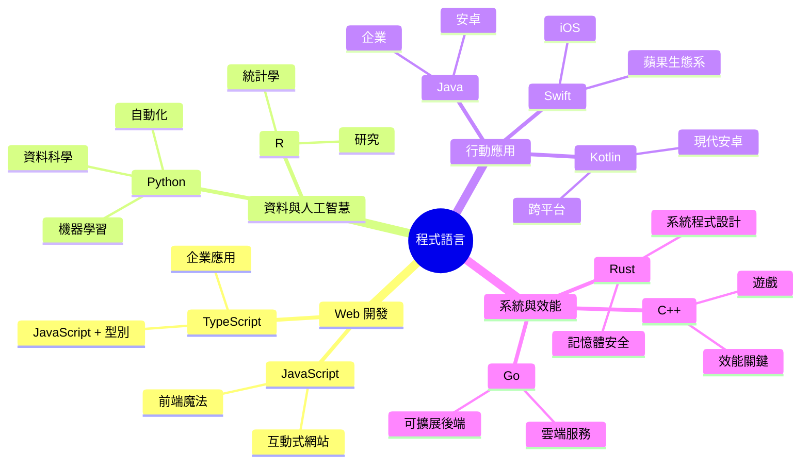
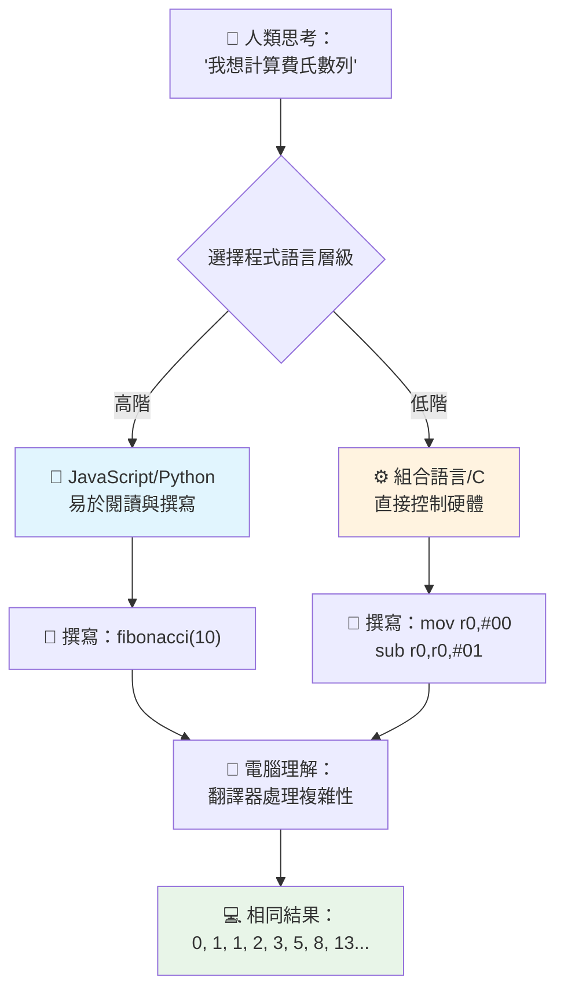
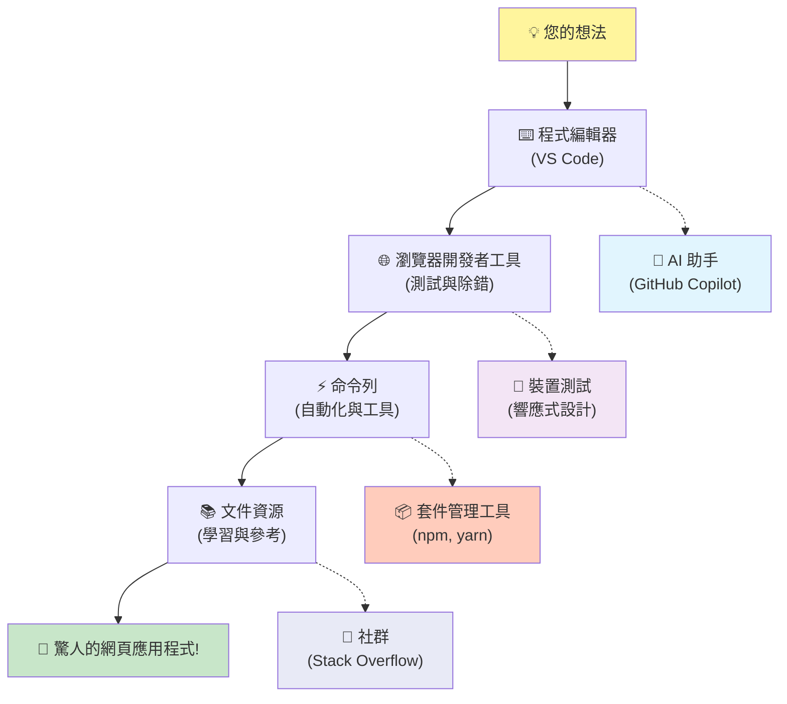
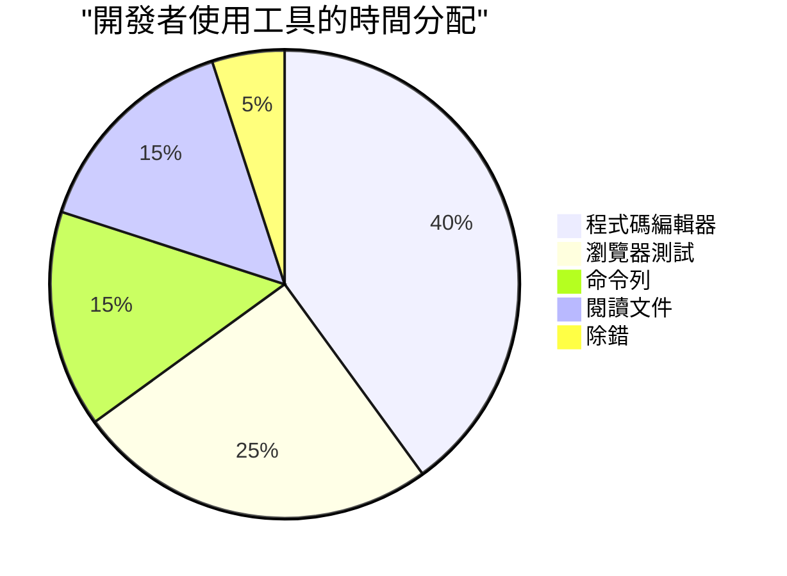

# 程式語言與現代開發工具入門

嗨，未來的開發者！👋 我能告訴你一件每天都讓我感到興奮的事情嗎？你即將發現，程式設計不只是關於電腦 —— 它是擁有真正超能力，將你最狂野的創意變為現實的能力！

你知道當你使用你最喜歡的應用程式時，一切完美契合的那一刻嗎？當你點擊一個按鈕，發生了某種絕對神奇的事情，讓你忍不住說「哇，他們到底是怎麼做到的？」那麼，正是像你一樣的人 —— 可能半夜兩點坐在他們最愛的咖啡店，喝著第三杯濃縮咖啡 —— 寫出了創造那份魔法的程式碼。接下來要讓你震驚的是：到本課程結束時，你不僅會了解他們如何做到，還會迫不及待想自己試試看！

聽著，如果程式設計現在感覺令人生畏，我完全理解。當我剛開始時，我真的以為你得是那種數學天才，或是從五歲開始寫程式的人。但有件事徹底改變了我的觀點：程式設計就像學會用一種新語言交談一樣。你先學「你好」和「謝謝」，接著學點單咖啡，不久後你就在進行深度哲學討論！只不過這次，你是在跟電腦交談，說真的？它們是你能遇過最有耐心的對話夥伴 —— 從不批評你的錯誤，並且總是樂於重試！

今天，我們要探索那些讓現代網頁開發不只是可能而且令人上癮的神奇工具。我說的是Netflix、Spotify，以及你最愛的獨立應用工作室每天都在使用的編輯器、瀏覽器和工作流程。而接下來會讓你跳起來歡呼的是：這些專業級、業界標準的工具大多完全免費！


> Sketchnote 由 [Tomomi Imura](https://twitter.com/girlie_mac) 製作


## 讓我們看看你已經知道什麼！

在我們跳入有趣的內容前，我很好奇 —— 你對這個程式設計世界已有多少了解？而且聽著，如果你看著這些問題想「我根本一點頭緒都沒有」，這不只沒問題，簡直完美！這代表你在正確的地方。把這個小考當作運動前的暖身 —— 我們只是要喚醒那顆大腦的肌肉！

[參加前置測驗](https://ff-quizzes.netlify.app/web/)

## 我們即將一起展開的冒險

好吧，我真的因為我們今天要探索的內容激動得跳腳了！說真的，我真希望我能看到你當某些概念突然理解時的表情。這是我們將一起踏上的精彩旅程：

- **什麼是程式設計（以及為什麼它是最酷的東西！）** —— 我們將發現程式碼就是無形的魔法，驅動著你周圍的一切，從那個神秘辨識星期一早晨的鬧鐘，到完美為你推薦Netflix影片的演算法
- **程式語言及其驚人的個性** —— 想像你走進一個派對，每個人都有完全不同的超能力和解決問題的方式。程式語言世界正是如此，你會愛上認識它們！
- **構成數位魔法的基本積木** —— 把這些看作終極創意積木組。了解這些積木如何組合後，你會發現你能構建出任何你想像的東西
- **專業工具讓你感覺像拿到巫師魔杖** —— 我不是誇張 —— 這些工具真的會讓你感覺自己有超能力，而最好的是？它們也是專業人士使用的同一套！

> 💡 **重點是**：今天別想著要記住所有東西！現在，我只是想讓你感受到可能帶來的那股興奮。細節會隨著我們一起練習自然留下 —— 這才是真正的學習方式！

> 你也可以在 [Microsoft Learn](https://learn.microsoft.com/en-us/learn/modules/web-development-101/introduction-programming/?WT.mc_id=academic-77807-sagibbon) 上完成這堂課！

## 那麼，什麼才是*程式設計*呢？

好，讓我們解答這個價值百萬美元的問題：程式設計，到底是什麼？

我給你一個徹底改變我對這件事看法的故事。上週，我試著向我媽媽說明如何使用我們的新智慧電視遙控器。我發現自己會說：「按紅色按鈕，不是大紅色，是左邊的小紅色……不，不是那邊是你的另外一隻左手……好，現在按住兩秒，不是一秒，也不是三秒……」聽起來熟悉嗎？😅

這就是程式設計！它是給一個非常強大但需要完全明確指令的東西，極其詳細且循序漸進的教學藝術。只不過你不是在跟你的媽媽說（她還能問「哪個紅色按鈕？！」），而是在跟電腦說（電腦只會依照你說的做，哪怕你說的不是你本意）。

當我第一次學這個時，有件事讓我震驚：電腦其實核心相當簡單。它們只懂兩種東西 —— 1 和 0，基本上就是「是」和「否」或者「開」和「關」。就這樣！但接下來的魔法是 —— 我們不需要像在《駭客任務》裡那樣只用 1 和 0 來說話。這就是**程式語言**出場的時刻。它們像是世界上最棒的翻譯員，將你完全正常的人類思緒轉換成電腦語言。

而每天早上醒來仍讓我起雞皮疙瘩的是：你生活中所有數位事物，都是從跟你一樣的人開始，可能穿著睡衣，一杯咖啡在手，打著程式碼。那個讓你看起來完美無瑕的 Instagram 濾鏡？有人寫了那段程式。讓你找到新愛歌推薦的演算法？開發者打造的。幫你跟朋友分帳的應用程式？沒錯，有人想「這太煩了，我可以改善它」，於是……他們做到了！

當你學會寫程式，你不只是學了一項新技能 —— 你成為一群令人敬佩的問題解決者的一份子，他們每天都在思考：「如果我能造出點什麼讓別人生活更好一點怎麼辦？」說真的，還有什麼比這更酷的嗎？

✅ **有趣的小尋寶**：有空時查查這個超酷的故事 —— 你覺得世界上第一位電腦程式設計師是誰？給你一個提示：可能不是你想像的那位！他/她的故事相當精彩，證明了編程一直是關於創意思考與跳脫框架。

### 🧠 **檢視時刻：你感覺如何？**

**花點時間想想：**
- 「給電腦下指令」的想法現在對你有意義嗎？
- 你是否想到日常工作中有想自動化的？
- 對程式設計整體，你腦海中浮現了什麼問題？

> **記得**：一開始如果有些概念感到模糊是完全正常的。學程式就像學新語言 —— 大腦建立神經迴路需要時間。你做得很好！

## 程式語言就像不同風味的魔法

好，這可能聽起來怪，但請撐著聽我說 —— 程式語言很像不同類型的音樂。想想看：你有爵士樂，風格流暢且即興，搖滾強烈直接，古典優雅嚴謹，嘻哈創意且富表現力。每種風格都有自己的氛圍、熱愛者社群，而且適合不同心情與場合。

程式語言也是同理！你不會用同一種語言寫休閒手機遊戲，卻用那語言分析大量氣候資料；就像你不會在瑜珈課放死亡金屬（嗯，多數瑜珈課啦！😄）。

但每次想起這點都讓我很震撼：這些語言就像坐在你旁邊的最有耐心且聰明的翻譯官。你用自然的人類思維表達想法，他們負責將其翻譯成電腦說的 1 和 0。就像一個既通曉「人類創意」又精通「電腦邏輯」的朋友 —— 他永不疲倦、不喝咖啡提神，也不會因為你問同一問題兩次而生氣！

### 流行的程式語言及用途


| 語言 | 最適合 | 為何受歡迎 |
|----------|----------|------------------|
| **JavaScript** | 網頁開發、使用者介面 | 可於瀏覽器執行，驅動互動網站 |
| **Python** | 資料科學、自動化、人工智慧 | 易讀易學，強大函式庫支持 |
| **Java** | 企業應用、Android應用 | 跨平台，大型系統穩健 |
| **C#** | Windows應用、遊戲開發 | 強大微軟生態系支持 |
| **Go** | 雲端服務、後端系統 | 快速、簡潔，為現代運算設計 |

### 高階語言 vs. 低階語言

說實話，這個概念一開始真的讓我頭腦短路，所以我要分享讓我頓悟的類比 —— 我希望你也能有同感！

想像你到一個不會講當地語言的國家，急需找最近的洗手間（我們都有過這種經驗，對吧？😅）：

- **低階程式設計** 就像學會當地方言，能跟角落賣水果的阿嬤用文化暗示、本地俚語和只有本地人成長才懂的笑話熱絡交談。非常厲害且高效率……如果你流利的話！但當你只想找廁所時，會相當崩潰。

- **高階程式設計** 就像有個超棒的當地朋友懂你心思。你用簡單英語說「我真的想找洗手間」時，他們會處理所有文化差異，並用你理解的方式指路。

換成程式語言術語：
- **低階語言**（像是組合語言或C）讓你能跟電腦硬體細緻對話，但你得以機器思考，嗯……這代表得大翻轉你的腦袋！
- **高階語言**（像 JavaScript、Python 或 C#）讓你用人類思維，幕後它們替你翻譯成機器語言。此外，它們擁有超熱情的社群，裡面充滿了解當新手是怎麼一回事、且真心想幫助的人！

猜我建議你從哪個開始？😉 高階語言就像訓練輪，你可能一輩子都不想拆掉，因為它們讓整個過程更愉快！


### 讓我示範為什麼高階語言更親切

好，我即將示範一個完美展示我為何愛上高階語言的範例，但首先 —— 請你答應我一件事。當你看到第一個程式碼範例時，不要慌！它應該看起來有點嚇人。這正是我要說的重點！

我們會看到同一個工作用兩種完全不同風格寫成的程式。它們都會產生所謂的費波那契數列 —— 這是個漂亮的數學模式，每個數字都是前兩個數字的和：0、1、1、2、3、5、8、13……（趣味知識：你會在自然界中看到這個數列 —— 葵花子螺旋、松果紋理，甚至星系形成都用得到！）

準備好看差異了嗎？出發！

**高階語言（JavaScript）— 友善人類：**

```javascript
// 第一步：基本的費波那契設置
const fibonacciCount = 10;
let current = 0;
let next = 1;

console.log('Fibonacci sequence:');
```

**這段程式碼做了什麼：**
- **宣告** 一個常數指定我們想要產生多少個費波那契數
- **初始化** 兩個變數用來追蹤序列中的當前與下一個數字
- **設定** 開始值 (0 與 1) 定義費波那契模式
- **顯示** 標題訊息，以辨識輸出結果

```javascript
// 步驟 2：使用迴圈生成序列
for (let i = 0; i < fibonacciCount; i++) {
  console.log(`Position ${i + 1}: ${current}`);
  
  // 計算序列中的下一個數字
  const sum = current + next;
  current = next;
  next = sum;
}
```

**解析過程：**
- **用 `for` 迴圈** 遍歷序列中的每個位置
- **用範本字串** 顯示每個數字與其位置
- **計算** 下個費波那契數字 = 當前數字 + 下一個數字
- **更新** 追蹤變數以進入下一輪迭代

```javascript
// 第3步：現代函數式方法
const generateFibonacci = (count) => {
  const sequence = [0, 1];
  
  for (let i = 2; i < count; i++) {
    sequence[i] = sequence[i - 1] + sequence[i - 2];
  }
  
  return sequence;
};

// 使用範例
const fibSequence = generateFibonacci(10);
console.log(fibSequence);
```

**以上範例中，我們：**
- **用現代箭頭函數語法創建** 可重用函數
- **建立** 陣列來儲存完整數列，而非一個個顯示
- **透過陣列索引** 從之前的值計算每個新數字
- **回傳** 完整序列，方便程式其他部分靈活使用

**低階語言（ARM組合語言）— 電腦友善：**

```assembly
 area ascen,code,readonly
 entry
 code32
 adr r0,thumb+1
 bx r0
 code16
thumb
 mov r0,#00
 sub r0,r0,#01
 mov r1,#01
 mov r4,#10
 ldr r2,=0x40000000
back add r0,r1
 str r0,[r2]
 add r2,#04
 mov r3,r0
 mov r0,r1
 mov r1,r3
 sub r4,#01
 cmp r4,#00
 bne back
 end
```

注意 JavaScript 版本讀起來幾乎像英文指令，但組合語言版本使用隱晦的命令直接操控電腦處理器。兩者達成完全相同的任務，但高階語言對人類來說更容易理解、撰寫和維護。

**你會發現的關鍵差異：**
- **可讀性**：JavaScript 使用像 `fibonacciCount` 這樣具描述性的名稱，而 Assembly 則使用像 `r0`、`r1` 這種晦澀的標籤
- **註解**：高階語言鼓勵加上說明性的註解，使程式碼自我說明
- **結構**：JavaScript 的邏輯流程符合人類思考問題的步驟
- **維護**：針對不同需求更新 JavaScript 版本簡單明瞭  

✅ **關於費波那契數列**：這個絕美的數字模式（每個數字是前兩數的和：0、1、1、2、3、5、8……）在大自然中幾乎無處不在！你可以在向日葵的螺旋狀、松果的圖案、鹦鹉螺的曲線，甚至在樹枝的生長方式中找到它。數學和程式碼如何幫助我們理解並重新創造自然創造美的模式，真是令人驚嘆！


## 造就奇蹟的構件

好，現在你已經見識過程式語言的運作方式，讓我們拆解組成每個程式的基礎零件。可把它們想成你最愛食譜中的必備材料——只要你了解每個材料的用途，就能閱讀並撰寫幾乎任何語言的程式碼！

這有點像學習程式的文法。還記得學校裡學過名詞、動詞和句子結構嗎？程式有它自己的文法，而且說真的，比英文文法還要合邏輯且寬容得多！😄

### 陳述句（Statements）：一步步的指令

先從 **陳述句** 講起，陳述句就像和電腦對話的句子。每個陳述句告訴電腦做一件特定的事，就像給方向：「這裡左轉」、「紅燈停」、「停在那個車位」。

我喜歡陳述句的地方是它們通常非常易讀。看這裡：

```javascript
// 執行單一動作的基本敘述
const userName = "Alex";                    
console.log("Hello, world!");              
const sum = 5 + 3;                         
```

**這段代碼做了什麼：**
- **宣告**一個常數變數用來存使用者姓名
- **顯示**一則問候訊息在控制台輸出
- **計算**並儲存數學運算的結果

```javascript
// 與網頁互動的語句
document.title = "My Awesome Website";      
document.body.style.backgroundColor = "lightblue";
```

**一步步發生了什麼：**
- **修改**瀏覽器標籤頁中顯示的網頁標題
- **更改**整個網頁主體的背景色

### 變數（Variables）：程式的記憶系統

真的，**變數** 是我最喜歡教的概念之一，因為它們很像你每天都在用的東西！

想想你的手機通訊錄。你不記住每個電話號碼，而是存「媽媽」、「好朋友」或「營業到凌晨兩點的披薩店」，手機幫你記住真正的號碼。變數就是這樣！它們像帶標籤的容器，你的程式可以存資訊，然後用有意義的名字取回。

最酷的是：變數在程式執行時可以變化（所以叫變數嘛～）。就像你會更新披薩店的聯絡方式，變數也能隨著程式獲得新資訊或情況改變而更新！

看這例子，超簡單而美妙：

```javascript
// 第一步：建立基本變數
const siteName = "Weather Dashboard";        
let currentWeather = "sunny";               
let temperature = 75;                       
let isRaining = false;                      
```

**理解這些概念：**
- **使用** `const` 儲存不會變的值（例如網站名稱）
- **使用** `let` 儲存程序中可能改變的值
- **指派**不同資料型態：字串（文字）、數字、布林值（true/false）
- **挑選**清楚描述變數內容的名稱

```javascript
// 步驟 2：使用物件來群組相關資料
const weatherData = {                       
  location: "San Francisco",
  humidity: 65,
  windSpeed: 12
};
```

**上面的程式碼裡，我們：**
- **建立**一個物件用來整理相關的天氣資訊
- **用**一個變數名稱組織多組資料
- **用**鍵值對明確標示每個資訊項目

```javascript
// 第3步：使用和更新變數
console.log(`${siteName}: Today is ${currentWeather} and ${temperature}°F`);
console.log(`Wind speed: ${weatherData.windSpeed} mph`);

// 更新可變的變數
currentWeather = "cloudy";                  
temperature = 68;                          
```

**我們來了解各部分：**
- **用**模板字串 `${}` 語法顯示資訊
- **用**點記號法 (`weatherData.windSpeed`) 讀取物件屬性
- **更新**使用 `let` 宣告的變數反映變化的條件
- **結合**多個變數來製造有意義的訊息

```javascript
// 第4步：現代解構賦值，讓程式碼更簡潔
const { location, humidity } = weatherData; 
console.log(`${location} humidity: ${humidity}%`);
```

**你需要知道的技巧：**
- **用**解構賦值從物件中取出特定屬性
- **自動建立**同名的新變數
- **減少**繁瑣重複使用點記號法的代碼

### 控制流程（Control Flow）：教程式思考

這裡編程真的開始令人驚艷！**控制流程** 就是教你的程式做出聰明決策，就像你每天不假思索地做的事一樣。

想像今天早上你可能想，「如果下雨，我帶傘；如果冷，我穿外套；如果快遲到了，就不吃早餐，路上喝咖啡。」你的大腦每天自然根據這種「如果-那麼」的邏輯運作好幾十次！

這讓程式感覺聰明且有活力，而不是死板又無聊。它們真的可以看情況、評估狀況，再做出適當反應。就像給程式一個能適應並做選擇的大腦！

想看看這種神奇怎麼運作？看這個：

```javascript
// 第一步：基本條件邏輯
const userAge = 17;

if (userAge >= 18) {
  console.log("You can vote!");
} else {
  const yearsToWait = 18 - userAge;
  console.log(`You'll be able to vote in ${yearsToWait} year(s).`);
}
```

**這段代碼做了什麼：**
- **檢查**使用者是否達到投票年齡
- **依條件執行**不同程式區塊
- **算出**若未滿 18 歲需多久才能投票並顯示
- **針對每種情況**給出明確且有用的回饋

```javascript
// 步驟 2：使用邏輯運算子的多重條件
const userAge = 17;
const hasPermission = true;

if (userAge >= 18 && hasPermission) {
  console.log("Access granted: You can enter the venue.");
} else if (userAge >= 16) {
  console.log("You need parent permission to enter.");
} else {
  console.log("Sorry, you must be at least 16 years old.");
}
```

**來拆解一下：**
- **用** `&&`（且）組合多條件
- **用** `else if` 建立有層次的多條件判斷
- **用** 最後的 `else` 包攬所有未涵蓋狀況
- **給予**每種情況清楚且可操作的反饋

```javascript
// 步驟3：使用三元運算子的簡潔條件判斷
const votingStatus = userAge >= 18 ? "Can vote" : "Cannot vote yet";
console.log(`Status: ${votingStatus}`);
```

**你得記得：**
- **用** 三元運算子 (`? :`) 寫簡單的兩選一條件
- **語法是**先寫條件、接著 `?`、接著條件為真時結果、然後 `:`、最後條件為假時結果
- **用於**依條件選擇值時非常好用

```javascript
// 第4步：處理多個特定情況
const dayOfWeek = "Tuesday";

switch (dayOfWeek) {
  case "Monday":
  case "Tuesday":
  case "Wednesday":
  case "Thursday":
  case "Friday":
    console.log("It's a weekday - time to work!");
    break;
  case "Saturday":
  case "Sunday":
    console.log("It's the weekend - time to relax!");
    break;
  default:
    console.log("Invalid day of the week");
}
```

**這段程式實現了：**
- **比對**變數值對應多個具體案例
- **依案例性質**將相似狀況分組（平日 vs 假日）
- **找到匹配時**執行相對應程式區塊
- **用** `default` 例外狀況處理未預期的值
- **用** `break` 結束該案例，避免繼續執行到下一個案例

> 💡 **現實生活比喻**：把控制流程想成全球最有耐心的導航，一路指引你：「如果主街交通堵塞，就走高速公路；如果高速公路封路，就改走風景路。」程式也用相同條件邏輯，智慧且靈活回應各種狀況，總是提供使用者最佳體驗。

### 🎯 **概念測驗：基礎構件大考驗**

**來看看你吸收得如何：**
- 你能用自己的話解釋變數和陳述句有什麼不同嗎？
- 想一個生活中的例子會用到 if-then 決策（比如投票例子）
- 程式邏輯中，你發現了什麼讓你驚訝的地方？

**快速增強信心：**

✅ **接下來我們要做什麼**：我們將繼續深入這些概念，一起踏上這個難以置信的學習旅程！現在專注感受前方充滿無限可能的激動吧。具體技能會隨練習自然養成——我保證，比你想像中還要有趣多了！

## 必備法寶

好啦，說真的，現在我快要興奮到受不了！🚀 我們要談談那些讓你有如獲得數位太空船鑰匙的超讚工具。

你知道廚師有種刀具拿起來就像手的一部分嗎？音樂家有把吉他彈起來就像會唱歌的樂器？開發者也有屬於自己的神奇工具，最讓我覺得不可思議的是——它們大多是完全免費的！

我坐不住了，想著要跟你分享這些工具，因為它們徹底改變了我們寫軟體的方式。我們談的是能幫你寫程式碼的 AI 助手（真的不是開玩笑！）、只要有 Wi-Fi 就能從任何地方架設應用程式的雲端環境，以及具有 X 光視力般強大除錯工具。

更刺激的是：這些不是你練習完就不用的「新手工具」。這些就是 Google、Netflix 和你愛的獨立 APP 工作室專業開發者就在用的真槍實彈。用它們你會覺得自己超級專業！


### 程式編輯器和 IDE：你新的數位最佳夥伴

來談談程式編輯器——它們快變成你新歡的打卡聖地！把它想成你個人專屬的程式創作聖殿，絕大多數時間都會在這裡打造與完善數位作品。

現代編輯器的魔力就在於：它們不只是高級文字編輯器。它們就像有最聰明且支持你的程式導師 24 小時陪伴，錯字還沒出現就幫你抓到，抄捷徑讓你看起來像天才，還幫你理解每段代碼的作用，甚至有的能預測你下一步會打什麼，主動幫你完成！

我還記得第一次用上自動補完時，覺得自己活在未來。一開始打字，編輯器就像在說：「嘿，你是在想用這個函式吧？它剛好能幫你做這件事！」這簡直就是讀心師當程式夥伴！

**讓編輯器如此厲害的祕密是什麼？**

現代程式編輯器擁有豐富功能，大幅提升生產力：

| 功能 | 它做什麼 | 為什麼有用 |
|---------|--------------|--------------|
| **語法高亮** | 用顏色區分程式碼不同部分 | 讓程式碼更容易閱讀與找錯 |
| **自動補完** | 輸入時自動建議代碼 | 加快編程速度並減少錯字 |
| **除錯工具** | 幫你找錯誤並修正 | 省下數小時的除錯時間 |
| **擴充套件** | 加入專業功能 | 依技術需求客製化編輯器 |
| **AI 助手** | 建議程式碼與說明 | 加快學習及提升效率 |

> 🎥 **影片資源**：想看看這些工具如何運作？觀看這個[工具介紹影片](https://youtube.com/watch?v=69WJeXGBdxg)，有完整的說明！

#### 網頁開發推薦編輯器

**[Visual Studio Code](https://code.visualstudio.com/?WT.mc_id=academic-77807-sagibbon)**（免費）  
- 網頁開發者中最受歡迎  
- 超棒的擴充套件生態系  
- 內建終端機與 Git 整合  
- **必裝擴充套件**：  
  - [GitHub Copilot](https://marketplace.visualstudio.com/items?itemName=GitHub.copilot) - AI 程式碼建議  
  - [Live Share](https://marketplace.visualstudio.com/items?itemName=MS-vsliveshare.vsliveshare) - 實時協作  
  - [Prettier](https://marketplace.visualstudio.com/items?itemName=esbenp.prettier-vscode) - 自動格式化程式碼  
  - [Code Spell Checker](https://marketplace.visualstudio.com/items?itemName=streetsidesoftware.code-spell-checker) - 拼字錯誤檢查

**[JetBrains WebStorm](https://www.jetbrains.com/webstorm/)**（付費，學生免費）  
- 進階除錯和測試工具  
- 智慧程式碼補完  
- 內建版本控制

**雲端 IDE**（價格不一）  
- [GitHub Codespaces](https://github.com/features/codespaces) - 在瀏覽器裡完整 VS Code  
- [Replit](https://replit.com/) - 方便學習和分享程式碼  
- [StackBlitz](https://stackblitz.com/) - 即時全端網頁開發

> 💡 **入門建議**：從 Visual Studio Code 開始吧——它免費且業界廣泛使用，有龐大社群提供豐富教學與擴充套件。

### 網頁瀏覽器：你秘密的開發實驗室

好，準備好被徹底震撼了嗎！你可能一直用瀏覽器滑社群、看影片，沒想到它竟然藏著這座超強祕密開發實驗室，等待你來探索！

每次你在網頁上右鍵點選「檢查」元素，就打開了隱藏的開發者工具，比我以前花大錢買的專業軟體還厲害。就像發現平凡廚房後面藏了個頂尖大廚的實驗室一樣！
第一次有人向我展示瀏覽器開發者工具（DevTools）時，我花了差不多三個小時，光是在那裡點來點去，然後一直說：「等等，它居然也能做到這個？！」你真的可以即時編輯任何網站，精準看到每個元素載入的速度，測試網站在不同裝置上的呈現，甚至像專業人士一樣除錯 JavaScript。這簡直讓人驚呆了！

**瀏覽器為什麼是你的秘密武器：**

當你建立網站或網頁應用程式時，你需要看到它在真實世界中的樣貌與行為。瀏覽器不僅能顯示你的作品，還提供有關效能、可及性及潛在問題的詳細回饋。

#### 瀏覽器開發者工具（DevTools）

現代瀏覽器包含完整的開發套件：

| 工具類別 | 功能 | 範例使用情境 |
|----------|-------|--------------|
| **元素檢視器** | 即時檢視和編輯 HTML/CSS | 調整樣式，立刻看到結果 |
| **主控台** | 查看錯誤訊息與測試 JavaScript | 除錯問題並試驗程式碼 |
| **網路監控器** | 追蹤資源載入狀況 | 優化效能和載入時間 |
| **可及性檢查器** | 測試包容性設計 | 確保所有使用者皆可使用 |
| **裝置模擬器** | 預覽不同螢幕尺寸 | 測試響應式設計無需多台裝置 |

#### 推薦用於開發的瀏覽器

- **[Chrome](https://developers.google.com/web/tools/chrome-devtools/)** — 業界標準 DevTools，具豐富文件
- **[Firefox](https://developer.mozilla.org/docs/Tools)** — 出色的 CSS Grid 與可及性工具
- **[Edge](https://docs.microsoft.com/microsoft-edge/devtools-guide-chromium/?WT.mc_id=academic-77807-sagibbon)** — 基於 Chromium，結合微軟開發資源

> ⚠️ **重要測試技巧**：務必在多種瀏覽器中測試你的網站！在 Chrome 上完美的效果可能在 Safari 或 Firefox 看起來完全不同。專業開發者會跨所有主要瀏覽器測試，確保用戶體驗一致。


### 命令列工具：開啟你的開發超能力之門

好了，讓我們坦白談談命令列，因為我想讓你聽聽真正懂這玩意兒的人怎麼說。第一次看到命令列的時候——這個恐怖的黑色螢幕，閃爍的文字——我真的想，「絕對不行！這感覺像是1980年代駭客電影裡面才會出現的東西，我絕對不夠聰明！」😅

但現在我希望有人當時對我說這些話，我現在也想對你說：命令列不可怕——它其實就像是直接跟你的電腦對話。想像一下，用一個有漂亮圖片與選單的美食訂購 App（簡單又好用）跟走進你最愛的本地餐廳，由了解你口味的主廚直接為你「驚喜料理」的差異。

命令列就是開發者施展魔法的地方。你輸入幾個看似神奇的字（其實只是指令，但就是覺得神奇！），按下回車，BOOM —— 你建立了整個專案結構，安裝了世界各地強大工具，或者把你的應用部署到網路上讓成千上萬人看到。你一嘗過這種力量，真的會上癮！

**為什麼命令列會成為你最愛的工具：**

雖然圖形介面適合許多任務，但命令列在自動化、精準與速度方面無出其右。許多開發工具主要透過命令列操作，學會有效使用可以大幅提高生產力。

```bash
# 第一步：建立並進入專案目錄
mkdir my-awesome-website
cd my-awesome-website
```

**這段程式碼的作用：**
- **建立** 一個名為 "my-awesome-website" 的新資料夾作為專案
- **進入** 新建立的資料夾開始工作

```bash
# 第2步：使用 package.json 初始化專案
npm init -y

# 安裝現代開發工具
npm install --save-dev vite prettier eslint
npm install --save-dev @eslint/js
```

**一步步說明：**
- 使用 `npm init -y` **初始化** 新的 Node.js 專案並使用預設設定
- **安裝** Vite 這個現代化建置工具，用於快速開發與生產建置
- **加入** Prettier 進行自動格式化，ESLint 進行程式碼品質檢查
- 使用 `--save-dev` 參數表示這些只是開發階段的依賴

```bash
# 步驟 3：建立專案結構和檔案
mkdir src assets
echo '<!DOCTYPE html><html><head><title>My Site</title></head><body><h1>Hello World</h1></body></html>' > index.html

# 啟動開發伺服器
npx vite
```

**以上步驟，我們已經：**
- **組織** 專案，創建了獨立的原始碼和資源資料夾
- **生成** 一個基本的 HTML 檔案，具備完整文件結構
- **啟動** Vite 開發伺服器，實現即時重載與模組熱更換

#### 網頁開發必備命令列工具

| 工具 | 目的 | 為什麼你需要它 |
|------|------|-----------------|
| **[Git](https://git-scm.com/)** | 版本控制 | 追蹤變更，團隊協作，備份工作 |
| **[Node.js & npm](https://nodejs.org/)** | JavaScript 執行環境與套件管理 | 在瀏覽器外執行 JS，安裝現代開發工具 |
| **[Vite](https://vitejs.dev/)** | 建置工具與開發伺服器 | 極高速開發與模組熱更換 |
| **[ESLint](https://eslint.org/)** | 程式碼品質 | 自動發現並修正 JavaScript 問題 |
| **[Prettier](https://prettier.io/)** | 程式碼格式化 | 保持程式碼一致且易讀 |

#### 平台專屬選項

**Windows：**
- **[Windows Terminal](https://docs.microsoft.com/windows/terminal/?WT.mc_id=academic-77807-sagibbon)** — 現代且功能豐富的終端機
- **[PowerShell](https://docs.microsoft.com/powershell/?WT.mc_id=academic-77807-sagibbon)** 💻 — 強大的腳本環境
- **[命令提示字元(Command Prompt)](https://docs.microsoft.com/windows-server/administration/windows-commands/?WT.mc_id=academic-77807-sagibbon)** 💻 — 傳統 Windows 命令列

**macOS：**
- **[終端機(Terminal)](https://support.apple.com/guide/terminal/)** 💻 — 內建終端機應用程式
- **[iTerm2](https://iterm2.com/)** — 功能強化終端機

**Linux：**
- **[Bash](https://www.gnu.org/software/bash/)** 💻 — 標準 Linux shell
- **[KDE Konsole](https://docs.kde.org/trunk5/en/konsole/konsole/index.html)** — 高階終端模擬器

> 💻 = 作業系統預先安裝

> 🎯 **學習路徑**：從基本指令如 `cd`（切換目錄）、`ls` 或 `dir`（列出清單）、`mkdir`（建立資料夾）開始。實作現代工作流程常用指令如 `npm install`、`git status`、`code .`（在 VS Code 開啟當前目錄）。習慣之後，自然會接觸並吸收較高級的指令與自動化技巧。


### 文件：你永遠可用的學習導師

來，讓我透露一個小祕密，讓你對自己是新手這件事感覺輕鬆很多：即使是最資深的開發者，也花大量時間閱讀文件。這不是他們不懂，而是一種智慧的表現！

把文件想像成世界上最有耐心又知識淵博的老師，全天候24/7待命。凌晨2點被問題卡住？文件就在那裡，給你溫暖的虛擬擁抱和正確答案。想學剛剛大家都在討論的酷新功能？文件有步驟範例支援你。想知道為什麼某件事情會那樣運作？對了，那些文件能幫你恍然大悟！

讓我徹底改觀的一件事是：網頁開發發展超快，沒有人（我說絕對沒有人！）能背下全部內容。我看過超過15年的資深工程師還在查基本語法，你知道嗎？這不是丟臉，是聰明！重要的不是記憶力多好，而是知道在哪裡快速找到可靠答案並懂得運用。

**真正的魔法在這裡：**

專業開發者花大量時間閱讀文件，不是因為不懂，而是因為網頁開發環境變動飛快，持續學習才是關鍵。優秀文件不只告訴你「怎麼用」，還講「為什麼」和「何時用」。

#### 必備文件資源

**[Mozilla 開發者網路 (MDN)](https://developer.mozilla.org/docs/Web)**
- 網頁技術文件的黃金標準
- HTML、CSS、JavaScript 詳盡指南
- 含有瀏覽器相容性資訊
- 實用範例與互動示範

**[Web.dev](https://web.dev)**（由 Google 提供）
- 現代網頁開發最佳實踐
- 效能優化指南
- 可及性與包容性設計原則
- 實務案例研究

**[微軟開發者文件](https://docs.microsoft.com/microsoft-edge/#microsoft-edge-for-developers)**
- Edge 瀏覽器開發資源
- 漸進式網頁應用指南
- 跨平台開發見解

**[Frontend Masters 學習路徑](https://frontendmasters.com/learn/)**
- 結構化學習課程
- 業界專家影音課程
- 實作程式練習

> 📚 **研讀策略**：不要死背文件，而是學會高效導航。書籤常用參考資料，練習用搜尋功能快速找到訊息。

### 🔧 **工具掌握自我檢測：你最有感的是什麼？**

**花點時間思考：**
- 你最想先嘗試哪個工具？（沒有錯的答案！）
- 命令列對你來說還是令人畏懼，還是開始有興趣了？
- 你能想像用瀏覽器 DevTools 窺探你最愛網站的內幕嗎？


> **有趣觀察**：大多數開發者約40%時間使用程式編輯器，但你會注意到，他們花很多時間在測試、學習與解決問題。程式設計不只是寫碼，更是打造體驗！

✅ **值得思考**：不同工具如何區分開發與設計？這很像建築師設計漂亮的房子，和承包商實際蓋屋的差別。兩者都很重要，但工具箱不同！這種思考能幫助你看到網站如何誕生的全貌。

## GitHub Copilot Agent 挑戰 🚀

使用 Agent 模式完成以下挑戰：

**說明：** 探索現代程式碼編輯器或 IDE 的功能，並示範它如何改進你作為網頁開發者的工作流程。

**提示：** 選擇一個編輯器或 IDE（例如 Visual Studio Code、WebStorm 或雲端 IDE）。列出三個幫助你撰寫、除錯或維護程式碼更有效率的特色或外掛，並簡述它如何提升你的工作流程。

---

## 🚀 挑戰

**好了，偵探，準備好你的第一個案件了嗎？**

有了這個超棒基礎，我有個冒險要帶你看編程世界的多元與迷人。放心，這還不是寫程式的階段，不用緊張！想像自己是語言偵探，正在接手第一個精彩案件！

**你的任務，如你願意接受：**
1. **成為語言探險家**：挑選三種來自完全不同領域的程式語言——或許一個用於網站開發、一個用於手機應用，另一個用於科學數據處理。找出相同簡單任務的程式碼範例。我保證你會驚訝它們完成相同事情的方式竟然長得這麼不同！

2. **追溯起源故事**：每種語言有何獨特？酷事實是，每個程式語言都是因為有人想著「這有更好的方式來解決這個特定問題」。你能找出那些問題是什麼嗎？有些故事真的是非常吸引人！

3. **認識社群**：感受各語言社群的熱情與友善。有些有百萬名開發者分享知識互助，有些較小但緊密且支持彼此。你會很喜歡看這些社群各自的個性！

4. **憑直覺選擇**：哪種語言現在感覺最親近你？別擔心選擇「完美」與否——聽從你的直覺！這裡沒有錯的答案，也可以之後再探索其他。

**加碼偵探任務**：試著找出每種語言主力開發的主要網站或應用。保證讓你震驚，知道 Instagram、Netflix 或那款讓你停不下來玩的手機遊戲背後用的語言！

> 💡 **記住**：今天你不是要成為專家，只是在決定落腳之前認識社區。放輕鬆，享受探索，讓好奇心帶路！

## 讓我們慶祝你的發現！

天哪，你今天吸收了這麼多厲害的資訊！我真心期待看到你對這趟旅程的記憶。記得——這不是一場考試，不用完美。這更像是一場派對，慶祝你在即將深入的神奇世界中學到的所有酷東西！

[參加課後測驗](https://ff-quizzes.netlify.app/web/)

## 複習與自學

**慢慢來，盡情探索且享受學習樂趣！**
你今天已經學習了很多，這是一件值得驕傲的事情！接下來就是有趣的部分——探索那些激發你好奇心的主題。記得，這不是作業——這是一場冒險！

**深入挖掘你感興趣的領域：**

**親自動手試試程式語言：**
- 訪問你感興趣的 2-3 種語言的官方網站。每一種語言都有它獨特的個性和故事！
- 嘗試一些線上程式碼練習場，如 [CodePen](https://codepen.io/)、[JSFiddle](https://jsfiddle.net/) 或 [Replit](https://replit.com/)。不要害怕嘗試——你不會弄壞任何東西！
- 閱讀你喜歡的語言是如何誕生的。認真說，有些起源故事非常迷人，會幫助你了解語言為什麼會這樣運作。

**熟悉你的新工具：**
- 如果你還沒下載 Visual Studio Code，現在就下載吧——它是免費的，你會喜歡它！
- 花幾分鐘瀏覽擴充功能市集。它就像是你的程式碼編輯器的應用商店！
- 打開瀏覽器的開發者工具，隨便點點。別擔心要理解所有東西——先熟悉它們的存在即可。

**加入社群：**
- 在 [Dev.to](https://dev.to/)、[Stack Overflow](https://stackoverflow.com/) 或 [GitHub](https://github.com/) 追蹤一些開發者社群。程式設計社群對新手非常包容！
- 在 YouTube 上觀看一些適合初學者的程式設計教學影片。許多優秀的創作者都記得剛開始學習時的心情。
- 考慮加入當地的聚會或線上社群。相信我，開發者們非常樂於幫助新手！

> 🎯 **聽我說，這是你要記住的事**：你不必期待自己一夜之間成為編程高手！此刻，你只是剛開始認識這個你即將加入的美妙新世界。放慢腳步，享受這段旅程，並記得——你崇拜的每位開發者，都曾經坐在你現在的位置上，既興奮又可能有些不知所措。這完全正常，也代表你走對了路！

## 作業

[Reading the Docs](assignment.md)

> 💡 **給你作業的小提醒**：我非常希望看到你探索一些我們還沒介紹過的工具！跳過我們已經談過的編輯器、瀏覽器和命令列工具——外面還有一整個驚人的開發工具宇宙等待你發掘。找那些持續維護並擁有活躍且樂於助人的社群的工具（這類工具通常有最棒的教學，而且當你遇到困難需要幫助時，會有人支持你）。

---

## 🚀 你的程式學習旅程時間軸

### ⚡ **接下來 5 分鐘能完成的事**
- [ ] 收藏 2-3 個讓你感興趣的程式語言官網
- [ ] 如果還沒下載，安裝 Visual Studio Code
- [ ] 打開瀏覽器的 DevTools（F12）並隨意點開任何網站
- [ ] 加入一個程式開發社群（Dev.to、Reddit r/webdev 或 Stack Overflow）

### ⏰ **這一小時能完成的事**
- [ ] 完成課後小測並反思你的答案
- [ ] 安裝 VS Code 的 GitHub Copilot 擴充功能
- [ ] 線上用兩種不同的程式語言嘗試寫一個「Hello World」範例
- [ ] 在 YouTube 觀看一段「開發者的一天」類型的影片
- [ ] 開始進行你的程式語言偵探任務（來自挑戰）

### 📅 **你這一週的冒險**
- [ ] 完成作業並探索 3 種全新的開發工具
- [ ] 在社交媒體上追蹤 5 位開發者或程式帳號
- [ ] 嘗試在 CodePen 或 Replit 製作一個小作品（哪怕只是「Hello, [你的名字]！」）
- [ ] 閱讀一篇開發者分享他們程式旅程的部落格文章
- [ ] 參加一場線上聚會或觀看一次程式講座
- [ ] 開始用線上教學學習你選擇的語言

### 🗓️ **你一個月的蛻變**
- [ ] 打造你的第一個小專案（即使是一個簡單的網頁也算！）
- [ ] 為開源專案做點貢獻（從文件修正開始）
- [ ] 指導剛開始學程式的人
- [ ] 建立你的開發者作品集網站
- [ ] 與當地開發社群或讀書會建立連結
- [ ] 開始規劃你的下一個學習里程碑

### 🎯 **最後反思檢視**

**在繼續前，花點時間慶祝一下：**
- 今天讓你對程式設計感到興奮的是什麼？
- 你想先探索哪個工具或概念？
- 你對展開這段程式學習旅程的感覺如何？
- 現在你最想問一位開發者的問題是什麼？


> 🌟 **記住**：每位專家也曾是初學者。每位資深開發者當初都曾有過和你一樣的感受——興奮、可能有些不知所措，還充滿對未來可能性的好奇。你身處一群了不起的人之中，這段旅程將會非常精彩。歡迎來到美妙的程式世界！🎉

---

<!-- CO-OP TRANSLATOR DISCLAIMER START -->
**免責聲明**：  
本文件係使用 AI 翻譯服務 [Co-op Translator](https://github.com/Azure/co-op-translator) 進行翻譯。儘管我們努力確保準確性，但請注意自動翻譯結果可能包含錯誤或不準確之處。原始文件的母語版本應被視為權威來源。對於重要資訊，建議採用專業人工翻譯。我們不對因使用本翻譯而產生的任何誤解或誤釋負責。
<!-- CO-OP TRANSLATOR DISCLAIMER END -->